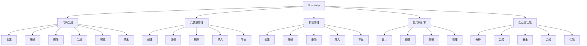

# 权限定义

<cite>
**Referenced Files in This Document**   
- [SmartAbpPermissions.cs](file://src/SmartAbp.Application.Contracts/Permissions/SmartAbpPermissions.cs)
- [SmartAbpPermissionDefinitionProvider.cs](file://src/SmartAbp.Application.Contracts/Permissions/SmartAbpPermissionDefinitionProvider.cs)
- [EntityModelingAppService.cs](file://src/SmartAbp.Application/LowCode/EntityModelingAppService.cs)
- [PermissionAppService.cs](file://src/SmartAbp.PermissionManagement.Service/Application/Permissions/PermissionAppService.cs)
</cite>

## 目录
1. [权限常量组织结构](#权限常量组织结构)
2. [权限层级划分原则](#权限层级划分原则)
3. [权限字符串命名约定](#权限字符串命名约定)
4. [权限定义注册机制](#权限定义注册机制)
5. [添加新权限示例](#添加新权限示例)
6. [应用服务中声明权限](#应用服务中声明权限)
7. [与ABP权限系统集成](#与abp权限系统集成)
8. [权限层级结构图](#权限层级结构图)

## 权限常量组织结构

`SmartAbpPermissions.cs`文件定义了系统权限常量的完整组织结构。该文件采用静态类嵌套的方式组织权限，顶层为`SmartAbpPermissions`静态类，其下包含多个功能模块的静态子类，如`CodeGeneration`、`Metadata`、`Templates`、`LowCode`和`Enterprise`等。每个子类代表一个独立的功能模块，内部定义了该模块相关的权限常量。

权限常量的组织遵循清晰的层次结构，通过嵌套的静态类实现模块化管理。这种设计使得权限定义具有良好的可读性和可维护性，开发人员可以快速定位到特定功能模块的权限定义。同时，该文件还包含一个`Generated`静态类，提供动态权限构建方法，支持为生成的实体动态创建权限字符串。

**Section sources**
- [SmartAbpPermissions.cs](file://src/SmartAbp.Application.Contracts/Permissions/SmartAbpPermissions.cs#L6-L88)

## 权限层级划分原则

权限系统采用三级划分原则：模块级、功能级和操作级。模块级权限作为权限组的根节点，代表一个完整的功能模块，如"代码生成"、"元数据管理"等。功能级权限位于模块级之下，代表模块内的主要功能单元。操作级权限是最细粒度的权限，对应具体的用户操作，如创建、编辑、删除等。

在`SmartAbpPermissionDefinitionProvider`中，通过`AddGroup`方法创建模块级权限组，然后使用`AddPermission`方法添加功能级权限，最后通过`AddChild`方法添加操作级权限。这种层级结构形成了树状的权限体系，支持权限的继承和聚合管理。例如，拥有"代码生成"模块级权限的用户自动拥有该模块下的所有功能和操作权限。

**Section sources**
- [SmartAbpPermissionDefinitionProvider.cs](file://src/SmartAbp.Application.Contracts/Permissions/SmartAbpPermissionDefinitionProvider.cs#L7-L58)

## 权限字符串命名约定

权限字符串采用点分分隔的命名约定，形成清晰的层级结构。命名格式为`模块名.功能名.操作名`，例如`SmartAbp.CodeGeneration.Create`。这种命名方式不仅直观地反映了权限的层级关系，还便于权限字符串的解析和管理。

顶层模块名称使用`GroupName`常量定义，确保一致性。各层级之间通过字符串拼接实现，如`Default`权限由`GroupName`与功能名称拼接而成，操作权限则在`Default`权限基础上追加操作名称。这种设计保证了权限字符串的唯一性和可预测性，同时支持通过前缀匹配进行权限批量管理。

**Section sources**
- [SmartAbpPermissions.cs](file://src/SmartAbp.Application.Contracts/Permissions/SmartAbpPermissions.cs#L8-L88)

## 权限定义注册机制

权限定义通过`SmartAbpPermissionDefinitionProvider`类注册到ABP框架中。该类继承自`PermissionDefinitionProvider`，重写`Define`方法来定义系统权限。在`Define`方法中，首先通过`context.AddGroup`创建权限组，然后为每个功能模块创建对应的权限节点。

注册过程采用链式调用的方式，先创建模块级权限，再逐级添加子权限。每个权限都关联一个本地化字符串，通过`L`方法从资源文件中获取对应的显示名称。这种注册机制与ABP框架的权限系统无缝集成，确保权限定义在应用程序启动时被正确加载和初始化。

**Section sources**
- [SmartAbpPermissionDefinitionProvider.cs](file://src/SmartAbp.Application.Contracts/Permissions/SmartAbpPermissionDefinitionProvider.cs#L7-L58)

## 添加新权限示例

添加新权限需要在`SmartAbpPermissions.cs`文件中定义新的权限常量，并在`SmartAbpPermissionDefinitionProvider.cs`中注册。首先，在`SmartAbpPermissions`类中创建新的静态子类，定义模块级、功能级和操作级权限常量。然后，在`SmartAbpPermissionDefinitionProvider`的`Define`方法中，使用`AddGroup`和`AddChild`方法将新权限添加到权限树中。

例如，要添加"报表管理"模块的权限，首先在`SmartAbpPermissions`中定义`Reports`静态类，包含`Default`、`Create`、`Edit`、`Delete`等权限常量。然后在`Define`方法中创建对应的权限组和子权限。这种标准化的添加流程确保了权限定义的一致性和可维护性。

**Section sources**
- [SmartAbpPermissions.cs](file://src/SmartAbp.Application.Contracts/Permissions/SmartAbpPermissions.cs#L6-L88)
- [SmartAbpPermissionDefinitionProvider.cs](file://src/SmartAbp.Application.Contracts/Permissions/SmartAbpPermissionDefinitionProvider.cs#L7-L58)

## 应用服务中声明权限

在应用服务中声明权限需求通过ABP框架的权限验证机制实现。开发人员可以在应用服务的方法上使用`[Authorize]`特性，并指定所需的权限名称。例如，在`EntityModelingAppService`中，关键操作方法需要验证相应的权限，确保只有授权用户才能执行敏感操作。

权限验证在运行时由ABP框架自动处理，框架会检查当前用户是否具有执行特定操作所需的权限。如果用户没有相应权限，框架会抛出`AbpAuthorizationException`异常，阻止操作执行。这种声明式的权限管理方式简化了权限控制的实现，提高了代码的安全性和可维护性。

**Section sources**
- [EntityModelingAppService.cs](file://src/SmartAbp.Application/LowCode/EntityModelingAppService.cs#L0-L355)
- [SmartAbpPermissions.cs](file://src/SmartAbp.Application.Contracts/Permissions/SmartAbpPermissions.cs#L6-L88)

## 与ABP权限系统集成

权限定义与ABP框架权限系统的集成通过`PermissionDefinitionProvider`机制实现。`SmartAbpPermissionDefinitionProvider`类作为权限定义提供者，在应用程序启动时被ABP框架自动发现和调用。框架通过依赖注入获取该服务的实例，并调用其`Define`方法来构建权限树。

集成过程充分利用了ABP框架的模块化设计，权限定义被封装在独立的模块中，与其他系统组件松耦合。权限数据持久化到数据库中，支持运行时动态修改。`PermissionAppService`提供了权限管理的API接口，支持角色、用户和组织单元的权限分配与查询，实现了完整的权限管理功能。

**Section sources**
- [SmartAbpPermissionDefinitionProvider.cs](file://src/SmartAbp.Application.Contracts/Permissions/SmartAbpPermissionDefinitionProvider.cs#L7-L58)
- [PermissionAppService.cs](file://src/SmartAbp.PermissionManagement.Service/Application/Permissions/PermissionAppService.cs#L0-L138)

## 权限层级结构图

**Diagram sources**
- [SmartAbpPermissions.cs](file://src/SmartAbp.Application.Contracts/Permissions/SmartAbpPermissions.cs#L6-L88)
- [SmartAbpPermissionDefinitionProvider.cs](file://src/SmartAbp.Application.Contracts/Permissions/SmartAbpPermissionDefinitionProvider.cs#L7-L58)