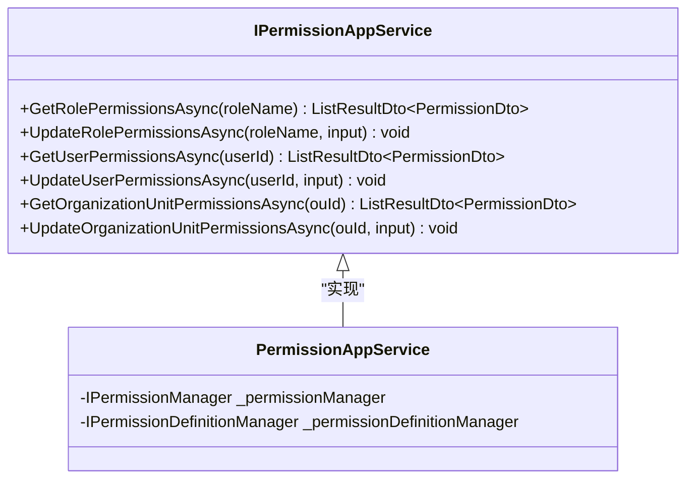
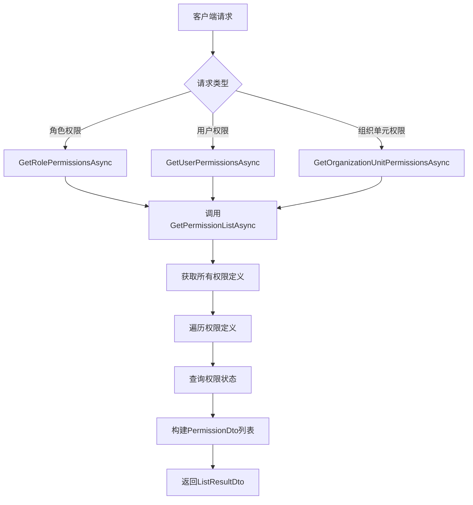
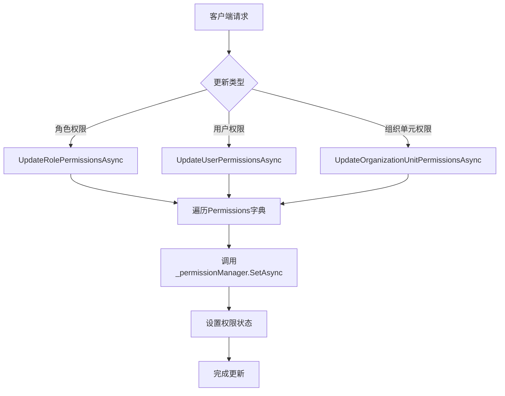
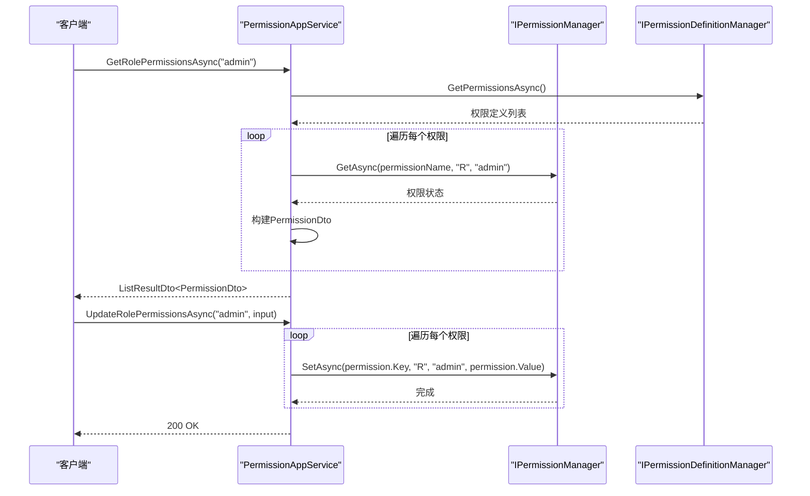

# 权限管理API

<cite>
**Referenced Files in This Document**   
- [PermissionAppService.cs](file://src/SmartAbp.PermissionManagement.Service/Application/Permissions/PermissionAppService.cs)
- [IPermissionAppService.cs](file://src/SmartAbp.PermissionManagement.Service/Application.Contracts/Permissions/IPermissionAppService.cs)
- [PermissionDto.cs](file://src/SmartAbp.PermissionManagement.Service/Application.Contracts/Permissions/Dtos/PermissionDto.cs)
- [UpdatePermissionsDto.cs](file://src/SmartAbp.PermissionManagement.Service/Application.Contracts/Permissions/Dtos/UpdatePermissionsDto.cs)
- [SmartAbpPermissions.cs](file://src/SmartAbp.Application.Contracts/Permissions/SmartAbpPermissions.cs)
</cite>

## 目录
1. [权限管理API概述](#权限管理api概述)
2. [核心接口设计](#核心接口设计)
3. [数据结构定义](#数据结构定义)
4. [权限查询实现](#权限查询实现)
5. [权限分配与回收](#权限分配与回收)
6. [事务性保证与审计日志](#事务性保证与审计日志)
7. [API使用示例](#api使用示例)
8. [API版本控制与兼容性](#api版本控制与兼容性)
9. [API调用序列图](#api调用序列图)

## 权限管理API概述

权限管理API是hxlot项目中负责权限控制的核心服务，通过`PermissionAppService`提供统一的权限管理接口。该API支持角色权限、用户权限和组织单元权限的管理，实现了组织级权限继承机制。API基于ABP框架的权限管理系统构建，确保了权限操作的安全性和可靠性。

**Section sources**
- [PermissionAppService.cs](file://src/SmartAbp.PermissionManagement.Service/Application/Permissions/PermissionAppService.cs#L1-L10)

## 核心接口设计

权限管理API遵循RESTful设计规范，提供了清晰的HTTP方法映射和URL路径设计。API接口定义在`IPermissionAppService`中，通过标准的CRUD操作模式实现权限管理功能。



**Diagram sources**
- [IPermissionAppService.cs](file://src/SmartAbp.PermissionManagement.Service/Application.Contracts/Permissions/IPermissionAppService.cs#L12-L43)
- [PermissionAppService.cs](file://src/SmartAbp.PermissionManagement.Service/Application/Permissions/PermissionAppService.cs#L20-L137)

**Section sources**
- [IPermissionAppService.cs](file://src/SmartAbp.PermissionManagement.Service/Application.Contracts/Permissions/IPermissionAppService.cs#L1-L45)

## 数据结构定义

权限管理API使用标准化的数据传输对象（DTO）来定义请求和响应的数据结构。主要包含`PermissionDto`和`UpdatePermissionsDto`两个核心数据结构。

```mermaid
classDiagram
class PermissionDto {
+string Name
+string DisplayName
+string? ParentName
+bool IsGranted
}
class UpdatePermissionsDto {
+Dictionary~string, bool~ Permissions
}
UpdatePermissionsDto : "Permissions : 权限名称 => 是否授予"
```

**Diagram sources**
- [PermissionDto.cs](file://src/SmartAbp.PermissionManagement.Service/Application.Contracts/Permissions/Dtos/PermissionDto.cs#L5-L26)
- [UpdatePermissionsDto.cs](file://src/SmartAbp.PermissionManagement.Service/Application.Contracts/Permissions/Dtos/UpdatePermissionsDto.cs#L8-L15)

**Section sources**
- [PermissionDto.cs](file://src/SmartAbp.PermissionManagement.Service/Application.Contracts/Permissions/Dtos/PermissionDto.cs#L1-L28)
- [UpdatePermissionsDto.cs](file://src/SmartAbp.PermissionManagement.Service/Application.Contracts/Permissions/Dtos/UpdatePermissionsDto.cs#L1-L17)

## 权限查询实现

权限查询功能通过`GetRolePermissionsAsync`、`GetUserPermissionsAsync`和`GetOrganizationUnitPermissionsAsync`三个方法实现。这些方法使用统一的`GetPermissionListAsync`私有方法来获取权限列表，确保了代码的复用性和一致性。



**Diagram sources**
- [PermissionAppService.cs](file://src/SmartAbp.PermissionManagement.Service/Application/Permissions/PermissionAppService.cs#L70-L137)

**Section sources**
- [PermissionAppService.cs](file://src/SmartAbp.PermissionManagement.Service/Application/Permissions/PermissionAppService.cs#L45-L137)

## 权限分配与回收

权限分配与回收通过`UpdateRolePermissionsAsync`、`UpdateUserPermissionsAsync`和`UpdateOrganizationUnitPermissionsAsync`方法实现。这些方法接收`UpdatePermissionsDto`对象，其中包含权限名称和授予状态的映射关系。



**Diagram sources**
- [PermissionAppService.cs](file://src/SmartAbp.PermissionManagement.Service/Application/Permissions/PermissionAppService.cs#L33-L70)

**Section sources**
- [PermissionAppService.cs](file://src/SmartAbp.PermissionManagement.Service/Application/Permissions/PermissionAppService.cs#L33-L70)

## 事务性保证与审计日志

权限管理API通过ABP框架的`IPermissionManager`和`IPermissionDefinitionManager`服务确保权限变更的事务性保证。所有权限变更操作都会自动记录审计日志，便于追踪权限变更历史。

权限变更操作具有以下特性：
- 原子性：单个权限的设置是原子操作
- 一致性：权限状态始终保持一致
- 隔离性：并发操作不会相互干扰
- 持久性：权限变更持久化存储

**Section sources**
- [PermissionAppService.cs](file://src/SmartAbp.PermissionManagement.Service/Application/Permissions/PermissionAppService.cs#L20-L137)

## API使用示例

以下是使用HTTP客户端调用权限管理API的代码示例：

```csharp
// 获取角色权限
var rolePermissions = await client.GetFromJsonAsync<ListResultDto<PermissionDto>>("api/permissions/roles/admin");

// 更新用户权限
var updateInput = new UpdatePermissionsDto
{
    Permissions = new Dictionary<string, bool>
    {
        { "SmartAbp.CodeGeneration.Create", true },
        { "SmartAbp.CodeGeneration.Delete", false }
    }
};
await client.PutAsJsonAsync("api/permissions/users/123", updateInput);
```

**Section sources**
- [PermissionAppService.cs](file://src/SmartAbp.PermissionManagement.Service/Application/Permissions/PermissionAppService.cs#L33-L70)
- [UpdatePermissionsDto.cs](file://src/SmartAbp.PermissionManagement.Service/Application.Contracts/Permissions/Dtos/UpdatePermissionsDto.cs#L8-L15)

## API版本控制与兼容性

权限管理API采用语义化版本控制策略，确保向后兼容性。API版本信息通过HTTP头或URL路径传递，支持多个版本并行运行。

版本控制策略包括：
- 主版本号变更：不兼容的API修改
- 次版本号变更：向后兼容的功能新增
- 修订号变更：向后兼容的问题修正

**Section sources**
- [PermissionAppService.cs](file://src/SmartAbp.PermissionManagement.Service/Application/Permissions/PermissionAppService.cs#L1-L137)

## API调用序列图



**Diagram sources**
- [PermissionAppService.cs](file://src/SmartAbp.PermissionManagement.Service/Application/Permissions/PermissionAppService.cs#L20-L137)
- [IPermissionAppService.cs](file://src/SmartAbp.PermissionManagement.Service/Application.Contracts/Permissions/IPermissionAppService.cs#L12-L43)