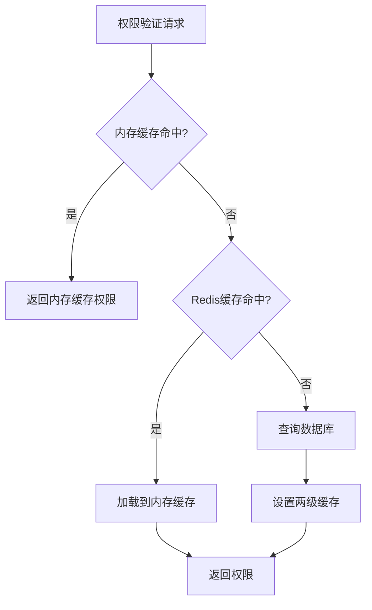
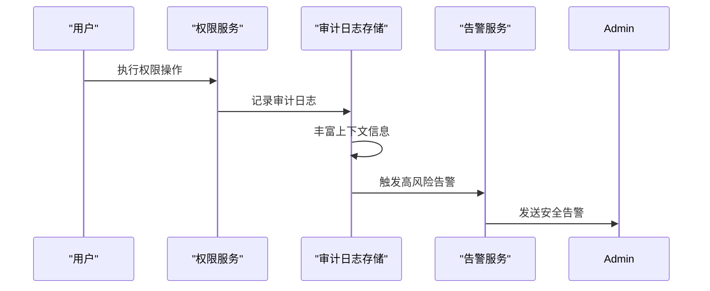
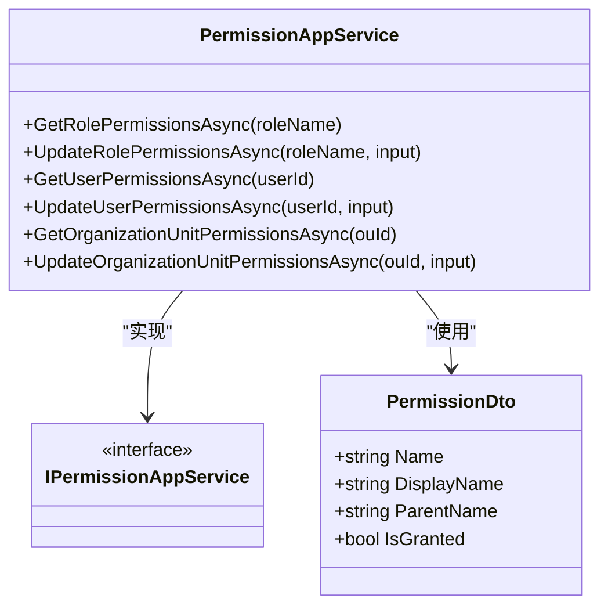
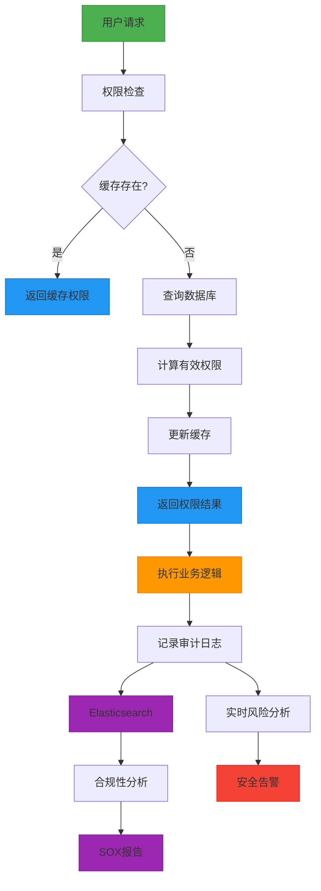

# 权限系统

<cite>
**本文档引用文件**  
- [SmartAbpPermissions.cs](file://src/SmartAbp.Application.Contracts/Permissions/SmartAbpPermissions.cs)
- [EnterpriseSecurityService.cs](file://src/SmartAbp.Application/Permissions/Security/EnterpriseSecurityService.cs)
- [RedisPermissionCacheService.cs](file://src/SmartAbp.Application/Permissions/Cache/RedisPermissionCacheService.cs)
- [PermissionAppService.cs](file://src/SmartAbp.PermissionManagement.Service/Application/Permissions/PermissionAppService.cs)
- [MultiTenantPermissionService.cs](file://src/SmartAbp.PermissionManagement.Service/Application/MultiTenant/MultiTenantPermissionService.cs)
- [OptimizedPermissionInheritanceEngine.cs](file://src/SmartAbp.Application/Permissions/Engine/OptimizedPermissionInheritanceEngine.cs)
- [ElasticsearchAuditLogStore.cs](file://src/SmartAbp.Application/Permissions/Auditing/Services/ElasticsearchAuditLogStore.cs)
</cite>

## 目录
1. [权限定义与常量结构](#权限定义与常量结构)
2. [企业级安全控制](#企业级安全控制)
3. [权限缓存策略](#权限缓存策略)
4. [权限审计日志](#权限审计日志)
5. [权限管理API](#权限管理api)
6. [权限检查代码示例](#权限检查代码示例)
7. [权限系统架构图](#权限系统架构图)

## 权限定义与常量结构

`SmartAbpPermissions.cs` 文件定义了基于 ABP 框架的权限常量体系，采用分组命名空间结构，确保权限定义的清晰性和可维护性。权限常量以 `SmartAbp` 为根命名空间，下设多个功能模块组，如代码生成、元数据管理、模板管理、低代码引擎和企业级功能等。

每个权限组包含默认权限（Default）及具体操作权限（Create、Edit、Delete、Generate、Preview、Export等），通过字符串拼接形成完整的权限名称。此外，提供了 `Generated` 静态类用于动态生成实体相关的权限名称，支持代码生成器自动集成。

**Section sources**
- [SmartAbpPermissions.cs](file://src/SmartAbp.Application.Contracts/Permissions/SmartAbpPermissions.cs#L1-L90)

## 企业级安全控制

`EnterpriseSecurityService` 实现了企业级安全控制功能，包括权限继承、角色管理和多租户隔离。该服务通过 `IEnterpriseSecurityService` 接口提供权限验证、数据加密、速率限制、输入验证等核心安全功能。

权限继承机制通过 `OptimizedPermissionInheritanceEngine` 实现，支持直接权限、角色权限、继承权限和组织权限的优先级合并计算。多租户隔离由 `MultiTenantPermissionService` 提供，确保不同租户之间的权限数据完全隔离，并支持租户权限迁移和孤立权限清理。

**Section sources**
- [EnterpriseSecurityService.cs](file://src/SmartAbp.Application/Permissions/Security/EnterpriseSecurityService.cs#L402-L860)
- [OptimizedPermissionInheritanceEngine.cs](file://src/SmartAbp.Application/Permissions/Engine/OptimizedPermissionInheritanceEngine.cs#L0-L213)
- [MultiTenantPermissionService.cs](file://src/SmartAbp.PermissionManagement.Service/Application/MultiTenant/MultiTenantPermissionService.cs#L0-L397)

## 权限缓存策略

`RedisPermissionCacheService` 实现了两级缓存策略，结合内存缓存（L1）和 Redis 缓存（L2），显著提升权限验证性能。该服务实现了 `IPermissionCacheService` 接口，提供获取、设置、移除和刷新用户权限缓存的功能。

缓存键采用 `permissions:{tenantId}:{userId}` 格式，确保多租户环境下的缓存隔离。读取时优先检查内存缓存，未命中则查询 Redis；写入时同时更新两级缓存。缓存过期策略支持绝对过期和滑动过期，可根据配置灵活调整。



**Diagram sources**
- [RedisPermissionCacheService.cs](file://src/SmartAbp.Application/Permissions/Cache/RedisPermissionCacheService.cs#L13-L194)

**Section sources**
- [RedisPermissionCacheService.cs](file://src/SmartAbp.Application/Permissions/Cache/RedisPermissionCacheService.cs#L13-L194)

## 权限审计日志

权限审计日志由 `ElasticsearchAuditLogStore` 实现，将权限操作记录存储到 Elasticsearch 中，支持高效查询和分析。审计日志包含用户信息、会话信息、权限上下文、地理位置、风险等级等丰富元数据。

`SOXComplianceReportGenerator` 提供 SOX 合规性报告生成功能，分析访问控制变更，识别高风险操作。`RealTimeRiskAlertService` 实现实时风险分析和告警，对高风险活动及时响应。



**Diagram sources**
- [ElasticsearchAuditLogStore.cs](file://src/SmartAbp.Application/Permissions/Auditing/Services/ElasticsearchAuditLogStore.cs#L90-L160)
- [SOXComplianceReportGenerator.cs](file://src/SmartAbp.Application/Permissions/Compliance/Services/SOXComplianceReportGenerator.cs#L85-L118)

**Section sources**
- [ElasticsearchAuditLogStore.cs](file://src/SmartAbp.Application/Permissions/Auditing/Services/ElasticsearchAuditLogStore.cs#L90-L160)
- [SOXComplianceReportGenerator.cs](file://src/SmartAbp.Application/Permissions/Compliance/Services/SOXComplianceReportGenerator.cs#L85-L118)

## 权限管理API

`PermissionAppService` 提供了权限管理的 API 接口，支持角色、用户和组织单元的权限管理。该服务实现了 `IPermissionAppService` 接口，提供获取和更新权限列表的功能。

API 支持按角色、用户或组织单元获取权限列表，并可批量更新权限。权限数据通过 `PermissionDto` 传输对象封装，包含权限名称、显示名称、父权限和授权状态等信息。



**Diagram sources**
- [PermissionAppService.cs](file://src/SmartAbp.PermissionManagement.Service/Application/Permissions/PermissionAppService.cs#L20-L137)

**Section sources**
- [PermissionAppService.cs](file://src/SmartAbp.PermissionManagement.Service/Application/Permissions/PermissionAppService.cs#L20-L137)

## 权限检查代码示例

前端使用 `usePermission` Hook 进行权限检查：

```javascript
import { usePermission } from '@smartabp/lowcode-shared/components/hocs'

const { hasPermission, hasAnyPermission, hasAllPermissions } = usePermission()

// 检查单个权限
if (hasPermission('admin')) {
  // 执行管理员操作
}

// 检查多个权限（任一）
if (hasAnyPermission(['admin', 'editor'])) {
  // 执行操作
}
```

后端权限验证通过 `EnterpriseSecurityService` 实现：

```csharp
var hasPermission = await _securityService.ValidatePermissionAsync(userId, resource, action);
if (!hasPermission)
{
    throw new AbpAuthorizationException("权限不足");
}
```

**Section sources**
- [WithPermission.js](file://src/SmartAbp.Vue/packages/lowcode-shared/src/components/hocs/WithPermission.js#L150-L201)
- [EnterpriseSecurityService.cs](file://src/SmartAbp.Application/Permissions/Security/EnterpriseSecurityService.cs#L402-L860)

## 权限系统架构图



**Diagram sources**
- [EnterpriseSecurityService.cs](file://src/SmartAbp.Application/Permissions/Security/EnterpriseSecurityService.cs#L402-L860)
- [RedisPermissionCacheService.cs](file://src/SmartAbp.Application/Permissions/Cache/RedisPermissionCacheService.cs#L13-L194)
- [ElasticsearchAuditLogStore.cs](file://src/SmartAbp.Application/Permissions/Auditing/Services/ElasticsearchAuditLogStore.cs#L90-L160)