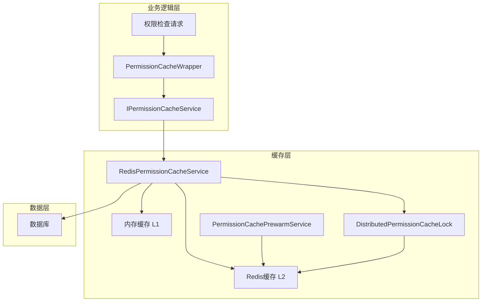
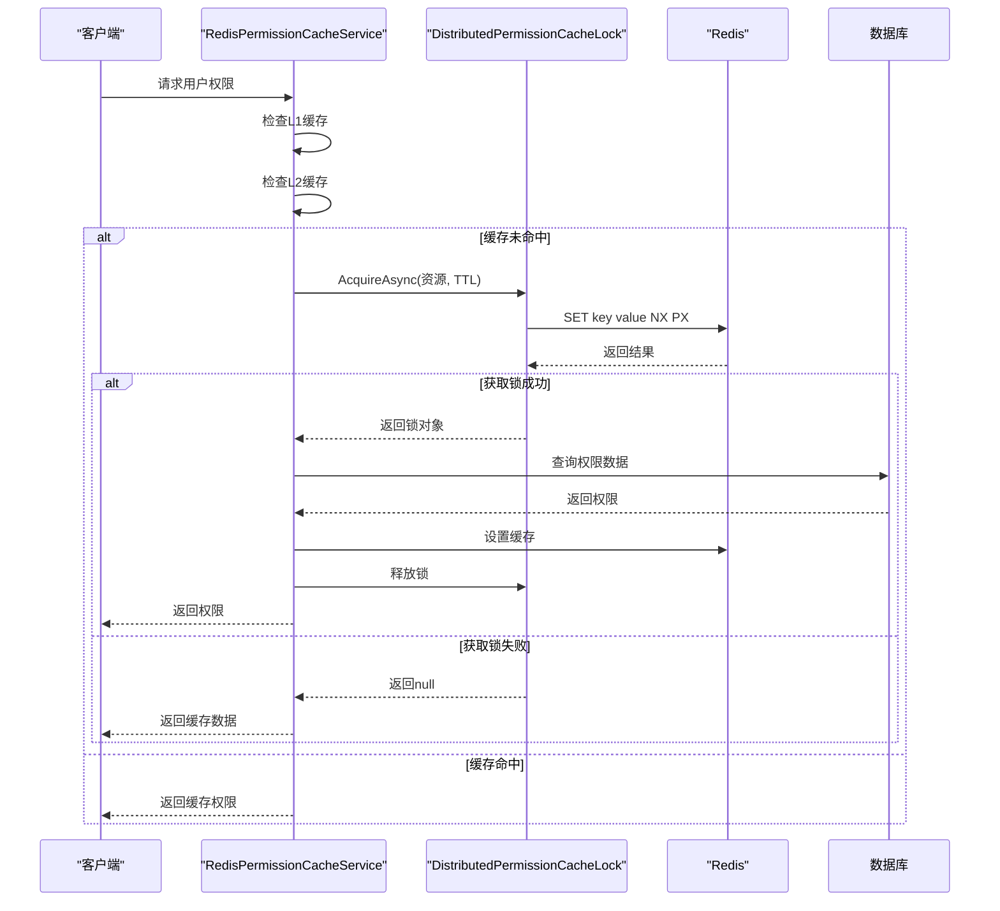

# 缓存机制

<cite>
**本文档引用的文件**  
- [RedisPermissionCacheService.cs](file://src/SmartAbp.Application/Permissions/Cache/RedisPermissionCacheService.cs)
- [DistributedPermissionCacheLock.cs](file://src/SmartAbp.Application/Permissions/Cache/DistributedPermissionCacheLock.cs)
- [PermissionCachePrewarmService.cs](file://src/SmartAbp.Application/Permissions/Cache/PermissionCachePrewarmService.cs)
- [PermissionCacheWrapper.cs](file://src/SmartAbp.Application/Permissions/Engine/PermissionCacheWrapper.cs)
- [PermissionModels.cs](file://src/SmartAbp.Application/Permissions/Models/PermissionModels.cs)
</cite>

## 目录
1. [缓存架构概述](#缓存架构概述)
2. [RedisPermissionCacheService 实现原理](#redispermissioncacheservice-实现原理)
3. [分布式缓存锁机制](#分布式缓存锁机制)
4. [权限缓存预热服务](#权限缓存预热服务)
5. [缓存封装设计](#缓存封装设计)
6. [缓存与数据库一致性](#缓存与数据库一致性)
7. [性能监控与调优](#性能监控与调优)

## 缓存架构概述

**图示来源**  
- [RedisPermissionCacheService.cs](file://src/SmartAbp.Application/Permissions/Cache/RedisPermissionCacheService.cs#L13-L194)
- [DistributedPermissionCacheLock.cs](file://src/SmartAbp.Application/Permissions/Cache/DistributedPermissionCacheLock.cs#L12-L205)
- [PermissionCachePrewarmService.cs](file://src/SmartAbp.Application/Permissions/Cache/PermissionCachePrewarmService.cs#L15-L229)

## RedisPermissionCacheService 实现原理

`RedisPermissionCacheService` 是权限缓存的核心实现，采用 L1+L2 双层缓存架构，提供高性能的权限数据访问能力。

### 缓存数据结构设计

缓存服务使用 `UserPermissionSet` 类型作为缓存数据结构，包含用户ID、租户ID、权限列表、过期时间和创建时间等关键字段。该结构通过 JSON 序列化存储在 Redis 中，确保数据的完整性和可读性。

### 缓存键生成策略

采用统一的缓存键生成策略：`permissions:{tenantId}:{userId}`。该策略具有以下优势：
- **唯一性**：结合租户ID和用户ID，确保键的全局唯一
- **可读性**：前缀明确标识缓存类型，便于管理和调试
- **查询效率**：支持按租户或用户进行批量操作

### 缓存失效机制

实现多级缓存失效机制：
1. **滑动过期**：配置 `SlidingExpiration`，在访问时自动延长有效期
2. **绝对过期**：配置 `DefaultExpiration`，确保数据不会永久驻留
3. **主动清除**：提供 `RemoveUserPermissionsAsync` 方法，支持手动清除特定用户缓存
4. **刷新机制**：通过 `RefreshUserPermissionsAsync` 方法更新缓存过期时间

**本节来源**  
- [RedisPermissionCacheService.cs](file://src/SmartAbp.Application/Permissions/Cache/RedisPermissionCacheService.cs#L13-L194)
- [PermissionModels.cs](file://src/SmartAbp.Application/Permissions/Models/PermissionModels.cs#L8-L15)

## 分布式缓存锁机制

`DistributedPermissionCacheLock` 采用 Redis Redlock 算法实现，有效防止缓存击穿和雪崩问题。

### 工作原理

1. **锁获取**：使用 `SET` 命令的 NX（不存在才设置）和 PX（过期时间）参数实现原子性操作
2. **唯一标识**：为每个锁生成 GUID 作为锁ID，确保锁的唯一性
3. **自动过期**：设置合理的 TTL，避免死锁问题
4. **安全释放**：通过 Lua 脚本确保只有锁的持有者才能释放锁，保证操作的原子性

### 性能优化措施

- **异步操作**：所有锁操作均采用异步模式，避免阻塞主线程
- **连接复用**：共享 Redis 连接，减少连接开销
- **日志记录**：详细记录锁的获取和释放过程，便于问题排查
- **异常处理**：完善的异常捕获机制，确保系统稳定性

**图示来源**  
- [DistributedPermissionCacheLock.cs](file://src/SmartAbp.Application/Permissions/Cache/DistributedPermissionCacheLock.cs#L12-L205)

**本节来源**  
- [DistributedPermissionCacheLock.cs](file://src/SmartAbp.Application/Permissions/Cache/DistributedPermissionCacheLock.cs#L12-L205)

## 权限缓存预热服务

`PermissionCachePrewarmService` 负责在系统启动或高峰期前预加载活跃用户的权限数据。

### 预热策略

1. **批量处理**：支持批量预热多个用户，提高效率
2. **并行执行**：使用 `Task.WhenAll` 并行处理预热任务
3. **错误隔离**：单个用户预热失败不影响其他用户
4. **统计监控**：记录预热成功率、耗时等关键指标

### 执行流程

1. 接收活跃用户列表
2. 为每个用户创建预热任务
3. 并行执行所有预热任务
4. 统计成功和失败数量
5. 记录执行日志和性能指标

**本节来源**  
- [PermissionCachePrewarmService.cs](file://src/SmartAbp.Application/Permissions/Cache/PermissionCachePrewarmService.cs#L15-L229)

## 缓存封装设计

`PermissionCacheWrapper` 提供了统一的缓存访问接口，简化上层业务代码。

### 设计特点

- **统一接口**：实现 `IPermissionCache` 接口，提供标准化的缓存操作
- **自动创建**：`GetOrCreateAsync` 方法支持工厂模式，自动创建缺失的缓存项
- **配置集中**：缓存过期策略集中配置，便于统一管理
- **异常安全**：完善的异常处理机制，确保系统稳定性

### 配置参数

- **滑动过期**：15分钟，访问时自动延长
- **绝对过期**：1小时，确保数据及时更新
- **线程安全**：内部实现线程安全，支持并发访问

**本节来源**  
- [PermissionCacheWrapper.cs](file://src/SmartAbp.Application/Permissions/Engine/PermissionCacheWrapper.cs#L8-L37)

## 缓存与数据库一致性

系统采用 Cache-Aside 模式保证缓存与数据库的一致性。

### 一致性保障机制

1. **读操作**：先读缓存，缓存未命中再读数据库，然后写入缓存
2. **写操作**：先更新数据库，再删除缓存（Write-Through 模式）
3. **异常处理**：任何环节失败都记录日志并进行补偿
4. **监控告警**：实时监控缓存命中率，异常时触发告警

### 数据同步策略

- **主动清除**：权限变更时主动清除相关缓存
- **定时刷新**：对重要数据设置较短的过期时间
- **事件驱动**：通过领域事件通知缓存更新

## 性能监控与调优

### 监控指标

- **缓存命中率**：目标 > 95%
- **平均响应时间**：目标 < 10ms
- **P99响应时间**：目标 < 50ms
- **错误率**：目标 < 0.1%

### 调优建议

1. **缓存大小**：根据用户规模合理设置 Redis 内存
2. **连接池**：优化 Redis 连接池配置，避免连接瓶颈
3. **序列化**：考虑使用更高效的序列化方式（如 MessagePack）
4. **压缩**：对大对象启用压缩，减少网络传输
5. **分片**：用户量大时考虑 Redis 分片部署

**本节来源**  
- [PermissionPerformanceMonitor.cs](file://src/SmartAbp.Application/Permissions/Performance/PermissionPerformanceMonitor.cs#L97-L125)
- [PermissionModels.cs](file://src/SmartAbp.Application/Permissions/Models/PermissionModels.cs#L60-L68)