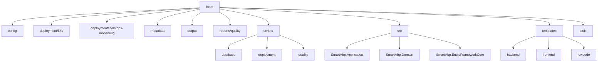
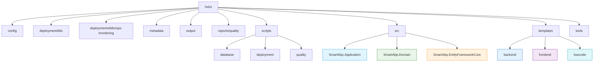

# 目录结构

<cite>
**本文档中引用的文件**  
- [README.md](file://README.md)
- [deployment/k8s/helm/smartabp/Chart.yaml](file://deployment/k8s/helm/smartabp/Chart.yaml)
- [deployment/k8s/helm/smartabp/values.yaml](file://deployment/k8s/helm/smartabp/values.yaml)
- [deployments/k8s/ops-monitoring/deployment.yaml](file://deployments/k8s/ops-monitoring/deployment.yaml)
- [deployments/k8s/ops-monitoring/ingress.yaml](file://deployments/k8s/ops-monitoring/ingress.yaml)
- [scripts/database/switch-database.sh](file://scripts/database/switch-database.sh)
- [scripts/deployment/deploy-production.sh](file://scripts/deployment/deploy-production.sh)
- [scripts/quality/quality-gate.sh](file://scripts/quality/quality-gate.sh)
- [src/SmartAbp.Application/SmartAbpApplicationModule.cs](file://src/SmartAbp.Application/SmartAbpApplicationModule.cs)
- [src/SmartAbp.Domain/SmartAbpDomainModule.cs](file://src/SmartAbp.Domain/SmartAbpDomainModule.cs)
- [src/SmartAbp.EntityFrameworkCore/SmartAbp.EntityFrameworkCore.csproj](file://src/SmartAbp.EntityFrameworkCore/SmartAbp.EntityFrameworkCore.csproj)
- [templates/backend/application/CrudAppService.template.cs](file://templates/backend/application/CrudAppService.template.cs)
- [templates/frontend/components/CrudManagement.template.vue](file://templates/frontend/components/CrudManagement.template.vue)
- [output/mes-uniapp/package.json](file://output/mes-uniapp/package.json)
</cite>

## 目录概览

hxlot 项目采用模块化、分层化的设计理念，构建了一个支持低代码开发、自动化部署和质量保障的全栈开发平台。项目结构清晰，职责分明，涵盖从核心业务逻辑到部署运维的完整开发生命周期。以下将系统性地解析各顶级目录及其子模块的用途与重要性。

**Diagram sources**  
- [README.md](file://README.md)
- [src/SmartAbp.Application/SmartAbpApplicationModule.cs)
- [src/SmartAbp.Domain/SmartAbpDomainModule.cs)
- [scripts/database/switch-database.sh)
- [scripts/deployment/deploy-production.sh)

## 顶级目录说明

### config
该目录存放项目所有环境配置与业务规则定义文件，采用 JSON 格式统一管理。包括生产环境配置 `production.json`、质量检查规则 `quality-rules.json` 以及特定业务场景的低代码配置文件，如 `权限管理系统低代码配置.json`。这些配置文件为代码生成器和运行时系统提供元数据输入，实现配置驱动的开发模式。

**Section sources**  
- [config/production.json](file://config/production.json)
- [config/quality-rules.json](file://config/quality-rules.json)
- [config/权限管理系统低代码配置.json](file://config/权限管理系统低代码配置.json)

### deployment/k8s
此目录包含基于 Helm 的 Kubernetes 部署模板，用于部署主应用系统。`helm/smartabp` 子目录下定义了完整的 Helm Chart，包含后端、前端和监控组件的部署、服务、Ingress 等资源模板。`production/deployment.yaml` 提供了生产环境的特定部署配置，适用于非 Helm 部署场景。

**Section sources**  
- [deployment/k8s/helm/smartabp/Chart.yaml](file://deployment/k8s/helm/smartabp/Chart.yaml)
- [deployment/k8s/helm/smartabp/values.yaml](file://deployment/k8s/helm/smartabp/values.yaml)
- [deployment/k8s/production/deployment.yaml](file://deployment/k8s/production/deployment.yaml)

### deployments/k8s/ops-monitoring
该目录专用于运维监控系统的独立部署，包含 Prometheus、Grafana 等监控组件的 Kubernetes 配置。与主应用部署分离，体现了关注点分离原则。配置文件包括 `deployment.yaml`、`service.yaml`、`ingress.yaml` 和 `kustomization.yaml`，支持通过 Kustomize 进行配置管理。

**Section sources**  
- [deployments/k8s/ops-monitoring/deployment.yaml](file://deployments/k8s/ops-monitoring/deployment.yaml)
- [deployments/k8s/ops-monitoring/ingress.yaml](file://deployments/k8s/ops-monitoring/ingress.yaml)
- [deployments/k8s/ops-monitoring/kustomization.yaml](file://deployments/k8s/ops-monitoring/kustomization.yaml)

### metadata
存放领域实体的元数据定义，采用 TypeScript 格式（如 `book.metadata.ts`）。这些元数据是代码生成器的核心输入，描述了实体的属性、关系和业务规则，支撑低代码平台的模型驱动开发。

**Section sources**  
- [metadata/entities/library/book.metadata.ts](file://metadata/entities/library/book.metadata.ts)

### output
代码生成器的输出目录，存放所有自动生成的代码。例如 `mes-uniapp` 子目录包含为 UniApp 前端生成的 API 客户端、状态管理（stores）、页面和组件。`tenant-management` 目录则包含多租户管理模块的后端代码。该目录的结构反映了生成代码的组织方式。

**Section sources**  
- [output/mes-uniapp/api/equipment-api.ts](file://output/mes-uniapp/api/equipment-api.ts)
- [output/mes-uniapp/stores/equipment-store.ts](file://output/mes-uniapp/stores/equipment-store.ts)
- [output/tenant-management/backend/Domain/Enums/TenantType.cs](file://output/tenant-management/backend/Domain/Enums/TenantType.cs)

### reports/quality
存放各类质量检查报告，包括架构重构摘要、前端质量分析、TypeScript 错误根因分析等 Markdown 和 JSON 报告。这些报告由 `scripts/quality` 目录下的检查脚本生成，是持续集成流程中质量门禁的重要依据。

**Section sources**  
- [reports/quality/frontend-quality-report-2025-10-09.md](file://reports/quality/frontend-quality-report-2025-10-09.md)
- [reports/quality/architecture-check-results.json](file://reports/quality/architecture-check-results.json)

### scripts
包含项目自动化脚本，按功能划分为多个子目录：
- **database**: 数据库初始化、迁移和切换脚本（如 `switch-database.sh`）
- **deployment**: 生产环境部署和优化脚本（如 `deploy-production.sh`）
- **dev**: 本地开发环境启动和性能优化脚本
- **quality**: 质量检查、架构健康度检测和门禁脚本（如 `quality-gate.sh`）
- **testing**: 集成测试和端到端测试脚本

这些脚本是 DevOps 流程的关键组成部分，实现了开发、测试、部署的自动化。

**Section sources**  
- [scripts/database/switch-database.sh](file://scripts/database/switch-database.sh)
- [scripts/deployment/deploy-production.sh](file://scripts/deployment/deploy-production.sh)
- [scripts/quality/quality-gate.sh](file://scripts/quality/quality-gate.sh)

### src
项目的核心源码目录，采用 ABP 框架的模块化结构：
- **SmartAbp.Application**: 应用服务层，实现业务用例，协调领域对象。包含 `EquipmentAppService.cs` 等具体服务。
- **SmartAbp.Domain**: 领域模型层，包含实体、值对象、领域服务和仓储接口，是业务逻辑的核心。
- **SmartAbp.EntityFrameworkCore**: 数据访问层，基于 Entity Framework Core 实现仓储，包含 `DbContext` 配置和迁移。

这三个项目构成了典型的分层架构，通过依赖注入和模块化设计实现高内聚、低耦合。

**Section sources**  
- [src/SmartAbp.Application/SmartAbpApplicationModule.cs](file://src/SmartAbp.Application/SmartAbpApplicationModule.cs)
- [src/SmartAbp.Domain/SmartAbpDomainModule.cs](file://src/SmartAbp.Domain/SmartAbpDomainModule.cs)
- [src/SmartAbp.EntityFrameworkCore/SmartAbp.EntityFrameworkCore.csproj](file://src/SmartAbp.EntityFrameworkCore/SmartAbp.EntityFrameworkCore.csproj)

### templates
代码生成器使用的模板目录，组织清晰，支持前后端一体化生成：
- **backend**: 后端 C# 模板，如 `CrudAppService.template.cs` 和 DTO 模板。
- **frontend**: 前端 Vue 组件模板，如 `CrudManagement.template.vue` 和 Pinia 状态管理模板。
- **lowcode**: 低代码平台专用模板，包含生成器和运行时组件。
- **domain-specific**: 领域专用模板，如 MES 系统和权限管理模块。

这些模板采用元数据描述（`.meta.yml`）和模板文件分离的方式，提高了模板的可维护性和可配置性。

**Section sources**  
- [templates/backend/application/CrudAppService.template.cs](file://templates/backend/application/CrudAppService.template.cs)
- [templates/frontend/components/CrudManagement.template.vue](file://templates/frontend/components/CrudManagement.template.vue)
- [templates/lowcode/index.json](file://templates/lowcode/index.json)

### tools
存放开发辅助工具和高级脚本，包括架构分析工具（`ArchitectureAnalysis`）、AI 能力测试、增量生成工具和质量保证工具集。这些工具支持专家模式开发和自动化代码审查。

**Section sources**  
- [tools/ArchitectureAnalysis/Program.cs](file://tools/ArchitectureAnalysis/Program.cs)
- [tools/quality-assurance/quality-gates.js](file://tools/quality-assurance/quality-gates.js)

## 交互式目录结构图

以下 Mermaid 图表提供了项目结构的交互式视图，帮助开发者快速定位关键文件：

**Diagram sources**  
- [src/SmartAbp.Application/SmartAbpApplicationModule.cs)
- [src/SmartAbp.Domain/SmartAbpDomainModule.cs)
- [templates/backend/application/CrudAppService.template.cs)
- [templates/frontend/components/CrudManagement.template.vue)
- [scripts/database/switch-database.sh)
- [scripts/deployment/deploy-production.sh)