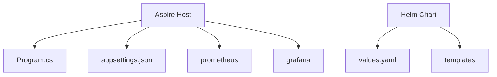
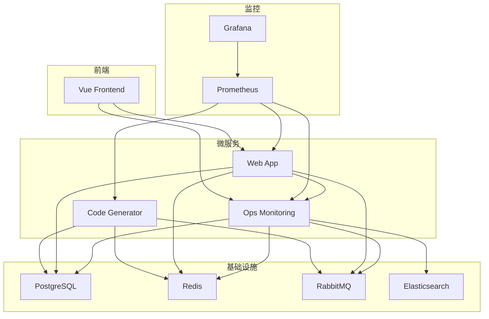
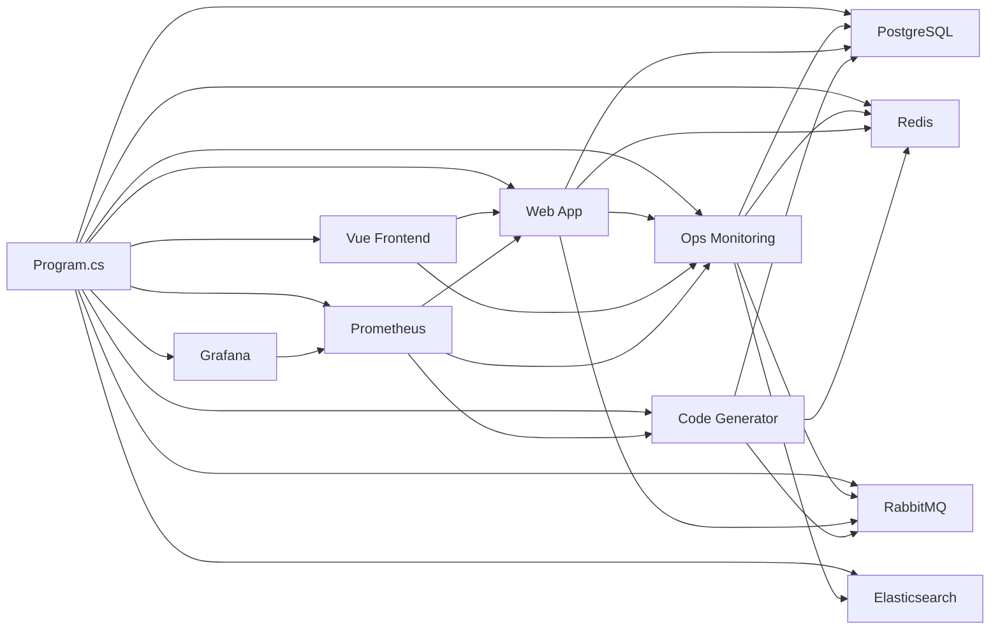

# Aspire Host部署

<cite>
**Referenced Files in This Document**   
- [Program.cs](file://src/SmartAbp.AspireHost/Program.cs)
- [appsettings.json](file://src/SmartAbp.AspireHost/appsettings.json)
- [prometheus.yml](file://src/SmartAbp.AspireHost/prometheus/prometheus.yml)
- [values.yaml](file://deployment/k8s/helm/smartabp/values.yaml)
</cite>

## 目录
1. [引言](#引言)
2. [项目结构](#项目结构)
3. [核心组件](#核心组件)
4. [架构概述](#架构概述)
5. [详细组件分析](#详细组件分析)
6. [依赖分析](#依赖分析)
7. [性能考虑](#性能考虑)
8. [故障排除指南](#故障排除指南)
9. [结论](#结论)

## 引言
本文档详细阐述了hxlot项目中Aspire Host的部署配置与运行机制。Aspire Host作为微服务架构的核心协调者，负责服务注册、配置管理、监控集成以及本地开发环境的模拟。通过分析`Program.cs`中的服务注册逻辑、`appsettings.json`的配置项、`prometheus.yml`的监控规则以及Kubernetes部署配置，全面展示Aspire Host在本地开发和云环境中的作用与集成方式。

## 项目结构
Aspire Host的配置文件集中存放在`src/SmartAbp.AspireHost`目录下，主要包括：
- `Program.cs`：定义了所有微服务、基础设施和前端应用的注册与配置。
- `appsettings.json`：包含Aspire Dashboard和OTLP端点的配置。
- `prometheus`目录：存放Prometheus的配置文件`prometheus.yml`。
- `grafana`目录：用于挂载Grafana的数据卷。

云环境的部署配置位于`deployment/k8s/helm/smartabp`目录，采用Helm Chart进行管理。



**Diagram sources**
- [Program.cs](file://src/SmartAbp.AspireHost/Program.cs)
- [appsettings.json](file://src/SmartAbp.AspireHost/appsettings.json)
- [prometheus.yml](file://src/SmartAbp.AspireHost/prometheus/prometheus.yml)

**Section sources**
- [Program.cs](file://src/SmartAbp.AspireHost/Program.cs)
- [appsettings.json](file://src/SmartAbp.AspireHost/appsettings.json)
- [prometheus.yml](file://src/SmartAbp.AspireHost/prometheus/prometheus.yml)
- [values.yaml](file://deployment/k8s/helm/smartabp/values.yaml)

## 核心组件
Aspire Host的核心功能体现在`Program.cs`文件中，它通过`DistributedApplication.CreateBuilder`创建了一个分布式应用构建器，用于声明式地定义和配置整个应用拓扑。该文件不仅注册了PostgreSQL、Redis、RabbitMQ等基础设施资源，还定义了`ops-monitoring`、`web-app`、`code-generator`等多个微服务项目，并通过`WithReference`方法建立它们之间的依赖关系。

**Section sources**
- [Program.cs](file://src/SmartAbp.AspireHost/Program.cs)

## 架构概述
Aspire Host的架构是一个典型的微服务架构，包含基础设施层、微服务层和前端层。在本地开发环境中，Aspire Host利用Docker容器化技术，将所有服务作为一个整体启动和管理。每个微服务都通过Dapr Sidecar实现服务间通信，确保了技术栈的解耦。Prometheus和Grafana构成了监控体系，负责收集和可视化应用指标。



**Diagram sources**
- [Program.cs](file://src/SmartAbp.AspireHost/Program.cs)

## 详细组件分析

### 服务注册与配置加载逻辑
`Program.cs`是Aspire Host的入口点，其核心是服务注册和配置加载逻辑。通过`AddProject<Projects.SmartAbp_OpsManagement_Host>`等方法，将解决方案中的各个项目作为微服务添加到应用拓扑中。`WithReference`方法用于注入依赖，例如`webApp`服务通过`WithReference(opsDb)`获得对主数据库的连接。`WithEnvironment`方法用于设置环境变量，这对于微服务的配置至关重要。此外，`WithDaprSidecar`扩展方法为每个微服务配置了Dapr Sidecar，实现了服务发现、状态管理和发布/订阅等分布式系统原语。

**Section sources**
- [Program.cs](file://src/SmartAbp.AspireHost/Program.cs)

### Aspire Host配置项
`appsettings.json`文件配置了Aspire Dashboard和OTLP（OpenTelemetry Protocol）端点。Dashboard用于可视化应用拓扑和健康状态，而OTLP端点则用于接收来自应用的遥测数据（如追踪、指标、日志）。`Aspire`日志级别的设置确保了框架自身的运行信息能够被有效记录。

```json
{
  "Logging": {
    "LogLevel": {
      "Default": "Information",
      "Microsoft.AspNetCore": "Warning",
      "Aspire": "Information"
    }
  },
  "Dashboard": {
    "Otlp": {
      "EndpointUrl": "http://localhost:18889"
    },
    "Frontend": {
      "EndpointUrls": "http://localhost:18888"
    }
  }
}
```

**Section sources**
- [appsettings.json](file://src/SmartAbp.AspireHost/appsettings.json)

### Prometheus监控配置
`prometheus.yml`文件定义了Prometheus的抓取配置（`scrape_configs`）。它配置了多个`job`来定期从不同的目标收集指标：
- `smartabp-ops-monitoring`、`smartabp-web`、`smartabp-codegen`：分别从运维监控、主Web应用和代码生成器微服务的`/metrics`端点抓取指标。
- `prometheus`：对Prometheus自身进行自监控。
- `node-exporter`、`postgres-exporter`、`redis-exporter`、`elasticsearch-exporter`：通过专门的Exporter收集主机、数据库和缓存的系统级指标。

全局配置中的`scrape_interval: 15s`定义了默认的抓取间隔，而各个job可以覆盖此设置。

**Section sources**
- [prometheus.yml](file://src/SmartAbp.AspireHost/prometheus/prometheus.yml)

### 本地开发环境中的作用
在本地开发环境中，Aspire Host扮演着“一站式”开发平台的角色。它通过`WithDataVolume()`方法为PostgreSQL和Redis等有状态服务挂载数据卷，确保数据在容器重启后得以保留。通过`WithPgAdmin()`和`WithRedisCommander()`，它集成了管理UI，方便开发者直接查看和操作数据库与缓存。Dapr Sidecar的集成使得开发者无需在代码中硬编码服务发现逻辑，即可实现服务间的可靠通信。此外，Aspire Dashboard提供了应用拓扑的实时视图，极大地简化了调试和问题定位。

**Section sources**
- [Program.cs](file://src/SmartAbp.AspireHost/Program.cs)

### 云环境中的部署与Kubernetes集成
在云环境中，Aspire Host的本地配置被转换为Kubernetes的Helm Chart进行部署。`values.yaml`文件是Helm Chart的核心配置文件，它定义了所有组件的部署参数。例如，`frontend`和`backend`的`replicaCount`分别设置为3和2，以实现高可用。`resources`部分定义了CPU和内存的请求与限制，确保了资源的合理分配。`ingress`配置了Nginx Ingress Controller，将外部流量路由到前端和后端服务。`postgresql`和`redis`的`persistence.enabled: true`确保了数据的持久化存储。整个部署通过Helm进行版本化管理，实现了与Kubernetes生态的无缝集成。

**Section sources**
- [values.yaml](file://deployment/k8s/helm/smartabp/values.yaml)

## 依赖分析
Aspire Host的依赖关系清晰地体现在`Program.cs`文件中。微服务之间通过`WithReference`建立显式依赖，例如`webApp`依赖于`mainDb`和`opsMonitoring`。基础设施资源（如数据库、缓存）作为共享依赖被多个微服务引用。在云部署中，Helm Chart的`values.yaml`文件通过`enabled`字段控制各个组件的启用状态，形成了一个可配置的依赖图谱。



**Diagram sources**
- [Program.cs](file://src/SmartAbp.AspireHost/Program.cs)

## 性能考虑
在性能方面，Aspire Host的配置兼顾了开发便利性和生产环境的稳定性。在`values.yaml`中，为前端和后端服务配置了`Horizontal Pod Autoscaler`（HPA），可以根据CPU和内存使用率自动伸缩Pod数量。数据库和缓存的资源配置（如PostgreSQL的`shared_buffers`）经过了调优，以应对生产负载。Prometheus的抓取间隔设置为15秒，平衡了监控粒度和系统开销。在本地开发时，虽然没有启用HPA，但通过Docker资源限制，可以模拟生产环境的资源约束。

## 故障排除指南
当Aspire Host启动失败时，应首先检查`Program.cs`中的端口冲突。例如，Prometheus的9090端口、Grafana的3000端口是否已被占用。其次，检查Docker Desktop是否正常运行，并确保有足够的磁盘空间供`WithDataVolume()`使用。如果微服务无法连接数据库，应确认`WithReference`的数据库名称是否正确。对于监控数据缺失问题，需检查`prometheus.yml`中的`targets`地址是否正确（如使用`host.docker.internal`访问宿主机服务）。

**Section sources**
- [Program.cs](file://src/SmartAbp.AspireHost/Program.cs)
- [prometheus.yml](file://src/SmartAbp.AspireHost/prometheus/prometheus.yml)

## 结论
Aspire Host为hxlot项目提供了一个强大且灵活的部署和开发框架。它通过声明式的`Program.cs`文件简化了本地微服务的启动和管理，通过集成Dapr和Prometheus等工具，内置了现代云原生应用所需的关键能力。通过将本地配置映射到Helm Chart，实现了从开发到生产的平滑过渡。这种架构不仅提升了开发效率，也为应用的可观察性、可伸缩性和可靠性奠定了坚实的基础。