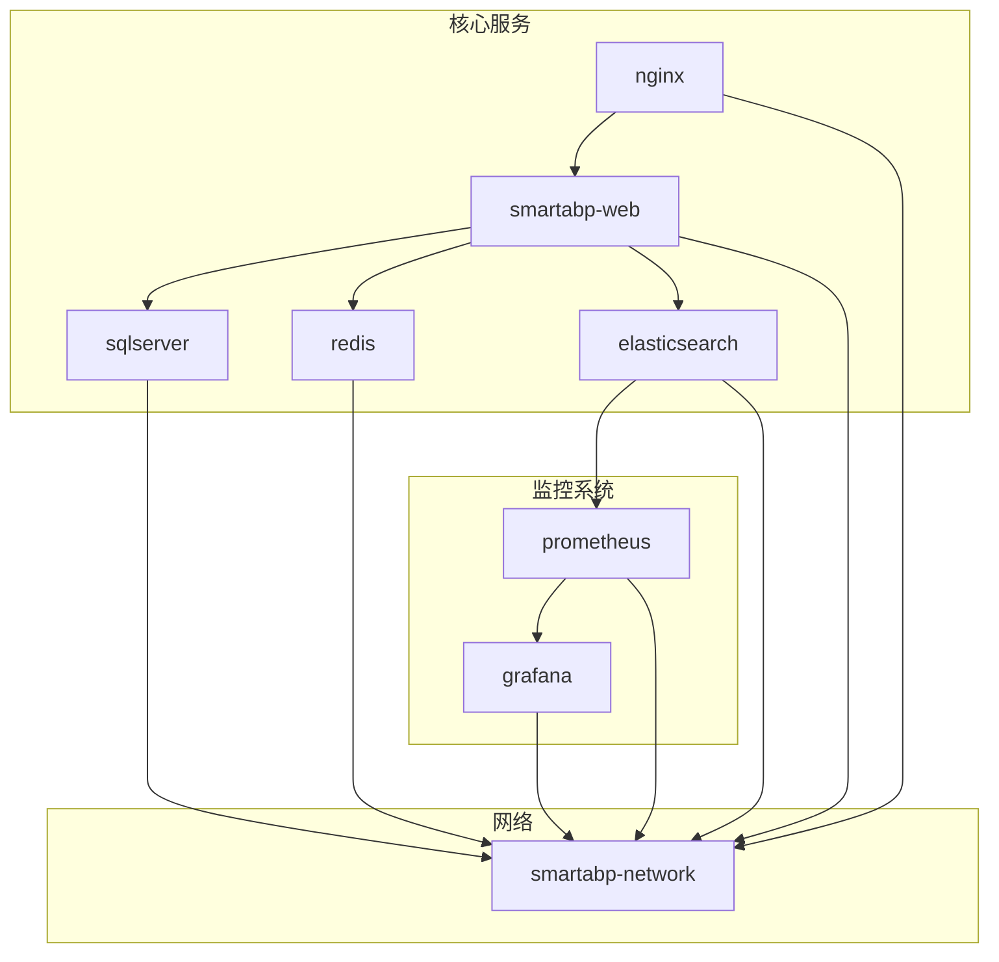
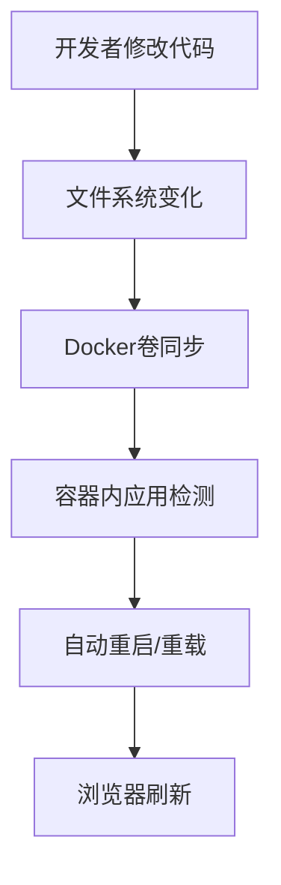
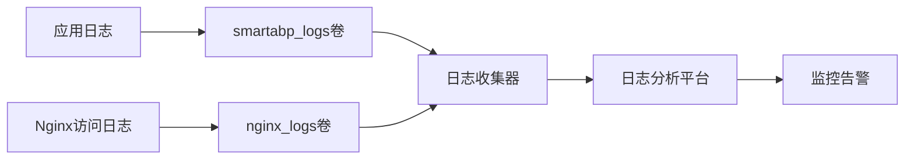
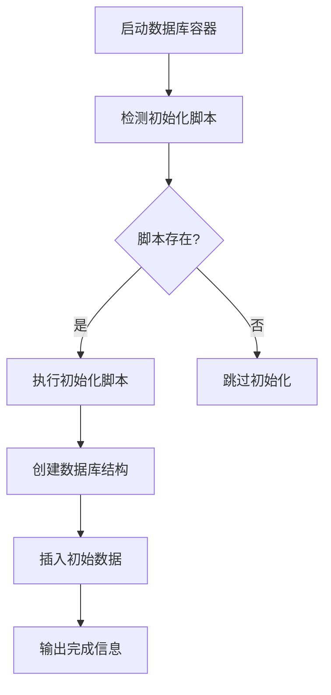

# Docker Compose部署

<cite>
**Referenced Files in This Document**   
- [docker-compose.yml](file://docker-compose.yml)
- [docker-compose.dev.yml](file://docker-compose.dev.yml)
- [docker-compose.production.yml](file://docker-compose.production.yml)
- [docker-compose.databases.yml](file://docker-compose.databases.yml)
- [scripts/database/init-sqlserver.sql](file://scripts/database/init-sqlserver.sql)
- [scripts/database/init-postgres.sql](file://scripts/database/init-postgres.sql)
- [scripts/database/init-mysql.sql](file://scripts/database/init-mysql.sql)
- [scripts/database/CROSS-PLATFORM-DATABASE-GUIDE.md](file://scripts/database/CROSS-PLATFORM-DATABASE-GUIDE.md)
</cite>

## 目录
1. [主Docker Compose文件结构](#主docker-compose文件结构)
2. [开发环境配置详解](#开发环境配置详解)
3. [生产环境优化策略](#生产环境优化策略)
4. [多数据库服务配置](#多数据库服务配置)
5. [多文件组合使用方法](#多文件组合使用方法)
6. [环境变量管理最佳实践](#环境变量管理最佳实践)

## 主Docker Compose文件结构

主`docker-compose.yml`文件定义了SmartAbp低代码引擎的核心服务架构，采用模块化设计，包含前端、后端、数据库和监控组件。该文件作为基础配置，可与其他环境特定的配置文件进行组合使用。



**Diagram sources**
- [docker-compose.yml](file://docker-compose.yml#L1-L175)

**Section sources**
- [docker-compose.yml](file://docker-compose.yml#L1-L175)

## 开发环境配置详解

`docker-compose.dev.yml`文件为开发环境提供了完整的工具链支持，包含多个开发专用服务和调试工具。该配置文件通过独立的网络和端口映射，确保开发环境与生产环境隔离。

### 开发工具服务

开发配置包含以下关键工具服务：
- **pgAdmin-dev**: PostgreSQL数据库管理界面，通过8082端口访问
- **redis-commander-dev**: Redis可视化管理工具，通过8083端口访问
- **mailhog-dev**: 邮件测试工具，用于捕获和查看应用发送的邮件
- **minio-dev**: 对象存储开发环境，模拟S3服务
- **jaeger-dev**: 分布式链路追踪系统，用于性能分析和故障排查

### 调试端口映射

开发环境采用非标准端口映射，避免与本地服务冲突：
- SQL Server: 1434 → 1433
- Redis: 6380 → 6379
- Elasticsearch: 9201 → 9200
- Prometheus: 9091 → 9090
- Grafana: 3001 → 3000

### 热重载设置

开发环境通过卷挂载实现代码热重载，当源代码发生变化时，容器内的应用会自动重新加载，无需重启整个服务。这种设置显著提高了开发效率，使开发者能够快速看到代码修改的效果。



**Diagram sources**
- [docker-compose.dev.yml](file://docker-compose.dev.yml#L1-L190)

**Section sources**
- [docker-compose.dev.yml](file://docker-compose.dev.yml#L1-L190)

## 生产环境优化策略

`docker-compose.production.yml`文件针对生产环境进行了全面优化，包含资源限制、健康检查和日志管理等关键配置，确保系统在高负载下的稳定性和可靠性。

### 资源限制

生产环境通过`deploy.resources`配置对各服务的资源使用进行精确控制：

| 服务 | CPU限制 | 内存限制 | CPU预留 | 内存预留 |
|------|---------|---------|---------|---------|
| smartabp | 2核 | 2GB | 0.5核 | 512MB |
| postgres | 2核 | 2GB | 0.5核 | 512MB |
| redis | 1核 | 1GB | 0.25核 | 256MB |
| nginx | 1核 | 512MB | 0.25核 | 128MB |

### 健康检查

所有关键服务都配置了健康检查机制，确保服务的可用性：

```yaml
healthcheck:
  test: ["CMD", "wget", "--no-verbose", "--tries=1", "--spider", "http://localhost:5000/health"]
  interval: 30s
  timeout: 10s
  retries: 3
  start_period: 60s
```

健康检查在容器启动60秒后开始，每30秒执行一次，超时时间为10秒，连续3次失败后认为服务不健康。

### 日志轮转

生产环境配置了专门的日志卷`smartabp_logs`，结合Nginx的日志卷`nginx_logs`，实现了日志的集中管理和轮转。通过外部日志收集系统（如ELK或Fluentd）可以进一步实现日志的分析和监控。



**Diagram sources**
- [docker-compose.production.yml](file://docker-compose.production.yml#L1-L305)

**Section sources**
- [docker-compose.production.yml](file://docker-compose.production.yml#L1-L305)

## 多数据库服务配置

`docker-compose.databases.yml`文件提供了多数据库支持，允许在不同数据库系统之间灵活切换，满足不同环境和需求。

### 数据库服务定义

该配置文件定义了三种主流数据库服务：

| 数据库 | 版本 | 端口 | 适用场景 |
|-------|------|------|---------|
| PostgreSQL | 15-alpine | 5432 | 生产推荐 |
| MySQL | 8.0 | 3306 | 高性价比 |
| SQL Server | 2022-latest | 1433 | 企业版 |

### 连接字符串

各数据库的连接字符串配置如下：

**PostgreSQL连接字符串**:
```
Host=localhost;Port=5432;Database=smartabp;Username=smartabp_user;Password=SmartAbp@2025
```

**MySQL连接字符串**:
```
Server=localhost;Port=3306;Database=smartabp;User=smartabp_user;Password=SmartAbp@2025
```

**SQL Server连接字符串**:
```
Server=localhost;Database=SmartAbp;User Id=sa;Password=SmartAbp@2025;TrustServerCertificate=True
```

### 初始化脚本

每个数据库都有对应的初始化脚本，确保数据库结构的一致性：

- `init-postgres.sql`: 创建PostgreSQL扩展和数据库信息表
- `init-mysql.sql`: 创建MySQL表结构和初始化数据
- `init-sqlserver.sql`: 创建SQL Server数据库和表结构

这些脚本在容器首次启动时自动执行，创建必要的数据库对象。



**Diagram sources**
- [docker-compose.databases.yml](file://docker-compose.databases.yml#L1-L174)
- [scripts/database/init-sqlserver.sql](file://scripts/database/init-sqlserver.sql#L1-L47)
- [scripts/database/init-postgres.sql](file://scripts/database/init-postgres.sql#L1-L35)
- [scripts/database/init-mysql.sql](file://scripts/database/init-mysql.sql#L1-L24)

**Section sources**
- [docker-compose.databases.yml](file://docker-compose.databases.yml#L1-L174)
- [scripts/database/init-sqlserver.sql](file://scripts/database/init-sqlserver.sql#L1-L47)
- [scripts/database/init-postgres.sql](file://scripts/database/init-postgres.sql#L1-L35)
- [scripts/database/init-mysql.sql](file://scripts/database/init-mysql.sql#L1-L24)

## 多文件组合使用方法

Docker Compose支持多文件组合，通过`-f`参数指定多个配置文件，实现配置的叠加和覆盖。

### 组合语法

```bash
docker-compose -f docker-compose.yml -f docker-compose.production.yml up -d
```

文件的加载顺序很重要，后面的文件会覆盖前面文件中的相同配置。

### 常用组合场景

**开发环境组合**:
```bash
docker-compose -f docker-compose.yml -f docker-compose.dev.yml up -d
```

**生产环境组合**:
```bash
docker-compose -f docker-compose.yml -f docker-compose.production.yml up -d
```

**数据库专用环境**:
```bash
docker-compose -f docker-compose.databases.yml up -d postgres
```

### 配置覆盖规则

当多个文件定义相同服务时，遵循以下覆盖规则：
- **标量值**（字符串、数字）：完全覆盖
- **数组**：合并（非去重）
- **对象**：深度合并，子属性覆盖

例如，生产环境文件中的资源限制会完全覆盖基础文件中的相应配置。

## 环境变量管理最佳实践

环境变量是Docker Compose配置的重要组成部分，用于实现配置的外部化和环境差异化。

### 环境变量来源

环境变量可以通过多种方式提供：
1. **环境文件**（`.env`）：推荐用于敏感信息
2. **shell环境变量**：适用于CI/CD环境
3. **命令行参数**：适用于临时覆盖

### 敏感信息保护

生产环境配置中使用了环境变量占位符，确保敏感信息不会硬编码在配置文件中：

```yaml
environment:
  - DB_PASSWORD:?Database password required
  - REDIS_PASSWORD:?Redis password required
  - JWT_SECRET_KEY:?JWT secret key required
```

`?`符号表示该变量是必需的，如果未提供将导致容器启动失败。

### 跨平台数据库配置

根据`CROSS-PLATFORM-DATABASE-GUIDE.md`文档，系统支持跨平台数据库配置，自动根据操作系统选择合适的数据库：

| 操作系统 | 推荐数据库 |
|--------|-----------|
| Windows | SQL Server |
| macOS | PostgreSQL |
| Linux | PostgreSQL |

这种设计确保了开发环境的兼容性和一致性。

**Section sources**
- [scripts/database/CROSS-PLATFORM-DATABASE-GUIDE.md](file://scripts/database/CROSS-PLATFORM-DATABASE-GUIDE.md#L1-L440)