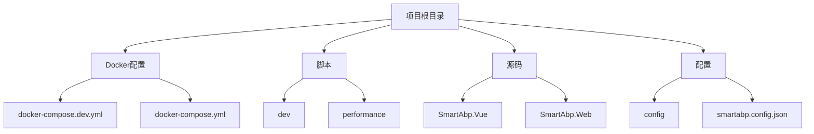
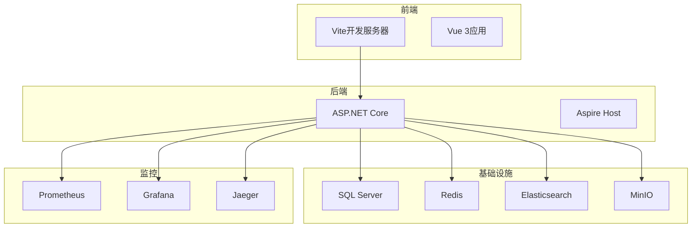
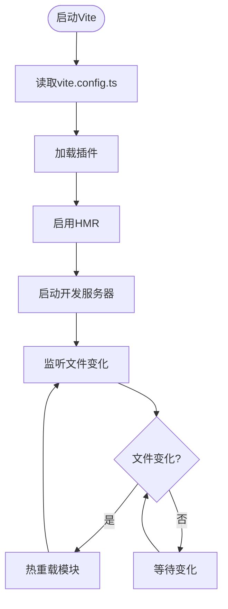
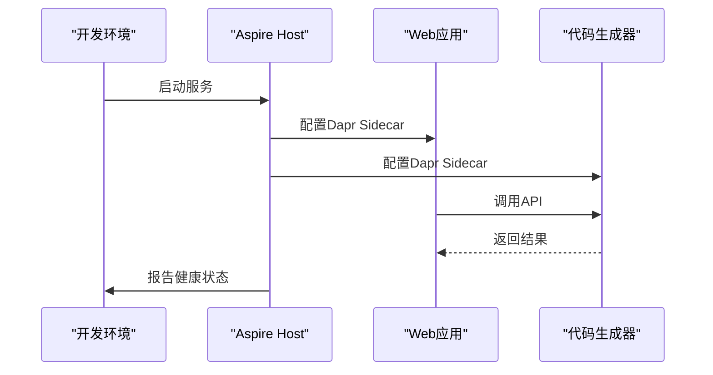
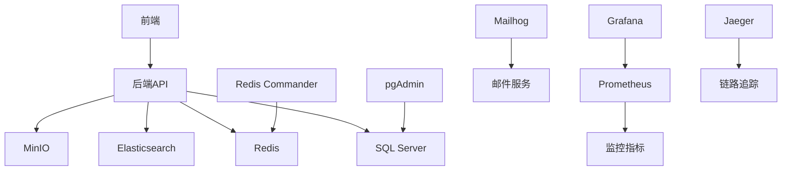

# 开发环境配置

<cite>
**本文档引用的文件**  
- [docker-compose.dev.yml](file://docker-compose.dev.yml)
- [start-dev.bat](file://scripts/dev/start-dev.bat)
- [vite.config.ts](file://src/SmartAbp.Vue/vite.config.ts)
- [Program.cs](file://src/SmartAbp.AspireHost/Program.cs)
- [package.json](file://src/SmartAbp.Vue/package.json)
- [appsettings.json](file://src/SmartAbp.Web/appsettings.json)
</cite>

## 目录
1. [简介](#简介)
2. [项目结构](#项目结构)
3. [核心组件](#核心组件)
4. [架构概述](#架构概述)
5. [详细组件分析](#详细组件分析)
6. [依赖分析](#依赖分析)
7. [性能考虑](#性能考虑)
8. [故障排除指南](#故障排除指南)
9. [结论](#结论)

## 简介
hxlot项目是一个企业级低代码引擎，基于SmartAbp框架构建，支持前后端分离架构。本项目为开发人员提供了完整的开发环境配置，通过Docker Compose实现多服务容器化部署，支持热重载、调试集成和高效开发工作流。开发环境专为提升开发效率而设计，包含数据库、缓存、搜索、监控等全套基础设施。

## 项目结构
hxlot项目采用模块化分层架构，包含前端、后端、数据库、监控等多个子系统。项目根目录下包含Docker配置、脚本、源码、配置文件等主要组成部分。前端基于Vue 3和Vite构建，后端采用ASP.NET Core，通过Docker Compose实现服务编排。

**图示来源**  
- [docker-compose.dev.yml](file://docker-compose.dev.yml#L1-L190)
- [scripts/dev/start-dev.bat](file://scripts/dev/start-dev.bat#L1-L105)

**本节来源**  
- [docker-compose.dev.yml](file://docker-compose.dev.yml#L1-L190)
- [scripts/dev/start-dev.bat](file://scripts/dev/start-dev.bat#L1-L105)

## 核心组件
hxlot项目的核心组件包括开发数据库、缓存服务、前端开发服务器和后端应用服务。开发环境通过docker-compose.dev.yml文件定义了完整的服务栈，包括SQL Server、Redis、Elasticsearch、MinIO等基础设施服务，以及Prometheus、Grafana等监控服务。前端使用Vite作为开发服务器，支持热模块替换(HMR)，后端采用ASP.NET Core，通过Aspire Host进行服务编排。

**本节来源**  
- [docker-compose.dev.yml](file://docker-compose.dev.yml#L1-L190)
- [vite.config.ts](file://src/SmartAbp.Vue/vite.config.ts#L1-L373)

## 架构概述
hxlot项目的开发架构采用微服务设计理念，通过Docker Compose实现服务编排。前端和后端服务在独立的容器中运行，通过网络进行通信。开发环境配置了专门的调试端口和数据卷挂载，支持代码热重载和实时调试。

**图示来源**  
- [docker-compose.dev.yml](file://docker-compose.dev.yml#L1-L190)
- [Program.cs](file://src/SmartAbp.AspireHost/Program.cs#L1-L186)

## 详细组件分析

### 开发环境服务配置
开发环境通过docker-compose.dev.yml文件定义了多个专用服务，每个服务都有特定的开发用途。数据库服务使用SQL Server Express版本，配置了数据卷挂载以持久化数据。Redis服务配置了密码保护，Elasticsearch服务禁用了安全功能以简化开发。所有服务都暴露了相应的管理端口，方便开发人员进行调试和监控。

**本节来源**  
- [docker-compose.dev.yml](file://docker-compose.dev.yml#L1-L190)

### 前端热重载配置
前端开发环境基于Vite构建，通过vite.config.ts文件进行配置。Vite的热模块替换(HMR)功能通过WebSocket实现，当源码发生变化时，Vite会自动重新加载相关模块，而无需刷新整个页面。配置中启用了组件自动导入、图标解析器和低代码插件，提升了开发效率。

**图示来源**  
- [vite.config.ts](file://src/SmartAbp.Vue/vite.config.ts#L1-L373)

**本节来源**  
- [vite.config.ts](file://src/SmartAbp.Vue/vite.config.ts#L1-L373)

### 后端调试集成
后端调试通过Aspire Host实现，Program.cs文件中配置了Dapr Sidecar，为微服务提供分布式应用运行时支持。开发环境配置了ASPNETCORE_ENVIRONMENT=Development，启用开发模式下的调试功能。服务间通信通过Dapr的HTTP和gRPC端口进行，支持分布式追踪和监控。

**图示来源**  
- [Program.cs](file://src/SmartAbp.AspireHost/Program.cs#L1-L186)

**本节来源**  
- [Program.cs](file://src/SmartAbp.AspireHost/Program.cs#L1-L186)

## 依赖分析
hxlot项目的依赖关系复杂，涉及多个服务间的相互依赖。前端依赖后端API，后端依赖数据库和缓存服务。通过Docker Compose的depends_on指令，确保服务按正确顺序启动。开发环境还包含多个开发工具依赖，如pgAdmin、Redis Commander等，用于数据库和缓存的可视化管理。

**图示来源**  
- [docker-compose.dev.yml](file://docker-compose.dev.yml#L1-L190)

**本节来源**  
- [docker-compose.dev.yml](file://docker-compose.dev.yml#L1-L190)

## 性能考虑
开发环境的性能配置注重开发效率而非生产性能。数据库使用Express版本，内存限制较低。Elasticsearch配置了较小的堆内存，Prometheus和Grafana使用默认配置。这些配置确保开发环境在普通开发机上也能流畅运行，同时保留了生产环境的完整功能。

**本节来源**  
- [docker-compose.dev.yml](file://docker-compose.dev.yml#L1-L190)

## 故障排除指南
开发环境常见问题包括端口冲突、依赖缺失和配置错误。通过start-dev.bat脚本可以自动检查.NET和Node.js环境，安装前端依赖。如果服务启动失败，可以检查Docker日志，确认端口是否被占用。对于数据库连接问题，需要确认连接字符串和网络配置是否正确。

**本节来源**  
- [start-dev.bat](file://scripts/dev/start-dev.bat#L1-L105)
- [appsettings.json](file://src/SmartAbp.Web/appsettings.json#L1-L42)

## 结论
hxlot项目的开发环境配置全面且高效，通过Docker Compose实现了服务的容器化和编排。前端使用Vite提供快速的热重载体验，后端通过Aspire Host实现微服务架构。开发环境包含了完整的基础设施和监控工具，为开发人员提供了良好的开发体验。通过合理的配置和工具集成，开发团队可以快速启动和调试应用，提高开发效率。