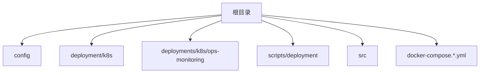
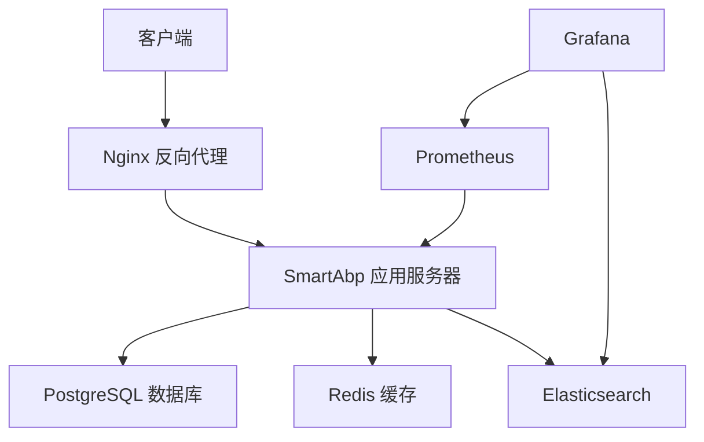
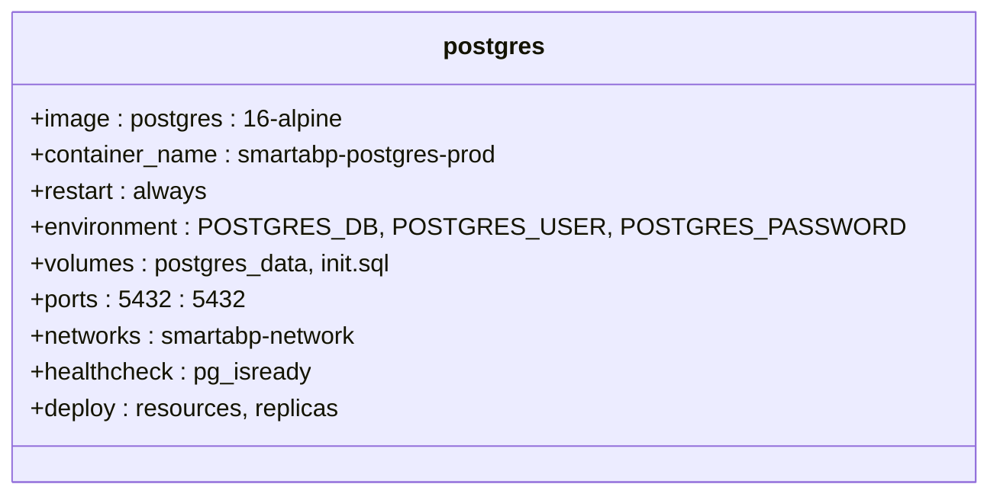
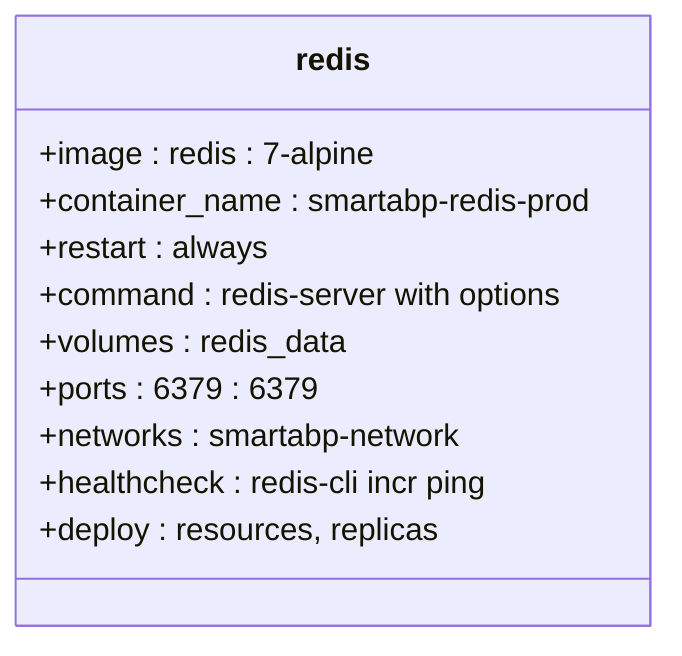
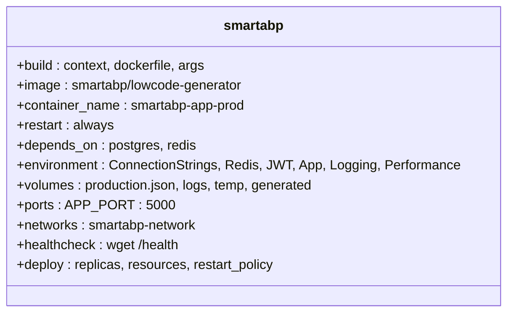
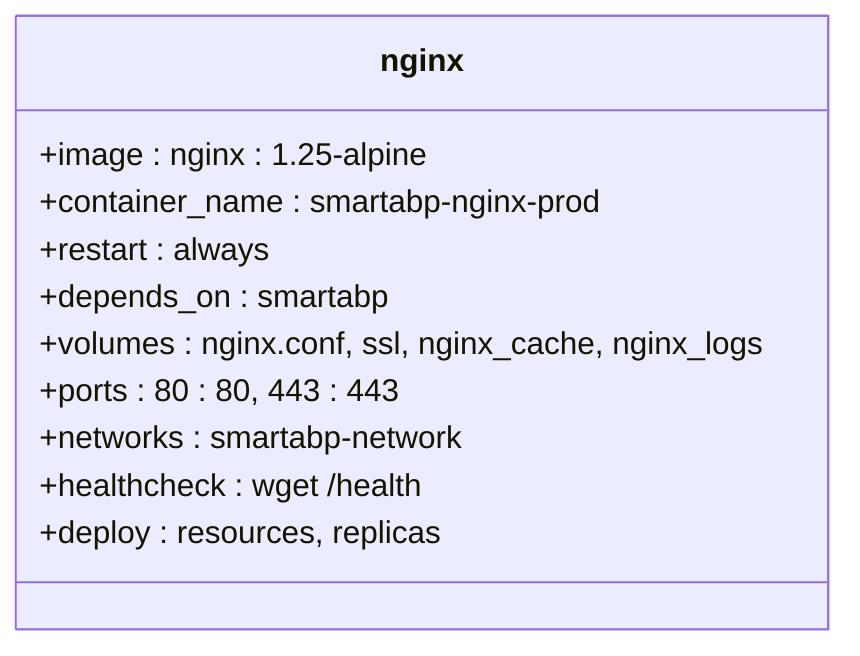
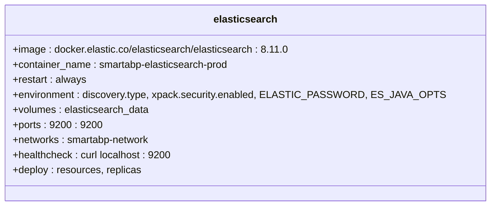
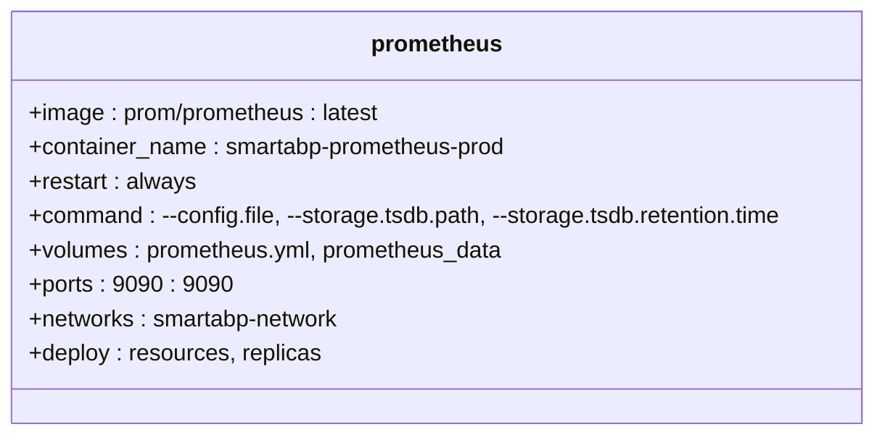
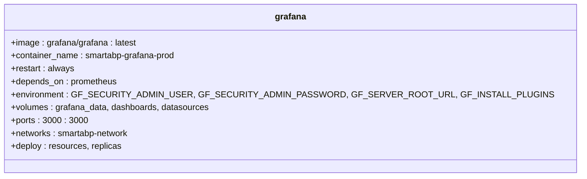
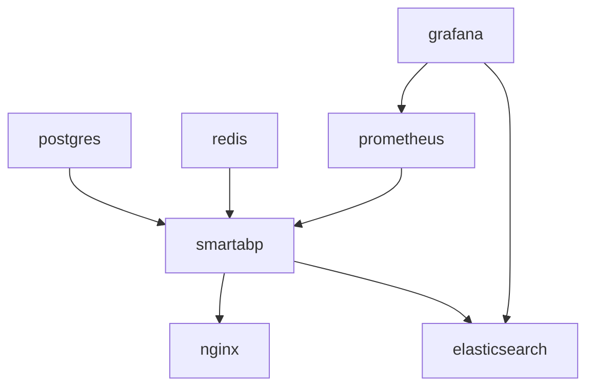

# 生产环境配置

<cite>
**本文档引用文件**  
- [docker-compose.production.yml](file://docker-compose.production.yml)
- [docker-compose.yml](file://docker-compose.yml)
- [deploy-production.sh](file://scripts/deployment/deploy-production.sh)
- [production.json](file://config/production.json)
- [Dockerfile](file://Dockerfile)
- [Dockerfile.production](file://Dockerfile.production)
</cite>

## 目录
1. [简介](#简介)
2. [项目结构](#项目结构)
3. [核心组件](#核心组件)
4. [架构概览](#架构概览)
5. [详细组件分析](#详细组件分析)
6. [依赖分析](#依赖分析)
7. [性能考量](#性能考量)
8. [故障排除指南](#故障排除指南)
9. [结论](#结论)

## 简介
本文档深入解析hxlot项目中`docker-compose.production.yml`的生产级配置。涵盖资源限制、健康检查、日志轮转、环境变量管理、反向代理集成以及敏感数据的secrets管理。同时提供生产环境部署的验证步骤和监控集成建议。

## 项目结构
hxlot项目采用微服务架构，结合Docker和Kubernetes进行容器化部署。主要目录包括：
- `config/`: 存放不同环境的配置文件，如`production.json`
- `deployment/k8s/`: Kubernetes部署相关配置
- `deployments/k8s/ops-monitoring/`: 运维监控相关的Kubernetes配置
- `scripts/deployment/`: 部署脚本，包括生产环境部署和优化脚本
- `src/`: 源代码目录，包含多个.NET Core项目
- `docker-compose.*.yml`: Docker Compose配置文件，用于不同环境的部署

**Diagram sources**
- [docker-compose.production.yml](file://docker-compose.production.yml#L1-L306)
- [config/production.json](file://config/production.json#L1-L310)

**Section sources**
- [docker-compose.production.yml](file://docker-compose.production.yml#L1-L306)
- [config/production.json](file://config/production.json#L1-L310)

## 核心组件
`docker-compose.production.yml`定义了多个核心服务，包括PostgreSQL数据库、Redis缓存、SmartAbp应用服务器、Nginx反向代理、Elasticsearch、Prometheus和Grafana。每个服务都配置了适当的资源限制、健康检查和日志轮转策略。

**Section sources**
- [docker-compose.production.yml](file://docker-compose.production.yml#L1-L306)

## 架构概览
hxlot项目的生产环境架构采用微服务模式，通过Docker Compose进行服务编排。前端通过Nginx反向代理访问后端服务，后端服务包括SmartAbp应用服务器、PostgreSQL数据库和Redis缓存。监控系统由Prometheus和Grafana组成，日志系统使用Elasticsearch进行存储和分析。

**Diagram sources**
- [docker-compose.production.yml](file://docker-compose.production.yml#L1-L306)

## 详细组件分析

### PostgreSQL 数据库分析
PostgreSQL服务配置了资源限制、健康检查和数据卷。使用`postgres:16-alpine`镜像，设置了数据库名称、用户名和密码的环境变量。数据持久化通过`postgres_data`卷实现。

**Diagram sources**
- [docker-compose.production.yml](file://docker-compose.production.yml#L15-L45)

### Redis 缓存分析
Redis服务配置了密码认证、内存限制和持久化策略。使用`redis:7-alpine`镜像，设置了最大内存为1GB，采用`allkeys-lru`淘汰策略。数据持久化通过`redis_data`卷实现。

**Diagram sources**
- [docker-compose.production.yml](file://docker-compose.production.yml#L47-L77)

### SmartAbp 应用服务器分析
SmartAbp应用服务器是核心服务，配置了多阶段构建、环境变量、数据卷、端口映射、健康检查和部署策略。使用`Dockerfile.production`进行构建，设置了多个环境变量，包括数据库连接字符串、Redis配置、JWT密钥等。

**Diagram sources**
- [docker-compose.production.yml](file://docker-compose.production.yml#L79-L145)

### Nginx 反向代理分析
Nginx服务作为反向代理，配置了SSL证书、缓存和日志。使用`nginx:1.25-alpine`镜像，挂载了Nginx配置文件和SSL证书。健康检查通过访问`/health`端点实现。

**Diagram sources**
- [docker-compose.production.yml](file://docker-compose.production.yml#L147-L177)

### Elasticsearch 分析
Elasticsearch服务用于日志存储，配置了单节点模式、安全认证和JVM选项。使用`docker.elastic.co/elasticsearch/elasticsearch:8.11.0`镜像，设置了`discovery.type`为`single-node`，启用了xpack安全功能。

**Diagram sources**
- [docker-compose.production.yml](file://docker-compose.production.yml#L179-L209)

### Prometheus 分析
Prometheus服务用于监控指标收集，配置了配置文件、存储路径和保留时间。使用`prom/prometheus:latest`镜像，挂载了`prometheus.yml`配置文件和数据卷。

**Diagram sources**
- [docker-compose.production.yml](file://docker-compose.production.yml#L211-L237)

### Grafana 分析
Grafana服务用于监控仪表板展示，配置了管理员用户、密码、根URL和插件安装。使用`grafana/grafana:latest`镜像，挂载了数据卷和仪表板配置。

**Diagram sources**
- [docker-compose.production.yml](file://docker-compose.production.yml#L239-L269)

## 依赖分析
hxlot项目的各个服务之间存在明确的依赖关系。SmartAbp应用服务器依赖于PostgreSQL和Redis服务，Nginx反向代理依赖于SmartAbp应用服务器，Grafana依赖于Prometheus和Elasticsearch。这些依赖关系通过`depends_on`指令在`docker-compose.production.yml`中定义。

**Diagram sources**
- [docker-compose.production.yml](file://docker-compose.production.yml#L1-L306)

**Section sources**
- [docker-compose.production.yml](file://docker-compose.production.yml#L1-L306)

## 性能考量
生产环境配置中，每个服务都设置了资源限制和预留，以确保系统稳定性和性能。例如，SmartAbp应用服务器限制了2个CPU核心和2GB内存，PostgreSQL数据库限制了2个CPU核心和2GB内存。此外，还配置了健康检查和日志轮转，以防止资源耗尽和磁盘占满。

**Section sources**
- [docker-compose.production.yml](file://docker-compose.production.yml#L1-L306)

## 故障排除指南
生产环境部署过程中可能遇到的问题包括环境变量未设置、Docker镜像构建失败、服务启动失败等。可以通过查看`deploy-production.sh`脚本中的日志输出和错误处理机制来诊断和解决问题。此外，`production-readiness-check.sh`脚本提供了生产环境准备情况的检查。

**Section sources**
- [scripts/deployment/deploy-production.sh](file://scripts/deployment/deploy-production.sh#L1-L322)
- [scripts/deployment/production-readiness-check.sh](file://scripts/deployment/production-readiness-check.sh#L1-L311)

## 结论
hxlot项目的生产环境配置通过`docker-compose.production.yml`文件实现了微服务架构的容器化部署。配置中包含了资源限制、健康检查、日志轮转、环境变量管理、反向代理集成和敏感数据的secrets管理。通过合理的配置和监控，确保了系统的稳定性和性能。