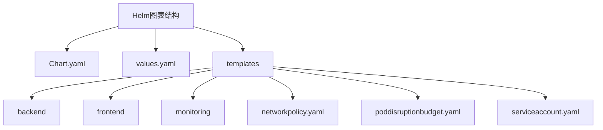
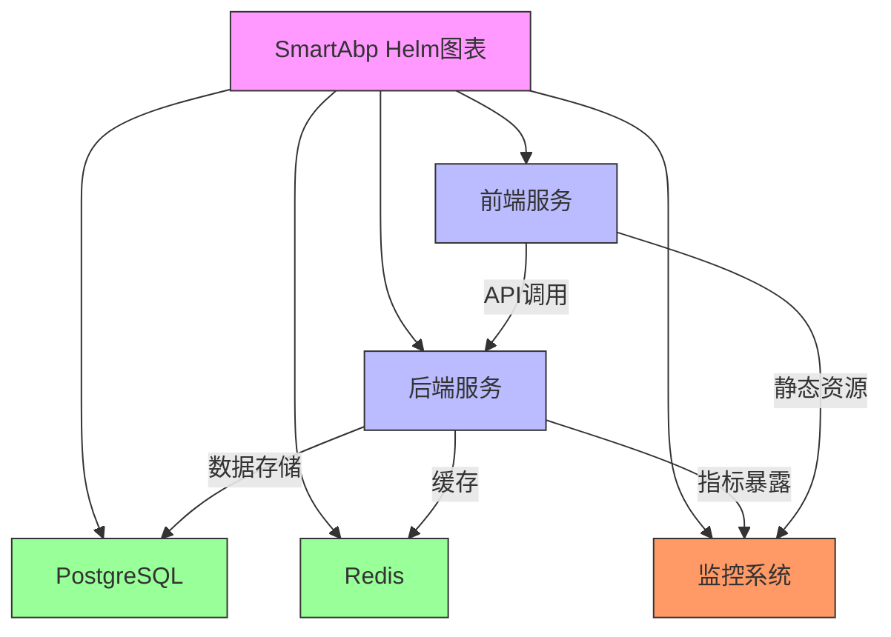
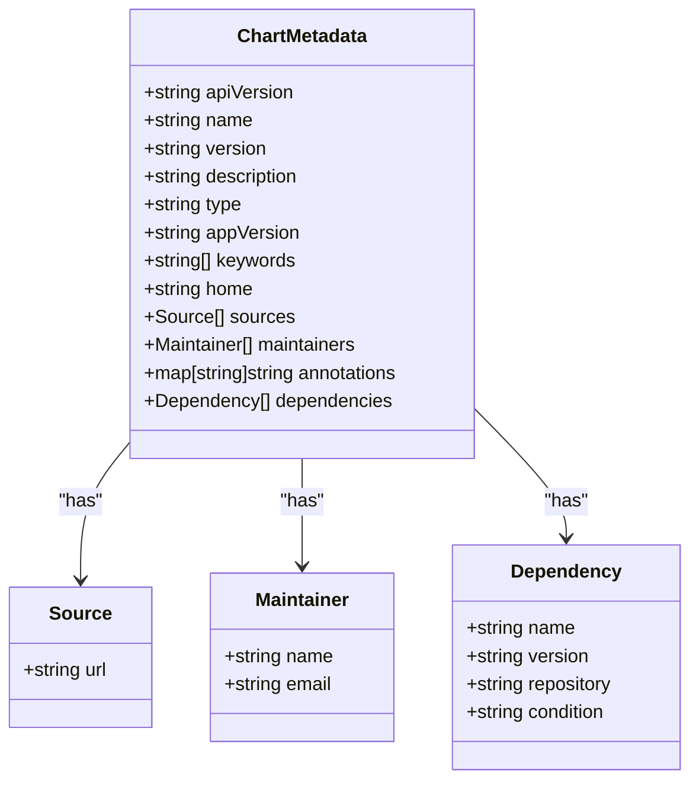
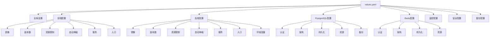
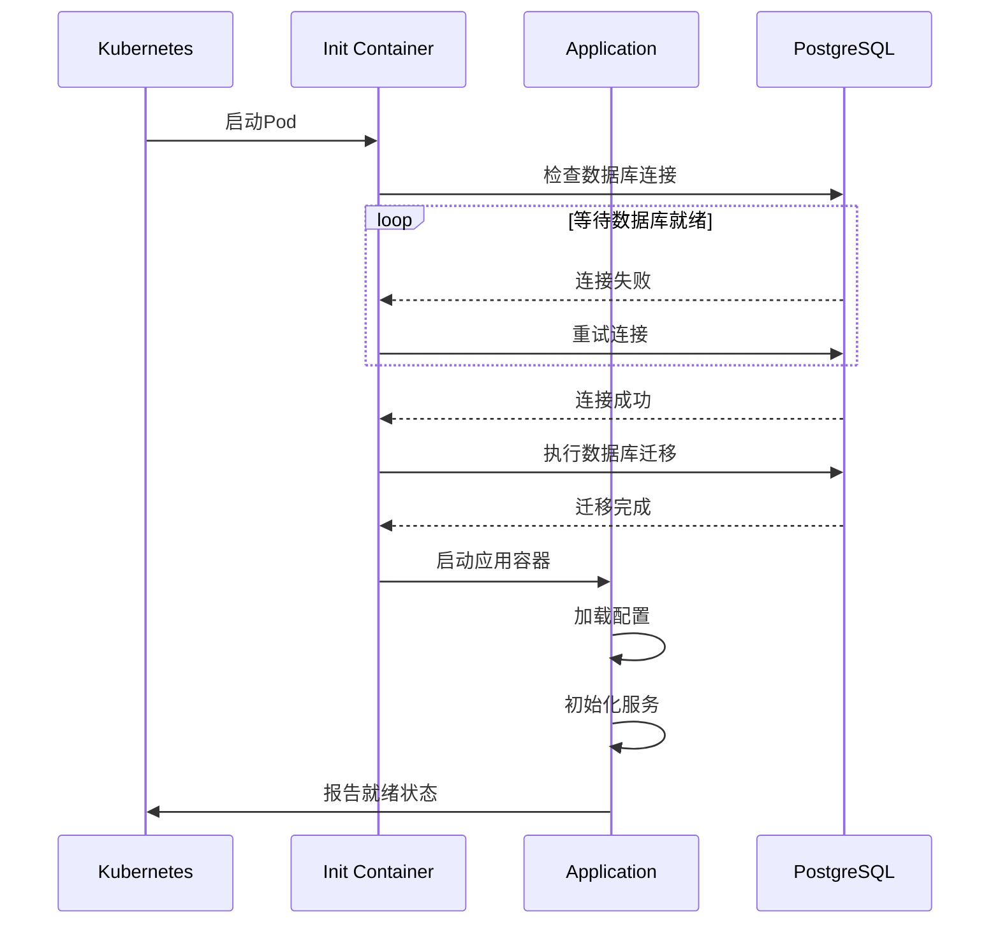
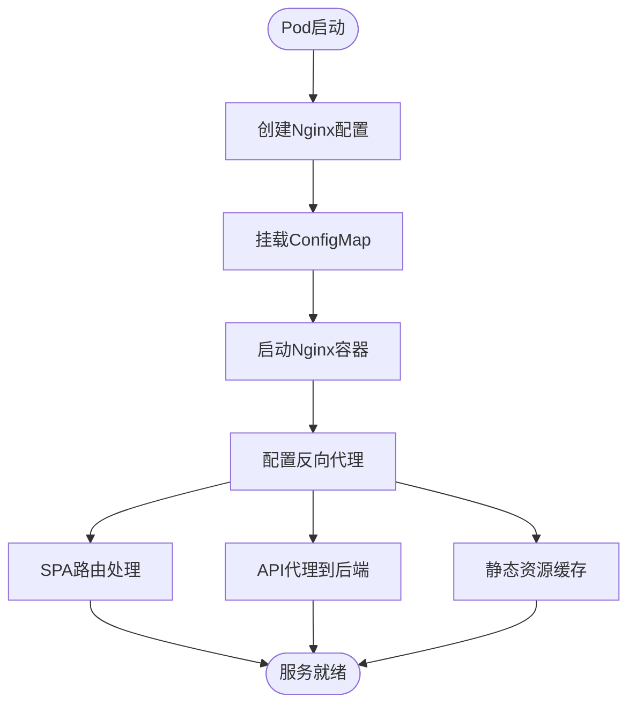
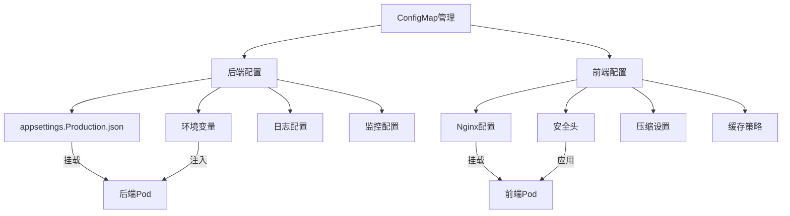
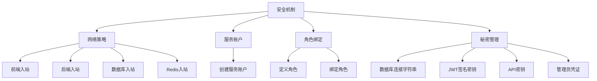
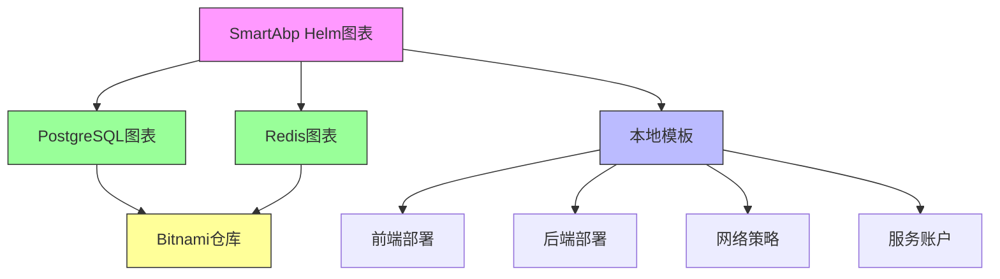

# Helm图表结构

<cite>
**Referenced Files in This Document**  
- [Chart.yaml](file://deployment/k8s/helm/smartabp/Chart.yaml)
- [values.yaml](file://deployment/k8s/helm/smartabp/values.yaml)
- [templates/backend/deployment.yaml](file://deployment/k8s/helm/smartabp/templates/backend/deployment.yaml)
- [templates/frontend/deployment.yaml](file://deployment/k8s/helm/smartabp/templates/frontend/deployment.yaml)
- [templates/backend/configmap.yaml](file://deployment/k8s/helm/smartabp/templates/backend/configmap.yaml)
- [templates/frontend/configmap.yaml](file://deployment/k8s/helm/smartabp/templates/frontend/configmap.yaml)
- [templates/backend/secret.yaml](file://deployment/k8s/helm/smartabp/templates/backend/secret.yaml)
- [templates/networkpolicy.yaml](file://deployment/k8s/helm/smartabp/templates/networkpolicy.yaml)
- [templates/serviceaccount.yaml](file://deployment/k8s/helm/smartabp/templates/serviceaccount.yaml)
</cite>

## 目录
1. [简介](#简介)
2. [项目结构](#项目结构)
3. [核心组件](#核心组件)
4. [架构概述](#架构概述)
5. [详细组件分析](#详细组件分析)
6. [依赖分析](#依赖分析)
7. [性能考虑](#性能考虑)
8. [故障排除指南](#故障排除指南)
9. [结论](#结论)

## 简介
hxlot项目中的Helm图表结构为SmartAbp企业级低代码引擎提供了完整的Kubernetes部署解决方案。该Helm图表通过`Chart.yaml`文件定义了图表的元数据和依赖关系，通过`values.yaml`文件提供了可配置的部署参数，并通过`templates`目录中的模板文件实现了灵活的资源部署。此文档深入解析了Helm图表的各个组成部分，包括图表元数据、版本管理、依赖管理、配置参数以及最佳实践。

## 项目结构
hxlot项目的Helm图表结构遵循标准的Helm图表组织方式，位于`deployment/k8s/helm/smartabp`目录下。该结构包含`Chart.yaml`、`values.yaml`和`templates`三个核心部分，其中`templates`目录进一步细分为后端、前端和监控等子目录，实现了组件的逻辑分离。

**Diagram sources**
- [Chart.yaml](file://deployment/k8s/helm/smartabp/Chart.yaml)
- [values.yaml](file://deployment/k8s/helm/smartabp/values.yaml)

**Section sources**
- [Chart.yaml](file://deployment/k8s/helm/smartabp/Chart.yaml)
- [values.yaml](file://deployment/k8s/helm/smartabp/values.yaml)

## 核心组件
Helm图表的核心组件包括图表元数据定义、配置参数管理和模板渲染机制。`Chart.yaml`文件定义了图表的基本信息和依赖关系，`values.yaml`文件提供了可覆盖的默认配置值，而`templates`目录中的YAML模板文件则通过Go模板语法实现了动态资源生成。这些组件共同构成了一个灵活、可配置的Kubernetes应用部署方案。

**Section sources**
- [Chart.yaml](file://deployment/k8s/helm/smartabp/Chart.yaml)
- [values.yaml](file://deployment/k8s/helm/smartabp/values.yaml)

## 架构概述
SmartAbp低代码引擎的Helm图表采用了微服务架构设计，包含前端、后端、数据库和缓存等多个组件。图表通过依赖管理机制集成了Bitnami提供的PostgreSQL和Redis图表，实现了数据库和缓存服务的标准化部署。整个架构通过网络策略、服务账户和角色绑定等安全机制，确保了生产环境的安全性和稳定性。

**Diagram sources**
- [Chart.yaml](file://deployment/k8s/helm/smartabp/Chart.yaml)
- [values.yaml](file://deployment/k8s/helm/smartabp/values.yaml)

## 详细组件分析

### Chart.yaml文件分析
`Chart.yaml`文件是Helm图表的元数据描述文件，包含了图表的基本信息和依赖关系。该文件定义了图表的API版本、名称、版本、描述等关键字段，并通过`dependencies`字段声明了对PostgreSQL和Redis等外部图表的依赖。

**Diagram sources**
- [Chart.yaml](file://deployment/k8s/helm/smartabp/Chart.yaml)

**Section sources**
- [Chart.yaml](file://deployment/k8s/helm/smartabp/Chart.yaml)

### values.yaml文件分析
`values.yaml`文件提供了Helm图表的默认配置值，涵盖了前端、后端、数据库、缓存、监控等多个方面的配置。该文件通过分层的YAML结构组织配置参数，使得用户可以轻松地覆盖默认值以适应不同的部署环境。

**Diagram sources**
- [values.yaml](file://deployment/k8s/helm/smartabp/values.yaml)

**Section sources**
- [values.yaml](file://deployment/k8s/helm/smartabp/values.yaml)

### 后端部署分析
后端部署模板定义了SmartAbp后端服务的Kubernetes Deployment资源，包括容器配置、环境变量、卷挂载、健康检查和资源限制等。该部署包含了初始化容器，用于在应用启动前执行数据库迁移。

**Diagram sources**
- [templates/backend/deployment.yaml](file://deployment/k8s/helm/smartabp/templates/backend/deployment.yaml)

**Section sources**
- [templates/backend/deployment.yaml](file://deployment/k8s/helm/smartabp/templates/backend/deployment.yaml)

### 前端部署分析
前端部署模板定义了Vue3前端应用的Kubernetes Deployment资源，通过Nginx作为反向代理服务器，实现了单页应用的路由和API代理功能。该部署配置了适当的资源限制和自动伸缩策略，以应对流量变化。

**Diagram sources**
- [templates/frontend/deployment.yaml](file://deployment/k8s/helm/smartabp/templates/frontend/deployment.yaml)

**Section sources**
- [templates/frontend/deployment.yaml](file://deployment/k8s/helm/smartabp/templates/frontend/deployment.yaml)

### 配置管理分析
Helm图表通过ConfigMap资源管理应用的配置信息，包括后端的appsettings.json配置和前端的Nginx配置。这种配置管理方式实现了配置与代码的分离，便于配置的版本控制和环境差异化管理。

**Diagram sources**
- [templates/backend/configmap.yaml](file://deployment/k8s/helm/smartabp/templates/backend/configmap.yaml)
- [templates/frontend/configmap.yaml](file://deployment/k8s/helm/smartabp/templates/frontend/configmap.yaml)

**Section sources**
- [templates/backend/configmap.yaml](file://deployment/k8s/helm/smartabp/templates/backend/configmap.yaml)
- [templates/frontend/configmap.yaml](file://deployment/k8s/helm/smartabp/templates/frontend/configmap.yaml)

### 安全机制分析
Helm图表实施了多层次的安全机制，包括网络策略、服务账户、角色绑定和秘密管理。这些安全措施共同构建了一个符合生产环境要求的安全防护体系。

**Diagram sources**
- [templates/networkpolicy.yaml](file://deployment/k8s/helm/smartabp/templates/networkpolicy.yaml)
- [templates/serviceaccount.yaml](file://deployment/k8s/helm/smartabp/templates/serviceaccount.yaml)
- [templates/backend/secret.yaml](file://deployment/k8s/helm/smartabp/templates/backend/secret.yaml)

**Section sources**
- [templates/networkpolicy.yaml](file://deployment/k8s/helm/smartabp/templates/networkpolicy.yaml)
- [templates/serviceaccount.yaml](file://deployment/k8s/helm/smartabp/templates/serviceaccount.yaml)
- [templates/backend/secret.yaml](file://deployment/k8s/helm/smartabp/templates/backend/secret.yaml)

## 依赖分析
Helm图表的依赖管理机制通过`Chart.yaml`文件中的`dependencies`字段实现，声明了对Bitnami提供的PostgreSQL和Redis图表的依赖。这种依赖管理方式使得SmartAbp能够复用经过验证的高质量图表，同时通过条件表达式实现了依赖的可选性。

**Diagram sources**
- [Chart.yaml](file://deployment/k8s/helm/smartabp/Chart.yaml)

**Section sources**
- [Chart.yaml](file://deployment/k8s/helm/smartabp/Chart.yaml)

## 性能考虑
Helm图表在设计时充分考虑了性能因素，包括资源限制、自动伸缩、缓存策略和网络优化等方面。后端服务配置了适当的CPU和内存限制，前端Nginx配置了Gzip和Brotli压缩以减少网络传输量，同时通过合理的缓存策略提高了静态资源的访问性能。

**Section sources**
- [values.yaml](file://deployment/k8s/helm/smartabp/values.yaml)
- [templates/frontend/configmap.yaml](file://deployment/k8s/helm/smartabp/templates/frontend/configmap.yaml)

## 故障排除指南
当Helm图表部署出现问题时，可以从以下几个方面进行排查：检查`Chart.yaml`文件的语法正确性，验证`values.yaml`文件中的配置值是否合理，确认依赖图表的仓库URL是否可达，以及检查Kubernetes集群的资源配额是否充足。此外，还可以通过Helm的`--dry-run`选项进行部署前的验证。

**Section sources**
- [Chart.yaml](file://deployment/k8s/helm/smartabp/Chart.yaml)
- [values.yaml](file://deployment/k8s/helm/smartabp/values.yaml)

## 结论
hxlot项目的Helm图表结构设计合理，功能完整，为SmartAbp低代码引擎的Kubernetes部署提供了可靠的基础。通过深入理解`Chart.yaml`文件的各个字段、图表版本管理策略和依赖管理机制，开发者可以更好地维护和扩展该Helm图表。建议在实际使用中遵循版本号语义化规范，定期更新依赖图表，并根据生产环境的需求调整配置参数。