# Kubernetes部署

<cite>
**本文档引用文件**  
- [Chart.yaml](file://deployment/k8s/helm/smartabp/Chart.yaml)
- [values.yaml](file://deployment/k8s/helm/smartabp/values.yaml)
- [deployment.yaml](file://deployment/k8s/helm/smartabp/templates/backend/deployment.yaml)
- [service.yaml](file://deployment/k8s/helm/smartabp/templates/backend/service.yaml)
- [ingress.yaml](file://deployment/k8s/helm/smartabp/templates/backend/ingress.yaml)
- [frontend/deployment.yaml](file://deployment/k8s/helm/smartabp/templates/frontend/deployment.yaml)
- [frontend/service.yaml](file://deployment/k8s/helm/smartabp/templates/frontend/service.yaml)
- [frontend/ingress.yaml](file://deployment/k8s/helm/smartabp/templates/frontend/ingress.yaml)
- [backend/configmap.yaml](file://deployment/k8s/helm/smartabp/templates/backend/configmap.yaml)
- [frontend/configmap.yaml](file://deployment/k8s/helm/smartabp/templates/frontend/configmap.yaml)
- [backend/secret.yaml](file://deployment/k8s/helm/smartabp/templates/backend/secret.yaml)
- [networkpolicy.yaml](file://deployment/k8s/helm/smartabp/templates/networkpolicy.yaml)
- [poddisruptionbudget.yaml](file://deployment/k8s/helm/smartabp/templates/poddisruptionbudget.yaml)
- [serviceaccount.yaml](file://deployment/k8s/helm/smartabp/templates/serviceaccount.yaml)
</cite>

## 目录
1. [简介](#简介)
2. [Helm图表结构](#helm图表结构)
3. [Chart.yaml文件解析](#chartyaml文件解析)
4. [values.yaml配置详解](#valuesyaml配置详解)
5. [模板文件结构分析](#模板文件结构分析)
6. [Helm部署流程](#helm部署流程)
7. [值文件覆盖与环境配置](#值文件覆盖与环境配置)
8. [部署验证与常见问题排查](#部署验证与常见问题排查)
9. [结论](#结论)

## 简介
本文档详细介绍了hxlot项目中`helm/smartabp` Helm图表的Kubernetes部署方案。文档深入解析了`Chart.yaml`文件的结构和版本管理策略，详细说明了`values.yaml`中各个配置项的含义，并解释了`templates`目录下关键模板文件的结构和变量引用机制。同时，文档还描述了Helm部署流程、值文件覆盖机制以及部署验证和问题排查方法。

## Helm图表结构

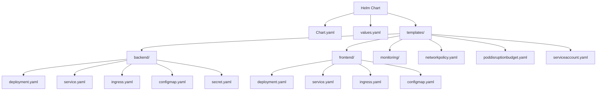

**图表来源**  
- [Chart.yaml](file://deployment/k8s/helm/smartabp/Chart.yaml)
- [templates/](file://deployment/k8s/helm/smartabp/templates/)

**本节来源**  
- [Chart.yaml](file://deployment/k8s/helm/smartabp/Chart.yaml)
- [values.yaml](file://deployment/k8s/helm/smartabp/values.yaml)

## Chart.yaml文件解析

`Chart.yaml`文件定义了Helm图表的基本元数据和依赖关系。该文件遵循Helm v2规范，包含图表名称、版本、描述、维护者信息以及外部依赖。

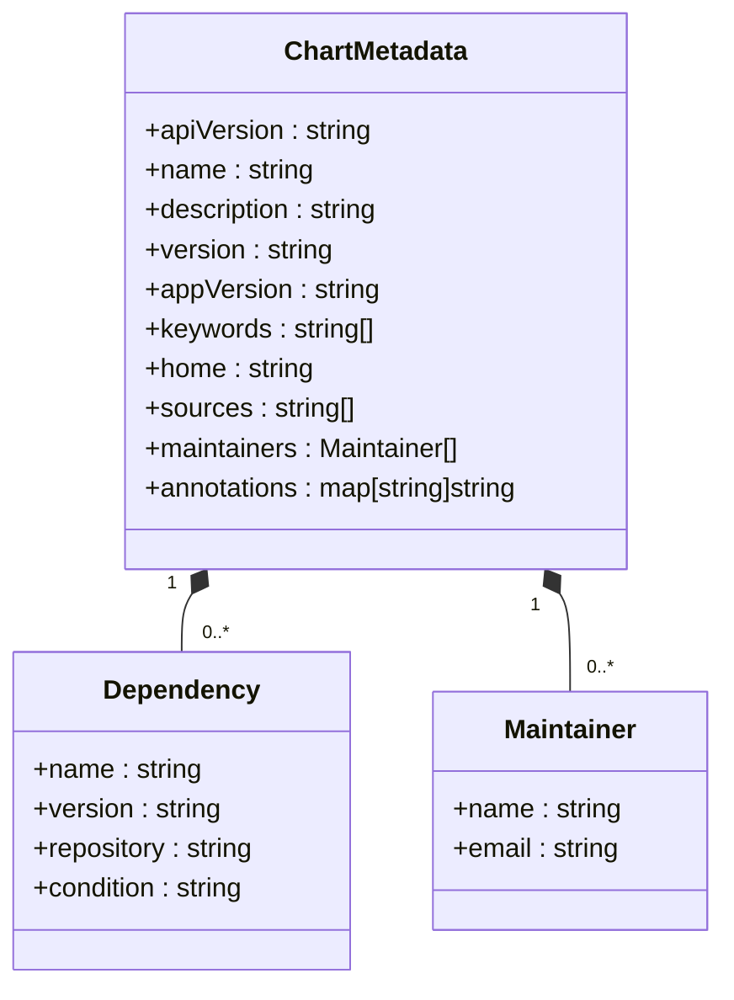

**图表来源**  
- [Chart.yaml](file://deployment/k8s/helm/smartabp/Chart.yaml)

**本节来源**  
- [Chart.yaml](file://deployment/k8s/helm/smartabp/Chart.yaml)

## values.yaml配置详解

`values.yaml`文件包含了SmartAbp应用的所有可配置参数，分为前端、后端、数据库、缓存、监控等多个部分。

### 前端配置
前端配置包括镜像信息、副本数量、资源限制、服务配置、入口配置等。

| 配置项 | 说明 | 默认值 |
|--------|------|--------|
| frontend.enabled | 是否启用前端 | true |
| frontend.image.tag | 前端镜像标签 | "1.0.0" |
| frontend.replicaCount | 前端副本数量 | 3 |
| frontend.resources.limits.cpu | CPU限制 | 500m |
| frontend.resources.limits.memory | 内存限制 | 512Mi |
| frontend.service.type | 服务类型 | ClusterIP |
| frontend.ingress.hosts | 入口主机名 | lowcode.smartabp.com |

### 后端配置
后端配置包括镜像信息、副本数量、资源限制、数据库连接字符串等。

| 配置项 | 说明 | 默认值 |
|--------|------|--------|
| backend.enabled | 是否启用后端 | true |
| backend.image.tag | 后端镜像标签 | "1.0.0" |
| backend.replicaCount | 后端副本数量 | 2 |
| backend.resources.limits.cpu | CPU限制 | 1000m |
| backend.resources.limits.memory | 内存限制 | 2Gi |
| backend.env.ASPNETCORE_ENVIRONMENT | ASP.NET环境 | "Production" |
| backend.env.ConnectionStrings__Default | 数据库连接字符串 | Server=smartabp-postgresql;... |

### 数据库配置
PostgreSQL数据库配置包括认证信息、架构、持久化和资源限制。

| 配置项 | 说明 | 默认值 |
|--------|------|--------|
| postgresql.enabled | 是否启用PostgreSQL | true |
| postgresql.auth.postgresPassword | PostgreSQL管理员密码 | PostgresAdmin2024! |
| postgresql.auth.username | 数据库用户名 | smartabp |
| postgresql.auth.password | 数据库用户密码 | SmartAbp2024! |
| postgresql.primary.persistence.size | 持久化存储大小 | 20Gi |
| postgresql.primary.resources.limits.cpu | CPU限制 | 1000m |
| postgresql.primary.resources.limits.memory | 内存限制 | 2Gi |

### 缓存配置
Redis缓存配置包括架构、持久化和资源限制。

| 配置项 | 说明 | 默认值 |
|--------|------|--------|
| redis.enabled | 是否启用Redis | true |
| redis.master.persistence.size | 持久化存储大小 | 8Gi |
| redis.master.resources.limits.cpu | CPU限制 | 500m |
| redis.master.resources.limits.memory | 内存限制 | 1Gi |

**本节来源**  
- [values.yaml](file://deployment/k8s/helm/smartabp/values.yaml)

## 模板文件结构分析

### 部署模板分析

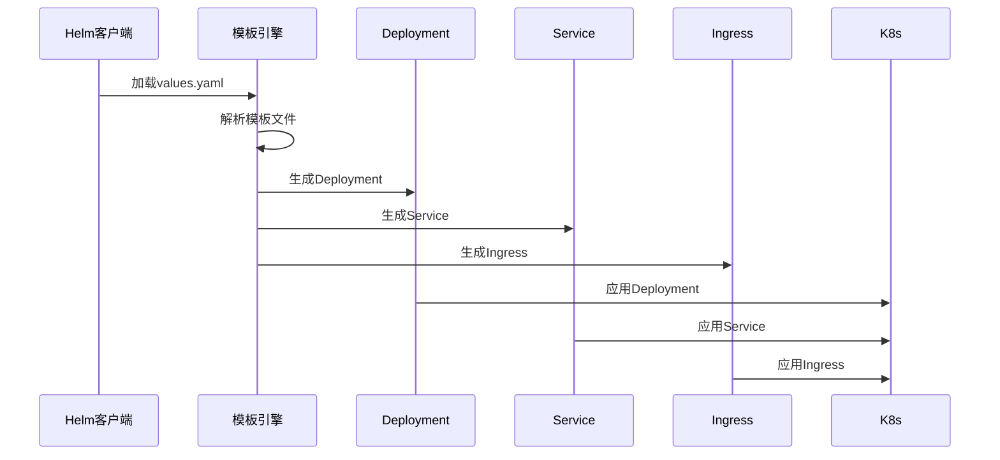

**图表来源**  
- [backend/deployment.yaml](file://deployment/k8s/helm/smartabp/templates/backend/deployment.yaml)
- [backend/service.yaml](file://deployment/k8s/helm/smartabp/templates/backend/service.yaml)
- [backend/ingress.yaml](file://deployment/k8s/helm/smartabp/templates/backend/ingress.yaml)

### 后端部署模板
后端部署模板定义了SmartAbp后端应用的部署配置，包括副本数量、资源限制、环境变量、探针配置等。

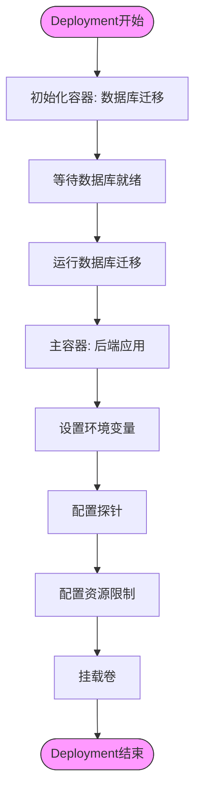

**图表来源**  
- [backend/deployment.yaml](file://deployment/k8s/helm/smartabp/templates/backend/deployment.yaml)

### 前端部署模板
前端部署模板定义了Vue3前端应用的部署配置。

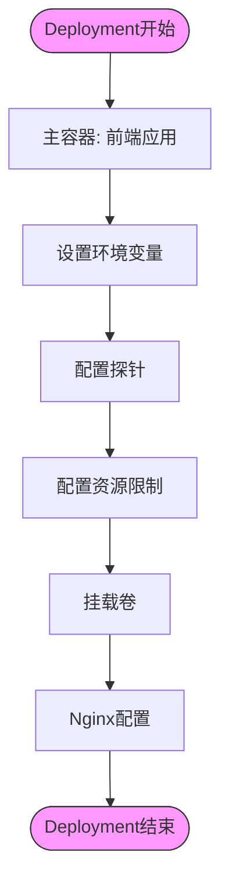

**图表来源**  
- [frontend/deployment.yaml](file://deployment/k8s/helm/smartabp/templates/frontend/deployment.yaml)

### 服务模板分析
服务模板定义了Kubernetes服务的配置，包括服务类型、端口映射、会话亲和性等。

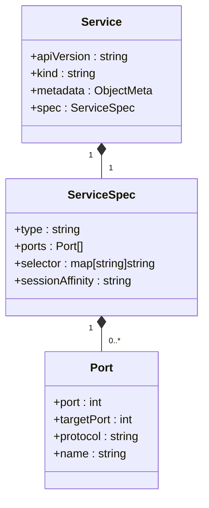

**图表来源**  
- [backend/service.yaml](file://deployment/k8s/helm/smartabp/templates/backend/service.yaml)
- [frontend/service.yaml](file://deployment/k8s/helm/smartabp/templates/frontend/service.yaml)

### 入口模板分析
入口模板定义了Ingress资源的配置，包括主机名、路径、TLS配置等。

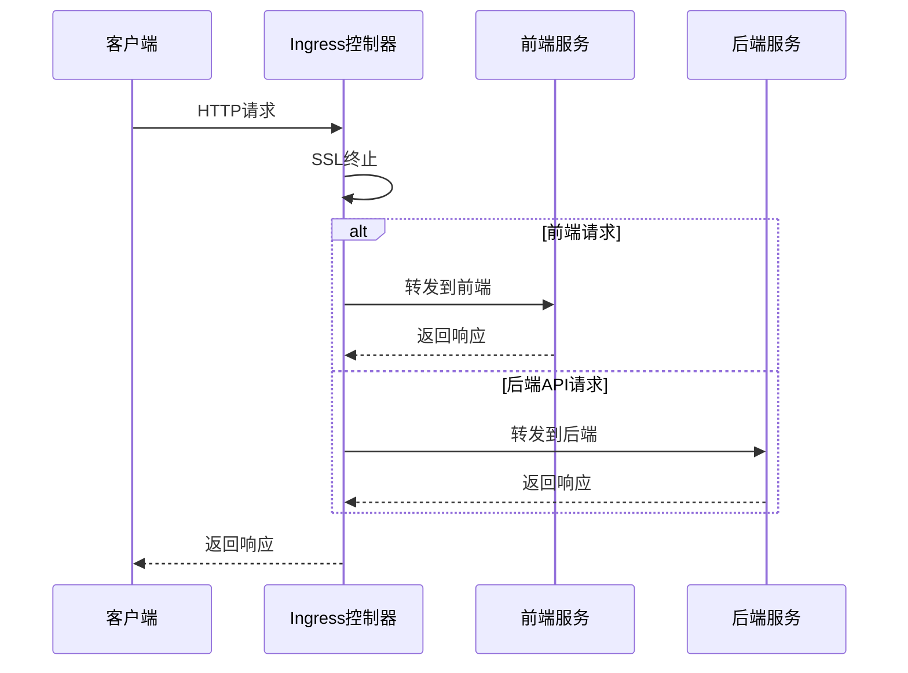

**图表来源**  
- [backend/ingress.yaml](file://deployment/k8s/helm/smartabp/templates/backend/ingress.yaml)
- [frontend/ingress.yaml](file://deployment/k8s/helm/smartabp/templates/frontend/ingress.yaml)

### 配置映射模板
配置映射模板定义了应用的配置信息，包括Nginx配置、环境变量等。

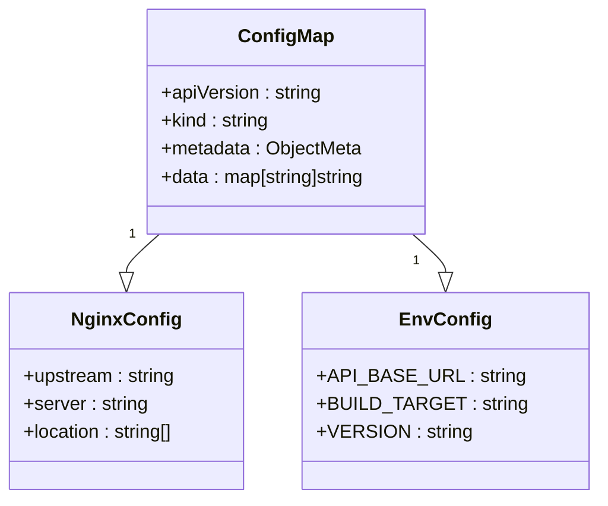

**图表来源**  
- [backend/configmap.yaml](file://deployment/k8s/helm/smartabp/templates/backend/configmap.yaml)
- [frontend/configmap.yaml](file://deployment/k8s/helm/smartabp/templates/frontend/configmap.yaml)

### 安全相关模板
安全相关模板包括网络策略、Pod中断预算和服务账户等。

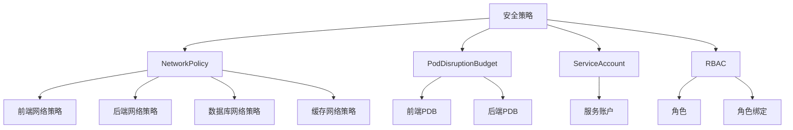

**图表来源**  
- [networkpolicy.yaml](file://deployment/k8s/helm/smartabp/templates/networkpolicy.yaml)
- [poddisruptionbudget.yaml](file://deployment/k8s/helm/smartabp/templates/poddisruptionbudget.yaml)
- [serviceaccount.yaml](file://deployment/k8s/helm/smartabp/templates/serviceaccount.yaml)

**本节来源**  
- [backend/deployment.yaml](file://deployment/k8s/helm/smartabp/templates/backend/deployment.yaml)
- [frontend/deployment.yaml](file://deployment/k8s/helm/smartabp/templates/frontend/deployment.yaml)
- [backend/service.yaml](file://deployment/k8s/helm/smartabp/templates/backend/service.yaml)
- [frontend/service.yaml](file://deployment/k8s/helm/smartabp/templates/frontend/service.yaml)
- [backend/ingress.yaml](file://deployment/k8s/helm/smartabp/templates/backend/ingress.yaml)
- [frontend/ingress.yaml](file://deployment/k8s/helm/smartabp/templates/frontend/ingress.yaml)

## Helm部署流程

### Helm部署命令
Helm提供了安装、升级和回滚等命令来管理应用部署。

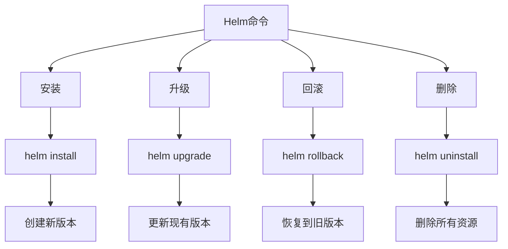

### 部署流程
Helm部署流程包括安装、升级和回滚三个主要操作。

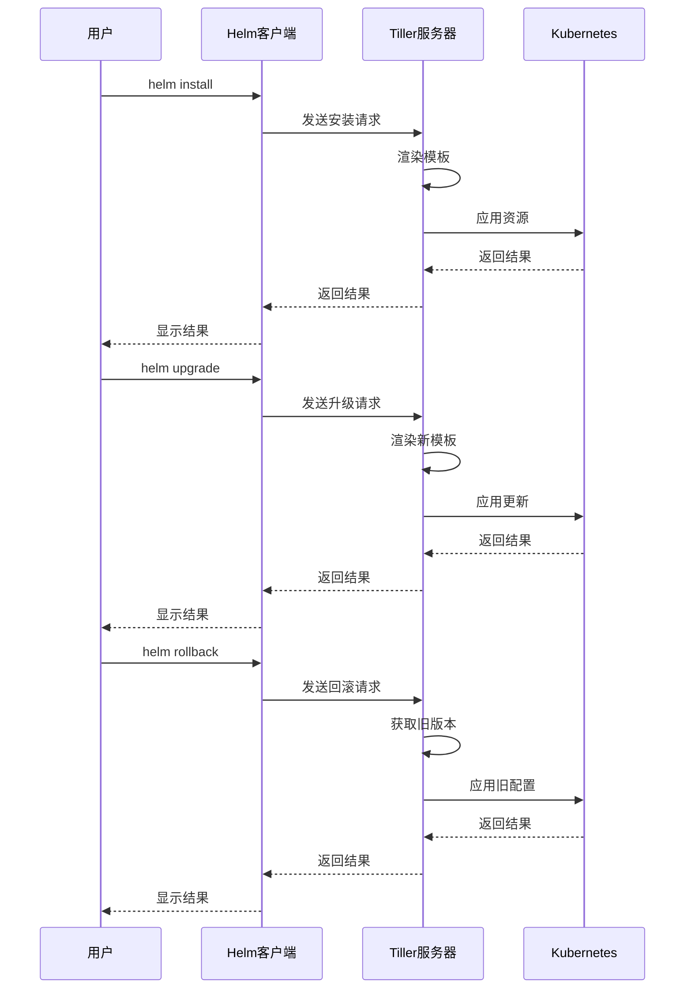

**本节来源**  
- [Chart.yaml](file://deployment/k8s/helm/smartabp/Chart.yaml)
- [values.yaml](file://deployment/k8s/helm/smartabp/values.yaml)

## 值文件覆盖与环境配置

### 值文件覆盖机制
Helm允许通过多个值文件来覆盖默认配置，实现不同环境的定制化部署。

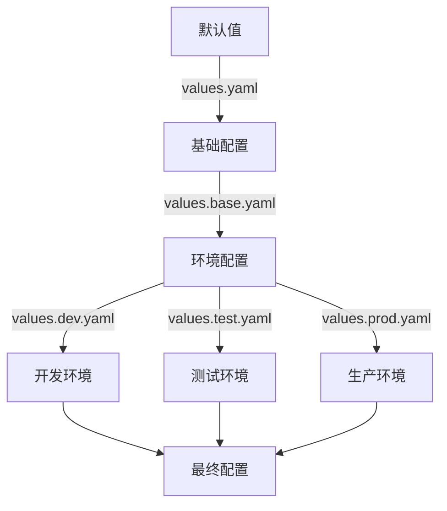

### 环境特定配置
不同环境的配置文件可以覆盖特定的值，以适应不同环境的需求。

| 环境 | 副本数量 | 资源限制 | 日志级别 | 备注 |
|------|----------|----------|----------|------|
| 开发 | 1 | 低 | Debug | 禁用生产特性 |
| 测试 | 2 | 中 | Information | 启用所有特性 |
| 生产 | 3-5 | 高 | Warning | 启用所有安全特性 |

**本节来源**  
- [values.yaml](file://deployment/k8s/helm/smartabp/values.yaml)

## 部署验证与常见问题排查

### 部署验证步骤
部署完成后，需要进行一系列验证以确保应用正常运行。

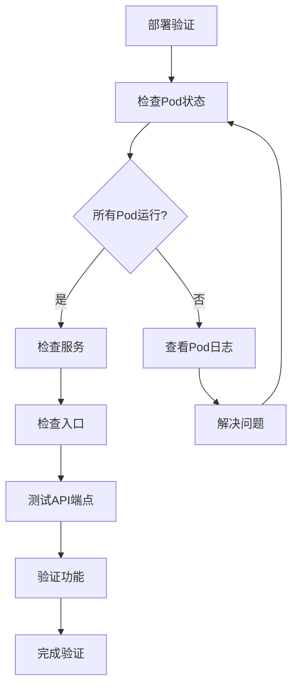

### 常见问题排查
常见问题包括镜像拉取失败、资源不足、配置错误等。

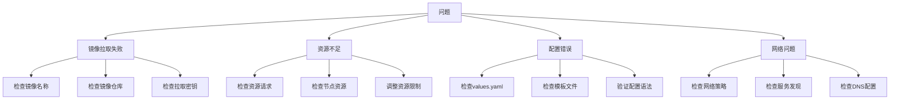

**本节来源**  
- [backend/deployment.yaml](file://deployment/k8s/helm/smartabp/templates/backend/deployment.yaml)
- [frontend/deployment.yaml](file://deployment/k8s/helm/smartabp/templates/frontend/deployment.yaml)
- [values.yaml](file://deployment/k8s/helm/smartabp/values.yaml)

## 结论
hxlot项目的Helm部署方案提供了完整的Kubernetes部署能力，通过`Chart.yaml`和`values.yaml`文件实现了灵活的配置管理。模板文件使用Helm的模板语法实现了动态配置，支持不同环境的定制化部署。部署流程清晰，提供了安装、升级和回滚等操作，确保了部署的可靠性和可维护性。通过合理的值文件覆盖机制，可以轻松实现开发、测试和生产环境的差异化配置。