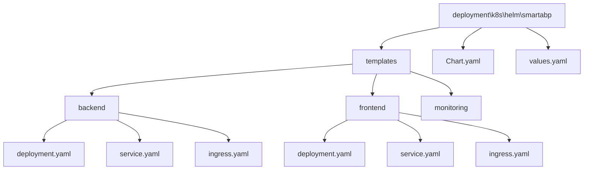
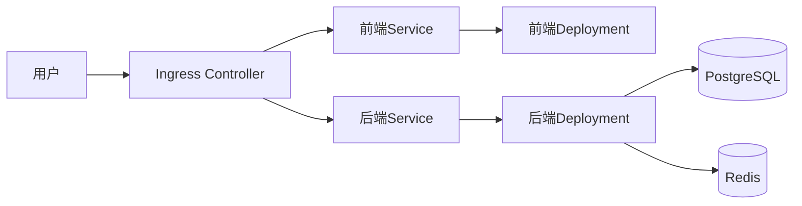
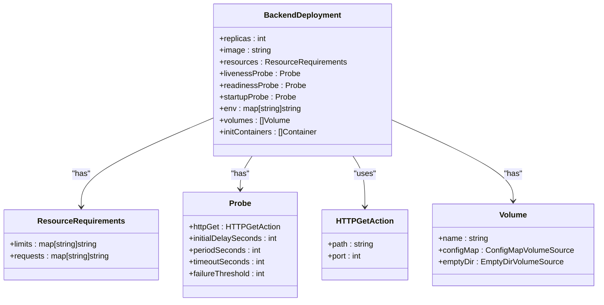
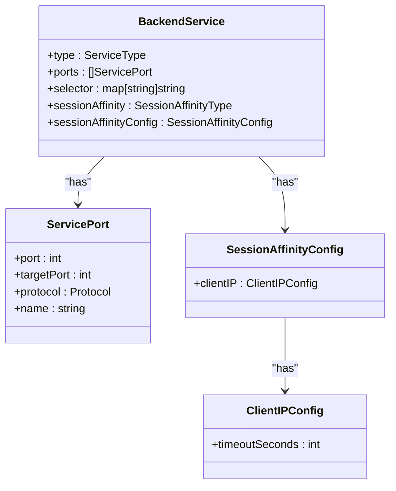
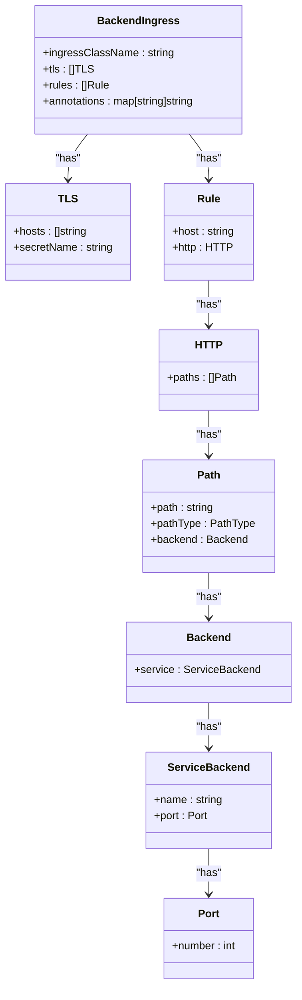
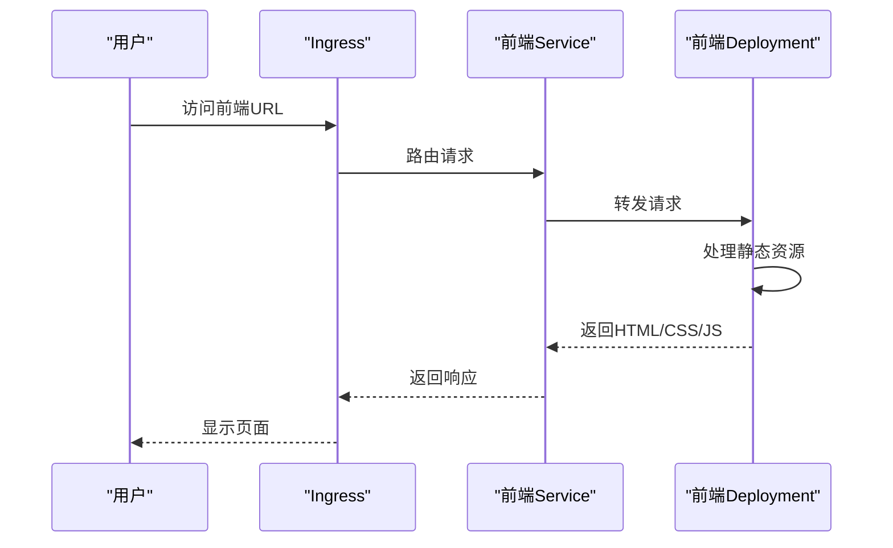
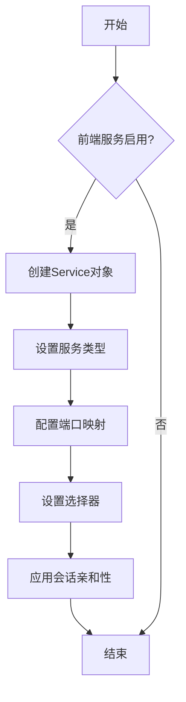
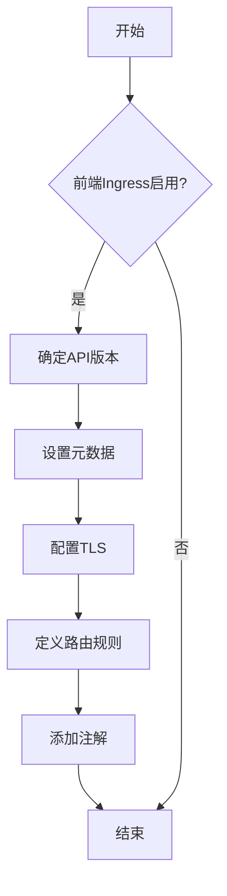
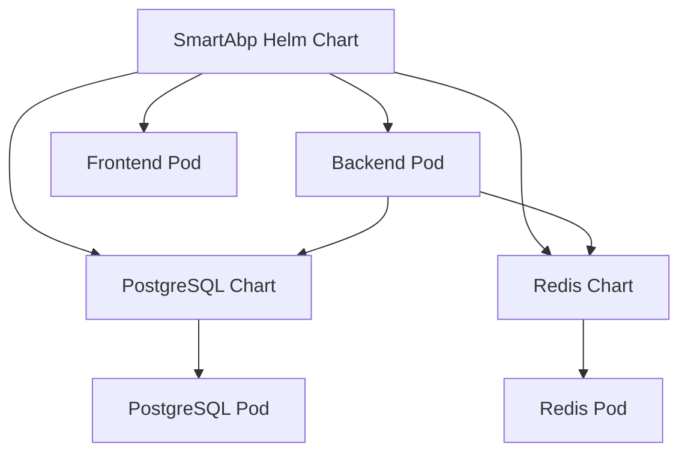

# 部署模板

<cite>
**本文档引用的文件**
- [deployment.yaml](file://deployment\k8s\helm\smartabp\templates\backend\deployment.yaml)
- [service.yaml](file://deployment\k8s\helm\smartabp\templates\backend\service.yaml)
- [ingress.yaml](file://deployment\k8s\helm\smartabp\templates\backend\ingress.yaml)
- [values.yaml](file://deployment\k8s\helm\smartabp\values.yaml)
- [Chart.yaml](file://deployment\k8s\helm\smartabp\Chart.yaml)
</cite>

## 目录
1. [简介](#简介)
2. [项目结构](#项目结构)
3. [核心组件](#核心组件)
4. [架构概述](#架构概述)
5. [详细组件分析](#详细组件分析)
6. [依赖分析](#依赖分析)
7. [性能考虑](#性能考虑)
8. [故障排除指南](#故障排除指南)
9. [结论](#结论)

## 简介
本文档深入解析hxlot项目中Helm模板文件的结构和变量引用机制。重点分析`templates`目录下的`deployment.yaml`、`service.yaml`和`ingress.yaml`模板文件，解释Kubernetes资源对象的定义，包括Deployment、Service和Ingress的配置参数。同时，详细描述Helm模板语法和函数的使用方法，如`{{ .Values }}`、`{{ if }}`、`{{ range }}`等，并提供模板开发和调试的最佳实践。

## 项目结构
hxlot项目的部署配置采用Helm Chart方式进行管理，所有Kubernetes部署模板文件位于`deployment\k8s\helm\smartabp\templates`目录下。该目录按照组件类型组织，包含backend、frontend和monitoring等子目录，每个子目录下存放相应的Kubernetes资源定义文件。

**Diagram sources**
- [Chart.yaml](file://deployment\k8s\helm\smartabp\Chart.yaml#L1-L48)
- [values.yaml](file://deployment\k8s\helm\smartabp\values.yaml#L1-L473)

**Section sources**
- [Chart.yaml](file://deployment\k8s\helm\smartabp\Chart.yaml#L1-L48)
- [values.yaml](file://deployment\k8s\helm\smartabp\values.yaml#L1-L473)

## 核心组件
本项目的核心部署组件包括后端服务、前端服务和监控组件。后端服务基于ABP vNext和.NET技术栈，前端服务采用Vue3和TypeScript构建。每个组件都有独立的Deployment、Service和Ingress配置，通过Helm模板实现灵活的部署管理。

**Section sources**
- [deployment.yaml](file://deployment\k8s\helm\smartabp\templates\backend\deployment.yaml#L1-L182)
- [service.yaml](file://deployment\k8s\helm\smartabp\templates\backend\service.yaml#L1-L50)
- [ingress.yaml](file://deployment\k8s\helm\smartabp\templates\backend\ingress.yaml#L1-L86)

## 架构概述
hxlot项目的部署架构采用微服务模式，前后端分离部署。后端服务处理业务逻辑和数据访问，前端服务提供用户界面。通过Ingress控制器实现外部访问路由，Service提供内部服务发现，Deployment确保应用的高可用性。

**Diagram sources**
- [deployment.yaml](file://deployment\k8s\helm\smartabp\templates\backend\deployment.yaml#L1-L182)
- [service.yaml](file://deployment\k8s\helm\smartabp\templates\backend\service.yaml#L1-L50)
- [ingress.yaml](file://deployment\k8s\helm\smartabp\templates\backend\ingress.yaml#L1-L86)

## 详细组件分析

### 后端组件分析
后端组件的部署配置包含完整的Kubernetes资源定义，从Deployment到Service再到Ingress，形成完整的部署链条。

#### Deployment分析
后端Deployment配置了应用的部署策略、副本数量、资源限制和健康检查等关键参数。通过initContainers实现了数据库迁移的自动化，确保应用启动前数据库结构已就绪。

**Diagram sources**
- [deployment.yaml](file://deployment\k8s\helm\smartabp\templates\backend\deployment.yaml#L1-L182)

**Section sources**
- [deployment.yaml](file://deployment\k8s\helm\smartabp\templates\backend\deployment.yaml#L1-L182)

#### Service分析
后端Service配置了服务发现和负载均衡功能，支持多种服务类型（ClusterIP、NodePort、LoadBalancer），并配置了会话亲和性以支持有状态应用。

**Diagram sources**
- [service.yaml](file://deployment\k8s\helm\smartabp\templates\backend\service.yaml#L1-L50)

**Section sources**
- [service.yaml](file://deployment\k8s\helm\smartabp\templates\backend\service.yaml#L1-L50)

#### Ingress分析
后端Ingress配置了外部访问路由规则，包含TLS加密、CORS处理、安全头设置和速率限制等高级功能，确保API服务的安全性和稳定性。

**Diagram sources**
- [ingress.yaml](file://deployment\k8s\helm\smartabp\templates\backend\ingress.yaml#L1-L86)

**Section sources**
- [ingress.yaml](file://deployment\k8s\helm\smartabp\templates\backend\ingress.yaml#L1-L86)

### 前端组件分析
前端组件的部署配置与后端类似，但针对静态资源服务的特点进行了优化。

#### Deployment分析
前端Deployment配置了Nginx作为Web服务器，通过ConfigMap注入Nginx配置，实现了前端路由的正确处理。

**Diagram sources**
- [deployment.yaml](file://deployment\k8s\helm\smartabp\templates\frontend\deployment.yaml#L1-L113)

**Section sources**
- [deployment.yaml](file://deployment\k8s\helm\smartabp\templates\frontend\deployment.yaml#L1-L113)

#### Service分析
前端Service配置相对简单，主要提供HTTP服务发现功能，不启用会话亲和性，以实现最佳的负载均衡效果。

**Diagram sources**
- [service.yaml](file://deployment\k8s\helm\smartabp\templates\frontend\service.yaml#L1-L41)

**Section sources**
- [service.yaml](file://deployment\k8s\helm\smartabp\templates\frontend\service.yaml#L1-L41)

#### Ingress分析
前端Ingress配置了性能优化和安全策略，包括Brotli压缩、内容安全策略（CSP）和速率限制，以提升用户体验和安全性。

**Diagram sources**
- [ingress.yaml](file://deployment\k8s\helm\smartabp\templates\frontend\ingress.yaml#L1-L81)

**Section sources**
- [ingress.yaml](file://deployment\k8s\helm\smartabp\templates\frontend\ingress.yaml#L1-L81)

## 依赖分析
hxlot项目的部署配置依赖于多个外部组件和内部模块。Helm Chart通过dependencies字段声明了对Bitnami PostgreSQL和Redis Chart的依赖，实现了数据库和缓存服务的一键部署。

**Diagram sources**
- [Chart.yaml](file://deployment\k8s\helm\smartabp\Chart.yaml#L1-L48)
- [values.yaml](file://deployment\k8s\helm\smartabp\values.yaml#L1-L473)

**Section sources**
- [Chart.yaml](file://deployment\k8s\helm\smartabp\Chart.yaml#L1-L48)
- [values.yaml](file://deployment\k8s\helm\smartabp\values.yaml#L1-L473)

## 性能考虑
部署配置中包含了多项性能优化措施。后端服务配置了合理的资源限制和请求，避免资源争用；前端服务启用了Brotli压缩和Nginx缓存，提升静态资源加载速度；Ingress配置了连接超时和缓冲区大小，优化网络性能。

## 故障排除指南
当部署出现问题时，可按照以下步骤进行排查：
1. 检查Helm release状态
2. 查看Pod日志和事件
3. 验证Service和Ingress配置
4. 检查资源配额和节点状态
5. 验证网络策略和防火墙规则

**Section sources**
- [deployment.yaml](file://deployment\k8s\helm\smartabp\templates\backend\deployment.yaml#L1-L182)
- [service.yaml](file://deployment\k8s\helm\smartabp\templates\backend\service.yaml#L1-L50)
- [ingress.yaml](file://deployment\k8s\helm\smartabp\templates\backend\ingress.yaml#L1-L86)

## 结论
hxlot项目的Helm部署模板设计合理，功能完整，通过values.yaml文件实现了高度的配置灵活性。模板文件结构清晰，遵循了Kubernetes最佳实践，包含了健康检查、资源管理、安全配置等关键功能，为应用的稳定运行提供了保障。