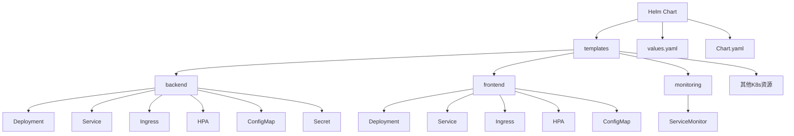
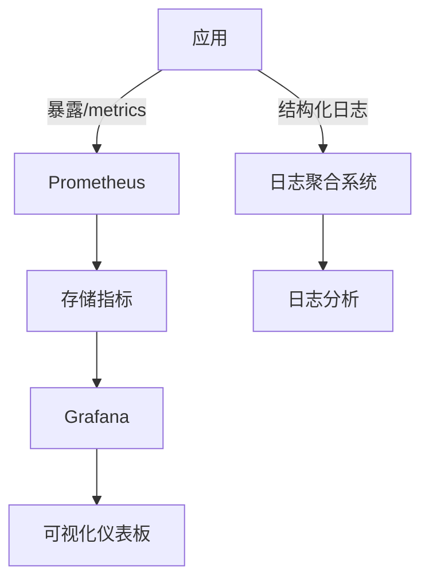

# 配置值文件

<cite>
**本文档中引用的文件**  
- [values.yaml](file://deployment/k8s/helm/smartabp/values.yaml)
- [Chart.yaml](file://deployment/k8s/helm/smartabp/Chart.yaml)
- [deployment.yaml](file://deployment/k8s/helm/smartabp/templates/backend/deployment.yaml)
- [frontend-deployment.yaml](file://deployment/k8s/helm/smartabp/templates/frontend/deployment.yaml)
- [servicemonitor.yaml](file://deployment/k8s/helm/smartabp/templates/monitoring/servicemonitor.yaml)
- [production-deployment.yaml](file://deployment/k8s/production/deployment.yaml)
</cite>

## 目录
1. [简介](#简介)
2. [项目结构](#项目结构)
3. [全局配置](#全局配置)
4. [后端服务配置](#后端服务配置)
5. [前端服务配置](#前端服务配置)
6. [数据库与缓存配置](#数据库与缓存配置)
7. [监控与可观测性配置](#监控与可观测性配置)
8. [安全配置](#安全配置)
9. [环境特定配置与覆盖机制](#环境特定配置与覆盖机制)
10. [最佳实践](#最佳实践)

## 简介
本文件详细说明了hxlot项目中Helm Chart的`values.yaml`配置文件，用于在Kubernetes环境中部署SmartAbp低代码引擎。该配置文件支持高度可定制化部署，涵盖全局设置、前后端服务、数据库、缓存、监控、安全等多个方面，适用于开发、测试和生产等不同环境。

## 项目结构
项目采用Helm Chart方式组织Kubernetes部署配置，主要结构如下：



**图示来源**  
- [Chart.yaml](file://deployment/k8s/helm/smartabp/Chart.yaml)
- [values.yaml](file://deployment/k8s/helm/smartabp/values.yaml)

**本节来源**  
- [Chart.yaml](file://deployment/k8s/helm/smartabp/Chart.yaml)
- [values.yaml](file://deployment/k8s/helm/smartabp/values.yaml)

## 全局配置
全局配置定义了适用于整个部署的通用设置。

```yaml
global:
  imageRegistry: ""  # 镜像仓库地址
  imagePullSecrets: []  # 镜像拉取密钥
  storageClass: ""  # 存储类名称
```

- **imageRegistry**: 指定默认镜像仓库，为空时使用Docker Hub
- **imagePullSecrets**: 用于私有镜像仓库认证的Secret列表
- **storageClass**: 持久卷的存储类，影响PostgreSQL和Redis的持久化存储

**本节来源**  
- [values.yaml](file://deployment/k8s/helm/smartabp/values.yaml#L4-L6)

## 后端服务配置
后端服务基于ABP vNext框架构建，配置项如下：

### 镜像与副本
```yaml
backend:
  enabled: true
  image:
    registry: docker.io
    repository: smartabp/lowcode-backend
    tag: "1.0.0"
    pullPolicy: IfNotPresent
  replicaCount: 2
```

### 资源限制
```yaml
resources:
  limits:
    cpu: 1000m
    memory: 2Gi
  requests:
    cpu: 500m
    memory: 1Gi
```

### 自动扩缩容
```yaml
autoscaling:
  enabled: true
  minReplicas: 2
  maxReplicas: 8
  targetCPUUtilizationPercentage: 75
```

### 环境变量
```yaml
env:
  ASPNETCORE_ENVIRONMENT: "Production"
  ConnectionStrings__Default: "Server=smartabp-postgresql;Port=5432;Database=SmartAbpLowCode;User Id=smartabp;Password=SmartAbp2024!"
  App__CorsOrigins: "https://lowcode.smartabp.com"
```

### 健康检查
```yaml
livenessProbe:
  httpGet:
    path: /health
    port: 8080
  initialDelaySeconds: 60
readinessProbe:
  httpGet:
    path: /health/ready
    port: 8080
  initialDelaySeconds: 30
```

**本节来源**  
- [values.yaml](file://deployment/k8s/helm/smartabp/values.yaml#L68-L158)
- [deployment.yaml](file://deployment/k8s/helm/smartabp/templates/backend/deployment.yaml)

## 前端服务配置
前端服务基于Vue3 + TypeScript构建，配置项如下：

### 镜像与副本
```yaml
frontend:
  enabled: true
  image:
    registry: docker.io
    repository: smartabp/lowcode-frontend
    tag: "1.0.0"
  replicaCount: 3
```

### 资源限制
```yaml
resources:
  limits:
    cpu: 500m
    memory: 512Mi
  requests:
    cpu: 250m
    memory: 256Mi
```

### 环境变量
```yaml
env:
  NODE_ENV: "production"
  VITE_API_BASE_URL: "https://api.lowcode.smartabp.com"
  VITE_BUILD_TARGET: "production"
```

### Ingress配置
```yaml
ingress:
  enabled: true
  className: "nginx"
  hosts:
    - host: lowcode.smartabp.com
      paths:
        - path: /
          pathType: Prefix
  tls:
    - secretName: smartabp-lowcode-tls
      hosts:
        - lowcode.smartabp.com
```

**本节来源**  
- [values.yaml](file://deployment/k8s/helm/smartabp/values.yaml#L20-L67)
- [frontend-deployment.yaml](file://deployment/k8s/helm/smartabp/templates/frontend/deployment.yaml)

## 数据库与缓存配置
### PostgreSQL配置
```yaml
postgresql:
  enabled: true
  auth:
    postgresPassword: "PostgresAdmin2024!"
    username: "smartabp"
    password: "SmartAbp2024!"
    database: "SmartAbpLowCode"
  primary:
    persistence:
      enabled: true
      size: 20Gi
    resources:
      limits:
        cpu: 1000m
        memory: 2Gi
```

### Redis配置
```yaml
redis:
  enabled: true
  auth:
    enabled: false
  master:
    persistence:
      enabled: true
      size: 8Gi
    resources:
      limits:
        cpu: 500m
        memory: 1Gi
```

**本节来源**  
- [values.yaml](file://deployment/k8s/helm/smartabp/values.yaml#L160-L245)

## 监控与可观测性配置
### Prometheus监控
```yaml
monitoring:
  prometheus:
    enabled: true
    serviceMonitor:
      enabled: true
      namespace: monitoring
      interval: 30s
      path: /metrics
```

### Grafana仪表板
```yaml
grafana:
  enabled: true
  dashboards:
    enabled: true
```

### 日志配置
```yaml
logging:
  enabled: true
  level: "Information"
  structured: true
  aggregation:
    enabled: true
```



**图示来源**  
- [servicemonitor.yaml](file://deployment/k8s/helm/smartabp/templates/monitoring/servicemonitor.yaml)
- [values.yaml](file://deployment/k8s/helm/smartabp/values.yaml#L347-L388)

**本节来源**  
- [values.yaml](file://deployment/k8s/helm/smartabp/values.yaml#L347-L388)
- [servicemonitor.yaml](file://deployment/k8s/helm/smartabp/templates/monitoring/servicemonitor.yaml)

## 安全配置
### Pod安全标准
```yaml
security:
  podSecurityStandards:
    enforce: "restricted"
    audit: "restricted"
    warn: "restricted"
```

### 网络策略
```yaml
networkPolicies:
  enabled: true
```

### RBAC
```yaml
rbac:
  create: true
serviceAccount:
  create: true
```

### 安全上下文
```yaml
podSecurityContext:
  fsGroup: 1001
securityContext:
  runAsNonRoot: true
  runAsUser: 1001
  capabilities:
    drop:
      - ALL
  allowPrivilegeEscalation: false
```

**本节来源**  
- [values.yaml](file://deployment/k8s/helm/smartabp/values.yaml#L389-L417)

## 环境特定配置与覆盖机制
Helm支持通过不同的values文件实现环境特定配置：

### 开发环境
```yaml
# values-dev.yaml
backend:
  replicaCount: 1
  resources:
    requests:
      memory: 512Mi
  env:
    ASPNETCORE_ENVIRONMENT: "Development"
development:
  enabled: true
  debug:
    enabled: true
```

### 生产环境
```yaml
# values-prod.yaml
backend:
  replicaCount: 4
  resources:
    requests:
      memory: 2Gi
  autoscaling:
    minReplicas: 4
    maxReplicas: 12
security:
  podSecurityStandards:
    enforce: "restricted"
```

### 覆盖机制
使用`--values`参数指定多个values文件，后指定的文件会覆盖前面的配置：
```bash
helm install smartabp . \
  --values values.yaml \
  --values values-prod.yaml \
  --values values-secrets.yaml
```

**本节来源**  
- [values.yaml](file://deployment/k8s/helm/smartabp/values.yaml)
- [production-deployment.yaml](file://deployment/k8s/production/deployment.yaml)

## 最佳实践
1. **镜像版本管理**: 使用语义化版本号，避免使用`latest`标签
2. **资源规划**: 根据实际负载测试确定合理的资源请求和限制
3. **安全配置**: 始终使用非root用户运行容器，禁用特权模式
4. **健康检查**: 合理设置初始延迟时间，避免应用未启动完成就被重启
5. **环境分离**: 为不同环境使用独立的values文件，避免配置混淆
6. **敏感信息**: 将密码等敏感信息放在独立的Secrets文件中，避免版本控制
7. **备份策略**: 配置定期数据库备份，保留足够时间的历史数据
8. **监控告警**: 配置关键指标的监控和告警，及时发现系统异常

**本节来源**  
- [values.yaml](file://deployment/k8s/helm/smartabp/values.yaml)
- [production-deployment.yaml](file://deployment/k8s/production/deployment.yaml)