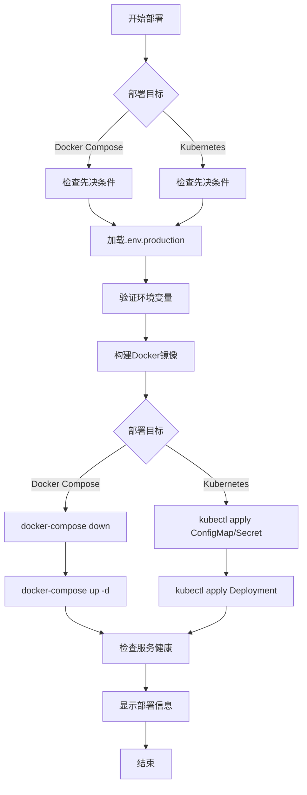

# 部署配置

<cite>
**本文档引用的文件**  
- [smartabp](file://deployment/k8s/helm/smartabp/Chart.yaml)
- [values.yaml](file://deployment/k8s/helm/smartabp/values.yaml)
- [deployment.yaml](file://deployment/k8s/production/deployment.yaml)
- [docker-compose.production.yml](file://docker-compose.production.yml)
- [deploy-production.sh](file://scripts/deployment/deploy-production.sh)
- [Program.cs](file://src/SmartAbp.AspireHost/Program.cs)
</cite>

## 目录
1. [Kubernetes与Helm部署方案](#kubernetes与helm部署方案)
2. [Helm图表结构与values.yaml配置](#helm图表结构与valuesyaml配置)
3. [Deployment、Service与Ingress资源定义](#deployment、service与ingress资源定义)
4. [生产环境Docker Compose配置](#生产环境docker-compose配置)
5. [AspireHost在开发与云部署中的作用](#aspirehost在开发与云部署中的作用)
6. [deploy-production.sh脚本执行流程](#deploy-productionsh脚本执行流程)
7. [环境变量与密钥管理](#环境变量与密钥管理)
8. [部署流程图与环境配置对比](#部署流程图与环境配置对比)

## Kubernetes与Helm部署方案

hxlot项目采用Kubernetes（K8s）作为容器编排平台，结合Helm进行应用部署管理。Helm通过`helm/smartabp`图表实现对SmartAbp低代码引擎的统一部署，支持前端、后端、数据库、缓存、监控等组件的一键部署。该方案适用于生产环境，具备高可用性、自动扩缩容、服务发现与负载均衡能力。

部署采用分层架构，包括基础设施层（PostgreSQL、Redis）、应用层（SmartAbp前后端）、网关层（Nginx）和监控层（Prometheus、Grafana）。通过Helm的`values.yaml`文件实现环境差异化配置，支持多环境部署。

**Section sources**
- [Chart.yaml](file://deployment/k8s/helm/smartabp/Chart.yaml#L1-L48)
- [values.yaml](file://deployment/k8s/helm/smartabp/values.yaml#L1-L473)

## Helm图表结构与values.yaml配置

`helm/smartabp`图表位于`deployment/k8s/helm/smartabp`目录，其结构如下：

```
helm/smartabp/
├── Chart.yaml
├── values.yaml
└── templates/
    ├── backend/
    ├── frontend/
    ├── monitoring/
    ├── networkpolicy.yaml
    ├── poddisruptionbudget.yaml
    └── serviceaccount.yaml
```

### Chart.yaml
定义了图表的基本信息，包括名称、版本、维护者、依赖项等。图表依赖Bitnami提供的PostgreSQL和Redis子图表，确保数据库和缓存服务的标准化部署。

### values.yaml关键配置项
`values.yaml`文件包含全局和组件级配置，主要配置项如下：

- **全局设置**：镜像仓库、拉取密钥、存储类
- **前端配置**：镜像、副本数、资源限制、Ingress主机名、环境变量
- **后端配置**：数据库连接字符串、Redis配置、健康检查路径
- **数据库配置**：PostgreSQL密码、数据库名、持久化存储大小、性能参数
- **缓存配置**：Redis最大内存、淘汰策略
- **监控配置**：Prometheus、Grafana启用状态
- **安全配置**：Pod安全标准、网络策略、RBAC
- **备份配置**：数据库和应用的备份计划与保留策略

**Section sources**
- [Chart.yaml](file://deployment/k8s/helm/smartabp/Chart.yaml#L1-L48)
- [values.yaml](file://deployment/k8s/helm/smartabp/values.yaml#L1-L473)

## Deployment、Service与Ingress资源定义

`deployment/k8s/production/deployment.yaml`文件定义了生产环境的Kubernetes资源。

### Deployment
- **名称**：`smartabp-app`
- **命名空间**：`smartabp-production`
- **副本数**：3
- **更新策略**：滚动更新，最大不可用副本数为0，确保服务不中断
- **Pod反亲和性**：避免同一节点部署多个实例，提高可用性
- **Init容器**：等待PostgreSQL和Redis服务就绪后再启动主容器
- **主容器**：
  - 镜像：`smartabp/lowcode-generator:1.0.0`
  - 端口：5000
  - 环境变量：从Secret和ConfigMap中注入数据库、Redis、JWT密钥等
  - 资源限制：CPU 2核，内存2Gi
  - 健康检查：Liveness和Readiness探针检查`/health`端点
  - 生命周期：`preStop`阶段休眠15秒，确保连接优雅关闭

### Service
- **类型**：ClusterIP
- **会话亲和性**：基于客户端IP保持会话
- **端口映射**：外部80端口映射到容器5000端口

### HorizontalPodAutoscaler
- **最小副本数**：3
- **最大副本数**：10
- **扩缩容指标**：CPU利用率70%，内存利用率80%
- **行为策略**：快速扩容，缓慢缩容，避免抖动

**Section sources**
- [deployment.yaml](file://deployment/k8s/production/deployment.yaml#L1-L240)

## 生产环境Docker Compose配置

`docker-compose.production.yml`文件定义了生产环境的Docker Compose部署配置，包含以下服务：

- **PostgreSQL**：16-alpine镜像，数据持久化，健康检查，资源限制
- **Redis**：7-alpine镜像，密码保护，AOF持久化，最大内存1GB
- **SmartAbp应用**：基于`Dockerfile.production`构建，依赖数据库和Redis，环境变量从`.env.production`文件加载，健康检查等待60秒启动期
- **Nginx**：反向代理，SSL终止，静态文件缓存，日志持久化
- **Elasticsearch**：8.11.0镜像，单节点模式，密码保护，JVM堆内存1GB
- **Prometheus**：监控指标采集，数据保留30天
- **Grafana**：监控仪表板，预置数据源和仪表板

所有服务通过`smartabp-network`桥接网络通信，数据卷使用本地驱动持久化数据。

**Section sources**
- [docker-compose.production.yml](file://docker-compose.production.yml#L1-L306)

## AspireHost在本地开发和云部署中的作用

`src/SmartAbp.AspireHost`是Aspire应用主机，用于本地开发和云部署的基础设施编排。

### 主要功能
- **基础设施资源**：声明式定义PostgreSQL、Redis、RabbitMQ、Elasticsearch、Prometheus、Grafana等服务
- **微服务编排**：定义SmartAbp运维监控、主Web应用、代码生成器等微服务及其依赖关系
- **前端集成**：集成Vue前端应用，配置API代理
- **Dapr集成**：为微服务添加Dapr边车，实现服务间通信、状态管理、发布订阅
- **健康检查**：配置跨服务的健康检查端点

### 开发与生产差异
- **开发环境**：所有服务运行在本地Docker中，使用`WithDataVolume()`持久化数据，端口直接暴露
- **云部署**：使用Helm图表部署到Kubernetes，服务通过Service和Ingress暴露，配置从Secret和ConfigMap注入

AspireHost通过代码定义基础设施，实现开发与生产环境的一致性，提高部署效率和可靠性。

**Section sources**
- [Program.cs](file://src/SmartAbp.AspireHost/Program.cs#L1-L187)

## deploy-production.sh脚本的执行流程和参数

`scripts/deployment/deploy-production.sh`是一键部署脚本，支持Docker Compose和Kubernetes两种部署目标。

### 执行流程
1. **检查先决条件**：验证Docker、Docker Compose、kubectl（K8s部署时）是否安装
2. **加载环境变量**：从`.env.production`文件加载生产环境变量
3. **验证环境变量**：检查`DB_PASSWORD`、`REDIS_PASSWORD`、`JWT_SECRET_KEY`等必需变量是否设置
4. **构建镜像**：使用`Dockerfile.production`构建`smartabp/lowcode-generator`镜像，注入构建时间和版本
5. **部署**：
   - **Docker Compose**：`docker-compose down`停止旧服务，`docker-compose up -d`启动新服务
   - **Kubernetes**：创建命名空间，应用ConfigMap、Secret、Deployment等资源
6. **健康检查**：检查各服务容器或Pod的健康状态
7. **显示部署信息**：输出访问地址、日志查看命令等

### 参数
- **部署目标**：`$1`，可选`docker-compose`或`kubernetes`，默认为`docker-compose`

脚本使用`set -e`确保任何步骤失败时立即退出，并通过`trap`捕获错误执行回滚操作。

**Section sources**
- [deploy-production.sh](file://scripts/deployment/deploy-production.sh#L1-L322)

## 环境变量和密钥（Secret）的管理方法

hxlot项目采用分层的环境变量和密钥管理策略，确保配置安全与灵活性。

### 环境变量来源
1. **构建时注入**：`Dockerfile.production`中通过`ARG`指令定义`BUILD_DATE`、`VERSION`，在构建时传入
2. **运行时注入**：
   - **Docker Compose**：从`.env.production`文件加载，或在`docker-compose.production.yml`中直接定义
   - **Kubernetes**：从ConfigMap和Secret中注入，通过`valueFrom`引用

### 密钥管理
- **敏感信息**：数据库密码、Redis密码、JWT密钥、Elasticsearch密码等不硬编码在配置文件中
- **Docker Compose**：在`.env.production`文件中定义，通过`${VAR_NAME:?error message}`语法确保必需变量存在
- **Kubernetes**：存储在Secret资源中，如`smartabp-secrets`，通过`secretKeyRef`注入容器
- **AspireHost**：在`Program.cs`中通过`WithEnvironment`方法注入，开发环境明文存储，生产环境应使用密钥管理服务

### 配置文件
- **ConfigMap**：存储非敏感配置，如`appsettings.Production.json`、Nginx配置
- **Secret**：存储敏感配置，如数据库连接字符串、API密钥

该策略实现了配置与代码分离，敏感信息与非敏感信息分离，支持多环境差异化配置。

**Section sources**
- [docker-compose.production.yml](file://docker-compose.production.yml#L1-L306)
- [deploy-production.sh](file://scripts/deployment/deploy-production.sh#L1-L322)
- [deployment.yaml](file://deployment/k8s/production/deployment.yaml#L1-L240)
- [Program.cs](file://src/SmartAbp.AspireHost/Program.cs#L1-L187)

## 部署流程图与不同环境的配置差异对比表



**Diagram sources**
- [deploy-production.sh](file://scripts/deployment/deploy-production.sh#L1-L322)

### 不同环境配置差异对比表

| 配置项 | 开发环境 | 测试环境 | 生产环境 |
| :--- | :--- | :--- | :--- |
| **部署方式** | AspireHost + Docker | Helm + K8s | Helm + K8s 或 Docker Compose |
| **副本数** | 1 | 2 | 3 |
| **资源限制** | 低 | 中 | 高 |
| **持久化** | 本地卷 | PVC | PVC |
| **监控** | Prometheus/Grafana | Prometheus/Grafana | Prometheus/Grafana |
| **日志级别** | Debug | Information | Information |
| **Swagger** | 启用 | 禁用 | 禁用 |
| **数据库** | 本地PostgreSQL | 独立实例 | 高可用集群 |
| **密钥管理** | .env文件 | K8s Secret | K8s Secret + 密钥管理服务 |
| **备份** | 无 | 每日备份 | 每日数据库备份 + 每周应用备份 |
| **Ingress** | 无 | Nginx Ingress | Nginx Ingress + TLS |
| **健康检查** | 简单探针 | 完整探针 | 完整探针 + 启动探针 |

**Section sources**
- [docker-compose.production.yml](file://docker-compose.production.yml#L1-L306)
- [values.yaml](file://deployment/k8s/helm/smartabp/values.yaml#L1-L473)
- [Program.cs](file://src/SmartAbp.AspireHost/Program.cs#L1-L187)