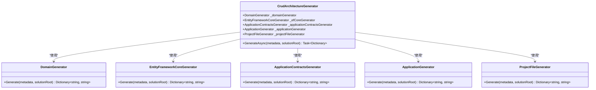
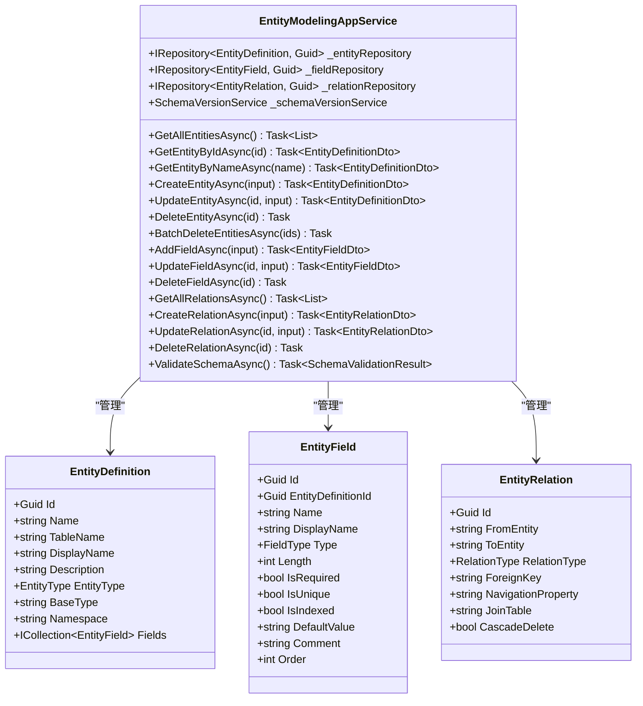
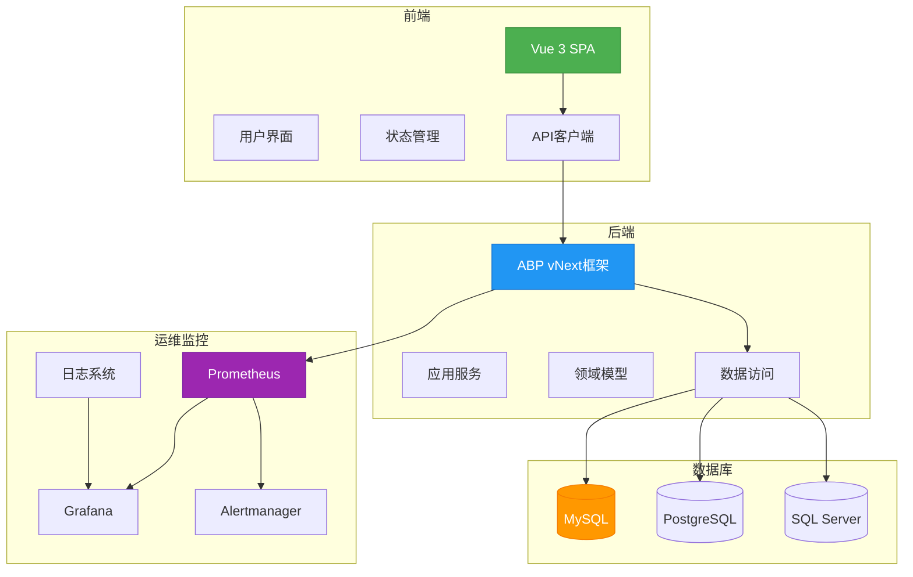

# 项目概述

<cite>
**本文档引用的文件**  
- [README.md](file://README.md)
- [smartabp.config.json](file://smartabp.config.json)
- [EntityModelingAppService.cs](file://src/SmartAbp.Application/LowCode/EntityModelingAppService.cs)
- [CrudArchitectureGenerator.cs](file://src/SmartAbp.CodeGenerator/Core/CrudArchitectureGenerator.cs)
- [ModuleAppService.cs](file://src/SmartAbp.Application/LowCode/ModuleAppService.cs)
- [package.json](file://src/SmartAbp.Vue/package.json)
</cite>

## 目录
1. [项目定位与核心价值](#项目定位与核心价值)
2. [全栈架构设计](#全栈架构设计)
3. [主要功能特性](#主要功能特性)
4. [目标用户与应用场景](#目标用户与应用场景)
5. [技术愿景与路线图](#技术愿景与路线图)
6. [系统上下文图](#系统上下文图)

## 项目定位与核心价值

hxlot项目是一个基于ABP vNext框架构建的企业级低代码开发平台，旨在通过配置驱动的模块化设计，显著提升企业应用的开发效率和质量。该项目的核心价值在于将复杂的软件开发过程抽象为可视化、可配置的模块，使开发者能够专注于业务逻辑而非底层技术实现。

平台采用"低代码即服务"的理念，通过统一的元数据模型和代码生成引擎，实现了从实体建模到完整应用的自动化生成。这种架构不仅降低了开发门槛，还确保了代码的一致性和可维护性，特别适合需要快速迭代和大规模部署的企业级应用场景。

**本节来源**  
- [README.md](file://README.md#L1-L395)

## 全栈架构设计

hxlot项目采用现代化的全栈架构，前端基于Vue 3框架，后端基于.NET 8平台，通过ABP vNext框架提供企业级应用所需的各项基础设施。这种架构设计兼顾了前端的响应式体验和后端的高性能处理能力。

前端技术栈以Vue 3为核心，结合TypeScript、Vite、Pinia和Element Plus等现代前端技术，提供了高效的开发体验和优秀的运行性能。后端技术栈则充分利用了ABP框架的模块化特性，集成了Entity Framework Core、OpenIddict认证系统和多租户支持，构建了稳定可靠的服务端基础。

前后端通过SPA中间件无缝集成，开发环境采用代理模式实现热重载，生产环境则通过静态文件服务提供优化后的前端资源。这种设计既保证了开发效率，又确保了生产环境的性能和安全性。

**本节来源**  
- [README.md](file://README.md#L1-L395)
- [package.json](file://src/SmartAbp.Vue/package.json#L1-L229)

## 主要功能特性

### 模块化代码生成

hxlot平台的核心功能是模块化代码生成，通过`CrudArchitectureGenerator`类实现。该生成器采用分层架构，将代码生成过程分解为领域层、数据访问层、应用服务层和API契约层的独立生成任务，然后合并生成结果。

**图示来源**  
- [CrudArchitectureGenerator.cs](file://src/SmartAbp.CodeGenerator/Core/CrudArchitectureGenerator.cs#L9-L61)

### 实体建模与管理

平台提供了完整的实体建模功能，通过`EntityModelingAppService`类实现。该服务支持实体定义、字段管理、关系配置和架构验证等核心功能，构成了低代码平台的数据模型基础。

**图示来源**  
- [EntityModelingAppService.cs](file://src/SmartAbp.Application/LowCode/EntityModelingAppService.cs#L18-L351)

### 多数据库适配

平台通过`SmartAbp.Database.Abstraction`组件实现了多数据库适配能力，支持MySQL、PostgreSQL和SQL Server等多种数据库系统。这种抽象层设计使得应用程序可以轻松切换底层数据库，而无需修改业务代码。

### 微服务部署

hxlot平台支持微服务架构部署，通过AspireHost和Kubernetes配置文件实现了云原生部署能力。平台提供了完整的Helm图表和Kustomize配置，支持生产环境的自动化部署和弹性伸缩。

### 质量门禁检查

平台内置了严格的质量门禁检查机制，包括代码格式化检查、静态代码分析、单元测试和构建验证等环节。这些检查通过CI/CD流水线自动执行，确保了代码质量和系统稳定性。

**本节来源**  
- [README.md](file://README.md#L1-L395)
- [EntityModelingAppService.cs](file://src/SmartAbp.Application/LowCode/EntityModelingAppService.cs#L18-L351)
- [CrudArchitectureGenerator.cs](file://src/SmartAbp.CodeGenerator/Core/CrudArchitectureGenerator.cs#L9-L61)
- [ModuleAppService.cs](file://src/SmartAbp.Application/LowCode/ModuleAppService.cs#L1-L217)

## 目标用户与应用场景

hxlot平台的目标用户主要包括企业级应用开发者、系统架构师和IT决策者。对于开发者而言，平台提供了高效的开发工具和丰富的代码生成能力，显著降低了开发复杂度；对于架构师而言，平台的模块化设计和可扩展架构提供了良好的技术选型基础；对于IT决策者而言，平台的快速交付能力和低成本维护特性具有显著的商业价值。

典型应用场景包括企业资源规划(ERP)系统、客户关系管理(CRM)系统、制造执行系统(MES)和权限管理系统等。这些场景通常具有业务逻辑复杂、数据模型多变、迭代周期短等特点，正是hxlot平台能够发挥最大价值的领域。

**本节来源**  
- [README.md](file://README.md#L1-L395)

## 技术愿景与路线图

hxlot平台的技术愿景是成为企业级低代码开发的标准平台，通过持续的技术创新和功能完善，推动软件开发模式的变革。平台的长期发展路线图分为三个阶段：

**P0 - 立即修复阶段**：重点解决数据一致性、性能瓶颈和内存管理等基础问题，确保平台的可靠性和稳定性。

**P1 - 短期改进阶段**：引入插件化架构、企业级内存监控和完整日志审计系统，提升平台的可扩展性和可观测性。

**P2 - 中期演进阶段**：开发可视化拖拽设计器，支持多前端框架，并构建企业级管理控制台，实现RBAC权限、实时监控和审计日志等高级功能。

这一路线图体现了平台从基础工具到企业级平台的演进路径，旨在构建一个安全、可靠、可扩展的低代码生态系统。

**本节来源**  
- [README.md](file://README.md#L1-L395)

## 系统上下文图

**图示来源**  
- [README.md](file://README.md#L1-L395)
- [deployment\k8s\helm\smartabp](file://deployment/k8s/helm/smartabp)
- [deployments\k8s\ops-monitoring](file://deployments/k8s/ops-monitoring)

**本节来源**  
- [README.md](file://README.md#L1-L395)
- [deployment\k8s\helm\smartabp](file://deployment/k8s/helm/smartabp)
- [deployments\k8s\ops-monitoring](file://deployments/k8s/ops-monitoring)