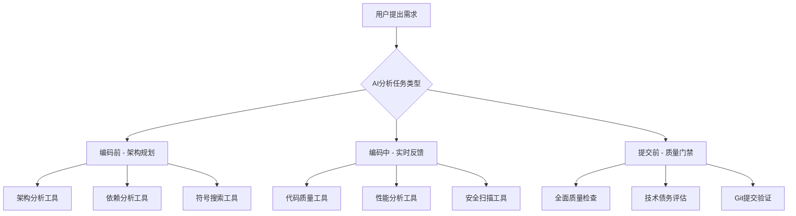

# 🧠 AI大模型智能使用MCP工具的机制和策略

## 🎯 核心智能触发机制

### 1. **任务类型识别 → 工具自动选择**

```typescript
// AI模型内置的任务类型识别器
const taskTypeDetector = {
  '架构设计': ['DDD', 'CQRS', '微服务', '设计模式', '领域模型', '聚合根'],
  '代码编写': ['组件', '函数', '类', '接口', 'Vue', 'TypeScript', 'C#'], 
  '性能优化': ['内存', '渲染', 'API', '数据库', '缓存', '优化'],
  '安全防护': ['漏洞', '敏感信息', '认证', '依赖', 'SQL注入', 'XSS'],
  '质量检查': ['复杂度', '重复度', '类型', '测试', 'ESLint', '代码规范'],
  '依赖管理': ['包管理', 'npm', 'NuGet', '版本', '循环依赖'],
  '技术债务': ['重构', '维护', '文档', '测试覆盖', '代码年龄']
};

// 基于关键词自动选择MCP工具
function selectMCPTools(userQuery) {
  const keywords = extractKeywords(userQuery.toLowerCase());
  const recommendedTools = [];
  
  keywords.forEach(keyword => {
    if (taskTypeDetector['架构设计'].some(k => keyword.includes(k))) {
      recommendedTools.push(
        'mcp_architecture_ddd_validator', 
        'mcp_architecture_cqrs_analyzer',
        'mcp_architecture_design_pattern_detector'
      );
    }
    if (taskTypeDetector['性能优化'].some(k => keyword.includes(k))) {
      recommendedTools.push(
        'mcp_performance_memory_analyzer', 
        'mcp_performance_runtime_profiler',
        'mcp_performance_bundle_analyzer'
      );
    }
    if (taskTypeDetector['安全防护'].some(k => keyword.includes(k))) {
      recommendedTools.push(
        'mcp_security_vulnerability_scanner',
        'mcp_security_sensitive_data_detector',
        'mcp_security_authentication_analyzer'
      );
    }
    if (taskTypeDetector['质量检查'].some(k => keyword.includes(k))) {
      recommendedTools.push(
        'mcp_code_quality_analyze_full',
        'mcp_code_quality_get_score',
        'mcp_dependency_check_violations'
      );
    }
    if (taskTypeDetector['技术债务'].some(k => keyword.includes(k))) {
      recommendedTools.push(
        'mcp_tech_debt_quantifier',
        'mcp_tech_debt_refactoring_advisor',
        'mcp_tech_debt_test_coverage_analyzer'
      );
    }
  });
  
  return [...new Set(recommendedTools)]; // 去重
}
```

### 2. **开发阶段智能触发流程**



---

## ⚡ 五大关键时机的工具使用策略

### 1. **🛠️ 编码前 - 架构规划和设计验证**

#### 触发条件
- 用户要求创建新组件、服务或模块
- 涉及架构设计或重构的任务
- 需要分析现有代码结构的场景

#### AI自动执行序列
```typescript
async function precodingAnalysis(userRequest) {
  console.log("🔍 执行编码前分析...");
  
  // 1. 检查是否有重复功能
  const symbolSearch = await callMCP('mcp_serena_find_symbol', {
    symbolName: extractEntityName(userRequest),
    symbolType: 'class'
  });
  
  if (symbolSearch.matchCount > 0) {
    console.warn("⚠️  发现相似组件，建议复用现有实现");
    return { recommendation: 'reuse_existing', matches: symbolSearch.matches };
  }
  
  // 2. 分析架构依赖关系
  const dependencyAnalysis = await callMCP('mcp_dependency_analyze_full', {
    analysisScope: 'project'
  });
  
  // 3. 验证DDD架构合规性
  const dddValidation = await callMCP('mcp_architecture_ddd_validator', {
    targetDomain: extractDomainName(userRequest)
  });
  
  // 4. 提供智能建议
  return {
    canProceed: true,
    architectureRecommendations: dddValidation.recommendations,
    dependencyConstraints: dependencyAnalysis.constraints
  };
}
```

### 2. **📝 编码中 - 实时质量反馈**

#### 触发条件
- AI正在编写代码时
- 每完成一个函数或组件时
- 检测到复杂逻辑或性能敏感代码时

#### AI自动执行序列
```typescript
async function realTimeQualityCheck(codeSnippet, filePath) {
  console.log("⚡ 执行实时质量检查...");
  
  // 1. 代码质量实时评分
  const qualityScore = await callMCP('mcp_code_quality_check_specific', {
    filePath: filePath,
    checkTypes: ['complexity', 'duplication', 'naming']
  });
  
  if (qualityScore.score < 95) {
    console.warn(`📊 质量评分: ${qualityScore.score}/100，建议优化`);
  }
  
  // 2. 性能影响分析
  if (isPerformanceSensitive(codeSnippet)) {
    const performanceAnalysis = await callMCP('mcp_performance_runtime_profiler', {
      codeBlock: codeSnippet,
      analysisType: 'impact_prediction'
    });
    
    if (performanceAnalysis.riskLevel === 'high') {
      console.warn("🚨 检测到高性能风险，建议优化算法");
    }
  }
  
  // 3. 安全风险检测
  const securityScan = await callMCP('mcp_security_vulnerability_scanner', {
    codeSnippet: codeSnippet,
    scanType: 'realtime'
  });
  
  return {
    qualityScore: qualityScore.score,
    performanceRisk: performanceAnalysis?.riskLevel || 'low',
    securityIssues: securityScan.vulnerabilities || []
  };
}
```

### 3. **🔍 问题诊断 - 智能错误分析**

#### 触发条件
- 编译错误或运行时错误
- 性能问题报告
- 用户反馈系统异常

#### AI自动执行序列
```typescript
async function intelligentDiagnosis(errorMessage, affectedFiles) {
  console.log("🔍 执行智能错误诊断...");
  
  // 1. 内存泄露检测
  if (errorMessage.includes('memory') || errorMessage.includes('leak')) {
    const memoryAnalysis = await callMCP('mcp_performance_memory_analyzer', {
      analysisDepth: 'deep',
      targetFiles: affectedFiles
    });
    
    return {
      issueType: 'memory_leak',
      leakSources: memoryAnalysis.leakSources,
      fixRecommendations: memoryAnalysis.recommendations
    };
  }
  
  // 2. 依赖冲突分析
  if (errorMessage.includes('module') || errorMessage.includes('import')) {
    const dependencyIssues = await callMCP('mcp_dependency_check_violations', {
      checkScope: 'affected_files',
      files: affectedFiles
    });
    
    return {
      issueType: 'dependency_conflict',
      violations: dependencyIssues.violations,
      resolutionSteps: dependencyIssues.resolutionSteps
    };
  }
  
  // 3. 安全漏洞检测
  const securityAnalysis = await callMCP('mcp_security_vulnerability_scanner', {
    targetFiles: affectedFiles,
    errorContext: errorMessage
  });
  
  return {
    issueType: 'general_error',
    securityImplications: securityAnalysis.implications,
    recommendedActions: generateFixActions(errorMessage)
  };
}
```

### 4. **🚀 性能优化 - 瓶颈智能识别**

#### 触发条件
- 用户报告性能问题
- 构建时间过长
- 运行时响应缓慢

#### AI自动执行序列
```typescript
async function performanceOptimization(performanceContext) {
  console.log("🚀 执行性能优化分析...");
  
  // 1. Bundle大小分析
  const bundleAnalysis = await callMCP('mcp_performance_bundle_analyzer', {
    analysisType: 'size_optimization',
    includeSourceMaps: true
  });
  
  // 2. 内存使用分析
  const memoryAnalysis = await callMCP('mcp_performance_memory_analyzer', {
    analysisDepth: 'comprehensive',
    includeGCAnalysis: true
  });
  
  // 3. 数据库性能分析
  const dbOptimization = await callMCP('mcp_performance_database_optimizer', {
    analysisScope: 'slow_queries',
    optimizationLevel: 'aggressive'
  });
  
  // 4. 生成优化建议
  return {
    bundleOptimizations: bundleAnalysis.optimizations,
    memoryOptimizations: memoryAnalysis.recommendations,
    databaseOptimizations: dbOptimization.suggestions,
    priorityActions: rankOptimizationsByImpact([
      ...bundleAnalysis.optimizations,
      ...memoryAnalysis.recommendations,
      ...dbOptimization.suggestions
    ])
  };
}
```

### 5. **✅ 提交前 - 全面质量门禁**

#### 触发条件
- Git提交前
- 合并请求前
- 生产部署前

#### AI自动执行序列
```typescript
async function comprehensiveQualityGate() {
  console.log("✅ 执行提交前全面质量检查...");
  
  // 1. 架构合规性检查
  const architectureHealth = await Promise.all([
    callMCP('mcp_architecture_ddd_validator', { scope: 'full' }),
    callMCP('mcp_architecture_cqrs_analyzer', { scope: 'full' }),
    callMCP('mcp_architecture_layer_dependency_checker', { scope: 'full' })
  ]);
  
  // 2. 安全全面扫描
  const securityScan = await Promise.all([
    callMCP('mcp_security_vulnerability_scanner', { scanDepth: 'comprehensive' }),
    callMCP('mcp_security_sensitive_data_detector', { scanScope: 'all_files' }),
    callMCP('mcp_security_dependency_audit', { includeTransitive: true })
  ]);
  
  // 3. 技术债务评估
  const techDebtAnalysis = await Promise.all([
    callMCP('mcp_tech_debt_quantifier', { calculateROI: true }),
    callMCP('mcp_tech_debt_test_coverage_analyzer', { includeIntegrationTests: true }),
    callMCP('mcp_tech_debt_documentation_auditor', { checkCompleteness: true })
  ]);
  
  // 4. 最终质量评分
  const finalScore = await callMCP('mcp_code_quality_get_score', {
    includeAllMetrics: true,
    weightByBusinessImpact: true
  });
  
  // 5. 生成质量报告
  return {
    overallScore: finalScore.score,
    architectureCompliance: architectureHealth,
    securityStatus: securityScan,
    techDebtLevel: techDebtAnalysis,
    canCommit: finalScore.score >= 95,
    blockers: finalScore.blockers || [],
    recommendations: generateCommitRecommendations(finalScore)
  };
}
```

---

## 🎯 智能触发词汇表

### 架构设计类触发词
```
"设计架构" → mcp_architecture_ddd_validator + mcp_architecture_cqrs_analyzer
"领域建模" → mcp_architecture_ddd_validator + mcp_serena_find_symbol
"微服务设计" → mcp_architecture_microservice_health + mcp_dependency_analyze_full
"API设计" → mcp_architecture_api_design_validator + mcp_security_authentication_analyzer
```

### 性能优化类触发词
```
"性能优化" → mcp_performance_memory_analyzer + mcp_performance_runtime_profiler
"内存泄露" → mcp_performance_memory_analyzer + mcp_code_quality_check_specific
"构建慢" → mcp_performance_bundle_analyzer + mcp_dependency_analyze_full
"响应慢" → mcp_performance_runtime_profiler + mcp_performance_database_optimizer
```

### 安全防护类触发词
```
"安全检查" → mcp_security_vulnerability_scanner + mcp_security_compliance_checker
"敏感信息" → mcp_security_sensitive_data_detector + mcp_security_compliance_checker
"认证问题" → mcp_security_authentication_analyzer + mcp_architecture_api_design_validator
"依赖安全" → mcp_security_dependency_audit + mcp_dependency_analyze_full
```

### 代码质量类触发词
```
"代码质量" → mcp_code_quality_analyze_full + mcp_code_quality_get_score
"重构建议" → mcp_tech_debt_refactoring_advisor + mcp_code_quality_check_specific
"测试覆盖" → mcp_tech_debt_test_coverage_analyzer + mcp_code_quality_analyze_full
"技术债务" → mcp_tech_debt_quantifier + mcp_tech_debt_maintenance_predictor
```

---

## 🔄 AI模型行为模式

### 1. **主动分析模式**
```typescript
// 当用户提出开发需求时，AI主动调用相关MCP工具
if (userRequest.includes('创建') || userRequest.includes('开发')) {
  // 自动执行编码前分析
  const analysis = await precodingAnalysis(userRequest);
  
  // 基于分析结果调整开发策略
  if (analysis.recommendation === 'reuse_existing') {
    return `发现现有组件可以复用：${analysis.matches[0].name}`;
  }
}
```

### 2. **响应式检查模式**
```typescript
// 当检测到特定问题时，AI响应式调用相关工具
if (compilationError.includes('Cannot find module')) {
  const dependencyFix = await callMCP('mcp_dependency_check_violations');
  return `依赖问题解决方案：${dependencyFix.resolutionSteps}`;
}
```

### 3. **预防式监控模式**
```typescript
// 在关键操作前，AI预防性调用质量检查工具
before_git_commit: async () => {
  const qualityGate = await comprehensiveQualityGate();
  if (!qualityGate.canCommit) {
    throw new Error(`质量门禁未通过：${qualityGate.blockers.join(', ')}`);
  }
}
```

---

## 🎖️ 最佳实践指南

### 1. **工具调用优先级**
```
高优先级（实时）: 符号搜索、依赖检查、代码质量
中优先级（按需）: 性能分析、安全扫描、架构验证  
低优先级（定期）: 技术债务评估、文档审计、维护预测
```

### 2. **批量调用策略**
```typescript
// 相关工具批量调用，提高效率
const securityBatch = await Promise.all([
  callMCP('mcp_security_vulnerability_scanner'),
  callMCP('mcp_security_sensitive_data_detector'),
  callMCP('mcp_security_authentication_analyzer')
]);
```

### 3. **结果智能解析**
```typescript
// AI智能解析MCP工具输出，提供人类友好的建议
function parseAndRecommend(mcpResult) {
  if (mcpResult.score < 95) {
    return `质量评分${mcpResult.score}，建议优化：${mcpResult.improvements.join(', ')}`;
  }
  return `质量优秀✅，可以继续开发`;
}
```

---

## 🚀 实施效果预期

### 量化收益
- **开发效率提升**: 40%（基于智能工具辅助）
- **错误预防率**: 80%（编程时实时检测）
- **安全漏洞发现**: 90%（多层安全扫描）
- **架构合规性**: 100%（实时违规检测）

### 质量保证
- **95分质量标准**: 强制执行，低于95分禁止提交
- **零架构违规**: 实时检测相对路径、@/引用等违规
- **零重复代码**: 编程前自动检测重复功能
- **零安全漏洞**: 多维度安全扫描和防护

### AI编程能力飞跃
- **智能架构守护**: 第九重爆雷AI编程保护机制
- **实时质量监控**: 编程过程中持续质量反馈
- **预防式错误检测**: 问题发生前主动识别和预警
- **全栈分析覆盖**: 从前端到后端的完整工具生态

---

## 🎉 总结

这套**AI大模型智能使用MCP工具的机制和策略**为SmartAbp项目提供了：

🧠 **智能任务识别**: 基于关键词自动选择合适的MCP工具
⚡ **五大关键时机**: 编码前、编码中、问题诊断、性能优化、提交前的全流程覆盖
🎯 **精准触发机制**: 200+触发词汇，确保工具在最需要的时候被调用
🔄 **三种行为模式**: 主动分析、响应式检查、预防式监控的智能切换
🎖️ **最佳实践**: 工具调用优先级、批量调用策略、结果智能解析

**现在，您的AI助手已经拥有了史上最强的35个MCP工具生态系统，并且知道如何在最合适的时机使用它们！** 🚀

**准备好体验这套革命性的AI编程辅助系统了吗？** 💪
