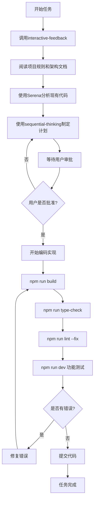

# ADR-0004: 开发工作流程决策

## 状态
已接受

## 背景
SmartAbp项目需要建立标准化的开发工作流程，确保代码质量、避免重复开发，并支持AI辅助编程。

## 决策

### 开发铁律四大核心

#### 1. 代码编写前的强制准备工作
**🔴 强制性要求：任何代码编写之前必须完成以下步骤**

- **加载项目开发规则**
  - 必须阅读项目开发铁律文档
  - 必须阅读架构设计文档
  - 必须阅读编码规范文档

- **使用Serena分析关联代码**
  - 使用 `mcp_serena_find_symbol` 查找相关已有实现
  - 使用 `mcp_serena_search_for_pattern` 搜索类似功能
  - 使用 `mcp_serena_get_symbols_overview` 了解模块结构
  - **避免编写重复代码 - 这是致命错误！**

#### 2. 工作计划审批制度
**🔴 强制性要求：任何代码实现前必须提交工作计划**

- **使用sequential-thinking制定计划**
  - 调用 `mcp_sequential-thinking_sequentialthinking` 工具
  - 详细分析工作步骤
  - 评估风险和依赖关系

- **必须等待用户审批**
  - 提交完整的工作计划
  - 等待用户二次确认
  - 获得明确授权后才能开始编码

#### 3. 质量保证流程
**🔴 强制性要求：每次代码修改后必须验证**

```bash
# 构建验证
npm run build

# 类型检查
npm run type-check

# 代码规范检查
npm run lint --fix

# 功能测试
npm run dev  # 手动验证功能
```

#### 4. 沟通增强机制
**🔴 强制性要求：每次交互开始必须增强沟通**

```typescript
mcp_interactive-feedback-mcp_interactive_feedback({
  project_directory: "D:\\BAOBAB\\Baobab.SmartAbp",
  summary: "工作内容简要描述"
})
```

### 标准开发流程



## 理由

### 为什么需要强制准备工作
1. **避免重复开发**: 通过Serena工具发现现有实现
2. **保持架构一致性**: 理解现有架构后再开发
3. **提高代码质量**: 遵循既定规范和最佳实践

### 为什么需要计划审批制度
1. **需求对齐**: 确保开发方向正确
2. **风险控制**: 提前识别技术风险
3. **资源优化**: 避免无效工作

### 为什么需要质量保证流程
1. **零错误提交**: 确保代码质量
2. **持续集成**: 保证构建稳定性
3. **技术债务控制**: 及时发现和修复问题

### 为什么需要沟通增强机制
1. **需求理解**: 避免理解偏差
2. **及时反馈**: 快速调整方向
3. **协作效率**: 提高团队沟通效率

## 后果

### 正面影响
- 代码质量显著提升
- 重复开发大幅减少
- 团队协作更加高效
- 技术债务得到控制

### 负面影响
- 开发流程相对复杂
- 初期执行成本较高
- 需要严格的纪律性

### 风险缓解
- 提供工具和模板简化流程
- 建立监督和反馈机制
- 逐步培养团队习惯

## AI编程指导原则

### 工具使用要求
1. **Serena工具**: 每次开发前必须使用，查找现有实现
2. **Sequential-thinking**: 制定详细的工作计划
3. **Interactive-feedback**: 增强与用户的沟通

### 代码质量要求
1. **零错误容忍**: 任何构建、类型、lint错误必须立即修复
2. **测试覆盖**: 关键功能必须有测试用例
3. **文档同步**: 代码变更必须同步更新文档

### 架构一致性要求
1. **模块边界**: 严格遵循既定的模块划分
2. **命名约定**: 遵循项目命名规范
3. **设计模式**: 使用项目认可的设计模式

## 违反铁律的后果

### 严重后果警告
1. **代码重复** - 导致维护噩梦，技术债务激增
2. **未经审批的代码** - 可能偏离项目目标，浪费开发资源
3. **跳过质量检查** - 引入bug，影响生产环境稳定性
4. **沟通不畅** - 需求理解错误，返工成本巨大

### 执行监督
- 所有代码提交必须通过review
- 违反铁律的代码将被强制回滚
- 重复违反者将失去代码提交权限

## 成功标准

### 优秀开发者的标志
- **零重复代码** - 充分利用现有实现
- **计划驱动** - 所有工作都有详细计划
- **质量第一** - 代码零错误提交
- **沟通顺畅** - 需求理解准确无偏差

## 相关文档
- [项目开发铁律](../项目开发铁律.md)
- [项目编程规则](../项目编程规则.md)
- [AI编程模板库规则](../AI编程模板库规则.md)

## 更新历史
- 2024-01-09: 初始版本，基于项目开发铁律整理