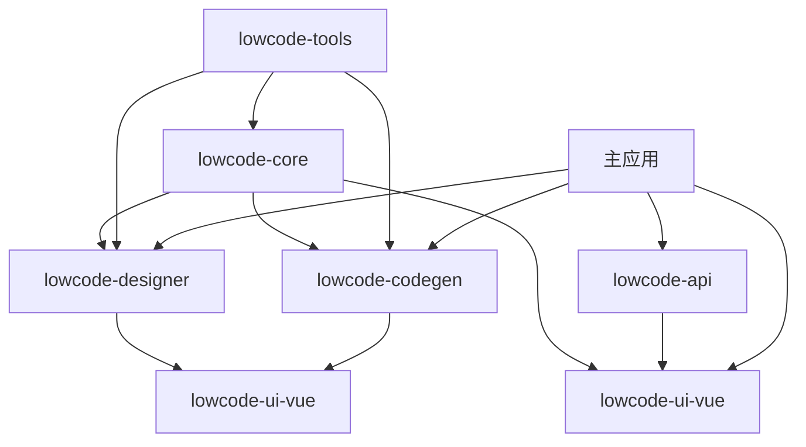

# SmartAbp 全栈低代码引擎依赖关系分析

## 📋 **分析概述**
- **分析时间**: 2025-01-12
- **分析范围**: 60个低代码引擎相关文件
- **分析工具**: 手动分析 + madge验证
- **循环依赖检查**: ✅ 无循环依赖

## 🏗️ **包级依赖关系图**

### 核心依赖层级


## 📊 **详细依赖分析**

### 1️⃣ **lowcode-core包依赖**

#### 内部依赖关系
```
src/lowcode/
├── kernel/
│   ├── core.ts                    # 核心引擎，无内部依赖
│   ├── types.ts                   # 类型定义，无依赖
│   ├── events.ts                  # 依赖: core.ts, types.ts
│   ├── logger.ts                  # 依赖: types.ts
│   ├── monitor.ts                 # 依赖: core.ts, logger.ts
│   ├── cache.ts                   # 依赖: types.ts
│   ├── plugins.ts                 # 依赖: core.ts, events.ts
│   └── index.ts                   # 统一导出，依赖所有上述文件
│
├── runtime/
│   ├── index.ts                   # 依赖: kernel/
│   ├── worker-pool.ts             # 依赖: kernel/types.ts
│   ├── metadata/pipeline.ts       # 依赖: kernel/, worker-pool.ts
│   ├── persistence/indexeddb.ts   # 依赖: kernel/types.ts
│   └── workers/
│       ├── metadata.worker.ts     # 依赖: kernel/types.ts
│       └── sfc.worker.ts          # 依赖: kernel/types.ts
│
├── plugins/                       # 所有插件依赖: kernel/
│   ├── vue3/index.ts              # 依赖: kernel/, runtime/
│   ├── sfc-compiler/index.ts      # 依赖: kernel/, @vue/compiler-sfc
│   ├── router-generator/index.ts  # 依赖: kernel/, vue-router
│   └── store-generator/index.ts   # 依赖: kernel/, pinia
│
├── federation/                    # 依赖: kernel/
│   ├── index.ts
│   ├── types.ts
│   ├── loader.ts
│   ├── content-cache.ts
│   └── content-cache-integration.ts
│
├── adapters/                      # 适配器层
│   └── logger-adapter.ts          # 依赖: kernel/logger.ts
│
├── utils/
│   └── realtime-preview.ts        # 依赖: kernel/, runtime/
│
└── templates/
    └── crud-basic-template.ts      # 依赖: kernel/types.ts
```

#### 外部依赖
```json
{
  "dependencies": {
    "@vueuse/core": "^10.0.0"
  },
  "peerDependencies": {
    "vue": "^3.0.0"
  }
}
```

### 2️⃣ **lowcode-designer包依赖**

#### 内部依赖关系
```
packages/lowcode-designer/src/
├── visual-designer/
│   ├── VisualDesignerView.vue     # 依赖: Canvas, Palette, Inspector, schema/
│   ├── Canvas.vue                 # 依赖: ../components/DraggableComponent
│   ├── Palette.vue                # 依赖: ../components/dragDropEngine
│   ├── Inspector.vue              # 依赖: ../components/PropertyInspector
│   └── schema/
│       ├── override.ts            # 类型定义，无依赖
│       ├── reader.ts              # 依赖: override.ts, @vue/compiler-sfc
│       ├── merge.ts               # 依赖: override.ts
│       └── exporter.ts            # 依赖: override.ts
│
├── entity-designer/
│   ├── EntityDesigner.vue         # 依赖: CodePreview, useDragDrop
│   └── CodePreview.vue            # 独立组件
│
└── components/
    ├── DraggableComponent.vue     # 依赖: dragDropEngine
    ├── PropertyInspector.vue      # 依赖: element-plus
    ├── dragDropEngine.ts          # 依赖: @vueuse/core
    └── schemaExporter.ts          # 依赖: visual-designer/schema/
```

#### 包间依赖
```json
{
  "dependencies": {
    "@smartabp/lowcode-core": "workspace:*"
  },
  "peerDependencies": {
    "vue": "^3.0.0",
    "element-plus": "^2.0.0",
    "@vueuse/core": "^10.0.0"
  }
}
```

### 3️⃣ **lowcode-codegen包依赖**

#### 内部依赖关系
```
packages/lowcode-codegen/src/
├── exporters/
│   └── schemaExporter.ts          # 依赖: tools/, templates/
│
├── templates/                     # 模板文件，互相独立
│   ├── frontend/
│   ├── backend/
│   └── lowcode/
│
├── tools/
│   ├── add-module.ts              # 依赖: schema.ts
│   ├── schema.ts                  # 基础类型定义
│   └── writers.ts                 # 依赖: schema.ts
│
└── incremental/
    ├── scripts/
    │   ├── analyze-codebase.js     # 独立脚本
    │   └── generate-incremental.js # 依赖: analyze-codebase.js
    └── analyzers/
        ├── pattern-matcher.js      # 独立分析器
        ├── dependency-graph.js     # 独立分析器
        └── refactor-advisor.js     # 依赖: pattern-matcher.js
```

### 4️⃣ **lowcode-ui-vue包依赖**

#### 内部依赖关系
```
packages/lowcode-ui-vue/src/
├── views/
│   ├── LowCodeEngineView.vue      # 依赖: ../stores/, ../composables/
│   ├── ModuleWizardView.vue       # 依赖: ../stores/, element-plus
│   └── Dashboard.vue              # 依赖: ../composables/, element-plus
│
├── composables/
│   ├── useDragDrop.ts             # 依赖: @vueuse/core
│   └── useCodeGenerationProgress.ts # 依赖: pinia
│
├── stores/
│   ├── designer.ts                # 依赖: pinia
│   └── index.ts                   # 统一导出
│
└── types/
    ├── entity-designer.ts         # 类型定义
    └── manifest.ts                # 类型定义
```

#### 包间依赖
```json
{
  "dependencies": {
    "@smartabp/lowcode-designer": "workspace:*",
    "@smartabp/lowcode-codegen": "workspace:*"
  },
  "peerDependencies": {
    "vue": "^3.0.0",
    "element-plus": "^2.0.0",
    "pinia": "^2.0.0"
  }
}
```

### 5️⃣ **lowcode-tools包依赖**

#### 内部依赖关系
```
packages/lowcode-tools/src/
├── plugins/
│   └── moduleWizardDev.ts         # 依赖: ../incremental/, vite
│
├── incremental-generation/        # 来自tools/incremental-generation/
│   ├── scripts/
│   ├── analyzers/
│   └── generators/
│
├── scripts/                       # 构建脚本
│   ├── build-template-index.js
│   ├── template-search.js
│   └── simple-template-index.js
│
└── cli/                          # 命令行工具
    └── index.ts
```

### 6️⃣ **lowcode-api包依赖**

#### 内部依赖关系
```
packages/lowcode-api/src/
├── clients/
│   └── code-generator.ts          # 依赖: ../types/, axios
│
└── types/
    ├── entity-designer.ts         # 独立类型定义
    └── manifest.ts                # 独立类型定义
```

## 🔍 **依赖风险分析**

### 高风险依赖
1. **Vue生态系统依赖**: 所有UI包都强依赖Vue 3.x
2. **Element Plus依赖**: UI组件库升级可能影响多个包
3. **@vueuse/core依赖**: 工具函数库版本兼容性

### 中风险依赖
1. **Vite插件依赖**: moduleWizardDev.ts依赖Vite特定版本
2. **编译器依赖**: SFC编译器依赖@vue/compiler-sfc版本
3. **Worker依赖**: Web Worker兼容性问题

### 低风险依赖
1. **内部类型依赖**: 纯TypeScript类型定义
2. **模板文件**: 静态模板文件无运行时依赖
3. **工具脚本**: Node.js脚本相对独立

## 🛡️ **依赖管理策略**

### peerDependencies策略
```json
{
  "peerDependencies": {
    "vue": "^3.0.0",
    "element-plus": "^2.0.0",
    "@vueuse/core": "^10.0.0",
    "pinia": "^2.0.0"
  }
}
```

### 版本锁定策略
- **核心依赖**: 使用精确版本号
- **工具依赖**: 使用兼容版本范围
- **开发依赖**: 使用最新稳定版本

### 依赖更新策略
1. **定期审计**: 每月检查依赖安全漏洞
2. **渐进更新**: 先更新开发依赖，再更新生产依赖
3. **兼容性测试**: 每次依赖更新都要进行完整测试

## 📈 **依赖优化建议**

### 减少依赖数量
1. **合并相似依赖**: 统一使用@vueuse/core替代多个小工具库
2. **移除未使用依赖**: 定期清理package.json中的无用依赖
3. **内部实现替代**: 对于简单功能，考虑内部实现替代外部依赖

### 提升依赖质量
1. **选择维护良好的库**: 优先选择活跃维护的开源项目
2. **避免实验性依赖**: 生产环境避免使用alpha/beta版本
3. **文档完善的库**: 选择文档齐全的依赖库

### 依赖隔离
1. **按功能分包**: 不同功能的依赖隔离在不同包中
2. **可选依赖**: 非核心功能使用optionalDependencies
3. **插件化架构**: 通过插件系统隔离特定依赖

## 🔄 **迁移期依赖管理**

### 迁移阶段依赖策略
1. **双重导入**: 迁移期间同时保持旧路径和新包导入
2. **渐进替换**: 逐步替换导入路径，避免大爆炸式修改
3. **兼容性层**: 提供兼容性层确保平滑过渡

### 迁移验证
1. **依赖图检查**: 确保迁移后依赖图符合设计
2. **循环依赖检测**: 持续检测和消除循环依赖
3. **性能影响评估**: 评估包拆分对性能的影响

---

*本分析文档将随着重构进展持续更新*
