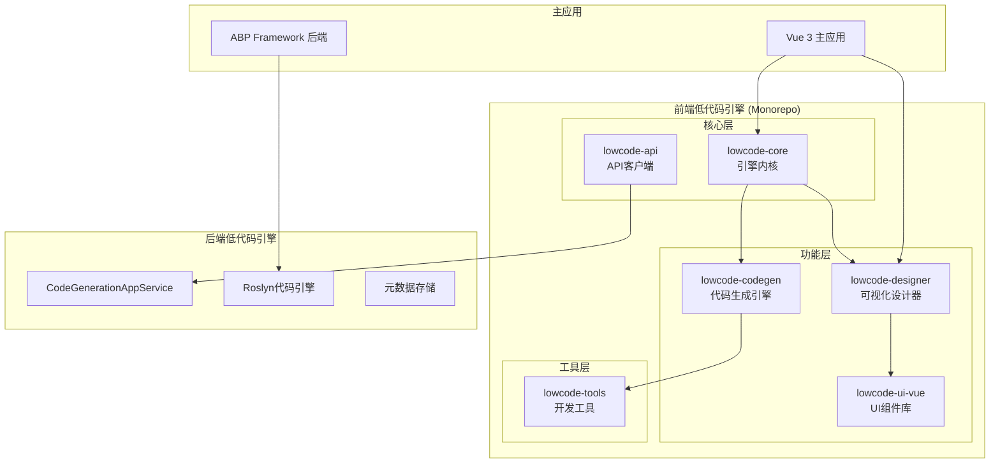
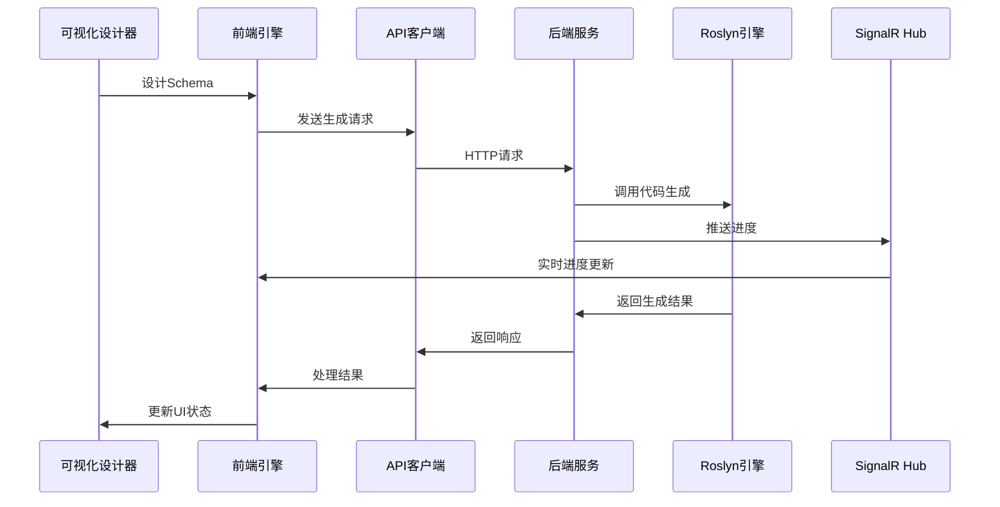
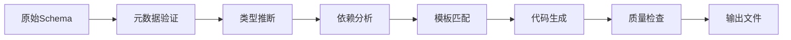

# SmartAbp 低代码引擎详细技术规范

## 📋 文档信息
- **版本**: v3.0
- **创建时间**: 2025-01-18
- **维护者**: SmartAbp Team
- **适用范围**: SmartAbp 企业级全栈低代码平台
- **技术栈**: .NET 8 + ABP Framework + Vue 3 + TypeScript + Monorepo

## 🎯 概述

SmartAbp 低代码引擎是一个企业级全栈低代码开发平台，采用微内核+插件架构，支持前后端代码生成、可视化设计、模板驱动开发。引擎基于 Monorepo 架构独立发包，确保模块化、可扩展性和企业级稳定性。

### 核心特性
- 🔧 **微内核架构**: 轻量级内核 + 可插拔插件系统
- 🎨 **可视化设计器**: P2级拖拽式界面设计器
- 🏗️ **全栈代码生成**: 支持前端Vue3、后端ABP、数据库等
- 📦 **Monorepo架构**: 独立发包，版本化管理
- 🚀 **企业级特性**: 性能监控、缓存管理、日志系统
- 🔌 **插件生态**: 丰富的插件系统，支持自定义扩展

## 🏗️ 整体架构

### 架构层次图


### 技术栈矩阵
| 层级 | 前端技术 | 后端技术 | 工具链 |
|------|----------|----------|--------|
| **核心引擎** | TypeScript, Vue 3 | C#, .NET 8 | Vite, pnpm |
| **可视化设计** | Vue 3, Element Plus | - | Canvas API, D3.js |
| **代码生成** | Template Engine | Roslyn, T4 | AST, Source Generator |
| **构建工具** | Vite, Rollup | MSBuild | Turbo, Lerna |
| **测试框架** | Vitest, Cypress | xUnit, NUnit | Jest, Playwright |

## 📦 Monorepo 包架构

### 包结构概览
```
src/SmartAbp.Vue/packages/
├── @smartabp/lowcode-core          # 🔧 引擎内核包
├── @smartabp/lowcode-designer      # 🎨 可视化设计器包
├── @smartabp/lowcode-codegen       # 🏗️ 代码生成引擎包
├── @smartabp/lowcode-api           # 🌐 API 客户端包
├── @smartabp/lowcode-ui-vue        # 🎭 Vue UI 组件包
└── @smartabp/lowcode-tools         # 🛠️ 开发工具包
```

### 1. @smartabp/lowcode-core (引擎内核)

#### 核心职责
- 微内核系统管理
- 插件生命周期管理
- 事件总线和通信
- 缓存和性能监控
- 运行时系统

#### 目录结构
```
src/
├── kernel/                     # 微内核系统
│   ├── core.ts                # 内核核心逻辑
│   ├── types.ts               # 核心类型定义
│   ├── events.ts              # 事件系统
│   ├── logger.ts              # 日志系统
│   ├── monitor.ts             # 性能监控
│   ├── cache.ts               # 缓存管理
│   └── plugins.ts             # 插件管理器
├── runtime/                    # 运行时系统
│   ├── worker-pool.ts         # Worker池管理
│   ├── metadata/pipeline.ts   # 元数据管道
│   ├── persistence/indexeddb.ts # 本地存储
│   └── workers/               # Web Workers
├── adapters/                   # 适配器层
│   └── logger-adapter.ts      # 日志适配器
├── federation/                 # 联邦化系统
│   ├── content-cache.ts       # 内容缓存
│   └── loader.ts              # 模块加载器
└── utils/                      # 工具函数
    └── realtime-preview.ts    # 实时预览
```

#### 核心API
```typescript
// 内核配置接口
export interface LowCodeKernelConfig {
  cache?: CacheConfig
  logging?: LoggingConfig
  monitoring?: MonitoringConfig
  plugins?: PluginConfig
}

// 内核主类
export class LowCodeKernel {
  constructor(config: LowCodeKernelConfig)
  
  // 插件管理
  registerPlugin<T>(plugin: CodegenPlugin<T>): Promise<void>
  unregisterPlugin(name: string): Promise<void>
  getPlugin<T>(name: string): CodegenPlugin<T> | null
  
  // 代码生成
  generate<T>(schema: Schema, options?: GenerateOptions): Promise<GeneratedCode>
  
  // 生命周期
  start(): Promise<void>
  stop(): Promise<void>
  
  // 事件系统
  on(event: string, handler: Function): void
  emit(event: string, data: any): void
}
```

### 2. @smartabp/lowcode-designer (可视化设计器)

#### 核心职责
- P2级可视化设计器
- 拖拽式界面构建
- 组件属性编辑
- Schema管理和导出
- 实时预览功能

#### 主要组件
```
src/
├── views/
│   ├── VisualDesignerView.vue     # 主设计器视图
│   ├── codegen/
│   │   ├── LowCodeEngineView.vue  # 引擎控制台
│   │   ├── ModuleWizardView.vue   # 模块向导
│   │   └── SfcCompilerView.vue    # SFC编译器
│   └── designer/
│       ├── Canvas.vue             # 设计画布
│       ├── Palette.vue            # 组件面板
│       └── Inspector.vue          # 属性检查器
├── components/
│   ├── DraggableComponent.vue     # 可拖拽组件
│   ├── PropertyInspector.vue      # 属性编辑器
│   └── CodeGenerator/
│       └── EntityDesigner.vue    # 实体设计器
├── designer/schema/               # Schema处理
│   ├── exporter.ts               # Schema导出
│   ├── reader.ts                 # SFC回读
│   └── override.ts               # Schema覆盖
└── stores/
    └── designer.ts               # 设计器状态
```

#### 设计器核心功能
```typescript
// 设计器主接口
export interface VisualDesigner {
  // 画布管理
  canvas: CanvasManager
  palette: ComponentPalette
  inspector: PropertyInspector
  
  // Schema操作
  loadSchema(schema: Schema): Promise<void>
  exportSchema(): Promise<Schema>
  
  // 组件操作
  addComponent(type: string, props: any): void
  removeComponent(id: string): void
  updateComponent(id: string, props: any): void
  
  // 拖拽操作
  startDrag(component: Component): void
  drop(target: DropTarget, position: Position): void
}
```

### 3. @smartabp/lowcode-codegen (代码生成引擎)

#### 核心职责
- 模板驱动代码生成
- 多框架支持 (Vue3, React, ABP)
- 插件化生成器
- 增量代码生成

#### 插件架构
```
src/plugins/
├── vue3/                      # Vue3生成器
├── sfc-compiler/              # SFC编译器
├── router-generator/          # 路由生成器
└── store-generator/           # 状态管理生成器
```

#### 代码生成流程
```typescript
// 生成器接口
export interface CodeGenerator {
  name: string
  version: string
  
  canHandle(schema: Schema): boolean
  generate(schema: Schema, config: GenerateConfig): Promise<GeneratedCode>
  validate(schema: Schema): ValidationResult
}

// 生成配置
export interface GenerateConfig {
  target: 'vue3' | 'react' | 'abp'
  outputPath: string
  templatePath?: string
  options?: Record<string, any>
}
```

### 4. @smartabp/lowcode-api (API客户端)

#### 核心职责
- 后端API封装
- 类型定义管理
- HTTP客户端配置
- 错误处理和重试

#### API结构
```
src/
├── index.ts                   # 统一导出
├── code-generator.ts          # 代码生成API
├── metadata.ts                # 元数据API
└── types.ts                   # 类型定义
```

### 5. @smartabp/lowcode-ui-vue (UI组件库)

#### 核心职责
- 低代码专用UI组件
- 设计器组件库
- 主题和样式系统
- 可访问性支持

### 6. @smartabp/lowcode-tools (开发工具)

#### 核心职责
- CLI工具
- 模板管理
- 构建工具
- 开发插件

## 🔧 后端低代码引擎

### SmartAbp.CodeGenerator 模块

#### 核心架构
```
src/SmartAbp.CodeGenerator/
├── Core/
│   ├── RoslynCodeEngine.cs        # Roslyn代码引擎
│   ├── Definitions.cs             # 核心定义
│   └── PerformanceCounters.cs     # 性能计数器
├── Services/
│   ├── CodeGenerationAppService.cs # 代码生成应用服务
│   ├── MetadataAppService.cs       # 元数据服务
│   └── CodeWriterService.cs        # 代码写入服务
├── ApplicationServices/
│   └── ApplicationServicesGenerator.cs # 应用服务生成器
├── DDD/
│   └── DomainDrivenDesignGenerator.cs # DDD生成器
├── CQRS/
│   └── CqrsPatternGenerator.cs     # CQRS模式生成器
└── Hubs/
    └── CodeGenerationProgressHub.cs # SignalR进度推送
```

#### 核心服务接口
```csharp
// 代码生成应用服务
public interface ICodeGenerationAppService : IApplicationService
{
    Task<CodeGenerationResultDto> GenerateAsync(CodeGenerationRequestDto request);
    Task<List<TemplateDto>> GetTemplatesAsync();
    Task<MetadataDto> GetMetadataAsync(string entityName);
}

// Roslyn代码引擎
public class RoslynCodeEngine
{
    public async Task<GeneratedCode> GenerateEntityAsync(EntityMetadata metadata)
    public async Task<GeneratedCode> GenerateApplicationServiceAsync(ServiceMetadata metadata)
    public async Task<GeneratedCode> GenerateCrudOperationsAsync(CrudMetadata metadata)
}
```

## 🔄 数据流和交互

### 前后端交互流程


### 元数据流水线


## 🎨 可视化设计器详细规范

### P2级设计器功能
1. **画布系统 (Canvas)**
   - 无限画布支持
   - 网格对齐和吸附
   - 缩放和平移
   - 多选和批量操作

2. **组件面板 (Palette)**
   - 分类组件库
   - 搜索和过滤
   - 自定义组件支持
   - 拖拽预览

3. **属性检查器 (Inspector)**
   - 动态属性编辑
   - 类型验证
   - 实时预览
   - 批量编辑

4. **Schema系统**
   - JSON Schema验证
   - 版本管理
   - 增量更新
   - 导入导出

### 拖拽引擎规范
```typescript
// 拖拽引擎接口
export interface DragDropEngine {
  // 拖拽状态
  isDragging: boolean
  dragData: DragData | null
  
  // 拖拽操作
  startDrag(source: DragSource, data: DragData): void
  updateDrag(position: Position): void
  endDrag(target?: DropTarget): void
  
  // 事件处理
  onDragStart: (handler: DragStartHandler) => void
  onDragOver: (handler: DragOverHandler) => void
  onDrop: (handler: DropHandler) => void
}

// 拖拽数据
export interface DragData {
  type: 'component' | 'asset' | 'template'
  payload: any
  preview?: HTMLElement
  constraints?: DragConstraints
}
```

## 🏗️ 代码生成详细规范

### 模板系统
```
templates/
├── frontend/
│   ├── components/
│   │   ├── CrudManagement.template.vue
│   │   ├── FormDialog.template.vue
│   │   └── DataTable.template.vue
│   ├── stores/
│   │   └── EntityStore.template.ts
│   └── services/
│       └── EntityService.template.ts
├── backend/
│   ├── application/
│   │   ├── CrudAppService.template.cs
│   │   └── EntityAppService.template.cs
│   ├── contracts/
│   │   ├── EntityDto.template.cs
│   │   └── CreateUpdateEntityDto.template.cs
│   └── domain/
│       └── Entity.template.cs
└── database/
    ├── migrations/
    └── configurations/
```

### 生成器插件规范
```typescript
// 插件基类
export abstract class CodegenPlugin {
  abstract readonly name: string
  abstract readonly version: string
  abstract readonly metadata: PluginMetadata
  
  // 生命周期
  async onInit(): Promise<void> {}
  async onDestroy(): Promise<void> {}
  
  // 核心方法
  abstract canHandle(schema: Schema): boolean
  abstract generate(schema: Schema, config: any, context: PluginContext): Promise<GeneratedCode>
  
  // 可选方法
  validate?(schema: Schema): ValidationResult
  transform?(code: string): string
  optimize?(code: string): string
}
```

### 增量生成策略
1. **文件级增量**: 基于文件哈希检测变更
2. **块级增量**: 基于代码块标记进行局部更新
3. **依赖级增量**: 基于依赖图进行智能更新
4. **用户级增量**: 保护用户自定义代码

## 🔌 插件生态系统

### 插件分类
1. **生成器插件**: 负责特定框架的代码生成
2. **转换器插件**: 负责代码转换和优化
3. **验证器插件**: 负责代码质量检查
4. **工具插件**: 负责开发工具集成

### 插件开发规范
```typescript
// 插件配置
export interface PluginConfig {
  name: string
  version: string
  entry: string
  dependencies?: string[]
  peerDependencies?: string[]
  config?: Record<string, any>
}

// 插件注册
export function definePlugin(config: PluginConfig): Plugin {
  return {
    ...config,
    install(kernel: LowCodeKernel) {
      // 插件安装逻辑
    }
  }
}
```

## 📊 性能和监控

### 性能指标
- **内核启动时间**: < 100ms
- **插件加载时间**: < 50ms/插件
- **代码生成时间**: < 1s/1000行
- **内存使用**: < 100MB (基础功能)
- **缓存命中率**: > 90%

### 监控系统
```typescript
// 性能监控器
export class PerformanceMonitor {
  // 指标收集
  recordMetric(name: string, value: number, tags?: Record<string, string>): void
  recordTiming(name: string, duration: number): void
  recordCounter(name: string, increment?: number): void
  
  // 报告生成
  generateReport(): PerformanceReport
  exportMetrics(format: 'json' | 'csv' | 'prometheus'): string
}
```

## 🔒 安全和质量

### 安全措施
1. **代码沙箱**: 隔离用户代码执行
2. **输入验证**: 严格的Schema验证
3. **权限控制**: 基于角色的访问控制
4. **审计日志**: 完整的操作记录

### 质量保证
1. **类型安全**: 完整的TypeScript类型定义
2. **单元测试**: > 80% 代码覆盖率
3. **集成测试**: 端到端测试覆盖
4. **性能测试**: 基准测试和压力测试

## 🚀 部署和运维

### 构建配置
```json
{
  "scripts": {
    "build": "turbo run build",
    "test": "turbo run test",
    "lint": "turbo run lint",
    "type-check": "turbo run type-check"
  },
  "workspaces": [
    "packages/*"
  ]
}
```

### 发布策略
1. **语义化版本**: 遵循SemVer规范
2. **独立发包**: 每个包独立版本管理
3. **自动发布**: 基于CI/CD的自动发布
4. **回滚机制**: 支持快速版本回滚

## 📈 路线图和扩展

### 短期目标 (Q1 2025)
- [ ] 完善核心引擎稳定性
- [ ] 增强可视化设计器功能
- [ ] 优化代码生成性能
- [ ] 完善文档和示例

### 中期目标 (Q2-Q3 2025)
- [ ] 支持更多前端框架 (React, Angular)
- [ ] 增加移动端支持 (UniApp, React Native)
- [ ] 实现云端协作功能
- [ ] 建立插件市场

### 长期目标 (Q4 2025+)
- [ ] AI辅助设计和生成
- [ ] 微前端架构支持
- [ ] 多租户SaaS平台
- [ ] 企业级治理功能

## 📚 参考资料

### 相关文档
- [项目编程规则](../项目编程规则.md)
- [项目开发铁律](../项目开发铁律.md)
- [系统架构说明书](./系统架构说明书.md)
- [ADR-0016: 低代码引擎Monorepo重构](./adr/0016-lowcode-engine-monorepo-refactoring.md)

### 技术标准
- [Vue 3 官方文档](https://vuejs.org/)
- [TypeScript 官方文档](https://www.typescriptlang.org/)
- [ABP Framework 文档](https://docs.abp.io/)
- [Roslyn API 文档](https://docs.microsoft.com/en-us/dotnet/csharp/roslyn-sdk/)

---

**文档维护**: 本文档由SmartAbp团队维护，最后更新时间: 2025-01-18
**版本历史**: 
- v1.0 (2024-01): 初始版本
- v2.0 (2024-09): 重构为Monorepo架构
- v3.0 (2025-01): 完善技术规范和实现细节