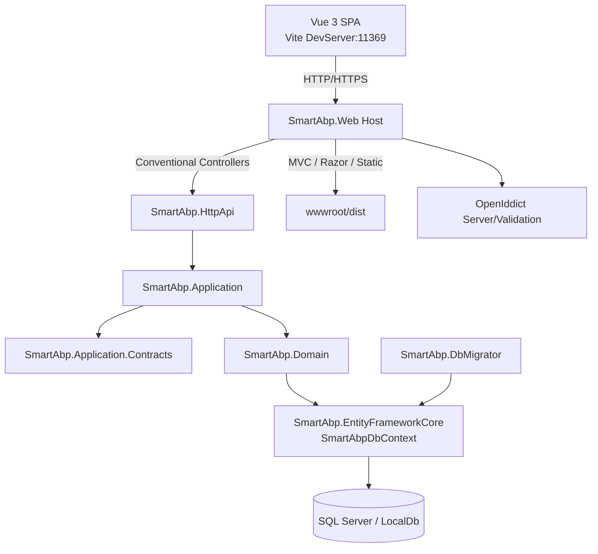
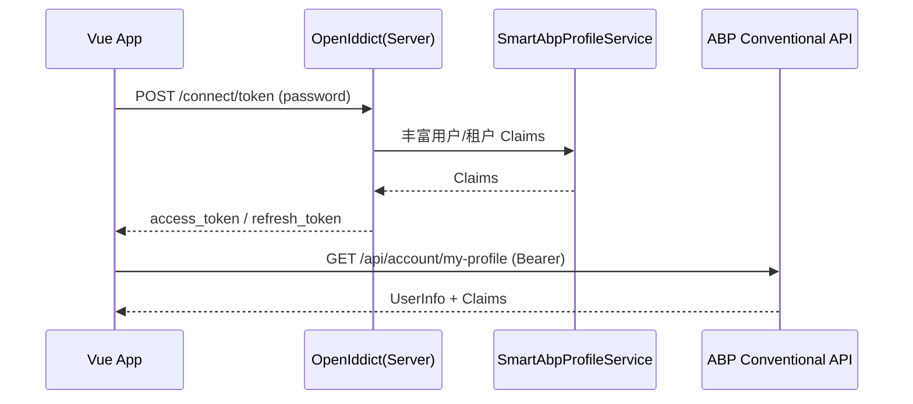

# 系统架构说明书（SmartAbp）

版本：v0.1  ｜ 状态：草案  ｜ 适用范围：`SmartAbp` 全栈代码库（.NET 8 + ABP + Vue 3）

## 1. 架构概览

本系统采用前后端分离、模块化的分层架构：
- 后端以 ABP Framework 为基础，构建模块化的 ASP.NET Core 应用，提供 OpenIddict 认证、权限、多租户、审计、设置管理等能力；数据访问使用 EF Core。
- 前端为 Vue 3 + TypeScript 单页应用（Vite 构建），通过反向代理与后端联通，生产环境由后端承载静态资源。




## 2. 后端架构

- 宿主与入口
  - `src/SmartAbp.Web/Program.cs`：配置 Serilog、Autofac、加载 ABP 模块并启动应用。
  - `src/SmartAbp.Web/SmartAbpWebModule.cs`：系统主模块，集中配置 CORS、认证授权、Swagger、自动 API、静态文件与 SPA 中间件、HealthChecks 等。

```csharp
// 片段：Program.cs
await builder.AddApplicationAsync<SmartAbpWebModule>();
var app = builder.Build();
await app.InitializeApplicationAsync();
await app.RunAsync();
```

- 模块依赖（核心）
  - `SmartAbp.Web` 依赖：`SmartAbp.HttpApi`、`SmartAbp.Application`、`SmartAbp.EntityFrameworkCore` 以及 ABP UI/Identity/Tenant/Feature/Swagger/SERILOG 等模块。
  - `SmartAbp.Application` 依赖：领域、契约模块与 ABP 权限/功能/账户/租户/设置等应用模块。
  - `SmartAbp.Application.Contracts`：权限定义、DTO 扩展入口。

- 数据访问
  - `src/SmartAbp.EntityFrameworkCore/EntityFrameworkCore/SmartAbpDbContext.cs`：统一替换 ABP 模块 DbContext 接口（Identity、TenantManagement 等），以便聚合查询与迁移。
  - 连接串 `ConnectionStrings:Default` 来源于 `src/SmartAbp.Web/appsettings.json`。

- 自动 API 暴露
  - `SmartAbpWebModule.ConfigureAutoApiControllers()` 启用 ABP Conventional Controllers：应用层 `SmartAbp.Application` 的应用服务按约定暴露为 REST API（默认 `/api/*`）。

- 认证与授权
  - OpenIddict 服务端与验证：`SmartAbpWebModule.PreConfigureServices` 中设置 Validation Audience、在生产环境加载证书与 Issuer。
  - 自定义 Claims 处理：
    - `SmartAbp.Domain/Identity/SmartAbpProfileService.cs`：在登录时为用户注入租户信息、显示名、头像、部门、职位、角色等 Claims。
    - `SmartAbp.Domain/OpenIddict/SmartAbpOpenIddictClaimsHandler.cs`：将 ProfileService 丰富的 Claims 确保写入 Token。

- HealthChecks 与监控
  - `SmartAbp.Web` 启用健康检查扩展（`AddSmartAbpHealthChecks`），默认健康端点配置键：`App:HealthCheckUrl`（默认 `/health-status`）。

- 日志与审计
  - Serilog 输出到控制台与 `Logs/logs.txt`；ABP 审计日志默认开启（可基于需要扩展）。


## 3. 前端架构

- 技术栈
  - Vue 3 + TypeScript + Pinia + Vue Router + Element Plus + Vite
  - 目录：`src/SmartAbp.Vue`

- 启动与构建
  - `src/SmartAbp.Vue/vite.config.ts`：开发服务器端口 `11369`，代理 `^/(connect|api|swagger|health-status)` 到 `https://localhost:44379`；生产构建输出到 `../SmartAbp.Web/wwwroot/dist`。
  - `src/SmartAbp.Web/SmartAbpWebModule.cs` 在生产环境托管 SPA 静态资源；开发环境使用后端中间件代理到前端 DevServer。

- 应用入口
  - `src/SmartAbp.Vue/src/main.ts`：创建应用、注册 Pinia/Router，初始化主题与认证状态。

- 路由与守卫
  - `src/SmartAbp.Vue/src/router/index.ts`：集中路由配置，基于 `meta.requiresAuth` 等元信息进行基础认证守卫；已登录用户访问 `/login` 会重定向到后台仪表盘。

- 状态与认证
  - 示例 Pinia 存储：`src/SmartAbp.Vue/src/stores/auth.ts`（演示用）。
  - 生产建议认证服务：`src/SmartAbp.Vue/src/utils/auth.ts`（`AuthService` 单例），与后端 OpenIddict 对接（`/connect/token`、`/connect/token` 刷新），解析并持久化 Token，定时刷新，自动附加 `Authorization` 头，获取 `/api/account/my-profile` 以同步用户信息与 Claims。

- API 访问
  - `src/SmartAbp.Vue/src/utils/api.ts`：封装 `fetch` 请求，内置 401 处理与刷新 Token 重试逻辑；基础地址来自 `VITE_API_BASE_URL`（或回退到 `window.location.origin`）。

- 环境变量（前端）
  - `VITE_API_BASE_URL`：后端基地址（例如 `https://localhost:44379`）
  - `VITE_CLIENT_ID`：OpenIddict ClientId（默认 `SmartAbp_App`）
  - `VITE_SCOPE`：OAuth Scope（默认 `SmartAbp`）


## 4. 关键运行时流程

### 4.1 登录认证（Password Grant）

1) 前端提交表单调用：`POST /connect/token`（`Content-Type: application/x-www-form-urlencoded`）
2) 后端 OpenIddict 验证用户凭据；`SmartAbpProfileService` 丰富用户与租户相关 Claims；`SmartAbpOpenIddictClaimsHandler` 将 Claims 注入 Token。
3) 前端保存 `access_token`、`refresh_token`、过期时间并启动刷新计时器；随后调用 `/api/account/my-profile` 获取用户信息。



### 4.2 前后端联调（开发环境）

- 前端：Vite DevServer（11369）
- 后端：`SmartAbp.Web`（44379）
- 通过 Vite 代理将 `/connect`、`/api`、`/swagger`、`/health-status` 转发到后端，避免 CORS 与证书问题。


## 5. 配置要点与环境区分

- 后端 `appsettings.json`（`src/SmartAbp.Web/appsettings.json`）
  - `App:SelfUrl`：后端自我地址（影响回调等场景）
  - `App:CorsOrigins`：允许的前端来源（默认已包含 `http(s)://localhost:11369`）
  - `AuthServer:*`：OpenIddict Authority、证书口令等
  - `ConnectionStrings:Default`：数据库连接字符串

- 生产环境证书
  - 在非开发环境，`SmartAbpWebModule` 禁用开发证书并从 `openiddict.pfx` 加载签名/加密证书，Issuer 来自配置 `AuthServer:Authority`。

- 前端 `.env`（建议）
  - 根据部署地址配置 `VITE_API_BASE_URL`，确保生产环境不依赖浏览器 `window.location.origin` 推断。


## 6. 构建与部署

- 开发
  - 后端：`cd src/SmartAbp.Web && dotnet run`
  - 前端：`cd src/SmartAbp.Vue && npm i && npm run dev`

- 生产构建
  - 前端：`cd src/SmartAbp.Vue && npm run build`（产物输出至 `src/SmartAbp.Web/wwwroot/dist`）
  - 后端：`cd src/SmartAbp.Web && dotnet publish -c Release -o ./publish`
  - 部署：将 `publish` 内容部署到目标环境，确保 `wwwroot/dist` 存在；配置好证书与环境变量。

- 数据迁移
  - 使用 `SmartAbp.DbMigrator`：`src/SmartAbp.DbMigrator`（控制台 Host）用于应用迁移与初始化数据（如需扩展）。


## 7. 安全与合规建议

- 强制 HTTPS：生产环境务必启用 HTTPS 与可信证书；`RequireHttpsMetadata` 仅在开发时可为 `false`。
- Token 存储：当前使用 `localStorage` 持久化，若对 XSS 风险敏感，可替换为 HttpOnly Cookie（需服务端同配）。
- CORS 白名单：仅放行必要来源，生产慎用通配符；与 Vite 代理区分。
- 日志脱敏：审计与应用日志建议对敏感字段脱敏，避免 Token/凭据泄漏。


## 8. 扩展点与开发约定

- 新实体与仓储：在 `SmartAbp.Domain` 定义实体，`SmartAbp.EntityFrameworkCore` 配置映射并迁移。
- 应用服务：在 `SmartAbp.Application` 编写应用服务，自动经由 Conventional Controllers 暴露。
- API 契约：在 `SmartAbp.Application.Contracts` 定义 DTO、枚举与权限常量。
- HTTP API：如需手写控制器，继承 `SmartAbp.HttpApi/Controllers/SmartAbpController.cs`。
- 权限：在 `SmartAbp.Application.Contracts/Permissions` 下定义与分组，前端据此控制路由/菜单显示。


## 9. 关键文件索引

- 后端
  - `src/SmartAbp.Web/Program.cs`
  - `src/SmartAbp.Web/SmartAbpWebModule.cs`
  - `src/SmartAbp.EntityFrameworkCore/EntityFrameworkCore/SmartAbpDbContext.cs`
  - `src/SmartAbp.Domain/Identity/SmartAbpProfileService.cs`
  - `src/SmartAbp.Domain/OpenIddict/SmartAbpOpenIddictClaimsHandler.cs`
  - `src/SmartAbp.HttpApi/Controllers/SmartAbpController.cs`
  - `src/SmartAbp.Web/appsettings.json`

- 前端
  - `src/SmartAbp.Vue/vite.config.ts`
  - `src/SmartAbp.Vue/src/main.ts`
  - `src/SmartAbp.Vue/src/router/index.ts`
  - `src/SmartAbp.Vue/src/utils/auth.ts`
  - `src/SmartAbp.Vue/src/utils/api.ts`


---

本文档由代码自动分析生成，建议与团队约定保持随代码演进而更新。若发现与实现不一致，请以实现为准并提交修订。


