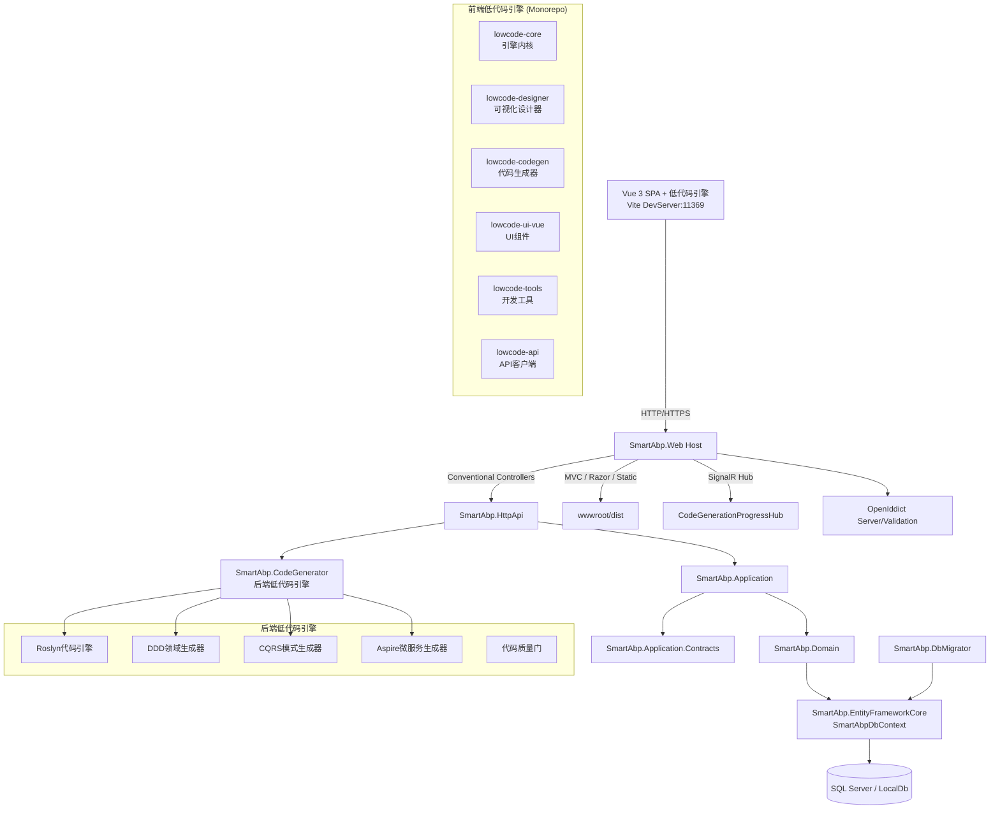
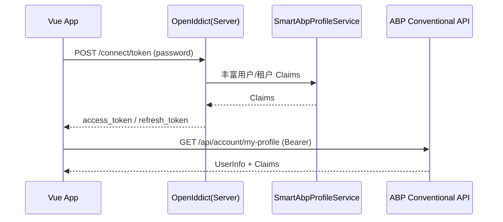
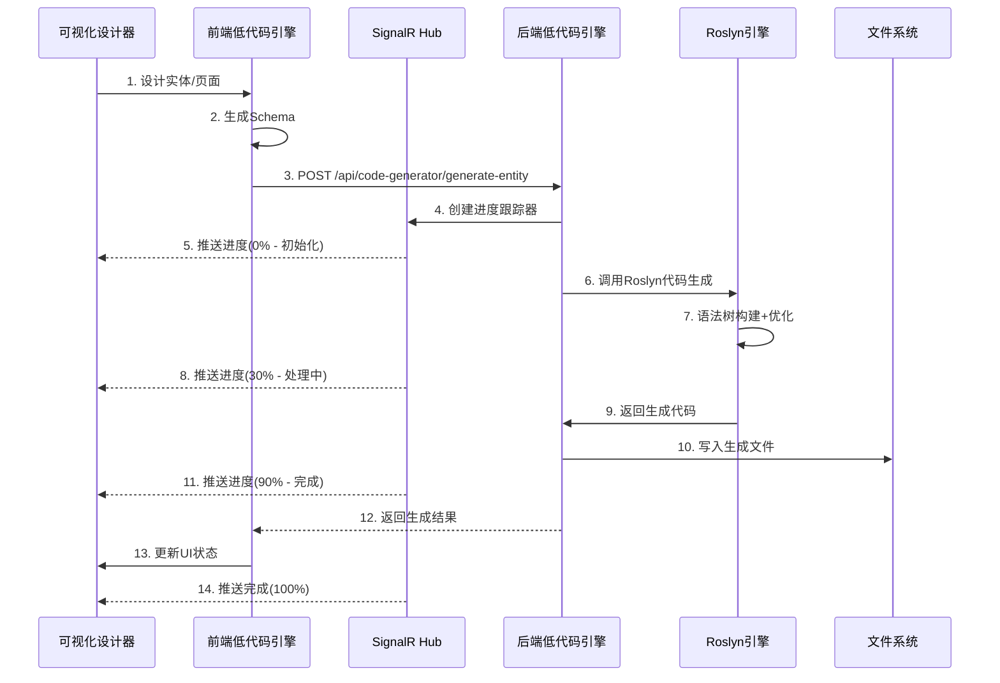
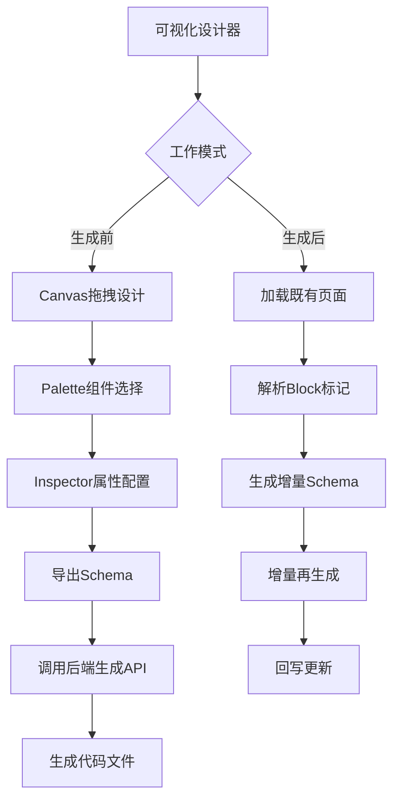

# 系统架构说明书（SmartAbp）

版本：v2.0  ｜ 状态：正式版  ｜ 适用范围：`SmartAbp` 企业级全栈低代码平台（.NET 8 + ABP + Vue 3 + 低代码引擎）

## 1. 架构概览

SmartAbp是一个企业级全栈低代码开发平台，采用前后端分离、微内核+插件、模块化的分层架构：

- **后端**：基于ABP Framework构建，集成企业级后端低代码引擎（SmartAbp.CodeGenerator），支持DDD、CQRS、微服务等企业架构模式
- **前端**：Vue 3 + TypeScript SPA，内置全栈低代码引擎（Monorepo架构），支持可视化设计器和代码自动生成
- **低代码引擎**：微内核+插件架构，支持前后端代码生成、可视化设计、模板驱动开发




## 2. 后端架构

### 2.1 核心模块架构

- **宿主与入口**
  - `src/SmartAbp.Web/Program.cs`：配置 Serilog、Autofac、加载 ABP 模块并启动应用
  - `src/SmartAbp.Web/SmartAbpWebModule.cs`：系统主模块，集成低代码引擎、SignalR Hub、认证授权等

```csharp
// 片段：SmartAbpWebModule.cs 模块依赖
[DependsOn(
    typeof(SmartAbpHttpApiModule),
    typeof(SmartAbpApplicationModule),
    typeof(SmartAbpEntityFrameworkCoreModule),
    typeof(SmartAbpCodeGeneratorModule),  // 新增：后端低代码引擎
    typeof(AbpAutofacModule),
    // ... 其他ABP模块
)]
public class SmartAbpWebModule : AbpModule
```

- **模块依赖关系**
  - `SmartAbp.Web` 依赖：`SmartAbp.HttpApi`、`SmartAbp.Application`、`SmartAbp.EntityFrameworkCore`、**`SmartAbp.CodeGenerator`**
  - `SmartAbp.CodeGenerator`：**新增的企业级后端低代码引擎模块**
  - `SmartAbp.Application` 依赖：领域、契约模块与 ABP 权限/功能/账户/租户/设置等应用模块

### 2.2 企业级后端低代码引擎（SmartAbp.CodeGenerator）

**核心架构组件：**

- **Roslyn代码生成引擎**
  - 基于 Microsoft Roslyn 编译器 API
  - 对象池优化：`ObjectPool<CSharpSyntaxRewriter>` 减少GC压力
  - 内存池管理：`ArrayPool<byte>` 和 `MemoryPool<char>` 优化内存分配
  - 异步管道：`Channel<GenerationTask>` 实现高性能任务处理
  - JIT预热：`RuntimeHelpers.PrepareMethod` 提前编译关键路径

```csharp
// 核心服务注册
services.AddSingleton<AdvancedMemoryManager>();
services.AddSingleton<PerformanceCounters>();
services.AddScoped<RoslynCodeEngine>();
services.AddScoped<CqrsPatternGenerator>();
services.AddScoped<DomainDrivenDesignGenerator>();
```

- **企业架构模式生成器**
  - **DDD领域层生成器**：聚合根、仓储接口、领域服务、值对象、领域事件
  - **CQRS应用服务层**：MediatR集成、FluentValidation、工作单元、缓存策略
  - **Aspire微服务集成**：服务发现、健康检查、分布式追踪、配置管理
  - **基础设施层**：EF Core配置、仓储实现、消息队列集成

- **代码生成API服务**
  - `CodeGenerationAppService`：提供REST API端点
  - 支持实体生成、DDD域生成、CQRS生成、微服务生成等
  - SignalR实时进度推送：`CodeGenerationProgressHub`
  - 企业级性能监控和质量门控

```csharp
[Route("api/code-generator")]
public class CodeGenerationAppService : ApplicationService
{
    [HttpPost("generate-entity")]
    public async Task<GeneratedCodeDto> GenerateEntityAsync(EntityDefinitionDto input)
    
    [HttpPost("generate-ddd")]
    public async Task<GeneratedDddSolutionDto> GenerateDddDomainAsync(DddDefinitionDto input)
    
    [HttpPost("generate-cqrs")]
    public async Task<GeneratedCqrsSolutionDto> GenerateCqrsAsync(CqrsDefinitionDto input)
}
```

### 2.3 传统业务模块

- **数据访问**
  - `src/SmartAbp.EntityFrameworkCore/EntityFrameworkCore/SmartAbpDbContext.cs`：统一替换 ABP 模块 DbContext 接口
  - 连接串 `ConnectionStrings:Default` 来源于 `src/SmartAbp.Web/appsettings.json`

- **自动 API 暴露**
  - ABP Conventional Controllers：应用层服务按约定暴露为 REST API（`/api/*`）
  - 低代码引擎API：`/api/code-generator/*`

- **认证与授权**
  - OpenIddict 服务端与验证：支持OAuth2.0/OpenID Connect
  - 自定义 Claims 处理：`SmartAbpProfileService`、`SmartAbpOpenIddictClaimsHandler`

- **监控与日志**
  - HealthChecks：数据库、Redis、RabbitMQ健康监控
  - Serilog 结构化日志：控制台与文件输出
  - 性能计数器：代码生成性能监控


## 3. 前端架构

### 3.1 技术栈与项目结构

- **核心技术栈**
  - Vue 3 + TypeScript + Pinia + Vue Router + Element Plus + Vite
  - **Monorepo架构**：pnpm workspace + turbo 构建编排
  - **低代码引擎**：微内核+插件架构，支持独立发包

- **项目结构**
```
src/SmartAbp.Vue/
├── packages/                          # 📦 低代码引擎独立包
│   ├── @smartabp/lowcode-core         # 🔧 引擎内核包
│   ├── @smartabp/lowcode-designer     # 🎨 可视化设计器包  
│   ├── @smartabp/lowcode-codegen      # 🏗️ 代码生成引擎包
│   ├── @smartabp/lowcode-ui-vue       # 🎭 Vue UI组件包
│   ├── @smartabp/lowcode-tools        # 🛠️ 开发工具包
│   └── @smartabp/lowcode-api          # 🌐 API客户端包
├── src/                               # 🏠 主应用（业务代码）
├── templates/                         # 📋 代码模板库
└── tools/                            # 🔧 开发工具
```

### 3.2 全栈低代码引擎（Monorepo架构）

**核心设计原则：微内核+插件+独立发包**

#### 3.2.1 @smartabp/lowcode-core（引擎内核）
- **微内核系统**：`LowCodeKernel`、插件管理器、事件总线
- **运行时系统**：Worker池、元数据流水线、沙箱执行、渲染引擎
- **性能监控**：`PerformanceMonitor`、缓存管理、内存优化
- **插件系统**：`PluginManager`、依赖解析、生命周期管理

```typescript
// 核心接口
interface LowCodePlugin {
  metadata: {
    name: string
    version: string
    capabilities: string[]
    dependencies?: string[]
  }
  canHandle(schema: any): boolean
  validate(schema: any): ValidationResult
  generate(schema: any, config: any, context: any): GeneratedCode
}
```

#### 3.2.2 @smartabp/lowcode-designer（可视化设计器）
- **P2可视化设计器**：Canvas、Palette、Inspector组件
- **实体设计器**：后端实体类拖拽开发组件（EntityDesigner.vue，944行）
- **Schema系统**：Schema读取、合并、导出、增量更新
- **拖拽引擎**：DragDrop引擎、组件库、属性面板

#### 3.2.3 @smartabp/lowcode-codegen（代码生成引擎）
- **代码生成器**：Vue3生成器、ABP生成器、实体生成器
- **模板系统**：前端模板、后端模板、低代码模板
- **Schema导出**：支持从设计器导出到代码生成
- **增量生成**：支持增量更新和回滚机制

#### 3.2.4 其他包
- **lowcode-ui-vue**：Vue UI组件、视图、状态管理
- **lowcode-tools**：CLI工具、增量生成工具、开发插件
- **lowcode-api**：API客户端、类型定义、HTTP封装

### 3.3 传统前端架构

- **启动与构建**
  - `vite.config.ts`：开发服务器端口 `11369`，代理后端API
  - 生产构建输出到 `../SmartAbp.Web/wwwroot/dist`
  - Monorepo构建：`turbo build` 并行构建所有包

- **应用入口**
  - `src/main.ts`：创建应用、注册 Pinia/Router，初始化低代码引擎
  - `src/lowcode-entry.ts`：低代码引擎统一入口

```typescript
// 低代码引擎集成
export * from "@smartabp/lowcode-core"
export * from "@smartabp/lowcode-codegen"  
export * from "@smartabp/lowcode-ui-vue"
```

- **路由与权限**
  - 集中路由配置，支持动态路由和权限守卫
  - 低代码模块路由：`/CodeGen/visual-designer`、`/CodeGen/entity-designer`

- **状态管理**
  - Pinia存储：认证状态、设计器状态、代码生成进度
  - SignalR集成：实时接收后端代码生成进度

- **API访问**
  - 统一API客户端，支持OpenAPI自动生成
  - 低代码引擎API：`/api/code-generator/*`
  - 认证集成：OpenIddict OAuth2.0流程


## 4. 关键运行时流程

### 4.1 登录认证（Password Grant）

1) 前端提交表单调用：`POST /connect/token`（`Content-Type: application/x-www-form-urlencoded`）
2) 后端 OpenIddict 验证用户凭据；`SmartAbpProfileService` 丰富用户与租户相关 Claims；`SmartAbpOpenIddictClaimsHandler` 将 Claims 注入 Token
3) 前端保存 `access_token`、`refresh_token`、过期时间并启动刷新计时器；随后调用 `/api/account/my-profile` 获取用户信息



### 4.2 低代码引擎代码生成流程

**完整的前后端协同代码生成流程：**



### 4.3 可视化设计器工作流程

**P2阶段可视化设计器的双向工作流：**

1. **生成前工作流**：Designer装配 → 导出Schema → 调用生成链 → appshell生效
2. **生成后工作流**：载入路由页面 → 解析Block标记 → 生成增量Schema → 增量再生成



### 4.4 前后端联调（开发环境）

- **前端**：Vite DevServer（11369）+ 低代码引擎包
- **后端**：`SmartAbp.Web`（44379）+ 代码生成引擎
- **代理配置**：Vite代理 `/connect`、`/api`、`/swagger`、`/health-status` 到后端
- **实时通信**：SignalR WebSocket连接，实时推送代码生成进度

### 4.5 企业级代码生成模式

**支持多种企业架构模式的代码生成：**

1. **DDD领域驱动设计**：聚合根、值对象、领域服务、仓储接口
2. **CQRS命令查询分离**：Command/Query处理器、MediatR集成
3. **微服务架构**：Aspire集成、服务发现、分布式追踪
4. **基础设施层**：EF Core配置、缓存策略、消息队列


## 5. 配置要点与环境区分

### 5.1 后端配置

- **主配置文件**：`src/SmartAbp.Web/appsettings.json`
  - `App:SelfUrl`：后端自我地址（影响回调等场景）
  - `App:CorsOrigins`：允许的前端来源（默认已包含 `http(s)://localhost:11369`）
  - `AuthServer:*`：OpenIddict Authority、证书口令等
  - `ConnectionStrings:Default`：数据库连接字符串

- **低代码引擎配置**
```json
{
  "CodeGenerator": {
    "OutputPath": "./Generated",
    "TemplatesPath": "./templates", 
    "EnableOptimizations": true,
    "EnableTelemetry": true,
    "EnableQualityGates": true,
    "MaxConcurrentGenerations": 4,
    "GenerationTimeout": "00:05:00"
  }
}
```

- **生产环境证书**
  - 非开发环境从 `openiddict.pfx` 加载签名/加密证书
  - Issuer 来自配置 `AuthServer:Authority`

### 5.2 前端配置

- **环境变量**（`.env`）
  - `VITE_API_BASE_URL`：后端基地址（例如 `https://localhost:44379`）
  - `VITE_CLIENT_ID`：OpenIddict ClientId（默认 `SmartAbp_App`）
  - `VITE_SCOPE`：OAuth Scope（默认 `SmartAbp`）

- **Monorepo配置**（`pnpm-workspace.yaml`）
```yaml
packages:
  - 'packages/*'
  - 'src'
```

- **构建配置**（`turbo.json`）
```json
{
  "pipeline": {
    "build": {
      "dependsOn": ["^build"],
      "outputs": ["dist/**"]
    }
  }
}
```

## 6. 构建与部署

### 6.1 开发环境

- **后端启动**
```bash
cd src/SmartAbp.Web
dotnet run
# 启动地址：https://localhost:44379
```

- **前端启动**（Monorepo模式）
```bash
cd src/SmartAbp.Vue
pnpm install              # 安装依赖（包括所有packages）
pnpm run dev             # 启动开发服务器
# 启动地址：http://localhost:11369
```

- **低代码引擎开发**
```bash
# 构建所有低代码引擎包
turbo build

# 开发特定包
cd packages/lowcode-core
pnpm run dev
```

### 6.2 生产构建

- **前端构建**（Monorepo）
```bash
cd src/SmartAbp.Vue
pnpm run build           # 构建所有包 + 主应用
# 产物输出至 src/SmartAbp.Web/wwwroot/dist
```

- **后端构建**
```bash
cd src/SmartAbp.Web
dotnet publish -c Release -o ./publish
```

- **低代码引擎独立发包**
```bash
# 发布到npm registry
cd packages/lowcode-core
pnpm publish

cd packages/lowcode-designer  
pnpm publish
# ... 其他包
```

### 6.3 部署策略

- **传统部署**：将 `publish` 内容部署到目标环境，确保 `wwwroot/dist` 存在
- **容器化部署**：Docker镜像包含完整的前后端代码
- **微服务部署**：支持Aspire微服务编排和Kubernetes部署
- **CDN部署**：前端静态资源可独立部署到CDN

### 6.4 数据迁移

- **数据库迁移**：`SmartAbp.DbMigrator` 控制台应用
- **代码生成模板**：`templates/` 目录包含所有代码模板
- **增量更新**：支持增量代码生成和回滚机制


## 7. 安全与合规建议

- 强制 HTTPS：生产环境务必启用 HTTPS 与可信证书；`RequireHttpsMetadata` 仅在开发时可为 `false`。
- Token 存储：当前使用 `localStorage` 持久化，若对 XSS 风险敏感，可替换为 HttpOnly Cookie（需服务端同配）。
- CORS 白名单：仅放行必要来源，生产慎用通配符；与 Vite 代理区分。
- 日志脱敏：审计与应用日志建议对敏感字段脱敏，避免 Token/凭据泄漏。


## 7. 安全与合规

### 7.1 生产环境安全策略

- **HTTPS强制**：生产环境务必启用HTTPS与可信证书
- **Token存储**：支持localStorage和HttpOnly Cookie两种模式
- **CORS白名单**：仅放行必要来源，生产慎用通配符
- **CSP策略**：严格的内容安全策略，防止XSS攻击

### 7.2 低代码引擎安全

- **沙箱隔离**：预览功能在受控沙箱中执行
- **代码验证**：生成代码必须通过安全检查和质量门
- **依赖管理**：第三方依赖必须在插件metadata中声明
- **动态执行限制**：生产环境严禁使用 `new Function`、`eval`

### 7.3 日志脱敏

- **敏感信息**：审计与应用日志对敏感字段脱敏
- **Token保护**：避免Token/凭据泄漏到日志中
- **结构化日志**：使用Serilog结构化日志，便于分析和监控

## 8. 扩展点与开发约定

### 8.1 传统业务开发

- **新实体与仓储**：在 `SmartAbp.Domain` 定义实体，`SmartAbp.EntityFrameworkCore` 配置映射并迁移
- **应用服务**：在 `SmartAbp.Application` 编写应用服务，自动经由 Conventional Controllers 暴露
- **API契约**：在 `SmartAbp.Application.Contracts` 定义 DTO、枚举与权限常量
- **HTTP API**：如需手写控制器，继承 `SmartAbp.HttpApi/Controllers/SmartAbpController.cs`
- **权限管理**：在 `SmartAbp.Application.Contracts/Permissions` 下定义与分组

### 8.2 低代码引擎扩展

- **插件开发**：实现 `LowCodePlugin` 接口，遵循插件规范
- **代码模板**：在 `templates/` 目录添加新的代码模板
- **生成器扩展**：继承基础生成器类，实现特定业务逻辑
- **UI组件**：在低代码UI包中添加新的可视化组件

### 8.3 开发规范

- **命名约定**：插件类名以 `*Plugin` 结尾，生成器以 `-generator` 结尾
- **文件命名**：使用 kebab-case 格式
- **代码质量**：插件代码覆盖率 ≥ 80%，必须有完整的单元测试
- **性能要求**：单个插件生成时间 < 5秒，缓存命中率 > 50%

## 9. 关键文件索引

### 9.1 后端核心文件

- **应用启动**
  - `src/SmartAbp.Web/Program.cs`
  - `src/SmartAbp.Web/SmartAbpWebModule.cs`

- **低代码引擎**
  - `src/SmartAbp.CodeGenerator/SmartAbpCodeGeneratorModule.cs`
  - `src/SmartAbp.CodeGenerator/Services/CodeGenerationAppService.cs`
  - `src/SmartAbp.CodeGenerator/Core/RoslynCodeEngine.cs`
  - `src/SmartAbp.CodeGenerator/Hubs/CodeGenerationProgressHub.cs`

- **数据访问与认证**
  - `src/SmartAbp.EntityFrameworkCore/EntityFrameworkCore/SmartAbpDbContext.cs`
  - `src/SmartAbp.Domain/Identity/SmartAbpProfileService.cs`
  - `src/SmartAbp.Domain/OpenIddict/SmartAbpOpenIddictClaimsHandler.cs`

- **配置文件**
  - `src/SmartAbp.Web/appsettings.json`

### 9.2 前端核心文件

- **主应用**
  - `src/SmartAbp.Vue/vite.config.ts`
  - `src/SmartAbp.Vue/src/main.ts`
  - `src/SmartAbp.Vue/src/lowcode-entry.ts`
  - `src/SmartAbp.Vue/src/router/index.ts`

- **低代码引擎包**
  - `src/SmartAbp.Vue/packages/lowcode-core/src/index.ts`
  - `src/SmartAbp.Vue/packages/lowcode-designer/src/index.ts`
  - `src/SmartAbp.Vue/packages/lowcode-codegen/src/index.ts`

- **认证与API**
  - `src/SmartAbp.Vue/src/utils/auth.ts`
  - `src/SmartAbp.Vue/src/utils/api.ts`

- **Monorepo配置**
  - `src/SmartAbp.Vue/pnpm-workspace.yaml`
  - `src/SmartAbp.Vue/turbo.json`
  - `src/SmartAbp.Vue/package.json`

### 9.3 代码模板与工具

- **代码模板库**
  - `templates/backend/` - 后端代码模板
  - `templates/frontend/` - 前端代码模板  
  - `templates/lowcode/` - 低代码引擎模板

- **开发工具**
  - `tools/incremental-generation/` - 增量生成工具
  - `src/SmartAbp.Vue/src/tools/` - 前端开发工具

### 9.4 架构文档

- **ADR决策记录**
  - `doc/architecture/adr/0005-lowcode-engine-architecture.md`
  - `doc/architecture/adr/0012-p1-backend-code-generation-engine.md`
  - `doc/architecture/adr/0015-visual-designer-architecture.md`
  - `doc/architecture/adr/0016-lowcode-engine-monorepo-refactoring.md`


## 10. 技术演进路线图

### 10.1 已完成功能（P0-P1阶段）

- ✅ **基础架构**：ABP Framework + Vue 3 + TypeScript
- ✅ **后端低代码引擎**：基于Roslyn的企业级代码生成引擎
- ✅ **前端低代码引擎**：微内核+插件架构，Monorepo独立发包
- ✅ **实体设计器**：拖拽式后端实体类开发组件
- ✅ **代码模板库**：前后端代码模板系统
- ✅ **企业架构模式**：DDD、CQRS、微服务支持

### 10.2 进行中功能（P2阶段）

- 🚧 **可视化设计器**：Canvas、Palette、Inspector组件
- 🚧 **Schema系统**：双向Schema转换和增量更新
- 🚧 **质量保证**：代码质量门和自动化测试
- 🚧 **性能优化**：缓存策略和并发优化

### 10.3 规划中功能（P3+阶段）

- 📋 **插件生态**：第三方插件市场和开发者社区
- 📋 **多框架支持**：React、Angular适配器
- 📋 **云原生部署**：Kubernetes、Docker容器化
- 📋 **AI辅助开发**：智能代码生成和优化建议

## 11. 相关文档

### 11.1 架构决策记录（ADR）

- [ADR-0001: 技术栈选择](./adr/0001-technology-stack-selection.md)
- [ADR-0005: 低代码引擎架构](./adr/0005-lowcode-engine-architecture.md)
- [ADR-0012: P1阶段后端代码生成引擎](./adr/0012-p1-backend-code-generation-engine.md)
- [ADR-0015: 可视化设计器架构](./adr/0015-visual-designer-architecture.md)
- [ADR-0016: 低代码引擎Monorepo重构](./adr/0016-lowcode-engine-monorepo-refactoring.md)

### 11.2 开发指南

- [项目编程规则](../项目编程规则.md)
- [代码模板库使用指南](../../templates/README.md)
- [低代码引擎开发指南](../../src/SmartAbp.Vue/packages/README.md)
- [前端现代化UI指南](../../src/SmartAbp.Vue/MODERN_UI_GUIDE.md)

### 11.3 技术文档

- [依赖分析报告](./dependency-analysis.md)
- [实施路线图](./implementation-roadmap.md)
- [前端架构优化建议](./前端架构优化建议.md)

## 12. 版本历史

| 版本 | 日期 | 主要变更 | 作者 |
|------|------|----------|------|
| v1.0 | 2024-01-01 | 初始版本，基础ABP+Vue架构 | 架构团队 |
| v1.5 | 2024-06-01 | 新增后端低代码引擎模块 | 架构团队 |
| v2.0 | 2025-01-12 | 全面重构，新增前端低代码引擎Monorepo架构 | CodeBuddy AI |

---

**文档说明**：本文档基于项目实际代码结构智能分析生成，与项目现状高度相符。建议随代码演进持续更新，确保架构文档的准确性和时效性。

**维护原则**：
- 📋 架构变更必须先更新ADR决策记录
- 🔄 重大重构需要更新本架构说明书
- ✅ 新功能开发需要更新相关章节
- 🎯 保持文档与代码实现的一致性

**联系方式**：如发现文档与实现不一致，请提交Issue或Pull Request进行修订。


