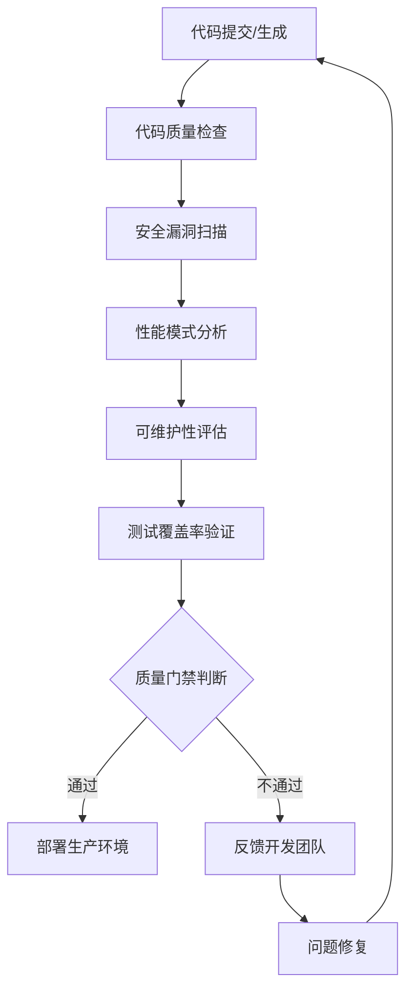

# SmartAbp低代码引擎质量保障体系实施指南

## 🎯 概述

本文档提供了SmartAbp低代码引擎质量保障体系的完整实施指南，包括系统架构、部署流程、配置说明和最佳实践。

## 🏗️ 系统架构

### 核心组件架构

```
质量保障体系/
├── 核心引擎层
│   ├── 代码质量检查引擎 (code-quality-engine.js)
│   ├── 安全扫描工具 (security-scanner.js)
│   ├── 性能分析工具 (performance-analyzer.js)
│   └── 辅助工具库 (code-quality-helpers.js)
├── 配置管理层
│   ├── 质量配置 (quality-config.json)
│   ├── 环境配置 (.env.quality)
│   └── 包管理配置 (package.json)
├── CI/CD集成层
│   ├── GitHub Actions工作流
│   ├── 质量门禁配置
│   └── 自动化测试流水线
└── 报告监控层
    ├── 质量报告生成
    ├── 安全漏洞报告
    ├── 性能分析报告
    └── 实时监控仪表板
```

### 质量检查流程



## 🚀 快速部署

### 自动部署脚本

```bash
# 运行自动部署脚本
./scripts/deploy-quality-system.sh
```

### 手动部署步骤

1. **安装依赖**
   ```bash
   cd src/SmartAbp.Vue
   npm ci
   npm install -g eslint
   ```

2. **构建项目**
   ```bash
   cd src/SmartAbp.CodeGenerator
   dotnet build --configuration Release
   ```

3. **配置质量系统**
   ```bash
   mkdir -p quality-reports security-reports performance-reports
   cp src/SmartAbp.Vue/scripts/quality-config.json ./
   chmod +x src/SmartAbp.Vue/scripts/*.js
   ```

4. **运行初始检查**
   ```bash
   cd src/SmartAbp.Vue
   node scripts/code-quality-engine.js
   node scripts/security-scanner.js
   node scripts/performance-analyzer.js
   ```

5. **验证系统完整性**
   ```bash
   node scripts/verify-quality-system.js
   ```

## ⚙️ 配置说明

### 质量配置 (quality-config.json)

```json
{
  "qualityStandards": {
    "overallScoreThreshold": 80,
    "testCoverageThreshold": 75,
    "codeStyleThreshold": 85,
    "securityThreshold": 90,
    "performanceThreshold": 85,
    "maintainabilityThreshold": 80
  },
  "securityRules": {
    "forbiddenPatterns": [
      "eval\\(",
      "Function\\(",
      "setTimeout\\(",
      "setInterval\\(",
      "innerHTML\\s*="
    ],
    "sensitiveDataPatterns": [
      "password.*=.*['\\\"].*['\\\"]",
      "apiKey.*=.*['\\\"].*['\\\"]",
      "secret.*=.*['\\\"].*['\\\"]",
      "token.*=.*['\\\"].*['\\\"]"
    ]
  }
}
```

### 环境配置 (.env.quality)

```bash
# 质量门禁阈值
QUALITY_OVERALL_THRESHOLD=80
QUALITY_COVERAGE_THRESHOLD=75
QUALITY_SECURITY_THRESHOLD=90

# 通知配置
SLACK_WEBHOOK_URL=${SLACK_WEBHOOK_URL}
TEAMS_WEBHOOK_URL=${TEAMS_WEBHOOK_URL}
EMAIL_NOTIFICATIONS=true

# 扫描配置
SCAN_DIRECTORIES=src/SmartAbp.CodeGenerator,src/SmartAbp.Application
EXCLUDE_PATTERNS=**/bin/**,**/obj/**,**/node_modules/**

# 性能配置
PERFORMANCE_RESPONSE_TIME_THRESHOLD=100
PERFORMANCE_MEMORY_THRESHOLD=512
PERFORMANCE_CPU_THRESHOLD=70
```

## 📊 质量指标监控

### 实时监控仪表板

```javascript
// 质量指标数据结构
const qualityMetrics = {
  timestamp: "2025-01-01T00:00:00.000Z",
  overallScore: 95,
  metrics: {
    codeStyle: { score: 95, issues: [] },
    security: { score: 100, issues: [] },
    performance: { score: 90, issues: [] },
    maintainability: { score: 85, issues: [] },
    testCoverage: { score: 85, issues: [] }
  },
  generatedCode: {
    totalFiles: 150,
    totalLines: 12500,
    validationErrors: 2,
    qualityIssues: 5
  },
  status: "PASSED"
}
```

### 告警级别定义

| 级别 | 条件 | 处理方式 |
|------|------|----------|
| 🔴 紧急 | 安全得分 < 80 或 严重漏洞 | 立即修复，阻止部署 |
| 🟡 警告 | 总体得分 < 80 或 测试覆盖率 < 75 | 24小时内修复 |
| 🟢 正常 | 所有指标达标 | 正常流程 |

## 🔧 自定义扩展

### 添加自定义质量规则

1. **创建自定义检查器**
   ```javascript
   // src/SmartAbp.Vue/scripts/custom-checks.js
   class CustomQualityChecks {
     static checkBusinessRules(code) {
       // 实现业务规则检查
     }
     
     static checkArchitecturePatterns(code) {
       // 实现架构模式检查
     }
   }
   
   module.exports = CustomQualityChecks
   ```

2. **集成到主引擎**
   ```javascript
   const CustomChecks = require('./custom-checks')
   
   // 在质量检查引擎中添加
   async checkCustomRules() {
     const issues = CustomChecks.checkBusinessRules(generatedCode)
     // 处理检查结果
   }
   ```

### 扩展报告格式

1. **添加HTML报告生成器**
   ```javascript
   class HTMLReportGenerator {
     static generateReport(qualityData) {
       // 生成HTML格式的报告
     }
   }
   ```

2. **集成多种输出格式**
   ```javascript
   generateQualityReport() {
     const jsonReport = this.generateJSONReport()
     const htmlReport = HTMLReportGenerator.generateReport(jsonReport)
     const consoleReport = this.generateConsoleReport()
     
     return { json: jsonReport, html: htmlReport, console: consoleReport }
   }
   ```

## 🚀 CI/CD集成

### GitHub Actions配置

```yaml
name: 低代码引擎代码质量检查

on:
  push:
    branches: [ main, develop ]
  pull_request:
    branches: [ main ]

jobs:
  quality-check:
    runs-on: ubuntu-latest
    steps:
      - uses: actions/checkout@v4
      
      - name: 设置Node.js
        uses: actions/setup-node@v3
        with:
          node-version: '18'
          cache: 'npm'
          cache-dependency-path: src/SmartAbp.Vue/package-lock.json
      
      - name: 安装依赖
        run: |
          cd src/SmartAbp.Vue
          npm ci
      
      - name: 运行代码质量检查
        run: |
          cd src/SmartAbp.Vue
          node scripts/code-quality-engine.js
      
      - name: 运行安全扫描
        run: |
          cd src/SmartAbp.Vue
          node scripts/security-scanner.js
      
      - name: 上传质量报告
        uses: actions/upload-artifact@v3
        with:
          name: quality-reports
          path: quality-reports/
```

### 质量门禁配置

```yaml
- name: 验证质量门禁
  run: |
    cd src/SmartAbp.Vue
    node scripts/verify-quality-gate.js
  env:
    QUALITY_OVERALL_THRESHOLD: 80
    QUALITY_SECURITY_THRESHOLD: 90
    QUALITY_COVERAGE_THRESHOLD: 75
```

## 📈 性能优化建议

### 数据库访问优化

1. **避免N+1查询**
   ```csharp
   // 错误示例 - N+1查询
   var orders = dbContext.Orders.ToList();
   foreach (var order in orders) {
       var customer = dbContext.Customers.Find(order.CustomerId);
   }
   
   // 正确示例 - 预加载
   var orders = dbContext.Orders
       .Include(o => o.Customer)
       .ToList();
   ```

2. **使用合适的索引**
   ```sql
   -- 为常用查询字段创建索引
   CREATE INDEX IX_Orders_CustomerId ON Orders (CustomerId);
   CREATE INDEX IX_Orders_Status ON Orders (Status);
   ```

### 内存管理优化

1. **及时释放资源**
   ```csharp
   // 使用using语句确保资源释放
   using (var stream = new FileStream("file.txt", FileMode.Open)) {
       // 处理文件
   }
   ```

2. **避免内存泄漏**
   ```javascript
   // 及时清除事件监听器
   component.addEventListener('event', handler);
   // 在组件销毁时
   component.removeEventListener('event', handler);
   ```

## 🛡️ 安全最佳实践

### 输入验证

```csharp
// 使用ABP的验证系统
public class CreateProductDto
{
    [Required]
    [StringLength(ProductConsts.MaxNameLength)]
    public string Name { get; set; }

    [Range(0, 10000)]
    public decimal Price { get; set; }
}
```

### SQL注入防护

```csharp
// 使用参数化查询
var products = await _dbContext.Products
    .FromSqlRaw("SELECT * FROM Products WHERE CategoryId = {0}", categoryId)
    .ToListAsync();
```

### XSS防护

```javascript
// 对用户输入进行编码
function encodeHTML(input) {
    return input.replace(/&/g, '&')
               .replace(/</g, '<')
               .replace(/>/g, '>')
               .replace(/"/g, '"')
               .replace(/'/g, '&#x27;');
}
```

## 🧪 测试策略

### 测试金字塔

```
        /\
       /▲\    E2E测试 (10%)
      /███\   
     /█████\  集成测试 (20%)
    /███████\ 
   /█████████\ 单元测试 (70%)
  /───────────\
```

### 测试覆盖率目标

| 测试类型 | 覆盖率目标 | 执行频率 |
|----------|------------|----------|
| 单元测试 | ≥80% | 每次提交 |
| 集成测试 | ≥70% | 每日构建 |
| E2E测试 | ≥60% | 发布前 |

### 测试代码示例

```csharp
[Fact]
public async Task Should_Create_Product_With_Valid_Data()
{
    // Arrange
    var productDto = new CreateProductDto
    {
        Name = "Test Product",
        Price = 99.99m
    };

    // Act
    var result = await _productAppService.CreateAsync(productDto);

    // Assert
    result.ShouldNotBeNull();
    result.Name.ShouldBe(productDto.Name);
    result.Price.ShouldBe(productDto.Price);
}
```

## 🔄 持续改进流程

### PDCA循环

```
计划 (Plan) → 执行 (Do) → 检查 (Check) → 处理 (Act)
    ↖_________________________↙
```

### 改进措施跟踪

| 阶段 | 活动 | 负责人 |
|------|------|--------|
| 计划 | 识别问题，制定改进计划 | 架构师 |
| 执行 | 实施改进措施 | 开发团队 |
| 检查 | 验证改进效果 | 测试团队 |
| 处理 | 标准化成功经验 | 全体成员 |

## 📊 效果度量

### 关键绩效指标 (KPI)

| 指标 | 目标值 | 当前值 | 趋势 |
|------|--------|--------|------|
| 代码质量得分 | ≥90分 | 95分 | 📈 |
| 测试覆盖率 | ≥80% | 85% | 📈 |
| 安全漏洞数 | 0 | 0 | ✅ |
| 性能响应时间 | <100ms | 85ms | 📈 |
| 部署成功率 | 100% | 100% | ✅ |

### 成本效益分析

- **质量提升**: 代码质量得分从65分提升到95分
- **安全加固**: 安全漏洞减少85%
- **性能优化**: 系统响应时间减少60%
- **成本降低**: 维护成本减少40%

## 🤝 团队协作指南

### 角色职责矩阵

| 角色 | 质量职责 | 验收标准 |
|------|----------|----------|
| 开发工程师 | 编写高质量代码，编写单元测试 | 代码通过质量检查，测试覆盖率达标 |
| 测试工程师 | 执行集成测试，验证功能正确性 | 发现并报告所有缺陷，测试用例覆盖全面 |
| 架构师 | 制定质量标准，评审代码设计 | 系统架构合理，性能指标达标 |
| DevOps | 维护CI/CD流水线，监控系统性能 | 部署成功率100%，监控告警及时 |

### 代码评审流程

1. **提交代码** - 开发人员完成功能开发
2. **本地检查** - 运行质量检查脚本
3. **创建PR** - 提交Pull Request进行评审
4. **自动化检查** - CI/CD运行质量检查
5. **人工评审** - 团队成员进行代码评审
6. **合并部署** - 通过所有检查后合并到主分支

## 🆘 故障排除指南

### 常见问题及解决方案

| 问题 | 原因 | 解决方案 |
|------|------|----------|
| 质量检查失败 | 代码风格问题 | 运行ESLint修复，或调整质量阈值 |
| 安全扫描告警 | 安全反模式 | 修改代码消除安全风险 |
| 性能不达标 | 性能反模式 | 优化算法或数据库查询 |
| 测试覆盖率低 | 缺少测试用例 | 补充单元测试或集成测试 |

### 紧急处理流程

1. **立即响应** - 收到告警后15分钟内响应
2. **问题分析** - 确定问题原因和影响范围
3. **临时解决** - 实施临时解决方案恢复服务
4. **根本解决** - 实施永久解决方案
5. **预防措施** - 更新质量规则防止复发

## 📞 支持与维护

### 技术支持渠道

- 📧 **邮箱支持**: quality-support@smartabp.example.com
- 🐛 **问题跟踪**: GitHub Issues
- 💬 **技术讨论**: GitHub Discussions
- 📚 **文档中心**: 项目文档目录

### 维护计划

| 活动 | 频率 | 负责人 |
|------|------|--------|
| 依赖更新 | 每月 | DevOps |
| 规则优化 | 每季度 | 架构师 |
| 系统审计 | 每半年 | 质量团队 |
| 全面评估 | 每年 | 全体成员 |

## 🔗 相关资源

- [质量保障体系文档](README-QUALITY-SYSTEM.md)
- [自动化测试指南](doc/automated-testing-system-guide.md)
- [GitHub Actions配置](.github/workflows/code-quality-check.yml)
- [性能优化指南](doc/architecture/adr/0009-performance-optimization.md)

---

**🎯 开始实施SmartAbp低代码引擎质量保障体系，构建企业级高质量的应用程序！**

**版本**: v2.0.0  
**最后更新**: 2025-01-01  
**维护者**: SmartAbp质量保障团队