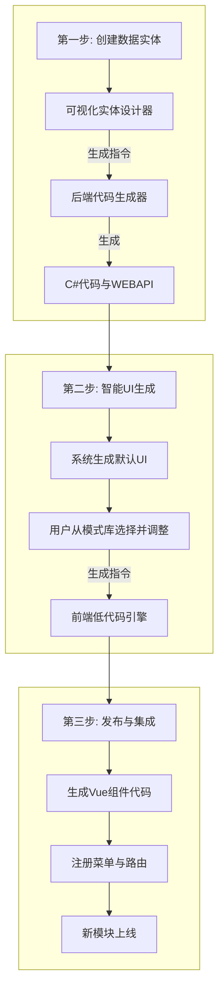

# 全栈低代码引擎全流程可视化优化方案

## 1. 核心问题与愿景

### 1.1 当前的困境

我们现有的“模块向导”本质上是一个**静态的、与后端逻辑脱节的表单**。这个模式存在三大根本性缺陷：

1. **与现实脱节**：用户需要手动输入实体名称、字段名和类型，极易因拼写错误或类型不匹配导致生成的前后端代码无法对接，产生运行时错误。
2. **不直观**：用户在构建过程中无法预览最终的UI形态，如同在“盲盒”中设计功能，体验不佳。
3. **功能孱弱**：仅能支持最基础的单表CRUD（增删改查），无法处理真实业务中常见的实体关系（如主从表）等复杂场景。

### 1.2 我们的愿景

为了解决以上问题，我们将彻底废弃“表单填写”模式，将模块向导重构为一个**智能的、可视化的、全栈一体的建模工具**。我们的目标是构建一个符合2025年业界主流标准的、真正高效的企业级低代码引擎。

---

## 2. 🧩 全新的一体化工作流 (三步走战略)

我们将创建一个无缝的、符合软件开发直觉的流水线，引导用户从一个想法开始，直到生成一个功能完整的、可立即交付的业务模块。

### **第一步：数据实体创建 (生成WEBAPI)**

这是整个流程的基石，解决了“**从无到有**”的核心问题。用户不再需要预先存在的后端服务，而是可以直接在平台中定义全新的业务实体。

* **目标**：让用户通过可视化界面定义全新的数据实体结构，并据此一键生成后端的C#实体类、数据库上下文、以及完整的CRUD WebAPI。
* **实施方案**：
  1. **构建“可视化实体设计器”**：我们将提供一个类似于Navicat或phpMyAdmin建表工具的图形化界面。
  2. **用户体验**：
     * 用户输入实体名称（如 `Project`）。
     * 通过交互式表格，逐个添加字段：点击“添加字段”，输入 `字段名`（如 `Name`），从下拉框选择 `数据类型`（如 `string`），并勾选 `是否必填`、`是否在列表显示`等元数据。
     * 界面右侧将实时预览生成的实体JSON结构，既满足了结构化定义的需求，又避免了用户手写出错的风险。
  3. **后端生成**：用户点击“生成API”后，前端将收集到的实体结构信息，组装成后端生成器所需的 `EntityDefinitionDto` 对象，并调用 `CodeGenerationAppService` API。我们强大的 **Roslyn代码生成引擎** 将自动完成所有后端工作。

### **第二步：智能UI生成与调整 (核心体验)**

这是提升用户体验、降低设计门槛的关键，解决了“**从有到优**”的问题。

* **目标**：系统基于第一步创建的实体，自动生成一个高质量的默认UI，并允许用户在此基础上进行可视化调整。
* **实施方案**：
  1. **智能生成默认UI**：API生成成功后，系统会自动进入UI设计界面。用户看到的**不是一个空白画布**，而是一个功能完备的默认页面，包括：
     * **搜索区**：已根据字段类型智能生成了文本框、日期范围选择器等。
     * **表格区**：已列出实体的主要字段。
     * **操作栏**：已包含“新增”、“编辑”、“删除”等标准按钮。
     * **表单/模态框**：已生成包含所有字段的创建/编辑表单。
  2. **可视化调整与UI模式库**：
     * 在界面侧边栏，我们将提供一个**“UI模式库”**，包含“主从表”、“看板视图”、“卡片列表”、“日历视图”等多种高质量的预设模板。
     * 用户可以一键切换UI模式。例如，选择“主从表”模式，系统会引导用户选择或创建另一个实体作为“从”表，并自动完成布局。
     * 用户可以在画布上直接拖拽调整组件布局、修改标签、配置校验规则等。

### **第三步：发布与集成**

这是工作流的最后一步，负责将设计成果转化为实际可用的功能。

* **目标**：将最终的UI设计固化，生成前端代码，并无缝集成到当前应用中。
* **实施方案**：
  1. 用户点击“发布”按钮。
  2. 前端低代码引擎根据最终的UI模型，生成 `Vue组件`、`Pinia Store`和 `路由`代码。
  3. 系统自动调用菜单管理接口，将新模块注册到主菜单中。
  4. 通过热更新（HMR），用户无需刷新页面，即可在菜单中看到并立即访问这个全新的功能模块。

---

## 3. 🔄 完整的工作流闭环

这个三步走流程形成了一个完美的闭环，并且能够灵活应对所有业务场景。

### **统一所有场景**

这个新流程不仅支持“从零创建”，也能完美兼容我们之前讨论的“连接现有后端”的场景。我们将在流程的入口处为用户提供一个清晰的选择：

* **选项A：“创建新实体”** -> 进入上述完整的三步走流程。
* **选项B：“连接现有API”** -> 用户提供OpenAPI地址，系统拉取已有实体列表，然后直接从**第二步（智能UI生成）**开始，基于已有的API快速构建用户界面。

---

## 4. ✅ 结论

这个“三步走”的全新方案，将我们的低代码平台从一个简单的辅助工具，提升为一个真正完整、强大且用户友好的**全栈应用构建平台**。它逻辑严谨、流程闭环，并且最大化地复用了我们强大的后端代码生成能力。

这是我们未来开发工作的核心指导蓝图。
