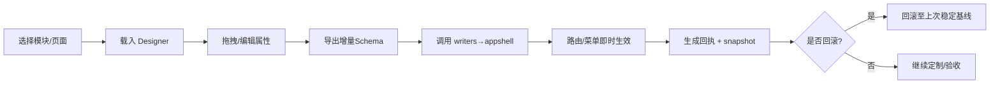

# P2 阶段详细开发计划 — 可视化设计器（Visual Designer）

> 参考基线：ADR-0015 可视化设计器架构；`.cursor/rules/lowcode-engine-rules.mdc` P2细化；`.cursor/rules/project-development-rules.mdc` P2 工作流；`doc/3、p2阶段的开发.md`

## 一、顶层结论（金字塔顶端）
- 目标：以 Schema 为唯一真实来源，交付“可预览拖拽可视化”的独立模块，支持“生成前定制”和“生成后定制”，实现 Schema↔代码双向与增量再生成闭环。
- 契约来源：P2 阶段后端契约仅通过现有 Swagger/OpenAPI 获取；设计器只生成“调用这些接口的前端代码”，绝不生成后端接口（后端生成仍属 P1 职责）。
- 成功指标：预览渲染 ≤ 100ms、60fps；协作延迟 < 50ms；增量生成即时生效并产出回执与可回滚快照；质量门（lint/type/test/build、CI漂移检测、Danger回执校验）全部通过。
- 范围：仅限 Designer 模块与闭环；生成物继续通过 appshell 注入（禁止直接修改 *.generated.ts）；生产禁用动态执行，预览强制沙箱（iframe/Worker + 严格 CSP）。

## 二、为什么（第一性原则与权衡）
- 一致性：以 Schema/overrides 驱动，避免 Designer 与代码分叉；生成后定制走“回读增量Schema→再生成”。
- 安全性：在受控沙箱中预览，生产禁用动态执行，所有跨上下文通信受控。
- 可回滚：每次生成形成 snapshot 与变更回执，支持回滚与审计；纳入 CI 与 PR 守卫。

## 三、范围界定（In/Out of Scope）
- In：
  - Designer 独立路由与 UI 框架（Canvas/Palette/Inspector/Sandbox/Code Preview）
  - Schema↔代码双向（回读增量、导出增量、再生成）
  - appshell 聚合链复用（router/store/lifecycle/policies/menu）
  - 回执清单（routes/menu/policies/files）与 snapshot（回滚）
  - 性能/可观测埋点、质量门接入（CI漂移、Danger回执）
- Out（P2不含）：
  - 跨端代码生成（P3议题）
  - 大规模协同（>50协作者）与离线冲突解决的复杂场景优化
  - 深度 AI Copilot 交互（保留入口，P2.2增强）

## 四、里程碑与交付（核心路径）
- M1 基线框架（Designer Shell + 路由入口 + 沙箱预览）
  - 交付：`/CodeGen/visual-designer` 路由，基础布局（Canvas/Palette/Inspector 占位），Sandbox 可加载指定模块页面进行只读预览
  - 验收：路由可访问；选择模块后可载入页面至沙箱；质量门绿
- M2 Canvas/Drag 引擎与属性面板（最小可用）
  - 交付：拖拽放置、选中、删除、基础布局（栅格/栈式），Inspector 可编辑核心属性（文本、校验、显隐、布局）
  - 验收：基本组件（表单/表格/按钮/输入）可拖拽、保存与回显；预览热替换
- M3 Schema 桥接与增量导出
  - 交付：
    - 设计并落地 DesignerOverrideSchema（增量Schema）：描述“在原始模板的哪个位置，添加/删除了哪些组件、修改了哪些属性/校验/事件绑定”。
    - 导出增量Schema → 调用既有 writers → appshell 更新；不生成后端接口，仅生成对 OpenAPI 客户端/HTTP 封装的调用代码。
    - 在生成的 *.vue 中注入稳定锚点（Block 标记/数据属性）以支持回读。
  - 验收：
    - 保存后菜单/路由即时更新，产出回执与 snapshot；回滚成功。
    - DesignerOverrideSchema 通过校验（版本/兼容/锚点有效性）。
- M4 生成后回读与再生成
  - 交付：
    - 实现 SchemaReader：从已生成 *.vue 文件解析 UI 结构 → 反向生成 DesignerOverrideSchema；
    - 实现 MergeEngine：支持多次编辑时合并多个 override 文件（基于 baseline snapshot 的三方合并，稳定锚点优先，冲突清单可视化）。
    - 再导出合并后的增量Schema → 增量再生成。
  - 验收：
    - Round-trip 稳定：连续 3 次“编辑→保存→回读→再生成”结果一致且无漂移。
    - 冲突处理：存在并发修改时给出明确冲突清单并支持选择性合并。
- M5 可观测与质量门闭环
  - 交付：时延、错误、吞吐、内存埋点；CI 漂移检测、Danger 回执校验、E2E 最小用例
  - 验收：质量门全绿；PR 必含回执清单
- M6 体验与治理增强（P2.1）
  - 交付：常见组件属性模板、撤销/重做、快捷键、设计系统 Token 调色板、只读权限视角
  - 验收：使用指南与金路径示例齐备；基线测试通过

## 五、架构与模块划分（高层）
- Designer Shell：路由、状态、命令面板、工具栏、快捷键
- Canvas/Drag Engine：拖拽、选中、对齐辅助线、布局（Grid/Flex）、撤销/重做
- Palette（组件面板）：合规组件库（表单、表格、按钮、输入、布局容器）
- Inspector（属性面板）：属性、校验、数据绑定、事件（查询/提交/跳转）
- Sandbox Preview：iframe/Worker + 严格 CSP；热替换预览；受控通信
- Schema Bridge：Designer State ↔ Module/Page/Component/Event Schema；增量合并（DesignerOverrideSchema/SchemaReader/MergeEngine）。
- Codegen Orchestrator：导出增量Schema→调用 writers→appshell 更新→回执；OpenAPI 客户端只作为消费端（不生成后端接口）。
- Diff/Snapshot Manager：生成 diff 与快照；提供回滚 API 与 UI 按钮
- Observability：时延/错误/吞吐/内存指标；日志与链路追踪

## 六、关键流程（示意）

## 七、质量门与基线（强制）
- 本地：`npm run type-check && npm run lint --fix && npm run test:coverage && npm run build`
- CI：同本地 + OpenAPI 漂移检测 + Danger 回执与禁止直接改写 *.generated 校验
- 合同一致性：
  - 仅消费 Swagger/OpenAPI（/swagger/v1/swagger.json）；禁止在 P2 生成任何后端接口。
  - 对 API 调用层进行契约漂移检测（CI），前端调用代码与 DTO 类型一致。
- 指标：
  - 预览渲染 ≤ 100ms；60fps；协作 < 50ms；并发协作者 ≤ 50
  - 生成链整体成功率 ≥ 99%；回滚100%可用；覆盖率 ≥ 80%

## 八、依赖与对齐
- 规则与ADR：ADR-0015、`.cursor/rules/lowcode-engine-rules.mdc`、`.cursor/rules/project-development-rules.mdc`
- 生成链：沿用 P0/P1 的 writers 与 appshell 注入机制
- 权限与设计系统：权限点与策略同名；样式使用设计系统 Token；Palette 屏蔽不合规属性

## 九、风险与缓解
- 契约一致性风险：后端变更导致前端失配 → 通过 OpenAPI 漂移检测、调用层集中封装与类型生成防止失配。
- 回读复杂度风险：从 *.vue 回读结构易受格式/重构影响 → 通过稳定锚点（Block 标记/数据属性）+ AST 解析（而非正则）提升稳健性。
- 合并冲突风险：重复编辑叠加 → 基于 baseline snapshot 的三方合并；标注冲突并支持用户决策；保持幂等与可回滚。

## 十、验收清单（Checklist）
- [ ] `/CodeGen/visual-designer` 可用，能载入并预览指定页面
- [ ] 拖拽、属性编辑、删除、撤销/重做可用
- [ ] 导出增量Schema→生成→appshell 注入成功；菜单/路由即时更新
- [ ] 生成回执（routes/menu/policies/files）与 snapshot 可见；可一键回滚
- [ ] 质量门与CI守卫绿；PR 必含回执清单；禁止直改 *.generated.ts
- [ ] 性能/协作指标达标；埋点数据可查询

## 十一、时间与资源（建议节奏）
- 周1：M1 基线 + M2 Canvas/Inspector（核心）
- 周2：M3 增量导出 + M4 回读与再生成（闭环）
- 周3：M5 质量门与可观测 + 金路径示例/基线测试
- 周4：M6 体验治理（P2.1）与文档发布

---
**交付提醒**：本计划为实施蓝图，严禁跳过里程碑与质量门；任何偏离必须提 ADR 变更说明并更新规则镜像。
