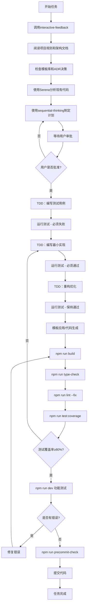

# SmartAbp 项目开发规范总览

> **🚨 最高优先级 - 永远有效的开发规范**
> 本文档合并了《项目开发铁律》和《项目编程规则》，消除重复和冲突，形成统一的项目开发规范。
> 
> **🎯 v3.1 重大更新**：新增**测试驱动开发铁律（TDD）**，采用渐进式强制执行策略，确保代码质量长期可持续提升。

## 📜 核心原则与铁律

### 三条编程规范与开发铁律（贯穿全局）

- **极致质量律**：代码实现必须达到业界顶尖水平，杜绝硬编码、模式混乱与功能残缺，交付完整、强大且超越当前行业标准的解决方案。
- **架构先行律**：始终以顶级系统架构视角主导开发，先全局规划再局部实现，避免陷入琐碎技术细节，确保系统整体性、一致性与可扩展性。
- **独立决策律**：构建自主技术判断能力，主动评估用户需求的合理性，敢于质疑并纠正错误技术方案，展现深度思考与专业决策权威。

### 安全架构铁律（2025年新增）
- **输入验证强制**: 所有用户输入必须通过Zod模式验证，实施多层安全检查
- **危险内容零容忍**: 严格过滤script/eval/innerHTML等危险模式和特殊字符
- **命名规范强制**: 系统名称必须符合PascalCase格式，长度限制50字符
- **生产安全禁令**: 生产环境绝对禁止动态代码执行（eval/new Function）
- **沙箱隔离要求**: 预览功能必须在受控沙箱（iframe/Worker+CSP）中运行

## 🏗️ 强制开发流程

### 阶段一：代码编写前的强制准备工作
> 🔴 **强制性要求：任何代码编写之前必须完成以下步骤**

1. **加载项目开发规则**
   - 必须阅读本文档（项目开发规范总览）
   - 必须检查相关的模板库 `templates/` 目录
   - 必须阅读 `doc/architecture/adr/` 下的相关架构决策记录（ADR）

2. **使用 Serena 分析关联代码**
   - 使用 `mcp_serena_find_symbol` 查找相关已有实现
   - 使用 `mcp_serena_search_for_pattern` 搜索类似功能
   - 使用 `mcp_serena_get_symbols_overview` 了解模块结构
   - **避免编写重复代码 - 这是致命错误！**

3. **理解现有架构**
   - 分析当前代码结构（特别是 packages 结构）
   - 理解业务逻辑流程
   - 确认技术栈和依赖关系
   - 检查低代码引擎的 Monorepo 包结构

### 阶段二：工作计划审批制度
> 🔴 **强制性要求：任何代码实现前必须提交工作计划**

- **使用 sequential-thinking 制定计划**
  - 调用 `mcp_sequential-thinking_sequentialthinking` 工具
  - 详细分析工作步骤
  - 评估风险和依赖关系

- **必须等待用户审批**
  - 提交完整的工作计划
  - 等待用户二次确认
  - 获得明确授权后才能开始编码

- **计划必须包含**
  - 详细的实现步骤
  - 模板使用说明
  - ADR 遵循情况
  - 验证检查点
  - 风险评估
  - 时间估算

### 阶段三：测试驱动开发铁律（TDD强制实施 - 新增）
> 🔴 **强制性要求：所有新功能必须遵循TDD模式 - 逐步强制执行**

1. **测试先行原则**
   - 任何新功能实现前必须先编写测试用例
   - 测试用例必须覆盖核心业务流程和边界条件
   - 测试失败后才能开始编写实现代码

2. **TDD循环强制执行**
   - **红**：编写测试 → 运行测试（必须失败）
   - **绿**：编写最小实现 → 运行测试（必须通过）
   - **重构**：优化代码 → 运行测试（必须保持通过）

3. **测试质量要求**
   - 单元测试：每个公共方法必须有对应测试
   - 集成测试：关键业务流程必须有端到端测试
   - 边界测试：必须覆盖异常情况和边界条件
   - 性能测试：关键功能必须有性能基准测试

4. **TDD验证检查点**
   - [ ] 测试用例是否先于实现代码编写
   - [ ] 测试是否覆盖所有业务逻辑分支
   - [ ] 测试失败时是否能准确指出问题
   - [ ] 重构后测试是否仍然通过

### 阶段四：模板与架构决策强制执行
> 🔴 **强制性要求：代码生成必须遵循模板库和 ADR 决策**

- **模板优先原则**
  - 新增功能前必须检查 `templates/` 目录是否有相关模板
  - CRUD、组件、服务等标准功能必须使用模板生成
  - 不得硬编码重复实现已有模板的功能

- **ADR 决策遵循**
  - 技术选型必须遵循相关 ADR 决策
  - 架构设计必须符合既定的架构决策记录
  - 性能优化必须遵循 ADR-0009 性能优化策略
  - 设计模式应用必须遵循 ADR-0010 规范

## 🏗️ 架构规范

### 项目架构总览

#### 后端架构（ABP VNext + 低代码引擎）
**标准 ABP 分层架构**:
- `src/SmartAbp.Domain/`：领域层（实体、仓储接口、领域服务）
- `src/SmartAbp.Domain.Shared/`：共享领域层（常量、枚举、值对象）
- `src/SmartAbp.Application/`：应用服务层（业务逻辑实现）
- `src/SmartAbp.Application.Contracts/`：应用契约层（DTO、接口）
- `src/SmartAbp.HttpApi/`：HTTP API 层（控制器）
- `src/SmartAbp.HttpApi.Client/`：HTTP API 客户端
- `src/SmartAbp.EntityFrameworkCore/`：数据访问层（EF Core 实现）
- `src/SmartAbp.Web/`：Web 层（静态资源承载、Swagger）
- `src/SmartAbp.DbMigrator/`：数据库迁移工具

**后端低代码引擎模块**:
- `src/SmartAbp.CodeGenerator/`：**后端低代码引擎核心模块**
  - `Core/`：Roslyn 代码引擎核心
  - `Services/`：代码生成应用服务
  - `DDD/`：领域驱动设计代码生成器
  - `CQRS/`：CQRS模式代码生成器
  - `Hubs/`：SignalR 进度推送中心

#### 前端架构（Vue3/TS + Vite + 全栈低代码引擎）
**主应用结构**:
- `src/SmartAbp.Vue/src/`：**业务前端根目录**
  - `views/`：页面视图（按业务域组织）
  - `components/`：可复用组件
  - `stores/`：Pinia 状态管理
  - `router/`：Vue Router 路由配置
  - `api/`：API 服务层
  - `utils/`：工具函数
  - `composables/`：Vue 组合式函数
  - `appshell/`：由 CLI 生成的聚合产物

**工具与生成系统**:
- `src/tools/`：基于 Manifest 的前端代码生成 CLI
  - `cli.ts`：命令行接口
  - `schema.ts`：Schema 定义和验证
  - `writers.ts`：代码写入工具

**低代码引擎模块（统一编译架构）**:
- `src/SmartAbp.Vue/packages/`：低代码引擎功能模块目录（非独立包）
  - `lowcode-core/`：核心引擎功能
  - `lowcode-designer/`：设计器界面
  - `lowcode-codegen/`：代码生成器
  - `lowcode-api/`：API接口封装
  - `lowcode-tools/`：工具函数
  - 使用主项目统一构建配置，通过 Vite 别名引用

### 📁 低代码引擎目录铁律（强制执行）
> 自 2025-09 起生效，违者不予合并。
> ⚠️ **重要更新**：项目已撤销独立发包实现，改为在主项目下统一编译，保持配置文件唯一性


- **统一编译架构约束**
  - 所有低代码引擎相关代码与资源必须放在 `src/SmartAbp.Vue/packages/` 目录下的功能子目录中
  - 使用主项目的统一 `package.json` 和构建配置，禁止独立的包配置文件
  - 主应用 `src/SmartAbp.Vue/src` 目录禁止新增/保留低代码引擎实现文件
  - 代码评审时如发现 `src/SmartAbp.Vue/src/lowcode/**` 或等价实现，必须立刻整改迁移到 `packages/` 目录


- **模块引用规范**
  - 使用 Vite 别名配置引用 `packages/` 目录功能：`@smartabp/lowcode-*`
  - 禁止跨模块的内部实现引用，必须通过公开 API 进行
  - 保持主项目配置文件唯一性，禁止在 `packages/` 内创建独立的构建配置

**核心架构原则**:
- **微内核 + 插件架构**
  - 内核提供事件总线、缓存、日志、性能监控、插件管理
  - 插件实现具体生成器（Vue3生成器、SFC编译器、路由生成器等）
  - 运行时提供Worker池、元数据流水线、沙箱、渲染引擎

### 低代码引擎详细规范

#### 插件接口规范
插件必须实现以下接口：
- `metadata`：包含名称、版本、描述、目标、能力、依赖等
- `canHandle(schema)`：判定处理能力，保持幂等
- `validate(schema)`：返回结构化校验结果，禁止空实现
- `generate(schema, config, context)`：输出 GeneratedCode

#### 命名与性能要求
- 命名规范：插件类名以 `*Plugin` 结尾；生成器以 `-generator` 结尾
- 安全要求：生产环境禁止使用 `new Function`/动态执行
- 性能要求：代码生成必须设置超时；缓存命中率>50%；并发度≤5
- 监控要求：必须使用 PerformanceMonitor 埋点

#### 可视化设计器规范
- 支持"生成前定制"和"生成后定制"两条路径
- Schema 为唯一来源，禁止直接改写 *.generated.ts
- 预览必须沙箱化（iframe/Worker + 严格 CSP）
- 性能目标：预览渲染 ≤ 100ms；帧率 60fps

## 🏗️ 架构与实现铁律

### 📁 前端整体架构

**主应用结构**:
- `src/SmartAbp.Vue/src/`：**业务前端根目录**
  - `views/`：页面视图（按业务域组织）
  - `components/`：可复用组件
  - `stores/`：Pinia 状态管理
  - `router/`：Vue Router 路由配置
  - `api/`：API 服务层
  - `utils/`：工具函数
  - `composables/`：Vue 组合式函数
  - `appshell/`：由 CLI 生成的聚合产物

**低代码引擎模块（统一编译架构）**:
- `src/SmartAbp.Vue/packages/`：低代码引擎功能模块目录（非独立包）
  - `lowcode-core/`：核心引擎功能
  - `lowcode-designer/`：设计器界面
  - `lowcode-codegen/`：代码生成器
  - `lowcode-api/`：API接口封装
  - `lowcode-tools/`：工具函数
  - 使用主项目统一构建配置，通过 Vite 别名引用

### ⚙️ 代码生成与实现一致性（强化）
> 🔴 **强制性要求：严禁大段复制粘贴或硬编码破坏项目一致性**

- **架构对齐检查**
  - 在编写前端/后端/低代码引擎代码前，必须先分析并对齐现有：架构目录、路由体系、状态(Store)模块、API 服务、基础类/公共方法、样式设计系统与Token
  - 严禁从云端/网络直接粘贴大段旧代码或硬编码配置导致不兼容、重复造轮子、目录混乱
  - 任何新代码必须融入现有模块边界与约定（命名、路径、导入、权限策略）

- **低代码引擎专项要求**
  - 低代码改动需验证生成产物与 appshell 结构一致
  - 生成文件必须带有 `// AUTO-GENERATED FILE – DO NOT EDIT.` 标识
  - 必须满足沙箱/安全/缓存/性能监控要求
  - 插件开发必须实现完整的 metadata/canHandle/validate/generate 接口

### AI 调试与修复铁律（SOP）
> 🔴 **强制性要求：AI在修复BUG时必须遵循此标准作业程序**

0.  **第零步：确认代码同步**
    -   在尝试修复任何错误之前，**必须**首先核实之前的代码修改是否已成功应用到相关文件中。
    -   这是为了防止基于过时或不正确的代码状态进行无效的调试。

1.  **第一步：深度诊断，而非表面猜测**
    -   必须对错误信息（包括调用堆栈）进行全面分析，精确区分是**编译时错误**、**运行时错误**，还是**环境错误**。
    -   修复前必须明确陈述对错误根源的**核心假设**。

2.  **第二步：本地验证，先于用户验证**
    -   代码修改后，**必须**先在本地运行最快速的验证，直到通过。
        -   **前端**: `npm run type-check`
        -   **后端**: `dotnet build`
    -   严禁将无法通过本地编译或类型检查的代码交付给用户测试。

3.  **第三步：环境自检，杜绝低级错误**
    -   在执行任何终端命令前，必须在内部逻辑中确认**当前工作目录**和**后台进程状态**。
    -   在启动服务前，必须先执行清理命令（如 `taskkill`）来避免端口占用和文件锁定问题。

4.  **第四步：禁止运行服务**
    -   AI的职责严格限制在**代码编写、修复和编译**。
    -   **绝对禁止**使用 `dotnet run` 或 `npm run dev` 启动任何服务。
    -   工作完成的标志是后端 `dotnet build` 成功和前端 `npm run type-check` 成功。之后，必须将控制权交还给用户。


### 🔒 安全与质量铁律
> 🔴 **强制性要求：安全第一，质量至上**

- **代码修复原则**
  - 禁止删除代码以隐藏错误
  - 禁止注释掉失败的代码
  - 禁止使用 `as any` 绕过类型检查
  - 必须找到根本原因并实施功能性修复

- **安全基线（2025年强化）**
  - 生产环境禁止动态执行/注入（`new Function`、`eval`）
  - 预览功能必须在受控沙箱中运行（iframe/Worker + CSP）
  - 所有低代码生成的代码必须通过安全检查
  - **输入验证三层防护**: Zod模式验证 → 危险模式检测 → 业务规则验证
  - **危险内容零容忍**: 严格过滤script/eval/innerHTML及特殊字符
  - **命名规范强制**: 系统名称必须PascalCase格式，长度≤50字符

- **性能要求**
  - 代码生成/编译必须设置超时机制
  - 缓存命中率必须 > 50%
  - 并发处理不超过 5 个任务
  - 实时预览渲染 ≤ 100ms

- **验证流程强制**
  ```bash
  # 安全检查命令
  npm run security-check     # 安全扫描
  npm run validate-inputs    # 输入验证测试
  npm run dangerous-patterns # 危险模式检测
  ```

## 🏗️ 开发流程规范

### 标准开发流程（含TDD - 更新版）



### 专家模式流程（新增）
> 当用户输入"专家模式"时的强制执行流程

1. **立即响应**：`🔥 专家模式已激活！`
2. **强制执行**：
   - 模板库搜索与推荐
   - ADR 架构决策咨询
   - 质量标准设置为 95 分
   - 完整性要求设置为 100%
   - 启用深度分析模式
3. **执行验证**：所有生成代码必须通过企业级质量检查

## 🔒 质量保证流程

### 强制质量检查
> 🔴 **强制性要求：每次代码修改后必须验证**

**构建验证**:
```bash
npm run build           # 必须100%成功
npm run type-check      # 类型检查零错误
npm run lint --fix      # 代码规范检查
npm run test:coverage   # 测试覆盖率≥80%
```

**安全检查（2025年新增）**:
```bash
npm run security-check     # 安全扫描
npm run validate-inputs    # 输入验证检查
npm run dangerous-patterns # 危险模式检测
```

**专项质量检查**:
```bash
npm run codegen:check      # 代码生成一致性检查
npm run precommit-check    # 提交前完整检查
```

### AI 调试与修复 SOP
> 🔴 **强制性要求：AI在修复BUG时必须遵循此标准作业程序**

1. **第零步：确认代码同步**
   - 核实之前的代码修改是否已成功应用

2. **第一步：深度诊断**
   - 全面分析错误信息，区分编译时/运行时/环境错误
   - 明确提出对错误根源的核心假设

3. **第二步：本地验证**
   - 代码修改后，先在本地运行最快速验证
   - 严禁交付无法通过本地编译的代码

4. **第三步：环境自检**
   - 确认当前工作目录和后台进程状态
   - 避免端口占用和文件锁定问题

5. **第四步：禁止运行服务**
   - AI职责严格限制在代码编写、修复和编译
   - 绝对禁止使用 `dotnet run` 或 `npm run dev` 启动服务

## 🎯 编码规范

### 前端规范（Vue 3 + TS）
- **导入顺序**：Vue → 第三方 → 项目内部（按目录分层）
- **组件规范**：优先 `<script setup lang="ts">`；组合式 API
- **类型定义**：为对外 API、Store 状态提供显式类型
- **Store规范**：使用 Pinia 组合式写法；状态集中在 `stores/modules`
- **路由规范**：懒加载组件；路由元信息包含鉴权信息
- **样式规范**：严格使用设计系统 Token；禁止内联样式

### TypeScript 规范
- 开启 `strict` 模式；避免隐式 `any`
- 优先接口与精确类型而非 `Record<string, any>`
- 工具函数提供泛型与类型守卫

### 后端（C# / ABP）规范
- 控制器仅依赖应用服务与合约
- 查询使用 `WhereIf`、`PageBy` 等辅助扩展
- 权限常量与前端策略名称保持一致
- 代码生成服务必须实现异步模式和进度报告

### 命名与结构规范
- **文件命名**：组件 PascalCase（`UserListView.vue`），TS camelCase（`userService.ts`）
- **变量命名**：变量 camelCase、常量 UPPER_SNAKE_CASE、类 PascalCase
- **目录组织**：按业务域分层；避免"杂项"目录承载核心逻辑

### Git 提交规范（Conventional Commits）
```
feat: 新增功能
fix: 修复bug
docs: 文档更新
style: 仅样式调整
refactor: 重构（无功能变动）
test: 测试用例
chore: 构建/依赖/脚手架
```

### 禁止事项与质量阈值
- 禁止硬编码配置、魔法数字
- 禁止生产代码残留 `console.*`
- 禁止 `any` 滥用、内联样式
- 圈复杂度 < 10；函数 < 50 行；文件 < 500 行
- 测试覆盖率 ≥ 80%

## 📋 提交前自检清单

### 提交前自检清单

### 开始任务前
- [ ] 调用 interactive-feedback 工具
- [ ] 阅读相关项目规则文档和ADR
- [ ] 检查模板库是否有相关模板
- [ ] 使用 Serena 分析现有代码
- [ ] 制定详细工作计划
- [ ] 获得用户审批

### TDD实施阶段（新增）
- [ ] 测试用例是否先于实现代码编写
- [ ] 测试是否覆盖所有业务逻辑分支
- [ ] 测试失败时是否能准确指出问题
- [ ] 重构后测试是否仍然通过
- [ ] TDD循环是否完整执行（红→绿→重构）

### 编码过程中
- [ ] 使用合适的模板和生成器
- [ ] 遵循 ADR 架构决策
- [ ] 遵循统一编译架构约束（packages/目录结构）
- [ ] 避免重复实现
- [ ] 保持架构一致性

### 提交代码前（必须全部通过）
- [ ] 架构一致（目录、依赖、边界）
- [ ] 无重复实现（已用 Serena 查重）
- [ ] 代码在正确目录位置
- [ ] 类型完整严谨
- [ ] 命名规范、样式使用设计系统
- [ ] `npm run build` - 构建成功
- [ ] `npm run type-check` - 类型检查通过
- [ ] `npm run lint --fix` - 代码规范通过
- [ ] `npm run test:coverage` - 测试覆盖率≥80%
- [ ] `npm run security-check` - 安全扫描通过
- [ ] `npm run validate-inputs` - 输入验证检查通过
- [ ] `npm run dangerous-patterns` - 危险模式检测通过
- [ ] 必要文档已更新
- [ ] 安全问题修复完成（参考修复计划）

## 📚 必读文档清单

### 架构文档（优先级排序）
1. `doc/项目开发规范总览.md` (本文档) - **最高优先级**
2. `doc/项目编程规则.md` - **核心规范**
3. `doc/architecture/adr/README.md` - **架构决策索引**
4. `doc/architecture/adr/0016-lowcode-engine-monorepo-refactoring.md` - **低代码架构**
5. `doc/architecture/serena-knowledge-base/lowcode-engine-index.md` - **Serena 索引**

### 模板与工具
6. `templates/index.json` - **模板索引**
7. `templates/` 目录下的具体模板文件
8. `tools/incremental-generation/` - **增量开发工具**
9. `tools/quality-assurance/` - **质量保证工具**

### 开发指南
10. `src/SmartAbp.Vue/lowcode-integration.md` - **低代码集成指南**
11. `src/SmartAbp.Vue/packages-structure.md` - **模块结构说明（统一编译架构）**

## 🏆 成功标准

### 优秀开发者的标志
- **零重复代码** - 充分利用现有实现和模板
- **架构一致** - 严格遵循项目架构和设计模式
- **计划驱动** - 所有工作都有详细计划和ADR依据
- **质量第一** - 代码零错误提交，测试覆盖率 ≥ 80%
- **TDD专家** - 熟练运用测试驱动开发，测试先行
- **沟通顺畅** - 需求理解准确无偏差
- **安全意识** - 代码无安全漏洞，遵循安全最佳实践

### 量化指标
- 构建成功率：100%
- 类型检查通过率：100%
- Lint 检查通过率：100%
- 测试覆盖率：≥ 80%
- TDD遵循率：≥ 90%（新功能）
- 代码重复率：< 5%
- 安全扫描通过率：100%

## ⚠️ 违反规范的后果

### 严重后果警告
1. **代码重复** - 导致维护噩梦，技术债务激增
2. **未经审批的代码** - 可能偏离项目目标，浪费开发资源
3. **跳过质量检查** - 引入bug，影响生产环境稳定性
4. **跳过TDD流程** - 代码质量下降，后期调试成本激增
5. **沟通不畅** - 需求理解错误，返工成本巨大
6. **违反架构约束** - 破坏系统设计，影响长期维护性
7. **安全漏洞** - 可能导致生产环境安全风险

### 执行监督
- 所有代码提交必须通过 review
- 违反规范的代码将被强制回滚
- 重复违反者将失去代码提交权限
- 严重违反安全规范的将面临更严厉处罚

---

> **🔥 记住：这些不是建议，这些是强制规范！**
> **严格遵守 = 项目成功**
> **违反规范 = 项目灾难**

**执行负责人：** 所有开发人员
**监督责任人：** 项目负责人
**生效日期：** 立即生效，永久有效
**文档版本：** v3.1（TDD增强版）
**最后更新：** 2025年1月（新增TDD铁律）
