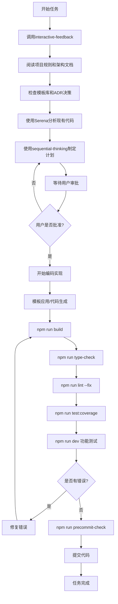

# SmartAbp 项目开发铁律

> **🚨 最高优先级 - 永远有效的开发规范**  
> 本文档为项目开发的核心铁律，所有开发人员必须严格遵守，任何时候都不得违反。

## 📜 核心原则

### ⚡ 开发铁律五大核心

#### 1. **代码编写前的强制准备工作**
> 🔴 **强制性要求：任何代码编写之前必须完成以下步骤**

- **加载项目开发规则**
  - 必须阅读本铁律文档
  - 必须阅读 `doc/项目编程规则.md`（包含最新架构与低代码引擎规范）
  - 必须阅读 `doc/architecture/adr/` 下的相关架构决策记录（ADR）
  - 必须检查相关的模板库 `templates/` 目录

- **使用 Serena 分析关联代码**
  - 使用 `mcp_serena_find_symbol` 查找相关已有实现
  - 使用 `mcp_serena_search_for_pattern` 搜索类似功能
  - 使用 `mcp_serena_get_symbols_overview` 了解模块结构
  - **避免编写重复代码 - 这是致命错误！**

- **理解现有架构**
  - 分析当前代码结构（特别是 packages 结构）
  - 理解业务逻辑流程
  - 确认技术栈和依赖关系
  - 检查低代码引擎的 Monorepo 包结构

#### 2. **模板与架构决策强制执行**
> 🔴 **强制性要求：代码生成必须遵循模板库和 ADR 决策**

- **模板优先原则**
  - 新增功能前必须检查 `templates/` 目录是否有相关模板
  - CRUD、组件、服务等标准功能必须使用模板生成
  - 不得硬编码重复实现已有模板的功能

- **ADR 决策遵循**
  - 技术选型必须遵循相关 ADR 决策
  - 架构设计必须符合既定的架构决策记录
  - 性能优化必须遵循 ADR-0009 性能优化策略
  - 设计模式应用必须遵循 ADR-0010 规范

#### 3. **工作计划审批制度**
> 🔴 **强制性要求：任何代码实现前必须提交工作计划**

- **使用 sequential-thinking 制定计划**
  - 调用 `mcp_sequential-thinking_sequentialthinking` 工具
  - 详细分析工作步骤
  - 评估风险和依赖关系

- **必须等待用户审批**
  - 提交完整的工作计划
  - 等待用户二次确认
  - 获得明确授权后才能开始编码

- **计划必须包含**
  - 详细的实现步骤
  - 模板使用说明
  - ADR 遵循情况
  - 验证检查点
  - 风险评估
  - 时间估算

#### 4. **质量保证流程**
> 🔴 **强制性要求：每次代码修改后必须验证**

- **构建验证**
  ```bash
  npm run build
  ```

- **类型检查**
  ```bash
  npm run type-check
  ```

- **代码规范检查**
  ```bash
  npm run lint --fix
  ```

- **功能测试**
  ```bash
  npm run dev  # 手动验证功能，端口 11369
  ```

- **专项检查（新增）**
  ```bash
  npm run codegen:check      # 代码生成一致性检查
  npm run test:coverage      # 测试覆盖率检查
  npm run precommit-check    # 提交前完整检查
  ```

- **错误零容忍**
  - 任何构建错误必须立即修复
  - 任何类型错误必须立即修复
  - 任何 lint 错误必须立即修复
  - 任何测试失败必须立即修复
  - 没有任何错误后才能进行下一步工作

#### 5. **沟通增强机制**
> 🔴 **强制性要求：每次交互开始必须增强沟通**

- **调用 interactive-feedback 工具**
  ```typescript
  mcp_interactive-feedback-mcp_interactive_feedback({
    project_directory: "D:\\BAOBAB\\Baobab.SmartAbp",
    summary: "工作内容简要描述"
  })
  ```

- **目的**
  - 避免需求理解偏差
  - 确认功能实现方向
  - 增强开发者与用户的沟通

## 🏗️ 架构与实现铁律

### 📁 低代码引擎目录铁律（强制执行）
> 自 2025-09 起生效，违者不予合并。

- **强制包结构约束**
  - 所有低代码引擎相关代码与资源必须放在 `src/SmartAbp.Vue/packages` 下的 `@smartabp/lowcode-*` 子包中
  - 主应用 `src/SmartAbp.Vue/src` 目录禁止新增/保留低代码引擎实现文件（仅可使用包导出的 API）
  - 代码评审时如发现 `src/SmartAbp.Vue/src/lowcode/**` 或等价实现，必须立刻整改迁移到对应包

- **包引用规范**
  - 使用 `@smartabp/lowcode-*` 别名引用包内功能
  - 禁止跨包的内部实现引用
  - 包间依赖必须通过公开 API 进行

### ⚙️ 代码生成与实现一致性（强化）
> 🔴 **强制性要求：严禁大段复制粘贴或硬编码破坏项目一致性**

- **架构对齐检查**
  - 在编写前端/后端/低代码引擎代码前，必须先分析并对齐现有：架构目录、路由体系、状态(Store)模块、API 服务、基础类/公共方法、样式设计系统与Token
  - 严禁从云端/网络直接粘贴大段旧代码或硬编码配置导致不兼容、重复造轮子、目录混乱
  - 任何新代码必须融入现有模块边界与约定（命名、路径、导入、权限策略）

- **低代码引擎专项要求**
  - 低代码改动需验证生成产物与 appshell 结构一致
  - 生成文件必须带有 `// AUTO-GENERATED FILE – DO NOT EDIT.` 标识
  - 必须满足沙箱/安全/缓存/性能监控要求
  - 插件开发必须实现完整的 metadata/canHandle/validate/generate 接口

### AI 调试与修复铁律（SOP）
> 🔴 **强制性要求：AI在修复BUG时必须遵循此标准作业程序**

0.  **第零步：确认代码同步**
    -   在尝试修复任何错误之前，**必须**首先核实之前的代码修改是否已成功应用到相关文件中。
    -   这是为了防止基于过时或不正确的代码状态进行无效的调试。

1.  **第一步：深度诊断，而非表面猜测**
    -   必须对错误信息（包括调用堆栈）进行全面分析，精确区分是**编译时错误**、**运行时错误**，还是**环境错误**。
    -   修复前必须明确陈述对错误根源的**核心假设**。

2.  **第二步：本地验证，先于用户验证**
    -   代码修改后，**必须**先在本地运行最快速的验证，直到通过。
        -   **前端**: `npm run type-check`
        -   **后端**: `dotnet build`
    -   严禁将无法通过本地编译或类型检查的代码交付给用户测试。

3.  **第三步：环境自检，杜绝低级错误**
    -   在执行任何终端命令前，必须在内部逻辑中确认**当前工作目录**和**后台进程状态**。
    -   在启动服务前，必须先执行清理命令（如 `taskkill`）来避免端口占用和文件锁定问题。

4.  **第四步：禁止运行服务**
    -   AI的职责严格限制在**代码编写、修复和编译**。
    -   **绝对禁止**使用 `dotnet run` 或 `npm run dev` 启动任何服务。
    -   工作完成的标志是后端 `dotnet build` 成功和前端 `npm run type-check` 成功。之后，必须将控制权交还给用户。


### 🔒 安全与质量铁律
> 🔴 **强制性要求：安全第一，质量至上**

- **代码修复原则**
  - 禁止删除代码以隐藏错误
  - 禁止注释掉失败的代码
  - 禁止使用 `as any` 绕过类型检查
  - 必须找到根本原因并实施功能性修复

- **安全基线**
  - 生产环境禁止动态执行/注入（`new Function`、`eval`）
  - 预览功能必须在受控沙箱中运行（iframe/Worker + CSP）
  - 所有低代码生成的代码必须通过安全检查

- **性能要求**
  - 代码生成/编译必须设置超时机制
  - 缓存命中率必须 > 50%
  - 并发处理不超过 5 个任务
  - 实时预览渲染 ≤ 100ms

## 🏗️ 开发流程规范

### 标准开发流程



### 专家模式流程（新增）
> 当用户输入"专家模式"时的强制执行流程

1. **立即响应**：`🔥 专家模式已激活！`
2. **强制执行**：
   - 模板库搜索与推荐
   - ADR 架构决策咨询
   - 质量标准设置为 95 分
   - 完整性要求设置为 100%
   - 启用深度分析模式
3. **执行验证**：所有生成代码必须通过企业级质量检查

## 📚 必读文档清单

### 架构文档（优先级排序）
1. `doc/项目开发铁律.md` (本文档) - **最高优先级**
2. `doc/项目编程规则.md` - **核心规范**
3. `doc/architecture/adr/README.md` - **架构决策索引**
4. `doc/architecture/adr/0016-lowcode-engine-monorepo-refactoring.md` - **低代码架构**
5. `doc/architecture/serena-knowledge-base/lowcode-engine-index.md` - **Serena 索引**

### 模板与工具
6. `templates/index.json` - **模板索引**
7. `templates/` 目录下的具体模板文件
8. `tools/incremental-generation/` - **增量开发工具**
9. `tools/quality-assurance/` - **质量保证工具**

### 开发指南
10. `src/SmartAbp.Vue/lowcode-integration.md` - **低代码集成指南**
11. `src/SmartAbp.Vue/packages-structure.md` - **包结构说明**

## ⚠️ 违反铁律的后果

### 严重后果警告
1. **代码重复** - 导致维护噩梦，技术债务激增
2. **未经审批的代码** - 可能偏离项目目标，浪费开发资源
3. **跳过质量检查** - 引入bug，影响生产环境稳定性
4. **沟通不畅** - 需求理解错误，返工成本巨大
5. **违反架构约束** - 破坏系统设计，影响长期维护性
6. **安全漏洞** - 可能导致生产环境安全风险

### 执行监督
- 所有代码提交必须通过 review
- 违反铁律的代码将被强制回滚
- 重复违反者将失去代码提交权限
- 严重违反安全规范的将面临更严厉处罚

## 🎯 成功标准

### 优秀开发者的标志
- **零重复代码** - 充分利用现有实现和模板
- **架构一致** - 严格遵循项目架构和设计模式
- **计划驱动** - 所有工作都有详细计划和ADR依据
- **质量第一** - 代码零错误提交，测试覆盖率 ≥ 80%
- **沟通顺畅** - 需求理解准确无偏差
- **安全意识** - 代码无安全漏洞，遵循安全最佳实践

### 量化指标
- 构建成功率：100%
- 类型检查通过率：100%
- Lint 检查通过率：100%
- 测试覆盖率：≥ 80%
- 代码重复率：< 5%
- 安全扫描通过率：100%

## 📝 版本历史

| 版本 | 日期 | 更新内容 | 作者 |
|------|------|----------|------|
| v1.0 | 2024-01-09 | 创建项目开发铁律 | AI Assistant |
| v2.0 | 2025-09-12 | 重大更新：低代码引擎架构、模板系统、ADR集成、专家模式 | AI Assistant |

---

> **🔥 记住：这些不是建议，这些是铁律！**  
> **严格遵守 = 项目成功**  
> **违反铁律 = 项目灾难**

**执行负责人：** 所有开发人员  
**监督责任人：** 项目负责人  
**生效日期：** 立即生效，永久有效

## 🎯 铁律执行检查清单

### 开始任务前
- [ ] 调用 interactive-feedback 工具
- [ ] 阅读相关项目规则文档
- [ ] 检查模板库和 ADR 决策
- [ ] 使用 Serena 分析现有代码
- [ ] 制定详细工作计划
- [ ] 获得用户审批

### 编码过程中
- [ ] 使用合适的模板
- [ ] 遵循 ADR 决策
- [ ] 遵循包结构约束
- [ ] 避免重复实现
- [ ] 保持架构一致性

### 提交代码前
- [ ] npm run build - 构建成功
- [ ] npm run type-check - 类型检查通过
- [ ] npm run lint --fix - 代码规范通过
- [ ] npm run test:coverage - 测试覆盖率达标
- [ ] npm run dev - 功能验证通过
- [ ] npm run precommit-check - 提交前检查通过

**只有完成所有检查项目，才允许提交代码！**