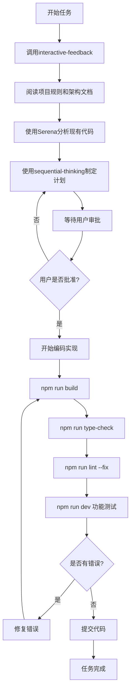

# SmartAbp 项目开发铁律

> **🚨 最高优先级 - 永远有效的开发规范**  
> 本文档为项目开发的核心铁律，所有开发人员必须严格遵守，任何时候都不得违反。

## 📜 核心原则

### ⚡ 开发铁律四大核心

#### 1. **代码编写前的强制准备工作**
> 🔴 **强制性要求：任何代码编写之前必须完成以下步骤**

- **加载项目开发规则**
  - 必须阅读本铁律文档
  - 必须阅读 `doc/architecture/` 下的架构设计文档
  - 必须阅读编码规范文档

- **使用Serena分析关联代码**
  - 使用 `mcp_serena_find_symbol` 查找相关已有实现
  - 使用 `mcp_serena_search_for_pattern` 搜索类似功能
  - 使用 `mcp_serena_get_symbols_overview` 了解模块结构
  - **避免编写重复代码 - 这是致命错误！**

- **理解现有架构**
  - 分析当前代码结构
  - 理解业务逻辑流程
  - 确认技术栈和依赖关系

#### 2. **工作计划审批制度**
> 🔴 **强制性要求：任何代码实现前必须提交工作计划**

- **使用sequential-thinking制定计划**
  - 调用 `mcp_sequential-thinking_sequentialthinking` 工具
  - 详细分析工作步骤
  - 评估风险和依赖关系

- **必须等待用户审批**
  - 提交完整的工作计划
  - 等待用户二次确认
  - 获得明确授权后才能开始编码

- **计划必须包含**
  - 详细的实现步骤
  - 验证检查点
  - 风险评估
  - 时间估算

#### 3. **质量保证流程**
> 🔴 **强制性要求：每次代码修改后必须验证**

- **构建验证**
  ```bash
  npm run build
  ```

- **类型检查**
  ```bash
  npm run type-check
  ```

- **代码规范检查**
  ```bash
  npm run lint --fix
  ```

- **功能测试**
  ```bash
  npm run dev  # 手动验证功能
  ```

- **错误零容忍**
  - 任何构建错误必须立即修复
  - 任何类型错误必须立即修复
  - 任何lint错误必须立即修复
  - 没有任何错误后才能进行下一步工作

#### 4. **沟通增强机制**
> 🔴 **强制性要求：每次交互开始必须增强沟通**

- **调用interactive-feedback工具**
  ```typescript
  mcp_interactive-feedback-mcp_interactive_feedback({
    project_directory: "D:\\BAOBAB\\Baobab.SmartAbp",
    summary: "工作内容简要描述"
  })
  ```

- **目的**
  - 避免需求理解偏差
  - 确认功能实现方向
  - 增强开发者与用户的沟通

## 🏗️ 开发流程规范

### 标准开发流程



## 📚 必读文档清单

### 架构文档
- `doc/architecture/系统架构说明书.md`
- `doc/architecture/前端架构优化建议.md`

### 开发规范
- `doc/项目开发铁律.md` (本文档)
- `doc/编码规范.md`

### 工作计划
- `doc/前端重构工作计划表9-7号.md`

## ⚠️ 违反铁律的后果

### 严重后果警告
1. **代码重复** - 导致维护噩梦，技术债务激增
2. **未经审批的代码** - 可能偏离项目目标，浪费开发资源
3. **跳过质量检查** - 引入bug，影响生产环境稳定性
4. **沟通不畅** - 需求理解错误，返工成本巨大

### 执行监督
- 所有代码提交必须通过review
- 违反铁律的代码将被强制回滚
- 重复违反者将失去代码提交权限

## 🎯 成功标准

### 优秀开发者的标志
- **零重复代码** - 充分利用现有实现
- **计划驱动** - 所有工作都有详细计划
- **质量第一** - 代码零错误提交
- **沟通顺畅** - 需求理解准确无偏差

## 📝 版本历史

| 版本 | 日期 | 更新内容 | 作者 |
|------|------|----------|------|
| v1.0 | 2024-01-09 | 创建项目开发铁律 | AI Assistant |

---

> **🔥 记住：这些不是建议，这些是铁律！**  
> **严格遵守 = 项目成功**  
> **违反铁律 = 项目灾难**

**执行负责人：** 所有开发人员  
**监督责任人：** 项目负责人  
**生效日期：** 立即生效，永久有效
