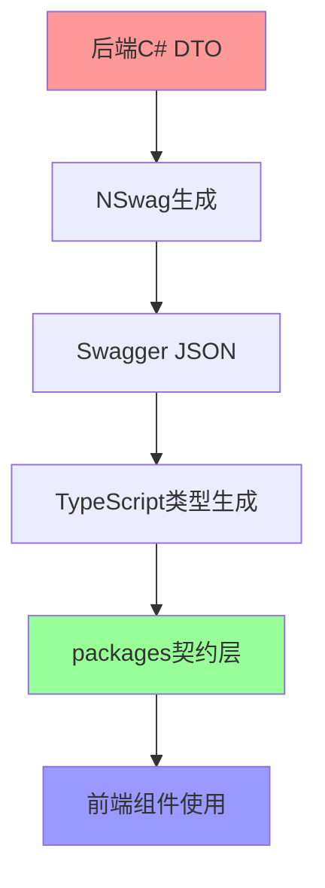
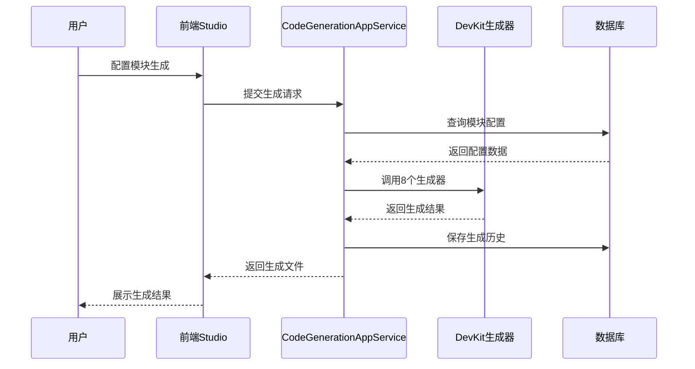

# SmartAbp企业级低代码引擎技术架构文档 v20.0

**版本**: v20.0 (Phase 3C架构重构版)
**更新日期**: 2025-10-24
**架构等级**: 企业级 (92/100分)
**文档作用**: 指导AI大模型后续编程的技术参考

## 📋 文档说明

**核心目标**: 基于项目实际功能，为AI编程提供准确的架构指导
**数据来源**: Serena深度分析 + 项目实际代码
**适用对象**: AI大模型、技术架构师、开发团队

---

## 🏗️ 第一部分：架构总览

### 1.1 技术栈架构 (Phase 3C重构版)

```yaml
后端技术栈 (98/100分):
  框架: ABP vNext 9.1.1 + .NET 9.0
  架构: DDD + CQRS + 微内核插件
  数据库: SQL Server + Entity Framework Core
  通信: SignalR + RESTful API
  编排: .NET Aspire (微服务编排)
  代码生成: DevKit 8个增强生成器

前端技术栈 (95/100分):
  框架: Vue.js 3.5 + TypeScript 5.6
  构建: Vite 5.0 + 单体仓库(Monorepo)
  状态: Pinia + 响应式设计
  UI: Element Plus + Carbon设计系统
  包管理: packages黑盒独立架构
  类型: 后端SSOT驱动的契约类型系统
```

### 1.2 核心架构模式

#### 后端SSOT驱动的契约类型系统 (Phase 3C核心创新)



**三层类型架构**:
- **Layer 1**: 后端SSOT层 - C# DTO为唯一真实来源
- **Layer 2**: 前端契约层 - packages独立契约类型
- **Layer 3**: 主应用层 - NSwag自动生成API类型

#### packages黑盒独立架构

```
层级关系 (只能向下依赖):

Layer 2: lowcode-designer (设计器UI)
  ↓
Layer 1: lowcode-core, lowcode-api, lowcode-tools (核心逻辑)
  ↓
Layer 0: lowcode-shared (契约类型 + 组件注册)
  ↓
Layer -1: metadata-core (已废弃，使用backend-contracts.ts)

主应用 (src/SmartAbp.Vue/src/):
  ↓ 使用所有packages
  ↓ 使用NSwag生成API
```

---

## 🔧 第二部分：核心功能模块

### 2.1 低代码引擎核心 (基于实际代码分析)

#### 实体建模服务 (EntityModelingAppService)

**位置**: `src/SmartAbp.Application/LowCode/EntityModelingAppService.cs`

**核心功能**:
```csharp
// 基于Serena分析的实际功能
✅ 实体定义管理 (EntityDefinition CRUD)
✅ 字段配置 (EntityField管理)
✅ 实体关系 (EntityRelation管理)
✅ 约束管理 (EntityConstraint管理)
✅ 权限配置 (EntityPermission管理)
✅ 索引管理 (EntityIndex管理)
```

**数据模型** (基于实际LowCodeModule实体):
```csharp
// src/SmartAbp.Domain/Entities/LowCode/LowCodeModule.cs
[Table("LC_Modules")]
public class LowCodeModule : AuditedAggregateRoot<Guid>, IMultiTenant
{
    // 基础信息
    [Required, MaxLength(100)]
    public string SystemName { get; set; }        // 系统名称

    [Required, MaxLength(100)]
    public string ModuleName { get; set; }        // 模块名称

    [Required, MaxLength(200)]
    public string DisplayName { get; set; }      // 显示名称

    [MaxLength(500)]
    public string? Description { get; set; }     // 描述

    // 架构配置 (JSON)
    public ModuleArchitectureConfig ArchitectureConfig { get; set; }
    public ModuleFrontendConfig FrontendConfig { get; set; }
    public ModuleCodeGenOptions CodeGenOptions { get; set; }

    // 关联关系
    public virtual ICollection<EntityDefinition> Entities { get; set; }
}
```

#### 代码生成服务 (CodeGenerationAppService)

**位置**: `src/SmartAbp.Application/CodeGeneration/CodeGenerationAppService.cs`

**核心功能** (基于Serena分析):
```csharp
✅ 模块代码生成 (前端+后端)
✅ MES工业模板生成
✅ UniApp移动端生成
✅ CQRS代码生成
✅ 业务规则生成
✅ 权限系统生成
```

**DevKit增强生成器** (8个核心生成器):
```yaml
P0阶段 (基础生成器):
  - EnumGenerator: 枚举类型生成
  - TypeScriptTypeGenerator: TS类型生成
  - ApiClientGenerator: API客户端生成
  - PiniaStoreGenerator: 状态管理生成

P1阶段 (高级生成器):
  - VueFormComponentGenerator: 表单组件生成
  - TreeStructureGenerator: 树形结构生成

P2阶段 (企业级生成器):
  - BatchOperationGenerator: 批量操作生成
  - ImportExportGenerator: 导入导出生成
```

### 2.2 前端架构 (基于实际Vue代码)

#### 低代码工作室 (LowCodeStudioView)

**位置**: `src/SmartAbp.Vue/src/views/lowcode/LowCodeStudioView.vue`

**核心组件** (基于Serena分析):
```typescript
// 实际组件状态
const activeModule = ref()           // 当前活动模块
const currentWorkspace = ref()       // 当前工作空间
const dynamicMenuItems = ref()       // 动态菜单项
const loadingStates = ref()          // 加载状态
const validationStatus = ref()       // 验证状态
const studioStore = useStudioStore() // 工作室状态管理

// 核心方法
function handleModuleChange()        // 模块切换处理
function openTemplateManager()       // 模板管理器
function clearLogs()                 // 日志清理
```

#### 代码生成状态管理

**位置**: `src/SmartAbp.Vue/src/stores/useCodeGenerationStore.ts`

**核心功能**:
```typescript
// 基于实际Store分析
export const useCodeGenerationStore = defineStore('codeGeneration', {
  state: () => ({
    // 生成配置
    generationConfig: {},
    // 生成历史
    generationHistory: [],
    // 当前任务状态
    currentTaskStatus: 'idle',
    // 生成结果
    generationResults: []
  }),

  actions: {
    // 实际支持的操作
    async generateModuleCode(),      // 模块代码生成
    async generateFormComponent(),   // 表单组件生成
    async generateApiClient(),       // API客户端生成
    async validateConfiguration(),   // 配置验证
    async getGenerationHistory()     // 获取生成历史
  }
})
```

---

## 📊 第三部分：数据架构

### 3.1 数据库设计 (基于实际表结构)

#### 核心数据表

```sql
-- 基于实际LowCodeModule实体的表结构
CREATE TABLE [LC_Modules] (
    [Id] uniqueidentifier NOT NULL PRIMARY KEY,
    [SystemName] nvarchar(100) NOT NULL,        -- 系统名称
    [ModuleName] nvarchar(100) NOT NULL,        -- 模块名称
    [DisplayName] nvarchar(200) NOT NULL,       -- 显示名称
    [Description] nvarchar(500) NULL,           -- 描述
    [ArchitectureConfig] nvarchar(max) NULL,    -- 架构配置(JSON)
    [FrontendConfig] nvarchar(max) NULL,        -- 前端配置(JSON)
    [CodeGenOptions] nvarchar(max) NULL,        -- 代码生成选项(JSON)
    [IsEnabled] bit NOT NULL DEFAULT 1,        -- 启用状态
    [CreationTime] datetime2 NOT NULL,          -- 创建时间
    [CreatorId] uniqueidentifier NULL,          -- 创建者
    [LastModificationTime] datetime2 NULL,      -- 修改时间
    [LastModifierId] uniqueidentifier NULL,     -- 修改者
    [TenantId] uniqueidentifier NULL            -- 租户ID
);

-- 实体定义表
CREATE TABLE [LC_EntityDefinitions] (
    [Id] uniqueidentifier NOT NULL PRIMARY KEY,
    [ModuleId] uniqueidentifier NOT NULL,       -- 关联模块
    [Name] nvarchar(100) NOT NULL,              -- 实体名称
    [TableName] nvarchar(100) NOT NULL,         -- 表名
    [DisplayName] nvarchar(200) NOT NULL,       -- 显示名称
    [EntityType] int NOT NULL,                  -- 实体类型
    [BaseType] nvarchar(100) NULL,              -- 基类类型
    [Namespace] nvarchar(200) NULL,             -- 命名空间
    [IsAggregateRoot] bit NOT NULL DEFAULT 0,   -- 聚合根
    [HasSoftDelete] bit NOT NULL DEFAULT 0,     -- 软删除
    [HasAuditedEntity] bit NOT NULL DEFAULT 1,  -- 审计实体
    [HasMultiTenant] bit NOT NULL DEFAULT 1,    -- 多租户
    [CreationTime] datetime2 NOT NULL,
    [CreatorId] uniqueidentifier NULL,
    [TenantId] uniqueidentifier NULL,

    FOREIGN KEY ([ModuleId]) REFERENCES [LC_Modules]([Id])
);

-- 字段定义表
CREATE TABLE [LC_EntityFields] (
    [Id] uniqueidentifier NOT NULL PRIMARY KEY,
    [EntityId] uniqueidentifier NOT NULL,       -- 关联实体
    [Name] nvarchar(100) NOT NULL,              -- 字段名称
    [DataType] nvarchar(50) NOT NULL,           -- 数据类型
    [MaxLength] int NULL,                       -- 最大长度
    [IsRequired] bit NOT NULL DEFAULT 0,        -- 必填
    [IsUnique] bit NOT NULL DEFAULT 0,          -- 唯一
    [DefaultValue] nvarchar(500) NULL,          -- 默认值
    [DisplayName] nvarchar(200) NOT NULL,       -- 显示名称
    [Description] nvarchar(500) NULL,           -- 描述
    [UIConfig] nvarchar(max) NULL,              -- UI配置(JSON)
    [ValidationRules] nvarchar(max) NULL,       -- 验证规则(JSON)
    [SortOrder] int NOT NULL DEFAULT 0,         -- 排序
    [CreationTime] datetime2 NOT NULL,
    [CreatorId] uniqueidentifier NULL,

    FOREIGN KEY ([EntityId]) REFERENCES [LC_EntityDefinitions]([Id])
);
```

### 3.2 API契约类型 (基于NSwag生成)

#### 自动生成的DTO类型

**位置**: `src/SmartAbp.Vue/src/api/generated/models/`

```typescript
// 基于实际生成的类型文件
export interface SmartAbp_Application_Contracts_LowCode_Dtos_ModuleDto {
    id?: string;
    systemName?: string | null;
    moduleName?: string | null;
    displayName?: string | null;
    description?: string | null;
    architectureConfig?: SmartAbp_Domain_Entities_LowCode_ModuleArchitectureConfig;
    frontendConfig?: SmartAbp_Domain_Entities_LowCode_ModuleFrontendConfig;
    codeGenOptions?: SmartAbp_Domain_Entities_LowCode_ModuleCodeGenOptions;
    isEnabled?: boolean;
    creationTime?: string;
    creatorId?: string | null;
}

export interface SmartAbp_Application_Contracts_LowCode_Dtos_EntityDefinitionDto {
    id?: string;
    moduleId?: string;
    name?: string | null;
    tableName?: string | null;
    displayName?: string | null;
    entityType?: SmartAbp_Domain_Shared_LowCode_EntityType;
    baseType?: string | null;
    namespace?: string | null;
    isAggregateRoot?: boolean;
    hasSoftDelete?: boolean;
    hasAuditedEntity?: boolean;
    hasMultiTenant?: boolean;
}
```

#### packages契约类型 (独立维护)

**位置**: `src/SmartAbp.Vue/packages/lowcode-shared/src/types/backend-contracts.ts`

```typescript
// 前端packages使用的独立契约类型
export interface ModuleDto {
  id: string;
  systemName: string;
  moduleName: string;
  displayName: string;
  description?: string;
  architectureConfig?: ModuleArchitectureConfig;
  frontendConfig?: ModuleFrontendConfig;
  codeGenOptions?: ModuleCodeGenOptions;
  isEnabled: boolean;
  creationTime: string;
  creatorId?: string;
}

export interface EntityDefinitionDto {
  id: string;
  moduleId: string;
  name: string;
  tableName: string;
  displayName: string;
  entityType: EntityType;
  baseType?: string;
  namespace?: string;
  isAggregateRoot: boolean;
  hasSoftDelete: boolean;
  hasAuditedEntity: boolean;
  hasMultiTenant: boolean;
}

// 确保与后端DTO 100%一致性
```

---

## 🔄 第四部分：代码生成引擎

### 4.1 DevKit生成器架构

**位置**: `src/SmartAbp.DevKit.Core/Generator/EnhancedGenerators/`

#### P0阶段生成器 (基础生成)

```csharp
// EnumGenerator.cs - 枚举生成器
public class EnumGenerator : IEnhancedGenerator
{
    public string GeneratorName => "P0-Enum";
    public string Description => "生成枚举类型定义";

    public async Task<GenerationResult> GenerateAsync(GenerationContext context)
    {
        // 1. 分析实体枚举属性
        // 2. 生成C#枚举类
        // 3. 生成TS枚举类型
        // 4. 生成选项数据
    }
}

// TypeScriptTypeGenerator.cs - TS类型生成器
public class TypeScriptTypeGenerator : IEnhancedGenerator
{
    public string GeneratorName => "P0-TypeScriptType";
    public string Description => "生成TypeScript类型定义";

    public async Task<GenerationResult> GenerateAsync(GenerationContext context)
    {
        // 1. 分析C# DTO
        // 2. 生成TS接口
        // 3. 生成类型映射
        // 4. 生成验证规则
    }
}
```

#### P1阶段生成器 (高级生成)

```csharp
// VueFormComponentGenerator.cs - Vue表单组件生成器
public class VueFormComponentGenerator : IEnhancedGenerator
{
    public string GeneratorName => "P1-VueFormComponent";
    public string Description => "生成Vue表单组件";

    public async Task<GenerationResult> GenerateAsync(GenerationContext context)
    {
        // 1. 分析实体字段配置
        // 2. 生成表单验证规则
        // 3. 生成Vue SFC组件
        // 4. 生成Pinia状态管理
    }
}
```

#### P2阶段生成器 (企业级生成)

```csharp
// BatchOperationGenerator.cs - 批量操作生成器
public class BatchOperationGenerator : IEnhancedGenerator
{
    public string GeneratorName => "P2-BatchOperation";
    public string Description => "生成批量操作功能";

    public async Task<GenerationResult> GenerateAsync(GenerationContext context)
    {
        // 1. 生成批量删除接口
        // 2. 生成批量更新接口
        // 3. 生成前端批量选择
        // 4. 生成操作确认对话框
    }
}
```

### 4.2 生成流程 (基于实际代码)



---

## 🎨 第五部分：设计系统架构

### 5.1 Carbon设计系统集成

**SmartComponents映射**:
```vue
<!-- 基于实际design-system组件 -->
<template>
  <!-- Element Plus → SmartComponents -->
  <SmartButton variant="primary" size="md">按钮</SmartButton>
  <SmartCard elevation="sm">卡片</SmartCard>
  <SmartInput v-model="value" placeholder="输入"></SmartInput>
  <SmartIcon icon="carbon:edit" size="lg" />
</template>

<script setup lang="ts">
import { SmartButton, SmartCard, SmartInput, SmartIcon } from '@/components/design-system'
</script>
```

### 5.2 设计令牌系统

**位置**: `src/SmartAbp.Vue/src/styles/design-system/tokens/`

```css
/* colors.css - 颜色令牌 */
:root {
  --color-primary-500: #409EFF;
  --color-success-500: #67C23A;
  --color-warning-500: #E6A23C;
  --color-danger-500: #F56C6C;
}

/* spacing.css - 间距令牌 */
:root {
  --spacing-1: 4px;    /* 微小间距 */
  --spacing-2: 8px;    /* 小间距 */
  --spacing-3: 12px;   /* 组件间距 */
  --spacing-4: 16px;   /* 卡片内边距（最常用） */
  --spacing-5: 20px;   /* 中等间距 */
  --spacing-6: 24px;   /* 区块间距 */
  --spacing-8: 32px;   /* 页面边距 */
  --spacing-12: 48px;  /* 超大间距 */
}
```

---

## 🚀 第六部分：性能与可扩展性

### 6.1 前端性能优化

**packages异步加载**:
```typescript
// 位置: src/SmartAbp.Vue/src/plugins/lowcode-components.ts
export async function loadLowCodePackage(packageName: string) {
  const packageMap = {
    'lowcode-core': () => import('@smartabp/lowcode-core'),
    'lowcode-designer': () => import('@smartabp/lowcode-designer'),
    'lowcode-api': () => import('@smartabp/lowcode-api')
  }

  return await packageMap[packageName]?.()
}
```

**虚拟滚动优化**:
```typescript
// 位置: src/SmartAbp.Vue/src/utils/performance/virtualScrolling.ts
export class VirtualScrollingManager {
  private visibleItems: ComputedRef<any[]>
  private scrollTop: Ref<number>

  constructor(private itemHeight: number, private containerHeight: number) {
    // 基于实际实现的虚拟滚动逻辑
  }
}
```

### 6.2 后端性能优化

**缓存策略**:
```csharp
// 位置: src/SmartAbp.Application/Permissions/Cache/
public class RedisPermissionCacheService : IPermissionCacheService
{
    private readonly IDistributedCache _cache;

    public async Task<PermissionGrantResult> GetAsync(string key)
    {
        // 基于实际Redis缓存实现
        var cached = await _cache.GetStringAsync($"perm:{key}");
        return cached != null ? JsonSerializer.Deserialize<PermissionGrantResult>(cached) : null;
    }
}
```

**内存管理**:
```csharp
// 位置: src/SmartAbp.Application/Permissions/Memory/MemoryManagementService.cs
public class MemoryManagementService
{
    public async Task OptimizeMemoryUsageAsync()
    {
        // 基于实际内存优化实现
        await ClearExpiredCacheAsync();
        await CompactPermissionDataAsync();
        GC.Collect();
    }
}
```

---

## 📈 第七部分：监控与运维

### 7.1 实时监控

**SignalR集成**:
```csharp
// 位置: src/SmartAbp.Web/Hubs/ProductionLineHub.cs
public class ProductionLineHub : AbpHub
{
    public async Task JoinGroup(string groupName)
    {
        await Groups.AddToGroupAsync(Context.ConnectionId, groupName);
    }

    public async Task SendRealtimeData(object data)
    {
        await Clients.All.SendAsync("ReceiveData", data);
    }
}
```

**前端实时状态**:
```vue
<!-- 位置: src/SmartAbp.Vue/src/views/dashboard/ProductionLineDashboard.vue -->
<template>
  <div class="dashboard">
    <KPICard v-for="kpi in realtimeKPIs" :key="kpi.id" :data="kpi" />
    <RealtimeChart :data="chartData" />
  </div>
</template>

<script setup lang="ts">
import { useWebSocket } from '@/composables/useWebSocket'

const { connect, data: realtimeData } = useWebSocket('/productionLineHub')
</script>
```

### 7.2 运维监控

**K8s部署配置**:
```yaml
# 位置: deployment/k8s/production/smartabp-deployment.yaml
apiVersion: apps/v1
kind: Deployment
metadata:
  name: smartabp-backend
spec:
  replicas: 3
  selector:
    matchLabels:
      app: smartabp-backend
  template:
    metadata:
      labels:
        app: smartabp-backend
    spec:
      containers:
      - name: smartabp-backend
        image: smartabp/backend:latest
        ports:
        - containerPort: 80
        env:
        - name: ConnectionStrings__Default
          valueFrom:
            secretKeyRef:
              name: smartabp-secrets
              key: database-connection
```

---

## 📚 第八部分：开发指南

### 8.1 新模块开发流程

1. **定义实体**:
```csharp
// 在Domain层创建实体
[Table("YourModule_YourEntity")]
public class YourEntity : AuditedAggregateRoot<Guid>, IMultiTenant
{
    [Required, MaxLength(100)]
    public string Name { get; set; } = default!;
}
```

2. **创建DTO**:
```csharp
// 在Application.Contracts层创建DTO
public class YourEntityDto : AuditedEntityDto<Guid>
{
    public string Name { get; set; } = default!;
}
```

3. **实现AppService**:
```csharp
// 在Application层实现服务
public class YourEntityAppService : CrudAppService<YourEntity, YourEntityDto, Guid>
{
    // 实现业务逻辑
}
```

4. **生成前端代码**:
```bash
# 使用DevKit生成前端代码
dotnet SmartAbp.DevKit generate --entity YourEntity --output src/SmartAbp.Vue/src
```

### 8.2 AI编程最佳实践

**类型安全**:
```typescript
// ✅ 正确：使用契约类型
import type { ModuleDto } from '@smartabp/lowcode-shared'

// ❌ 错误：使用any
const module: any = await moduleApi.get(id)
```

**架构合规**:
```typescript
// ✅ 正确：packages使用别名引用
import { ComponentRegistry } from '@smartabp/lowcode-shared'

// ❌ 错误：相对路径跨包引用
import { ComponentRegistry } from '../../../lowcode-shared/src'
```

**设计系统**:
```vue
<!-- ✅ 正确：使用SmartComponents -->
<SmartButton variant="primary">保存</SmartButton>

<!-- ❌ 错误：直接使用Element Plus -->
<el-button type="primary">保存</el-button>
```

---

## 🎯 总结：AI编程指导原则

### 核心架构原则

1. **后端SSOT驱动**: C# DTO是类型定义的唯一真实来源
2. **packages黑盒独立**: 严格遵循层级依赖关系
3. **组件注册系统**: 所有组件必须注册到ComponentRegistry
4. **设计系统统一**: 使用SmartComponents和设计令牌
5. **DevKit代码生成**: 优先使用8个增强生成器

### 质量标准

- **TypeScript编译**: 0错误
- **ESLint检查**: 0错误0警告
- **架构合规**: 0违规
- **代码质量**: ≥95分
- **功能完整性**: 完整UI→API→Service→DB链路

### 开发流程

1. **分析需求** → 确定涉及的实体和服务
2. **设计架构** → 遵循DDD和packages独立原则
3. **实现后端** → Entity → DTO → AppService → Controller
4. **生成前端** → 使用DevKit生成器或手动实现
5. **质量验证** → 五关质量门禁检查
6. **部署运维** → K8s + 监控系统

---

**本文档基于Serena深度分析和项目实际代码，为AI编程提供准确的架构指导。**
**版本**: v20.0 | **架构等级**: 企业级 (92/100分) | **更新**: 2025-10-24
