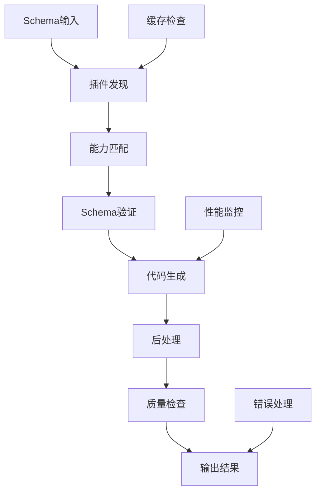

# ADR-0005: 低代码引擎架构决策

## 状态
已接受

## 背景
SmartAbp项目已构建完整的全栈低代码引擎，包括：
1. **后端**: SmartAbp.CodeGenerator - 基于Roslyn AST的企业级代码生成引擎
2. **前端**: 基于Vue 3的可视化设计器和元数据驱动运行时
3. **架构**: 支持DDD、CQRS、分布式缓存、微服务等企业级架构模式
4. **覆盖范围**: 29个专业代码生成器，覆盖85-90%的企业应用场景

## 决策

### 全栈低代码引擎架构

#### 后端代码生成引擎 (SmartAbp.CodeGenerator)
```
src/SmartAbp.CodeGenerator/
├── Core/                   # 核心引擎
│   ├── RoslynCodeEngine.cs      # Roslyn AST引擎
│   ├── CrudArchitectureGenerator.cs # CRUD架构生成器
│   └── Generation/             # 分层代码生成
├── DDD/                    # 领域驱动设计
│   └── DomainDrivenDesignGenerator.cs
├── CQRS/                   # 命令查询分离
│   └── CqrsPatternGenerator.cs
├── Caching/                # 分布式缓存
│   └── DistributedCachingGenerator.cs
├── Quality/                # 代码质量
│   └── CodeQualityGenerator.cs
├── Testing/                # 测试生成
│   └── UnitTestGenerator.cs
├── Aspire/                 # 微服务
│   └── AspireMicroservicesGenerator.cs
└── Services/               # 应用服务
    ├── CodeGenerationAppService.cs
    └── 13个专业生成服务
```

#### 前端可视化引擎 (packages/lowcode-*)
```
packages/
├── lowcode-core/           # 核心运行时
├── lowcode-designer/       # 可视化设计器
│   ├── components/         # 设计器组件
│   ├── views/             # 设计器视图
│   ├── runtime/           # 元数据驱动渲染
│   └── utils/             # 工具函数
├── lowcode-codegen/        # 前端代码生成
├── lowcode-api/            # API客户端
└── lowcode-ui-vue/         # Vue UI组件
```

### 插件接口规范

所有插件必须实现标准接口：

```typescript
interface LowCodePlugin {
  // 元数据
  metadata: {
    name: string
    version: string
    description: string
    target: string
    capabilities: string[]
    dependencies?: string[]
    peerDependencies?: string[]
  }

  // 核心方法
  canHandle(schema: any): boolean
  validate(schema: any): ValidationResult
  generate(schema: any, config: any, context: any): GeneratedCode

  // 生命周期
  onInit?(): void
  onDestroy?(): void
  onError?(error: Error): void
}
```

### 代码生成流程



### 安全策略

#### 生产环境限制
- **禁止动态执行**: 生产环境严禁使用 `new Function`、`eval`
- **沙箱隔离**: 预览功能必须在受控沙箱中执行
- **CSP策略**: 严格的内容安全策略

#### 开发环境支持
- **受控预览**: iframe + Worker + 严格CSP
- **代码验证**: 生成代码必须通过安全检查
- **依赖管理**: 第三方依赖必须在插件metadata中声明

### 性能要求

#### 并发控制
- **默认并发**: 批量生成默认并发不超过5
- **可配置优化**: 支持根据硬件配置调优
- **失败隔离**: 单个失败不影响整体流程

#### 缓存策略
- **多级缓存**: 内存 → 本地存储 → 分布式缓存
- **缓存TTL**: 默认1小时，支持标签清理
- **命中率要求**: 缓存命中率 > 50%

#### 性能监控
- **必须埋点**: 使用内核PerformanceMonitor
- **超时控制**: 代码生成/编译必须设置超时
- **指标收集**: 时延、成功率、缓存命中率、并发度

### 日志规范

#### 统一日志接口
```typescript
// 使用适配器，禁止直接console.log
const logger = createLowCodeLogger('plugin-name')
logger.info('Generation started', { schema, context })
logger.error('Generation failed', error)
```

#### 日志级别
- **ERROR**: 插件错误、生成失败
- **WARN**: 性能警告、兼容性问题
- **INFO**: 关键操作、状态变更
- **DEBUG**: 详细调试信息

## 理由

### 微内核架构选择理由
1. **可扩展性**: 插件式架构支持功能扩展
2. **模块化**: 核心功能与业务逻辑分离
3. **可维护性**: 插件独立开发和测试
4. **灵活性**: 支持不同类型的代码生成器

### 安全策略理由
1. **生产安全**: 避免代码注入和XSS攻击
2. **开发体验**: 支持安全的预览和调试
3. **依赖管理**: 明确的依赖声明和版本控制

### 性能设计理由
1. **用户体验**: 快速的代码生成响应
2. **资源优化**: 合理的并发和缓存策略
3. **可观测性**: 完整的性能监控和指标

## 后果

### 正面影响
- 高度可扩展的代码生成能力
- 安全可靠的运行时环境
- 优秀的开发和用户体验
- 完善的监控和调试能力

### 负面影响
- 架构复杂度较高
- 插件开发需要遵循规范
- 性能优化需要持续调优

### 风险缓解
- 提供插件开发模板和文档
- 建立性能基准和监控
- 逐步完善安全策略

## AI编程指导原则

### 插件开发要求
1. **接口实现**: 必须完整实现LowCodePlugin接口
2. **元数据完整**: metadata信息必须准确完整
3. **幂等性**: canHandle方法必须保持幂等
4. **错误处理**: validate方法不得空实现

### 命名规范
- **插件类名**: 以 `*Plugin` 结尾
- **生成器**: 以 `-generator` 结尾
- **文件命名**: kebab-case格式

### 代码生成规范
1. **输出格式**: 必须返回GeneratedCode结构
2. **依赖声明**: 必须在metadata中声明依赖
3. **文件头**: 生成文件必须包含AUTO-GENERATED标识
4. **质量检查**: 生成代码必须通过语法和规范检查

### 性能要求
1. **监控埋点**: 必须使用PerformanceMonitor
2. **超时设置**: 长时间操作必须设置超时
3. **缓存支持**: 支持结果缓存和失效策略
4. **并发控制**: 遵循并发限制配置

### 安全要求
1. **禁止动态执行**: 生产环境不得使用动态代码执行
2. **沙箱隔离**: 预览功能必须在沙箱中运行
3. **输入验证**: 严格验证输入schema
4. **依赖检查**: 验证第三方依赖安全性

## 质量标准

### 代码质量
- 插件代码覆盖率 ≥ 80%
- 生成代码必须通过ESLint检查
- 必须有完整的单元测试
- 必须有使用示例和文档

### 性能标准
- 单个插件生成时间 < 5秒
- 缓存命中率 > 50%
- 并发处理能力 ≥ 5个任务
- 内存使用合理，无内存泄漏

### 安全标准
- 通过安全扫描检查
- 无已知安全漏洞依赖
- 输入验证覆盖率100%
- 沙箱隔离有效性验证

## 相关文档
- [项目编程规则](../项目编程规则.md) - 低代码引擎规范部分
- [模板库使用指南](../../templates/README.md)
- [插件开发指南](../../lowcode/README.md)

## 更新历史
- 2024-01-09: 初始版本，基于项目编程规则整理
- 2025-01-12: 重大更新，基于实际实现的29个代码生成器更新架构描述
