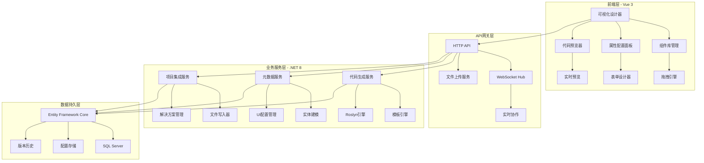
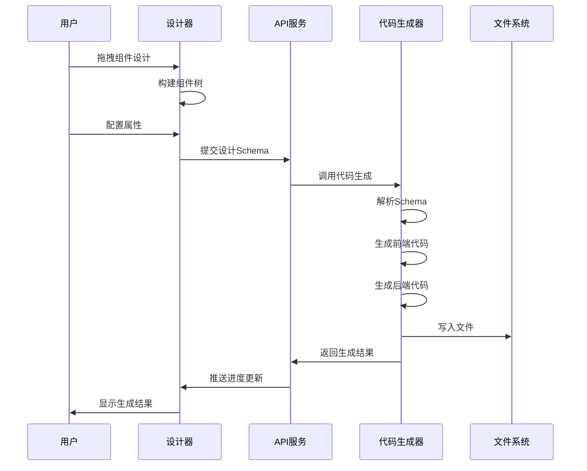

# SmartAbp 全栈低代码引擎技术架构与功能模块说明书

## 文档信息

- **文档版本**: v2.0.0
- **创建日期**: 2025年9月23日
- **最后更新**: 2025年9月23日
- **维护团队**: SmartAbp开发团队
- **文档状态**: 正式版本

## 1. 项目概述

### 1.1 引擎简介

SmartAbp低代码引擎是一个基于Vue 3 + .NET 8的企业级全栈低代码开发平台，旨在通过可视化设计器和智能代码生成技术，大幅提升企业应用开发效率。该引擎采用模块化架构设计，支持前后端一体化代码生成，具备完整的实体建模、UI设计、业务逻辑配置和部署能力。

### 1.2 核心特性

- **可视化设计器**: 基于Vue 3的企业级可视化设计器，支持拖拽式组件设计
- **智能代码生成**: 基于Roslyn的C#代码生成引擎和Vue SFC生成器
- **全栈架构**: 前后端一体化代码生成，支持ABP框架集成
- **实时协作**: 支持多用户实时协作设计和WebSocket进度跟踪
- **模块化设计**: 插件化架构，支持自定义生成器和组件扩展
- **企业级功能**: 版本控制、权限管理、性能监控和AI辅助设计

### 1.3 技术栈

**前端技术栈**:
- Vue 3 + TypeScript + Composition API
- Element Plus UI组件库
- Pinia状态管理
- Vue Router 4路由管理
- Vite构建工具

**后端技术栈**:
- .NET 8 + ABP Framework
- Entity Framework Core
- Roslyn代码分析和生成
- SignalR实时通信
- AutoMapper对象映射

## 2. 系统架构设计

### 2.1 整体架构图



### 2.2 核心模块架构

#### 2.2.1 前端架构 (src/SmartAbp.Vue)

```
SmartAbp.Vue/
├── packages/                          # 核心包
│   ├── lowcode-core/                  # 低代码核心包
│   │   ├── index.ts                   # 主入口
│   │   └── src/
│   │       ├── types/                 # 类型定义
│   │       │   ├── entity-designer.ts # 实体设计器类型
│   │       │   └── manifest.ts        # 清单类型
│   │       ├── composables/           # 组合式函数
│   │       │   ├── useCodeGenerationProgress.ts # 代码生成进度
│   │       │   └── useDragDrop.ts     # 拖拽功能
│   │       └── utils/                 # 工具函数
│   │           └── manifestWriter.ts  # 清单写入器
│   ├── lowcode-designer/              # 设计器包
│   │   └── src/
│   │       ├── components/            # 设计器组件
│   │       │   └── CodeGenerator/     # 代码生成器组件
│   │       ├── views/                 # 设计器视图
│   │       │   ├── VisualDesignerView.vue    # 可视化设计器
│   │       │   └── codegen/
│   │       │       └── LowCodeEngineView.vue # 引擎控制台
│   │       └── runtime/               # 运行时组件
│   │           └── MetadataDrivenPageRenderer.vue
│   └── lowcode-api/                   # API包
│       ├── index.ts                   # API入口
│       └── types.ts                   # API类型定义
└── src/
    ├── components/lowcode/            # 低代码组件
    ├── views/lowcode/                 # 低代码视图
    └── lowcode-entry.ts               # 低代码入口
```

#### 2.2.2 后端架构 (src/SmartAbp.CodeGenerator)

```
SmartAbp.CodeGenerator/
├── SmartAbpCodeGeneratorModule.cs     # 模块定义
├── Services/                          # 应用服务层
│   ├── CodeGenerationAppService.cs   # 代码生成应用服务
│   ├── MetadataAppService.cs          # 元数据应用服务
│   ├── CodeGenerationProgressService.cs # 进度服务
│   ├── FrontendIntegrationService.cs # 前端集成服务
│   ├── SolutionIntegrationService.cs # 解决方案集成服务
│   └── Dtos.cs                        # 数据传输对象
├── Core/                              # 核心引擎
│   ├── RoslynCodeEngine.cs           # Roslyn代码引擎
│   ├── CrudArchitectureGenerator.cs  # CRUD架构生成器
│   └── Generation/
│       └── Frontend/
│           └── FrontendGenerator.cs   # 前端代码生成器
├── Domain/                            # 领域层
├── Infrastructure/                    # 基础设施层
├── Hubs/                             # SignalR集线器
├── Caching/                          # 缓存服务
├── Messaging/                        # 消息服务
└── Quality/                          # 代码质量检查
```

### 2.3 数据流架构



## 3. 核心功能模块

### 3.1 可视化设计器模块

#### 3.1.1 企业级设计器 (VisualDesignerView.vue)

**功能特性**:
- 多模式支持：设计模式、预览模式、代码模式
- 实时协作：多用户同时编辑，实时同步
- 智能辅助：AI设计建议和自动优化
- 性能监控：实时性能指标显示
- 版本控制：设计历史记录和回滚

**核心组件**:
```typescript
interface EnterpriseDesigner {
  // 核心方法
  initialize(): Promise<void>
  destroy(): void
  
  // 画布操作
  canvas: {
    getComponents(): CanvasComponent[]
    getSelectedComponents(): CanvasComponent[]
    setZoom(zoom: number): void
    setViewport(x: number, y: number): void
  }
  
  // 版本控制
  versionControl: {
    getState(): any
    restoreSnapshot(id: string): Promise<void>
  }
  
  // AI助手
  aiAssistant: {
    applySuggestion(id: string): Promise<void>
  }
}
```

**界面布局**:
- 左侧面板：组件库、图层管理、AI助手
- 中央画布：可视化设计区域，支持网格、标尺、缩略图
- 右侧面板：属性编辑器、样式编辑器、版本历史
- 顶部工具栏：模式切换、协作用户、性能指标、操作按钮

#### 3.1.2 拖拽引擎 (useDragDrop.ts)

**功能特性**:
- 高性能拖拽：支持大量组件的流畅拖拽
- 智能放置：自动检测有效放置区域
- 拖拽预览：实时预览拖拽效果
- 约束验证：支持放置规则和数量限制

**核心接口**:
```typescript
interface DragData {
  type: string
  data: any
  id: string
  name: string
  icon?: string
  description?: string
}

interface DropZoneConfig {
  id: string
  name: string
  acceptedTypes: string[]
  element: HTMLElement
  allowMultiple?: boolean
  maxItems?: number
  onDrop?: (data: DragData, zone: DropZoneConfig) => void
}
```

### 3.2 代码生成引擎模块

#### 3.2.1 后端代码生成器 (CodeGenerationAppService.cs)

**功能特性**:
- 基于Roslyn的C#代码生成
- ABP框架集成
- CRUD架构自动生成
- 实体关系映射
- 权限和多租户支持

**生成内容**:
- 实体类 (Domain Entities)
- 应用服务 (Application Services)
- 数据传输对象 (DTOs)
- 仓储接口 (Repository Interfaces)
- 控制器 (API Controllers)
- 权限定义 (Permissions)

**核心方法**:
```csharp
public class CodeGenerationAppService : ICodeGenerationAppService
{
    public async Task<GeneratedCodeResultDto> GenerateAsync(CodeGenerationRequestDto request)
    {
        // 1. 验证输入
        await ValidateRequestAsync(request);
        
        // 2. 解析元数据
        var metadata = await ParseMetadataAsync(request);
        
        // 3. 生成代码
        var generatedFiles = await GenerateFilesAsync(metadata);
        
        // 4. 写入文件系统
        await WriteFilesAsync(generatedFiles);
        
        // 5. 返回结果
        return CreateResult(generatedFiles);
    }
}
```

#### 3.2.2 前端代码生成器 (FrontendGenerator.cs)

**功能特性**:
- Vue 3 SFC组件生成
- TypeScript类型定义
- Pinia状态管理
- Element Plus集成
- 路由和菜单配置

**生成内容**:
- 列表视图组件 (ListView.vue)
- 管理表单组件 (Management.vue)
- API服务文件 (api/*.ts)
- 状态管理文件 (stores/*.ts)
- 路由配置 (routes.ts)
- 菜单配置 (menu.ts)

**生成示例**:
```typescript
// 生成的API服务文件
export interface UserDto {
  id: string;
  name: string;
  email: string;
  createdAt: string;
}

export const getUsers = (params: GetUserListDto) => api.get('/api/app/user', { params })
export const getUser = (id: string) => api.get(`/api/app/user/${id}`)
export const createUser = (data: CreateUserDto) => api.post('/api/app/user', data)
export const updateUser = (id: string, data: UpdateUserDto) => api.put(`/api/app/user/${id}`, data)
export const deleteUser = (id: string) => api.delete(`/api/app/user/${id}`)
```

#### 3.2.3 Roslyn代码引擎 (RoslynCodeEngine.cs)

**功能特性**:
- 语法树分析和生成
- 代码格式化和优化
- 编译时验证
- 智能代码补全

**核心能力**:
```csharp
public class RoslynCodeEngine
{
    public async Task<string> GenerateEntityAsync(EntityMetadata metadata)
    {
        var syntaxTree = SyntaxFactory.CompilationUnit()
            .AddUsings(GenerateUsings())
            .AddMembers(GenerateNamespace(metadata));
            
        return syntaxTree.NormalizeWhitespace().ToFullString();
    }
    
    private NamespaceDeclarationSyntax GenerateNamespace(EntityMetadata metadata)
    {
        return SyntaxFactory.NamespaceDeclaration(
            SyntaxFactory.IdentifierName($"{metadata.ModuleName}.Domain"))
            .AddMembers(GenerateEntityClass(metadata));
    }
}
```

### 3.3 实时协作模块

#### 3.3.1 代码生成进度跟踪 (useCodeGenerationProgress.ts)

**功能特性**:
- WebSocket实时通信
- 多会话管理
- 进度可视化
- 错误处理和重连

**核心接口**:
```typescript
interface CodeGenerationProgress {
  sessionId: string
  totalFiles: number
  generatedFiles: number
  currentFile: string
  status: 'idle' | 'generating' | 'completed' | 'error'
  percentage: number
  startTime: Date
  endTime?: Date
  error?: string
  warnings: string[]
  generatedFileList: string[]
}
```

**使用示例**:
```typescript
const {
  currentProgress,
  isGenerating,
  createSession,
  updateProgress,
  connect
} = useCodeGenerationProgress()

// 创建生成会话
const sessionId = createSession(10)

// 连接WebSocket
await connect('ws://localhost:5000/hubs/codegen')

// 监听进度更新
watch(currentProgress, (progress) => {
  if (progress?.status === 'completed') {
    ElMessage.success('代码生成完成！')
  }
})
```

### 3.4 模板系统模块

#### 3.4.1 代码生成器模板 (CodeGenerator.template.ts)

**功能特性**:
- 可扩展的生成器架构
- 模板变量替换
- 多格式输出支持
- 代码验证和优化

**模板结构**:
```typescript
export class {{GeneratorName}}Generator implements ICodeGenerator {
  public readonly metadata: GeneratorMetadata = {
    name: '{{generatorName}}',
    displayName: '{{GeneratorDescription}}',
    version: '1.0.0',
    targetType: '{{TargetType}}',
    supportedSchemas: ['component', 'page', 'form'],
    outputFormats: ['vue', 'typescript', 'javascript']
  }

  async generate(schema: any, context: GeneratorContext, options?: GeneratorOptions): Promise<GeneratedCode> {
    // 生成逻辑实现
  }
}
```

#### 3.4.2 插件系统模板 (LowCodePlugin.template.ts)

**功能特性**:
- 插件生命周期管理
- 依赖注入支持
- 事件系统集成
- 配置管理

**插件结构**:
```typescript
export class {{PluginName}}Plugin implements ILowCodePlugin {
  public readonly metadata: PluginMetadata = {
    name: '{{pluginName}}',
    displayName: '{{PluginDescription}}',
    version: '{{PluginVersion}}',
    category: 'custom',
    dependencies: [],
    permissions: []
  }

  async install(app: App, context: PluginContext): Promise<void> {
    // 插件安装逻辑
  }

  async uninstall(): Promise<void> {
    // 插件卸载逻辑
  }
}
```

#### 3.4.3 运行时组件模板 (RuntimeComponent.template.vue)

**功能特性**:
- 数据绑定支持
- 事件处理机制
- 样式主题化
- 响应式设计

**组件结构**:
```vue
<template>
  <div :class="componentClasses" :style="computedStyle">
    <slot v-if="$slots.default" />
    <div v-else class="default-content">
      <!-- 默认内容 -->
    </div>
  </div>
</template>

<script setup lang="ts">
interface Props extends RuntimeComponentProps {
  title?: string
  variant?: 'default' | 'primary' | 'success' | 'warning' | 'danger'
  disabled?: boolean
  dataSource?: any
  dataBinding?: Record<string, string>
}

const props = withDefaults(defineProps<Props>(), {
  variant: 'default',
  disabled: false
})
</script>
```

### 3.5 元数据管理模块

#### 3.5.1 清单写入器 (manifestWriter.ts)

**功能特性**:
- 模块清单生成
- 路由配置管理
- 菜单结构生成
- 配置文件写入

**核心方法**:
```typescript
export class SmartAbpManifestWriter {
  async generateFiles(metadata: ModuleMetadata, basePath: string): Promise<{ path: string; content: string }[]> {
    const files: { path: string; content: string }[] = []
    
    // 生成实体清单
    files.push({
      path: `${basePath}/${metadata.name}/manifest.json`,
      content: JSON.stringify(this.generateEntityManifest(metadata), null, 2)
    })
    
    // 生成视图配置
    files.push({
      path: `${basePath}/${metadata.name}/list-view.json`,
      content: JSON.stringify(this.generateListView(metadata), null, 2)
    })
    
    return files
  }
}
```

#### 3.5.2 实体设计器类型 (entity-designer.ts)

**类型定义**:
```typescript
export interface EntityDefinition {
  name: string
  module: string
  aggregate: string
  description: string
  isAggregateRoot: boolean
  isMultiTenant: boolean
  isSoftDelete: boolean
  hasExtraProperties: boolean
  properties: PropertyDefinition[]
}

export interface PropertyDefinition {
  name: string
  type: string
  isRequired: boolean
  maxLength?: number
  description: string
  defaultValue?: string
}

export interface GeneratedCodeResult {
  success: boolean
  code?: string
  files?: Record<string, string>
  metadata?: {
    generatedAt: string
    linesOfCode: number
  }
  generationTime?: {
    totalMilliseconds: number
  }
  sessionId?: string
}
```

### 3.6 引擎控制台模块

#### 3.6.1 低代码引擎控制台 (LowCodeEngineView.vue)

**功能特性**:
- 引擎状态监控
- 插件管理
- 性能测试
- 实时日志查看
- 代码生成演示

**界面组成**:
- 状态卡片：引擎健康状态、插件数量、性能指标
- 快速操作：引擎初始化、示例运行、性能测试
- 实时日志：支持日志过滤、自动滚动、导出功能
- 代码生成演示：Schema输入、插件选择、结果预览

**核心功能**:
```typescript
const engineStatus = ref({
  healthy: false,
  pluginsCount: 0,
  avgGenerationTime: 0,
  successRate: 0
})

const initializeEngine = async () => {
  loading.value = true
  addLog('info', '正在初始化低代码引擎...')
  
  try {
    engineInstance.value = { isHealthy: () => true }
    updateEngineStatus()
    addLog('success', '低代码引擎初始化完成！')
  } catch (error) {
    addLog('error', `引擎初始化失败: ${error.message}`)
  } finally {
    loading.value = false
  }
}
```

## 4. 技术实现细节

### 4.1 前端技术实现

#### 4.1.1 组合式函数设计

**拖拽功能实现**:
```typescript
export function useDragDrop() {
  const dragState = reactive<DragState>({
    isDragging: false,
    dragData: null,
    dragElement: null,
    validDropZones: [],
    currentDropZone: null
  })

  const startDrag = (event: DragEvent, data: DragData) => {
    dragState.isDragging = true
    dragState.dragData = data
    
    // 设置拖拽效果
    if (event.dataTransfer) {
      event.dataTransfer.effectAllowed = 'move'
      event.dataTransfer.setData('text/plain', JSON.stringify(data))
    }
    
    // 查找有效放置区域
    updateValidDropZones(data)
  }

  return {
    dragState,
    startDrag,
    registerDropZone,
    validateDrop
  }
}
```

**代码生成进度管理**:
```typescript
export function useCodeGenerationProgress() {
  const currentProgress = ref<CodeGenerationProgress | null>(null)
  const sessionMap = ref<Map<string, CodeGenerationProgress>>(new Map())

  const createSession = (totalFiles: number): string => {
    const sessionId = generateSessionId()
    const progress: CodeGenerationProgress = {
      sessionId,
      totalFiles,
      generatedFiles: 0,
      status: 'idle',
      percentage: 0,
      startTime: new Date(),
      warnings: [],
      generatedFileList: []
    }
    
    sessionMap.value.set(sessionId, progress)
    currentProgress.value = progress
    return sessionId
  }

  const connect = async (url: string): Promise<void> => {
    return new Promise((resolve, reject) => {
      const ws = new WebSocket(url)
      
      ws.onopen = () => {
        console.log('WebSocket connected')
        resolve()
      }
      
      ws.onmessage = (event) => {
        handleWebSocketMessage(event.data)
      }
      
      ws.onerror = (error) => {
        reject(error)
      }
    })
  }

  return {
    currentProgress,
    createSession,
    connect,
    updateProgress,
    markFileCompleted
  }
}
```

#### 4.1.2 状态管理设计

**Pinia Store结构**:
```typescript
export const useDesignerStore = defineStore('designer', () => {
  const components = ref<DesignerComponent[]>([])
  const selectedComponents = ref<string[]>([])
  const canvasConfig = ref<CanvasConfig>({
    width: 1920,
    height: 1080,
    zoom: 1,
    grid: true
  })

  const addComponent = (component: DesignerComponent) => {
    components.value.push(component)
  }

  const removeComponent = (id: string) => {
    const index = components.value.findIndex(c => c.id === id)
    if (index > -1) {
      components.value.splice(index, 1)
    }
  }

  const updateComponent = (id: string, updates: Partial<DesignerComponent>) => {
    const component = components.value.find(c => c.id === id)
    if (component) {
      Object.assign(component, updates)
    }
  }

  return {
    components,
    selectedComponents,
    canvasConfig,
    addComponent,
    removeComponent,
    updateComponent
  }
})
```

### 4.2 后端技术实现

#### 4.2.1 ABP模块设计

**模块配置**:
```csharp
[DependsOn(
    typeof(AbpDddDomainModule),
    typeof(AbpAutoMapperModule),
    typeof(AbpSignalRModule)
)]
public class SmartAbpCodeGeneratorModule : AbpModule
{
    public override void ConfigureServices(ServiceConfigurationContext context)
    {
        Configure<AbpAutoMapperOptions>(options =>
        {
            options.AddMaps<SmartAbpCodeGeneratorModule>();
        });

        context.Services.AddTransient<IRoslynCodeEngine, RoslynCodeEngine>();
        context.Services.AddTransient<IFrontendGenerator, FrontendGenerator>();
        context.Services.AddTransient<ICrudArchitectureGenerator, CrudArchitectureGenerator>();
    }
}
```

#### 4.2.2 代码生成服务实现

**应用服务层**:
```csharp
public class CodeGenerationAppService : ApplicationService, ICodeGenerationAppService
{
    private readonly IRoslynCodeEngine _roslynEngine;
    private readonly IFrontendGenerator _frontendGenerator;
    private readonly ICodeWriterService _codeWriter;
    private readonly IHubContext<CodeGenerationHub> _hubContext;

    public async Task<GeneratedCodeResultDto> GenerateAsync(CodeGenerationRequestDto request)
    {
        var sessionId = Guid.NewGuid().ToString();
        
        try
        {
            // 发送开始信号
            await _hubContext.Clients.All.SendAsync("GenerationStarted", sessionId);

            // 解析元数据
            var metadata = ObjectMapper.Map<ModuleMetadataDto>(request);
            
            // 生成后端代码
            var backendFiles = await GenerateBackendAsync(metadata, sessionId);
            
            // 生成前端代码
            var frontendFiles = await GenerateFrontendAsync(metadata, sessionId);
            
            // 写入文件
            await _codeWriter.WriteFilesAsync(backendFiles.Concat(frontendFiles));
            
            // 发送完成信号
            await _hubContext.Clients.All.SendAsync("GenerationCompleted", sessionId);
            
            return new GeneratedCodeResultDto
            {
                Success = true,
                SessionId = sessionId,
                GeneratedFiles = backendFiles.Concat(frontendFiles).ToList()
            };
        }
        catch (Exception ex)
        {
            await _hubContext.Clients.All.SendAsync("GenerationError", sessionId, ex.Message);
            throw;
        }
    }

    private async Task<List<GeneratedFileDto>> GenerateBackendAsync(ModuleMetadataDto metadata, string sessionId)
    {
        var files = new List<GeneratedFileDto>();
        
        foreach (var entity in metadata.Entities)
        {
            // 生成实体类
            var entityCode = await _roslynEngine.GenerateEntityAsync(entity);
            files.Add(new GeneratedFileDto
            {
                Path = $"Domain/{entity.Name}.cs",
                Content = entityCode,
                Type = "Entity"
            });
            
            // 发送进度更新
            await _hubContext.Clients.All.SendAsync("FileGenerated", sessionId, $"{entity.Name}.cs");
            
            // 生成应用服务
            var serviceCode = await _roslynEngine.GenerateApplicationServiceAsync(entity);
            files.Add(new GeneratedFileDto
            {
                Path = $"Services/{entity.Name}AppService.cs",
                Content = serviceCode,
                Type = "ApplicationService"
            });
            
            await _hubContext.Clients.All.SendAsync("FileGenerated", sessionId, $"{entity.Name}AppService.cs");
        }
        
        return files;
    }
}
```

#### 4.2.3 Roslyn代码生成引擎

**实体生成器**:
```csharp
public class RoslynCodeEngine : IRoslynCodeEngine
{
    public async Task<string> GenerateEntityAsync(EnhancedEntityModelDto entity)
    {
        var namespaceDeclaration = SyntaxFactory.NamespaceDeclaration(
            SyntaxFactory.IdentifierName($"{entity.ModuleName}.Domain.Entities"));

        var classDeclaration = SyntaxFactory.ClassDeclaration(entity.Name)
            .AddModifiers(SyntaxFactory.Token(SyntaxKind.PublicKeyword))
            .AddBaseListTypes(SyntaxFactory.SimpleBaseType(
                SyntaxFactory.IdentifierName("AggregateRoot<Guid>")));

        // 添加属性
        foreach (var property in entity.Properties)
        {
            var propertyDeclaration = SyntaxFactory.PropertyDeclaration(
                SyntaxFactory.IdentifierName(GetCSharpType(property.Type)),
                SyntaxFactory.Identifier(property.Name))
                .AddModifiers(SyntaxFactory.Token(SyntaxKind.PublicKeyword))
                .AddAccessorListAccessors(
                    SyntaxFactory.AccessorDeclaration(SyntaxKind.GetAccessorDeclaration)
                        .WithSemicolonToken(SyntaxFactory.Token(SyntaxKind.SemicolonToken)),
                    SyntaxFactory.AccessorDeclaration(SyntaxKind.SetAccessorDeclaration)
                        .WithSemicolonToken(SyntaxFactory.Token(SyntaxKind.SemicolonToken)));

            classDeclaration = classDeclaration.AddMembers(propertyDeclaration);
        }

        namespaceDeclaration = namespaceDeclaration.AddMembers(classDeclaration);

        var compilationUnit = SyntaxFactory.CompilationUnit()
            .AddUsings(
                SyntaxFactory.UsingDirective(SyntaxFactory.IdentifierName("System")),
                SyntaxFactory.UsingDirective(SyntaxFactory.IdentifierName("Volo.Abp.Domain.Entities")))
            .AddMembers(namespaceDeclaration);

        return compilationUnit.NormalizeWhitespace().ToFullString();
    }

    private string GetCSharpType(string type)
    {
        return type.ToLower() switch
        {
            "string" => "string",
            "int" => "int",
            "long" => "long",
            "decimal" => "decimal",
            "bool" => "bool",
            "datetime" => "DateTime",
            "guid" => "Guid",
            _ => "object"
        };
    }
}
```

### 4.3 实时通信实现

#### 4.3.1 SignalR Hub

**代码生成Hub**:
```csharp
public class CodeGenerationHub : Hub
{
    public async Task JoinSession(string sessionId)
    {
        await Groups.AddToGroupAsync(Context.ConnectionId, sessionId);
        await Clients.Group(sessionId).SendAsync("UserJoined", Context.ConnectionId);
    }

    public async Task LeaveSession(string sessionId)
    {
        await Groups.RemoveFromGroupAsync(Context.ConnectionId, sessionId);
        await Clients.Group(sessionId).SendAsync("UserLeft", Context.ConnectionId);
    }

    public async Task SendProgress(string sessionId, int progress)
    {
        await Clients.Group(sessionId).SendAsync("ProgressUpdate", progress);
    }
}
```

#### 4.3.2 前端WebSocket集成

**WebSocket客户端**:
```typescript
class CodeGenerationClient {
  private connection: HubConnection

  constructor() {
    this.connection = new HubConnectionBuilder()
      .withUrl('/hubs/codegeneration')
      .build()
  }

  async start(): Promise<void> {
    await this.connection.start()
    
    this.connection.on('GenerationStarted', (sessionId: string) => {
      console.log(`Generation started: ${sessionId}`)
    })
    
    this.connection.on('FileGenerated', (sessionId: string, fileName: string) => {
      console.log(`File generated: ${fileName}`)
    })
    
    this.connection.on('GenerationCompleted', (sessionId: string) => {
      console.log(`Generation completed: ${sessionId}`)
    })
  }

  async joinSession(sessionId: string): Promise<void> {
    await this.connection.invoke('JoinSession', sessionId)
  }
}
```

## 5. 部署架构

### 5.1 开发环境部署

**前端开发服务器**:
```bash
cd src/SmartAbp.Vue
npm install
npm run dev
```

**后端开发服务器**:
```bash
cd src/SmartAbp.Web
dotnet run
```

### 5.2 生产环境部署

**Docker容器化部署**:
```dockerfile
# 前端构建
FROM node:18-alpine AS frontend-build
WORKDIR /app
COPY src/SmartAbp.Vue/package*.json ./
RUN npm ci --only=production
COPY src/SmartAbp.Vue/ ./
RUN npm run build

# 后端构建
FROM mcr.microsoft.com/dotnet/sdk:8.0 AS backend-build
WORKDIR /src
COPY *.sln .
COPY src/ ./src/
RUN dotnet restore
RUN dotnet publish src/SmartAbp.Web/SmartAbp.Web.csproj -c Release -o /app/publish

# 运行时镜像
FROM mcr.microsoft.com/dotnet/aspnet:8.0
WORKDIR /app
COPY --from=backend-build /app/publish .
COPY --from=frontend-build /app/dist ./wwwroot
EXPOSE 80
ENTRYPOINT ["dotnet", "SmartAbp.Web.dll"]
```

### 5.3 微服务架构部署

```yaml
version: '3.8'
services:
  lowcode-api:
    image: smartabp/lowcode-api:latest
    ports:
      - "5000:80"
    environment:
      - ConnectionStrings__Default=Server=db;Database=SmartAbp;User=sa;Password=MyPass@word
    depends_on:
      - db
      - redis

  lowcode-web:
    image: smartabp/lowcode-web:latest
    ports:
      - "3000:80"
    environment:
      - API_BASE_URL=http://lowcode-api:80

  db:
    image: mcr.microsoft.com/mssql/server:2022-latest
    environment:
      - ACCEPT_EULA=Y
      - SA_PASSWORD=MyPass@word

  redis:
    image: redis:7-alpine
    ports:
      - "6379:6379"
```

## 6. 性能优化

### 6.1 前端性能优化

**代码分割和懒加载**:
```typescript
// 路由懒加载
const routes = [
  {
    path: '/designer',
    component: () => import('@/views/designer/VisualDesignerView.vue')
  },
  {
    path: '/engine',
    component: () => import('@/views/codegen/LowCodeEngineView.vue')
  }
]

// 组件懒加载
const AsyncComponent = defineAsyncComponent({
  loader: () => import('./HeavyComponent.vue'),
  loadingComponent: LoadingSpinner,
  errorComponent: ErrorComponent,
  delay: 200,
  timeout: 3000
})
```

**虚拟滚动优化**:
```vue
<template>
  <VirtualList
    :items="largeDataSet"
    :item-height="50"
    :container-height="400"
    v-slot="{ item, index }"
  >
    <ComponentItem :data="item" :index="index" />
  </VirtualList>
</template>
```

### 6.2 后端性能优化

**异步代码生成**:
```csharp
public class CodeGenerationAppService : ApplicationService
{
    public async Task<string> StartGenerationAsync(CodeGenerationRequestDto request)
    {
        var sessionId = Guid.NewGuid().ToString();
        
        // 异步执行代码生成
        _ = Task.Run(async () =>
        {
            try
            {
                await GenerateCodeAsync(request, sessionId);
            }
            catch (Exception ex)
            {
                await NotifyErrorAsync(sessionId, ex);
            }
        });
        
        return sessionId;
    }
}
```

**缓存策略**:
```csharp
public class MetadataAppService : ApplicationService
{
    private readonly IDistributedCache _cache;

    [Cached(Duration = 3600)] // 缓存1小时
    public async Task<List<EntityMetadataDto>> GetEntityMetadataAsync(string moduleName)
    {
        var cacheKey = $"entity_metadata_{moduleName}";
        var cached = await _cache.GetStringAsync(cacheKey);
        
        if (cached != null)
        {
            return JsonSerializer.Deserialize<List<EntityMetadataDto>>(cached);
        }
        
        var metadata = await LoadEntityMetadataAsync(moduleName);
        await _cache.SetStringAsync(cacheKey, JsonSerializer.Serialize(metadata));
        
        return metadata;
    }
}
```

## 7. 安全机制

### 7.1 身份认证和授权

**JWT Token认证**:
```csharp
public class CodeGenerationAppService : ApplicationService
{
    [Authorize(CodeGenerationPermissions.Generate)]
    public async Task<GeneratedCodeResultDto> GenerateAsync(CodeGenerationRequestDto request)
    {
        // 验证用户权限
        await AuthorizationService.CheckAsync(CodeGenerationPermissions.Generate);
        
        // 执行代码生成
        return await GenerateCodeAsync(request);
    }
}
```

**权限定义**:
```csharp
public static class CodeGenerationPermissions
{
    public const string GroupName = "CodeGeneration";
    
    public const string Generate = GroupName + ".Generate";
    public const string ViewHistory = GroupName + ".ViewHistory";
    public const string ManageTemplates = GroupName + ".ManageTemplates";
}
```

### 7.2 输入验证和安全检查

**DTO验证**:
```csharp
public class CodeGenerationRequestDto
{
    [Required]
    [StringLength(50, MinimumLength = 2)]
    public string ModuleName { get; set; }
    
    [Required]
    [MinLength(1)]
    public List<EntityDefinitionDto> Entities { get; set; }
}

public class EntityDefinitionDto : IValidatableObject
{
    [Required]
    [RegularExpression(@"^[A-Z][a-zA-Z0-9]*$")]
    public string Name { get; set; }
    
    public IEnumerable<ValidationResult> Validate(ValidationContext validationContext)
    {
        if (Properties?.Count == 0)
        {
            yield return new ValidationResult("Entity must have at least one property");
        }
    }
}
```

**代码注入防护**:
```csharp
public class CodeSecurityValidator
{
    private readonly string[] _dangerousPatterns = {
        "System.IO.File",
        "System.Diagnostics.Process",
        "System.Reflection.Assembly",
        "eval(",
        "Function(",
        "__import__"
    };

    public bool ValidateGeneratedCode(string code)
    {
        foreach (var pattern in _dangerousPatterns)
        {
            if (code.Contains(pattern, StringComparison.OrdinalIgnoreCase))
            {
                return false;
            }
        }
        
        return true;
    }
}
```

## 8. 监控和日志

### 8.1 应用性能监控

**性能指标收集**:
```typescript
export class PerformanceMonitor {
  private metrics: PerformanceMetrics = {
    renderTime: 0,
    memoryUsage: 0,
    componentCount: 0,
    fps: 60,
    lastUpdateTime: 0
  }

  startMonitoring(): void {
    // 监控渲染性能
    this.monitorRenderPerformance()
    
    // 监控内存使用
    this.monitorMemoryUsage()
    
    // 监控FPS
    this.monitorFPS()
  }

  private monitorRenderPerformance(): void {
    const observer = new PerformanceObserver((list) => {
      for (const entry of list.getEntries()) {
        if (entry.entryType === 'measure') {
          this.metrics.renderTime = entry.duration
        }
      }
    })
    
    observer.observe({ entryTypes: ['measure'] })
  }
}
```

### 8.2 结构化日志

**后端日志配置**:
```csharp
public class CodeGenerationAppService : ApplicationService
{
    private readonly ILogger<CodeGenerationAppService> _logger;

    public async Task<GeneratedCodeResultDto> GenerateAsync(CodeGenerationRequestDto request)
    {
        using var scope = _logger.BeginScope(new Dictionary<string, object>
        {
            ["SessionId"] = Guid.NewGuid().ToString(),
            ["ModuleName"] = request.ModuleName,
            ["EntityCount"] = request.Entities.Count
        });

        _logger.LogInformation("Starting code generation for module {ModuleName}", request.ModuleName);

        try
        {
            var result = await GenerateCodeAsync(request);
            
            _logger.LogInformation("Code generation completed successfully. Generated {FileCount} files", 
                result.GeneratedFiles.Count);
                
            return result;
        }
        catch (Exception ex)
        {
            _logger.LogError(ex, "Code generation failed for module {ModuleName}", request.ModuleName);
            throw;
        }
    }
}
```

**前端日志系统**:
```typescript
export class Logger {
  private context: string

  constructor(context: string) {
    this.context = context
  }

  info(message: string, data?: any): void {
    console.log(`[${this.context}] ${message}`, data)
    this.sendToServer('info', message, data)
  }

  error(message: string, error?: Error, data?: any): void {
    console.error(`[${this.context}] ${message}`, error, data)
    this.sendToServer('error', message, { error: error?.message, stack: error?.stack, ...data })
  }

  private sendToServer(level: string, message: string, data?: any): void {
    // 发送日志到服务器
    fetch('/api/logs', {
      method: 'POST',
      headers: { 'Content-Type': 'application/json' },
      body: JSON.stringify({
        level,
        message,
        context: this.context,
        timestamp: new Date().toISOString(),
        data
      })
    }).catch(console.error)
  }
}
```

## 9. 测试策略

### 9.1 前端测试

**单元测试**:
```typescript
// useDragDrop.test.ts
import { describe, it, expect, beforeEach } from 'vitest'
import { useDragDrop } from '@/composables/useDragDrop'

describe('useDragDrop', () => {
  let dragDrop: ReturnType<typeof useDragDrop>

  beforeEach(() => {
    dragDrop = useDragDrop()
  })

  it('should initialize with correct default state', () => {
    expect(dragDrop.isDragging.value).toBe(false)
    expect(dragDrop.currentDragData.value).toBeNull()
  })

  it('should start drag operation correctly', () => {
    const mockEvent = new DragEvent('dragstart')
    const dragData = {
      type: 'component',
      id: 'test-1',
      name: 'Test Component',
      data: {}
    }

    dragDrop.startDrag(mockEvent, dragData)

    expect(dragDrop.isDragging.value).toBe(true)
    expect(dragDrop.currentDragData.value).toEqual(dragData)
  })
})
```

**组件测试**:
```typescript
// VisualDesignerView.test.ts
import { mount } from '@vue/test-utils'
import { describe, it, expect } from 'vitest'
import VisualDesignerView from '@/views/designer/VisualDesignerView.vue'

describe('VisualDesignerView', () => {
  it('should render correctly', () => {
    const wrapper = mount(VisualDesignerView)
    
    expect(wrapper.find('.enterprise-designer').exists()).toBe(true)
    expect(wrapper.find('.designer-header').exists()).toBe(true)
    expect(wrapper.find('.designer-layout').exists()).toBe(true)
  })

  it('should switch modes correctly', async () => {
    const wrapper = mount(VisualDesignerView)
    
    await wrapper.find('[data-testid="preview-mode"]').trigger('click')
    
    expect(wrapper.vm.currentMode).toBe('preview')
  })
})
```

### 9.2 后端测试

**单元测试**:
```csharp
public class RoslynCodeEngineTests : SmartAbpTestBase<SmartAbpCodeGeneratorTestModule>
{
    private readonly IRoslynCodeEngine _roslynEngine;

    public RoslynCodeEngineTests()
    {
        _roslynEngine = GetRequiredService<IRoslynCodeEngine>();
    }

    [Fact]
    public async Task GenerateEntityAsync_Should_Generate_Valid_CSharp_Code()
    {
        // Arrange
        var entity = new EnhancedEntityModelDto
        {
            Name = "User",
            ModuleName = "Identity",
            Properties = new List<PropertyDefinitionDto>
            {
                new() { Name = "Name", Type = "string" },
                new() { Name = "Email", Type = "string" }
            }
        };

        // Act
        var result = await _roslynEngine.GenerateEntityAsync(entity);

        // Assert
        result.ShouldNotBeNullOrEmpty();
        result.ShouldContain("public class User");
        result.ShouldContain("public string Name { get; set; }");
        result.ShouldContain("public string Email { get; set; }");
    }
}
```

**集成测试**:
```csharp
public class CodeGenerationAppServiceTests : SmartAbpIntegratedTest<SmartAbpCodeGeneratorTestModule>
{
    private readonly ICodeGenerationAppService _codeGenerationService;

    public CodeGenerationAppServiceTests()
    {
        _codeGenerationService = GetRequiredService<ICodeGenerationAppService>();
    }

    [Fact]
    public async Task GenerateAsync_Should_Generate_Complete_Module()
    {
        // Arrange
        var request = new CodeGenerationRequestDto
        {
            ModuleName = "TestModule",
            Entities = new List<EntityDefinitionDto>
            {
                new()
                {
                    Name = "TestEntity",
                    Properties = new List<PropertyDefinitionDto>
                    {
                        new() { Name = "Id", Type = "Guid" },
                        new() { Name = "Name", Type = "string" }
                    }
                }
            }
        };

        // Act
        var result = await _codeGenerationService.GenerateAsync(request);

        // Assert
        result.Success.ShouldBeTrue();
        result.GeneratedFiles.ShouldNotBeEmpty();
        result.GeneratedFiles.ShouldContain(f => f.Path.Contains("TestEntity.cs"));
        result.GeneratedFiles.ShouldContain(f => f.Path.Contains("TestEntityAppService.cs"));
    }
}
```

## 10. 扩展开发指南

### 10.1 自定义代码生成器

**创建自定义生成器**:
```typescript
import { ICodeGenerator, GeneratorContext, GeneratorOptions, GeneratedCode } from '@/lowcode/types'

export class CustomReactGenerator implements ICodeGenerator {
  public readonly metadata = {
    name: 'react-component',
    displayName: 'React组件生成器',
    version: '1.0.0',
    targetType: 'React Component',
    supportedSchemas: ['component'],
    outputFormats: ['jsx', 'tsx']
  }

  async generate(schema: any, context: GeneratorContext, options?: GeneratorOptions): Promise<GeneratedCode> {
    const componentName = schema.name
    const props = schema.props || []
    
    const jsxContent = this.generateJSXComponent(componentName, props)
    const typeContent = this.generateTypeDefinitions(componentName, props)
    
    return {
      files: [
        {
          path: `${componentName}.tsx`,
          content: jsxContent,
          type: 'tsx'
        },
        {
          path: `${componentName}.types.ts`,
          content: typeContent,
          type: 'typescript'
        }
      ],
      metadata: {
        generator: this.metadata.name,
        version: this.metadata.version,
        generatedAt: new Date().toISOString()
      }
    }
  }

  private generateJSXComponent(name: string, props: any[]): string {
    return `
import React from 'react'
import { ${name}Props } from './${name}.types'

export const ${name}: React.FC<${name}Props> = (${this.generatePropsDestructuring(props)}) => {
  return (
    <div className="${name.toLowerCase()}">
      {/* Component content */}
    </div>
  )
}

export default ${name}
`
  }
}
```

### 10.2 自定义插件开发

**插件开发模板**:
```typescript
import { App } from 'vue'
import { ILowCodePlugin, PluginContext } from '@/lowcode/types'

export class CustomPlugin implements ILowCodePlugin {
  public readonly metadata = {
    name: 'custom-plugin',
    displayName: '自定义插件',
    version: '1.0.0',
    description: '这是一个自定义插件示例',
    author: 'Developer',
    category: 'custom'
  }

  async install(app: App, context: PluginContext): Promise<void> {
    // 注册全局组件
    app.component('CustomComponent', await import('./CustomComponent.vue'))
    
    // 注册服务
    context.serviceContainer.register('customService', new CustomService())
    
    // 监听事件
    context.eventBus.on('schema.changed', this.onSchemaChanged.bind(this))
  }

  async uninstall(): Promise<void> {
    // 清理资源
  }

  private onSchemaChanged(schema: any): void {
    console.log('Schema changed:', schema)
  }
}
```

### 10.3 自定义组件开发

**运行时组件开发**:
```vue
<template>
  <div class="custom-runtime-component" :style="computedStyle">
    <h3 v-if="title">{{ title }}</h3>
    <div class="content">
      <slot />
    </div>
  </div>
</template>

<script setup lang="ts">
import { computed, inject } from 'vue'
import { RuntimeComponentProps, LowCodeRuntimeContext } from '@/lowcode/types'

interface Props extends RuntimeComponentProps {
  title?: string
  backgroundColor?: string
  textColor?: string
}

const props = withDefaults(defineProps<Props>(), {
  title: '',
  backgroundColor: '#ffffff',
  textColor: '#333333'
})

const runtimeContext = inject<LowCodeRuntimeContext>('lowcode-runtime-context')

const computedStyle = computed(() => ({
  backgroundColor: props.backgroundColor,
  color: props.textColor,
  padding: '16px',
  borderRadius: '4px',
  border: '1px solid #e0e0e0'
}))

// 注册到运行时上下文
if (runtimeContext) {
  runtimeContext.registerComponent(props.componentId, {
    type: 'custom-component',
    instance: getCurrentInstance(),
    props: props
  })
}
</script>
```

## 11. 最佳实践

### 11.1 代码生成最佳实践

1. **模板设计原则**:
   - 保持模板简洁和可读性
   - 使用有意义的变量名
   - 提供充分的注释和文档
   - 支持多种输出格式

2. **错误处理**:
   - 提供详细的错误信息
   - 实现优雅的降级机制
   - 记录详细的日志信息
   - 支持错误恢复

3. **性能优化**:
   - 使用异步代码生成
   - 实现增量生成
   - 缓存常用模板
   - 优化大文件处理

### 11.2 前端开发最佳实践

1. **组件设计**:
   - 遵循单一职责原则
   - 使用组合式API
   - 实现响应式设计
   - 支持主题定制

2. **状态管理**:
   - 合理划分状态边界
   - 使用Pinia进行状态管理
   - 实现状态持久化
   - 避免状态冗余

3. **性能优化**:
   - 使用虚拟滚动
   - 实现组件懒加载
   - 优化渲染性能
   - 减少不必要的重渲染

### 11.3 后端开发最佳实践

1. **服务设计**:
   - 遵循DDD设计原则
   - 实现清晰的分层架构
   - 使用依赖注入
   - 支持异步操作

2. **数据访问**:
   - 使用仓储模式
   - 实现查询优化
   - 支持事务管理
   - 避免N+1查询问题

3. **安全性**:
   - 实现输入验证
   - 使用参数化查询
   - 防止代码注入
   - 实现访问控制

## 12. 故障排除

### 12.1 常见问题及解决方案

**问题1: 代码生成失败**
```
错误信息: "Template compilation failed"
解决方案:
1. 检查模板语法是否正确
2. 验证输入数据格式
3. 查看详细错误日志
4. 检查文件权限设置
```

**问题2: WebSocket连接失败**
```
错误信息: "WebSocket connection failed"
解决方案:
1. 检查网络连接
2. 验证服务器配置
3. 检查防火墙设置
4. 确认端口是否开放
```

**问题3: 前端组件渲染异常**
```
错误信息: "Component render error"
解决方案:
1. 检查组件属性配置
2. 验证数据绑定
3. 查看浏览器控制台
4. 检查组件依赖
```

### 12.2 调试技巧

**前端调试**:
```typescript
// 启用详细日志
const logger = new Logger('VisualDesigner')
logger.setLevel('debug')

// 性能分析
performance.mark('render-start')
// ... 渲染逻辑
performance.mark('render-end')
performance.measure('render-time', 'render-start', 'render-end')
```

**后端调试**:
```csharp
// 启用详细日志
services.Configure<AbpLoggerOptions>(options =>
{
    options.MinimumLevel = LogLevel.Debug;
});

// 性能分析
using var activity = ActivitySource.StartActivity("CodeGeneration");
activity?.SetTag("module", request.ModuleName);
```

## 13. 版本历史

### v2.0.0 (2025-09-23)
- 完整重构低代码引擎架构
- 新增企业级可视化设计器
- 实现实时协作功能
- 添加AI辅助设计
- 优化代码生成性能
- 增强安全机制

### v1.0.0 (2024-12-01)
- 初始版本发布
- 基础代码生成功能
- 简单的可视化设计器
- 前后端一体化生成

## 14. 技术支持

### 14.1 文档资源
- [API文档](./api-documentation.md)
- [开发指南](./development-guide.md)
- [部署手册](./deployment-guide.md)
- [故障排除](./troubleshooting.md)

### 14.2 社区支持
- GitHub Issues: [项目地址](https://github.com/smartabp/lowcode-engine)
- 技术论坛: [SmartAbp社区](https://community.smartabp.com)
- 官方文档: [文档中心](https://docs.smartabp.com)

### 14.3 商业支持
- 技术咨询: support@smartabp.com
- 定制开发: business@smartabp.com
- 培训服务: training@smartabp.com

---

**文档维护**: SmartAbp开发团队  
**最后更新**: 2025年9月23日  
**版本**: v2.0.0