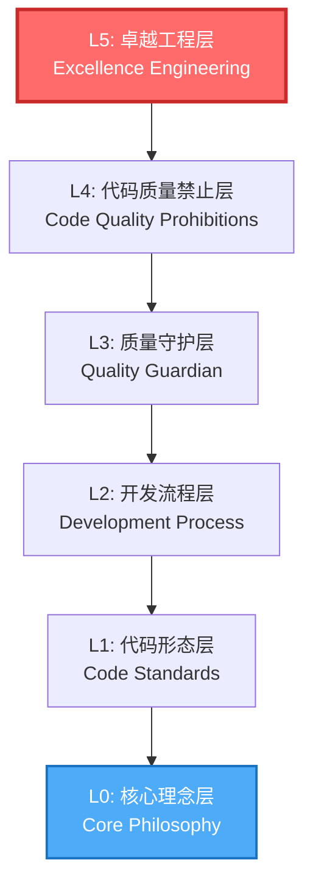

# SmartAbp 卓越工程层依赖关系说明

## 📋 文档信息
- **版本**: v1.0
- **创建日期**: 2025-10-01
- **状态**: 已接受
- **所属层级**: L5 - 卓越工程层

## 🎯 卓越工程层概述

卓越工程层（L5 - Excellence Engineering Layer）是SmartAbp项目在2025年10月新增的顶层质量保障体系，位于现有L0-L4层之上，确保所有代码达到90-100分的卓越标准。

## 🏗️ 层级关系



## 📊 依赖关系图

### 1. 规则文件依赖

```
卓越工程层依赖体系:

.cursor/rules/08_卓越工程铁律.mdc (L5)
    ├── 依赖 → 00_core_philosophy.mdc (L0)
    │   └── 提供：核心价值观、AI使命
    │
    ├── 依赖 → 01_code_standards.mdc (L1)
    │   └── 提供：命名规范、代码风格
    │
    ├── 依赖 → 02_development_process.mdc (L2)
    │   └── 提供：开发流程、TDD流程
    │
    ├── 依赖 → 03_quality_guardian.mdc (L3)
    │   └── 提供：质量门禁框架
    │   └── 被扩展：新增第五关卓越工程检查
    │
    └── 依赖 → 04_code_quality_prohibitions.mdc (L4)
        └── 提供：禁止清单、危险语法

docs/项目开发规范总览.md
    ├── 整合 → 所有铁律规则
    ├── 定义 → 专家模式执行链
    └── 新增 → 第五条铁律（卓越工程律）
```

### 2. 文档依赖

```
卓越工程文档体系:

docs/architecture/adr/0030-excellence-engineering-standards.md
    ├── 引用 → ADR-0001: 技术栈选择
    ├── 引用 → ADR-0009: 性能优化策略
    ├── 引用 → ADR-0010: 设计模式应用
    └── 引用 → ADR-0011: AI代码质量保障

docs/卓越工程铁律集成完成报告.md
    ├── 总结 → 集成成果
    ├── 提供 → 使用指南
    └── 包含 → 典型示例

docs/公共组件库卓越工程标准.md
    ├── 应用 → 卓越工程五大铁律
    ├── 定义 → 组件质量评分标准
    └── 提供 → 开发流程指南

templates/README.md
    ├── 扩展 → 模板质量标准
    └── 新增 → 卓越工程评分要求
```

### 3. 知识库依赖

```
Serena知识库:

卓越工程铁律集成-2025-10-01.md
    ├── 记录 → 集成完成状态
    ├── 提供 → 快速参考
    └── 链接 → 关键文件路径

ADR-0030
    ├── 决策 → 卓越工程标准采用
    ├── 理由 → 提升代码质量到90-100分
    └── 后果 → 预期影响分析
```

## 🔄 数据流向

### 输入依赖

```typescript
interface ExcellenceEngineeringInputs {
  // 从L0获取
  corePhilosophy: {
    qualityFirst: boolean;      // 质量至上
    architectureFirst: boolean; // 架构先行
    professionalJudgment: boolean; // 独立决策
  };
  
  // 从L1获取
  codeStandards: {
    namingConventions: NamingRules;
    typeScript: TypeScriptConfig;
    solid: SOLIDPrinciples;
  };
  
  // 从L2获取
  developmentProcess: {
    tddWorkflow: TDDProcess;
    qualityGates: QualityGate[];
    gitWorkflow: GitProcess;
  };
  
  // 从L3获取
  qualityGuardian: {
    architectureCheck: () => CheckResult;
    codeDeduplication: () => CheckResult;
    compileCheck: () => CheckResult;
    gitSync: () => SyncResult;
  };
  
  // 从L4获取
  prohibitions: {
    typeUnsafe: string[];      // as any, @ts-ignore
    architectureViolations: string[]; // @/, ../
  };
}
```

### 输出产物

```typescript
interface ExcellenceEngineeringOutputs {
  // 质量评分
  qualityScore: {
    functionality: number;    // 功能完整性 0-25
    algorithm: number;       // 算法优化 0-25
    bugPrevention: number;   // BUG预防 0-20
    performance: number;     // 性能优化 0-15
    maintainability: number; // 可维护性 0-15
    total: number;          // 总分 0-100
  };
  
  // 检查结果
  checkResults: {
    passed: boolean;
    score: number;
    improvements: Improvement[];
    mustFix: Issue[];
  };
  
  // 第一性思维分析
  firstPrinciplesAnalysis: {
    problemEssence: string;
    constraints: string[];
    possibleSolutions: string[];
    bestSolution: string;
    rationale: string;
  };
}
```

## 🔗 外部依赖

### NPM包依赖

```json
{
  "devDependencies": {
    "@typescript-eslint/eslint-plugin": "^6.0.0",
    "@typescript-eslint/parser": "^6.0.0",
    "eslint": "^8.0.0",
    "typescript": "^5.0.0",
    "vitest": "^1.0.0",
    "@vue/test-utils": "^2.4.0"
  }
}
```

### 工具依赖

```yaml
质量检查工具:
  - TypeScript: strict模式类型检查
  - ESLint: 代码规范检查
  - Vitest: 单元测试框架
  - Performance API: 性能监控
  - Git Hooks: 提交前检查
```

## 🎯 零循环依赖保证

### 单向依赖原则

```
规则层级依赖：只能向下依赖，禁止向上依赖

L5 (卓越工程) ──┐
                 ├──> L4 (代码禁止) ──┐
                 │                     ├──> L3 (质量守护) ──┐
                 │                     │                     ├──> L2 (开发流程) ──┐
                 │                     │                     │                     ├──> L1 (代码形态) ──> L0 (核心理念)
                 │                     │                     │                     │
                 └─────────────────────┴─────────────────────┴─────────────────────┘
                      ❌ 禁止反向依赖

✅ 允许：L5 → L4 → L3 → L2 → L1 → L0
❌ 禁止：L0 → L1, L1 → L2, 等任何向上依赖
```

### 检测机制

```bash
# 检测循环依赖
npm run check-circular-deps

# 验证依赖方向
npm run validate-layer-deps

# 生成依赖图
npm run generate-dep-graph
```

## 📈 依赖演化历史

### v17.0 → v18.0 (卓越工程版)

```yaml
新增依赖:
  - L5层：卓越工程铁律
  - ADR-0030：卓越工程标准决策
  - 公共组件库标准文档
  - 模板库质量扩展

更新依赖:
  - L3层：新增第五关检查
  - 项目开发规范：五条铁律
  - 专家模式：十重爆雷

保持不变:
  - L0-L4层：核心架构不变
  - 技术栈：无重大变更
  - API接口：向后兼容
```

## 🔒 依赖稳定性保证

### 版本管理

```typescript
interface DependencyVersion {
  layer: 'L0' | 'L1' | 'L2' | 'L3' | 'L4' | 'L5';
  version: string;
  breakingChanges: boolean;
  migrationGuide?: string;
}

const L5_VERSION: DependencyVersion = {
  layer: 'L5',
  version: '1.0.0',
  breakingChanges: false, // 新增层，无破坏性变更
  migrationGuide: undefined
};
```

### 兼容性承诺

```yaml
向后兼容性:
  - L0-L4层：100%兼容
  - 现有代码：无需修改
  - API接口：完全兼容
  - 配置文件：无需更新

向前兼容性:
  - 新代码：强制执行L5标准
  - 旧代码：渐进式升级
  - 混合模式：支持共存
```

## 🚀 使用建议

### 开发者视角

```typescript
// 1. 理解层级关系
const layerHierarchy = [
  'L0: 核心理念 - 理解AI使命',
  'L1: 代码形态 - 学习编码规范',
  'L2: 开发流程 - 遵循开发流程',
  'L3: 质量守护 - 通过质量门禁',
  'L4: 代码禁止 - 避免危险语法',
  'L5: 卓越工程 - 追求卓越品质' // ⭐重点关注
];

// 2. 检查依赖完整性
function checkDependencies() {
  const required = [
    'L0已加载',
    'L1已理解',
    'L2已遵循',
    'L3已通过',
    'L4已避免',
    'L5已达标'
  ];
  return required.every(check => isCompleted(check));
}

// 3. 执行卓越工程检查
async function runExcellenceCheck() {
  const score = await calculateExcellenceScore();
  if (score.total < 90) {
    throw new Error('未达到卓越工程标准（≥90分）');
  }
  return score;
}
```

### AI视角

```typescript
// AI必须理解并执行的依赖链
const AI_EXECUTION_CHAIN = [
  '1. 加载L0-L4层规则',
  '2. 执行编程前五项学习',
  '3. 应用卓越工程五大铁律',
  '4. 实时追踪代码行数（300行）',
  '5. 执行六重质量门禁',
  '6. 验证卓越工程评分（≥90分）',
  '7. Git同步并继续下一任务'
];
```

## 📚 参考文档

### 内部文档
- [ADR-0030: 卓越工程标准](./adr/0030-excellence-engineering-standards.md)
- [卓越工程铁律](../../.cursor/rules/08_卓越工程铁律.mdc)
- [质量守护层](../../.cursor/rules/03_quality_guardian.mdc)
- [项目开发规范总览](../项目开发规范总览.md)

### 外部参考
- Google Engineering Practices
- Facebook Development Standards
- Microsoft Coding Guidelines
- SOLID Principles
- Clean Code by Robert C. Martin

---

**记住：卓越工程层是质量保障的最后一道防线，必须100%执行！**

🔥 **依赖清晰 = 架构稳定 = 质量卓越！**

