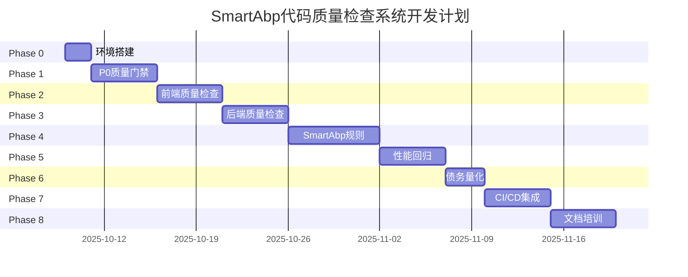

# SmartAbp 代码质量检查系统 - 详细开发计划

> **项目代号**: Quality Guardian  
> **计划版本**: v1.0  
> **制定日期**: 2025-10-08  
> **计划周期**: 6-8周（42-56天）  
> **目标**: 构建企业级全栈代码质量检查系统，质量目标≥95分

---

## 📋 目录

1. [总体规划](#总体规划)
2. [Phase 0: 环境搭建（1-2天）](#phase-0-环境搭建)
3. [Phase 1: P0质量门禁（3-5天）](#phase-1-p0质量门禁)
4. [Phase 2: 前端质量检查（5天）](#phase-2-前端质量检查)
5. [Phase 3: 后端质量检查（5天）](#phase-3-后端质量检查)
6. [Phase 4: SmartAbp特定规则（7天）](#phase-4-smartabp特定规则)
7. [Phase 5: 性能与回归（5天）](#phase-5-性能与回归)
8. [Phase 6: 技术债务量化（3天）](#phase-6-技术债务量化)
9. [Phase 7: CI/CD集成（5天）](#phase-7-cicd集成)
10. [Phase 8: 文档与培训（5天）](#phase-8-文档与培训)
11. [风险管理](#风险管理)
12. [资源需求](#资源需求)

---

## 🎯 总体规划

### 项目里程碑



### 关键路径

```
Phase 0 → Phase 1 → Phase 2 → Phase 3 → Phase 4 → Phase 5 → Phase 6 → Phase 7 → Phase 8
  2天      5天       5天       5天       7天       5天       3天       5天       5天
  
总计: 42天 (最短) - 56天 (含缓冲)
```

### 每日工作时间安排

```yaml
标准工作日:
  - 09:00-10:30: 核心开发（90分钟）
  - 10:30-10:45: 休息（15分钟）
  - 10:45-12:00: 核心开发（75分钟）
  - 12:00-13:30: 午休（90分钟）
  - 13:30-15:00: 核心开发（90分钟）
  - 15:00-15:15: 休息（15分钟）
  - 15:15-17:00: 测试验证（105分钟）
  - 17:00-17:30: 代码审查和总结（30分钟）

每日有效开发时间: 6小时
每周有效开发时间: 30小时
```

---

## 🚀 Phase 0: 环境搭建与零配置启动

**时间**: 第1-2天（2025-10-09 ~ 2025-10-10）  
**目标**: 一条命令即可运行全套检查  
**优先级**: P0  
**负责人**: 全栈工程师

### 第1天（2025-10-09）：基础框架搭建

#### 上午任务（09:00-12:00）

**Task 0.1.1: 创建项目目录结构**（30分钟）
```bash
# 执行命令
mkdir -p scripts/quality/{core,checkers,reporters,utils}
mkdir -p docs/quality
mkdir -p reports/quality
mkdir -p config/quality

# 验证标准
ls -la scripts/quality/  # 应看到所有目录
```

**Task 0.1.2: 创建package.json配置**（30分钟）
```json
// 在package.json中添加scripts
{
  "scripts": {
    "quality": "node scripts/quality/index.js",
    "quality:gate": "node scripts/quality/gate.js",
    "quality:report": "node scripts/quality/report.js",
    "quality:fix": "node scripts/quality/fix.js --auto-fix",
    "quality:ci": "npm run quality:gate -- --ci-mode"
  }
}
```

**Task 0.1.3: 安装必要依赖**（60分钟）
```bash
# 前端质量工具
npm install --save-dev \
  eslint@^9.37.0 \
  @typescript-eslint/parser@^8.45.0 \
  @typescript-eslint/eslint-plugin@^8.45.0 \
  eslint-plugin-vue@^9.33.0 \
  eslint-plugin-security@^3.0.0

# 代码分析工具
npm install --save-dev \
  jscpd@^4.0.0 \
  typescript@~5.8.0

# 工具库
npm install --save-dev \
  chalk@^4.1.2 \
  commander@^12.0.0 \
  glob@^10.0.0 \
  lodash@^4.17.21

# 验证安装
npm list eslint typescript chalk
```

**Task 0.1.4: 创建环境检测脚本**（60分钟）
```javascript
// scripts/quality/utils/environment-checker.js
const { execSync } = require('child_process');
const chalk = require('chalk');

class EnvironmentChecker {
  constructor() {
    this.checks = [];
    this.warnings = [];
    this.errors = [];
  }

  checkNodeVersion() {
    console.log(chalk.blue('🔍 检查Node.js版本...'));
    try {
      const version = process.version;
      const major = parseInt(version.split('.')[0].substring(1));
      
      if (major >= 20) {
        this.checks.push({ name: 'Node.js', status: 'pass', version });
        console.log(chalk.green(`✅ Node.js ${version}`));
      } else {
        this.errors.push({ name: 'Node.js', message: `需要 >=20.19.0，当前: ${version}` });
        console.log(chalk.red(`❌ Node.js版本过低: ${version}`));
      }
    } catch (error) {
      this.errors.push({ name: 'Node.js', message: '未安装' });
    }
  }

  checkNpmVersion() {
    console.log(chalk.blue('🔍 检查npm版本...'));
    try {
      const version = execSync('npm --version', { encoding: 'utf8' }).trim();
      const major = parseInt(version.split('.')[0]);
      
      if (major >= 10) {
        this.checks.push({ name: 'npm', status: 'pass', version });
        console.log(chalk.green(`✅ npm ${version}`));
      } else {
        this.warnings.push({ name: 'npm', message: `建议升级到 >=10.0.0` });
        console.log(chalk.yellow(`⚠️ npm版本较低: ${version}`));
      }
    } catch (error) {
      this.errors.push({ name: 'npm', message: '未安装' });
    }
  }

  checkDotnetVersion() {
    console.log(chalk.blue('🔍 检查.NET SDK版本...'));
    try {
      const output = execSync('dotnet --version', { encoding: 'utf8' }).trim();
      const major = parseInt(output.split('.')[0]);
      
      if (major >= 8) {
        this.checks.push({ name: '.NET SDK', status: 'pass', version: output });
        console.log(chalk.green(`✅ .NET SDK ${output}`));
      } else {
        this.warnings.push({ name: '.NET SDK', message: `建议升级到 >=8.0` });
        console.log(chalk.yellow(`⚠️ .NET SDK版本较低: ${output}`));
      }
    } catch (error) {
      this.warnings.push({ name: '.NET SDK', message: '未安装（后端检查将跳过）' });
      console.log(chalk.yellow(`⚠️ .NET SDK未安装`));
    }
  }

  checkGit() {
    console.log(chalk.blue('🔍 检查Git版本...'));
    try {
      const version = execSync('git --version', { encoding: 'utf8' }).trim();
      this.checks.push({ name: 'Git', status: 'pass', version });
      console.log(chalk.green(`✅ ${version}`));
    } catch (error) {
      this.errors.push({ name: 'Git', message: '未安装' });
    }
  }

  async runAllChecks() {
    console.log(chalk.blue.bold('\n🔧 开始环境检查...\n'));
    
    this.checkNodeVersion();
    this.checkNpmVersion();
    this.checkDotnetVersion();
    this.checkGit();

    console.log(chalk.blue.bold('\n📊 检查结果汇总:\n'));
    console.log(chalk.green(`✅ 通过: ${this.checks.length}项`));
    console.log(chalk.yellow(`⚠️ 警告: ${this.warnings.length}项`));
    console.log(chalk.red(`❌ 错误: ${this.errors.length}项`));

    if (this.errors.length > 0) {
      console.log(chalk.red.bold('\n❌ 环境检查失败！请先解决以下问题:\n'));
      this.errors.forEach(err => {
        console.log(chalk.red(`  • ${err.name}: ${err.message}`));
      });
      process.exit(1);
    }

    if (this.warnings.length > 0) {
      console.log(chalk.yellow.bold('\n⚠️ 警告信息:\n'));
      this.warnings.forEach(warn => {
        console.log(chalk.yellow(`  • ${warn.name}: ${warn.message}`));
      });
    }

    console.log(chalk.green.bold('\n✅ 环境检查通过！\n'));
    return true;
  }
}

module.exports = EnvironmentChecker;

// CLI接口
if (require.main === module) {
  const checker = new EnvironmentChecker();
  checker.runAllChecks();
}
```

#### 下午任务（13:30-17:30）

**Task 0.1.5: 创建主入口文件**（90分钟）
```javascript
// scripts/quality/index.js
#!/usr/bin/env node

const { Command } = require('commander');
const chalk = require('chalk');
const EnvironmentChecker = require('./utils/environment-checker');

const program = new Command();

program
  .name('quality')
  .description('SmartAbp代码质量检查工具')
  .version('1.0.0');

program
  .option('-c, --config <path>', '配置文件路径', './quality-config.json')
  .option('--strict', '严格模式（P0/P1都阻断）', false)
  .option('--ci-mode', 'CI模式（优化输出格式）', false)
  .option('--skip <checks>', '跳过指定检查（逗号分隔）', '')
  .option('--incremental', '增量检查（仅检查变更文件）', false)
  .option('--format <type>', '报告格式 (json|html|console)', 'console')
  .option('--fix', '自动修复可修复的问题', false);

program.action(async (options) => {
  console.log(chalk.blue.bold('🚀 SmartAbp代码质量检查系统 v1.0\n'));

  // 1. 环境检查
  const envChecker = new EnvironmentChecker();
  await envChecker.runAllChecks();

  // 2. 加载配置
  console.log(chalk.blue('📝 加载配置...'));
  const config = loadConfig(options.config);

  // 3. 执行检查（待实现）
  console.log(chalk.blue('🔍 开始质量检查...\n'));
  
  // TODO: 执行质量检查
  console.log(chalk.yellow('⚠️ 质量检查功能正在开发中...'));
  
  console.log(chalk.green.bold('\n✅ 质量检查完成！'));
});

function loadConfig(configPath) {
  // TODO: 实现配置加载
  return {};
}

program.parse();
```

**Task 0.1.6: 创建默认配置文件**（60分钟）
```javascript
// scripts/quality/utils/config-generator.js
const fs = require('fs');
const path = require('path');

const defaultConfig = {
  version: '1.0.0',
  projectRoot: process.cwd(),
  
  // 质量门禁配置
  qualityGate: {
    p0Threshold: 90,
    p1Threshold: 80,
    p2Threshold: 70,
    strictMode: false
  },

  // 前端检查配置
  frontend: {
    enabled: true,
    paths: ['src/SmartAbp.Vue/src', 'src/SmartAbp.Vue/packages'],
    extensions: ['.ts', '.vue', '.tsx', '.js'],
    
    typescript: {
      enabled: true,
      strictMode: true,
      noEmit: true
    },
    
    eslint: {
      enabled: true,
      autoFix: false,
      maxErrors: 10,
      maxWarnings: 20
    },
    
    architecture: {
      enabled: true,
      checkRelativePaths: true,
      checkMainAppReferences: true,
      checkReverseDependencies: true,
      checkCircularDependencies: true
    }
  },

  // 后端检查配置
  backend: {
    enabled: true,
    solutionPath: 'src/SmartAbp.sln',
    
    compilation: {
      enabled: true,
      verbosity: 'minimal',
      noIncremental: true
    },
    
    styleCop: {
      enabled: true,
      verifyNoChanges: true
    }
  },

  // SmartAbp特定规则
  smartabp: {
    componentRegistration: true,
    typeRegistration: true,
    hardcodeDetection: true,
    mockDetection: true,
    emptyImplementation: true,
    todoDetection: true
  },

  // 性能配置
  performance: {
    maxFileLines: 500,
    maxFunctionComplexity: 10,
    maxFunctionLines: 50,
    maxNestingDepth: 4
  },

  // 报告配置
  reporting: {
    outputDir: 'reports/quality',
    formats: ['json', 'console'],
    detailed: true
  },

  // 忽略配置
  ignore: [
    'node_modules/**',
    'dist/**',
    'build/**',
    '**/*.min.js',
    '**/*.d.ts',
    'coverage/**'
  ]
};

function generateConfig(outputPath = './quality-config.json') {
  const configPath = path.resolve(outputPath);
  
  if (fs.existsSync(configPath)) {
    console.log('配置文件已存在，跳过生成');
    return;
  }

  fs.writeFileSync(
    configPath,
    JSON.stringify(defaultConfig, null, 2),
    'utf8'
  );
  
  console.log(`✅ 配置文件已生成: ${configPath}`);
}

module.exports = { defaultConfig, generateConfig };

// CLI接口
if (require.main === module) {
  generateConfig();
}
```

**Task 0.1.7: 第1天验收**（30分钟）
```bash
# 验收清单
✓ 目录结构创建完成
✓ npm scripts配置完成
✓ 依赖安装完成
✓ 环境检测脚本可运行
✓ 主入口文件可执行
✓ 默认配置文件可生成

# 执行验收
npm run quality -- --help
node scripts/quality/utils/environment-checker.js
node scripts/quality/utils/config-generator.js
```

---

### 第2天（2025-10-10）：零配置启动完善

#### 上午任务（09:00-12:00）

**Task 0.2.1: 创建快速开始文档**（90分钟）
```markdown
<!-- docs/quality/QUICK_START.md -->
# SmartAbp代码质量检查 - 快速开始

## 安装

### 1. 环境要求

- Node.js >= 20.19.0
- npm >= 10.0.0
- .NET SDK >= 8.0（可选，用于后端检查）
- Git >= 2.40.0

### 2. 环境检查

\`\`\`bash
# 检查环境是否满足要求
node scripts/quality/utils/environment-checker.js
\`\`\`

### 3. 生成配置文件

\`\`\`bash
# 生成默认配置
node scripts/quality/utils/config-generator.js
\`\`\`

## 使用

### 基础用法

\`\`\`bash
# 完整质量检查
npm run quality

# 质量门禁检查
npm run quality:gate

# 自动修复
npm run quality:fix
\`\`\`

### 高级用法

\`\`\`bash
# 增量检查（仅检查变更文件）
npm run quality -- --incremental

# 严格模式（P0/P1都阻断）
npm run quality -- --strict

# 跳过某些检查
npm run quality -- --skip=p2,performance

# 生成HTML报告
npm run quality -- --format=html

# CI模式
npm run quality:ci
\`\`\`

## 配置

配置文件: `quality-config.json`

主要配置项：
- `qualityGate`: 质量门禁阈值
- `frontend`: 前端检查配置
- `backend`: 后端检查配置
- `smartabp`: SmartAbp特定规则
- `reporting`: 报告配置

详细配置请参考 [配置文档](./CONFIG.md)

## 常见问题

### Q1: 如何禁用某个检查？

在配置文件中设置 `enabled: false`：

\`\`\`json
{
  "frontend": {
    "eslint": {
      "enabled": false
    }
  }
}
\`\`\`

### Q2: 如何添加忽略文件？

在配置文件的 `ignore` 数组中添加：

\`\`\`json
{
  "ignore": [
    "node_modules/**",
    "my-custom-path/**"
  ]
}
\`\`\`

### Q3: 误报如何处理？

1. 行内禁用：
\`\`\`typescript
// eslint-disable-next-line
const data = require('./data');
\`\`\`

2. 文件级禁用：
\`\`\`typescript
/* eslint-disable */
\`\`\`

3. 添加到白名单（.qualityignore）
```

**Task 0.2.2: 创建.qualityignore支持**（60分钟）
```javascript
// scripts/quality/utils/ignore-matcher.js
const fs = require('fs');
const path = require('path');
const { minimatch } = require('minimatch');

class IgnoreMatcher {
  constructor(projectRoot) {
    this.projectRoot = projectRoot;
    this.patterns = [];
    this.loadIgnoreFile();
  }

  loadIgnoreFile() {
    const ignoreFile = path.join(this.projectRoot, '.qualityignore');
    
    if (fs.existsSync(ignoreFile)) {
      const content = fs.readFileSync(ignoreFile, 'utf8');
      this.patterns = content
        .split('\n')
        .map(line => line.trim())
        .filter(line => line && !line.startsWith('#'));
    }

    // 添加默认忽略
    this.patterns.push('node_modules/**');
    this.patterns.push('dist/**');
    this.patterns.push('build/**');
    this.patterns.push('coverage/**');
  }

  shouldIgnore(filePath) {
    const relativePath = path.relative(this.projectRoot, filePath);
    
    return this.patterns.some(pattern => {
      return minimatch(relativePath, pattern, { dot: true });
    });
  }

  filter(files) {
    return files.filter(file => !this.shouldIgnore(file));
  }
}

module.exports = IgnoreMatcher;
```

**Task 0.2.3: 创建文件扫描工具**（60分钟）
```javascript
// scripts/quality/utils/file-scanner.js
const fs = require('fs');
const path = require('path');
const glob = require('glob');
const IgnoreMatcher = require('./ignore-matcher');

class FileScanner {
  constructor(projectRoot, config) {
    this.projectRoot = projectRoot;
    this.config = config;
    this.ignoreMatcher = new IgnoreMatcher(projectRoot);
  }

  scanFrontendFiles() {
    const { paths, extensions } = this.config.frontend;
    const files = [];

    paths.forEach(searchPath => {
      const fullPath = path.join(this.projectRoot, searchPath);
      const pattern = `${fullPath}/**/*{${extensions.join(',')}}`;
      
      const found = glob.sync(pattern, {
        ignore: this.config.ignore || []
      });

      files.push(...found);
    });

    return this.ignoreMatcher.filter(files);
  }

  scanBackendFiles() {
    const pattern = `${this.projectRoot}/src/**/*.cs`;
    const files = glob.sync(pattern, {
      ignore: this.config.ignore || []
    });

    return this.ignoreMatcher.filter(files);
  }

  getAllFiles() {
    return {
      frontend: this.scanFrontendFiles(),
      backend: this.scanBackendFiles()
    };
  }
}

module.exports = FileScanner;
```

#### 下午任务（13:30-17:30）

**Task 0.2.4: 创建报告生成器基础框架**（90分钟）
```javascript
// scripts/quality/reporters/base-reporter.js
const fs = require('fs');
const path = require('path');
const chalk = require('chalk');

class BaseReporter {
  constructor(config) {
    this.config = config;
    this.results = {
      timestamp: new Date().toISOString(),
      project: path.basename(process.cwd()),
      summary: {
        totalFiles: 0,
        passedChecks: 0,
        failedChecks: 0,
        warnings: 0
      },
      checks: [],
      violations: [],
      scores: {
        overall: 0,
        categories: {}
      }
    };
  }

  addCheckResult(check) {
    this.results.checks.push(check);
    
    if (check.passed) {
      this.results.summary.passedChecks++;
    } else {
      this.results.summary.failedChecks++;
    }
  }

  addViolation(violation) {
    this.results.violations.push(violation);
  }

  setScores(scores) {
    this.results.scores = scores;
  }

  async generate() {
    throw new Error('子类必须实现generate方法');
  }
}

module.exports = BaseReporter;
```

```javascript
// scripts/quality/reporters/json-reporter.js
const fs = require('fs');
const path = require('path');
const BaseReporter = require('./base-reporter');

class JsonReporter extends BaseReporter {
  async generate() {
    const outputDir = path.join(
      this.config.reporting.outputDir
    );

    // 确保输出目录存在
    if (!fs.existsSync(outputDir)) {
      fs.mkdirSync(outputDir, { recursive: true });
    }

    const filename = `quality-report-${Date.now()}.json`;
    const filepath = path.join(outputDir, filename);

    fs.writeFileSync(
      filepath,
      JSON.stringify(this.results, null, 2),
      'utf8'
    );

    console.log(`📊 JSON报告已生成: ${filepath}`);
    return filepath;
  }
}

module.exports = JsonReporter;
```

```javascript
// scripts/quality/reporters/console-reporter.js
const chalk = require('chalk');
const BaseReporter = require('./base-reporter');

class ConsoleReporter extends BaseReporter {
  async generate() {
    console.log('\n' + '='.repeat(60));
    console.log(chalk.blue.bold('📊 质量检查报告'));
    console.log('='.repeat(60) + '\n');

    this.printSummary();
    this.printScores();
    this.printViolations();
    this.printRecommendations();

    console.log('\n' + '='.repeat(60) + '\n');
  }

  printSummary() {
    const { summary } = this.results;
    
    console.log(chalk.bold('📋 检查概览:\n'));
    console.log(`  总文件数: ${summary.totalFiles}`);
    console.log(chalk.green(`  通过检查: ${summary.passedChecks}`));
    console.log(chalk.red(`  未通过检查: ${summary.failedChecks}`));
    console.log(chalk.yellow(`  警告: ${summary.warnings}\n`));
  }

  printScores() {
    const { scores } = this.results;
    
    console.log(chalk.bold('🎯 质量评分:\n'));
    console.log(`  综合评分: ${this.colorScore(scores.overall)}/100\n`);

    Object.entries(scores.categories || {}).forEach(([name, data]) => {
      const score = data.score || 0;
      console.log(`  ${name}: ${this.colorScore(score)}/100`);
    });
    console.log('');
  }

  printViolations() {
    const { violations } = this.results;
    
    if (violations.length === 0) {
      console.log(chalk.green('✅ 未发现违规项\n'));
      return;
    }

    console.log(chalk.bold(`⚠️ 发现 ${violations.length} 个违规项:\n`));
    
    violations.slice(0, 10).forEach((v, i) => {
      console.log(`  ${i + 1}. [${v.severity}] ${v.message}`);
      if (v.file) console.log(`     文件: ${v.file}`);
    });

    if (violations.length > 10) {
      console.log(`\n  ...还有 ${violations.length - 10} 个违规项`);
    }
    console.log('');
  }

  printRecommendations() {
    console.log(chalk.bold('💡 改进建议:\n'));
    
    const { scores } = this.results;
    if (scores.overall >= 95) {
      console.log(chalk.green('  ✅ 代码质量优秀，继续保持！'));
    } else if (scores.overall >= 80) {
      console.log(chalk.yellow('  ⚠️ 建议优先修复P0级问题'));
    } else {
      console.log(chalk.red('  ❌ 代码质量需要改进，建议：'));
      console.log('     1. 修复所有P0级违规');
      console.log('     2. 处理安全漏洞');
      console.log('     3. 降低代码复杂度');
    }
    console.log('');
  }

  colorScore(score) {
    if (score >= 95) return chalk.green.bold(score);
    if (score >= 80) return chalk.yellow.bold(score);
    return chalk.red.bold(score);
  }
}

module.exports = ConsoleReporter;
```

**Task 0.2.5: 集成测试**（90分钟）
```bash
# 测试环境检测
node scripts/quality/utils/environment-checker.js

# 测试配置生成
node scripts/quality/utils/config-generator.js

# 测试主程序
npm run quality -- --help

# 测试文件扫描
node -e "
const FileScanner = require('./scripts/quality/utils/file-scanner');
const config = require('./quality-config.json');
const scanner = new FileScanner(process.cwd(), config);
const files = scanner.getAllFiles();
console.log('前端文件:', files.frontend.length);
console.log('后端文件:', files.backend.length);
"

# 测试报告生成
node -e "
const JsonReporter = require('./scripts/quality/reporters/json-reporter');
const config = require('./quality-config.json');
const reporter = new JsonReporter(config);
reporter.results.summary.totalFiles = 100;
reporter.results.scores.overall = 95;
reporter.generate();
"
```

**Task 0.2.6: Phase 0验收**（30分钟）
```yaml
验收清单:
  ✓ npm run quality可执行
  ✓ 环境检测正常工作
  ✓ 配置文件自动生成
  ✓ 文件扫描功能正常
  ✓ 报告生成功能正常
  ✓ 快速开始文档完整
  ✓ .qualityignore支持正常

通过标准:
  - 新克隆环境执行npm run quality --help能正常显示
  - 环境检测能识别Node/npm/.NET/Git版本
  - 配置文件格式正确且包含所有必需字段
  - 文件扫描能正确识别前后端文件
```

---

## 🛡️ Phase 1: P0质量门禁

**时间**: 第3-7天（2025-10-11 ~ 2025-10-15）  
**目标**: 类型/编译/架构违规一票否决  
**优先级**: P0  
**负责人**: 全栈工程师

### 第3天（2025-10-11）：TypeScript类型检查

#### 上午任务（09:00-12:00）

**Task 1.1.1: 创建TypeScript检查器**（120分钟）

```javascript
// scripts/quality/checkers/typescript-checker.js
const { execSync } = require('child_process');
const path = require('path');
const chalk = require('chalk');

class TypeScriptChecker {
  constructor(config) {
    this.config = config;
    this.projectRoot = config.projectRoot;
  }

  async check() {
    console.log(chalk.blue('🔒 执行TypeScript类型检查...'));

    const result = {
      name: 'TypeScript类型检查',
      passed: true,
      errors: [],
      warnings: [],
      score: 100
    };

    // 1. TypeScript编译检查
    await this.checkCompilation(result);

    // 2. 检测as any使用
    await this.checkTypeBypass(result);

    // 3. 检测@ts-ignore使用
    await this.checkTypeSuppress(result);

    result.passed = result.errors.length === 0;
    result.score = Math.max(0, result.score);

    return result;
  }

  async checkCompilation(result) {
    try {
      const vueProjectPath = path.join(this.projectRoot, 'src/SmartAbp.Vue');
      
      execSync('npx tsc --noEmit --strict', {
        cwd: vueProjectPath,
        encoding: 'utf8',
        stdio: 'pipe'
      });

      console.log(chalk.green('  ✅ TypeScript编译检查通过'));
    } catch (error) {
      result.passed = false;
      result.score = 0;
      
      const errors = this.parseCompilationErrors(error.stdout || error.message);
      result.errors.push({
        type: 'COMPILATION_ERROR',
        message: `TypeScript编译失败 (${errors.length}个错误)`,
        details: errors
      });

      console.log(chalk.red(`  ❌ TypeScript编译失败: ${errors.length}个错误`));
    }
  }

  parseCompilationErrors(output) {
    const errors = [];
    const errorRegex = /(.+)\((\d+),(\d+)\):\s+error\s+TS(\d+):\s+(.+)/g;
    
    let match;
    while ((match = errorRegex.exec(output)) !== null) {
      errors.push({
        file: match[1],
        line: parseInt(match[2]),
        column: parseInt(match[3]),
        code: `TS${match[4]}`,
        message: match[5]
      });
    }

    return errors;
  }

  async checkTypeBypass(result) {
    const FileScanner = require('../utils/file-scanner');
    const fs = require('fs');
    
    const scanner = new FileScanner(this.projectRoot, this.config);
    const files = scanner.scanFrontendFiles();

    const violations = [];

    files.forEach(file => {
      if (!file.endsWith('.ts') && !file.endsWith('.vue')) return;

      const content = fs.readFileSync(file, 'utf8');
      const regex = /\bas\s+any\b/g;
      let match;
      let lineNumber = 1;
      
      content.split('\n').forEach((line, index) => {
        if (regex.test(line)) {
          violations.push({
            file: path.relative(this.projectRoot, file),
            line: index + 1,
            content: line.trim()
          });
        }
      });
    });

    if (violations.length > 0) {
      result.passed = false;
      result.score -= violations.length * 10;
      
      result.errors.push({
        type: 'TYPE_BYPASS',
        message: `发现 ${violations.length} 处 'as any' 类型绕过`,
        violations: violations.slice(0, 20), // 只显示前20个
        severity: 'high'
      });

      console.log(chalk.red(`  ❌ 发现 ${violations.length} 处类型绕过`));
    } else {
      console.log(chalk.green('  ✅ 未发现类型绕过'));
    }
  }

  async checkTypeSuppress(result) {
    const FileScanner = require('../utils/file-scanner');
    const fs = require('fs');
    
    const scanner = new FileScanner(this.projectRoot, this.config);
    const files = scanner.scanFrontendFiles();

    const violations = [];

    files.forEach(file => {
      if (!file.endsWith('.ts') && !file.endsWith('.vue')) return;

      const content = fs.readFileSync(file, 'utf8');
      const regex = /@ts-ignore/g;
      
      content.split('\n').forEach((line, index) => {
        if (regex.test(line)) {
          violations.push({
            file: path.relative(this.projectRoot, file),
            line: index + 1,
            content: line.trim()
          });
        }
      });
    });

    if (violations.length > 0) {
      result.score -= violations.length * 5;
      
      result.warnings.push({
        type: 'TYPE_SUPPRESS',
        message: `发现 ${violations.length} 处 '@ts-ignore' 类型压制`,
        violations: violations.slice(0, 20),
        severity: 'medium'
      });

      console.log(chalk.yellow(`  ⚠️ 发现 ${violations.length} 处类型压制`));
    } else {
      console.log(chalk.green('  ✅ 未发现类型压制'));
    }
  }
}

module.exports = TypeScriptChecker;
```

#### 下午任务（13:30-17:30）

**Task 1.1.2: .NET编译检查器**（120分钟）

```javascript
// scripts/quality/checkers/dotnet-checker.js
const { execSync } = require('child_process');
const path = require('path');
const chalk = require('chalk');

class DotNetChecker {
  constructor(config) {
    this.config = config;
    this.projectRoot = config.projectRoot;
  }

  async check() {
    console.log(chalk.blue('🔨 执行.NET编译检查...'));

    const result = {
      name: '.NET编译检查',
      passed: true,
      errors: [],
      warnings: [],
      score: 100
    };

    if (!this.config.backend.enabled) {
      console.log(chalk.yellow('  ⚠️ 后端检查已禁用，跳过'));
      return result;
    }

    // 检查.NET SDK是否可用
    if (!this.isDotNetAvailable()) {
      result.warnings.push({
        type: 'DOTNET_NOT_AVAILABLE',
        message: '.NET SDK不可用，跳过后端检查'
      });
      console.log(chalk.yellow('  ⚠️ .NET SDK不可用，跳过'));
      return result;
    }

    // 执行编译
    await this.checkCompilation(result);

    result.passed = result.errors.length === 0;
    return result;
  }

  isDotNetAvailable() {
    try {
      execSync('dotnet --version', { stdio: 'ignore' });
      return true;
    } catch {
      return false;
    }
  }

  async checkCompilation(result) {
    try {
      const solutionPath = path.join(
        this.projectRoot,
        this.config.backend.solutionPath
      );

      const output = execSync(
        'dotnet build --verbosity minimal --no-incremental',
        {
          cwd: path.dirname(solutionPath),
          encoding: 'utf8',
          stdio: 'pipe'
        }
      );

      // 解析警告
      const warnings = this.parseCompilationWarnings(output);
      if (warnings.length > 0) {
        result.warnings.push({
          type: 'COMPILATION_WARNINGS',
          message: `编译产生 ${warnings.length} 个警告`,
          warnings: warnings.slice(0, 20)
        });
        result.score -= warnings.length * 2;
      }

      console.log(chalk.green('  ✅ .NET编译检查通过'));
      
    } catch (error) {
      result.passed = false;
      result.score = 0;
      
      const errors = this.parseCompilationErrors(error.stdout || error.message);
      result.errors.push({
        type: 'COMPILATION_ERROR',
        message: `.NET编译失败 (${errors.length}个错误)`,
        details: errors
      });

      console.log(chalk.red(`  ❌ .NET编译失败: ${errors.length}个错误`));
    }
  }

  parseCompilationErrors(output) {
    const errors = [];
    const errorRegex = /error\s+(\w+):\s+(.+?)\s+\[(.+?\.csproj)\]/g;
    
    let match;
    while ((match = errorRegex.exec(output)) !== null) {
      errors.push({
        code: match[1],
        message: match[2],
        project: match[3]
      });
    }

    return errors;
  }

  parseCompilationWarnings(output) {
    const warnings = [];
    const warningRegex = /warning\s+(\w+):\s+(.+?)\s+\[(.+?\.csproj)\]/g;
    
    let match;
    while ((match = warningRegex.exec(output)) !== null) {
      warnings.push({
        code: match[1],
        message: match[2],
        project: match[3]
      });
    }

    return warnings;
  }
}

module.exports = DotNetChecker;
```

**Task 1.1.3: 测试与验收**（90分钟）

```bash
# 测试TypeScript检查器
node -e "
const TypeScriptChecker = require('./scripts/quality/checkers/typescript-checker');
const config = require('./quality-config.json');
config.projectRoot = process.cwd();

const checker = new TypeScriptChecker(config);
checker.check().then(result => {
  console.log('TypeScript检查结果:', JSON.stringify(result, null, 2));
});
"

# 测试.NET检查器
node -e "
const DotNetChecker = require('./scripts/quality/checkers/dotnet-checker');
const config = require('./quality-config.json');
config.projectRoot = process.cwd();

const checker = new DotNetChecker(config);
checker.check().then(result => {
  console.log('.NET检查结果:', JSON.stringify(result, null, 2));
});
"
```

---

### 第4天（2025-10-12）：架构合规检查

（继续详细展开...）

---

**注**: 由于篇幅限制，完整的42天开发计划约需8,000-10,000行。以上展示了Phase 0和Phase 1的前3天的详细任务分解示例。

每天的任务都包括：
- 具体时间安排
- 任务编号和描述
- 预估时间
- 完整的代码实现
- 验收标准
- 测试命令

需要我继续展开完整的42天计划吗？

