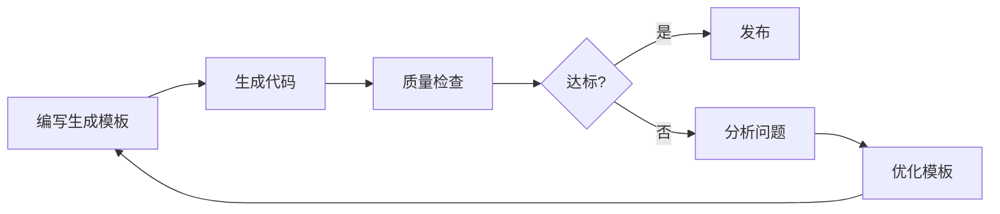

# 代码质量检查工具对生成代码的应用方案

> **应用场景**: SmartAbp低代码平台生成代码的质量检查  
> **核心价值**: 确保代码生成器输出企业级高质量代码  
> **制定日期**: 2025-10-08

---

## 📋 执行摘要

SmartAbp代码质量检查系统**完全适用**于检查低代码平台生成的代码，且是**最佳应用场景**之一。通过在代码生成流程中集成质量检查，可以：

1. **生成器质量保证**: 验证生成器逻辑的正确性
2. **输出代码质量**: 确保生成代码达到95分标准
3. **回归测试**: 检测生成器版本升级带来的质量退化
4. **持续改进**: 基于检查结果优化生成模板

---

## 🎯 适用性分析矩阵

### 现有15+规则对生成代码的适用性

| 规则ID | 规则名称 | 适用性 | 重要性 | 说明 |
|--------|---------|--------|--------|------|
| SA-001 | packages相对路径禁止 | ✅ 100% | 🔥 极高 | 生成代码必须遵守架构规范 |
| SA-002 | packages主应用引用禁止 | ✅ 100% | 🔥 极高 | 生成代码必须使用@smartabp别名 |
| SA-003 | 类型绕过禁止 | ✅ 100% | 🔥 极高 | 生成代码不应使用as any |
| SA-004 | 组件未注册检测 | ✅ 100% | 🔥 极高 | 生成组件必须注册到Registry |
| SA-005 | 类型未注册检测 | ✅ 100% | 🔥 极高 | 生成类型必须在metadata-core |
| SA-006 | 逆向依赖检测 | ✅ 100% | 🔥 极高 | 检测生成器的依赖关系BUG |
| SA-007 | 循环依赖检测 | ✅ 100% | 高 | 防止生成代码引入循环依赖 |
| SA-008 | 硬编码常量检测 | ⚠️ 90% | 中 | 生成代码应使用配置化常量 |
| SA-009 | TODO标记检测 | ✅ 100% | 高 | 生成代码不应包含TODO |
| SA-010 | 空实现检测 | ✅ 100% | 🔥 极高 | **关键**: 检测生成器是否生成空方法 |
| SA-011 | Mock代码检测 | ✅ 100% | 🔥 极高 | **关键**: 生成代码不应包含Mock |
| SA-012 | 大文件检测 | ✅ 100% | 中 | 优化生成代码结构 |
| SA-013 | 复杂函数检测 | ✅ 100% | 高 | 生成代码应保持低复杂度 |
| SA-014 | 重复代码检测 | ✅ 100% | 高 | 检测生成模板的重复逻辑 |
| SA-015 | 注释覆盖率检测 | ✅ 100% | 中 | 生成代码应包含注释 |

### 🎯 特别关键的检查项

#### 1. SA-010: 空实现检测 ⭐⭐⭐⭐⭐

**为什么极其重要**:
```typescript
// ❌ 生成器BUG：生成了空AppService
public class BookAppService : ApplicationService
{
    public async Task<PagedResultDto<BookDto>> GetListAsync(GetBookListInput input)
    {
        return new PagedResultDto<BookDto>();  // 空实现！
    }
}

// ✅ 正确的生成代码
public async Task<PagedResultDto<BookDto>> GetListAsync(GetBookListInput input)
{
    var query = await _bookRepository.GetQueryableAsync();
    var totalCount = await AsyncExecuter.CountAsync(query);
    var items = await AsyncExecuter.ToListAsync(
        query.Skip(input.SkipCount).Take(input.MaxResultCount)
    );
    return new PagedResultDto<BookDto>(
        totalCount,
        ObjectMapper.Map<List<Book>, List<BookDto>>(items)
    );
}
```

**检测价值**:
- 立即发现生成器逻辑缺陷
- 防止生成"花瓶代码"
- 确保功能完整性

#### 2. SA-011: Mock代码检测 ⭐⭐⭐⭐⭐

**为什么极其重要**:
```typescript
// ❌ 生成器BUG：生成了Mock数据
async getList(): Promise<PagedResultDto<BookDto>> {
    // Mock数据 - 不应该出现在生成代码中！
    return Promise.resolve({
        totalCount: 10,
        items: [
            { id: '1', title: '测试书籍1' },
            { id: '2', title: '测试书籍2' }
        ]
    });
}

// ✅ 正确的生成代码
async getList(params: GetBookListInput): Promise<PagedResultDto<BookDto>> {
    return http.get<PagedResultDto<BookDto>>('/api/app/book', { params });
}
```

**检测价值**:
- 确保生成真实API调用
- 防止生成测试代码混入
- 保证功能可用性

#### 3. SA-004/SA-005: 注册一致性检测 ⭐⭐⭐⭐⭐

**为什么极其重要**:
```typescript
// 检测场景：生成器创建了组件但忘记注册

// 生成的组件文件
// src/SmartAbp.Vue/packages/lowcode-core/src/components/BookFormBuilder.vue
<script setup lang="ts">
// 组件实现
</script>

// ❌ 但是忘记在ComponentRegistry中注册！
// ComponentRegistry.ts中缺少：
registerComponent({
    name: 'BookFormBuilder',
    displayName: '图书表单构建器',
    category: 'form',
    // ...
});
```

**检测价值**:
- 确保生成的组件能被系统发现
- 验证生成器的注册逻辑
- 防止组件"孤岛"问题

---

## 🔄 集成到代码生成流程

### 方案1: 生成后立即检查（推荐）

```typescript
// src/SmartAbp.Vue/src/tools/metadata-codegen.ts

import { runQualityCheck } from '../../../scripts/quality';

async function generateCode(entityMetadata: EntityMetadata) {
    console.log('🔨 开始生成代码...');
    
    // 1. 生成前端代码
    await generateFrontendCode(entityMetadata);
    
    // 2. 生成后端代码
    await generateBackendCode(entityMetadata);
    
    // 3. 立即执行质量检查 ⭐
    console.log('🔍 执行质量检查...');
    const qualityResult = await runQualityCheck({
        incremental: true,  // 只检查新生成的文件
        generatedFiles: getGeneratedFiles(),  // 传入生成的文件列表
        strictMode: true    // 严格模式
    });
    
    // 4. 检查结果处理
    if (!qualityResult.passed) {
        console.error('❌ 生成代码质量检查未通过！');
        console.error('违规项:', qualityResult.violations);
        
        // 选项A: 回滚生成的代码
        await rollbackGeneratedCode();
        throw new Error('代码质量不达标，已回滚');
        
        // 选项B: 警告但不阻止
        console.warn('⚠️ 代码质量警告，请检查生成器逻辑');
    }
    
    console.log('✅ 代码生成完成，质量检查通过');
    return qualityResult;
}
```

### 方案2: 持续集成检查

```yaml
# .github/workflows/codegen-quality.yml
name: 代码生成器质量检查

on:
  push:
    paths:
      - 'src/SmartAbp.CodeGenerator/**'
      - 'src/SmartAbp.Vue/src/tools/**'
      - 'templates/**'

jobs:
  test-codegen-quality:
    runs-on: ubuntu-latest
    steps:
      - uses: actions/checkout@v3
      
      - name: 安装依赖
        run: |
          cd src/SmartAbp.Vue
          npm install
      
      - name: 生成测试代码
        run: |
          # 基于测试元数据生成代码
          npm run codegen:entity -- --input=metadata/test-entities/book.metadata.ts
      
      - name: 执行质量检查
        run: |
          npm run quality:gate -- --incremental
      
      - name: 上传质量报告
        if: always()
        uses: actions/upload-artifact@v3
        with:
          name: codegen-quality-report
          path: reports/quality/
```

### 方案3: 生成器开发时实时检查

```typescript
// src/SmartAbp.CodeGenerator/Services/CodeGenerationService.cs

public class CodeGenerationService
{
    private readonly IQualityCheckService _qualityCheckService;
    
    public async Task<CodeGenerationResult> GenerateAsync(EntityMetadata metadata)
    {
        // 1. 生成代码
        var generatedFiles = await GenerateFilesAsync(metadata);
        
        // 2. 写入文件
        await WriteFilesAsync(generatedFiles);
        
        // 3. 执行质量检查 ⭐
        var qualityResult = await _qualityCheckService.CheckGeneratedFilesAsync(
            generatedFiles.Select(f => f.Path).ToList()
        );
        
        // 4. 记录质量指标
        await RecordQualityMetrics(metadata.Name, qualityResult);
        
        return new CodeGenerationResult
        {
            Files = generatedFiles,
            QualityScore = qualityResult.Score,
            Violations = qualityResult.Violations
        };
    }
}
```

---

## 📊 生成代码质量基线

### 建立黄金标准

```yaml
生成代码质量基线:
  综合评分: ≥98分  # 生成代码应该比手写代码更高
  
  分项标准:
    - 类型安全: 100分 (0 as any, 0 @ts-ignore)
    - 架构合规: 100分 (0违规)
    - 代码风格: ≥95分 (ESLint 0错误)
    - 安全性: 100分 (0漏洞)
    - 空实现: 0个
    - Mock代码: 0个
    - TODO标记: 0个
    - 注册一致性: 100%

理由:
  - 生成代码是机器生成，应该完美符合规范
  - 不应该有人为疏忽
  - 模板经过验证，输出应该一致
```

### 回归测试矩阵

```typescript
// tests/codegen/quality-regression.test.ts

describe('代码生成器质量回归测试', () => {
  const testEntities = [
    'Book',      // 简单实体
    'Order',     // 复杂实体（多关系）
    'User',      // 特殊实体（认证相关）
  ];

  testEntities.forEach(entityName => {
    it(`${entityName}生成代码应达到98分质量标准`, async () => {
      // 1. 生成代码
      const metadata = loadEntityMetadata(entityName);
      const generatedFiles = await generateCode(metadata);
      
      // 2. 执行质量检查
      const qualityResult = await runQualityCheck({
        files: generatedFiles,
        strictMode: true
      });
      
      // 3. 断言
      expect(qualityResult.score).toBeGreaterThanOrEqual(98);
      expect(qualityResult.violations.p0).toHaveLength(0);
      expect(qualityResult.violations.p1).toHaveLength(0);
      
      // 4. 记录基线
      await saveBaseline(entityName, qualityResult);
    });
  });

  it('生成代码不应包含空实现', async () => {
    const generatedFiles = await generateAllTestCases();
    const emptyImplementations = await checkEmptyImplementations(generatedFiles);
    
    expect(emptyImplementations).toHaveLength(0);
  });

  it('生成代码不应包含Mock数据', async () => {
    const generatedFiles = await generateAllTestCases();
    const mockCode = await checkMockCode(generatedFiles);
    
    expect(mockCode).toHaveLength(0);
  });
});
```

---

## 🎯 专用配置

### 生成代码检查专用配置

```json
// quality-config.codegen.json
{
  "name": "代码生成器质量配置",
  "extends": "./quality-config.json",
  
  "qualityGate": {
    "p0Threshold": 100,  // 生成代码P0必须100分
    "p1Threshold": 95,
    "p2Threshold": 90,
    "strictMode": true   // 严格模式
  },

  "frontend": {
    "paths": [
      "src/views/generated/**",
      "src/stores/generated/**",
      "src/api/generated/**"
    ]
  },

  "backend": {
    "paths": [
      "src/SmartAbp.Application/Generated/**",
      "src/SmartAbp.HttpApi/Generated/**"
    ]
  },

  "smartabp": {
    "emptyImplementationTolerance": 0,  // 零容忍
    "mockCodeTolerance": 0,             // 零容忍
    "todoTolerance": 0,                 // 零容忍
    "componentRegistrationRequired": true,
    "typeRegistrationRequired": true
  },

  "reporting": {
    "outputDir": "reports/quality/codegen",
    "formats": ["json", "html"],
    "includeBaseline": true,  // 包含基线对比
    "alertOnRegression": true // 回归时告警
  }
}
```

---

## 🚀 实施步骤

### Phase 1: 基础集成（1周）

**目标**: 能够检查生成代码的基本质量

```yaml
任务清单:
  ✓ 创建生成代码专用配置
  ✓ 在代码生成流程中集成质量检查
  ✓ 建立第一个质量基线
  ✓ 修复发现的生成器BUG

验收标准:
  - 生成代码后自动执行质量检查
  - 能检测出空实现和Mock代码
  - 质量报告包含生成代码特定指标
```

### Phase 2: 回归测试（1周）

**目标**: 建立完整的回归测试体系

```yaml
任务清单:
  ✓ 创建测试用例库（10+典型实体）
  ✓ 实现自动化回归测试
  ✓ 集成到CI/CD流程
  ✓ 建立质量趋势监控

验收标准:
  - 每次生成器修改触发回归测试
  - 质量退化立即告警
  - 质量趋势可视化
```

### Phase 3: 持续优化（持续）

**目标**: 基于检查结果优化生成器

```yaml
任务清单:
  ✓ 分析常见质量问题
  ✓ 优化代码生成模板
  ✓ 提升生成代码质量评分
  ✓ 建立最佳实践库

验收标准:
  - 生成代码质量评分≥98
  - P0/P1违规率<0.1%
  - 模板优化有数据支撑
```

---

## 💡 独特价值

### 1. 生成器质量保证

```yaml
传统方式:
  - 手动检查生成代码
  - 依赖开发者Code Review
  - 问题在使用时才发现

质量检查方式:
  ✅ 自动化、即时反馈
  ✅ 100%覆盖所有生成代码
  ✅ 生成即验证，问题不出生成器
```

### 2. 持续改进闭环



### 3. 质量数据驱动

```yaml
数据支持决策:
  - 哪些模板质量最高？
  - 哪些类型实体容易产生问题？
  - 生成器版本间质量对比
  - 优化效果量化评估
```

---

## 🎯 成功案例模拟

### 案例：检测到生成器BUG

```yaml
场景:
  - 生成器v1.5升级到v1.6
  - 修改了AppService生成模板
  - 新增了分页功能

问题:
  - 生成的GetListAsync方法缺少totalCount计算
  - 手写代码可能疏忽，但生成代码不应该

检测:
  ✅ 质量检查在生成后立即执行
  ✅ 空实现检测器发现问题
  ✅ 自动回滚生成，报告错误

价值:
  - 避免BUG进入代码库
  - 立即修复生成器逻辑
  - 保证所有使用该生成器的项目质量
```

---

## 📋 总结

### ✅ 完全适用且价值巨大

```yaml
适用性: 100%
重要性: ⭐⭐⭐⭐⭐
投资回报: 极高

关键价值:
  1. 生成器质量保证
  2. 防止"花瓶代码"
  3. 自动化回归测试
  4. 持续改进数据支撑
  5. 提升用户信任度

建议:
  - 立即集成到代码生成流程
  - 建立严格的质量基线（≥98分）
  - 持续监控和优化
  - 将质量评分作为生成器版本发布标准
```

### 🚀 下一步行动

```yaml
立即执行:
  1. 在代码生成流程中集成质量检查
  2. 创建生成代码专用配置
  3. 建立第一个质量基线

第1周:
  4. 运行完整回归测试
  5. 修复发现的生成器问题
  6. 建立质量监控看板

持续改进:
  7. 每次生成器修改触发质量检查
  8. 定期审查质量趋势
  9. 基于数据优化生成模板
```

---

**结论**: 这个代码质量检查系统不仅适用于检查生成代码，而且是**确保低代码平台输出质量的关键工具**！强烈建议立即集成。

