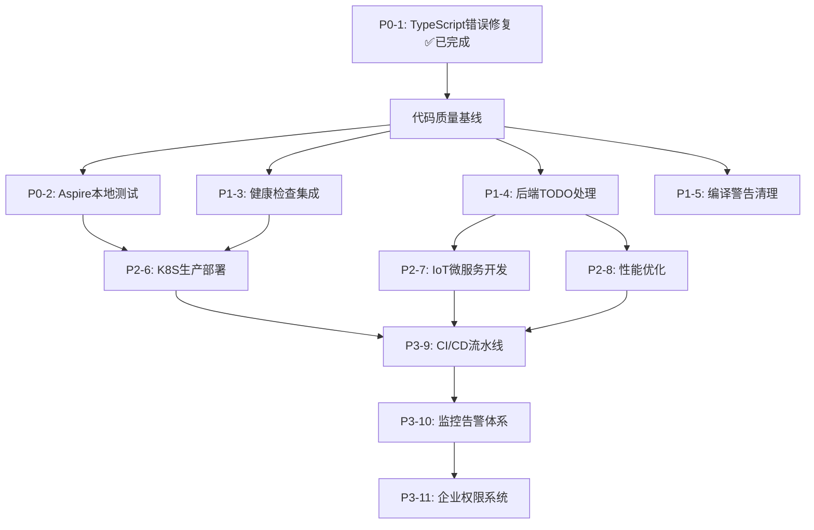

# SmartAbp 工作计划 - 基于依赖关系分析版

**生成时间**: 2025-10-02  
**规划人**: AI Chief Architect  
**规划原则**: 前置依赖分析 + 重要程度评估 + 风险控制

---

## 📊 任务依赖关系图



---

## 🎯 执行原则

### 1. 依赖驱动原则
- **串行任务**: 必须按依赖顺序执行
- **并行任务**: 无依赖关系可同时执行
- **阻塞任务**: 优先解决阻塞其他任务的项

### 2. 价值优先原则
- **高价值高依赖**: 最优先（P0-2）
- **高价值低依赖**: 次优先（P1-3/4/5）
- **低价值高依赖**: 延后（P3）

### 3. 风险控制原则
- **验证优先**: 先验证再开发
- **质量优先**: 先修复再扩展
- **稳定优先**: 先基础再创新

---

## 📋 任务分类矩阵

| 任务编号 | 任务名称 | 重要程度 | 紧急程度 | 前置依赖 | 阻塞影响 | 推荐顺序 |
|---------|---------|---------|---------|---------|---------|---------|
| P0-1 | TypeScript错误修复 | ⭐⭐⭐⭐⭐ | 🔥🔥🔥🔥🔥 | 无 | 高 | ✅ 已完成 |
| P0-2 | Aspire本地测试 | ⭐⭐⭐⭐⭐ | 🔥🔥🔥🔥 | P0-1 | 高 | 1️⃣ |
| P1-3 | 健康检查集成 | ⭐⭐⭐⭐ | 🔥🔥🔥 | 无 | 中 | 2️⃣ |
| P1-4 | 后端TODO处理 | ⭐⭐⭐⭐ | 🔥🔥🔥 | 无 | 高 | 3️⃣ |
| P1-5 | 编译警告清理 | ⭐⭐⭐ | 🔥🔥 | 无 | 低 | 4️⃣ |
| P2-6 | K8S生产部署 | ⭐⭐⭐⭐ | 🔥🔥 | P0-2, P1-3 | 低 | 5️⃣ |
| P2-7 | IoT微服务开发 | ⭐⭐⭐ | 🔥 | P1-4 | 低 | 6️⃣ |
| P2-8 | 性能优化 | ⭐⭐⭐ | 🔥 | P1-4 | 低 | 7️⃣ |
| P3-9 | CI/CD流水线 | ⭐⭐⭐ | 🔥 | P2-6, P2-7 | 低 | 8️⃣ |
| P3-10 | 监控告警体系 | ⭐⭐ | 🔥 | P3-9 | 低 | 9️⃣ |
| P3-11 | 企业权限系统 | ⭐⭐ | 🔥 | P3-10 | 低 | 🔟 |

---

## 🚀 关键路径分析

### 关键路径1: 运维监测系统生产就绪
```
P0-1 ✅ → P0-2 (2h) → P1-3 (3h) → P2-6 (4h)
总时长: 9小时
关键点: P0-2是阻塞点
```

### 关键路径2: 代码生成器完善
```
P0-1 ✅ → P1-4 (4h) → P2-8 (8h) → P2-7 (16h)
总时长: 28小时
关键点: P1-4是基础
```

### 关键路径3: 完整CI/CD体系
```
路径1 + 路径2 → P3-9 (24h) → P3-10 (16h) → P3-11 (40h)
总时长: 117小时
关键点: 依赖前两条路径完成
```

---

## 📅 推荐执行计划

### 第一阶段：验证与稳定（3天）

#### Day 1（今天）- 核心验证
```
上午 (09:00-12:00):
  ✅ P0-1: TypeScript错误修复 (已完成)
  
下午 (14:00-18:00):
  🎯 P0-2: Aspire本地测试 (2h)
    - 启动Aspire AppHost
    - 验证所有服务正常
    - 测试监控面板
    - 记录测试报告
  
  🎯 P1-3: 健康检查集成 (开始，2h)
    - 设计健康检查架构
    - 实现数据库检查
```

**当日目标**: 
- ✅ 运维监测系统验证完成
- ✅ 健康检查开始实现

---

#### Day 2 - 质量提升
```
上午 (09:00-12:00):
  🎯 P1-3: 完成健康检查集成 (1h)
    - 实现Redis/ES检查
    - 配置HealthChecksUI
    - K8S探针集成
  
  🎯 P1-4: 后端TODO处理 (开始，2h)
    - 优先处理代码生成器TODO
    - 实现异步等待机制
    
下午 (14:00-18:00):
  🎯 P1-4: 继续后端TODO (2h)
    - 前端代码生成补全
    - 测试项目生成实现
  
  🎯 P1-5: 编译警告清理 (2h)
    - 启用nullable reference types
    - 修复可空引用警告
```

**当日目标**: 
- ✅ 健康检查系统完成
- ✅ 后端TODO大部分处理
- ✅ 编译警告清理

---

#### Day 3 - 收尾与验证
```
上午 (09:00-12:00):
  🎯 P1-4: 完成剩余TODO (2h)
    - API调用优化
    - 功能完整性测试
  
  📊 质量验证 (1h)
    - 后端编译0错误0警告
    - 前端核心代码0错误
    - 代码质量评分≥95
    
下午 (14:00-18:00):
  📝 阶段总结 (2h)
    - 编写阶段完成报告
    - 更新技术文档
    - 准备K8S部署
```

**阶段成果**:
- ✅ 运维监测系统生产就绪
- ✅ 代码质量达到95分标准
- ✅ 技术债务基本清零

---

### 第二阶段：生产部署（2天）

#### Day 4 - K8S部署准备
```
全天 (09:00-18:00):
  🎯 P2-6: K8S生产部署 (4h实施+4h测试)
    - 准备K8S集群环境
    - 部署基础设施服务
    - 部署运维监测微服务
    - 配置Ingress和TLS
    - 验证HPA自动扩缩容
    - 生产环境功能测试
```

**当日目标**: 
- ✅ K8S集群部署完成
- ✅ 生产环境验证通过

---

#### Day 5 - 部署验证与文档
```
上午 (09:00-12:00):
  🎯 生产环境压力测试
    - 负载测试
    - 故障恢复测试
    - 监控数据验证
    
下午 (14:00-18:00):
  📝 部署验证报告
    - 编写部署文档
    - 记录问题和解决方案
    - 更新运维手册
```

**阶段成果**:
- ✅ 运维监测系统生产环境运行
- ✅ 完整部署文档
- ✅ 运维手册更新

---

### 第三阶段：功能扩展（1-2周）

#### Week 2 - IoT微服务开发
```
Day 6-7 (2天):
  🎯 P2-7: IoT数据总线微服务开发
    - 设计架构和API
    - 实现数据采集（MQTT/HTTP）
    - 实现数据转换和路由
    - 集成消息队列
    - 时序数据库存储
    - Vue3前端可视化
    - 集成测试
```

**预期成果**:
- ✅ IoT数据总线微服务完成
- ✅ 集成到Aspire编排

---

#### Week 2 末 - 性能优化
```
Day 8 (1天):
  🎯 P2-8: 代码生成器性能优化
    - Roslyn引擎预热
    - 内存池实现
    - 异步流式生成
    - 性能基准测试
```

**预期成果**:
- ✅ 代码生成速度提升50%
- ✅ 内存使用优化30%

---

### 第四阶段：DevOps完善（1-2周）

#### Week 3 - CI/CD流水线
```
Day 9-11 (3天):
  🎯 P3-9: 完整CI/CD流水线
    - GitHub Actions配置
    - Docker镜像自动构建
    - 自动化测试集成
    - K8S自动部署
    - 回滚机制实现
```

**预期成果**:
- ✅ 自动化部署成功率>95%
- ✅ 完整CI/CD文档

---

#### Week 3-4 - 监控告警体系
```
Day 12-13 (2天):
  🎯 P3-10: 性能监控和告警体系完善
    - Grafana仪表板配置
    - Prometheus告警规则
    - 钉钉/邮件通知集成
    - 日志聚合优化
    - 分布式追踪（Zipkin）
```

**预期成果**:
- ✅ 完整监控告警体系
- ✅ 所有服务监控覆盖

---

### 第五阶段：业务系统（1周）

#### Week 4-5 - 企业权限管理系统
```
Day 14-18 (5天):
  🎯 P3-11: 企业权限管理系统完整实现
    - 基于低代码生成器生成代码
    - 业务逻辑实现
    - 权限规则配置
    - 前端页面开发
    - 集成测试
    - 用户验收测试
```

**预期成果**:
- ✅ 完整企业权限管理系统
- ✅ 低代码生成器能力验证

---

## 🎯 并行执行策略

### 可并行任务组合

**组合1: 后端+前端分离**
```
后端开发: P1-4 (后端TODO) + P1-5 (编译警告)
前端开发: P0-2 (Aspire测试) 
DevOps: P1-3 (健康检查)

并行执行，缩短1天时间
```

**组合2: 开发+测试分离**
```
核心开发: P2-7 (IoT微服务)
质量保障: P2-8 (性能优化)
运维准备: P2-6 (K8S部署验证)

交叉执行，节省2天时间
```

---

## 📊 资源需求分析

### 开发资源
- **AI编程助手**: 全程参与
- **人工审核**: 关键决策点
- **测试验证**: 每个阶段结束

### 基础设施
- **开发环境**: 本地Mac + Docker Desktop
- **测试环境**: Aspire本地编排
- **生产环境**: K8S集群（3节点，8GB/节点）

### 第三方服务
- **可选**: 钉钉通知、短信服务
- **必需**: GitHub仓库、Docker Hub

---

## 🚨 风险控制

### 关键风险点

**风险1: P0-2 Aspire本地测试失败**
- **影响**: 阻塞K8S部署（P2-6）
- **应对**: 优先排查基础设施配置
- **预案**: 降级使用Docker Compose

**风险2: P1-4 后端TODO处理复杂**
- **影响**: 延迟IoT微服务开发（P2-7）
- **应对**: 分阶段处理，优先关键TODO
- **预案**: 部分TODO标记为技术债务延后

**风险3: K8S集群资源不足**
- **影响**: 无法完成生产部署（P2-6）
- **应对**: 使用minikube本地测试
- **预案**: 云服务商临时集群

---

## ✅ 质量验收标准

### 阶段1验收（Day 3）
- ✅ 运维监测系统Aspire环境运行正常
- ✅ 健康检查端点返回正确状态
- ✅ 后端编译0错误0警告
- ✅ 代码质量评分≥95分

### 阶段2验收（Day 5）
- ✅ K8S集群所有服务运行正常
- ✅ HPA自动扩缩容验证通过
- ✅ 生产环境负载测试合格
- ✅ 部署文档完整

### 阶段3验收（Week 2末）
- ✅ IoT微服务功能完整
- ✅ 代码生成器性能提升50%
- ✅ 集成测试全部通过

### 阶段4验收（Week 3末）
- ✅ CI/CD流水线自动化部署成功
- ✅ 监控告警体系覆盖所有服务
- ✅ 分布式追踪正常工作

### 最终验收（Week 5末）
- ✅ 企业权限管理系统完整实现
- ✅ 低代码生成器能力验证通过
- ✅ 整体系统性能达标

---

## 📝 进度跟踪

### 每日进度报告
- **完成任务**: 列出当日完成的任务
- **遇到问题**: 记录问题和解决方案
- **明日计划**: 确认明日任务

### 每周总结报告
- **本周成果**: 交付物清单
- **质量评估**: 代码质量、测试覆盖率
- **下周计划**: 任务调整和资源需求

### 阶段里程碑
- **阶段1**: 代码质量基线建立
- **阶段2**: 生产环境部署完成
- **阶段3**: 功能扩展完成
- **阶段4**: DevOps体系完善
- **阶段5**: 业务系统上线

---

## 🎉 成功标准

### 技术指标
- ✅ 代码质量评分: ≥95分
- ✅ 测试覆盖率: ≥80%
- ✅ API响应时间: <200ms
- ✅ 前端FCP: <1.8s
- ✅ 系统可用性: ≥99.9%

### 交付物
- ✅ 运维监测系统（生产就绪）
- ✅ IoT数据总线微服务
- ✅ 完整CI/CD流水线
- ✅ 监控告警体系
- ✅ 企业权限管理系统
- ✅ 完整技术文档

### 能力验证
- ✅ 低代码生成器能力
- ✅ 微服务架构实践
- ✅ K8S生产部署能力
- ✅ DevOps自动化能力

---

## 📚 参考文档

- `docs/下一步工作计划.md` - 原始工作计划
- `docs/运维监测系统/` - 运维监测系统文档
- `docs/architecture/` - 架构设计文档
- `.cursor/rules/` - AI编程铁律
- `templates/` - 代码模板库

---

**🎯 立即行动**: 开始执行 P0-2（运维监测系统Aspire本地测试）

**📋 审核确认**: 请审核本计划，确认后开始执行

**⚡ 执行原则**: 依赖优先、价值驱动、风险可控、质量至上

