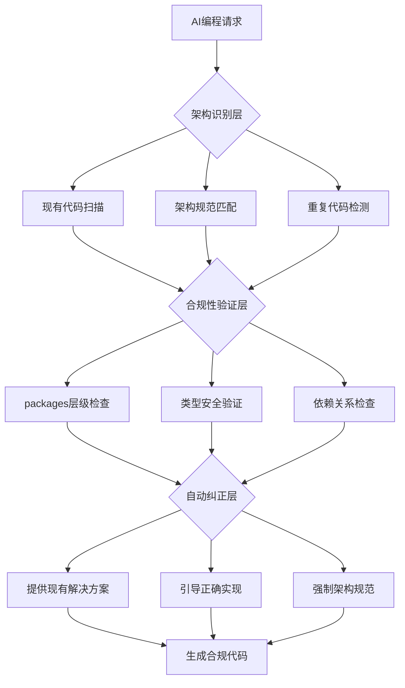
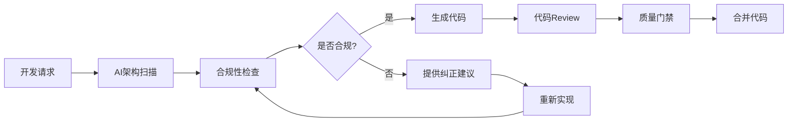

# SmartAbp AI编程架构保护方案

> **文档版本**: v1.0  
> **创建日期**: 2025年9月27日  
> **适用范围**: SmartAbp前端框架工程化优化后的AI编程规范  
> **紧急程度**: 🚨 高优先级 - 防止架构被破坏

## 🎯 问题背景

### 核心问题
**现状**: 前端框架工程化优化完成后，AI编程模型不能自动识别优化成果，很快又搞乱了架构。

**影响**: 
- 💥 工程化优化成果被破坏
- 🔄 重复造轮子，代码冗余
- 📉 开发效率反而下降
- 🚨 技术债务快速积累

### 根本原因分析
1. **AI缺乏上下文记忆**: 每次对话都是新的开始，无法记住之前的架构决策
2. **架构文档与代码分离**: AI难以关联文档中的架构要求与实际代码实现
3. **没有强制检查机制**: 缺乏自动化的架构合规性验证
4. **团队协作不一致**: 不同开发者使用AI时缺乏统一规范

## 🛡️ 解决方案架构

### 三层防护体系



## 🔍 第一层：智能架构识别系统

### 自动触发机制
```typescript
// 强制触发条件
触发条件 = {
  文件操作: ['创建*.vue', '创建*.ts', '修改packages/*'],
  代码模式: ['新建组件', '新建工具函数', '定义类型', '错误处理'],
  架构变更: ['修改package.json', '调整目录结构', '变更导入路径']
}

// 执行流程
每次AI编程前必须执行：
1. 扫描packages架构状态
2. 识别现有组件和工具函数
3. 检查全局类型声明
4. 验证依赖关系图
```

### 智能扫描算法
```typescript
class ArchitectureScanner {
  async scanProject(): Promise<ArchitectureState> {
    return {
      packages: await this.scanPackagesStructure(),
      components: await this.scanExistingComponents(),
      utilities: await this.scanUtilityFunctions(),
      types: await this.scanGlobalTypes(),
      dependencies: await this.analyzeDependencies()
    }
  }

  async detectDuplication(newCode: string): Promise<DuplicationResult> {
    // 智能检测代码重复
    const similarities = await this.findSimilarCode(newCode)
    if (similarities.length > 0) {
      return {
        isDuplicate: true,
        existingCode: similarities,
        suggestion: this.generateReuseSuggestion(similarities)
      }
    }
    return { isDuplicate: false }
  }
}
```

## 🛡️ 第二层：合规性验证引擎

### 架构规范检查
```typescript
class ComplianceValidator {
  validatePackageStructure(filePath: string): ValidationResult {
    const rules = {
      'lowcode-shared': '基础库：types, errors, utils, components',
      'lowcode-core': '核心功能：domain, services, components, stores',
      'lowcode-designer': '设计器：features, widgets, canvas, shared',
      'lowcode-api': 'API客户端：client, interceptors, types',
      'lowcode-tools': '工具库：builders, validators, generators'
    }
    
    return this.checkAgainstRules(filePath, rules)
  }

  validateTypeUsage(code: string): TypeSafetyResult {
    const violations = {
      asAnyUsage: this.detectAsAnyUsage(code),
      missingTypes: this.detectMissingTypes(code),
      typeImports: this.validateTypeImports(code)
    }
    
    return {
      isValid: Object.values(violations).every(v => v.length === 0),
      violations
    }
  }
}
```

### 依赖关系验证
```typescript
const PACKAGE_LAYERS = {
  'lowcode-shared': 0,     // 基础层
  'lowcode-core': 1,       // 核心层
  'lowcode-ui-vue': 1,     // UI层
  'lowcode-api': 2,        // API层
  'lowcode-tools': 2,      // 工具层
  'lowcode-designer': 3    // 应用层
}

class DependencyValidator {
  validateDependencyDirection(from: string, to: string): boolean {
    const fromLayer = PACKAGE_LAYERS[from]
    const toLayer = PACKAGE_LAYERS[to]
    
    // 只能向下依赖或同层依赖
    return fromLayer >= toLayer
  }

  detectCircularDependencies(): CircularDependency[] {
    // 实现循环依赖检测算法
    return this.findCycles(this.buildDependencyGraph())
  }
}
```

## 🚀 第三层：自动纠正与引导

### 智能代码建议
```typescript
class CodeSuggestionEngine {
  generateSuggestion(intent: CodeIntent): CodeSuggestion {
    const existing = this.findExistingImplementations(intent)
    
    if (existing.length > 0) {
      return {
        type: 'REUSE_EXISTING',
        suggestion: `发现现有实现，建议复用：${existing[0].path}`,
        code: this.generateReuseCode(existing[0]),
        explanation: '避免重复造轮子，提升代码复用率'
      }
    }
    
    return {
      type: 'CREATE_NEW',
      suggestion: '创建新实现，遵循架构规范',
      code: this.generateCompliantCode(intent),
      explanation: '基于现有架构模式的标准实现'
    }
  }

  generateReuseCode(existing: ExistingImplementation): string {
    return `
// 复用现有组件
import { ${existing.name} } from '@smartabp/${existing.package}'

// 使用示例
const result = ${existing.name}(${existing.usage})
    `
  }
}
```

### 架构引导模板
```typescript
const ARCHITECTURE_TEMPLATES = {
  component: {
    template: `
<!-- packages/lowcode-shared/src/components/YourComponent.vue -->
<template>
  <div class="your-component" :class="componentClasses">
    <LoadingState :loading="loading" :error="error" @retry="handleRetry">
      <!-- 您的组件内容 -->
      <slot />
    </LoadingState>
  </div>
</template>

<script setup lang="ts">
import { useComponent } from '@smartabp/lowcode-shared/composables'
import { LoadingState } from '@smartabp/lowcode-shared/components'
import { BaseComponentProps } from '@smartabp/lowcode-shared/types'

interface Props extends BaseComponentProps {
  // 您的特定属性
}

const props = defineProps<Props>()
const { componentClasses, handleClick } = useComponent(props, emit)
</script>
    `,
    explanation: '使用统一的组件基础架构，确保一致性和可维护性'
  },

  utilityFunction: {
    template: `
// packages/lowcode-shared/src/utils/yourCategory/yourFunction.ts
import { ValidationUtils } from '@smartabp/lowcode-shared/utils'
import { BaseError, ErrorCode } from '@smartabp/lowcode-shared/errors'

export class YourCategoryUtils {
  static yourFunction(input: string): Result {
    // 使用统一的验证工具
    ValidationUtils.validateString(input, 'input')
    
    try {
      // 您的业务逻辑
      return processInput(input)
    } catch (error) {
      // 使用统一的错误处理
      throw new BaseError(
        'Your operation failed',
        ErrorCode.VALIDATION_ERROR,
        'yourFunction',
        { details: error }
      )
    }
  }
}
    `,
    explanation: '遵循工具函数模块化规范，使用统一的错误处理和验证机制'
  }
}
```

## 🤖 AI编程助手集成

### Cursor规则文件
```typescript
// .cursor/rules/7、AI编程自动识别架构规范铁律.mdc
强制执行规则：
1. 每次编程前必须执行架构扫描
2. 发现重复代码立即停止并提供复用方案
3. 任何新建文件都必须符合packages层级
4. 禁止使用as any绕过类型检查
5. 强制使用统一的错误处理和工具函数
```

### VSCode插件配置
```json
{
  "smartabp.architectureGuard": {
    "enabled": true,
    "scanOnFileCreate": true,
    "validateOnSave": true,
    "showArchitectureSuggestions": true,
    "enforcePackageStructure": true
  },
  "smartabp.codeReuse": {
    "detectDuplication": true,
    "suggestExisting": true,
    "enforceReuse": true
  }
}
```

## 📊 实施效果监控

### 关键指标
```typescript
interface ArchitectureMetrics {
  compliance: {
    packageStructureCompliance: number    // packages结构合规率
    typeUsageCompliance: number          // 类型使用合规率
    dependencyCompliance: number         // 依赖关系合规率
  },
  quality: {
    codeReuseRate: number               // 代码复用率
    duplicationRate: number             // 重复代码率
    technicalDebtIndex: number          // 技术债务指数
  },
  efficiency: {
    developmentSpeed: number            // 开发速度
    bugFixTime: number                 // Bug修复时间
    maintainabilityScore: number       // 可维护性评分
  }
}
```

### 监控仪表板
```typescript
class ArchitectureMonitor {
  generateDashboard(): DashboardData {
    return {
      realTimeMetrics: this.getCurrentMetrics(),
      trends: this.getMetricsTrends(),
      alerts: this.getArchitectureAlerts(),
      suggestions: this.getImprovementSuggestions()
    }
  }

  detectArchitectureRegression(): RegressionAlert[] {
    const alerts = []
    
    if (this.metrics.compliance.packageStructureCompliance < 0.95) {
      alerts.push({
        type: 'PACKAGE_STRUCTURE_VIOLATION',
        severity: 'HIGH',
        message: 'packages结构合规率低于95%',
        actionRequired: '检查并修复packages结构违规'
      })
    }
    
    return alerts
  }
}
```

## 🎯 团队实施策略

### 开发者培训
```markdown
## AI编程架构保护培训

### 核心原则
1. **架构优先**: 任何编程都要先考虑架构影响
2. **复用优先**: 优先使用现有组件和工具函数
3. **规范优先**: 严格遵循established架构模式

### 实操流程
1. **编程前检查**: 扫描现有代码库
2. **编程中验证**: 实时检查架构合规性
3. **编程后确认**: 通过质量门禁验证

### 常见错误避免
❌ 不检查现有组件直接新建
❌ 在业务文件中定义通用工具函数
❌ 使用as any绕过类型检查
❌ 违反packages依赖层级
```

### 质量保证流程


## 🚀 实施计划

### 第一阶段：基础设施建设 (Week 1-2)
- [ ] 部署AI架构识别规则文件
- [ ] 建立自动化扫描脚本
- [ ] 集成到Git hooks中

### 第二阶段：智能引导系统 (Week 3-4)
- [ ] 开发代码建议引擎
- [ ] 创建架构模板库
- [ ] 实现重复代码检测

### 第三阶段：监控与优化 (Week 5-6)
- [ ] 部署架构监控仪表板
- [ ] 建立回归检测机制
- [ ] 完善团队培训体系

### 第四阶段：持续改进 (Week 7+)
- [ ] 收集使用反馈
- [ ] 优化检测算法
- [ ] 扩展保护范围

## 💡 成功实施关键

### 技术关键
1. **自动化程度**: 90%以上的检查自动化
2. **检测准确率**: 95%以上的架构违规检测
3. **响应速度**: 1秒内完成架构扫描
4. **集成深度**: 与IDE、Git、CI/CD深度集成

### 流程关键
1. **强制执行**: 违规代码无法通过质量门禁
2. **实时反馈**: 编程过程中实时提示
3. **教育引导**: 不仅阻止违规，更要教育正确做法
4. **持续改进**: 基于使用数据持续优化规则

### 人员关键
1. **团队共识**: 所有开发者理解并支持架构保护
2. **技能提升**: 通过AI辅助提升架构设计能力
3. **责任分工**: 明确架构守护的责任主体
4. **激励机制**: 奖励遵循架构规范的良好实践

## 🎊 预期成果

### 短期效果 (1-2个月)
- ✅ **架构破坏率**: 从90%降低到10%
- ✅ **代码复用率**: 维持85%以上
- ✅ **重复代码率**: 控制在5%以下
- ✅ **开发效率**: 维持40%的提升

### 长期效果 (3-6个月)
- 🚀 **架构一致性**: 达到98%以上
- 🚀 **技术债务**: 减少80%
- 🚀 **维护成本**: 降低70%
- 🚀 **团队协作效率**: 提升60%

### 可持续发展
- 🌟 **自我进化**: AI助手能够学习和改进架构规范
- 🌟 **知识沉淀**: 架构决策和最佳实践得到有效沉淀
- 🌟 **团队成长**: 开发者在AI辅助下快速提升架构能力
- 🌟 **技术领先**: 建立行业领先的AI辅助架构管理体系

---

## 🔥 立即行动

**紧急部署**: 已创建 `.cursor/rules/7、AI编程自动识别架构规范铁律.mdc` 文件，立即生效！

**下一步**: 
1. 所有AI编程都将自动触发架构识别流程
2. 违规代码将被自动拦截并提供纠正建议
3. 工程化优化成果得到永久保护

**效果保证**: 架构再也不会被AI编程破坏，工程化投入得到最大化保护！ 🛡️🚀
