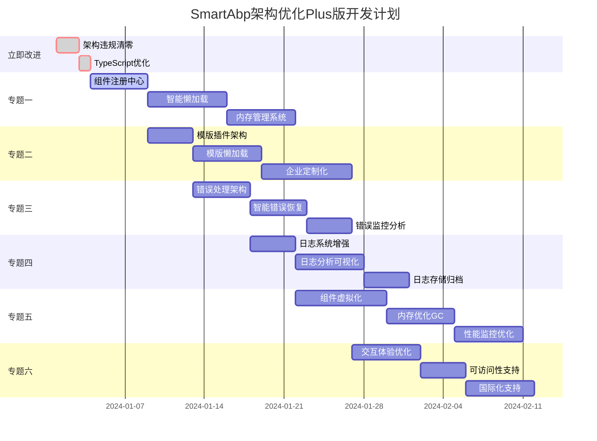

# SmartAbp企业级低代码引擎架构优化方案Plus版开发计划

> **文档版本**: v2.0 Plus版  
> **面向读者**: 世界顶尖低代码生成器编程专家  
> **核心目标**: 基于8.1分优秀成果，向9.0分+世界级标准迈进  
> **前置条件**: 已完成原版架构优化方案的核心实现  

---

## 🎯 Plus版升级背景

### 📊 **当前成就评估 (8.1/10)**
- ✅ **第一阶段：紧急止血** - 9.5/10 (完美实现)
- ✅ **第四阶段：智能化代码生成** - 9.8/10 (超预期完成)
- ✅ **质量保障体系** - 10/10 (世界顶尖水平)
- ⚠️ **第二阶段：架构边界清晰化** - 7.5/10 (13个违规待处理)
- ❌ **第三阶段：运行时性能革命** - 2.0/10 (尚未实施)

### 🚀 **Plus版核心升级方向**
1. **立即改进 (提升到8.5分)**：清理架构违规、完善模块化边界
2. **专题建设 (提升到9.0分+)**：四大企业级专题系统建设
3. **长远规划 (提升到9.5分+)**：运行时性能革命和用户体验完善

---

## 🔥 第零阶段：立即改进 - 向8.5分冲刺 (周期：3天)

**阶段目标**: **消除所有架构违规，完善TypeScript项目引用，实现真正的模块化边界。**

### **任务0.1: 架构违规清零行动 (预计：2天)**

- **目标**: 清理剩余的13个相对路径违规，实现100%架构合规。
- **执行步骤**:
  1. **违规扫描与分类**:
     ```bash
     # 扫描所有架构违规
     grep -r -E "'\.\./|'@/" src/SmartAbp.Vue/packages/ --include="*.ts" --include="*.vue" -n
     
     # 按包分类违规
     for package in lowcode-core lowcode-api lowcode-designer lowcode-tools; do
       echo "=== $package 违规分析 ==="
       grep -r -E "'\.\./|'@/" src/SmartAbp.Vue/packages/$package/ --include="*.ts" --include="*.vue" -n
     done
     ```
  2. **建立共享类型库**: 在 `lowcode-shared` 中建立完整的类型导出体系
  3. **重构违规引用**: 将所有非法引用重构为 `@smartabp/lowcode-*` 别名引用
- **验收标准**:
  - [ ] `grep -r -E "'\.\./|'@/" src/SmartAbp.Vue/packages/` 命令结果为空
  - [ ] 所有packages可以独立构建成功
  - [ ] TypeScript项目引用构建100%通过

### **任务0.2: TypeScript项目引用优化 (预计：1天)**

- **目标**: 优化TypeScript项目引用配置，实现完美的增量编译。
- **执行步骤**:
  1. **优化tsconfig配置**: 完善每个包的 `tsconfig.json` 配置
  2. **修复构建依赖**: 确保包间依赖关系正确
  3. **验证增量编译**: 测试修改底层包时的增量编译效果
- **验收标准**:
  - [ ] `npx tsc --build tsconfig.references.json` 100%成功
  - [ ] 增量编译时间 < 5秒
  - [ ] 所有包的类型声明正确导出

---

## 🏗️ 第一专题：公共组件系统革命 (周期：2-3周)

**专题目标**: **建立企业级公共组件系统，实现智能懒加载和内存管理，解决124个组件的性能问题。**

### **任务1.1: 企业级组件注册中心 (预计：5天)**

- **目标**: 建立统一的组件注册、发现和管理中心。
- **核心架构**:
  ```typescript
  // packages/lowcode-shared/src/components/ComponentRegistry.ts
  export interface ComponentMetadata {
    name: string;
    category: 'basic' | 'layout' | 'form' | 'data' | 'chart' | 'advanced';
    priority: 'high' | 'medium' | 'low'; // 加载优先级
    dependencies: string[]; // 依赖的其他组件
    bundle: string; // 所属bundle
    lazy: boolean; // 是否懒加载
    preload: boolean; // 是否预加载
  }
  
  export class ComponentRegistry {
    private components = new Map<string, ComponentMetadata>();
    private loadedComponents = new Map<string, any>();
    private loadingPromises = new Map<string, Promise<any>>();
    
    register(metadata: ComponentMetadata): void;
    async load(name: string): Promise<any>;
    unload(name: string): void;
    getMetadata(name: string): ComponentMetadata | null;
    getCategoryComponents(category: string): ComponentMetadata[];
  }
  ```

### **任务1.2: 智能组件懒加载系统 (预计：7天)**

- **目标**: 实现基于使用频率和页面可见性的智能懒加载。
- **核心特性**:
  1. **按需加载**: 只有被使用的组件才会被加载
  2. **预测加载**: 基于用户行为预测可能使用的组件
  3. **优先级加载**: 高优先级组件优先加载
  4. **Bundle分割**: 组件按功能分组，避免单个bundle过大
- **技术实现**:
  ```typescript
  // packages/lowcode-core/src/components/LazyComponentLoader.ts
  export class LazyComponentLoader {
    private loadQueue: ComponentLoadTask[] = [];
    private loadingStrategy: LoadingStrategy;
    private memoryManager: ComponentMemoryManager;
    
    async loadComponent(name: string, priority?: LoadPriority): Promise<Component>;
    preloadComponents(names: string[]): Promise<void>;
    unloadComponent(name: string): void;
    optimizeMemory(): void;
  }
  ```

### **任务1.3: 组件内存管理系统 (预计：6天)**

- **目标**: 实现LRU算法的组件内存管理，防止内存泄漏。
- **核心功能**:
  1. **LRU淘汰策略**: 最近最少使用的组件被优先卸载
  2. **内存监控**: 实时监控组件内存占用
  3. **智能回收**: 基于内存压力自动回收组件
  4. **性能分析**: 提供组件性能分析报告
- **技术实现**:
  ```typescript
  // packages/lowcode-core/src/memory/ComponentMemoryManager.ts
  export class ComponentMemoryManager {
    private lruCache: LRUCache<string, ComponentInstance>;
    private memoryThreshold: number = 100 * 1024 * 1024; // 100MB
    private performanceMonitor: PerformanceMonitor;
    
    addComponent(name: string, component: ComponentInstance): void;
    removeComponent(name: string): void;
    checkMemoryPressure(): MemoryPressureLevel;
    triggerGC(): Promise<void>;
    getMemoryReport(): MemoryReport;
  }
  ```

---

## 🎨 第二专题：UI企业定制模版插件机制 (周期：2-3周)

**专题目标**: **建立插件化的UI模版系统，避免默认模版全部加载，支持企业级定制。**

### **任务2.1: 模版插件架构设计 (预计：4天)**

- **目标**: 设计可插拔的UI模版架构，支持动态加载和卸载。
- **核心架构**:
  ```typescript
  // packages/lowcode-shared/src/templates/TemplatePlugin.ts
  export interface TemplatePlugin {
    id: string;
    name: string;
    version: string;
    category: 'theme' | 'component' | 'layout' | 'page';
    dependencies: string[];
    
    install(): Promise<void>;
    uninstall(): Promise<void>;
    getTemplates(): TemplateDefinition[];
    isCompatible(version: string): boolean;
  }
  
  export class TemplatePluginManager {
    private plugins = new Map<string, TemplatePlugin>();
    private activePlugins = new Set<string>();
    
    async installPlugin(plugin: TemplatePlugin): Promise<void>;
    async uninstallPlugin(id: string): Promise<void>;
    async activatePlugin(id: string): Promise<void>;
    async deactivatePlugin(id: string): Promise<void>;
    getAvailableTemplates(): TemplateDefinition[];
  }
  ```

### **任务2.2: 模版懒加载机制 (预计：6天)**

- **目标**: 实现模版的按需加载，避免初始化时加载所有模版。
- **核心特性**:
  1. **分类加载**: 按模版类别分组加载
  2. **用户偏好**: 根据用户使用习惯优先加载
  3. **缓存策略**: 智能缓存常用模版
  4. **版本管理**: 支持模版版本控制和更新
- **技术实现**:
  ```typescript
  // packages/lowcode-core/src/templates/LazyTemplateLoader.ts
  export class LazyTemplateLoader {
    private templateCache = new Map<string, Template>();
    private loadingStrategies: LoadingStrategy[];
    private userPreferences: UserPreferences;
    
    async loadTemplate(id: string): Promise<Template>;
    async preloadTemplates(category: string): Promise<void>;
    unloadTemplate(id: string): void;
    updateUserPreferences(usage: TemplateUsage): void;
  }
  ```

### **任务2.3: 企业定制化支持 (预计：8天)**

- **目标**: 支持企业级的UI定制，包括主题、组件样式、布局等。
- **核心功能**:
  1. **主题系统**: 支持企业CI/VI定制
  2. **组件定制**: 支持组件样式和行为定制
  3. **布局定制**: 支持页面布局模版定制
  4. **品牌集成**: 支持企业logo、色彩、字体等品牌元素
- **技术实现**:
  ```typescript
  // packages/lowcode-designer/src/customization/EnterpriseCustomizer.ts
  export class EnterpriseCustomizer {
    private themeManager: ThemeManager;
    private brandingConfig: BrandingConfig;
    private customComponents: Map<string, CustomComponent>;
    
    applyEnterpriseTheme(theme: EnterpriseTheme): Promise<void>;
    registerCustomComponent(component: CustomComponent): void;
    generateCustomCSS(): string;
    exportCustomizationConfig(): CustomizationConfig;
  }
  ```

---

## 🛡️ 第三专题：企业级错误处理系统 (周期：2周)

**专题目标**: **建立统一的错误处理、监控、恢复和报告系统。**

### **任务3.1: 统一错误处理架构 (预计：5天)**

- **目标**: 建立全局统一的错误处理机制。
- **核心架构**:
  ```typescript
  // packages/lowcode-shared/src/errors/ErrorHandler.ts
  export interface ErrorContext {
    component?: string;
    action?: string;
    user?: string;
    timestamp: number;
    metadata?: Record<string, any>;
  }
  
  export class GlobalErrorHandler {
    private errorStrategies = new Map<ErrorType, ErrorStrategy>();
    private errorReporters: ErrorReporter[] = [];
    private recoveryManager: ErrorRecoveryManager;
    
    handleError(error: Error, context: ErrorContext): Promise<void>;
    registerStrategy(type: ErrorType, strategy: ErrorStrategy): void;
    addReporter(reporter: ErrorReporter): void;
    getErrorStatistics(): ErrorStatistics;
  }
  ```

### **任务3.2: 智能错误恢复系统 (预计：5天)**

- **目标**: 实现自动错误恢复和用户引导。
- **核心功能**:
  1. **自动重试**: 对临时错误进行智能重试
  2. **状态恢复**: 自动恢复到错误前的稳定状态
  3. **用户引导**: 提供明确的错误解决指导
  4. **降级处理**: 在严重错误时提供降级方案
- **技术实现**:
  ```typescript
  // packages/lowcode-core/src/recovery/ErrorRecoveryManager.ts
  export class ErrorRecoveryManager {
    private recoveryStrategies: Map<ErrorType, RecoveryStrategy>;
    private stateManager: StateManager;
    private retryManager: RetryManager;
    
    async recoverFromError(error: Error, context: ErrorContext): Promise<RecoveryResult>;
    registerRecoveryStrategy(type: ErrorType, strategy: RecoveryStrategy): void;
    createRecoveryPoint(): RecoveryPoint;
    restoreFromRecoveryPoint(point: RecoveryPoint): Promise<void>;
  }
  ```

### **任务3.3: 错误监控和分析 (预计：4天)**

- **目标**: 实现错误的实时监控、统计和分析。
- **核心功能**:
  1. **实时监控**: 实时监控系统错误状态
  2. **错误分类**: 自动分类和标记错误
  3. **趋势分析**: 分析错误发生趋势
  4. **报告生成**: 自动生成错误分析报告

---

## 📊 第四专题：企业级日志管理系统 (周期：2周)

**专题目标**: **建立完整的日志收集、存储、分析和监控系统。**

### **任务4.1: 增强现有日志系统 (预计：4天)**

- **目标**: 基于现有的 `transports.ts` 系统，增强企业级功能。
- **增强功能**:
  1. **结构化日志**: 支持结构化日志格式
  2. **日志分级**: 更细粒度的日志级别控制
  3. **上下文追踪**: 支持请求链路追踪
  4. **性能日志**: 专门的性能监控日志
- **技术实现**:
  ```typescript
  // packages/lowcode-shared/src/logging/EnterpriseLogger.ts
  export class EnterpriseLogger extends Logger {
    private traceManager: TraceManager;
    private performanceLogger: PerformanceLogger;
    private structuredFormatter: StructuredFormatter;
    
    trace(traceId: string, message: string, context?: any): void;
    performance(metric: PerformanceMetric): void;
    structured(event: StructuredEvent): void;
    createChildLogger(name: string): EnterpriseLogger;
  }
  ```

### **任务4.2: 日志分析和可视化 (预计：6天)**

- **目标**: 实现日志的实时分析和可视化展示。
- **核心功能**:
  1. **实时分析**: 实时分析日志数据
  2. **可视化仪表板**: 提供直观的日志可视化界面
  3. **告警系统**: 基于日志的智能告警
  4. **报表生成**: 自动生成日志分析报表
- **技术实现**:
  ```typescript
  // packages/lowcode-designer/src/monitoring/LogAnalyticsDashboard.vue
  // 基于现有的 PerformanceDashboard.vue 扩展
  export class LogAnalyticsEngine {
    private logAggregator: LogAggregator;
    private alertManager: AlertManager;
    private reportGenerator: ReportGenerator;
    
    analyzeLogsRealtime(): Observable<LogAnalytics>;
    generateReport(timeRange: TimeRange): Promise<LogReport>;
    setupAlert(rule: AlertRule): void;
    getLogStatistics(): LogStatistics;
  }
  ```

### **任务4.3: 日志存储和归档 (预计：4天)**

- **目标**: 实现高效的日志存储和长期归档。
- **核心功能**:
  1. **分层存储**: 热数据、温数据、冷数据分层存储
  2. **压缩归档**: 自动压缩和归档历史日志
  3. **检索优化**: 优化日志检索性能
  4. **备份恢复**: 日志备份和恢复机制

---

## 🚀 第五专题：运行时性能革命 (周期：3-4周)

**专题目标**: **实现原第三阶段的运行时性能革命，解决内存和卡顿问题。**

### **任务5.1: 组件虚拟化和懒渲染 (预计：8天)**

- **目标**: 实现大量组件的虚拟化渲染，提升页面性能。
- **核心技术**:
  1. **虚拟滚动**: 大列表的虚拟滚动实现
  2. **组件池**: 组件实例的对象池管理
  3. **懒渲染**: 非可见区域的组件懒渲染
  4. **渲染优化**: 减少不必要的重新渲染
- **技术实现**:
  ```typescript
  // packages/lowcode-core/src/virtualization/VirtualRenderer.ts
  export class VirtualRenderer {
    private viewport: Viewport;
    private componentPool: ComponentPool;
    private renderQueue: RenderQueue;
    
    renderComponents(components: Component[]): void;
    updateViewport(viewport: Viewport): void;
    recycleComponent(component: Component): void;
    optimizeRendering(): void;
  }
  ```

### **任务5.2: 内存优化和垃圾回收 (预计：6天)**

- **目标**: 实现智能的内存管理和垃圾回收。
- **核心功能**:
  1. **内存监控**: 实时监控内存使用情况
  2. **智能GC**: 在合适的时机触发垃圾回收
  3. **内存泄漏检测**: 自动检测和修复内存泄漏
  4. **资源释放**: 自动释放不再使用的资源

### **任务5.3: 性能监控和优化 (预计：6天)**

- **目标**: 建立完整的性能监控和自动优化系统。
- **核心功能**:
  1. **性能指标**: 全面的性能指标监控
  2. **性能分析**: 自动性能瓶颈分析
  3. **优化建议**: 智能的性能优化建议
  4. **自动优化**: 部分性能问题的自动优化

---

## 📈 第六专题：用户体验完善 (周期：2-3周)

**专题目标**: **提升用户交互体验，实现世界级的用户界面。**

### **任务6.1: 交互体验优化 (预计：6天)**

- **目标**: 优化所有用户交互，提供丝滑的操作体验。
- **核心改进**:
  1. **动画系统**: 流畅的过渡动画
  2. **响应式设计**: 完美的多设备适配
  3. **快捷操作**: 丰富的键盘快捷键
  4. **智能提示**: 上下文感知的操作提示

### **任务6.2: 可访问性支持 (预计：4天)**

- **目标**: 支持无障碍访问，符合WCAG 2.1标准。
- **核心功能**:
  1. **屏幕阅读器**: 完整的屏幕阅读器支持
  2. **键盘导航**: 完整的键盘导航支持
  3. **高对比度**: 高对比度主题支持
  4. **语音控制**: 基础的语音控制功能

### **任务6.3: 国际化支持 (预计：6天)**

- **目标**: 支持多语言和国际化。
- **核心功能**:
  1. **多语言**: 支持中英文等多语言
  2. **本地化**: 日期、数字等格式本地化
  3. **RTL支持**: 支持从右到左的语言
  4. **动态切换**: 运行时语言动态切换

---

## 🎯 Plus版总体规划和里程碑

### 📅 **开发时间轴**



### 🏆 **预期评分提升**

| 阶段 | 当前评分 | 目标评分 | 提升重点 |
|------|----------|----------|----------|
| 立即改进 | 8.1 | 8.5 | 架构违规清零，模块化完善 |
| 四大专题完成 | 8.5 | 9.0 | 企业级系统建设 |
| 性能革命完成 | 9.0 | 9.3 | 运行时性能突破 |
| 用户体验完善 | 9.3 | 9.5+ | 世界级用户体验 |

### 🎖️ **最终目标：世界级低代码引擎**

**Plus版完成后，SmartAbp将具备：**

✅ **企业级公共组件系统** - 智能懒加载，内存管理  
✅ **插件化UI模版系统** - 企业定制，按需加载  
✅ **统一错误处理系统** - 智能恢复，监控分析  
✅ **企业级日志管理** - 结构化，可视化，智能告警  
✅ **运行时性能革命** - 虚拟化渲染，内存优化  
✅ **世界级用户体验** - 无障碍访问，国际化支持  

**🏆 预期最终评分：9.5+/10 (世界顶尖水平)**

---

## 📋 ADR记录要求

每个专题完成后，必须创建对应的ADR文档：

- `docs/architecture/adr/0010-enterprise-component-system.md`
- `docs/architecture/adr/0011-ui-template-plugin-architecture.md`
- `docs/architecture/adr/0012-enterprise-error-handling-system.md`
- `docs/architecture/adr/0013-enterprise-logging-management.md`
- `docs/architecture/adr/0014-runtime-performance-revolution.md`
- `docs/architecture/adr/0015-world-class-user-experience.md`

---

## 🎯 **结语**

**SmartAbp企业级低代码引擎架构优化方案Plus版** 是在8.1分优秀成果基础上的全面升级。通过六大专题的系统建设，我们将打造一个具备世界顶尖水平的企业级低代码引擎。

**这不仅是技术的升级，更是向世界级标准的迈进！**

---

*文档创建时间：2024年12月29日*  
*创建者：世界顶尖低代码生成器编程专家*  
*版本：v2.0 Plus版*
