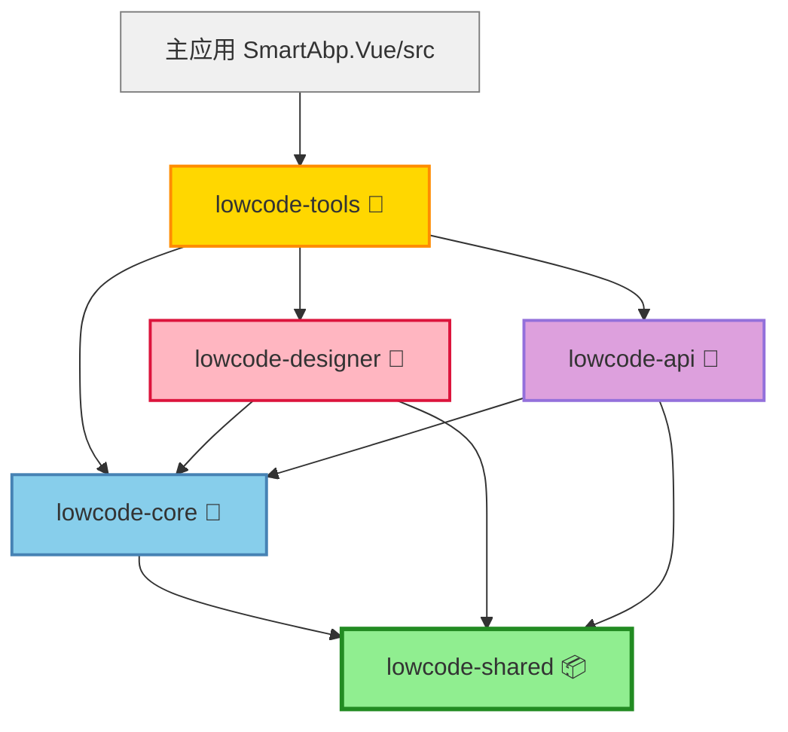

# SmartAbp Packages 依赖关系图

> 📅 生成时间: 2025-09-30
> 🎯 版本: v1.0
> 🏗️ 目的: 明确packages之间的依赖层级，确保架构整洁

## 🎯 依赖层级架构



## 📦 Packages 职责与依赖规则

### 🌿 L0: lowcode-shared (基础层 - 零依赖)
**职责**: 
- 共享工具函数、类型定义、常量
- 企业级组件注册中心
- 内存安全监控与错误处理

**依赖规则**: 
- ✅ **零依赖** - 不依赖任何其他package
- ✅ 可以使用第三方npm包
- ❌ 严禁引用主应用（@/）
- ❌ 严禁相对路径引用（../../）

**导出内容**:
```typescript
// 类型定义
export * from './types'
export type { MDIWindowConfig, TabConfig } from './types/ui'

// 工具函数
export * from './utils'

// 组件注册中心
export { ComponentRegistry, globalComponentRegistry }

// 错误处理
export * from './error'
```

---

### 🧠 L1: lowcode-core (核心引擎层)
**职责**: 
- 低代码引擎核心逻辑
- 状态管理（Pinia stores）
- 代码生成、清单写入
- 主题系统、状态机

**依赖规则**: 
- ✅ 可以依赖 `@smartabp/lowcode-shared`
- ✅ 可以使用第三方npm包
- ❌ 严禁引用主应用（@/）
- ❌ 严禁相对路径引用其他packages
- ❌ 严禁被lowcode-shared反向依赖

**导出内容**:
```typescript
// Stores
export { useEnhancedThemeStore }
export { useCodeGenerationStore }
export { useStateMachineStore }

// 类型定义
export * from './types/manifest'
export type { MDIWindowConfig, TabConfig } from '@smartabp/lowcode-shared'

// 工具函数
export * from './utils/manifestWriter'
```

---

### 🎨 L2: lowcode-designer (设计器UI层)
**职责**: 
- 可视化设计器组件
- 实体设计器、主题编辑器
- 设计视图与编辑器UI

**依赖规则**: 
- ✅ 可以依赖 `@smartabp/lowcode-shared`
- ✅ 可以依赖 `@smartabp/lowcode-core`
- ✅ 可以使用第三方npm包
- ❌ 严禁引用主应用（@/）
- ❌ 严禁相对路径引用
- ❌ 严禁被lowcode-core反向依赖

**导出内容**:
```typescript
// 设计器组件
export { EntityDesigner }
export { ThemeEditor }
export { VisualDesignerView }
```

---

### 🔌 L2: lowcode-api (API接口层)
**职责**: 
- HTTP请求封装
- 数据库操作API
- 外部接口集成

**依赖规则**: 
- ✅ 可以依赖 `@smartabp/lowcode-shared`
- ✅ 可以依赖 `@smartabp/lowcode-core`
- ✅ 可以使用第三方npm包（如axios）
- ❌ 严禁引用主应用（@/）
- ❌ 严禁相对路径引用

**导出内容**:
```typescript
// API方法
export { databaseApi }
export { templatesApi }
```

---

### 🌉 L3: lowcode-tools (桥接工具层)
**职责**: 
- **桥接层** - 连接主应用与packages
- 主应用特定工具函数封装
- 允许使用@/别名（唯一白名单）

**依赖规则**: 
- ✅ **允许**使用 `@/` 主应用引用（唯一白名单）
- ✅ 可以依赖 `@smartabp/lowcode-shared`
- ✅ 可以依赖 `@smartabp/lowcode-core`
- ✅ 可以使用第三方npm包
- ⚠️  **特殊角色** - 作为主应用与packages的桥接层

**导出内容**:
```typescript
// 桥接工具函数
export * from '@/utils/logger'
export * from '@/utils/request'
export * from '@/utils/storage'
```

---

## 🚨 架构违规检测机制

### 第一关：相对路径违规检查
```bash
grep -r "from ['\"]\.\.\/\.\.\/" src/SmartAbp.Vue/packages/
```
**零容忍标准**: 0个违规

### 第二关：主应用引用违规检查
```bash
grep -r "from ['\"]@\/" src/SmartAbp.Vue/packages/ | \
    grep -v "packages/lowcode-tools/"
```
**白名单**: lowcode-tools桥接层除外
**零容忍标准**: 0个违规（除lowcode-tools）

### 第三关：类型安全绕过检查
```bash
grep -r "as any" src/SmartAbp.Vue/packages/
grep -r "@ts-ignore" src/SmartAbp.Vue/packages/
```
**零容忍标准**: 0个使用

---

## 📊 当前架构状态（2025-09-30）

### ✅ 已完成
- [x] lowcode-shared完全零依赖
- [x] UI类型（MDIWindowConfig、TabConfig）迁移至lowcode-shared
- [x] lowcode-core消除主应用引用违规
- [x] lowcode-tools白名单机制建立

### 🔄 进行中
- [ ] 修复7个相对路径违规
- [ ] 修复3个类型安全绕过（as any）
- [ ] 完善packages文档

### 📝 待优化
- [ ] 建立packages版本管理
- [ ] 实现packages独立构建
- [ ] 优化packages加载性能

---

## 🔗 相关文档
- [AI编程架构保护方案](./AI编程架构保护方案.md)
- [前端框架工程化优化方案](./前端框架工程化优化方案-整理版.md)
- [架构守卫脚本](../../scripts/quality/architecture-guard.sh)

---

**🎯 核心原则**: 
1. **单向依赖** - 下层不依赖上层
2. **黑盒隔离** - packages独立性强
3. **别名通信** - 统一使用@smartabp别名
4. **桥接模式** - lowcode-tools专职桥接
