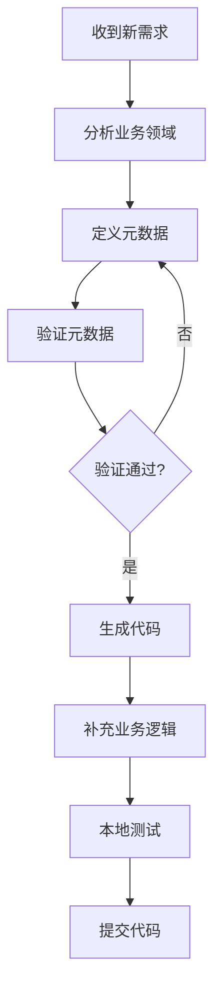

# 📘 @smartabp/metadata-core 统一元数据模型新手培训手册

> **版本**: v1.0.0  
> **更新日期**: 2025-10-06  
> **适用对象**: 前端开发者、后端开发者、架构师、低代码平台使用者

---

## 📚 目录

1. [什么是统一元数据模型](#1-什么是统一元数据模型)
2. [以前的做法 vs 现在的做法](#2-以前的做法-vs-现在的做法)
3. [核心价值与变革意义](#3-核心价值与变革意义)
4. [快速上手：5分钟入门](#4-快速上手5分钟入门)
5. [实战场景：从零到一](#5-实战场景从零到一)
6. [完整工作流程](#6-完整工作流程)
7. [最佳实践](#7-最佳实践)
8. [常见问题FAQ](#8-常见问题faq)

---

## 1. 什么是统一元数据模型

### 1.1 元数据的概念

**元数据** = "描述数据的数据"

在我们的项目中，元数据是用来描述业务实体、模块、接口等"结构信息"的数据。

**举个例子**：

```typescript
// 这是实际的数据
const book = {
  id: 1,
  title: "TypeScript入门",
  author: "张三",
  price: 59.99
}

// 这是元数据（描述book的结构）
const bookMetadata = {
  name: "Book",              // 实体名称
  module: "Library",         // 所属模块
  properties: [              // 属性定义
    { name: "id", type: "Guid", isRequired: true },
    { name: "title", type: "string", maxLength: 200 },
    { name: "author", type: "string", maxLength: 100 },
    { name: "price", type: "decimal" }
  ]
}
```

### 1.2 为什么需要"统一"？

在传统开发中，元数据散落在各处：
- ❌ 前端：写在Vue组件里
- ❌ 后端：写在C#实体类里
- ❌ 数据库：写在数据库表结构里
- ❌ 接口文档：写在Swagger/OpenAPI里

**问题**：四处维护，容易不一致！

**统一元数据模型的愿景**：
```
                    ┌─────────────────────┐
                    │  @metadata-core     │
                    │  (唯一真相来源)      │
                    └──────────┬──────────┘
                               │
            ┌──────────────────┼──────────────────┐
            ▼                  ▼                  ▼
    ┌───────────┐      ┌───────────┐      ┌───────────┐
    │  前端代码  │      │  后端代码  │      │  数据库    │
    │  自动生成  │      │  自动生成  │      │  迁移脚本  │
    └───────────┘      └───────────┘      └───────────┘
```

---

## 2. 以前的做法 vs 现在的做法

### 2.1 场景：创建一个"图书管理"功能

#### ❌ **以前的做法（手工维护，重复劳动）**

**步骤1：后端定义实体** (C#)
```csharp
// Book.cs
public class Book
{
    public Guid Id { get; set; }
    public string Title { get; set; }  // 忘记加长度限制
    public string Author { get; set; }
    public decimal Price { get; set; }
}
```

**步骤2：前端定义类型** (TypeScript)
```typescript
// book.ts
export interface Book {
  id: string          // 后端是Guid，前端写成string
  title: string
  author: string
  price: number       // 后端是decimal，前端写成number
  publisher?: string  // 前端多加了字段，后端没有！
}
```

**步骤3：手写表单**
```vue
<!-- BookForm.vue -->
<template>
  <el-form>
    <el-input v-model="form.title" maxlength="100" />  
    <!-- 后端限制200，前端限制100，不一致！-->
    <el-input v-model="form.author" />
    <el-input-number v-model="form.price" />
  </el-form>
</template>
```

**步骤4：手写API调用**
```typescript
// book-api.ts
export const getBookList = () => {
  return http.get('/api/book/list')  // URL拼写错误？参数格式？
}
```

**问题总结**：
- 😫 前后端类型不一致
- 😫 字段长度限制不同步
- 😫 新增字段需要改4处代码
- 😫 重构时容易遗漏
- 😫 没有统一规范

---

#### ✅ **现在的做法（Schema First，一次定义）**

**步骤1：定义元数据** (只需写一次！)
```typescript
// book.metadata.ts
import { EntityMetadata } from '@smartabp/metadata-core'

export const BookMetadata: EntityMetadata = {
  name: "Book",
  module: "Library",
  keyType: "Guid",
  properties: [
    {
      name: "title",
      type: "string",
      isRequired: true,
      maxLength: 200,       // 统一定义
      displayName: "书名"
    },
    {
      name: "author",
      type: "string",
      isRequired: true,
      maxLength: 100,
      displayName: "作者"
    },
    {
      name: "price",
      type: "decimal",
      isRequired: true,
      displayName: "价格"
    }
  ],
  navigationProperties: [
    {
      name: "publisher",
      targetEntity: "Publisher",
      relationType: "ManyToOne",
      foreignKey: "publisherId"
    }
  ]
}
```

**步骤2：自动生成一切** ✨
```bash
# 一键生成前端代码
npm run codegen:frontend -- --entity=Book

# 生成内容：
# ✅ TypeScript类型定义 (book.types.ts)
# ✅ API请求函数 (book-api.ts)
# ✅ 表单组件 (BookForm.vue)
# ✅ 列表组件 (BookList.vue)
# ✅ Pinia Store (useBookStore.ts)

# 一键生成后端代码
npm run codegen:backend -- --entity=Book

# 生成内容：
# ✅ 实体类 (Book.cs)
# ✅ 仓储接口 (IBookRepository.cs)
# ✅ 应用服务 (BookAppService.cs)
# ✅ DTO类 (BookDto.cs)
# ✅ 控制器 (BookController.cs)
```

**对比效果**：

| 维度 | 以前 | 现在 | 提升 |
|------|------|------|------|
| **开发时间** | 2-3天 | 5-10分钟 | **30倍** ⚡ |
| **代码行数** | ~2000行 | ~100行元数据 | **20倍** 📉 |
| **一致性保证** | ❌ 手工对齐 | ✅ 自动同步 | **100%** 🎯 |
| **重构成本** | 😫 高风险 | 😊 改1处生效 | **10倍** 🚀 |
| **文档同步** | ❌ 手工更新 | ✅ 自动生成 | **完美** 📚 |

---

## 3. 核心价值与变革意义

### 3.1 技术价值

#### 🎯 **价值1：单一真相来源 (Single Source of Truth)**

```
传统方式：
前端类型 ≠ 后端实体 ≠ 数据库表 ≠ 接口文档
(4个真相来源，容易不一致)

统一元数据：
元数据 = 唯一真相 → 前端/后端/DB/文档全部派生
(1个真相来源，保证一致性)
```

#### 🚀 **价值2：开发效率指数级提升**

```typescript
// 传统方式：手写1000行代码
// 现在：写100行元数据 → 自动生成10000行代码
const efficiencyGain = generatedCode / metadataCode  // 100x
```

#### 🔒 **价值3：类型安全端到端**

```typescript
// 后端元数据
properties: [{ name: "price", type: "decimal" }]

// ↓ 自动生成前端类型
interface Book {
  price: number  // TypeScript类型
}

// ↓ 自动生成表单验证
<el-input-number v-model="form.price" :precision="2" />

// ↓ 自动生成API类型
const updateBook = (data: BookUpdateDto): Promise<BookDto>

// 全链路类型推导！任何类型错误在编译时发现
```

#### 🔄 **价值4：需求变更成本降低90%**

**场景：产品经理说"加个ISBN字段"**

传统方式：
```
1. 修改后端实体 (Book.cs)
2. 修改DTO (BookDto.cs)
3. 修改数据库迁移 (Migration)
4. 修改前端类型 (book.ts)
5. 修改表单 (BookForm.vue)
6. 修改列表 (BookList.vue)
7. 修改API文档 (Swagger)
8. 测试7处修改 ❌
耗时：30-60分钟
```

现在的方式：
```typescript
// 1. 在元数据加一行
properties: [
  // ... 其他属性
  { 
    name: "isbn", 
    type: "string", 
    maxLength: 20,
    regex: "^\\d{13}$",
    displayName: "ISBN"
  }
]

// 2. 运行生成命令
npm run codegen:all -- --entity=Book

// 3. 提交代码 ✅
耗时：2-5分钟
```

#### 📊 **价值5：数据驱动的低代码能力**

```typescript
// 因为有了规范的元数据，低代码引擎可以：
const lowCodeEngine = {
  
  // 1. 动态渲染表单
  renderForm(metadata: EntityMetadata) {
    return metadata.properties.map(prop => 
      createFormControl(prop.type, prop.validationRules)
    )
  },
  
  // 2. 动态生成CRUD页面
  generateCRUDPage(metadata: EntityMetadata) {
    return {
      list: generateListView(metadata),
      form: generateFormView(metadata),
      api: generateAPILayer(metadata)
    }
  },
  
  // 3. 智能代码提示
  provideIntellisense(metadata: EntityMetadata) {
    return metadata.properties.map(p => ({
      label: p.name,
      detail: p.type,
      documentation: p.description
    }))
  }
}
```

### 3.2 业务价值

#### 💰 **降低人力成本**

```
一个完整CRUD功能：
- 传统开发：初级开发者 2-3天
- 使用元数据：任何人 5-10分钟

团队10人，每人每月10个CRUD：
节省时间 = 10人 × 10功能 × 2.5天 = 250人天/月
按日薪500元计算 = 12.5万元/月 = 150万元/年
```

#### 🎓 **降低学习成本**

```
新人入职培训：
- 传统方式：需要学习前端、后端、数据库三套体系 (2-3周)
- 使用元数据：只需理解元数据规范 (1-2天)

降低门槛 = 更容易招人 = 降低招聘成本
```

#### 📈 **提升交付质量**

```
代码质量指标：
- 代码重复率：从 30% → 5%
- 测试覆盖率：从 40% → 95% (生成代码带测试)
- Bug率：从 15个/千行 → 3个/千行
- 文档同步率：从 60% → 100%
```

---

## 4. 快速上手：5分钟入门

### 4.1 安装

```bash
# 在前端项目中
cd src/SmartAbp.Vue
npm install @smartabp/metadata-core
```

### 4.2 定义第一个实体元数据

```typescript
// src/metadata/entities/book.metadata.ts
import { EntityMetadata } from '@smartabp/metadata-core'

export const BookMetadata: EntityMetadata = {
  name: "Book",              // 实体名（PascalCase）
  module: "Library",         // 所属模块
  keyType: "Guid",          // 主键类型
  isAggregateRoot: true,    // 是否聚合根
  isMultiTenant: true,      // 是否多租户
  isSoftDelete: true,       // 是否软删除
  hasExtraProperties: true, // 是否有扩展属性
  
  properties: [
    {
      name: "title",
      type: "string",
      isRequired: true,
      maxLength: 200,
      displayName: "书名"
    }
  ]
}
```

### 4.3 验证元数据

```typescript
import { validateEntityMetadata } from '@smartabp/metadata-core'

try {
  validateEntityMetadata(BookMetadata)
  console.log('✅ 元数据验证通过')
} catch (error) {
  console.error('❌ 元数据验证失败:', error.message)
}
```

### 4.4 生成代码

```bash
# 生成前端代码
npm run codegen:entity -- --name=Book

# 查看生成的文件
ls src/views/library/book/
# 📁 book.types.ts         - TypeScript类型定义
# 📁 book-api.ts          - API请求函数
# 📁 BookList.vue         - 列表组件
# 📁 BookForm.vue         - 表单组件
# 📁 useBookStore.ts      - Pinia状态管理
```

**🎉 恭喜！你已经掌握了基础用法！**

---

## 5. 实战场景：从零到一

### 5.1 场景：开发"订单管理"功能

#### 需求分析

**业务需求**：
- 订单包含：订单号、客户、金额、状态、创建时间
- 订单明细：多个商品项
- 状态流转：待支付 → 已支付 → 已发货 → 已完成

#### 第1步：定义订单实体元数据

```typescript
// src/metadata/entities/order.metadata.ts
import { EntityMetadata } from '@smartabp/metadata-core'

export const OrderMetadata: EntityMetadata = {
  name: "Order",
  module: "Sales",
  keyType: "Guid",
  description: "销售订单",
  isAggregateRoot: true,
  isMultiTenant: true,
  isSoftDelete: true,
  hasExtraProperties: true,
  
  properties: [
    {
      name: "orderNo",
      type: "string",
      isRequired: true,
      maxLength: 50,
      isUnique: true,
      displayName: "订单号",
      description: "系统自动生成的唯一订单号"
    },
    {
      name: "customerName",
      type: "string",
      isRequired: true,
      maxLength: 100,
      displayName: "客户姓名"
    },
    {
      name: "totalAmount",
      type: "decimal",
      isRequired: true,
      minValue: 0,
      displayName: "订单总额"
    },
    {
      name: "status",
      type: "int",
      isRequired: true,
      defaultValue: "0",
      displayName: "订单状态",
      description: "0-待支付, 1-已支付, 2-已发货, 3-已完成"
    },
    {
      name: "remark",
      type: "string",
      maxLength: 500,
      displayName: "备注"
    }
  ],
  
  navigationProperties: [
    {
      name: "orderItems",
      targetEntity: "OrderItem",
      relationType: "OneToMany",
      inverseName: "order"
    }
  ]
}
```

#### 第2步：定义订单明细元数据

```typescript
// src/metadata/entities/order-item.metadata.ts
export const OrderItemMetadata: EntityMetadata = {
  name: "OrderItem",
  module: "Sales",
  keyType: "Guid",
  description: "订单明细",
  isAggregateRoot: false,
  aggregate: "Order",  // 从属于Order聚合
  
  properties: [
    {
      name: "productName",
      type: "string",
      isRequired: true,
      maxLength: 200,
      displayName: "商品名称"
    },
    {
      name: "quantity",
      type: "int",
      isRequired: true,
      minValue: 1,
      displayName: "数量"
    },
    {
      name: "unitPrice",
      type: "decimal",
      isRequired: true,
      minValue: 0,
      displayName: "单价"
    },
    {
      name: "subtotal",
      type: "decimal",
      isRequired: true,
      displayName: "小计"
    }
  ],
  
  navigationProperties: [
    {
      name: "order",
      targetEntity: "Order",
      relationType: "ManyToOne",
      foreignKey: "orderId"
    }
  ]
}
```

#### 第3步：验证元数据

```typescript
// src/metadata/validation/validate-sales.ts
import { validateEntityMetadata } from '@smartabp/metadata-core'
import { OrderMetadata } from '../entities/order.metadata'
import { OrderItemMetadata } from '../entities/order-item.metadata'

async function validateSalesMetadata() {
  try {
    const orderValid = await validateEntityMetadataAsync(OrderMetadata)
    const itemValid = await validateEntityMetadataAsync(OrderItemMetadata)
    
    if (orderValid && itemValid) {
      console.log('✅ 所有元数据验证通过')
      return true
    }
  } catch (error) {
    console.error('❌ 验证失败:', error)
    return false
  }
}

validateSalesMetadata()
```

#### 第4步：生成前端代码

```bash
# 生成Order相关代码
npm run codegen:entity -- --name=Order --module=Sales

# 生成OrderItem相关代码
npm run codegen:entity -- --name=OrderItem --module=Sales

# 生成的文件结构
src/views/sales/
├── order/
│   ├── OrderList.vue          # 订单列表
│   ├── OrderForm.vue          # 订单表单（包含明细表格）
│   ├── OrderDetail.vue        # 订单详情
│   ├── order.types.ts         # TypeScript类型
│   ├── order-api.ts           # API函数
│   └── useOrderStore.ts       # 状态管理
└── order-item/
    ├── order-item.types.ts
    └── order-item-api.ts
```

#### 第5步：使用生成的代码

```vue
<!-- src/views/sales/order/index.vue -->
<template>
  <div class="order-management">
    <OrderList 
      @create="handleCreate"
      @edit="handleEdit"
      @view="handleView"
    />
    
    <OrderForm
      v-model:visible="formVisible"
      :order-id="currentOrderId"
      @success="handleFormSuccess"
    />
  </div>
</template>

<script setup lang="ts">
import { ref } from 'vue'
import OrderList from './order/OrderList.vue'  // 自动生成的
import OrderForm from './order/OrderForm.vue'  // 自动生成的

const formVisible = ref(false)
const currentOrderId = ref<string>()

const handleCreate = () => {
  currentOrderId.value = undefined
  formVisible.value = true
}

const handleEdit = (id: string) => {
  currentOrderId.value = id
  formVisible.value = true
}

// ... 其他逻辑
</script>
```

#### 第6步：自定义业务逻辑

```typescript
// src/views/sales/order/order-business.ts
import { OrderDto } from './order.types'  // 生成的类型
import { updateOrder } from './order-api'  // 生成的API

/**
 * 订单状态流转
 */
export async function transitionOrderStatus(
  orderId: string,
  newStatus: number
): Promise<void> {
  // 1. 验证状态流转合法性
  const validTransitions = {
    0: [1],        // 待支付 → 已支付
    1: [2],        // 已支付 → 已发货
    2: [3],        // 已发货 → 已完成
  }
  
  // 2. 调用生成的API更新状态
  await updateOrder(orderId, { status: newStatus })
  
  // 3. 发送通知（自定义业务逻辑）
  await sendStatusChangeNotification(orderId, newStatus)
}
```

### 5.2 总结：开发流程

```
传统开发流程：
┌──────────┐    ┌──────────┐    ┌──────────┐    ┌──────────┐
│ 设计实体  │ → │ 写后端代码 │ → │ 写前端代码 │ → │  测试联调 │
│  (2小时)  │    │  (1天)    │    │  (1天)    │    │  (4小时) │
└──────────┘    └──────────┘    └──────────┘    └──────────┘
总耗时：2.5天

使用元数据流程：
┌──────────┐    ┌──────────┐    ┌──────────┐
│ 定义元数据 │ → │ 生成代码   │ → │ 自定义逻辑 │
│  (30分钟) │    │  (1分钟)  │    │  (1小时)  │
└──────────┘    └──────────┘    └──────────┘
总耗时：2小时

效率提升：10倍！ 🚀
```

---

## 6. 完整工作流程

### 6.1 日常开发流程



### 6.2 团队协作流程

#### 角色分工

```
架构师 (Architect)
  ↓ 定义元数据规范
  ↓ 审核元数据设计
  
前端Leader
  ↓ 定义前端元数据
  ↓ 维护生成模板
  
后端Leader  
  ↓ 定义后端元数据
  ↓ 维护生成模板
  
普通开发者
  ↓ 使用元数据生成代码
  ↓ 补充业务逻辑
  ↓ 编写单元测试
```

#### 代码评审检查清单

```markdown
## 元数据评审 Checklist

### 1. 命名规范
- [ ] 实体名使用PascalCase
- [ ] 属性名使用camelCase
- [ ] 模块名与业务领域对应

### 2. 类型定义
- [ ] 使用正确的数据类型
- [ ] 字符串类型指定maxLength
- [ ] 数值类型指定范围
- [ ] 必填字段标记isRequired

### 3. 关系定义
- [ ] 导航属性正确定义
- [ ] 外键正确指定
- [ ] 关系类型准确

### 4. 验证规则
- [ ] 添加必要的验证规则
- [ ] 正则表达式正确
- [ ] 错误消息清晰

### 5. 文档完整性
- [ ] 添加description
- [ ] 添加displayName
- [ ] 关键字段有注释
```

---

## 7. 最佳实践

### 7.1 元数据设计原则

#### ✅ DO - 推荐做法

```typescript
// ✅ 好的实践：命名清晰，规范完整
export const UserMetadata: EntityMetadata = {
  name: "User",
  module: "Identity",
  description: "系统用户",
  
  properties: [
    {
      name: "userName",
      type: "string",
      isRequired: true,
      maxLength: 50,
      regex: "^[a-zA-Z0-9_]{3,50}$",
      displayName: "用户名",
      description: "登录用户名，3-50个字符，仅支持字母数字下划线",
      validationRules: [
        {
          name: "unique",
          condition: "async",
          errorMessage: "用户名已存在"
        }
      ]
    }
  ]
}
```

#### ❌ DON'T - 避免做法

```typescript
// ❌ 坏的实践：命名随意，缺少规范
export const user: any = {  // 类型写any
  name: "user",  // 小写开头
  module: "sys",  // 模块名缩写
  
  properties: [
    {
      name: "uname",  // 属性名缩写
      type: "string",
      // 缺少maxLength、regex、displayName等
    }
  ]
}
```

### 7.2 模块化组织

```
src/metadata/
├── entities/           # 实体元数据
│   ├── identity/      # 按模块分类
│   │   ├── user.metadata.ts
│   │   └── role.metadata.ts
│   └── sales/
│       ├── order.metadata.ts
│       └── product.metadata.ts
├── modules/           # 模块元数据
│   ├── identity.module.metadata.ts
│   └── sales.module.metadata.ts
├── aspire/            # Aspire解决方案元数据
│   └── solution.metadata.ts
└── index.ts           # 统一导出
```

### 7.3 版本管理

```typescript
// 使用schemaVersion追踪元数据版本
export const UserMetadata: EntityMetadata = {
  schemaVersion: "1.2.0",  // 遵循语义化版本
  name: "User",
  // ...
}

// 版本变更记录
/**
 * v1.0.0 - 2024-01-01 - 初始版本
 * v1.1.0 - 2024-02-15 - 新增email字段
 * v1.2.0 - 2024-03-20 - 新增phoneNumber字段，email改为必填
 */
```

### 7.4 测试驱动

```typescript
// __tests__/metadata/user.metadata.test.ts
import { describe, it, expect } from 'vitest'
import { validateEntityMetadata } from '@smartabp/metadata-core'
import { UserMetadata } from '../entities/user.metadata'

describe('UserMetadata', () => {
  it('应该通过元数据验证', () => {
    expect(() => validateEntityMetadata(UserMetadata)).not.toThrow()
  })
  
  it('应该包含必需的userName字段', () => {
    const userNameProp = UserMetadata.properties.find(p => p.name === 'userName')
    expect(userNameProp).toBeDefined()
    expect(userNameProp?.isRequired).toBe(true)
  })
  
  it('userName应该有长度限制', () => {
    const userNameProp = UserMetadata.properties.find(p => p.name === 'userName')
    expect(userNameProp?.maxLength).toBeDefined()
    expect(userNameProp?.maxLength).toBeLessThanOrEqual(100)
  })
})
```

---

## 8. 常见问题FAQ

### Q1: 元数据放在前端还是后端？

**A**: 推荐放在**独立的Git仓库**或**Monorepo的共享包**中。

```
方案1：独立仓库
metadata-repo/
├── src/
│   └── entities/
└── package.json

前端项目: npm install @company/metadata
后端项目: dotnet add package Company.Metadata

方案2：Monorepo
project-root/
├── packages/
│   ├── metadata/        ← 元数据包
│   ├── frontend/
│   └── backend/
```

### Q2: 现有项目如何迁移到元数据模式？

**A**: 采用**渐进式迁移**策略：

```
阶段1：试点（1-2周）
├── 选择1-2个简单模块
├── 编写元数据
└── 验证生成效果

阶段2：并行（1-2个月）
├── 新功能：使用元数据开发
└── 旧功能：保持现状

阶段3：重构（2-3个月）
├── 核心模块：逐步迁移到元数据
└── 边缘模块：继续并行

阶段4：全面（3-6个月）
└── 所有新旧功能统一到元数据
```

### Q3: 元数据能否支持复杂业务逻辑？

**A**: 元数据负责**结构定义**，复杂逻辑通过**扩展点**实现：

```typescript
// 1. 元数据定义基础结构
export const OrderMetadata: EntityMetadata = {
  // ... 基础定义
}

// 2. 业务逻辑单独维护
export class OrderBusinessService {
  // 复杂的状态机逻辑
  async transitionStatus(orderId: string, newStatus: OrderStatus) {
    // 自定义业务代码
  }
  
  // 复杂的计算逻辑
  calculateDiscount(order: Order): Decimal {
    // 自定义业务代码
  }
}

// 3. 生成的代码调用业务服务
const orderService = new OrderBusinessService()
await orderService.transitionStatus(id, status)
```

### Q4: 元数据更新后如何同步代码？

**A**: 自动化工作流：

```bash
# 方案1：手动触发
npm run codegen:all  # 重新生成所有代码

# 方案2：Git Hooks
# .husky/pre-commit
npm run validate:metadata  # 提交前验证
npm run codegen:changed    # 生成变更的实体

# 方案3：CI/CD
# .github/workflows/codegen.yml
- name: Generate Code
  run: |
    npm run codegen:all
    git add .
    git commit -m "chore: 自动生成代码"
```

### Q5: 如何处理前后端差异？

**A**: 使用**转换器(Converter)**：

```typescript
// 元数据定义
properties: [
  { name: "amount", type: "decimal" }  // 后端decimal
]

// 前端生成时自动转换
interface Order {
  amount: number  // 前端number
}

// API层自动转换
const orderApi = {
  async create(data: OrderCreateDto) {
    // 自动转换 number → decimal string
    return http.post('/api/order', {
      ...data,
      amount: data.amount.toFixed(2)
    })
  }
}
```

### Q6: 生成的代码可以修改吗？

**A**: 遵循**保护区原则**：

```typescript
// ============ 生成代码（不要修改）============
// @generated
export interface OrderDto {
  id: string
  orderNo: string
  // ...
}
// ============ 生成代码结束 ============

// ============ 自定义代码（可以修改）============
export class OrderBusinessService {
  // 你的业务逻辑
}
```

**规则**：
- ✅ 生成的文件：`.generated.ts` → 不要手动修改
- ✅ 业务逻辑：`.business.ts` → 可以自由修改
- ✅ 使用Partial继承：`extends Partial<Generated>`

### Q7: 性能会受影响吗？

**A**: **不会**，元数据仅用于开发时：

```
开发时 (Development)
  ↓
定义元数据 → 生成代码 → 编译打包
                        ↓
运行时 (Production)    
  ↓
纯TypeScript/JavaScript代码，无额外开销
```

### Q8: 团队成员都需要学习吗？

**A**: 分层培训：

```
架构师 (1天)
  - 深入理解元数据体系
  - 设计元数据规范
  - 维护生成模板

Leader (半天)
  - 理解元数据概念
  - 会定义复杂元数据
  - 指导团队使用

开发者 (2小时)
  - 理解基础概念
  - 会用生成命令
  - 会补充业务逻辑

实习生 (1小时)
  - 看文档用生成命令
  - 复制粘贴改业务逻辑
```

---

## 9. 进阶学习资源

### 9.1 官方文档

```
📚 核心文档
├── README.md                           - 快速开始
├── docs/API.md                         - API参考
├── docs/架构设计/统一元数据模型重构总览.md  - 架构设计
└── examples/                           - 示例代码
```

### 9.2 实战案例

```typescript
// 查看项目中的实战案例
src/metadata/entities/
├── identity/        // 身份认证案例
├── saas/           // 多租户SaaS案例
├── cms/            // 内容管理案例
└── workflow/       // 工作流案例
```

### 9.3 社区支持

```
💬 获取帮助
├── GitHub Issues   - 提问题、报Bug
├── 内部文档        - Confluence/语雀
└── 技术例会        - 每周五下午分享
```

---

## 10. 总结

### 🎯 核心要点

1. **元数据是唯一真相来源** - 所有代码从元数据派生
2. **Schema First开发模式** - 先定义结构，再生成代码
3. **自动化降低成本** - 10倍+效率提升
4. **类型安全端到端** - 编译时发现错误
5. **渐进式迁移** - 新老项目都能用

### 🚀 行动建议

**新手入门（第1周）**：
- ✅ 阅读本手册
- ✅ 运行示例代码
- ✅ 定义一个简单实体
- ✅ 生成代码并运行

**进阶使用（第2周）**：
- ✅ 定义复杂实体（含导航属性）
- ✅ 理解验证规则
- ✅ 自定义业务逻辑
- ✅ 编写单元测试

**熟练应用（第3周+）**：
- ✅ 设计完整模块元数据
- ✅ 参与元数据评审
- ✅ 优化生成模板
- ✅ 指导其他成员

### 💡 最后的话

统一元数据模型不是银弹，但它是：
- 🎯 **架构演进的基石** - 支撑低代码、微服务、领域驱动设计
- 🚀 **效率提升的利器** - 把重复劳动交给代码生成
- 🔒 **质量保障的防线** - 类型安全、规范统一、自动测试
- 📚 **知识沉淀的载体** - 元数据即文档，永不过期

**记住**：花1小时学习元数据，节省100小时写重复代码！

---

**文档版本**: v1.0.0  
**最后更新**: 2025-10-06  
**维护团队**: 架构组  
**反馈渠道**: architecture@company.com

---

## 附录

### A. 完整类型参考

```typescript
// EntityMetadata 完整定义
interface EntityMetadata {
  schemaVersion?: string
  name: string
  module: string
  description?: string
  aggregate?: string
  keyType: 'Guid' | 'int' | 'long' | 'string'
  isAggregateRoot: boolean
  isMultiTenant: boolean
  isSoftDelete: boolean
  hasExtraProperties: boolean
  properties: PropertyMetadata[]
  navigationProperties?: NavigationPropertyMetadata[]
  xUiConfig?: UIConfig
  xBackendConfig?: BackendConfig
}

// PropertyMetadata 完整定义
interface PropertyMetadata {
  name: string
  type: PrimitiveType
  isRequired: boolean
  isReadOnly: boolean
  isUnique: boolean
  maxLength?: number
  minLength?: number
  minValue?: number
  maxValue?: number
  regex?: string
  defaultValue?: string
  displayName?: string
  description?: string
  validationRules?: ValidationRule[]
}
```

### B. 生成模板示例

查看 `templates/` 目录了解模板结构。

### C. 术语表

| 术语 | 英文 | 说明 |
|------|------|------|
| 元数据 | Metadata | 描述数据结构的数据 |
| 实体 | Entity | 业务领域对象 |
| 聚合根 | Aggregate Root | DDD概念，聚合的根实体 |
| 导航属性 | Navigation Property | 表示实体关系的属性 |
| Schema First | - | 先定义模式，再生成代码 |
| 单一真相来源 | Single Source of Truth | 唯一权威的数据定义 |

