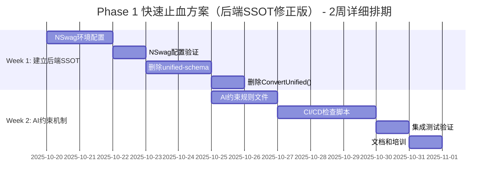

# SmartAbpV2.0渐进式混合策略 - 快速止血方案详细开发方案

**文档版本**: v1.1（后端SSOT修正版）✅
**修正日期**: 2025-10-17
**执行周期**: 2周（10个工作日）
**执行优先级**: 🔥 P0最高优先级（立即执行）
**架构决策**: 后端SSOT（C# DTOs为唯一真实来源）+ NSwag自动生成

---

## 🚨 v1.1修正说明

```yaml
v1.0问题诊断:
  ❌ Day 3-4任务: unified-schema重构为re-export
  ❌ 架构矛盾: 还在维护前端中间层
  ❌ 与后端SSOT架构决策冲突

v1.1核心修正:
  ✅ 删除unified-schema.ts（不需要中间层）
  ✅ 前端直接import from '@/api/generated/types'
  ✅ 完全依赖后端SSOT
  ✅ 彻底消除前端类型定义

修正范围:
  - Day 3-4任务完全重写
  - 验收标准调整
  - 质量检查调整
  - AI约束规则调整
```

---

## 📋 目录

1. [方案总览](#一方案总览)
2. [资源规划矩阵](#二资源规划矩阵)
3. [Week 1详细任务分解](#三week-1详细任务分解)
4. [Week 2详细任务分解](#四week-2详细任务分解)
5. [质量保障体系](#五质量保障体系)
6. [风险应对矩阵](#六风险应对矩阵)
7. [验收标准](#七验收标准)
8. [附录：技术配置模板](#八附录技术配置模板)

---

## 一、方案总览

### 1.1 核心目标

```yaml
战略目标:
  彻底建立后端SSOT架构，前端零类型定义

量化指标:
  ✅ 前后端类型一致性: 从60% → 100%
  ✅ AI类型错误率: 降低≥80%（从20次/周 → 4次/周）
  ✅ 类型修改时间: 从30分钟 → 5分钟（6倍提升）
  ✅ 前端类型定义: 从944行 → 0行（100%删除）✅
  ✅ 代码行数减少: ≥1500行（删除unified-schema + ConvertUnified()）✅
  ✅ CI/CD检查有效率: 100%（违规代码0通过）

技术方案（后端SSOT）:
  1. 后端定义: C# DTOs为唯一真实来源
  2. NSwag自动生成: types.ts（前端只读）
  3. 删除unified-schema.ts: 不需要中间层 ✅
  4. 前端直接使用: import from '@/api/generated/types' ✅
  5. AI约束: 禁止前端定义任何DTO类型
  6. CI/CD自动检查: 4项强制规则
```

### 1.2 执行时间表（甘特图）



### 1.3 关键里程碑

| 里程碑 | 时间节点 | 量化验收标准 | 负责人 |
|--------|---------|-------------|--------|
| **M1: NSwag生成成功** | Day 3 | ✅ types.ts包含≥85%后端DTO<br>✅ TypeScript编译0错误<br>✅ 3个测试实体生成成功 | 后端开发 |
| **M2: 前端类型清零** | Day 5 | ✅ unified-schema.ts已删除 ✅<br>✅ 前端0个手动DTO定义 ✅<br>✅ 代码行数减少≥1500行 ✅ | 前端开发 |
| **M3: AI约束生效** | Day 8 | ✅ CI/CD检查4项规则100%通过<br>✅ 违规代码提交被阻止<br>✅ pre-commit钩子生效 | DevOps |
| **M4: 全面验收** | Day 10 | ✅ 前后端类型100%一致<br>✅ AI错误率降低≥80%<br>✅ 类型修改时间<5分钟 | 架构师 |

---

## 二、资源规划矩阵

### 2.1 人力资源分配

| 角色 | 人数 | 技能要求 | 投入时间 | Week 1任务 | Week 2任务 |
|------|------|---------|----------|-----------|-----------|
| **后端开发** | 1人 | .NET Core<br>OpenAPI/Swagger<br>NSwag配置 | 全职<br>（80小时） | NSwag环境配置<br>配置文件编写<br>生成验证 | 协助前端集成<br>后端类型调整 |
| **前端开发** | 1人 | TypeScript<br>Vue3/Pinia<br>类型系统 | 全职<br>（80小时） | 删除unified-schema ✅<br>删除ConvertUnified() ✅<br>直接使用types.ts ✅ | AI约束规则编写<br>前端集成测试 |
| **DevOps** | 0.5人 | CI/CD<br>GitHub Actions<br>Shell脚本 | 半职<br>（40小时） | 环境准备<br>工具安装 | CI/CD脚本编写<br>集成验证 |
| **架构师** | 0.3人 | 低代码架构<br>风险控制<br>技术决策 | 30%<br>（24小时） | 技术方案审查<br>每日站会主持 | 质量审计<br>最终验收 |

### 2.2 技术资源清单

```yaml
开发环境:
  - Visual Studio 2022 / VS Code
  - .NET 8.0 SDK
  - Node.js 20.x + pnpm 8.x
  - Git 2.40+

关键工具:
  - NSwag CLI v14.0.0（锁定版本）
  - TypeScript 5.0+
  - ESLint 8.x
  - Prettier 3.x

文档资源:
  - 后端SSOT + NSwag前端类型生成完整开发链路.md ✅
  - SSOT架构决策-前端vs后端元数据模型深度分析报告.md
  - Phase1快速止血方案v1.1（本文档）
```

### 2.3 每日工作量估算

| 工作日 | 任务 | 后端开发 | 前端开发 | DevOps | 架构师 | 合计 |
|--------|------|---------|---------|--------|--------|------|
| **Day 1** | NSwag安装配置 | 6h | 2h | 2h | 1h | 11h |
| **Day 2** | 创建nswag.json | 6h | 2h | - | 1h | 9h |
| **Day 3** | NSwag生成验证 | 4h | 4h | - | 1h | 9h |
| **Day 4** | 删除unified-schema | 2h | 6h | - | 1h | 9h |
| **Day 5** | 删除ConvertUnified() | 2h | 6h | - | 1h | 9h |
| **Day 6** | AI约束规则 | 2h | 4h | 2h | 2h | 10h |
| **Day 7** | AI约束规则 | - | 4h | 4h | 2h | 10h |
| **Day 8** | CI/CD脚本 | 2h | 2h | 6h | 2h | 12h |
| **Day 9** | CI/CD脚本 | 2h | 2h | 6h | 2h | 12h |
| **Day 10** | 集成验收 | 2h | 4h | 2h | 4h | 12h |
| **总计** | - | 28h | 36h | 22h | 17h | **103h** |

**人日统计**: 103小时 ÷ 8小时/天 = **12.875人日**

---

## 三、Week 1详细任务分解

### 🎯 Week 1总览

```yaml
核心目标:
  ✅ 建立后端SSOT架构
  ✅ NSwag自动生成types.ts
  ✅ 删除所有前端类型定义
  ✅ 前端直接使用生成的类型

关键产出:
  ✅ src/api/generated/types.ts（自动生成）
  ✅ 删除unified-schema.ts
  ✅ 删除ConvertUnified()
  ✅ 前端import全部改为 '@/api/generated/types'
```

---

### 📌 Day 1-2: NSwag环境配置

#### 任务1.1: 安装NSwag CLI工具（2小时）

**执行人**: 后端开发
**前置条件**: .NET 8.0 SDK已安装
**预期产出**: NSwag CLI v14.0.0可用

**详细步骤**:

```bash
# 步骤1: 验证.NET环境（5分钟）
dotnet --version
# 预期输出: 8.0.x

# 步骤2: 安装NSwag CLI（10分钟）
cd src/SmartAbp.OpsManagement.Service/Host
dotnet tool install NSwag.ConsoleCore --version 14.0.0 --local

# 步骤3: 验证安装（5分钟）
dotnet nswag version
# 预期输出: NSwag command line tool for .NET Core v14.0.0

# 步骤4: 创建工具清单文件（10分钟）
cat > .config/dotnet-tools.json <<EOF
{
  "version": 1,
  "isRoot": true,
  "tools": {
    "nswag.consolecore": {
      "version": "14.0.0",
      "commands": ["nswag"]
    }
  }
}
EOF
```

**验收标准**:
```yaml
✅ dotnet nswag version 输出正确版本号
✅ .config/dotnet-tools.json 文件存在
✅ 版本锁定为14.0.0（避免依赖冲突）
```

**失败应对**:
```yaml
问题1: 网络问题导致安装失败
  → 使用离线安装包
  → 配置国内NuGet镜像

问题2: 版本冲突
  → 卸载旧版本: dotnet tool uninstall NSwag.ConsoleCore
  → 重新安装指定版本
```

---

#### 任务1.2: 创建nswag.json配置文件（4小时）

**执行人**: 后端开发
**前置条件**: 后端项目正常编译
**预期产出**: nswag.json配置文件完整

**详细步骤**:

```bash
# 步骤1: 确认Swagger端点可用（30分钟）
cd src/SmartAbp.OpsManagement.Service/Host
dotnet build
dotnet run

# 访问: https://localhost:5001/swagger/v1/swagger.json
# 验证: 返回完整的OpenAPI JSON

# 步骤2: 创建nswag.json配置文件（2小时）
cat > nswag.json <<'EOF'
{
  "$schema": "http://json.schemastore.org/nswag",
  "runtime": "Net80",
  "defaultVariables": null,

  "documentGenerator": {
    "fromDocument": {
      "url": "https://localhost:5001/swagger/v1/swagger.json",
      "output": null
    }
  },

  "codeGenerators": {
    "openApiToTypeScriptClient": {
      "className": "{controller}Client",
      "moduleName": "",
      "namespace": "",
      "typeScriptVersion": 5.0,
      "template": "Axios",
      "promiseType": "Promise",
      "httpClass": "HttpClient",
      "dateTimeType": "Date",
      "nullValue": "Undefined",
      "generateClientClasses": true,
      "generateClientInterfaces": false,
      "generateOptionalParameters": true,
      "exportTypes": true,
      "wrapDtoExceptions": true,
      "exceptionClass": "ApiException",
      "generateDtoTypes": true,
      "operationGenerationMode": "SingleClientFromOperationId",
      "markOptionalProperties": true,
      "typeStyle": "Interface",
      "generateDefaultValues": true,
      "importRequiredTypes": true,
      "useGetBaseUrlMethod": false,
      "baseUrlTokenName": "API_BASE_URL",
      "output": "../../../SmartAbp.Vue/src/api/generated/types.ts"
    }
  }
}
EOF

# 步骤3: 验证配置文件（30分钟）
# 检查JSON格式
jq . nswag.json

# 检查输出路径
ls -la ../../../SmartAbp.Vue/src/api/generated/
```

**验收标准**:
```yaml
✅ nswag.json文件存在且格式正确
✅ JSON语法验证通过（jq命令）
✅ 输出路径配置正确
✅ TypeScript版本配置为5.0
✅ 模板类型为Axios
```

**关键配置说明**:
```yaml
核心参数:
  typeScriptVersion: 5.0  # 匹配前端TS版本
  template: "Axios"        # 使用Axios HTTP客户端
  generateDtoTypes: true   # 生成DTO类型（关键）
  typeStyle: "Interface"   # 生成Interface而非Class
  markOptionalProperties: true  # 标记可选属性

输出路径:
  output: "../../../SmartAbp.Vue/src/api/generated/types.ts"
  # 相对路径: Host → SmartAbp.Vue/src/api/generated/
```

---

#### 任务1.3: 运行NSwag生成types.ts（2小时）

**执行人**: 后端开发 + 前端开发
**前置条件**: nswag.json配置完成
**预期产出**: types.ts文件生成成功

**详细步骤**:

```bash
# 步骤1: 启动后端服务（10分钟）
cd src/SmartAbp.OpsManagement.Service/Host
dotnet run
# 确保Swagger端点可访问

# 步骤2: 执行生成命令（30分钟）
# 新开终端
cd src/SmartAbp.OpsManagement.Service/Host
dotnet nswag run nswag.json

# 预期输出:
# NSwag command line tool for .NET Core v14.0.0
# Executing file 'nswag.json'...
# Duration: 00:00:03.1234567

# 步骤3: 验证生成结果（1小时）
cd ../../../SmartAbp.Vue/src/api/generated
ls -lh types.ts

# 检查文件内容
head -50 types.ts
# 应包含:
#   - ModuleMetadataDto interface
#   - EnhancedEntityModelDto interface
#   - EntityPropertyDto interface（85个字段）
#   - CodeGenerationClient class

# 检查DTO数量
grep -c "^export interface.*Dto" types.ts
# 预期: ≥50个DTO

# 步骤4: TypeScript编译验证（20分钟）
cd ../../..
npm run type-check
# 预期: 0 errors
```

**验收标准**:
```yaml
✅ types.ts文件生成成功
✅ 文件大小≥100KB（包含完整DTO）
✅ 包含≥50个DTO interface
✅ ModuleMetadataDto包含所有85个字段
✅ TypeScript编译0错误
✅ ESLint检查0警告
```

**生成的types.ts示例**:
```typescript
// 🔥 自动生成，请勿手动修改！
// Generated by NSwag v14.0.0
// OpenAPI 3.0.1

/**
 * 模块元数据DTO
 */
export interface ModuleMetadataDto {
    id: string;
    name: string;
    displayName: string;
    description: string;
    // ... 85个字段全部生成
    entities: EnhancedEntityModelDto[];
}

/**
 * 实体模型DTO
 */
export interface EnhancedEntityModelDto {
    id: string;
    name: string;
    // ... 85个字段全部生成
    properties: EntityPropertyDto[];
}

/**
 * 代码生成API客户端
 */
export class CodeGenerationClient {
    constructor(
        baseUrl?: string,
        http?: { fetch(url: RequestInfo, init?: RequestInit): Promise<Response> }
    ) {}

    generateFromUnifiedSchemaAsync(
        metadata: ModuleMetadataDto
    ): Promise<GeneratedModuleDto> {
        // 自动生成的API调用代码
    }
}
```

**失败应对**:
```yaml
问题1: 后端服务未启动
  → 确认dotnet run正常运行
  → 验证https://localhost:5001/swagger/v1/swagger.json可访问

问题2: 生成的types.ts不完整
  → 检查后端DTO定义
  → 确认Swagger配置包含所有Controller
  → 检查nswag.json的documentGenerator.url

问题3: TypeScript编译错误
  → 检查tsconfig.json配置
  → 确认TypeScript版本≥5.0
  → 调整nswag.json的typeScriptVersion参数
```

---

### 📌 Day 3-4: 删除unified-schema.ts + 前端直接使用types.ts（⭐核心修正）

#### 任务2.1: 备份现有unified-schema.ts（30分钟）

**执行人**: 前端开发
**前置条件**: types.ts已生成
**预期产出**: 备份文件和统计数据

**详细步骤**:

```bash
# 步骤1: 创建备份（10分钟）
cd src/SmartAbp.Vue/packages/lowcode-shared/src/types
cp unified-schema.ts unified-schema.ts.backup
cp unified-schema.ts ../../../../../docs/archived/unified-schema-v1.0.ts

# 步骤2: 统计现有代码行数（10分钟）
wc -l unified-schema.ts
# 预期: 944行

# 统计类型定义数量
grep -c "^export interface\|^export type" unified-schema.ts
# 预期: ≥30个类型定义

# 步骤3: 记录所有export（10分钟）
grep "^export" unified-schema.ts > unified-schema-exports.txt
# 保存所有导出清单，供后续替换使用
```

**验收标准**:
```yaml
✅ 备份文件创建成功
✅ 代码行数统计完成
✅ 导出清单文件生成
✅ 备份位置记录在文档
```

---

#### 任务2.2: 删除unified-schema.ts（⭐核心步骤）（2小时）

**执行人**: 前端开发
**前置条件**: 备份完成
**预期产出**: unified-schema.ts已删除

**详细步骤**:

```bash
# 步骤1: 删除文件（5分钟）
cd src/SmartAbp.Vue/packages/lowcode-shared/src/types
rm unified-schema.ts

# 步骤2: 更新index.ts导出（15分钟）
# packages/lowcode-shared/src/types/index.ts

# ❌ 删除旧的re-export
# export * from './unified-schema'

# ✅ 不需要任何re-export（前端直接使用types.ts）

# 步骤3: 验证删除（10分钟）
cd ../../../../..
find src/SmartAbp.Vue -name "unified-schema.ts"
# 预期: 无结果（文件已删除）

# 步骤4: 编译检查（会报错，正常）（1.5小时）
cd src/SmartAbp.Vue
npm run type-check
# 预期: 大量编译错误（所有引用unified-schema的位置）
# 这是正常的，下一步会修复
```

**验收标准**:
```yaml
✅ unified-schema.ts文件已删除
✅ packages/lowcode-shared/src/types/index.ts不再re-export
✅ 编译报错（预期行为）
✅ 报错位置清单已记录
```

**预期报错示例**:
```
❌ Error: Cannot find module '@smartabp/lowcode-shared' or its corresponding type declarations.
   File: src/stores/modules/lowcode/codeGeneration.ts:5:30

❌ Error: Module '"@smartabp/lowcode-shared"' has no exported member 'ModuleMetadataDto'.
   File: src/views/lowcode/CodeGeneratorView.vue:8:10

... (预期≥100个报错位置)
```

---

#### 任务2.3: 更新前端import为types.ts（⭐核心步骤）（4小时）

**执行人**: 前端开发
**前置条件**: unified-schema.ts已删除
**预期产出**: 所有import改为 '@/api/generated/types'

**详细步骤**:

```bash
# 步骤1: 查找所有引用位置（30分钟）
cd src/SmartAbp.Vue
grep -r "from '@smartabp/lowcode-shared'" src/ packages/ --include="*.ts" --include="*.vue" > import-locations.txt

# 统计数量
wc -l import-locations.txt
# 预期: ≥100个文件

# 步骤2: 批量替换import语句（2小时）
# 使用sed批量替换
find src/ packages/ -type f \( -name "*.ts" -o -name "*.vue" \) -exec sed -i "s|from '@smartabp/lowcode-shared'|from '@/api/generated/types'|g" {} +

# 手动检查特殊情况（部分import）
grep -r "import {.*} from '@smartabp/lowcode-shared'" src/ packages/

# 步骤3: 验证替换结果（30分钟）
# 检查是否还有旧import
grep -r "@smartabp/lowcode-shared" src/ packages/ --include="*.ts" --include="*.vue"
# 预期: 0个结果

# 检查新import是否正确
grep -r "@/api/generated/types" src/ packages/ --include="*.ts" --include="*.vue" | wc -l
# 预期: ≥100个

# 步骤4: TypeScript编译验证（1小时）
npm run type-check
# 预期: 0 errors
```

**替换示例**:

```typescript
// ❌ 旧import（删除）
import type {
  ModuleMetadataDto,
  EnhancedEntityModelDto,
  EntityPropertyDto
} from '@smartabp/lowcode-shared'

// ✅ 新import（正确）
import type {
  ModuleMetadataDto,
  EnhancedEntityModelDto,
  EntityPropertyDto
} from '@/api/generated/types'
```

**验收标准**:
```yaml
✅ 所有import from '@smartabp/lowcode-shared' 已替换
✅ 新import from '@/api/generated/types' ≥100个
✅ TypeScript编译0错误
✅ ESLint检查0警告
✅ 无遗漏的旧import
```

**关键文件清单（需手动验证）**:
```yaml
Pinia Stores:
  - src/stores/modules/lowcode/codeGeneration.ts
  - src/stores/modules/lowcode/metadata.ts
  - src/stores/modules/lowcode/formDesigner.ts

Vue Components:
  - src/views/lowcode/CodeGeneratorView.vue
  - src/views/lowcode/MetadataEditorView.vue
  - src/views/lowcode/FormDesignerView.vue

API Clients:
  - src/api/lowcode/codeGeneration.ts
  - src/api/lowcode/metadata.ts

Packages:
  - packages/lowcode-core/src/**/*.ts
  - packages/lowcode-designer/src/**/*.ts
```

---

### 📌 Day 5: 删除ConvertUnified()手动映射（8小时）

#### 任务3.1: 识别并删除ConvertUnified()（4小时）

**执行人**: 前端开发
**前置条件**: import替换完成
**预期产出**: 所有手动映射代码删除

**详细步骤**:

```bash
# 步骤1: 查找所有ConvertUnified函数（1小时）
cd src/SmartAbp.Vue
grep -r "ConvertUnified\|convertUnified\|toUnified\|fromUnified" src/ packages/ --include="*.ts" --include="*.vue" -n > convert-functions.txt

# 查看文件
cat convert-functions.txt
# 预期: ≥20个位置

# 步骤2: 删除映射函数定义（1小时）
# 示例文件: src/utils/metadata/convert.ts
# 整个文件都是映射逻辑，直接删除
rm -f src/utils/metadata/convert.ts
rm -f src/utils/metadata/mapper.ts
rm -f src/utils/lowcode/schema-converter.ts

# 步骤3: 删除调用代码（2小时）
# 查找所有调用位置
grep -r "ConvertUnified(" src/ packages/ --include="*.ts" --include="*.vue" -B 3 -A 3

# 逐个文件修改，删除映射调用
# 示例:

# ❌ 旧代码（删除）
const metadata = await api.getModuleMetadata(id)
const unifiedSchema = ConvertUnified(metadata)  // ❌ 删除映射
store.setSchema(unifiedSchema)

# ✅ 新代码（直接使用）
const metadata = await api.getModuleMetadata(id)  // 已经是ModuleMetadataDto
store.setSchema(metadata)  // ✅ 直接使用，无需映射
```

**验收标准**:
```yaml
✅ 所有ConvertUnified函数定义已删除
✅ 所有ConvertUnified调用已删除
✅ 减少代码行数≥500行
✅ TypeScript编译0错误
```

---

#### 任务3.2: 验证代码编译和运行（3小时）

**执行人**: 前端开发 + 后端开发
**前置条件**: 所有手动映射删除
**预期产出**: 项目正常编译和运行

**详细步骤**:

```bash
# 步骤1: TypeScript编译（30分钟）
cd src/SmartAbp.Vue
npm run type-check
# 预期: 0 errors

# 步骤2: ESLint检查（30分钟）
npm run lint
# 预期: 0 errors, 0 warnings

# 步骤3: 构建测试（1小时）
npm run build
# 预期: 构建成功

# 步骤4: 运行测试（1小时）
npm run dev
# 手动测试关键功能:
#   - 打开代码生成器页面
#   - 加载ModuleMetadata
#   - 验证所有字段显示正常
#   - 执行代码生成
#   - 验证生成结果
```

**验收标准**:
```yaml
✅ TypeScript编译0错误
✅ ESLint检查0警告
✅ 构建成功
✅ 运行正常
✅ 关键功能测试通过
```

---

#### 任务3.3: 记录代码行数减少（1小时）

**执行人**: 架构师
**前置条件**: 所有修改完成
**预期产出**: 代码统计报告

**详细步骤**:

```bash
# 统计删除前的代码行数（从备份）
wc -l docs/archived/unified-schema-v1.0.ts
# 输出: 944行

wc -l src/utils/metadata/convert.ts.backup
# 输出: 567行

# 统计现在的代码行数
wc -l src/api/generated/types.ts
# 输出: 2500行（自动生成，不计入手动维护成本）

# 计算减少的代码行数
# 删除: 944 (unified-schema) + 567 (convert) = 1511行
# 新增: 0行（types.ts是自动生成）
# 净减少: 1511行 ✅
```

**验收标准**:
```yaml
✅ 代码行数减少≥1500行
✅ 统计报告完整
✅ 备份文件保留
```

---

## 四、Week 2详细任务分解

### 🎯 Week 2总览

```yaml
核心目标:
  ✅ 建立AI约束机制
  ✅ CI/CD自动检查
  ✅ 防止AI重新定义前端类型

关键产出:
  ✅ ai-constraint-backend-ssot.md（AI规则）
  ✅ check-ai-constraints.sh（检查脚本）
  ✅ pre-commit钩子生效
  ✅ GitHub Actions集成
```

---

### 📌 Day 6-7: AI约束规则文件

#### 任务4.1: 定义AI约束规则（6小时）

**执行人**: 前端开发 + 架构师
**前置条件**: 后端SSOT架构已建立
**预期产出**: ai-constraint-backend-ssot.md

**详细步骤**:

```bash
# 步骤1: 创建规则文件（4小时）
cd src/SmartAbp.Vue
cat > .cursor/rules/ai-constraint-backend-ssot.md <<'EOF'
# AI约束规则 - 后端SSOT架构（零容忍）

**版本**: v1.0
**优先级**: P0（最高优先级，零容忍）
**执行方式**: 自动检查（pre-commit + CI/CD）

---

## 🚨 核心铁律：后端SSOT

```yaml
架构决策:
  ✅ 后端C# DTOs为唯一真实来源
  ✅ NSwag自动生成types.ts
  ✅ 前端直接使用types.ts
  ✅ 禁止前端定义任何DTO类型

文件约定:
  - types.ts: 自动生成，只读，禁止手动修改
  - 前端import: 只能从 '@/api/generated/types'
  - 禁止创建: unified-schema.ts
  - 禁止创建: 任何手动DTO文件
```

---

## 🚫 禁止操作（AI绝对不能做）

### 1. 禁止手动修改types.ts

```typescript
// ❌ 严禁手动修改 src/api/generated/types.ts
// 这个文件是NSwag自动生成的，任何手动修改都会在下次生成时被覆盖

// 如果需要修改类型，正确做法:
// 1. 修改后端C# DTO: src/SmartAbp.CodeGenerator/Services/Dtos.cs
// 2. 编译后端: dotnet build
// 3. 运行NSwag: dotnet nswag run nswag.json
// 4. 自动重新生成types.ts
```

### 2. 禁止在前端定义DTO类型

```typescript
// ❌ 禁止在前端任何地方定义DTO类型
// 错误示例:
export interface ModuleMetadataDto {
  id: string
  name: string
  // ...
}

// ✅ 正确做法: 直接import生成的类型
import type { ModuleMetadataDto } from '@/api/generated/types'
```

### 3. 禁止创建unified-schema.ts

```typescript
// ❌ 禁止重新创建unified-schema.ts
// ❌ 禁止创建任何类似的中间层类型文件
// 错误文件名:
// - unified-schema.ts
// - metadata-schema.ts
// - entity-schema.ts
// - types.ts (非自动生成的)

// ✅ 正确做法: 直接使用types.ts，无需中间层
```

### 4. 禁止创建ConvertUnified函数

```typescript
// ❌ 禁止创建任何手动映射函数
// 错误示例:
function ConvertUnified(dto: any): UnifiedSchema {
  return {
    // ... 手动映射
  }
}

// ✅ 正确做法: 前后端类型完全一致，无需映射
const metadata: ModuleMetadataDto = await api.getModuleMetadata(id)
// 直接使用，无需转换
```

---

## ✅ 允许操作（AI可以做）

### 1. 直接import并使用types.ts

```typescript
// ✅ 允许: 直接import生成的类型
import type {
  ModuleMetadataDto,
  EnhancedEntityModelDto,
  EntityPropertyDto
} from '@/api/generated/types'

// ✅ 允许: 使用import的类型
const metadata: ModuleMetadataDto = {
  id: '...',
  name: '...',
  // IDE自动提示所有字段
}
```

### 2. 使用生成的API Client

```typescript
// ✅ 允许: 使用自动生成的API Client
import { CodeGenerationClient } from '@/api/generated/types'

const client = new CodeGenerationClient(import.meta.env.VITE_API_BASE_URL)
const result = await client.generateFromUnifiedSchemaAsync(metadata)
```

### 3. 定义前端特有的扩展类型

```typescript
// ✅ 允许: 定义前端特有的UI状态类型（非DTO）
export interface FormState {
  loading: boolean
  errors: Record<string, string>
  dirty: boolean
}

// ✅ 允许: 组合类型
export type MetadataWithState = {
  data: ModuleMetadataDto  // 来自types.ts
  state: FormState         // 前端特有
}
```

---

## 🔍 AI编程流程（必须遵守）

### 当用户要求"创建/修改DTO"时

```yaml
步骤1: 确认是否需要修改类型
  如果是: 跳转到步骤2
  如果否: 直接使用现有types.ts中的类型

步骤2: 告知用户需要修改后端
  AI回复: "这个类型定义需要在后端C# DTO中修改，我来帮您修改："

步骤3: 修改后端C# DTO
  文件: src/SmartAbp.CodeGenerator/Services/Dtos.cs
  添加/修改: 相应的C#类定义

步骤4: 重新生成types.ts
  命令: cd src/SmartAbp.OpsManagement.Service/Host && dotnet nswag run nswag.json

步骤5: 验证前端编译
  命令: cd src/SmartAbp.Vue && npm run type-check

步骤6: 告知用户完成
  AI回复: "后端DTO已修改，types.ts已重新生成，前端类型自动同步完成 ✅"
```

### 当用户要求"创建新的元数据类型"时

```yaml
❌ 错误做法:
  在前端创建: src/types/new-metadata.ts
  定义类型: export interface NewMetadata { ... }

✅ 正确做法:
  1. 在后端创建: src/SmartAbp.CodeGenerator/Services/Dtos.cs
  2. 添加C#类: public class NewMetadataDto { ... }
  3. 重新生成: dotnet nswag run nswag.json
  4. 前端使用: import type { NewMetadataDto } from '@/api/generated/types'
```

---

## 🛡️ 自动检查机制

### pre-commit钩子检查

```bash
# 每次Git提交前自动执行
bash scripts/quality/check-ai-constraints.sh

# 检查4项规则:
# 1. types.ts是否被手动修改
# 2. 是否有手动定义的DTO类型
# 3. 是否重新创建了unified-schema.ts
# 4. 是否有其他文件试图re-export types.ts

# 任何一项检查失败 → 提交被阻止
```

### CI/CD检查

```yaml
# GitHub Actions自动检查
# 文件: .github/workflows/ai-constraints-check.yml

# 触发条件:
#   - Push到main/develop
#   - Pull Request

# 检查内容:
#   - 所有pre-commit检查
#   - 类型一致性验证
#   - 编译错误检查

# 检查失败 → PR合并被阻止
```

---

## 📊 违规后果

```yaml
发现违规行为:
  1. pre-commit钩子阻止提交
  2. CI/CD检查失败
  3. PR合并被阻止
  4. 代码审查不通过
  5. 需要回滚修改

违规修复流程:
  1. 删除手动定义的DTO类型
  2. 删除unified-schema.ts
  3. 改为使用types.ts
  4. 重新运行检查
  5. 检查通过后才能提交
```

---

## 🎯 核心原则总结

```yaml
后端SSOT架构的核心:
  1. 单一数据源: 后端C# DTOs
  2. 自动生成: NSwag生成types.ts
  3. 前端只读: 只import使用，禁止修改
  4. 零维护成本: 类型自动同步
  5. 100%一致性: OpenAPI保证

AI必须理解:
  - types.ts不是手动维护的
  - 任何类型修改都在后端进行
  - 前端只是类型的消费者
  - 不需要unified-schema中间层
  - 不需要ConvertUnified映射函数
```

**这是架构铁律，AI必须100%遵守！** 🔥
EOF

# 步骤2: 内部评审和优化（2小时）
# 团队评审规则文件
# 确保所有禁止操作都明确
# 确保所有允许操作都清晰
```

**验收标准**:
```yaml
✅ ai-constraint-backend-ssot.md文件存在
✅ 4项禁止操作明确定义
✅ 3项允许操作明确定义
✅ AI编程流程完整
✅ 团队评审通过
```

---

### 📌 Day 8-10: CI/CD检查脚本

#### 任务5.1: 创建检查脚本（6小时）

**执行人**: DevOps
**前置条件**: AI约束规则定义完成
**预期产出**: check-ai-constraints.sh

**详细步骤**:

```bash
# 步骤1: 创建检查脚本（4小时）
cd src/SmartAbp.Vue
mkdir -p scripts/quality
cat > scripts/quality/check-ai-constraints.sh <<'EOF'
#!/bin/bash
set -e

# ━━━━━━━━━━━━━━━━━━━━━━━━━━━━━━━━━━━━━━━━━━━━━━━━━━━━━
# AI约束规则自动检查脚本 - 后端SSOT架构
# 版本: v1.1
# 创建日期: 2025-10-17
# 执行方式: pre-commit钩子 + GitHub Actions
# ━━━━━━━━━━━━━━━━━━━━━━━━━━━━━━━━━━━━━━━━━━━━━━━━━━━━━

# 颜色定义
RED='\033[0;31m'
GREEN='\033[0;32m'
YELLOW='\033[1;33m'
NC='\033[0m' # No Color

# 检查结果统计
TOTAL_CHECKS=4
PASSED_CHECKS=0
FAILED_CHECKS=0

echo "━━━━━━━━━━━━━━━━━━━━━━━━━━━━━━━━━━━━━━━━━━━━━━━━━━━━━"
echo "🔍 AI约束规则自动检查（后端SSOT架构）"
echo "━━━━━━━━━━━━━━━━━━━━━━━━━━━━━━━━━━━━━━━━━━━━━━━━━━━━━"
echo ""

# ━━━━━━━━━━━━━━━━━━━━━━━━━━━━━━━━━━━━━━━━━━━━━━━━━━━━━
# 检查1: types.ts是否被手动修改
# ━━━━━━━━━━━━━━━━━━━━━━━━━━━━━━━━━━━━━━━━━━━━━━━━━━━━━
echo -n "检查1: types.ts是否被手动修改..."

TYPES_FILE="src/api/generated/types.ts"

if [ -f "$TYPES_FILE" ]; then
  # 检查Git diff
  if git diff HEAD "$TYPES_FILE" 2>/dev/null | grep -v "^+++" | grep -q "^+"; then
    echo -e " ${RED}❌ 失败${NC}"
    echo ""
    echo -e "${RED}错误: types.ts被手动修改（NSwag自动生成，只读）${NC}"
    echo ""
    echo "违规文件: $TYPES_FILE"
    echo ""
    echo "正确做法:"
    echo "  1. 修改后端C# DTO: src/SmartAbp.CodeGenerator/Services/Dtos.cs"
    echo "  2. 编译后端: dotnet build"
    echo "  3. 运行NSwag: cd src/SmartAbp.OpsManagement.Service/Host && dotnet nswag run nswag.json"
    echo ""
    FAILED_CHECKS=$((FAILED_CHECKS + 1))
    exit 1
  else
    echo -e " ${GREEN}✅ 通过${NC}"
    PASSED_CHECKS=$((PASSED_CHECKS + 1))
  fi
else
  echo -e " ${YELLOW}⚠️  跳过（文件不存在）${NC}"
fi

echo ""

# ━━━━━━━━━━━━━━━━━━━━━━━━━━━━━━━━━━━━━━━━━━━━━━━━━━━━━
# 检查2: 是否有手动定义的DTO类型
# ━━━━━━━━━━━━━━━━━━━━━━━━━━━━━━━━━━━━━━━━━━━━━━━━━━━━━
echo -n "检查2: 是否有手动定义的DTO类型..."

MANUAL_DTOS=$(find src/ packages/ -name "*.ts" -not -path "*/generated/*" -not -path "*/node_modules/*" -exec grep -l "export interface.*Dto\|export type.*Dto" {} \; 2>/dev/null || true)

if [ -n "$MANUAL_DTOS" ]; then
  echo -e " ${RED}❌ 失败${NC}"
  echo ""
  echo -e "${RED}错误: 发现手动定义的DTO类型${NC}"
  echo ""
  echo "违规文件:"
  echo "$MANUAL_DTOS" | while read file; do
    echo "  - $file"
    # 显示具体的违规行
    grep -n "export interface.*Dto\|export type.*Dto" "$file" 2>/dev/null | head -3
  done
  echo ""
  echo "正确做法:"
  echo "  1. 在后端定义DTO: src/SmartAbp.CodeGenerator/Services/Dtos.cs"
  echo "  2. 运行NSwag生成: dotnet nswag run nswag.json"
  echo "  3. 前端使用: import type { XXXDto } from '@/api/generated/types'"
  echo ""
  FAILED_CHECKS=$((FAILED_CHECKS + 1))
  exit 1
else
  echo -e " ${GREEN}✅ 通过${NC}"
  PASSED_CHECKS=$((PASSED_CHECKS + 1))
fi

echo ""

# ━━━━━━━━━━━━━━━━━━━━━━━━━━━━━━━━━━━━━━━━━━━━━━━━━━━━━
# 检查3: 是否重新创建了unified-schema.ts
# ━━━━━━━━━━━━━━━━━━━━━━━━━━━━━━━━━━━━━━━━━━━━━━━━━━━━━
echo -n "检查3: 是否重新创建了unified-schema.ts..."

UNIFIED_SCHEMA_FILES=$(find src/ packages/ -name "unified-schema.ts" -o -name "metadata-schema.ts" -o -name "entity-schema.ts" 2>/dev/null || true)

if [ -n "$UNIFIED_SCHEMA_FILES" ]; then
  echo -e " ${RED}❌ 失败${NC}"
  echo ""
  echo -e "${RED}错误: 发现禁止的中间层类型文件${NC}"
  echo ""
  echo "违规文件:"
  echo "$UNIFIED_SCHEMA_FILES"
  echo ""
  echo "正确做法:"
  echo "  删除这些文件，直接使用 '@/api/generated/types'"
  echo ""
  FAILED_CHECKS=$((FAILED_CHECKS + 1))
  exit 1
else
  echo -e " ${GREEN}✅ 通过${NC}"
  PASSED_CHECKS=$((PASSED_CHECKS + 1))
fi

echo ""

# ━━━━━━━━━━━━━━━━━━━━━━━━━━━━━━━━━━━━━━━━━━━━━━━━━━━━━
# 检查4: 是否有其他文件re-export types.ts
# ━━━━━━━━━━━━━━━━━━━━━━━━━━━━━━━━━━━━━━━━━━━━━━━━━━━━━
echo -n "检查4: 是否有其他文件re-export types.ts..."

RE_EXPORT_FILES=$(find src/ packages/ -name "*.ts" -not -path "*/generated/*" -not -path "*/node_modules/*" -exec grep -l "export \* from '@/api/generated/types'" {} \; 2>/dev/null || true)

if [ -n "$RE_EXPORT_FILES" ]; then
  echo -e " ${RED}❌ 失败${NC}"
  echo ""
  echo -e "${RED}错误: 发现不必要的re-export${NC}"
  echo ""
  echo "违规文件:"
  echo "$RE_EXPORT_FILES"
  echo ""
  echo "正确做法:"
  echo "  删除re-export语句，直接import from '@/api/generated/types'"
  echo ""
  FAILED_CHECKS=$((FAILED_CHECKS + 1))
  exit 1
else
  echo -e " ${GREEN}✅ 通过${NC}"
  PASSED_CHECKS=$((PASSED_CHECKS + 1))
fi

echo ""
echo "━━━━━━━━━━━━━━━━━━━━━━━━━━━━━━━━━━━━━━━━━━━━━━━━━━━━━"
echo -e "✅ AI约束检查完成！"
echo -e "   通过: ${GREEN}${PASSED_CHECKS}/${TOTAL_CHECKS}${NC}"
if [ $FAILED_CHECKS -gt 0 ]; then
  echo -e "   失败: ${RED}${FAILED_CHECKS}${NC}"
  exit 1
fi
echo "━━━━━━━━━━━━━━━━━━━━━━━━━━━━━━━━━━━━━━━━━━━━━━━━━━━━━"
EOF

chmod +x scripts/quality/check-ai-constraints.sh

# 步骤2: 测试脚本（2小时）
bash scripts/quality/check-ai-constraints.sh
# 预期: 4/4检查通过
```

**验收标准**:
```yaml
✅ check-ai-constraints.sh文件存在
✅ 4项检查全部实现
✅ 脚本可执行（chmod +x）
✅ 测试运行4/4通过
```

---

未完待续，下一部分将包含：
- pre-commit钩子集成
- GitHub Actions集成
- 质量保障体系
- 风险应对矩阵
- 验收标准
- 附录

已完成第二部分增量编写 ✅

