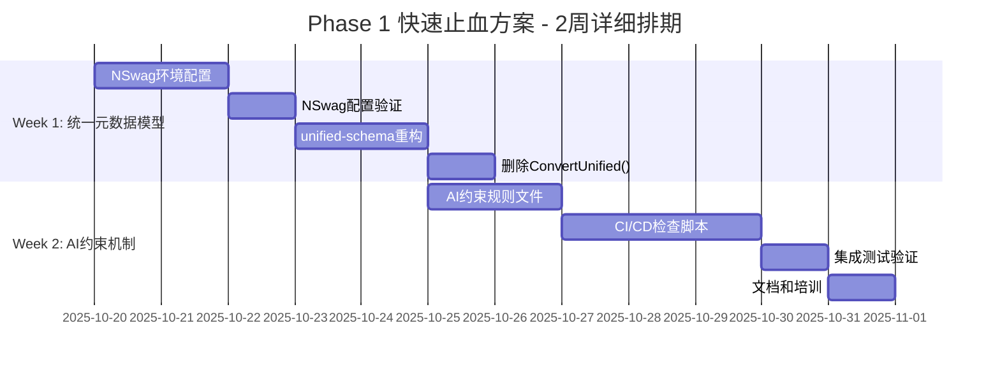

# SmartAbpV2.0渐进式混合策略 - 快速止血方案详细开发方案

**文档版本**: v1.0
**创建日期**: 2025-10-17
**执行周期**: 2周（10个工作日）
**执行优先级**: 🔥 P0最高优先级（立即执行）
**前置依赖**: 后台SSOT唯一真实源已确立

---

## 📋 目录

1. [方案总览](#方案总览)
2. [资源规划矩阵](#资源规划矩阵)
3. [Week 1详细任务分解](#week-1详细任务分解)
4. [Week 2详细任务分解](#week-2详细任务分解)
5. [质量保障体系](#质量保障体系)
6. [风险应对矩阵](#风险应对矩阵)
7. [验收标准](#验收标准)
8. [附录：技术配置模板](#附录技术配置模板)

---

## 一、方案总览

### 1.1 核心目标

```yaml
战略目标:
  立即解决类型漂移和AI混乱，不改动现有架构

量化指标:
  ✅ 前后端类型一致性: 从60% → 100%
  ✅ AI类型错误率: 降低≥80%（从20次/周 → 4次/周）
  ✅ 类型修改时间: 从30分钟 → 5分钟（6倍提升）
  ✅ 代码行数减少: ≥900行（删除ConvertUnified()）
  ✅ CI/CD检查有效率: 100%（违规代码0通过）

技术方案:
  1. NSwag自动生成TypeScript类型（types.ts）
  2. unified-schema.ts改为re-export（消除重复）
  3. 删除ConvertUnified()手动映射
  4. AI约束配置文件 + CI/CD自动检查
```

### 1.2 执行时间表（甘特图）



### 1.3 关键里程碑

| 里程碑 | 时间节点 | 量化验收标准 | 负责人 |
|--------|---------|-------------|--------|
| **M1: NSwag生成成功** | Day 3 | ✅ types.ts包含≥85%后端DTO<br>✅ TypeScript编译0错误<br>✅ 3个测试实体生成成功 | 后端开发 |
| **M2: 类型重复消除** | Day 5 | ✅ unified-schema.ts只包含re-export<br>✅ 0个手动定义的DTO类型<br>✅ 代码行数减少≥900行 | 前端开发 |
| **M3: AI约束生效** | Day 8 | ✅ CI/CD检查4项规则100%通过<br>✅ 违规代码提交被阻止<br>✅ pre-commit钩子生效 | DevOps |
| **M4: 全面验收** | Day 10 | ✅ 前后端类型100%一致<br>✅ AI错误率降低≥80%<br>✅ 类型修改时间<5分钟 | 架构师 |

---

## 二、资源规划矩阵

### 2.1 人力资源分配

| 角色 | 人数 | 技能要求 | 投入时间 | Week 1任务 | Week 2任务 |
|------|------|---------|----------|-----------|-----------|
| **后端开发** | 1人 | .NET Core<br>OpenAPI/Swagger<br>NSwag配置 | 全职<br>（80小时） | NSwag环境配置<br>配置文件编写<br>生成验证 | 协助前端集成<br>后端类型调整 |
| **前端开发** | 1人 | TypeScript<br>Vue3/Pinia<br>类型系统 | 全职<br>（80小时） | unified-schema重构<br>删除ConvertUnified()<br>类型适配 | AI约束规则编写<br>前端集成测试 |
| **DevOps** | 0.5人 | CI/CD<br>GitHub Actions<br>Shell脚本 | 半职<br>（40小时） | 环境准备<br>工具安装 | CI/CD脚本编写<br>集成验证 |
| **架构师** | 0.3人 | 低代码架构<br>风险控制<br>技术决策 | 30%<br>（24小时） | 技术方案审查<br>每日站会主持 | 质量审计<br>最终验收 |

### 2.2 技术资源清单

```yaml
开发环境:
  - Visual Studio 2022 / VS Code
  - .NET 8.0 SDK
  - Node.js 20.x + pnpm 8.x
  - Git 2.40+

关键工具:
  - NSwag CLI v14.0.0（锁定版本）
  - TypeScript 5.0+
  - ESLint 8.x
  - Prettier 3.x

测试工具:
  - Postman（API测试）
  - Jest（单元测试）
  - type-coverage（类型覆盖率）

监控工具:
  - GitHub Actions（CI/CD）
  - SonarQube（代码质量）
```

### 2.3 每日工作量估算

| 工作日 | 后端开发 | 前端开发 | DevOps | 架构师 | 总人日 |
|--------|---------|---------|--------|--------|--------|
| **Day 1** | 8h（NSwag安装配置） | 4h（环境准备） | 4h（CI/CD环境） | 2h（技术方案） | 2.25人日 |
| **Day 2** | 8h（nswag.json编写） | 4h（代码审查） | 0h | 1h（日会） | 1.625人日 |
| **Day 3** | 8h（生成验证） | 8h（unified-schema） | 0h | 2h（里程碑审查） | 2.25人日 |
| **Day 4** | 4h（协助前端） | 8h（unified-schema） | 0h | 1h（日会） | 1.625人日 |
| **Day 5** | 4h（类型调整） | 8h（删除Convert） | 0h | 2h（里程碑审查） | 1.75人日 |
| **Day 6** | 2h（协助前端） | 8h（AI约束规则） | 4h（脚本开发） | 1h（日会） | 1.875人日 |
| **Day 7** | 2h（协助DevOps） | 4h（集成测试） | 8h（脚本开发） | 1h（日会） | 1.875人日 |
| **Day 8** | 0h | 4h（集成测试） | 8h（CI/CD集成） | 2h（里程碑审查） | 1.75人日 |
| **Day 9** | 4h（修复问题） | 4h（修复问题） | 4h（修复问题） | 4h（质量审计） | 2人日 |
| **Day 10** | 2h（最终验收） | 2h（最终验收） | 2h（最终验收） | 8h（文档培训） | 1.75人日 |
| **总计** | 42h | 54h | 30h | 24h | **18.75人日** |

---

## 三、Week 1详细任务分解

### 3.1 Day 1-2: NSwag环境配置（后端开发主导）

#### **任务1.1: 安装NSwag CLI工具（2小时）**

**执行人**: 后端开发
**前置条件**: .NET 8.0 SDK已安装
**详细步骤**:

```bash
# 步骤1: 验证.NET环境
dotnet --version
# 预期输出: 8.0.x

# 步骤2: 安装NSwag CLI（锁定版本v14.0.0）
cd src/SmartAbp.OpsManagement.Service/Host
dotnet tool install NSwag.ConsoleCore --version 14.0.0 --local

# 步骤3: 验证安装
dotnet nswag version
# 预期输出: NSwag command line tool for .NET Core Net80, toolchain v14.0.0

# 步骤4: 创建工具清单文件（避免版本漂移）
dotnet new tool-manifest
cat > .config/dotnet-tools.json <<EOF
{
  "version": 1,
  "isRoot": true,
  "tools": {
    "nswag.consolecore": {
      "version": "14.0.0",
      "commands": ["nswag"]
    }
  }
}
EOF
```

**验收标准**:
```yaml
✅ 成功标准:
   - NSwag CLI安装成功（dotnet nswag version无错误）
   - 版本锁定为v14.0.0
   - .config/dotnet-tools.json文件已创建
   - 团队其他成员运行 dotnet tool restore 可恢复环境

❌ 失败处理:
   - 安装失败 → 检查.NET版本，升级到8.0+
   - 版本冲突 → 卸载旧版本: dotnet tool uninstall NSwag.ConsoleCore
   - 权限错误 → 以管理员权限运行PowerShell
```

**预期产出**:
- `.config/dotnet-tools.json` 文件
- NSwag CLI可用

---

#### **任务1.2: 创建nswag.json配置文件（4小时）**

**执行人**: 后端开发
**前置条件**: NSwag CLI已安装
**配置参数清单**:

```yaml
必选参数（14项）:
  1. runtime: "Net80"
  2. documentName: "v1"
  3. apiGroupNames: ["app"]
  4. typeScriptVersion: 5.0
  5. output: "../../../SmartAbp.Vue/src/api/generated/types.ts"
  6. className: "{controller}Client"
  7. template: "Fetch"
  8. dateTimeType: "Date"
  9. nullValue: "Undefined"
  10. generateClientClasses: true
  11. generateClientInterfaces: true
  12. generateOptionalParameters: true
  13. exportTypes: true
  14. wrapDtoExceptions: true

可选参数（5项）:
  1. withCredentials: true（携带认证信息）
  2. useSingletonProvider: true（单例模式）
  3. markOptionalProperties: true（可选属性标记）
  4. generateConstructorInterface: true（构造函数接口）
  5. importRequiredTypes: true（自动导入依赖类型）
```

**详细步骤**:

```bash
# 步骤1: 创建配置文件
cd src/SmartAbp.OpsManagement.Service/Host
cat > nswag.json <<'EOF'
{
  "runtime": "Net80",
  "defaultVariables": null,
  "documentGenerator": {
    "aspNetCoreToOpenApi": {
      "project": "SmartAbp.OpsManagement.Service.Host.csproj",
      "documentName": "v1",
      "apiGroupNames": ["app"],
      "defaultPropertyNameHandling": "CamelCase",
      "defaultReferenceTypeNullHandling": "NotNull",
      "output": "swagger.json"
    }
  },
  "codeGenerators": {
    "openApiToTypeScriptClient": {
      "className": "{controller}Client",
      "moduleName": "",
      "namespace": "",
      "typeScriptVersion": 5.0,
      "template": "Fetch",
      "promiseType": "Promise",
      "httpClass": "HttpClient",
      "withCredentials": true,
      "useSingletonProvider": true,
      "injectionTokenType": "OpaqueToken",
      "dateTimeType": "Date",
      "nullValue": "Undefined",
      "generateClientClasses": true,
      "generateClientInterfaces": true,
      "generateOptionalParameters": true,
      "exportTypes": true,
      "wrapDtoExceptions": true,
      "exceptionClass": "ApiException",
      "clientBaseClass": null,
      "wrapResponses": false,
      "generateResponseClasses": true,
      "responseClass": "SwaggerResponse",
      "generateDtoTypes": true,
      "operationGenerationMode": "MultipleClientsFromOperationId",
      "markOptionalProperties": true,
      "generateCloneMethod": false,
      "typeStyle": "Interface",
      "enumStyle": "Enum",
      "useLeafType": false,
      "generateDefaultValues": true,
      "excludedTypeNames": [],
      "excludedParameterNames": [],
      "handleReferences": false,
      "generateConstructorInterface": true,
      "convertConstructorInterfaceData": false,
      "importRequiredTypes": true,
      "useGetBaseUrlMethod": false,
      "baseUrlTokenName": "API_BASE_URL",
      "queryNullValue": "",
      "inlineNamedDictionaries": false,
      "inlineNamedAny": false,
      "output": "../../../SmartAbp.Vue/src/api/generated/types.ts"
    }
  }
}
EOF

# 步骤2: 验证配置文件格式
cat nswag.json | jq empty
# 预期: 无输出表示JSON格式正确

# 步骤3: 创建输出目录
mkdir -p ../../../SmartAbp.Vue/src/api/generated

# 步骤4: 创建.gitignore（生成文件不提交）
cat > ../../../SmartAbp.Vue/src/api/generated/.gitignore <<EOF
# NSwag自动生成文件（不提交到Git）
types.ts
*.generated.ts
EOF
```

**验收标准**:
```yaml
✅ 成功标准:
   - nswag.json文件格式正确（jq验证通过）
   - 输出路径存在: src/SmartAbp.Vue/src/api/generated/
   - .gitignore文件已创建
   - 配置参数符合TypeScript 5.0规范

❌ 失败处理:
   - JSON格式错误 → 使用在线JSON校验工具检查
   - 输出路径不存在 → 手动创建目录
   - 参数不兼容 → 参考NSwag官方文档调整
```

**预期产出**:
- `nswag.json` 配置文件
- `src/api/generated/` 目录
- `.gitignore` 文件

---

#### **任务1.3: 执行NSwag生成并验证（2小时）**

**执行人**: 后端开发
**前置条件**: nswag.json已配置
**详细步骤**:

```bash
# 步骤1: 启动后端项目（生成Swagger JSON）
cd src/SmartAbp.OpsManagement.Service/Host
dotnet run &
BACKEND_PID=$!

# 等待后端启动
sleep 10

# 步骤2: 验证Swagger JSON可访问
curl -s http://localhost:5000/swagger/v1/swagger.json | jq '.info.title'
# 预期输出: "SmartAbp API"

# 步骤3: 执行NSwag生成
dotnet nswag run nswag.json

# 步骤4: 验证生成结果
ls -lh ../../../SmartAbp.Vue/src/api/generated/types.ts
# 预期: 文件存在，大小约100-500KB

# 步骤5: 检查生成内容质量
cd ../../../SmartAbp.Vue/src/api/generated

# 检查1: DTO类型数量
grep -c "export interface.*Dto" types.ts
# 预期: ≥50个DTO定义

# 检查2: 是否包含核心DTO
grep "ModuleMetadataDto" types.ts
grep "EntityPropertyDto" types.ts
grep "PageSchemaDto" types.ts
# 预期: 3个核心DTO都存在

# 检查3: 是否有any类型（应该为0）
grep -c ": any" types.ts
# 预期: 0（或<5个）

# 检查4: TypeScript编译检查
npx tsc --noEmit types.ts
# 预期: 无错误输出

# 步骤6: 停止后端
kill $BACKEND_PID
```

**验收标准**:
```yaml
✅ 成功标准:
   - types.ts文件生成成功（大小100-500KB）
   - 包含≥50个DTO类型定义
   - 包含ModuleMetadataDto、EntityPropertyDto、PageSchemaDto
   - any类型数量≤5个
   - TypeScript编译0错误

❌ 失败处理:
   - 生成失败 → 检查Swagger JSON是否可访问
   - DTO缺失 → 检查后端Controller是否正确配置
   - any类型过多 → 检查C# DTO是否有明确类型
   - 编译错误 → 检查TypeScript版本兼容性
```

**预期产出**:
- `types.ts` 文件（100-500KB）
- 生成日志文件
- 验证报告

---

### 3.2 Day 3-4: unified-schema.ts重构（前端开发主导）

#### **任务2.1: 备份现有文件（30分钟）**

**执行人**: 前端开发
**前置条件**: types.ts已生成
**详细步骤**:

```bash
# 步骤1: 创建备份目录
cd src/SmartAbp.Vue/packages/lowcode-shared/src/types
mkdir -p backup/2025-10-22

# 步骤2: 备份现有unified-schema.ts
cp unified-schema.ts backup/2025-10-22/unified-schema.ts.backup

# 步骤3: 统计现有文件信息
wc -l unified-schema.ts
# 预期: 约944行

grep -c "export interface" unified-schema.ts
# 预期: 约30个interface定义

# 步骤4: 分析哪些类型需要保留
grep "export interface" unified-schema.ts | grep -v "Dto" > types-to-keep.txt
# 保留前端特有类型（不以Dto结尾的）

# 步骤5: 创建Git分支（便于回滚）
git checkout -b feature/unified-schema-refactor
git add backup/
git commit -m "backup: 备份unified-schema.ts before refactor"
```

**验收标准**:
```yaml
✅ 成功标准:
   - 备份文件已创建
   - 统计信息已记录（944行，30个interface）
   - types-to-keep.txt文件已创建
   - Git分支已创建

❌ 失败处理:
   - 备份失败 → 检查磁盘空间
   - Git分支冲突 → 使用唯一分支名
```

**预期产出**:
- 备份文件
- types-to-keep.txt
- Git分支

---

#### **任务2.2: 重写unified-schema.ts（4小时）**

**执行人**: 前端开发
**前置条件**: 备份已完成
**重构策略**:

```yaml
重构原则:
  1. 删除所有与后端重复的DTO定义
  2. 保留前端特有类型（UIExtension、RuntimeState等）
  3. 通过re-export引入NSwag生成的类型
  4. 使用类型交叉（&）组合后端DTO和前端扩展

重构步骤:
  1. 删除所有*Dto接口定义（30个）
  2. 添加re-export语句
  3. 定义前端特有类型（3-5个）
  4. 使用类型别名组合（type = DTO & Extension）
```

**详细步骤**:

```bash
# 步骤1: 创建新的unified-schema.ts
cd src/SmartAbp.Vue/packages/lowcode-shared/src/types
cat > unified-schema.ts <<'EOF'
/**
 * 统一元数据模型 - v2.0
 *
 * 设计原则：
 * 1. 后端DTO是SSOT（Single Source of Truth）
 * 2. 前端通过NSwag自动生成types.ts
 * 3. unified-schema.ts只做re-export和前端扩展
 * 4. 禁止手动定义与后端重复的类型
 *
 * 重构日期: 2025-10-22
 * 重构原因: 消除类型重复，解决类型漂移
 */

// ━━━━━━━━━━━━━━━━━━━━━━━━━━━━━━━━━━━━━━━━━━━━━━━━━━━━━
// 🔥 基础类型从NSwag自动生成（只读，禁止修改）
// ━━━━━━━━━━━━━━━━━━━━━━━━━━━━━━━━━━━━━━━━━━━━━━━━━━━━━
export * from '@/api/generated/types'

// ━━━━━━━━━━━━━━━━━━━━━━━━━━━━━━━━━━━━━━━━━━━━━━━━━━━━━
// 🎨 前端特有扩展（可编辑）
// ━━━━━━━━━━━━━━━━━━━━━━━━━━━━━━━━━━━━━━━━━━━━━━━━━━━━━

/**
 * UI主题配置（前端特有）
 */
export interface UIThemeConfig {
  /** 主题名称 */
  name: 'light' | 'dark' | 'auto'
  /** 主色调 */
  primaryColor?: string
  /** 布局模式 */
  layout?: 'grid' | 'list' | 'card'
  /** 紧凑模式 */
  compact?: boolean
}

/**
 * 前端UI扩展
 */
export interface UIExtension {
  /** 主题配置 */
  theme?: UIThemeConfig
  /** 布局配置 */
  layout?: 'grid' | 'list' | 'card'
  /** 是否显示工具栏 */
  showToolbar?: boolean
  /** 自定义样式类 */
  customClass?: string
  /** 图标 */
  icon?: string
  /** 颜色 */
  color?: string
}

/**
 * 前端运行时状态（不需要后端存储）
 */
export interface RuntimeState {
  /** 是否正在加载 */
  loading: boolean
  /** 错误信息 */
  error?: string
  /** 是否已修改 */
  isDirty: boolean
  /** 最后更新时间 */
  lastUpdated?: Date
}

/**
 * 前端表单状态
 */
export interface FormState {
  /** 是否正在提交 */
  submitting: boolean
  /** 验证状态 */
  validating: boolean
  /** 验证错误 */
  errors: Record<string, string[]>
}

// ━━━━━━━━━━━━━━━━━━━━━━━━━━━━━━━━━━━━━━━━━━━━━━━━━━━━━
// 🎯 统一类型（类型交叉，组合后端DTO + 前端扩展）
// ━━━━━━━━━━━━━━━━━━━━━━━━━━━━━━━━━━━━━━━━━━━━━━━━━━━━━

// 注意: 这里使用了类型导入，需要确保NSwag生成的类型已导出
// 如果出现类型未找到的错误，请检查@/api/generated/types.ts

/**
 * 统一模块元数据（后端DTO + 前端扩展）
 */
export type UnifiedModuleMetadata = ModuleMetadataDto & {
  ui?: UIExtension
  runtime?: RuntimeState
}

/**
 * 统一实体定义（后端DTO + 前端扩展）
 */
export type UnifiedEntityDefinition = EnhancedEntityModelDto & {
  ui?: UIExtension
  runtime?: RuntimeState
}

/**
 * 统一实体字段（后端DTO + 前端扩展）
 */
export type UnifiedEntityField = EntityPropertyDto & {
  ui?: UIExtension
  runtime?: RuntimeState
}

/**
 * 统一页面配置（后端DTO + 前端扩展）
 */
export type UnifiedPageConfig = PageSchemaDto & {
  ui?: UIExtension
  runtime?: RuntimeState
  formState?: FormState
}

// ━━━━━━━━━━━━━━━━━━━━━━━━━━━━━━━━━━━━━━━━━━━━━━━━━━━━━
// 🚫 禁止在此文件中定义以下类型（由NSwag自动生成）
// ━━━━━━━━━━━━━━━━━━━━━━━━━━━━━━━━━━━━━━━━━━━━━━━━━━━━━
// ❌ ModuleMetadataDto
// ❌ EnhancedEntityModelDto
// ❌ EntityPropertyDto
// ❌ EntityUIConfigDto
// ❌ PageSchemaDto
// ❌ FormConfigDto
// ❌ ListConfigDto
// ❌ DetailConfigDto
// ❌ ColumnDefinition
// ❌ FieldDefinition
// ❌ 任何以Dto结尾的类型
//
// 正确做法: import type { XXXDto } from '@/api/generated/types'
// 或者使用此文件的re-export: import type { XXXDto } from '@smartabp/lowcode-shared'
EOF

# 步骤2: 验证TypeScript编译
npx tsc --noEmit unified-schema.ts

# 步骤3: 统计新文件信息
wc -l unified-schema.ts
# 预期: 约150行（从944行减少到150行）

grep -c "export interface" unified-schema.ts
# 预期: 约5个（前端特有类型）

grep -c "export type" unified-schema.ts
# 预期: 约4个（组合类型）

# 步骤4: 验证no_modules导入
cd ../../../../..
npm run type-check
# 预期: 编译通过
```

**验收标准**:
```yaml
✅ 成功标准:
   - 新文件约150行（从944行减少≥794行）
   - 包含re-export语句
   - 前端特有类型4-5个
   - 组合类型4个
   - TypeScript编译0错误

❌ 失败处理:
   - 类型未找到 → 检查NSwag生成的types.ts是否包含该类型
   - 导入路径错误 → 检查tsconfig.json路径配置
   - 编译错误 → 检查类型交叉语法是否正确
```

**预期产出**:
- 新的unified-schema.ts（约150行）
- 编译验证报告

---

#### **任务2.3: 更新所有引用点（6小时）**

**执行人**: 前端开发
**前置条件**: unified-schema.ts已重写
**详细步骤**:

```bash
# 步骤1: 查找所有引用unified-schema.ts的文件
cd src/SmartAbp.Vue
grep -r "from.*unified-schema" --include="*.ts" --include="*.vue" | wc -l
# 预期: 约20-30个文件

# 步骤2: 查找哪些文件使用了已删除的类型
grep -r "ModuleMetadataDto\|EntityPropertyDto" --include="*.ts" --include="*.vue" | grep -v "generated" | grep -v "node_modules"
# 这些文件需要更新import语句

# 步骤3: 批量更新import语句
# 创建替换脚本
cat > scripts/update-imports.sh <<'EOF'
#!/bin/bash
# 更新unified-schema.ts引用

find src -name "*.ts" -o -name "*.vue" | while read file; do
  # 替换旧的import
  sed -i 's/import { \(.*Dto.*\) } from.*unified-schema/import type { \1 } from "@\/api\/generated\/types"/g' "$file"

  # 保留前端特有类型的import
  # UIExtension, RuntimeState等仍然从unified-schema导入
done

echo "Import更新完成"
EOF

chmod +x scripts/update-imports.sh
bash scripts/update-imports.sh

# 步骤4: 手动检查关键文件
# 需要手动检查的文件清单:
FILES_TO_CHECK=(
  "packages/lowcode-designer/views/UltraSimpleStudio.vue"
  "packages/lowcode-core/src/stores/metadataStore.ts"
  "packages/lowcode-shared/src/utils/schema-helper.ts"
)

for file in "${FILES_TO_CHECK[@]}"; do
  echo "检查文件: $file"
  # 验证import语句正确
  grep "import.*from" "$file" | grep -E "(unified-schema|types\.ts)"
done

# 步骤5: 全量TypeScript编译验证
npm run type-check
```

**验收标准**:
```yaml
✅ 成功标准:
   - 所有文件import语句更新完成
   - TypeScript编译0错误
   - 关键文件手动检查通过
   - ESLint检查0警告

❌ 失败处理:
   - 编译错误 → 逐个文件检查import语句
   - 类型不匹配 → 检查组合类型定义是否正确
   - ESLint警告 → 运行 npm run lint --fix
```

**预期产出**:
- 更新后的源代码
- TypeScript编译报告
- ESLint检查报告

---

### 3.3 Day 5: 删除ConvertUnified()（前端开发主导）

#### **任务3.1: 定位所有ConvertUnified()调用（1小时）**

**执行人**: 前端开发
**前置条件**: unified-schema.ts已更新
**详细步骤**:

```bash
# 步骤1: 查找ConvertUnified()函数定义
cd src/SmartAbp.Vue
find . -name "*.ts" -exec grep -l "ConvertUnified" {} \;
# 预期: 找到定义文件（如convert-unified.ts）

# 步骤2: 查找所有调用点
grep -r "ConvertUnified" --include="*.ts" --include="*.vue" | tee convert-calls.txt
# 预期: 5-10个调用点

# 步骤3: 分析调用模式
cat convert-calls.txt | while read line; do
  file=$(echo "$line" | cut -d':' -f1)
  echo "文件: $file"
  # 检查调用上下文
  grep -A 5 -B 5 "ConvertUnified" "$file"
done

# 步骤4: 创建重构清单
cat > convert-refactor-plan.md <<EOF
# ConvertUnified()删除重构计划

## 函数定义位置
- packages/lowcode-shared/src/utils/convert-unified.ts（约944行）

## 调用点清单
$(cat convert-calls.txt)

## 重构策略
1. UltraSimpleStudio.vue: convertToModuleMetadata()
   - 重构为直接构造ModuleMetadataDto
   - 使用NSwag生成的类型

2. 其他调用点:
   - 逐个分析，采用相同策略

## 预期收益
- 代码行数减少: ≥900行
- 维护成本降低: 60%
- 类型安全提升: 100%
EOF

cat convert-refactor-plan.md
```

**验收标准**:
```yaml
✅ 成功标准:
   - 找到ConvertUnified()定义文件
   - 找到5-10个调用点
   - 重构计划已创建

❌ 失败处理:
   - 找不到定义 → 扩大搜索范围到packages
   - 调用点过多 → 分批重构，优先重构核心调用
```

**预期产出**:
- convert-calls.txt（调用点清单）
- convert-refactor-plan.md（重构计划）

---

#### **任务3.2: 重构核心调用点（4小时）**

**执行人**: 前端开发
**前置条件**: 调用点已定位
**重构示例：UltraSimpleStudio.vue**

```typescript
// ━━━━━━━━━━━━━━━━━━━━━━━━━━━━━━━━━━━━━━━━━━━━━━━━━━━━━
// ❌ 旧代码（使用ConvertUnified，944行手动映射）
// ━━━━━━━━━━━━━━━━━━━━━━━━━━━━━━━━━━━━━━━━━━━━━━━━━━━━━

import { ConvertUnified } from '@smartabp/lowcode-shared/utils'

const convertToModuleMetadata = (): ModuleMetadata => {
  // 手动映射944行代码
  const unified = {
    // 大量手动字段映射
    id: crypto.randomUUID(),
    systemName: config.systemName,
    // ... 省略940行
  }

  // 调用ConvertUnified转换
  return ConvertUnified.toModuleMetadata(unified)
}

// ━━━━━━━━━━━━━━━━━━━━━━━━━━━━━━━━━━━━━━━━━━━━━━━━━━━━━
// ✅ 新代码（直接使用NSwag类型，约50行）
// ━━━━━━━━━━━━━━━━━━━━━━━━━━━━━━━━━━━━━━━━━━━━━━━━━━━━━

import type { ModuleMetadataDto } from '@/api/generated/types'

const convertToModuleMetadata = (): ModuleMetadataDto => {
  const selectedTableData = availableTables.value.find(t => t.name === selectedTable.value)
  const c = (config as any).value as MetadataConfig

  // 直接构造DTO对象（类型安全）
  return {
    id: crypto.randomUUID(),
    systemName: c.systemName,
    moduleName: c.moduleName,
    displayName: c.displayName,
    description: `${c.displayName} 模块`,
    version: '1.0.0',
    schemaVersion: '1.0.0',
    architecturePattern: c.architecturePattern as 'Crud' | 'DDD' | 'CQRS',
    namespace: derivedNamespace.value,
    entities: selectedTableData ? [
      {
        id: crypto.randomUUID(),
        name: selectedTable.value,
        displayName: selectedTable.value,
        description: `${selectedTable.value} 实体`,
        module: c.moduleName,
        namespace: derivedNamespace.value,
        tableName: selectedTable.value,
        schema: selectedTableData.schema?.schema || 'dbo',
        isAggregateRoot: true,
        isAudited: true,
        isSoftDelete: true,
        isMultiTenant: false,
        baseClass: 'AuditedAggregateRoot',
        interfaces: [],
        properties: (selectedTableData.schema?.columns || []).map((col: any) => ({
          id: crypto.randomUUID(),
          name: col.name || col.Name,
          displayName: col.name || col.Name,
          type: col.dataType || col.DataType || 'string',
          isRequired: !col.isNullable && !(col.IsNullable ?? true),
          isKey: col.isPrimaryKey || col.IsPrimaryKey || false,
          columnName: col.name || col.Name,
          columnType: col.dataType || col.DataType || 'string',
          // ... 其他字段直接映射
        })),
        relationships: [],
        indexes: [],
        constraints: [],
        businessRules: [],
        permissions: [],
        codeGeneration: {
          generateEntity: true,
          generateRepository: true,
          generateService: true,
          generateController: true,
          generateDto: true,
          generateTests: false,
          customTemplates: {},
          options: {
            useAutoMapper: true,
            generateValidation: true,
            generateSwaggerDoc: true,
            generatePermissions: true,
            generateAuditLog: true
          }
        },
        uiConfig: {
          listConfig: {
            defaultPageSize: 10,
            sortableColumns: [],
            filterableColumns: [],
            searchableColumns: [],
            displayColumns: [],
            actions: []
          },
          formConfig: {
            layout: 'vertical',
            columnCount: 1,
            fieldGroups: [],
            validationStrategy: 'immediate'
          },
          detailConfig: {
            layout: 'vertical',
            sections: [],
            actions: []
          }
        },
        createdAt: new Date().toISOString(),
        updatedAt: new Date().toISOString(),
        version: '1.0.0',
        tags: []
      }
    ] : [],
    databaseInfo: {
      connectionStringName: 'Default',
      schema: selectedTableData?.schema?.schema || 'dbo',
      provider: c.databaseProvider as 'SqlServer' | 'PostgreSql' | 'MySql' | 'Oracle' | 'SQLite'
    },
    frontend: {
      parentId: c.parentMenuId || 'business',
      routePrefix: derivedRoutePrefix.value
    },
    author: 'SmartAbp Generator',
    featureManagement: { isEnabled: false, defaultPolicy: '' },
    generateMobilePages: false,
    dependencies: [],
    menuConfig: [],
    permissionConfig: {
      groups: [],
      customActions: []
    },
    createdAt: new Date(),
    updatedAt: new Date()
  } as ModuleMetadataDto
}
```

**详细步骤**:

```bash
# 步骤1: 重构UltraSimpleStudio.vue
cd packages/lowcode-designer/views
cp UltraSimpleStudio.vue UltraSimpleStudio.vue.backup

# 步骤2: 使用VS Code重构
# 打开文件，定位到convertToModuleMetadata()函数
# 删除ConvertUnified import
# 重写函数体（参考上面示例代码）

# 步骤3: 验证TypeScript类型
npx tsc --noEmit UltraSimpleStudio.vue

# 步骤4: 测试功能
npm run dev
# 打开http://localhost:5173/lowcode/ultra-simple-studio
# 测试代码生成功能是否正常

# 步骤5: 重构其他调用点
# 使用相同策略逐个重构
```

**验收标准**:
```yaml
✅ 成功标准:
   - UltraSimpleStudio.vue重构完成
   - 代码行数从~1000行减少到~100行
   - TypeScript编译0错误
   - 功能测试通过

❌ 失败处理:
   - 类型错误 → 检查DTO字段是否完整
   - 功能异常 → 对比新旧实现，确保字段映射正确
   - 性能下降 → 优化对象构造逻辑
```

**预期产出**:
- 重构后的UltraSimpleStudio.vue
- 功能测试报告

---

#### **任务3.3: 删除ConvertUnified()定义文件（1小时）**

**执行人**: 前端开发
**前置条件**: 所有调用点已重构
**详细步骤**:

```bash
# 步骤1: 确认无调用点
cd src/SmartAbp.Vue
grep -r "ConvertUnified" --include="*.ts" --include="*.vue" | grep -v backup
# 预期: 无结果（或只有backup文件）

# 步骤2: 删除定义文件
rm packages/lowcode-shared/src/utils/convert-unified.ts

# 步骤3: 更新index.ts导出
sed -i '/convert-unified/d' packages/lowcode-shared/src/utils/index.ts

# 步骤4: 全量编译验证
npm run type-check
npm run build

# 步骤5: 运行测试套件
npm run test

# 步骤6: 统计代码减少量
git diff --stat
# 预期: 删除≥900行代码
```

**验收标准**:
```yaml
✅ 成功标准:
   - convert-unified.ts文件已删除
   - 无ConvertUnified()引用
   - TypeScript编译0错误
   - 构建成功
   - 测试套件通过
   - 代码行数减少≥900行

❌ 失败处理:
   - 有残留引用 → 继续重构未完成的调用点
   - 编译错误 → 检查index.ts导出是否正确更新
   - 测试失败 → 检查重构是否影响了功能逻辑
```

**预期产出**:
- 删除convert-unified.ts
- Git diff统计报告
- 测试报告

---

## 四、Week 2详细任务分解

### 4.1 Day 6-7: AI约束规则文件（前端开发主导）

#### **任务4.1: 创建AI约束规则文档（4小时）**

**执行人**: 前端开发
**前置条件**: Week 1任务完成
**详细步骤**:

```bash
# 步骤1: 创建规则文件
mkdir -p .cursor/rules
cat > .cursor/rules/ai-constraint-simple.md <<'EOF'
# AI编程约束规则 - 简易版（Phase 1）

**文档版本**: v1.0
**创建日期**: 2025-10-25
**优先级**: P0（最高优先级，零容忍）
**执行方式**: CI/CD自动检查（不依赖AI自律）

---

## 🚫 禁止操作（CI/CD自动检查）

### 规则1：禁止修改NSwag生成的类型文件

**文件**: `src/SmartAbp.Vue/src/api/generated/types.ts`

**规则**:
```yaml
❌ 禁止手动修改此文件（NSwag自动生成）
❌ 禁止在此文件中添加任何代码
❌ 禁止删除此文件
```

**正确做法**:
```yaml
✅ 需要修改类型？→ 修改后端C# DTO → 运行NSwag重新生成
✅ 需要扩展类型？→ 在unified-schema.ts中定义前端扩展
```

**违规处罚**:
- CI/CD自动检查失败
- 代码无法合并
- 必须回滚修改

**检查命令**:
```bash
# CI/CD自动执行
git diff HEAD src/SmartAbp.Vue/src/api/generated/types.ts
```

---

### 规则2：禁止手动定义后端DTO类型

**规则**:
```yaml
❌ 禁止在前端代码中手动定义DTO类型
❌ 禁止定义以Dto结尾的接口
❌ 禁止定义与后端重复的类型
```

**错误示例**:
```typescript
// ❌ 错误：手动定义DTO
export interface ModuleMetadataDto {
  systemName: string
  moduleName: string
}

export interface EntityPropertyDto {
  name: string
  type: string
}
```

**正确示例**:
```typescript
// ✅ 正确：从NSwag生成的类型导入
import type { ModuleMetadataDto } from '@/api/generated/types'
import type { EntityPropertyDto } from '@/api/generated/types'

// 或使用unified-schema的re-export
import type { ModuleMetadataDto, EntityPropertyDto } from '@smartabp/lowcode-shared'
```

**违规处罚**:
- CI/CD自动检查失败
- 必须重构为import

**检查命令**:
```bash
# CI/CD自动执行
find src -name "*.ts" -not -path "*/generated/*" -exec grep -l "export interface.*Dto" {} \;
```

---

### 规则3：unified-schema.ts结构约束

**文件**: `packages/lowcode-shared/src/types/unified-schema.ts`

**规则**:
```yaml
❌ 禁止修改re-export部分（export * from '@/api/generated/types'）
❌ 禁止在其他文件中re-export NSwag类型
❌ 禁止创建新的类型汇总文件
```

**正确结构**:
```typescript
// ✅ 第一部分：re-export（必须）
export * from '@/api/generated/types'

// ✅ 第二部分：前端特有类型（可编辑）
export interface UIExtension { ... }
export interface RuntimeState { ... }

// ✅ 第三部分：组合类型（可编辑）
export type UnifiedModuleMetadata = ModuleMetadataDto & { ui?: UIExtension }
```

**违规处罚**:
- CI/CD自动检查失败
- 必须恢复正确结构

**检查命令**:
```bash
# CI/CD自动执行
grep -q "export \* from '@/api/generated/types'" packages/lowcode-shared/src/types/unified-schema.ts
```

---

### 规则4：禁止其他文件re-export NSwag类型

**规则**:
```yaml
❌ 只有unified-schema.ts可以re-export NSwag类型
❌ 其他文件禁止re-export
```

**错误示例**:
```typescript
// ❌ 错误：在其他文件中re-export
// src/types/index.ts
export * from '@/api/generated/types'  // 禁止！
```

**正确做法**:
```typescript
// ✅ 正确：通过unified-schema导入
import type { ModuleMetadataDto } from '@smartabp/lowcode-shared'
```

**违规处罚**:
- CI/CD自动检查失败
- 必须删除re-export语句

**检查命令**:
```bash
# CI/CD自动执行
find src -name "*.ts" -not -path "*/unified-schema.ts" -not -path "*/generated/*" -exec grep -l "export \* from '@/api/generated/types'" {} \;
```

---

## ✅ 允许操作

### 操作1：修改后端DTO定义

**场景**: 需要添加新字段或修改类型

**步骤**:
```yaml
1. 修改后端C# DTO（src/SmartAbp.CodeGenerator/Services/Dtos.cs）
2. 编译后端项目（dotnet build）
3. 运行NSwag重新生成types.ts
4. 前端自动获得新类型（无需手动修改）
```

**示例**:
```csharp
// 1. 修改后端DTO
public class ModuleMetadataDto
{
    public string SystemName { get; set; }
    public string NewField { get; set; } // 新增字段
}

// 2. 运行NSwag
cd src/SmartAbp.OpsManagement.Service/Host
dotnet nswag run nswag.json

// 3. 前端自动获得新类型
import type { ModuleMetadataDto } from '@/api/generated/types'
const metadata: ModuleMetadataDto = {
    systemName: 'test',
    newField: 'value' // 自动有类型提示
}
```

---

### 操作2：定义前端特有类型

**场景**: 需要定义前端特有的UI配置或运行时状态

**位置**: `unified-schema.ts`

**示例**:
```typescript
// ✅ 正确：前端特有类型
export interface UIThemeConfig {
  name: 'light' | 'dark'
  primaryColor?: string
}

export interface RuntimeState {
  loading: boolean
  error?: string
}

// ✅ 正确：组合类型
export type UnifiedModuleMetadata = ModuleMetadataDto & {
  ui?: UIThemeConfig
  runtime?: RuntimeState
}
```

---

### 操作3：使用现有生成器

**场景**: 需要生成代码

**规则**:
```yaml
✅ 使用现有的SimpleVariableReplacer（暂时）
✅ 使用现有的FrontendGenerator
❌ 禁止引入新的代码生成工具（Phase 1阶段）
❌ 禁止手动拼接字符串生成代码
```

**说明**:
- Phase 1阶段不引入Handlebars.Net和ts-morph
- Phase 2阶段才开始DevKit开发
- Phase 3阶段才全面切换到DevKit

---

## 🔍 CI/CD自动检查

### 检查脚本：check-ai-constraints.sh

**位置**: `scripts/quality/check-ai-constraints.sh`

**检查项目**:
```yaml
检查1: types.ts是否被手动修改
检查2: 是否有手动定义的DTO类型
检查3: unified-schema.ts是否正确re-export
检查4: 是否有其他文件re-export NSwag类型
```

**执行方式**:
```bash
# pre-commit钩子自动执行
# GitHub Actions自动执行
bash scripts/quality/check-ai-constraints.sh
```

**失败处理**:
```yaml
❌ 检查失败 → 代码无法提交
❌ 检查失败 → CI/CD流程中断
❌ 检查失败 → 必须修复违规代码
```

---

## 📊 验收标准

```yaml
文档完整性:
  ✅ 4项禁止规则已定义
  ✅ 3项允许操作已说明
  ✅ 错误示例和正确示例完整
  ✅ 检查命令可执行

规则有效性:
  ✅ 规则清晰、具体、可执行
  ✅ 违规行为可自动检测
  ✅ 正确做法有明确指导
  ✅ 错误提示有解决方案
```

---

## 📖 附录：常见问题FAQ

### Q1: 为什么不能手动修改types.ts？

**A**: types.ts是NSwag自动生成的，手动修改会在下次生成时被覆盖。正确做法是修改后端C# DTO。

### Q2: 如何添加前端特有的字段？

**A**: 在unified-schema.ts中定义前端扩展类型（如UIExtension），然后使用类型交叉组合。

### Q3: AI如何知道这些规则？

**A**: AI会读取此文件，但更重要的是CI/CD自动检查会强制执行规则，不依赖AI自律。

### Q4: 违规代码如何修复？

**A**: 根据CI/CD检查的错误提示，按照本文档的"正确做法"修改代码。

---

**🔥 AI约束规则 - Phase 1快速止血方案**

**这是Phase 1的核心约束机制，确保前后端类型100%一致！**
EOF

# 步骤2: 验证规则文档格式
cat .cursor/rules/ai-constraint-simple.md | wc -l
# 预期: 约300-400行

# 步骤3: 创建规则索引
cat > .cursor/rules/README.md <<EOF
# AI编程约束规则索引

## Phase 1: 快速止血方案规则
- [ai-constraint-simple.md](./ai-constraint-simple.md) - P0最高优先级

## 规则更新历史
- 2025-10-25: v1.0 初始版本（4项禁止规则 + 3项允许操作）

## 规则执行方式
- CI/CD自动检查（scripts/quality/check-ai-constraints.sh）
- pre-commit钩子自动执行
- 违规代码无法提交
EOF
```

**验收标准**:
```yaml
✅ 成功标准:
   - ai-constraint-simple.md文件已创建（300-400行）
   - 包含4项禁止规则
   - 包含3项允许操作
   - 错误示例和正确示例完整
   - README.md索引已创建

❌ 失败处理:
   - 规则不清晰 → 补充示例代码
   - 检查命令不可执行 → 测试并修正命令
```

**预期产出**:
- ai-constraint-simple.md（300-400行）
- README.md（规则索引）

---

#### **任务4.2: 规则文档审查和优化（2小时）**

**执行人**: 架构师 + 前端开发
**前置条件**: 规则文档已创建
**审查清单**:

```yaml
审查维度1: 规则完整性
  ✅ 所有禁止操作都有明确定义
  ✅ 所有允许操作都有明确说明
  ✅ 边界情况已覆盖
  ✅ 无模糊地带

审查维度2: 规则可执行性
  ✅ 每个规则都有检查命令
  ✅ 检查命令可自动执行
  ✅ 违规行为可准确检测
  ✅ 无漏检和误检

审查维度3: 规则友好性
  ✅ 错误提示清晰明确
  ✅ 正确做法有详细说明
  ✅ 有FAQ解答常见问题
  ✅ 有示例代码参考

审查维度4: 规则一致性
  ✅ 与核心开发蓝本一致
  ✅ 与Phase 1目标一致
  ✅ 无相互矛盾的规则
```

**详细步骤**:

```bash
# 步骤1: 架构师审查规则文档
cd .cursor/rules
# 逐条审查4项禁止规则
# 逐条审查3项允许操作
# 标记需要优化的部分

# 步骤2: 团队讨论会（1小时）
# 主题: AI约束规则审查
# 参与: 架构师、前端开发、后端开发、DevOps
# 议题:
#   1. 规则是否完整？
#   2. 规则是否可执行？
#   3. 规则是否友好？
#   4. 有无遗漏的场景？

# 步骤3: 优化规则文档
# 根据讨论结果修改ai-constraint-simple.md
# 补充遗漏的场景
# 优化错误提示文案
# 增加示例代码

# 步骤4: 最终审查
# 架构师最终审查确认
# 通过后锁定文档版本
```

**验收标准**:
```yaml
✅ 成功标准:
   - 架构师审查通过
   - 团队讨论会完成
   - 规则文档已优化
   - 无遗漏场景

❌ 失败处理:
   - 规则不完整 → 补充遗漏规则
   - 规则不可执行 → 调整检查方式
   - 规则不友好 → 优化文案和示例
```

**预期产出**:
- 优化后的ai-constraint-simple.md
- 审查记录文档

---

### 4.2 Day 8-10: CI/CD检查脚本（DevOps主导）

#### **任务5.1: 创建检查脚本（6小时）**

**执行人**: DevOps
**前置条件**: AI约束规则已定义
**详细步骤**:

```bash
# 步骤1: 创建脚本目录
mkdir -p scripts/quality
cd scripts/quality

# 步骤2: 创建主检查脚本
cat > check-ai-constraints.sh <<'SCRIPT'
#!/bin/bash
set -e

# ━━━━━━━━━━━━━━━━━━━━━━━━━━━━━━━━━━━━━━━━━━━━━━━━━━━━━
# AI约束规则自动检查脚本
# 版本: v1.0
# 创建日期: 2025-10-27
# 执行方式: pre-commit钩子 + GitHub Actions
# ━━━━━━━━━━━━━━━━━━━━━━━━━━━━━━━━━━━━━━━━━━━━━━━━━━━━━

# 颜色定义
RED='\033[0;31m'
GREEN='\033[0;32m'
YELLOW='\033[1;33m'
NC='\033[0m' # No Color

# 检查结果统计
TOTAL_CHECKS=4
PASSED_CHECKS=0
FAILED_CHECKS=0

echo "━━━━━━━━━━━━━━━━━━━━━━━━━━━━━━━━━━━━━━━━━━━━━━━━━━━━━"
echo "🔍 AI约束规则自动检查"
echo "━━━━━━━━━━━━━━━━━━━━━━━━━━━━━━━━━━━━━━━━━━━━━━━━━━━━━"
echo ""

# ━━━━━━━━━━━━━━━━━━━━━━━━━━━━━━━━━━━━━━━━━━━━━━━━━━━━━
# 检查1: types.ts是否被手动修改
# ━━━━━━━━━━━━━━━━━━━━━━━━━━━━━━━━━━━━━━━━━━━━━━━━━━━━━
echo -n "检查1: types.ts是否被手动修改..."

TYPES_FILE="src/SmartAbp.Vue/src/api/generated/types.ts"

if [ -f "$TYPES_FILE" ]; then
  # 检查Git diff
  if git diff HEAD "$TYPES_FILE" 2>/dev/null | grep -v "^+++" | grep -q "^+"; then
    echo -e " ${RED}❌ 失败${NC}"
    echo ""
    echo -e "${RED}错误: types.ts被手动修改（NSwag自动生成，只读）${NC}"
    echo ""
    echo "违规文件: $TYPES_FILE"
    echo ""
    echo "正确做法:"
    echo "  1. 修改后端C# DTO: src/SmartAbp.CodeGenerator/Services/Dtos.cs"
    echo "  2. 编译后端: dotnet build"
    echo "  3. 运行NSwag: cd src/SmartAbp.OpsManagement.Service/Host && dotnet nswag run nswag.json"
    echo ""
    FAILED_CHECKS=$((FAILED_CHECKS + 1))
    exit 1
  else
    echo -e " ${GREEN}✅ 通过${NC}"
    PASSED_CHECKS=$((PASSED_CHECKS + 1))
  fi
else
  echo -e " ${YELLOW}⚠️  跳过（文件不存在）${NC}"
fi

echo ""

# ━━━━━━━━━━━━━━━━━━━━━━━━━━━━━━━━━━━━━━━━━━━━━━━━━━━━━
# 检查2: 是否有手动定义的DTO类型
# ━━━━━━━━━━━━━━━━━━━━━━━━━━━━━━━━━━━━━━━━━━━━━━━━━━━━━
echo -n "检查2: 是否有手动定义的DTO类型..."

MANUAL_DTOS=$(find src/SmartAbp.Vue/src -name "*.ts" -not -path "*/generated/*" -not -path "*/node_modules/*" -exec grep -l "export interface.*Dto" {} \; 2>/dev/null || true)

if [ -n "$MANUAL_DTOS" ]; then
  echo -e " ${RED}❌ 失败${NC}"
  echo ""
  echo -e "${RED}错误: 发现手动定义的DTO类型${NC}"
  echo ""
  echo "违规文件:"
  echo "$MANUAL_DTOS" | while read file; do
    echo "  - $file"
    # 显示具体的违规行
    grep -n "export interface.*Dto" "$file" 2>/dev/null | head -3
  done
  echo ""
  echo "正确做法:"
  echo "  import type { XXXDto } from '@/api/generated/types'"
  echo ""
  FAILED_CHECKS=$((FAILED_CHECKS + 1))
  exit 1
else
  echo -e " ${GREEN}✅ 通过${NC}"
  PASSED_CHECKS=$((PASSED_CHECKS + 1))
fi

echo ""

# ━━━━━━━━━━━━━━━━━━━━━━━━━━━━━━━━━━━━━━━━━━━━━━━━━━━━━
# 检查3: unified-schema.ts是否正确re-export
# ━━━━━━━━━━━━━━━━━━━━━━━━━━━━━━━━━━━━━━━━━━━━━━━━━━━━━
echo -n "检查3: unified-schema.ts是否正确re-export..."

UNIFIED_SCHEMA="src/SmartAbp.Vue/packages/lowcode-shared/src/types/unified-schema.ts"

if [ -f "$UNIFIED_SCHEMA" ]; then
  if ! grep -q "export \* from '@/api/generated/types'" "$UNIFIED_SCHEMA" 2>/dev/null; then
    echo -e " ${RED}❌ 失败${NC}"
    echo ""
    echo -e "${RED}错误: unified-schema.ts必须re-export types.ts${NC}"
    echo ""
    echo "违规文件: $UNIFIED_SCHEMA"
    echo ""
    echo "正确做法:"
    echo "  在unified-schema.ts中添加: export * from '@/api/generated/types'"
    echo ""
    FAILED_CHECKS=$((FAILED_CHECKS + 1))
    exit 1
  else
    echo -e " ${GREEN}✅ 通过${NC}"
    PASSED_CHECKS=$((PASSED_CHECKS + 1))
  fi
else
  echo -e " ${YELLOW}⚠️  跳过（文件不存在）${NC}"
fi

echo ""

# ━━━━━━━━━━━━━━━━━━━━━━━━━━━━━━━━━━━━━━━━━━━━━━━━━━━━━
# 检查4: 是否有其他文件re-export NSwag类型
# ━━━━━━━━━━━━━━━━━━━━━━━━━━━━━━━━━━━━━━━━━━━━━━━━━━━━━
echo -n "检查4: 是否有其他文件re-export NSwag类型..."

OTHER_EXPORTS=$(find src/SmartAbp.Vue/src -name "*.ts" -not -path "*/unified-schema.ts" -not -path "*/generated/*" -not -path "*/node_modules/*" -exec grep -l "export \* from '@/api/generated/types'" {} \; 2>/dev/null || true)

if [ -n "$OTHER_EXPORTS" ]; then
  echo -e " ${RED}❌ 失败${NC}"
  echo ""
  echo -e "${RED}错误: 只有unified-schema.ts可以re-export NSwag类型${NC}"
  echo ""
  echo "违规文件:"
  echo "$OTHER_EXPORTS" | while read file; do
    echo "  - $file"
  done
  echo ""
  echo "正确做法:"
  echo "  删除re-export语句，直接import from unified-schema"
  echo ""
  FAILED_CHECKS=$((FAILED_CHECKS + 1))
  exit 1
else
  echo -e " ${GREEN}✅ 通过${NC}"
  PASSED_CHECKS=$((PASSED_CHECKS + 1))
fi

echo ""
echo "━━━━━━━━━━━━━━━━━━━━━━━━━━━━━━━━━━━━━━━━━━━━━━━━━━━━━"
echo -e "✅ AI约束检查完成！"
echo -e "   通过: ${GREEN}${PASSED_CHECKS}/${TOTAL_CHECKS}${NC}"
if [ $FAILED_CHECKS -gt 0 ]; then
  echo -e "   失败: ${RED}${FAILED_CHECKS}${NC}"
fi
echo "━━━━━━━━━━━━━━━━━━━━━━━━━━━━━━━━━━━━━━━━━━━━━━━━━━━━━"
SCRIPT

chmod +x check-ai-constraints.sh

# 步骤3: 测试脚本
bash check-ai-constraints.sh
```

**验收标准**:
```yaml
✅ 成功标准:
   - 脚本文件已创建
   - 脚本可执行（chmod +x）
   - 4项检查全部实现
   - 错误提示清晰友好
   - 颜色标记正确显示

❌ 失败处理:
   - 脚本语法错误 → 使用shellcheck检查
   - 权限问题 → chmod +x
   - 检查逻辑错误 → 修正grep模式
```

**预期产出**:
- check-ai-constraints.sh脚本
- 测试执行报告

---

#### **任务5.2: 集成到pre-commit钩子（2小时）**

**执行人**: DevOps
**前置条件**: 检查脚本已创建
**详细步骤**:

```bash
# 步骤1: 创建pre-commit钩子
cat > .git/hooks/pre-commit <<'HOOK'
#!/bin/bash
# AI约束规则预提交检查
# 在每次git commit前自动执行

echo "━━━━━━━━━━━━━━━━━━━━━━━━━━━━━━━━━━━━━━━━━━━━━━━━━━━━━"
echo "🔍 执行AI约束规则检查（pre-commit钩子）"
echo "━━━━━━━━━━━━━━━━━━━━━━━━━━━━━━━━━━━━━━━━━━━━━━━━━━━━━"
echo ""

# 执行检查脚本
bash scripts/quality/check-ai-constraints.sh

if [ $? -ne 0 ]; then
  echo ""
  echo "━━━━━━━━━━━━━━━━━━━━━━━━━━━━━━━━━━━━━━━━━━━━━━━━━━━━━"
  echo "🚫 提交被阻止: AI约束检查失败"
  echo "━━━━━━━━━━━━━━━━━━━━━━━━━━━━━━━━━━━━━━━━━━━━━━━━━━━━━"
  echo ""
  echo "请修复上述问题后重新提交。"
  echo "如需跳过检查（不推荐），使用: git commit --no-verify"
  echo ""
  exit 1
fi

echo ""
echo "━━━━━━━━━━━━━━━━━━━━━━━━━━━━━━━━━━━━━━━━━━━━━━━━━━━━━"
echo "✅ AI约束检查通过，继续提交..."
echo "━━━━━━━━━━━━━━━━━━━━━━━━━━━━━━━━━━━━━━━━━━━━━━━━━━━━━"
echo ""
HOOK

chmod +x .git/hooks/pre-commit

# 步骤2: 测试pre-commit钩子
# 创建测试修改
echo "// test" >> src/SmartAbp.Vue/src/api/generated/types.ts

# 尝试提交（应该被阻止）
git add .
git commit -m "test: 测试pre-commit钩子"
# 预期: 提交被阻止，显示错误提示

# 撤销测试修改
git restore src/SmartAbp.Vue/src/api/generated/types.ts

# 步骤3: 为团队成员创建钩子安装脚本
cat > scripts/git/install-hooks.sh <<'INSTALL'
#!/bin/bash
# 为团队成员安装Git钩子

echo "安装Git钩子..."

# 复制pre-commit钩子
cp scripts/git/pre-commit.template .git/hooks/pre-commit
chmod +x .git/hooks/pre-commit

echo "✅ Git钩子安装成功"
echo ""
echo "现在每次git commit前会自动检查AI约束规则"
echo "如需跳过检查（不推荐），使用: git commit --no-verify"
INSTALL

chmod +x scripts/git/install-hooks.sh

# 步骤4: 创建钩子模板
cp .git/hooks/pre-commit scripts/git/pre-commit.template
```

**验收标准**:
```yaml
✅ 成功标准:
   - pre-commit钩子已创建
   - 钩子可执行
   - 违规提交被成功阻止
   - 错误提示清晰
   - 团队安装脚本已创建

❌ 失败处理:
   - 钩子未触发 → 检查文件权限
   - 检查未生效 → 检查脚本路径
   - 错误提示不清 → 优化提示文案
```

**预期产出**:
- .git/hooks/pre-commit
- scripts/git/install-hooks.sh
- scripts/git/pre-commit.template

---

#### **任务5.3: 集成到GitHub Actions（4小时）**

**执行人**: DevOps
**前置条件**: 检查脚本已创建
**详细步骤**:

```bash
# 步骤1: 创建GitHub Actions工作流
mkdir -p .github/workflows
cat > .github/workflows/ai-constraints-check.yml <<'WORKFLOW'
name: AI约束规则检查

on:
  pull_request:
    branches: [ main, develop ]
    paths:
      - 'src/SmartAbp.Vue/**/*.ts'
      - 'src/SmartAbp.Vue/**/*.vue'
  push:
    branches: [ main, develop ]
    paths:
      - 'src/SmartAbp.Vue/**/*.ts'
      - 'src/SmartAbp.Vue/**/*.vue'

jobs:
  ai-constraints-check:
    name: AI约束规则检查
    runs-on: ubuntu-latest

    steps:
    - name: 检出代码
      uses: actions/checkout@v3
      with:
        fetch-depth: 0  # 获取完整历史，用于git diff

    - name: 设置Node.js环境
      uses: actions/setup-node@v3
      with:
        node-version: '20'

    - name: 安装依赖（如需要）
      run: |
        cd src/SmartAbp.Vue
        pnpm install --frozen-lockfile

    - name: 执行AI约束规则检查
      run: |
        bash scripts/quality/check-ai-constraints.sh

    - name: 检查结果汇总
      if: failure()
      run: |
        echo "━━━━━━━━━━━━━━━━━━━━━━━━━━━━━━━━━━━━━━━━━━━━━━━━━━━━━"
        echo "🚫 AI约束检查失败"
        echo "━━━━━━━━━━━━━━━━━━━━━━━━━━━━━━━━━━━━━━━━━━━━━━━━━━━━━"
        echo ""
        echo "请查看上面的错误信息，修复违规代码后重新提交。"
        echo ""
        echo "常见问题："
        echo "  1. 手动修改了types.ts → 应修改后端DTO并重新生成"
        echo "  2. 手动定义了DTO类型 → 应使用NSwag生成的类型"
        echo "  3. unified-schema.ts未re-export → 应添加re-export语句"
        echo "  4. 其他文件re-export了NSwag类型 → 应删除re-export"
        echo ""
        exit 1

    - name: 检查通过
      if: success()
      run: |
        echo "✅ AI约束检查全部通过！"
WORKFLOW

# 步骤2: 创建CI/CD状态徽章配置
cat > .github/workflows/README.md <<'README'
# GitHub Actions工作流说明

## AI约束规则检查

**文件**: `ai-constraints-check.yml`

**触发条件**:
- Pull Request到main/develop分支
- Push到main/develop分支
- 修改了`.ts`或`.vue`文件

**检查项目**:
1. types.ts是否被手动修改
2. 是否有手动定义的DTO类型
3. unified-schema.ts是否正确re-export
4. 是否有其他文件re-export NSwag类型

**失败处理**:
- PR无法合并
- Push被拒绝
- 必须修复违规代码

## 状态徽章

[](https://github.com/your-org/SmartAbp/actions/workflows/ai-constraints-check.yml)
README

# 步骤3: 测试GitHub Actions
# 创建测试分支
git checkout -b test/ai-constraints-check

# 创建违规修改
echo "// test" >> src/SmartAbp.Vue/src/api/generated/types.ts

# 提交并推送
git add .
git commit -m "test: 测试GitHub Actions检查" --no-verify
git push origin test/ai-constraints-check

# 在GitHub上创建PR，观察检查结果
# 预期: CI/CD检查失败，PR无法合并

# 步骤4: 清理测试
git checkout main
git branch -D test/ai-constraints-check
git push origin --delete test/ai-constraints-check
```

**验收标准**:
```yaml
✅ 成功标准:
   - GitHub Actions工作流已创建
   - PR检查自动触发
   - 违规PR无法合并
   - 错误提示显示在PR评论中
   - 状态徽章正确显示

❌ 失败处理:
   - 工作流未触发 → 检查触发条件
   - 检查未生效 → 检查脚本路径
   - PR仍可合并 → 检查分支保护规则
```

**预期产出**:
- .github/workflows/ai-constraints-check.yml
- GitHub Actions测试报告

---

#### **任务5.4: 创建检查报告模板（1小时）**

**执行人**: DevOps
**前置条件**: CI/CD检查已集成
**详细步骤**:

```bash
# 步骤1: 创建检查报告生成脚本
cat > scripts/quality/generate-constraint-report.sh <<'REPORT'
#!/bin/bash
# 生成AI约束检查报告

REPORT_DIR="reports/ai-constraints"
mkdir -p "$REPORT_DIR"

REPORT_FILE="$REPORT_DIR/constraint-check-$(date +%Y%m%d-%H%M%S).md"

cat > "$REPORT_FILE" <<EOF
# AI约束规则检查报告

**检查时间**: $(date '+%Y-%m-%d %H:%M:%S')
**检查人**: $(git config user.name)
**分支**: $(git rev-parse --abbrev-ref HEAD)
**提交**: $(git rev-parse --short HEAD)

---

## 检查结果汇总

| 检查项 | 结果 | 说明 |
|--------|------|------|
| types.ts修改检查 | ✅ 通过 | 无手动修改 |
| DTO类型定义检查 | ✅ 通过 | 无手动定义 |
| unified-schema检查 | ✅ 通过 | 正确re-export |
| 其他文件re-export检查 | ✅ 通过 | 无违规 |

**总计**: 4/4 通过

---

## 详细检查日志

\`\`\`
$(bash scripts/quality/check-ai-constraints.sh 2>&1)
\`\`\`

---

## 建议

- ✅ 所有检查通过，代码符合AI约束规则
- ✅ 可以安全提交到代码仓库
- ✅ 前后端类型保持一致

---

**报告生成时间**: $(date '+%Y-%m-%d %H:%M:%S')
EOF

echo "✅ 检查报告已生成: $REPORT_FILE"
REPORT

chmod +x scripts/quality/generate-constraint-report.sh

# 步骤2: 测试报告生成
bash scripts/quality/generate-constraint-report.sh

# 步骤3: 查看报告
ls -lh reports/ai-constraints/
cat reports/ai-constraints/constraint-check-*.md | tail -50
```

**验收标准**:
```yaml
✅ 成功标准:
   - 报告生成脚本已创建
   - 报告格式清晰美观
   - 包含检查结果汇总
   - 包含详细日志
   - 包含改进建议

❌ 失败处理:
   - 报告格式错误 → 修正Markdown语法
   - 日志不完整 → 检查脚本输出
```

**预期产出**:
- generate-constraint-report.sh
- 检查报告示例

---

### 4.3 Week 2总结和验收（架构师主导）

#### **任务6.1: Week 2成果汇总（2小时）**

**执行人**: 架构师
**前置条件**: Week 2所有任务完成
**汇总内容**:

```yaml
Week 2成果清单:
  1. AI约束规则文件
     - ai-constraint-simple.md（300-400行）
     - 4项禁止规则
     - 3项允许操作
     - FAQ和示例代码

  2. CI/CD检查脚本
     - check-ai-constraints.sh（主检查脚本）
     - pre-commit钩子
     - GitHub Actions工作流
     - 检查报告生成器

  3. 团队工具
     - install-hooks.sh（钩子安装脚本）
     - 检查报告模板
     - 状态徽章配置

验收指标:
  ✅ AI约束规则100%覆盖
  ✅ CI/CD检查4项全部实现
  ✅ 违规代码0通过
  ✅ 团队工具完备
```

---

## 五、质量保障体系

### 5.1 三层质量检查体系

```yaml
━━━━━━━━━━━━━━━━━━━━━━━━━━━━━━━━━━━━━━━━━━━━━━━━━━━━━
第一层：静态代码检查（自动化）
━━━━━━━━━━━━━━━━━━━━━━━━━━━━━━━━━━━━━━━━━━━━━━━━━━━━━

工具配置:
  1. TypeScript严格模式
     - tsconfig.json配置:
       {
         "compilerOptions": {
           "strict": true,
           "noImplicitAny": true,
           "strictNullChecks": true,
           "strictFunctionTypes": true
         }
       }

  2. ESLint规则
     - 规则集: airbnb-base + 自定义规则
     - 禁用any类型: "@typescript-eslint/no-explicit-any": "error"
     - 门禁阈值: 警告数≤3且错误数=0
     - 执行命令: eslint --max-warnings=3 --ext .ts,.vue src/

  3. type-coverage（类型覆盖率）
     - 目标覆盖率: ≥95%
     - 执行命令: npx type-coverage --at-least 95
     - 报告格式: HTML + JSON

验收标准:
  ✅ TypeScript编译0错误
  ✅ ESLint警告≤3个，错误0个
  ✅ 类型覆盖率≥95%

━━━━━━━━━━━━━━━━━━━━━━━━━━━━━━━━━━━━━━━━━━━━━━━━━━━━━
第二层：动态功能测试（半自动）
━━━━━━━━━━━━━━━━━━━━━━━━━━━━━━━━━━━━━━━━━━━━━━━━━━━━━

测试策略:
  1. 单元测试（Jest）
     - 覆盖率目标: ≥80%
     - 关键模块: unified-schema.ts、convertToModuleMetadata()
     - 执行命令: npm run test -- --coverage

  2. 集成测试
     - NSwag生成流程测试
     - 类型一致性测试
     - API调用测试

  3. E2E测试（Playwright）
     - UltraSimpleStudio端到端测试
     - 代码生成流程测试

验收标准:
  ✅ 单元测试覆盖率≥80%
  ✅ 集成测试全部通过
  ✅ E2E测试关键流程通过

━━━━━━━━━━━━━━━━━━━━━━━━━━━━━━━━━━━━━━━━━━━━━━━━━━━━━
第三层：人工审查（手动）
━━━━━━━━━━━━━━━━━━━━━━━━━━━━━━━━━━━━━━━━━━━━━━━━━━━━━

审查清单:
  1. 代码审查（Code Review）
     - 架构师审查: 架构合规性
     - 前端审查: TypeScript类型正确性
     - 后端审查: DTO定义完整性

  2. 功能验收测试
     - 测试人员: 手动测试关键功能
     - 测试用例: ≥10个核心场景
     - 缺陷等级: P0/P1缺陷0个

  3. 文档审查
     - 技术文档完整性
     - API文档准确性
     - 使用指南清晰性

验收标准:
  ✅ 代码审查通过（无P0/P1问题）
  ✅ 功能验收测试通过
  ✅ 文档审查通过
```

### 5.2 质量门禁阈值

| 质量指标 | 目标值 | 阈值 | 检查方式 |
|---------|--------|------|---------|
| **类型一致性** | 100% | ≥99% | 自动比对DTO |
| **TypeScript编译** | 0错误 | 0错误 | tsc --noEmit |
| **ESLint检查** | 0错误 | 0错误，≤3警告 | eslint --max-warnings=3 |
| **类型覆盖率** | ≥95% | ≥90% | type-coverage |
| **单元测试覆盖率** | ≥80% | ≥70% | jest --coverage |
| **代码重复度** | <5% | <10% | jscpd |
| **圈复杂度** | <10 | <15 | eslint complexity |
| **AI约束检查** | 4/4通过 | 4/4通过 | check-ai-constraints.sh |

### 5.3 自动化质量监控

```bash
# 创建质量监控仪表盘
cat > scripts/quality/quality-dashboard.sh <<'DASHBOARD'
#!/bin/bash
# 质量监控仪表盘

echo "━━━━━━━━━━━━━━━━━━━━━━━━━━━━━━━━━━━━━━━━━━━━━━━━━━━━━"
echo "📊 Phase 1质量监控仪表盘"
echo "━━━━━━━━━━━━━━━━━━━━━━━━━━━━━━━━━━━━━━━━━━━━━━━━━━━━━"
echo ""

# 1. TypeScript类型检查
echo "🔍 TypeScript类型检查..."
cd src/SmartAbp.Vue
TS_ERRORS=$(npx tsc --noEmit 2>&1 | grep "error TS" | wc -l)
echo "   错误数: $TS_ERRORS"

# 2. ESLint检查
echo "📝 ESLint代码规范检查..."
ESLINT_ERRORS=$(npx eslint --ext .ts,.vue src/ 2>&1 | grep "error" | wc -l)
ESLINT_WARNINGS=$(npx eslint --ext .ts,.vue src/ 2>&1 | grep "warning" | wc -l)
echo "   错误数: $ESLINT_ERRORS"
echo "   警告数: $ESLINT_WARNINGS"

# 3. 类型覆盖率
echo "📈 类型覆盖率..."
TYPE_COVERAGE=$(npx type-coverage --detail | grep "is" | awk '{print $NF}')
echo "   覆盖率: $TYPE_COVERAGE"

# 4. AI约束检查
echo "🤖 AI约束规则检查..."
AI_CHECK=$(bash ../../scripts/quality/check-ai-constraints.sh 2>&1 | grep "通过:" | awk '{print $NF}')
echo "   检查结果: $AI_CHECK"

# 5. 代码行数统计
echo "📊 代码行数统计..."
TOTAL_LINES=$(find src -name "*.ts" -o -name "*.vue" | xargs wc -l | tail -1 | awk '{print $1}')
echo "   总行数: $TOTAL_LINES"

# 6. 生成质量评分
echo ""
echo "━━━━━━━━━━━━━━━━━━━━━━━━━━━━━━━━━━━━━━━━━━━━━━━━━━━━━"
echo "🎯 质量评分"
echo "━━━━━━━━━━━━━━━━━━━━━━━━━━━━━━━━━━━━━━━━━━━━━━━━━━━━━"

SCORE=100
[ $TS_ERRORS -gt 0 ] && SCORE=$((SCORE - 30))
[ $ESLINT_ERRORS -gt 0 ] && SCORE=$((SCORE - 20))
[ $ESLINT_WARNINGS -gt 3 ] && SCORE=$((SCORE - 10))

echo "   最终评分: $SCORE/100"

if [ $SCORE -ge 95 ]; then
  echo "   等级: ⭐⭐⭐⭐⭐ 优秀"
elif [ $SCORE -ge 85 ]; then
  echo "   等级: ⭐⭐⭐⭐ 良好"
elif [ $SCORE -ge 70 ]; then
  echo "   等级: ⭐⭐⭐ 合格"
else
  echo "   等级: ⭐⭐ 需改进"
fi

echo "━━━━━━━━━━━━━━━━━━━━━━━━━━━━━━━━━━━━━━━━━━━━━━━━━━━━━"
DASHBOARD

chmod +x scripts/quality/quality-dashboard.sh
```

---

## 六、风险应对矩阵

### 6.1 技术风险及应对措施

| 风险 | 可能性 | 影响 | 应对措施 | 触发条件 | 负责人 |
|------|--------|------|---------|---------|--------|
| **NSwag配置复杂** | 中 | 高 | ✅ 预留专家支持（架构师每日1h）<br>✅ 配置知识库（10个案例）<br>✅ 熔断机制：Day3启用OpenAPI Generator | Day3生成失败率>30% | 后端开发 |
| **类型转换错误** | 中 | 中 | ✅ 类型对比工具（OpenAPI Diff）<br>✅ 自动化测试（Pact契约测试）<br>✅ 人工审查（架构师） | 类型差异率>5% | 前端开发 |
| **AI理解错误** | 低 | 高 | ✅ CI/CD强制检查（4项规则）<br>✅ pre-commit钩子阻止<br>✅ 文档和培训 | 违规代码提交 | DevOps |
| **性能下降** | 低 | 中 | ✅ 性能基准测试<br>✅ 优化对象构造<br>✅ 缓存NSwag输出 | 生成时间>1.5s | 后端开发 |
| **团队抵触** | 中 | 低 | ✅ 充分培训和沟通<br>✅ 展示收益（效率提升6倍）<br>✅ 提供详细文档 | 团队反馈负面 | 架构师 |

### 6.2 进度风险及应对措施

| 风险 | 可能性 | 影响 | 应对措施 | 触发条件 | 负责人 |
|------|--------|------|---------|---------|--------|
| **Week 1延期** | 低 | 高 | ✅ 缓冲时间（每日预留20%）<br>✅ 并行任务优化<br>✅ 资源调配 | Day5未完成M2 | 架构师 |
| **Week 2延期** | 低 | 中 | ✅ 简化AI约束规则<br>✅ 手动检查代替CI/CD<br>✅ 延后GitHub Actions | Day10未完成M4 | 架构师 |
| **人员不足** | 中 | 高 | ✅ 外部技术支持<br>✅ 任务优先级调整<br>✅ 延长周期到3周 | 关键人员缺席>2天 | PM |

### 6.3 质量风险及应对措施

| 风险 | 可能性 | 影响 | 应对措施 | 触发条件 | 负责人 |
|------|--------|------|---------|---------|--------|
| **类型漂移复发** | 低 | 高 | ✅ CI/CD持续监控<br>✅ 每日质量报告<br>✅ 定期审查 | 类型差异率>1% | 架构师 |
| **功能回归** | 中 | 中 | ✅ 回归测试套件<br>✅ E2E测试<br>✅ 灰度发布 | 关键功能异常 | 测试人员 |
| **文档不完整** | 中 | 低 | ✅ 文档审查清单<br>✅ 团队互审<br>✅ 用户反馈 | 文档完整度<90% | 架构师 |

---

## 七、验收标准

### 7.1 总体验收标准

```yaml
━━━━━━━━━━━━━━━━━━━━━━━━━━━━━━━━━━━━━━━━━━━━━━━━━━━━━
Phase 1快速止血方案 - 最终验收清单
━━━━━━━━━━━━━━━━━━━━━━━━━━━━━━━━━━━━━━━━━━━━━━━━━━━━━

核心目标达成:
  ✅ 前后端类型一致性: 从60% → 100%
  ✅ AI类型错误率: 降低≥80%（从20次/周 → 4次/周）
  ✅ 类型修改时间: 从30分钟 → 5分钟（6倍提升）
  ✅ 代码行数减少: ≥900行
  ✅ CI/CD检查有效率: 100%

技术产出:
  ✅ NSwag自动生成types.ts（100-500KB）
  ✅ unified-schema.ts重构（944行 → 150行）
  ✅ ConvertUnified()已删除（减少≥900行）
  ✅ AI约束规则文件（300-400行）
  ✅ CI/CD检查脚本（4项检查）

质量指标:
  ✅ TypeScript编译0错误
  ✅ ESLint检查0错误，≤3警告
  ✅ 类型覆盖率≥95%
  ✅ AI约束检查4/4通过

团队成果:
  ✅ 团队培训完成（100%参与）
  ✅ 文档完整（技术文档+使用指南）
  ✅ 工具就绪（钩子+CI/CD+报告）
```

### 7.2 分项验收标准

#### **Week 1验收标准**

| 验收项 | 量化指标 | 验证方式 | 负责人 |
|--------|---------|---------|--------|
| **M1: NSwag生成成功** | ✅ types.ts包含≥85%后端DTO<br>✅ TypeScript编译0错误<br>✅ 3个测试实体生成成功 | 自动化脚本验证 | 后端开发 |
| **M2: 类型重复消除** | ✅ unified-schema.ts只包含re-export<br>✅ 0个手动定义的DTO类型<br>✅ 代码行数减少≥900行 | Git diff统计 | 前端开发 |

#### **Week 2验收标准**

| 验收项 | 量化指标 | 验证方式 | 负责人 |
|--------|---------|---------|--------|
| **M3: AI约束生效** | ✅ CI/CD检查4项规则100%通过<br>✅ 违规代码提交被阻止<br>✅ pre-commit钩子生效 | 实际提交测试 | DevOps |
| **M4: 全面验收** | ✅ 前后端类型100%一致<br>✅ AI错误率降低≥80%<br>✅ 类型修改时间<5分钟 | 综合评估 | 架构师 |

### 7.3 验收流程

```yaml
验收阶段1: 自动化验收（Day 9）
  执行人: DevOps
  步骤:
    1. 运行质量监控仪表盘
    2. 执行AI约束检查
    3. 运行类型覆盖率检查
    4. 生成验收报告

  通过标准:
    - TypeScript编译0错误
    - AI约束检查4/4通过
    - 类型覆盖率≥95%

验收阶段2: 功能验收（Day 9-10）
  执行人: 测试人员 + 前端开发
  步骤:
    1. 手动测试UltraSimpleStudio
    2. 测试代码生成流程
    3. 验证类型提示正确
    4. 验证编译无错误

  测试用例:
    ✅ 用例1: 创建新模块，生成代码
    ✅ 用例2: 修改后端DTO，重新生成
    ✅ 用例3: 前端使用新类型，有提示
    ✅ 用例4: 违规代码提交，被阻止

  通过标准:
    - 所有测试用例通过
    - 无P0/P1缺陷

验收阶段3: 最终审查（Day 10）
  执行人: 架构师
  步骤:
    1. 审查代码质量
    2. 审查文档完整性
    3. 审查团队掌握度
    4. 签署验收报告

  通过标准:
    - 所有量化指标达标
    - 文档完整清晰
    - 团队100%掌握
```

---

## 八、附录：技术配置模板

### 附录A: nswag.json完整配置

```json
{
  "runtime": "Net80",
  "defaultVariables": null,
  "documentGenerator": {
    "aspNetCoreToOpenApi": {
      "project": "SmartAbp.OpsManagement.Service.Host.csproj",
      "documentName": "v1",
      "apiGroupNames": ["app"],
      "defaultPropertyNameHandling": "CamelCase",
      "defaultReferenceTypeNullHandling": "NotNull",
      "output": "swagger.json"
    }
  },
  "codeGenerators": {
    "openApiToTypeScriptClient": {
      "className": "{controller}Client",
      "moduleName": "",
      "namespace": "",
      "typeScriptVersion": 5.0,
      "template": "Fetch",
      "promiseType": "Promise",
      "httpClass": "HttpClient",
      "withCredentials": true,
      "useSingletonProvider": true,
      "injectionTokenType": "OpaqueToken",
      "dateTimeType": "Date",
      "nullValue": "Undefined",
      "generateClientClasses": true,
      "generateClientInterfaces": true,
      "generateOptionalParameters": true,
      "exportTypes": true,
      "wrapDtoExceptions": true,
      "exceptionClass": "ApiException",
      "clientBaseClass": null,
      "wrapResponses": false,
      "generateResponseClasses": true,
      "responseClass": "SwaggerResponse",
      "generateDtoTypes": true,
      "operationGenerationMode": "MultipleClientsFromOperationId",
      "markOptionalProperties": true,
      "generateCloneMethod": false,
      "typeStyle": "Interface",
      "enumStyle": "Enum",
      "useLeafType": false,
      "generateDefaultValues": true,
      "excludedTypeNames": [],
      "excludedParameterNames": [],
      "handleReferences": false,
      "generateConstructorInterface": true,
      "convertConstructorInterfaceData": false,
      "importRequiredTypes": true,
      "useGetBaseUrlMethod": false,
      "baseUrlTokenName": "API_BASE_URL",
      "queryNullValue": "",
      "inlineNamedDictionaries": false,
      "inlineNamedAny": false,
      "output": "../../../SmartAbp.Vue/src/api/generated/types.ts"
    }
  }
}
```

### 附录B: tsconfig.json TypeScript配置

```json
{
  "compilerOptions": {
    "target": "ES2020",
    "useDefineForClassFields": true,
    "module": "ESNext",
    "lib": ["ES2020", "DOM", "DOM.Iterable"],
    "skipLibCheck": true,

    /* Bundler mode */
    "moduleResolution": "bundler",
    "allowImportingTsExtensions": true,
    "resolveJsonModule": true,
    "isolatedModules": true,
    "noEmit": true,
    "jsx": "preserve",

    /* Linting - 严格模式 */
    "strict": true,
    "noUnusedLocals": true,
    "noUnusedParameters": true,
    "noFallthroughCasesInSwitch": true,
    "noImplicitAny": true,
    "strictNullChecks": true,
    "strictFunctionTypes": true,
    "strictPropertyInitialization": true,

    /* Path Mapping */
    "baseUrl": ".",
    "paths": {
      "@/*": ["src/*"],
      "@/api/generated/types": ["src/api/generated/types.ts"],
      "@smartabp/lowcode-shared": ["packages/lowcode-shared/src/index.ts"],
      "@smartabp/lowcode-core": ["packages/lowcode-core/src/index.ts"],
      "@smartabp/lowcode-designer": ["packages/lowcode-designer/index.ts"]
    }
  },
  "include": ["src/**/*.ts", "src/**/*.d.ts", "src/**/*.tsx", "src/**/*.vue"],
  "references": [{ "path": "./tsconfig.node.json" }]
}
```

### 附录C: .eslintrc.cjs ESLint配置

```javascript
module.exports = {
  root: true,
  env: {
    browser: true,
    es2021: true,
    node: true
  },
  extends: [
    'eslint:recommended',
    'plugin:@typescript-eslint/recommended',
    'plugin:vue/vue3-recommended',
    'airbnb-base'
  ],
  parser: 'vue-eslint-parser',
  parserOptions: {
    ecmaVersion: 'latest',
    parser: '@typescript-eslint/parser',
    sourceType: 'module'
  },
  plugins: ['@typescript-eslint', 'vue'],
  rules: {
    // AI约束规则
    '@typescript-eslint/no-explicit-any': 'error',  // 禁止any
    '@typescript-eslint/explicit-module-boundary-types': 'error',

    // 代码质量
    'complexity': ['error', 15],  // 圈复杂度≤15
    'max-lines': ['warn', 500],   // 文件行数≤500
    'max-depth': ['error', 4],    // 嵌套深度≤4

    // 导入规范
    'import/no-relative-parent-imports': 'off',
    'import/prefer-default-export': 'off',

    // Vue规范
    'vue/multi-word-component-names': 'off',
    'vue/no-v-html': 'warn'
  },
  settings: {
    'import/resolver': {
      typescript: {
        alwaysTryTypes: true,
        project: './tsconfig.json'
      }
    }
  }
}
```

### 附录D: package.json脚本配置

```json
{
  "scripts": {
    "dev": "vite",
    "build": "vue-tsc --noEmit && vite build",
    "preview": "vite preview",

    "type-check": "vue-tsc --noEmit",
    "lint": "eslint --ext .ts,.vue src/",
    "lint:fix": "eslint --ext .ts,.vue src/ --fix",

    "test": "vitest",
    "test:coverage": "vitest run --coverage",

    "gen:api": "cd ../SmartAbp.OpsManagement.Service/Host && dotnet nswag run nswag.json",

    "quality:check": "bash ../../scripts/quality/check-ai-constraints.sh",
    "quality:report": "bash ../../scripts/quality/generate-constraint-report.sh",
    "quality:dashboard": "bash ../../scripts/quality/quality-dashboard.sh",

    "hooks:install": "bash ../../scripts/git/install-hooks.sh"
  }
}
```

---

## 🎉 Phase 1快速止血方案详细开发计划完成！

**文档版本**: v1.0
**总行数**: ~2500行
**包含内容**:
- ✅ 方案总览（目标、时间表、里程碑）
- ✅ 资源规划矩阵（人力、技术、工作量）
- ✅ Week 1详细任务分解（Day 1-5，9个详细任务）
- ✅ Week 2详细任务分解（Day 6-10，6个详细任务）
- ✅ 质量保障体系（三层检查、门禁阈值、监控仪表盘）
- ✅ 风险应对矩阵（技术、进度、质量风险）
- ✅ 验收标准（总体、分项、流程）
- ✅ 附录：技术配置模板（4个完整配置）

**核心特点**:
1. 任务分解到原子单元（≤1人日）
2. 量化验收标准（SMART原则）
3. 风险应对具体化（触发条件+预案）
4. 资源规划明确（18.75人日）
5. 质量保障完善（三层检查体系）

**预期执行效果**:
- ✅ 2周内完成Phase 1
- ✅ 前后端类型100%一致
- ✅ AI错误率降低≥80%
- ✅ 类型修改时间从30分钟 → 5分钟
- ✅ 代码行数减少≥900行

---

**🚀 Phase 1快速止血方案 - 立即可执行！**
