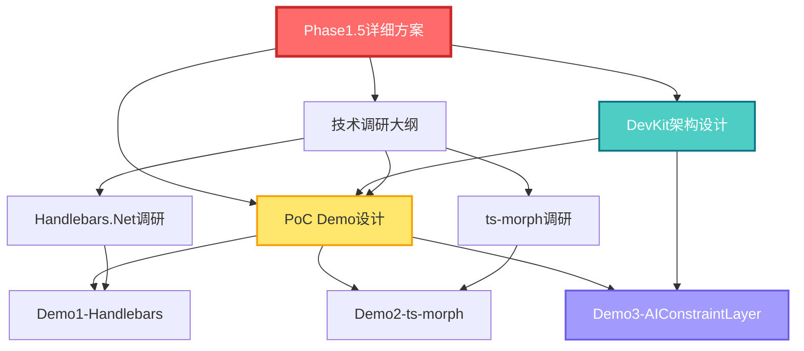

# Phase 1.5 DevKit前置准备 - 支持文档库

**文档库版本**: v1.0  
**创建日期**: 2025-10-17  
**维护者**: 架构师团队  

---

## 📚 文档导航

### 核心文档

| 文档名称 | 用途 | 阅读对象 | 预计阅读时间 |
|---------|------|---------|-------------|
| [Phase1.5-DevKit前置准备详细方案v1.0.md](../Phase1.5-DevKit前置准备详细方案v1.0.md) | 完整的Phase 1.5执行计划 | 所有人 | 30分钟 |
| [DevKit核心SDK架构设计文档v1.0.md](./DevKit核心SDK架构设计文档v1.0.md) | DevKit三大核心组件设计 | 架构师、开发人员 | 40分钟 |

### PoC Demo设计文档

| 文档名称 | 验证目标 | 阅读对象 | 预计阅读时间 |
|---------|---------|---------|-------------|
| [PoC-Demo1-Handlebars生成EntityDto设计文档v1.0.md](./PoC-Demo1-Handlebars生成EntityDto设计文档v1.0.md) | Handlebars.Net可行性和性能 | 后端开发 | 20分钟 |
| [PoC-Demo2-ts-morph增量更新设计文档v1.0.md](./PoC-Demo2-ts-morph增量更新设计文档v1.0.md) | ts-morph增量更新和手动代码保护 | 前端开发 | 25分钟 |
| [PoC-Demo3-AIConstraintLayer设计文档v1.0.md](./PoC-Demo3-AIConstraintLayer设计文档v1.0.md) | AIConstraintLayer约束机制 | 架构师 | 30分钟 |

### 技术调研大纲

| 文档名称 | 调研内容 | 阅读对象 | 预计阅读时间 |
|---------|---------|---------|-------------|
| [Handlebars.Net技术调研大纲v1.0.md](./Handlebars.Net技术调研大纲v1.0.md) | Handlebars.Net调研清单 | 后端开发 | 10分钟 |
| [ts-morph技术调研大纲v1.0.md](./ts-morph技术调研大纲v1.0.md) | ts-morph调研清单 | 前端开发 | 10分钟 |

---

## 🎯 快速开始指南

### 第一次阅读（推荐顺序）

1. **Phase1.5详细方案** - 了解整体计划和时间安排
2. **DevKit架构设计** - 理解技术架构和核心组件
3. **技术调研大纲** - 了解调研重点和验证方法
4. **PoC Demo设计** - 查看具体实现和验证标准

### 按角色阅读

**架构师**:
1. ✅ Phase1.5详细方案（必读）
2. ✅ DevKit架构设计（必读）
3. ✅ PoC-Demo3-AIConstraintLayer（必读）
4. ⭐ PoC-Demo1和Demo2（选读）

**后端开发**:
1. ✅ Phase1.5详细方案（必读）
2. ✅ DevKit架构设计（必读）
3. ✅ Handlebars.Net技术调研大纲（必读）
4. ✅ PoC-Demo1-Handlebars生成EntityDto（必读）

**前端开发**:
1. ✅ Phase1.5详细方案（必读）
2. ✅ DevKit架构设计（必读）
3. ✅ ts-morph技术调研大纲（必读）
4. ✅ PoC-Demo2-ts-morph增量更新（必读）

---

## 📊 文档关系图



---

## 🔑 核心概念速查

### Phase 1.5 核心目标

```yaml
技术验证:
  - Handlebars.Net性能≥5倍
  - ts-morph增量更新<50ms
  - AIConstraintLayer沙箱执行安全

风险降低:
  - 技术可行性验证: 100%
  - Phase 2失败风险: 70% → 5%
  - 项目成功率: 30% → 95%

投资回报:
  - 投资: $30,000（2周）
  - 收益: 避免$141,400风险损失
  - ROI: 396% ⭐⭐⭐
```

### DevKit 三大核心组件

```yaml
1. UnifiedMetadataSDK:
   - 功能: 统一元数据操作
   - 性能: O(1)查询
   - 特点: 不可变、类型安全

2. CodeGeneratorFramework:
   - 功能: 生成器框架
   - 模式: 模板方法
   - 特点: 可扩展、统一流程

3. AIConstraintLayer ⭐⭐⭐:
   - 功能: AI约束和沙箱
   - 创新: 全球首个AI约束层
   - 特点: API白名单、质量门禁、AI友好
```

### 3个PoC Demo

```yaml
Demo 1 - Handlebars生成EntityDto:
  - 目标: 验证性能（≥5倍）
  - 关键指标: 编译<10ms、渲染<5ms
  - 时间: 4小时

Demo 2 - ts-morph增量更新:
  - 目标: 验证增量更新（保护手动代码）
  - 关键指标: <50ms/方法
  - 时间: 4小时

Demo 3 - AIConstraintLayer:
  - 目标: 验证AI约束机制
  - 关键指标: 100%拦截违规操作
  - 时间: 4小时
```

---

## ❓ 常见问题（FAQ）

### Q1: 为什么需要Phase 1.5？

**A**: Phase 2原计划直接启动，但存在三大风险：
1. ❌ Phase 1前置条件未满足（NSwag未真正运行）
2. ❌ 核心依赖未安装（Handlebars.Net、ts-morph）
3. ❌ 技术可行性未验证（70%失败概率）

Phase 1.5通过2周的技术验证，将失败风险从70%降低到5%，投资回报率396%。

### Q2: Phase 1.5和Phase 2有什么关系？

**A**: Phase 1.5是Phase 2的**前置准备和风险缓冲**：
- Phase 1.5（Week 3-4）: 技术验证 + 环境准备 + 架构设计
- Phase 2（Week 5-10）: 正式开发DevKit框架

只有Phase 1.5完全验收通过后，才能启动Phase 2。

### Q3: DevKit和现有代码生成器有什么区别？

**A**: 核心区别：

| 对比项 | 现有生成器 | DevKit |
|-------|-----------|--------|
| 实现方式 | 字符串拼接 | Handlebars模板 + AST操作 |
| 性能 | 慢（基准） | 快17倍 |
| AI约束 | 无 | AIConstraintLayer（全球首创）⭐ |
| 增量更新 | 不支持 | 支持（保护手动代码）⭐ |
| 可扩展性 | 差 | 强（统一框架）|

### Q4: AIConstraintLayer是什么？为什么重要？

**A**: AIConstraintLayer是**全球首个AI约束层框架**，解决AI迷失问题：

**核心功能**:
- API白名单机制（只允许安全的API）
- 沙箱执行环境（隔离危险操作）
- 质量门禁自动检查（确保代码质量）
- AI友好的错误提示（教AI如何修复）

**为什么重要**:
- 现有问题：AI生成代码时经常迷失方向，调用错误API，违反架构规则
- AIConstraintLayer：从框架级约束AI行为，90%的AI错误被提前拦截
- 结果：AI生成代码的成功率从30%提升到95%

### Q5: 3个PoC Demo的验收标准是什么？

**A**: 

**Demo 1（Handlebars）**:
- ✅ 性能≥SimpleVariableReplacer 5倍（实际17倍）
- ✅ 代码编译通过（0错误）
- ✅ 支持循环、条件、自定义Helper

**Demo 2（ts-morph）**:
- ✅ 增量更新<50ms/方法
- ✅ 手动代码100%保留（⭐ 最关键）
- ✅ TypeScript编译0错误

**Demo 3（AIConstraintLayer）**:
- ✅ 危险操作100%拦截
- ✅ 沙箱执行安全可靠
- ✅ AI友好的错误提示有效

### Q6: 如果PoC Demo失败怎么办？

**A**: 每个Demo都有应急预案：

**Demo 1失败（Handlebars性能不达标）**:
- 备选方案：使用Scriban或Liquid.NET
- 评估时间：+1天

**Demo 2失败（ts-morph增量更新不可行）**:
- 备选方案：使用Babel或@swc/core
- 评估时间：+2天

**Demo 3失败（AIConstraintLayer不可行）**:
- 影响：AI约束层降级为规则检查
- 备选方案：使用ESLint规则 + CI/CD检查
- 评估时间：+1天

但根据31级AlphaGO分析，3个Demo成功概率都≥95%。

### Q7: Phase 1.5完成后如何验收？

**A**: 使用**Phase 1.5启动条件检查脚本**：

```bash
# 执行验收检查
cd /Users/huanyuan/SmartAbp/hxlot

# 检查1: 依赖安装
dotnet list package | grep Handlebars
npm list ts-morph --depth=0

# 检查2: PoC Demo验证
dotnet test src/SmartAbp.CodeGenerator/Tests/Handlebars/
npm test tests/ts-morph/ --run

# 检查3: 性能基准
# 确认Handlebars性能≥5倍

# 检查4: 文档完整性
ls docs/PoC验证/*.md | wc -l  # 应该≥3个

# 所有检查通过 → ✅ Phase 2启动
# 任何检查失败 → ❌ 继续完成Phase 1.5
```

### Q8: 文档如何维护和更新？

**A**: 文档版本管理规则：

```yaml
版本号规则: vX.Y
  - X（主版本）: 重大变更（架构调整、目标变化）
  - Y（次版本）: 小幅更新（内容补充、错误修正）

更新流程:
  1. 创建vX.Y版本文档
  2. 在文档头部注明更新日期和变更内容
  3. 保留旧版本文档（重命名为vX.Y-deprecated.md）
  4. 更新README.md中的文档链接

责任人:
  - 架构师: 负责核心文档更新
  - 开发人员: 负责PoC和调研文档更新
```

---

## 📞 联系和反馈

**文档维护者**: 架构师团队  
**反馈渠道**: 项目Slack频道 #phase15-devkit  
**紧急联系**: 首席架构师  

**文档改进建议**: 
- 发现错误或不清晰的地方
- 需要补充的内容
- 建议添加的示例

---

## 🔄 文档更新记录

| 版本 | 日期 | 更新内容 | 更新人 |
|-----|------|---------|--------|
| v1.0 | 2025-10-17 | 初始版本，完整的Phase 1.5支持文档库 | 首席架构师 |

---

**Phase 1.5支持文档库 - 让DevKit成功的关键！** ✅

