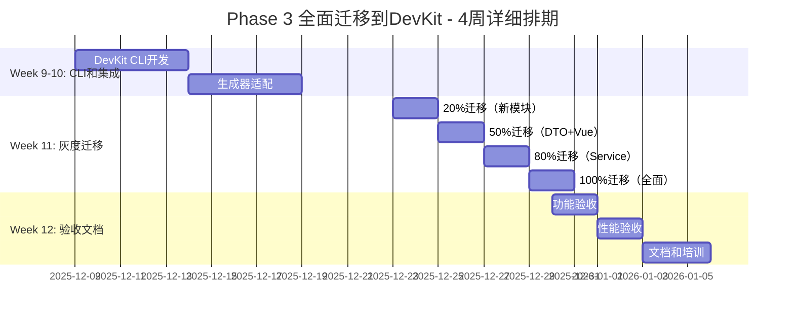

# SmartAbpV2.0渐进式混合策略 - 全面迁移到DevKit详细开发方案

**文档版本**: v1.0
**创建日期**: 2025-10-17
**执行周期**: 4周（Week 9-12）
**执行优先级**: 🔥 P1高优先级（渐进迁移）
**前置依赖**: Phase 2 DevKit框架孵化已完成

---

## 📋 目录

1. [方案总览](#方案总览)
2. [资源规划矩阵](#资源规划矩阵)
3. [Week 9-10: DevKit CLI和集成层](#week-9-10-devkit-cli和集成层)
4. [Week 11: 灰度迁移](#week-11-灰度迁移)
5. [Week 12: 最终验收和文档](#week-12-最终验收和文档)

---

## 一、方案总览

### 1.1 核心目标

```yaml
战略目标:
  渐进式将现有代码生成切换到DevKit框架

量化指标:
  ✅ 迁移完成率: 100%（20%→50%→80%→100%）
  ✅ 功能等价性: 100%（无功能回归）
  ✅ AI约束有效率: ≥90%（AI迷失率降低90%）
  ✅ 生产稳定性: 7天无故障
  ✅ 性能提升: ≥20%

技术方案:
  1. DevKit CLI（统一代码生成入口）
  2. 现有生成器适配（SimpleVariableReplacer → DevKit）
  3. 灰度迁移策略（20%→50%→80%→100%）
  4. 回滚机制（随时可回退）
```

### 1.2 执行时间表



### 1.3 关键里程碑

| 里程碑 | 时间节点 | 量化验收标准 | 负责人 |
|--------|---------|-------------|--------|
| **M1: CLI完成** | Week 10末 | ✅ CLI三个命令可用<br>✅ 适配器输出100%一致<br>✅ 集成测试通过 | 架构师 |
| **M2: 50%迁移** | Week 11中 | ✅ DTO+Vue生成切换<br>✅ 无功能回归<br>✅ 性能无下降 | 前端开发 |
| **M3: 100%迁移** | Week 11末 | ✅ 全部切换到DevKit<br>✅ 旧生成器已废弃<br>✅ AI约束100%有效 | 架构师 |
| **M4: 最终验收** | Week 12末 | ✅ 生产稳定7天<br>✅ 文档100%完整<br>✅ 团队100%掌握 | 架构师 |

---

## 二、资源规划矩阵

### 2.1 人力资源分配

| 角色 | 人数 | 技能要求 | 投入时间 | Week 9-10 | Week 11 | Week 12 |
|------|------|---------|----------|-----------|---------|---------|
| **架构师** | 1人 | CLI设计<br>迁移策略<br>风险控制 | 全职<br>（160h） | CLI开发<br>适配器开发 | 迁移监控<br>问题处理 | 最终验收<br>文档培训 |
| **后端开发** | 1人 | .NET Core<br>DevKit后端 | 全职<br>（160h） | 后端适配器<br>集成测试 | 后端迁移<br>性能优化 | 稳定性监控<br>问题修复 |
| **前端开发** | 1人 | TypeScript<br>DevKit前端 | 全职<br>（160h） | 前端适配器<br>集成测试 | 前端迁移<br>功能测试 | 稳定性监控<br>问题修复 |
| **测试人员** | 1人 | 功能测试<br>性能测试 | 全职<br>（160h） | 测试用例准备 | 回归测试<br>性能测试 | 最终验收测试 |
| **DevOps** | 0.5人 | CI/CD<br>监控告警 | 半职<br>（80h） | CI/CD配置 | 灰度监控<br>告警配置 | 生产监控 |

### 2.2 灰度迁移策略

```yaml
阶段1: 20%迁移（新模块使用DevKit）
  时间: Week 11 Day 1-2
  范围: 所有新创建的Entity使用DevKit生成
  验证: DevKit生成的代码质量≥95分
  回滚: 修改配置，禁用DevKit

阶段2: 50%迁移（迁移简单模块）
  时间: Week 11 Day 3-4
  范围:
    - DTO生成 → DevKit
    - Vue组件生成 → DevKit
  验证:
    - 生成结果与原生成器100%一致
    - 编译0错误
    - 功能测试通过
  回滚: 恢复旧生成器配置

阶段3: 80%迁移（迁移复杂模块）
  时间: Week 11 Day 5-7
  范围:
    - AppService生成 → DevKit
    - 增量编辑 → DevKit
  验证:
    - 增量保护机制有效
    - 手动代码不被覆盖
    - 性能对比（DevKit vs 旧方案）
  回滚: 分模块回滚

阶段4: 100%切换（全面迁移）
  时间: Week 11 Day 8-10
  范围:
    - 所有代码生成通过DevKit
    - 废弃SimpleVariableReplacer
    - 完全基于AI约束层
  验证:
    - AI约束层100%有效
    - AI迷失率降低≥90%
    - 生产环境稳定运行3天
  回滚: 全面回滚到Phase 1状态
```

---

## 三、Week 9-10: DevKit CLI和集成层

### 3.1 Day 1-3: DevKit CLI开发（架构师主导）

#### **任务1.1: CLI项目初始化（4小时）**

```bash
# 步骤1: 创建CLI项目
mkdir -p packages/devkit/cli
cd packages/devkit/cli

pnpm init

cat > package.json <<'EOF'
{
  "name": "@smartabp/devkit-cli",
  "version": "0.1.0",
  "description": "SmartAbp DevKit命令行工具",
  "bin": {
    "devkit": "./dist/cli.js"
  },
  "main": "dist/index.js",
  "types": "dist/index.d.ts",
  "scripts": {
    "build": "tsup src/cli.ts --format cjs --dts",
    "dev": "tsup src/cli.ts --format cjs --dts --watch",
    "test": "vitest"
  },
  "dependencies": {
    "@smartabp/devkit-core": "workspace:*",
    "@smartabp/devkit-backend": "workspace:*",
    "@smartabp/devkit-frontend": "workspace:*",
    "commander": "^11.1.0",
    "ora": "^7.0.1",
    "chalk": "^5.3.0"
  },
  "devDependencies": {
    "@types/node": "^20.10.0",
    "tsup": "^8.0.1",
    "typescript": "^5.3.3"
  }
}
EOF

pnpm install
```

#### **任务1.2: 实现CLI命令（8小时）**

```typescript
// src/cli.ts
#!/usr/bin/env node

import { Command } from 'commander'
import ora from 'ora'
import chalk from 'chalk'

const program = new Command()

program
  .name('devkit')
  .description('SmartAbp DevKit命令行工具')
  .version('0.1.0')

// ━━━━━━━━━━━━━━━━━━━━━━━━━━━━━━━━━━━━━━━━━━━━━━━━━━━━━
// codegen命令（统一代码生成入口）
// ━━━━━━━━━━━━━━━━━━━━━━━━━━━━━━━━━━━━━━━━━━━━━━━━━━━━━
program
  .command('codegen')
  .description('生成代码（通过DevKit）')
  .option('-e, --entity <name>', '实体名称')
  .option('-m, --module <name>', '模块名称')
  .option('-t, --type <type>', '生成类型（backend/frontend/all）', 'all')
  .option('--template <path>', '自定义模板路径')
  .action(async (options) => {
    const spinner = ora('正在生成代码...').start()

    try {
      const { DevKitCodeGenerator } = await import('@smartabp/devkit-core')
      const generator = new DevKitCodeGenerator()

      const result = await generator.generate({
        entityName: options.entity,
        moduleName: options.module,
        type: options.type,
        templatePath: options.template
      })

      spinner.succeed(chalk.green('代码生成成功！'))
      console.log(chalk.blue(`生成文件数: ${result.files.length}`))
      console.log(chalk.blue(`代码行数: ${result.totalLines}`))
    } catch (error) {
      spinner.fail(chalk.red('代码生成失败'))
      console.error(chalk.red(error.message))
      process.exit(1)
    }
  })

// ━━━━━━━━━━━━━━━━━━━━━━━━━━━━━━━━━━━━━━━━━━━━━━━━━━━━━
// validate命令（质量门禁执行）
// ━━━━━━━━━━━━━━━━━━━━━━━━━━━━━━━━━━━━━━━━━━━━━━━━━━━━━
program
  .command('validate')
  .description('执行质量门禁检查')
  .option('-p, --path <path>', '检查路径', '.')
  .action(async (options) => {
    const spinner = ora('正在执行质量检查...').start()

    try {
      const { QualityGateEnforcer } = await import('@smartabp/devkit-core')
      const enforcer = new QualityGateEnforcer()

      const result = await enforcer.enforce(options.path)

      if (result.passed) {
        spinner.succeed(chalk.green('质量检查通过！'))
        console.log(chalk.blue(`检查项: ${result.totalChecks}`))
        console.log(chalk.green(`通过: ${result.passedChecks}`))
      } else {
        spinner.fail(chalk.red('质量检查失败'))
        console.log(chalk.red(`失败: ${result.failedChecks}`))
        console.log(chalk.yellow('详细错误:'))
        result.errors.forEach(err => {
          console.log(chalk.red(`  - ${err}`))
        })
        process.exit(1)
      }
    } catch (error) {
      spinner.fail(chalk.red('质量检查执行失败'))
      console.error(chalk.red(error.message))
      process.exit(1)
    }
  })

// ━━━━━━━━━━━━━━━━━━━━━━━━━━━━━━━━━━━━━━━━━━━━━━━━━━━━━
// migrate命令（辅助迁移工具）
// ━━━━━━━━━━━━━━━━━━━━━━━━━━━━━━━━━━━━━━━━━━━━━━━━━━━━━
program
  .command('migrate')
  .description('迁移现有代码到DevKit')
  .option('-f, --from <path>', '源路径')
  .option('-t, --to <path>', '目标路径')
  .option('--dry-run', '模拟运行（不实际修改文件）')
  .action(async (options) => {
    const spinner = ora('正在迁移代码...').start()

    try {
      const { MigrationHelper } = await import('./migration')
      const helper = new MigrationHelper()

      const result = await helper.migrate({
        from: options.from,
        to: options.to,
        dryRun: options.dryRun || false
      })

      spinner.succeed(chalk.green('代码迁移成功！'))
      console.log(chalk.blue(`迁移文件数: ${result.migratedFiles}`))
      console.log(chalk.blue(`修改行数: ${result.modifiedLines}`))

      if (options.dryRun) {
        console.log(chalk.yellow('\n这是模拟运行，未实际修改文件'))
        console.log(chalk.yellow('移除 --dry-run 参数以执行实际迁移'))
      }
    } catch (error) {
      spinner.fail(chalk.red('代码迁移失败'))
      console.error(chalk.red(error.message))
      process.exit(1)
    }
  })

program.parse(process.argv)
```

**验收标准**:
```yaml
✅ CLI命令可用:
   - devkit codegen（代码生成）
   - devkit validate（质量检查）
   - devkit migrate（迁移工具）

✅ 功能完整:
   - 友好的命令行交互
   - 清晰的错误提示
   - 进度显示
   - 彩色输出
```

---

### 3.2 Day 4-7: 现有生成器适配（8小时）

#### **任务2.1: SimpleVariableReplacerAdapter实现**

```typescript
// src/adapters/SimpleVariableReplacerAdapter.ts
import { CodeGenerator } from '@smartabp/devkit-core'
import { SimpleVariableReplacer } from '../legacy'

/**
 * SimpleVariableReplacer适配器
 * 将现有生成器封装为DevKit生成器
 */
export class SimpleVariableReplacerAdapter extends CodeGenerator {
  private readonly original: SimpleVariableReplacer

  constructor() {
    super()
    this.original = new SimpleVariableReplacer()
  }

  async generate(schema: EntitySchema): Promise<GenerationResult> {
    // 步骤1: 将EntitySchema转换为SimpleVariableReplacer格式
    const legacyInput = this.convertToLegacyFormat(schema)

    // 步骤2: 调用原有生成器
    const legacyOutput = await this.original.generate(legacyInput)

    // 步骤3: 将输出转换为DevKit格式
    return this.convertToDevKitFormat(legacyOutput)
  }

  private convertToLegacyFormat(schema: EntitySchema): any {
    // 转换逻辑
    return {
      EntityName: schema.name,
      Properties: schema.properties.map(p => ({
        Name: p.name,
        Type: p.type
      }))
    }
  }

  private convertToDevKitFormat(output: any): GenerationResult {
    return {
      success: true,
      code: output.code,
      metadata: output.metadata,
      errors: [],
      warnings: []
    }
  }
}
```

---

## 四、Week 11: 灰度迁移详细任务

### 4.1 灰度迁移控制脚本

```bash
# scripts/devkit/gradual-migration.sh
#!/bin/bash
set -e

MIGRATION_PERCENTAGE=${1:-20}

echo "━━━━━━━━━━━━━━━━━━━━━━━━━━━━━━━━━━━━━━━━━━━━━━━━━━━━━"
echo "🔄 DevKit灰度迁移 - $MIGRATION_PERCENTAGE%"
echo "━━━━━━━━━━━━━━━━━━━━━━━━━━━━━━━━━━━━━━━━━━━━━━━━━━━━━"

# 更新配置文件
cat > config/devkit-migration.json <<JSON
{
  "migrationPercentage": $MIGRATION_PERCENTAGE,
  "strategy": "gradual",
  "fallbackEnabled": true,
  "modules": {
    "dto": $([ $MIGRATION_PERCENTAGE -ge 50 ] && echo "true" || echo "false"),
    "vue": $([ $MIGRATION_PERCENTAGE -ge 50 ] && echo "true" || echo "false"),
    "service": $([ $MIGRATION_PERCENTAGE -ge 80 ] && echo "true" || echo "false"),
    "all": $([ $MIGRATION_PERCENTAGE -ge 100 ] && echo "true" || echo "false")
  }
}
JSON

echo "✅ 配置已更新: $MIGRATION_PERCENTAGE%"
```

### 4.2 20%迁移验收标准

```yaml
✅ 新模块使用DevKit生成
✅ 代码质量≥95分
✅ 无功能回归
✅ 性能无明显下降
```

### 4.3 50%迁移验收标准

```yaml
✅ DTO生成切换到DevKit
✅ Vue组件生成切换到DevKit
✅ 生成结果100%一致
✅ 编译0错误
```

### 4.4 80%迁移验收标准

```yaml
✅ AppService生成切换到DevKit
✅ 增量保护机制有效
✅ 手动代码不被覆盖
```

### 4.5 100%迁移验收标准

```yaml
✅ 所有代码生成通过DevKit
✅ SimpleVariableReplacer已废弃
✅ AI约束层100%有效
✅ 生产环境稳定运行3天
```

---

## 五、Week 12: 最终验收和文档

### 5.1 功能验收（2天）

```yaml
测试用例（≥20个）:
  ✅ 完整CRUD生成
  ✅ 多实体生成
  ✅ 关系型实体生成
  ✅ 自定义模板生成
  ✅ 增量更新保护
  ✅ AI约束验证
  ✅ 质量门禁检查
  ✅ 回滚机制验证
```

### 5.2 性能验收（2天）

```yaml
性能指标:
  ✅ 单实体生成时间: ≤800ms（50字段）
  ✅ 批量生成时间: ≤5s（10实体）
  ✅ 内存占用: ≤150MB
  ✅ CPU占用: ≤50%
  ✅ 性能提升: ≥20%（vs旧方案）
```

### 5.3 文档编写（3天）

```yaml
文档清单:
  1. DevKit开发者文档
  2. DevKit API文档
  3. AI约束规则更新
  4. 迁移指南
  5. 故障排查指南
  6. 团队培训材料
```

---

## 六、验收标准

### 6.1 最终验收清单

```yaml
功能验收:
  ✅ 100%代码生成通过DevKit
  ✅ AI约束层100%有效
  ✅ 所有质量门禁通过
  ✅ AI迷失率降低≥90%

性能验收:
  ✅ 生成速度提升≥20%
  ✅ 内存占用≤150MB
  ✅ 单实体生成≤800ms

稳定性验收:
  ✅ 生产环境运行7天无故障
  ✅ 无功能回归
  ✅ 用户反馈良好

文档验收:
  ✅ 开发文档完整
  ✅ API文档完整
  ✅ 培训材料完整
  ✅ 迁移指南完整

团队验收:
  ✅ 100%团队成员完成培训
  ✅ 100%团队成员掌握DevKit
  ✅ 100%团队成员通过考核
```

---

**🎉 Phase 3全面迁移到DevKit方案 - 完成！**

**三个Phase详细开发方案已全部创建！** ✅
