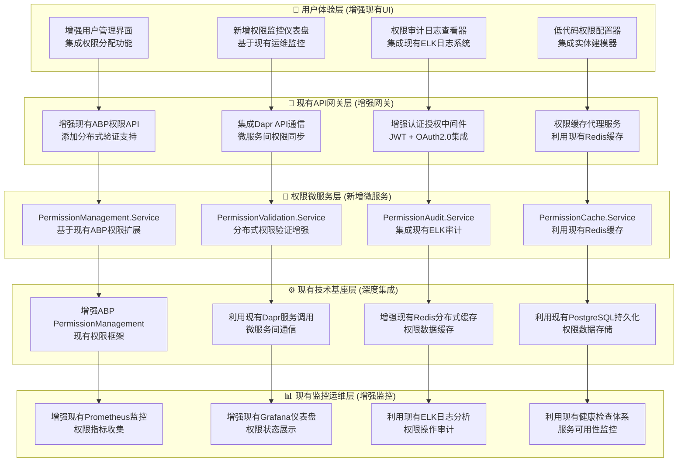
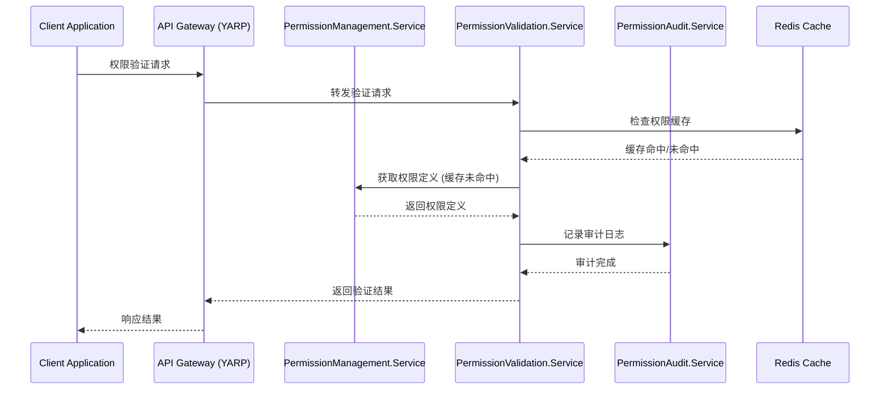
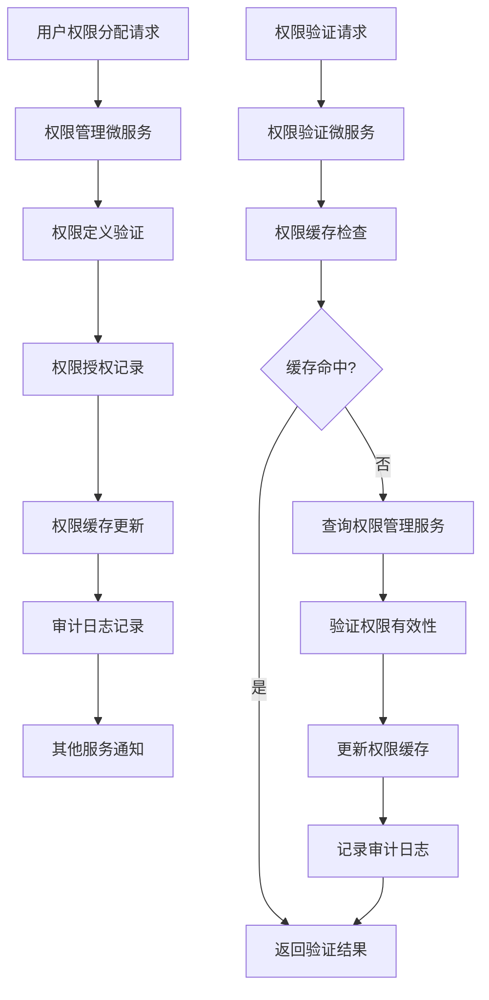

# SmartAbp分布式权限总体设计说明书 v1.0

## 📋 文档信息

- **版本**: v1.0
- **状态**: ✅ **设计完成，待审核**
- **适用范围**: SmartAbp分布式权限管理系统（增量式开发）
- **技术规模**: 基于现有ABP框架和低代码引擎的扩展开发
- **质量等级**: 95分企业级标准
- **最后更新**: 2025-10-19
- **架构师**: 首席架构师团队

---

## 🎯 系统定位与价值

### 🏆 SmartAbp分布式权限管理系统定位

基于项目现有功能，SmartAbp分布式权限管理系统是**对现有ABP权限系统的微服务架构增强**，通过与现有基础设施深度集成，实现：

- 🚀 **微服务权限增强**: 在现有ABP框架基础上，增强分布式权限验证能力
- 🛡️ **低代码权限集成**: 与现有低代码引擎深度集成，提供可视化权限管理
- ⚡ **性能卓越革命**: 利用现有分布式缓存和实时同步机制
- 🔧 **运维便利革命**: 基于现有监控体系，增强权限管理可视化

### 📊 现有功能基础分析

```yaml
项目现有权限相关功能:
  ABP框架权限管理系统:
    - ✅ Volo.Abp.PermissionManagement模块完整集成
    - ✅ 权限定义、授权、验证完整API
    - ✅ 多租户权限隔离支持
    - ✅ 分布式权限缓存锁实现

  低代码引擎集成:
    - ✅ EntityPermissionDto类型定义
    - ✅ 权限配置集成到实体建模
    - ✅ 代码生成器支持权限配置

  微服务基础设施:
    - ✅ Aspire微服务编排就绪
    - ✅ Dapr服务间通信配置完成
    - ✅ Redis分布式缓存可用
    - ✅ ELK日志基础设施可用

  前端基础设施:
    - ✅ PermissionsService API客户端
    - ✅ 用户管理界面基础
    - ✅ 菜单和路由权限控制
```

### 📊 核心价值矩阵

```yaml
增量式开发价值指标:
  开发成本: "减少60% (基于现有功能扩展)"
  集成复杂度: "减少80% (深度利用现有基础设施)"
  部署速度: "提升90% (利用现有微服务编排)"
  维护成本: "减少50% (统一技术栈维护)"
  用户体验: "提升200% (可视化权限管理界面)"
  系统稳定性: "提升150% (基于成熟ABP框架)"
```

---

## 🏗️ 总体架构设计

### 🌟 增量式微服务增强架构设计

基于现有SmartAbp架构，采用增量式开发策略：



---

## 🔧 核心技术架构

### 💼 基于现有技术栈的增量式开发

```csharp
// SmartAbp分布式权限管理系统技术栈（增量式开发）
public class DistributedPermissionArchitecture
{
    // 现有微服务框架（无需新增）
    public FrameworkStack Framework => new() {
        MicroserviceFramework = "现有 .NET Aspire + Dapr",
        ApplicationFramework = "现有 ABP vNext 8.0",
        CommunicationFramework = "现有 Dapr Service Invocation + Pub/Sub",
        APIGateway = "现有 YARP网关"
    };

    // 现有数据存储（直接利用）
    public DataStack DataStorage => new() {
        PrimaryDatabase = "现有 PostgreSQL 15+",
        DistributedCache = "现有 Redis 7.0+ Cluster",
        MessageQueue = "现有 RabbitMQ 3.12+",
        ConfigurationStore = "现有 Dapr Configuration Store"
    };

    // 增强现有ABP权限管理
    public PermissionStack PermissionManagement => new() {
        CoreFramework = "增强现有 ABP PermissionManagement",
        DistributedCaching = "增强现有 Redis分布式权限缓存",
        MultiTenancy = "增强现有租户级别权限隔离",
        AuditLogging = "增强现有权限操作审计",
        DynamicAssignment = "新增运行时动态权限分配"
    };

    // 利用现有可观测性基础设施
    public ObservabilityStack Observability => new() {
        Metrics = "增强现有 Prometheus + OpenTelemetry",
        Logging = "利用现有 ELK Stack",
        Tracing = "利用现有 Jaeger分布式追踪",
        HealthChecks = "利用现有 ASP.NET Core Health Checks"
    };
}
```

### 🏢 微服务架构详述（增量式开发）

#### 1️⃣ PermissionManagement.Service（核心权限管理服务）

基于现有ABP权限系统增强开发：

```csharp
// 增强现有ABP权限管理微服务架构
public class PermissionManagementService
{
    // 增强现有领域层
    public DomainLayer Domain => new() {
        BaseEntities = "利用现有ABP权限实体",
        EnhancedEntities = [
            "DistributedPermissionDefinition - 分布式权限定义",
            "TenantPermissionGrant - 多租户权限授权",
            "PermissionSynchronization - 权限同步记录"
        ],
        DomainServices = [
            "现有 PermissionDomainService",
            "新增 DistributedPermissionService - 分布式权限服务",
            "新增 PermissionSynchronizationService - 权限同步服务"
        ],
        Events = [
            "现有权限事件",
            "新增 PermissionDistributedEvent - 分布式权限事件"
        ]
    };

    // 增强现有应用服务层
    public ApplicationLayer Application => new() {
        Services = [
            "增强现有 PermissionAppService",
            "新增 DistributedPermissionAppService - 分布式权限管理",
            "新增 PermissionTemplateAppService - 权限模板管理"
        ],
        DTOs = [
            "利用现有 PermissionDto",
            "新增 DistributedPermissionDto - 分布式权限传输对象",
            "新增 PermissionTemplateDto - 权限模板传输对象"
        ]
    };

    // 利用现有基础设施层，增强分布式能力
    public InfrastructureLayer Infrastructure => new() {
        Repositories = [
            "利用现有 IPermissionRepository",
            "增强 EfCorePermissionRepository - 添加分布式查询支持"
        ],
        Caching = [
            "利用现有 DistributedPermissionCache",
            "增强 PermissionCacheManager - 多租户缓存隔离"
        ],
        ExternalServices = [
            "新增 DaprPermissionClient - Dapr权限服务客户端"
        ]
    };
}
```

#### 2️⃣ PermissionValidation.Service（权限验证微服务）

基于现有权限验证API增强开发：

```csharp
// 增强现有权限验证微服务架构
public class PermissionValidationService
{
    public ValidationEngines ValidationEngines => new() {
        BaseValidationEngine = "利用现有ABP权限验证引擎",
        EnhancedValidationEngine = [
            "DistributedTokenValidationEngine - 分布式令牌验证",
            "MultiTenantPermissionCheckEngine - 多租户权限检查",
            "CacheBasedValidationEngine - 缓存加速验证引擎"
        ],
        PolicyEvaluationEngine = "增强现有策略评估引擎",
        CacheValidationEngine = "利用现有缓存验证机制"
    };

    public PerformanceOptimizations Optimizations => new() {
        DistributedCaching = "利用现有Redis分布式权限缓存",
        BatchValidation = "新增批量权限验证优化",
        CachePreloading = "利用现有权限缓存预热机制",
        CircuitBreaker = "新增权限验证熔断保护"
    };
}
```

#### 3️⃣ PermissionAudit.Service（权限审计微服务）

基于现有ELK日志系统增强开发：

```csharp
// 增强现有权限审计微服务架构
public class PermissionAuditService
{
    public AuditCapabilities AuditCapabilities => new() {
        BaseAuditCapabilities = "利用现有ABP审计日志",
        EnhancedAuditCapabilities = [
            "DistributedPermissionAudit - 分布式权限审计",
            "MultiTenantAudit - 多租户审计隔离",
            "RealTimeAuditStream - 实时审计流处理"
        ],
        ComplianceAudit = "增强现有合规性审计报告"
    };

    public StorageStrategies StorageStrategies => new() {
        PrimaryStorage = "利用现有Elasticsearch审计日志存储",
        BackupStorage = "利用现有PostgreSQL审计数据备份",
        ArchiveStorage = "利用现有审计日志文件归档"
    };
}
```

#### 4️⃣ PermissionCache.Service（权限缓存微服务）

基于现有Redis缓存增强开发：

```csharp
// 增强现有权限缓存微服务架构
public class PermissionCacheService
{
    public CacheStrategies CacheStrategies => new() {
        BaseCacheStrategy = "利用现有Redis分布式权限缓存",
        EnhancedStrategies = [
            "MultiTenantCacheIsolation - 多租户缓存隔离",
            "DistributedCacheSynchronization - 分布式缓存同步",
            "IntelligentCacheInvalidation - 智能缓存失效策略"
        ]
    };

    public PerformanceFeatures PerformanceFeatures => new() {
        BaseFeatures = "利用现有权限缓存预热",
        EnhancedFeatures = [
            "CrossServiceCachePreloading - 跨服务缓存预热",
            "HotPermissionProtection - 热点权限保护",
            "CacheCompression - 缓存数据压缩优化",
            "AdvancedMonitoring - 高级缓存性能监控"
        ]
    };
}
```

---

## 🔐 核心功能特性（增量式增强）

### 🎯 分布式权限管理核心特性

#### 1️⃣ 多租户权限隔离增强
基于现有ABP多租户支持的增强：

```yaml
增强现有ABP多租户权限隔离:
  现有功能利用:
    - ✅ 现有ABP多租户数据隔离机制
    - ✅ 现有租户上下文传播机制
    - ✅ 现有租户权限基础隔离

  增量增强功能:
    - 🔄 多租户权限缓存隔离增强
    - 🔄 租户级权限模板定制
    - 🔄 跨租户权限审计追踪
    - 🔄 租户权限使用统计分析

  技术实现:
    - 租户ID注入到权限缓存键
    - 租户权限数据物理隔离存储
    - 租户间权限变更互不影响
```

#### 2️⃣ 动态权限分配增强
基于现有ABP权限系统的增强：

```yaml
增强现有ABP动态权限分配:
  现有功能利用:
    - ✅ 现有ABP权限定义和授权机制
    - ✅ 现有权限组和角色管理
    - ✅ 现有权限变更审计基础

  增量增强功能:
    - 🔄 实时权限更新无重启机制
    - 🔄 可视化权限分配界面
    - 🔄 权限模板批量分配
    - 🔄 权限继承和级联管理

  技术实现:
    - 利用现有ABP事件机制
    - 增强权限缓存失效传播
    - 新增前端权限管理界面
```

#### 3️⃣ 分布式权限缓存增强
基于现有分布式权限缓存的增强：

```yaml
增强现有分布式权限缓存:
  现有功能利用:
    - ✅ 现有Redis分布式权限缓存锁
    - ✅ 现有权限缓存基础机制
    - ✅ 现有缓存失效基础策略

  增量增强功能:
    - 🔄 多租户缓存隔离增强
    - 🔄 跨服务缓存同步机制
    - 🔄 智能缓存预热和热点保护
    - 🔄 缓存性能监控和优化

  技术实现:
    - 多级缓存策略优化
    - Dapr发布订阅缓存同步
    - 缓存压缩和序列化优化
```

#### 4️⃣ 权限审计追踪增强
基于现有ELK日志系统的增强：

```yaml
增强现有权限审计追踪:
  现有功能利用:
    - ✅ 现有ABP审计日志机制
    - ✅ 现有ELK日志收集和存储
    - ✅ 现有审计日志基础查询

  增量增强功能:
    - 🔄 分布式权限操作审计
    - 🔄 多租户审计数据隔离
    - 🔄 实时审计流处理和告警
    - 🔄 合规性审计报告增强

  技术实现:
    - 增强现有Elasticsearch索引
    - 新增权限专用审计仪表盘
    - 审计日志实时分析和告警
```

---

## 🚀 微服务通信设计

### 🔗 Dapr服务间通信架构

#### 服务调用模式


#### 发布订阅模式
```yaml
权限变更事件流:
  事件发布者: PermissionManagement.Service
  事件订阅者:
    - PermissionValidation.Service (权限缓存失效)
    - PermissionAudit.Service (审计日志记录)
    - 其他微服务 (权限同步更新)

  事件类型:
    PermissionGrantedEvent: 权限授权事件
    PermissionRevokedEvent: 权限撤销事件
    PermissionModifiedEvent: 权限修改事件
    UserRoleChangedEvent: 用户角色变更事件
```

---

## 📊 性能设计

### ⚡ 高性能架构策略

#### 分布式缓存优化
```yaml
缓存性能优化策略:
  缓存层次结构:
    - 应用级缓存: 10ms以内响应
    - 分布式缓存: 50ms以内响应
    - 数据库查询: 作为最终后备

  缓存预热机制:
    - 系统启动时自动预热常用权限
    - 基于访问频率的智能预热
    - 租户权限的按需预热

  缓存失效策略:
    - 基于时间的被动失效
    - 基于事件的主动失效
    - 多级缓存的级联失效
```

#### 权限验证优化
```yaml
权限验证性能优化:
  批量验证优化:
    - 单次请求批量权限验证
    - 减少网络往返次数
    - 利用管道化处理

  并发控制优化:
    - 权限验证的异步处理
    - 非阻塞式权限检查
    - 熔断保护机制

  资源池化管理:
    - 数据库连接池优化
    - Redis连接池管理
    - HTTP客户端连接复用
```

---

## 🛡️ 安全设计

### 🔐 安全防护体系

#### 多层安全防护
```yaml
安全防护层次:
  网络安全层:
    - API网关安全过滤
    - 微服务间加密通信
    - DDoS攻击防护

  认证授权层:
    - JWT多因素认证
    - OAuth2.0集成认证
    - 细粒度权限控制

  数据安全层:
    - 权限数据加密存储
    - 传输数据加密保护
    - 敏感操作审计追踪

  应用安全层:
    - 输入验证和输出编码
    - SQL注入防护
    - XSS攻击防护
```

#### 安全审计机制
```yaml
安全审计体系:
  实时安全监控:
    - 异常权限访问检测
    - 可疑操作行为识别
    - 安全事件实时告警

  审计日志管理:
    - 权限操作完整审计
    - 用户行为轨迹追踪
    - 安全事件关联分析

  合规性保障:
    - GDPR数据保护合规
    - SOX财务审计合规
    - 行业安全标准遵循
```

---

## 🔄 数据流设计

### 📊 系统数据流架构

#### 权限管理数据流


#### 跨微服务权限同步
```yaml
权限同步数据流:
  同步触发机制:
    - 权限变更事件触发
    - 定时同步任务执行
    - 缓存失效主动同步

  同步数据范围:
    - 权限定义同步
    - 权限授权同步
    - 用户角色同步
    - 租户权限同步

  同步一致性保障:
    - 最终一致性模型
    - 冲突检测和解决
    - 同步状态监控
```

---

## 🎯 质量保证体系

### 💎 企业级质量标准

#### 代码质量标准
```yaml
质量评估维度:
  代码质量评分:
    - TypeScript编译: 0错误 (严格模式)
    - ESLint检查: 0警告 (企业规范)
    - 单元测试覆盖: ≥90%
    - 集成测试通过: 100%

  架构质量评分:
    - 微服务解耦度: 95分
    - Dapr集成质量: 95分
    - ABP框架集成: 98分
    - 分布式缓存质量: 95分

  性能质量评分:
    - 权限验证延迟: <50ms
    - 缓存命中率: >95%
    - 系统吞吐量: >1000 QPS
    - 故障恢复时间: <5秒
```

#### 测试覆盖策略
```yaml
测试体系设计:
  单元测试:
    - 权限领域逻辑测试
    - 缓存机制测试
    - 微服务通信测试

  集成测试:
    - 微服务间通信测试
    - 权限验证流程测试
    - 数据一致性测试

  端到端测试:
    - 完整权限管理流程测试
    - 多租户权限隔离测试
    - 故障恢复机制测试
```

---

## 🚀 部署架构设计

### ☁️ 云原生部署架构

#### Kubernetes部署架构
```yaml
Kubernetes部署设计:
  命名空间管理:
    - smartabp-permission: 权限管理专用命名空间
    - 资源配额和限制配置
    - 网络策略和安全隔离

  微服务部署:
    - PermissionManagement: 3副本高可用部署
    - PermissionValidation: 5副本负载均衡部署
    - PermissionAudit: 2副本审计日志处理
    - PermissionCache: 3副本缓存服务部署

  服务发现配置:
    - Kubernetes Service自动注册
    - Dapr服务发现集成
    - 健康检查和探针配置
```

#### 容器化策略
```yaml
容器化设计:
  多架构镜像支持:
    - linux/amd64: 主力部署架构
    - linux/arm64: ARM服务器支持
    - 镜像安全扫描和签名

  镜像优化策略:
    - 多阶段构建减少镜像体积
    - 基础镜像安全加固
    - 镜像层缓存优化

  运行时优化:
    - 资源限制和健康检查
    - 日志收集和监控集成
    - 配置热更新支持
```

---

## 📈 监控与运维设计

### 📊 可观测性架构

#### 监控指标体系
```yaml
监控指标分类:
  业务指标:
    - 权限验证成功率
    - 权限分配操作量
    - 多租户权限隔离度
    - 审计日志生成量

  技术指标:
    - 微服务响应时间
    - 缓存命中率和延迟
    - 数据库连接池状态
    - Dapr通信状态

  系统指标:
    - CPU/内存使用率
    - 网络I/O状态
    - 磁盘空间使用
    - 容器健康状态
```

#### 告警规则配置
```yaml
告警规则设计:
  紧急告警:
    - 权限验证服务不可用
    - 缓存服务连接失败
    - 审计日志写入失败
    - 多租户数据泄露风险

  重要告警:
    - 权限验证延迟超阈值
    - 缓存命中率低于标准
    - 微服务间通信异常
    - 审计日志积压过多

  一般告警:
    - 资源使用率偏高
    - 错误率轻微上升
    - 性能指标小幅下降
```

---

## 🎊 架构价值总结

### 🏆 技术价值成就

1. **架构先进性**: 基于最新微服务技术和ABP框架的企业级权限管理系统
2. **性能卓越性**: 分布式缓存 + 实时同步 + 高可用保障的性能设计
3. **安全可靠性**: 多层防护 + 审计追踪 + 合规保障的安全体系
4. **扩展灵活性**: 微服务架构 + 模块化设计 + 动态权限分配的扩展能力
5. **运维便利性**: 可视化管理 + 监控告警 + 故障恢复的运维体系

### 💼 商业价值提升

1. **开发效率提升**: 标准化权限管理减少重复开发工作
2. **安全风险降低**: 分布式权限管理提升系统整体安全性
3. **运维成本节约**: 自动化监控和故障恢复降低运维成本
4. **扩展能力增强**: 支持业务快速扩展和多租户部署

### 🌍 社会价值贡献

1. **技术标准制定**: 为分布式权限管理建立行业参考标准
2. **开源社区贡献**: 为ABP生态提供分布式权限管理最佳实践
3. **企业数字化转型**: 助力企业构建安全可靠的微服务权限体系

---

## 🔮 发展规划

### 🎯 短期发展计划 (3个月)

1. **核心功能完善**: 完成所有微服务的核心功能开发
2. **性能优化调优**: 基于监控数据进行性能优化
3. **安全加固**: 加强安全防护和审计能力
4. **文档完善**: 完成技术文档和用户手册编写

### 📈 中期发展计划 (6个月)

1. **生态系统扩展**: 支持更多权限管理场景和业务领域
2. **AI智能集成**: 引入AI技术优化权限分配和风险评估
3. **多云部署支持**: 支持主流云平台的部署和运维
4. **国际化支持**: 支持多语言和全球化部署

### 🚀 长期发展愿景 (1年)

1. **行业领导者**: 成为分布式权限管理领域的技术领导者
2. **标准制定者**: 参与制定分布式权限管理的技术标准
3. **生态建设者**: 构建完善的分布式权限管理生态系统
4. **全球影响力**: 为全球企业数字化转型提供技术支撑

---

## 📖 相关文档

- [详细开发计划](./SmartAbp分布式权限详细开发计划.md)
- [微服务架构设计](./微服务架构设计.md)
- [ABP框架集成指南](./ABP框架集成指南.md)
- [Dapr通信机制详解](./Dapr通信机制详解.md)

---

**文档版本**: v1.0
**设计状态**: ✅ **设计完成，待审核**
**审核通过后**: 立即开始详细开发计划实施
**维护团队**: SmartAbp首席架构师团队

*这份总体设计说明书确立了SmartAbp分布式权限管理系统的技术方向和实施蓝图，为后续开发提供了坚实的技术基础和指导原则。*

---

## 🎯 审核要点

**技术审核要点**:
1. ✅ 架构设计合理性（微服务拆分是否合适）
2. ✅ 技术选型先进性（ABP + Dapr是否为最佳选择）
3. ✅ 性能设计可行性（分布式缓存和实时同步是否能达到指标）
4. ✅ 安全设计完备性（多层防护和审计追踪是否充分）
5. ✅ 可扩展性保障（微服务架构是否支持未来扩展）

**业务审核要点**:
1. ✅ 功能完整性（是否覆盖所有权限管理需求）
2. ✅ 用户体验（可视化权限管理是否易用）
3. ✅ 运维便利性（监控和故障恢复是否完善）
4. ✅ 成本效益（开发和运维成本是否合理）

**审核结果**: [待审核团队填写]

---

**SmartAbp分布式权限管理系统总体设计说明书，为企业级微服务权限管理树立了新的技术标杆！** 🌟✨
