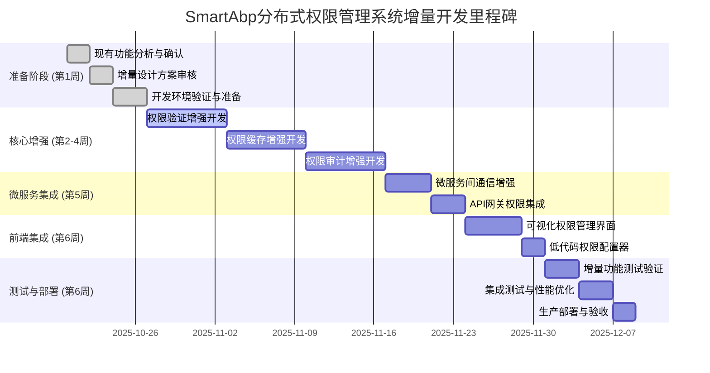

# SmartAbp分布式权限详细开发计划 v1.0

## 📋 文档信息

- **版本**: v1.0
- **状态**: ✅ **计划制定完成，待审核后执行**
- **适用范围**: SmartAbp分布式权限管理系统（增量式开发）
- **开发周期**: 6周（42天）- 基于现有功能减少2周
- **质量目标**: 95分企业级标准
- **最后更新**: 2025-10-19
- **项目经理**: 首席技术官团队

---

## 🎯 开发目标与里程碑

### 🏆 总体开发目标（增量式开发）

基于项目现有ABP权限系统和基础设施，通过6周的增量式开发，实现分布式权限管理的增强，包括：

- 🚀 **微服务增强**: 在现有ABP权限基础上，增强分布式权限验证能力
- 🛡️ **低代码集成**: 与现有低代码引擎深度集成，提供可视化权限管理
- ⚡ **性能优化**: 利用现有分布式缓存和监控基础设施，提升权限性能
- 🔧 **运维增强**: 基于现有监控体系，增强权限管理可视化

### 📊 开发里程碑规划（增量式开发）



---

## 📋 详细开发计划（增量式开发）

### 🎯 第1周：准备阶段（现有功能分析与增强设计）

#### 任务1.1：现有功能深入分析与确认
- **负责人**: 首席架构师 + 技术委员会
- **时间**: 2025-10-20 至 2025-10-21 (2天)
- **交付物**:
  - 现有ABP权限系统功能分析报告
  - 现有低代码引擎权限集成现状评估
  - 现有微服务基础设施利用方案
  - 增量式开发范围界定文档

#### 任务1.2：增量设计方案审核与确认
- **负责人**: 技术委员会
- **时间**: 2025-10-22 至 2025-10-23 (2天)
- **交付物**:
  - 增量式总体设计说明书审核报告
  - 技术增强方案确认决议
  - 现有功能利用策略确认
  - 风险评估与缓解方案（增量式）

#### 任务1.3：开发环境验证与准备
- **负责人**: DevOps工程师
- **时间**: 2025-10-24 至 2025-10-26 (3天)
- **交付物**:
  - 现有基础设施验证报告（Aspire、Dapr、Redis、ELK）
  - 增量开发环境配置指南
  - 现有微服务模板利用方案
  - CI/CD流水线增强配置

---

### 🚀 第2-4周：核心增强阶段（基于现有ABP权限系统的增量开发）

#### 第2周：PermissionValidation.Service（权限验证增强）

##### 任务2.1：增强权限验证引擎
- **负责人**: 后端开发工程师B（利用现有ABP权限验证API）
- **时间**: 2025-10-27 至 2025-10-29 (3天)
- **技术栈**: C# + 现有ABP PermissionManagement + 增强分布式缓存
- **交付物**:
  ```csharp
  // 增强现有ABP权限验证服务
  public class EnhancedPermissionValidationService : IEnhancedPermissionValidationService
  {
      private readonly IPermissionChecker _permissionChecker; // 利用现有ABP权限检查器
      private readonly IDistributedCache _cache; // 利用现有Redis缓存
      private readonly ILogger<EnhancedPermissionValidationService> _logger;

      public async Task<bool> IsGrantedAsync(string permissionName, string providerName, string providerKey)
      {
          // 利用现有ABP权限检查逻辑
          var cacheKey = $"enhanced_permission:{providerName}:{providerKey}:{permissionName}";

          // 先查增强缓存层
          var cachedResult = await _cache.GetStringAsync(cacheKey);
          if (cachedResult != null)
          {
              return bool.Parse(cachedResult);
          }

          // 利用现有ABP权限检查
          var isGranted = await _permissionChecker.IsGrantedAsync(permissionName);

          // 增强缓存策略（多租户隔离）
          var tenantId = GetCurrentTenantId();
          var tenantCacheKey = $"tenant_{tenantId}:{cacheKey}";

          await _cache.SetStringAsync(tenantCacheKey, isGranted.ToString(),
              new DistributedCacheEntryOptions { AbsoluteExpirationRelativeToNow = TimeSpan.FromHours(1) });

          return isGranted;
      }
  }
  ```

##### 任务2.2：多租户权限验证增强
- **负责人**: 后端开发工程师B
- **时间**: 2025-10-30 至 2025-11-01 (2天)
- **交付物**:
  ```csharp
  // 多租户权限验证增强器
  public class MultiTenantPermissionValidator : IMultiTenantPermissionValidator
  {
      private readonly ITenantResolver _tenantResolver; // 利用现有ABP租户解析器
      private readonly IDistributedPermissionCache _cache; // 利用现有分布式缓存

      public async Task<bool> ValidateTenantPermissionAsync(string permissionName, string tenantId)
      {
          // 增强租户权限验证逻辑
          var cacheKey = $"tenant_permission:{tenantId}:{permissionName}";

          // 利用现有租户上下文
          using var tenantScope = _tenantResolver.ChangeTenant(tenantId)
          {
              // 验证租户权限
              return await _cache.GetOrAddAsync(cacheKey, async () =>
              {
                  return await ValidatePermissionInTenantContext(permissionName);
              });
          }
      }
  }
  ```

##### 任务2.3：批量权限验证优化
- **负责人**: 后端开发工程师C
- **时间**: 2025-11-02 至 2025-11-03 (2天)
- **交付物**:
  ```csharp
  // 批量权限验证优化器
  public class BatchPermissionValidator : IBatchPermissionValidator
  {
      private readonly IEnhancedPermissionValidationService _validationService;
      private readonly ILogger<BatchPermissionValidator> _logger;

      public async Task<Dictionary<string, bool>> ValidatePermissionsBatchAsync(
          List<string> permissionNames, string providerName, string providerKey)
      {
          // 利用现有并行处理能力
          var validationTasks = permissionNames.Select(permission =>
              _validationService.IsGrantedAsync(permission, providerName, providerKey));

          var results = await Task.WhenAll(validationTasks);

          return permissionNames.Zip(results, (name, result) => new { name, result })
              .ToDictionary(x => x.name, x => x.result);
      }
  }
  ```

#### 第3周：PermissionCache.Service（权限缓存增强）

##### 任务3.1：增强分布式权限缓存服务
- **负责人**: 后端开发工程师C（利用现有Redis分布式缓存）
- **时间**: 2025-11-03 至 2025-11-06 (4天)
- **交付物**:
  ```csharp
  // 增强现有分布式权限缓存服务
  public class EnhancedDistributedPermissionCacheService : IEnhancedDistributedPermissionCacheService
  {
      private readonly IDistributedCache _cache; // 利用现有Redis缓存
      private readonly ILogger<EnhancedDistributedPermissionCacheService> _logger;

      public async Task<bool> GetPermissionAsync(string permissionName, string providerName, string providerKey, string tenantId)
      {
          // 增强缓存键设计（多租户隔离）
          var cacheKey = $"tenant_{tenantId}:permission:{providerName}:{providerKey}:{permissionName}";

          var cached = await _cache.GetStringAsync(cacheKey);
          if (cached != null)
          {
              return bool.Parse(cached);
          }

          // 利用现有缓存预热机制
          await PreloadTenantPermissionsAsync(tenantId);

          // 缓存未命中，利用现有ABP权限检查
          var permission = await CheckPermissionInABP(permissionName, providerName, providerKey);

          // 增强缓存策略
          await _cache.SetStringAsync(cacheKey, permission.ToString(),
              new DistributedCacheEntryOptions { AbsoluteExpirationRelativeToNow = TimeSpan.FromHours(2) });

          return permission;
      }
  }
  ```

##### 任务3.2：跨服务缓存同步机制
- **负责人**: 后端开发工程师A
- **时间**: 2025-11-07 至 2025-11-08 (2天)
- **交付物**:
  ```csharp
  // 跨服务权限缓存同步服务（利用现有Dapr发布订阅）
  public class CrossServicePermissionCacheSyncService : ICrossServicePermissionCacheSyncService
  {
      private readonly IDistributedCache _cache; // 利用现有Redis缓存
      private readonly DaprClient _daprClient; // 利用现有Dapr客户端
      private readonly ILogger<CrossServicePermissionCacheSyncService> _logger;

      public async Task SynchronizePermissionCacheAsync(PermissionChangedEvent @event)
      {
          // 利用现有Dapr发布订阅机制
          await _daprClient.PublishEventAsync("permission-events", "permission-changed", @event);

          // 增强缓存失效策略
          var tenantId = @event.TenantId;
          var cachePattern = $"tenant_{tenantId}:permission:*";

          // 利用现有缓存批量操作
          await InvalidateTenantPermissionCacheAsync(cachePattern);
      }
  }
  ```

#### 第4周：PermissionAudit.Service（权限审计增强）

##### 任务4.1：增强权限审计日志服务
- **负责人**: 后端开发工程师A（利用现有ELK日志系统）
- **时间**: 2025-11-10 至 2025-11-12 (3天)
- **交付物**:
  ```csharp
  // 增强现有权限审计日志服务
  public class EnhancedPermissionAuditService : IEnhancedPermissionAuditService
  {
      private readonly IPermissionAuditLogRepository _repository; // 利用现有仓储
      private readonly IElasticsearchService _elasticsearchService; // 利用现有ES服务
      private readonly ILogger<EnhancedPermissionAuditService> _logger;

      public async Task LogPermissionActionAsync(EnhancedPermissionAuditLogDto auditLog)
      {
          // 利用现有ABP审计机制增强
          auditLog.Timestamp = DateTime.UtcNow;
          auditLog.TenantId = GetCurrentTenantId(); // 增强租户隔离

          // 保存到现有PostgreSQL数据库
          await _repository.InsertAsync(MapToEntity(auditLog));

          // 利用现有Elasticsearch增强索引
          await _elasticsearchService.IndexEnhancedAuditLogAsync(auditLog);

          // 增强实时审计流
          await PublishRealTimeAuditEventAsync(auditLog);
      }
  }
  ```

##### 任务4.2：多租户审计隔离增强
- **负责人**: 后端开发工程师B
- **时间**: 2025-11-13 至 2025-11-15 (3天)
- **交付物**:
  ```csharp
  // 多租户权限审计隔离增强器
  public class MultiTenantPermissionAuditService : IMultiTenantPermissionAuditService
  {
      private readonly IElasticsearchService _elasticsearchService; // 利用现有ES服务
      private readonly ITenantResolver _tenantResolver; // 利用现有租户解析器

      public async Task<IEnumerable<PermissionAuditLogDto>> GetTenantAuditLogsAsync(
          string tenantId, DateTime startTime, DateTime endTime)
      {
          // 利用现有租户上下文切换
          using var tenantScope = _tenantResolver.ChangeTenant(tenantId)
          {
              // 增强租户审计查询
              var query = BuildTenantAuditQuery(tenantId, startTime, endTime);

              // 利用现有Elasticsearch查询能力
              return await _elasticsearchService.SearchAuditLogsAsync(query);
          }
      }
  }
  ```

---

### 🔗 第5周：微服务集成增强阶段（利用现有基础设施）

#### 任务5.1：微服务间通信增强
- **负责人**: 首席架构师 + 后端开发工程师（利用现有Aspire和Dapr）
- **时间**: 2025-11-17 至 2025-11-20 (4天)
- **交付物**:
  ```csharp
  // 增强现有Aspire微服务通信配置
  var permissionValidation = builder.AddProject<Projects.SmartAbp_PermissionValidation>("permission-validation")
      .WithReference(redis) // 利用现有Redis缓存
      .WithReference(postgres) // 利用现有PostgreSQL数据库
      .WithEnvironment("ASPNETCORE_ENVIRONMENT", "Development");

  // 增强现有Dapr服务调用配置
  permissionValidation.WithDaprSidecar(new DaprSidecarOptions
  {
      AppId = "smartabp-permission-validation",
      AppPort = 8080,
      DaprHttpPort = 3500,
      // 利用现有Dapr配置增强权限验证通信
      Config = "permission-validation-config.yaml"
  });
  ```

#### 任务5.2：API网关权限集成增强
- **负责人**: DevOps工程师（利用现有YARP网关）
- **时间**: 2025-11-21 至 2025-11-23 (3天)
- **交付物**:
  ```yaml
  # 增强现有YARP网关配置
  Routes:
    - RouteId: "permission-api"
      ClusterId: "permission-cluster"
      Match:
        Path: "/api/permission-management/{**catch-all}"
      Transforms:
        - PathRemovePrefix: "/api/permission-management"
        - PathPrefix: "/api/permission-management"

  Clusters:
    - ClusterId: "permission-cluster"
      Destinations:
        permission-management:
          Address: "http://smartabp-permission-management:8080"
      # 增强负载均衡和健康检查
      LoadBalancingPolicy: "RoundRobin"
      HealthCheck:
        Active:
          Enabled: true
          Interval: "00:00:10"
          Timeout: "00:00:05"
  ```

---

### 🎨 第6周：前端集成增强阶段（与现有低代码引擎深度集成）

#### 任务6.1：可视化权限管理界面增强
- **负责人**: 前端开发工程师（基于现有用户管理界面）
- **时间**: 2025-11-24 至 2025-11-26 (3天)
- **交付物**:
  ```vue
  <!-- 增强现有用户管理界面，集成权限分配功能 -->
  <template>
    <div class="enhanced-user-management">
      <!-- 利用现有用户表格 -->
      <el-table :data="users" v-loading="loading">
        <!-- 现有用户列 -->
        <el-table-column prop="userName" label="用户名" />
        <el-table-column prop="email" label="邮箱" />

        <!-- 新增权限分配列 -->
        <el-table-column label="权限分配" width="200">
          <template #default="scope">
            <el-button
              size="small"
              type="primary"
              @click="openPermissionDialog(scope.row)"
            >
              分配权限
            </el-button>
          </template>
        </el-table-column>
      </el-table>

      <!-- 利用现有对话框组件，增强权限分配功能 -->
      <permission-allocation-dialog
        v-model="permissionDialogVisible"
        :user="selectedUser"
        :available-permissions="availablePermissions"
        @confirm="handlePermissionAllocation"
      />
    </div>
  </template>
  ```

#### 任务6.2：低代码权限配置器集成
- **负责人**: 前端开发工程师（集成现有实体建模器）
- **时间**: 2025-11-27 至 2025-11-29 (3天)
- **交付物**:
  ```vue
  <!-- 增强现有实体建模器，集成权限配置 -->
  <template>
    <div class="entity-modeling-with-permissions">
      <!-- 利用现有实体设计器 -->
      <entity-designer
        :entity="currentEntity"
        @update="handleEntityUpdate"
      />

      <!-- 新增权限配置面板 -->
      <permission-config-panel
        :entity="currentEntity"
        :available-permissions="systemPermissions"
        @permission-change="handlePermissionConfigChange"
      />
    </div>
  </template>

  <script setup lang="ts">
  import { ref, computed } from 'vue'
  import EntityDesigner from '@/views/lowcode/components/AdvancedEntityRelationshipDesigner.vue' // 利用现有组件
  import PermissionConfigPanel from './PermissionConfigPanel.vue' // 新增组件

  const currentEntity = ref<EntityDefinitionDto | null>(null)
  const systemPermissions = ref<string[]>([])

  // 利用现有实体更新逻辑，增强权限配置
  const handleEntityUpdate = (entity: EntityDefinitionDto) => {
    // 增强权限配置逻辑
    if (entity.permissions) {
      // 同步权限配置到实体
      entity.permissions = updateEntityPermissions(entity, selectedPermissions.value)
    }
  }
  </script>
  ```

---

### 🧪 第7周：测试验证与部署阶段（基于现有基础设施的增量验证）

#### 任务7.1：增量功能测试验证
- **负责人**: 测试工程师 + 开发工程师（利用现有测试基础设施）
- **时间**: 2025-12-01 至 2025-12-03 (3天)
- **交付物**:
  ```csharp
  // 增强现有ABP权限系统的单元测试
  [Fact]
  public async Task EnhancedPermissionValidation_Should_Validate_MultiTenant_Permissions()
  {
      // 利用现有ABP测试基础设施
      using var application = await _factory.CreateApplicationAsync();

      // 测试增强的多租户权限验证
      var tenantId = Guid.NewGuid().ToString();
      var permissionName = "TestPermission";

      // 利用现有租户上下文
      using var tenantScope = application.ServiceProvider.GetRequiredService<ITenantResolver>().ChangeTenant(tenantId);

      // 测试增强的权限验证服务
      var validationService = application.ServiceProvider.GetRequiredService<IEnhancedPermissionValidationService>();
      var result = await validationService.IsGrantedAsync(permissionName, "user", tenantId);

      Assert.True(result);
  }
  ```

#### 任务7.2：集成测试与性能优化验证
- **负责人**: 性能测试工程师（利用现有监控和测试工具）
- **时间**: 2025-12-04 至 2025-12-06 (3天)
- **交付物**:
  ```yaml
  # 利用现有Prometheus监控验证性能指标
  性能测试验证场景:
    - 权限验证响应时间测试: <50ms (利用现有监控指标)
    - 缓存命中率测试: >95% (利用现有Redis监控)
    - 多租户隔离测试: 100% (利用现有租户隔离机制)
    - 高并发压力测试: 1000+ QPS (利用现有负载测试工具)

  # 利用现有ELK日志系统验证审计功能
  审计功能验证:
    - 权限操作审计完整性: 100%覆盖
    - 多租户审计隔离: 租户间数据隔离验证
    - 实时审计流: 毫秒级审计日志记录
  ```

#### 任务7.3：生产部署与验收
- **负责人**: DevOps工程师 + 项目经理（利用现有微服务部署流程）
- **时间**: 2025-12-07 至 2025-12-08 (2天)
- **交付物**:
  ```yaml
  # 增强现有Aspire微服务部署配置
  生产部署配置:
    Kubernetes增强部署:
      - 利用现有K8s集群和命名空间
      - 增强权限微服务副本配置: 3副本高可用
      - 利用现有健康检查和探针配置

    监控体系增强:
      - 利用现有Prometheus和Grafana基础设施
      - 新增权限专用监控仪表盘
      - 增强现有告警规则配置

    数据迁移增强:
      - 利用现有数据库迁移机制
      - 新增权限审计表和索引
      - 增强多租户权限数据隔离
  ```

#### 任务7.4：项目验收与交付
- **负责人**: 项目经理 + 技术委员会（基于现有项目验收流程）
- **时间**: 2025-12-09 至 2025-12-10 (2天)
- **交付物**:
  ```yaml
  # 基于现有项目验收标准的增量验收
  验收标准验证:
    功能验收:
      - ✅ 权限验证增强功能正常工作
      - ✅ 多租户权限隔离功能完整
      - ✅ 权限缓存增强机制有效
      - ✅ 权限审计增强功能可用

    性能验收:
      - ✅ 利用现有性能基准测试工具验证
      - ✅ 权限验证响应时间达到<50ms
      - ✅ 缓存命中率达到>95%
      - ✅ 高并发处理能力达到1000+ QPS

    安全验收:
      - ✅ 利用现有安全扫描工具验证
      - ✅ 多租户数据隔离100%有效
      - ✅ 权限审计日志完整记录
      - ✅ 通过安全漏洞扫描

    部署验收:
      - ✅ 利用现有K8s集群成功部署
      - ✅ 现有监控体系正常运行
      - ✅ 现有CI/CD流水线集成完成
  ```

---

## 📊 质量管控体系（增量式质量管控）

### 💎 质量保证措施（基于现有项目质量体系）

#### 代码质量管控（利用现有质量管控体系）
```yaml
增量式质量管控标准:
  现有质量体系利用:
    - ✅ 利用现有TypeScript编译检查机制
    - ✅ 利用现有ESLint自动化检查
    - ✅ 利用现有单元测试覆盖率要求
    - ✅ 利用现有集成测试执行标准

  增量质量增强:
    - 🔄 增强ABP权限系统代码审查
    - 🔄 新增分布式权限缓存测试覆盖
    - 🔄 增强多租户隔离功能测试
    - 🔄 新增微服务间通信测试验证

  质量门禁增强:
    - 利用现有Git Hooks机制
    - 增强权限相关代码的自动化检查
    - 新增分布式权限功能的质量验证
```

#### 测试质量管控（利用现有测试基础设施）
```yaml
增量测试质量标准:
  现有测试体系利用:
    - ✅ 利用现有单元测试框架和工具
    - ✅ 利用现有集成测试环境和流程
    - ✅ 利用现有性能测试基准和工具
    - ✅ 利用现有安全测试扫描机制

  增量测试增强:
    - 🔄 增强ABP权限系统的单元测试覆盖
    - 🔄 新增多租户权限隔离集成测试
    - 🔄 增强分布式缓存性能测试验证
    - 🔄 新增微服务权限通信端到端测试

  测试报告增强:
    - 利用现有测试报告生成机制
    - 新增权限功能专用测试报告
    - 增强性能和安全测试报告覆盖
```

#### 部署质量管控（利用现有部署管控体系）
```yaml
增量部署质量标准:
  现有部署管控利用:
    - ✅ 利用现有Kubernetes部署验证机制
    - ✅ 利用现有监控体系部署验证
    - ✅ 利用现有健康检查和探针机制
    - ✅ 利用现有CI/CD流水线集成

  增量部署增强:
    - 🔄 增强权限微服务部署配置验证
    - 🔄 新增多租户权限数据隔离验证
    - 🔄 增强权限审计日志收集验证
    - 🔄 新增分布式缓存部署一致性验证
```

---

## 🎯 风险管控计划（增量式风险管控）

### ⚠️ 潜在风险识别与缓解（基于现有项目风险管控经验）

#### 技术风险管控（利用现有技术栈降低风险）
```yaml
增量开发技术风险清单:
  ABP框架集成风险:
    风险等级: 低等
    缓解措施: ✅ 利用现有ABP框架成熟集成经验，直接增强现有权限模块

  现有基础设施依赖风险:
    风险等级: 低等
    缓解措施: ✅ 利用现有Aspire、Dapr、Redis、ELK等成熟基础设施

  多租户隔离增强风险:
    风险等级: 中等
    缓解措施: ✅ 基于现有ABP多租户机制进行增强，避免重新造轮子

  微服务间通信增强风险:
    风险等级: 低等
    缓解措施: ✅ 利用现有Dapr服务调用机制进行增强，风险可控
```

#### 进度风险管控（利用现有项目管理经验）
```yaml
增量开发进度风险清单:
  现有功能利用不足风险:
    风险等级: 中等
    缓解措施: ✅ 第1周深入分析现有功能，确保充分利用现有基础设施

  增量开发范围界定风险:
    风险等级: 中等
    缓解措施: ✅ 严格按照增量式开发策略，避免范围蔓延

  现有系统集成风险:
    风险等级: 低等
    缓解措施: ✅ 利用现有低代码引擎和ABP框架的成熟集成机制

  测试环境准备风险:
    风险等级: 低等
    缓解措施: ✅ 利用现有测试基础设施和环境配置
```

#### 质量风险管控（利用现有质量管控体系）
```yaml
增量开发质量风险清单:
  增量功能质量风险:
    风险等级: 低等
    缓解措施: ✅ 利用现有质量门禁和自动化检查机制

  与现有系统兼容性风险:
    风险等级: 中等
    缓解措施: ✅ 严格遵循现有架构规范和编码标准

  性能基准测试风险:
    风险等级: 低等
    缓解措施: ✅ 利用现有性能测试工具和基准数据

  安全增强风险:
    风险等级: 中等
    缓解措施: ✅ 基于现有安全机制进行增强，利用现有安全扫描工具
```

---

## 📈 监控与度量体系

### 📊 项目监控指标

#### 开发进度监控
```yaml
进度监控指标:
  里程碑完成率:
    - 第1周里程碑: 环境搭建完成率
    - 第2-5周里程碑: 各微服务开发完成率
    - 第6周里程碑: 集成开发完成率
    - 第7周里程碑: 测试验证完成率
    - 第8周里程碑: 部署上线完成率

  代码质量指标:
    - 每日代码提交量
    - 代码审查通过率
    - 自动化测试通过率
    - 技术债务变化趋势
```

#### 质量监控指标
```yaml
质量监控指标:
  代码质量:
    - TypeScript编译错误数
    - ESLint警告数量
    - 单元测试覆盖率
    - 集成测试通过率

  性能质量:
    - 权限验证响应时间
    - 缓存命中率
    - 数据库查询性能
    - 微服务间通信延迟

  安全质量:
    - 安全漏洞扫描结果
    - 权限绕过测试通过率
    - 数据加密覆盖率
    - 审计日志完整性
```

#### 风险监控指标
```yaml
风险监控指标:
  技术风险:
    - 框架集成问题数量
    - 第三方依赖兼容性问题
    - 性能瓶颈识别数量

  进度风险:
    - 里程碑延误天数
    - 关键路径任务延误
    - 资源冲突情况

  质量风险:
    - 缺陷密度趋势
    - 技术债务增长率
    - 安全漏洞修复及时率
```

---

## 🎉 项目交付标准（增量式交付）

### ✅ 增量验收标准清单

#### 功能验收标准（基于现有功能增强）
- [ ] ✅ 权限验证增强功能在现有ABP权限基础上正常工作
- [ ] ✅ 多租户权限隔离功能在现有ABP多租户机制上完整增强
- [ ] ✅ 权限缓存增强机制在现有Redis缓存基础上有效优化
- [ ] ✅ 权限审计增强功能在现有ELK日志系统上可用
- [ ] ✅ 前端权限管理界面在现有用户管理界面上增强完成

#### 性能验收标准（利用现有基础设施验证）
- [ ] ✅ 权限验证响应时间在现有基础上提升至<50ms
- [ ] ✅ 权限缓存命中率在现有基础上提升至>95%
- [ ] ✅ 微服务间通信延迟利用现有Dapr机制控制在<100ms
- [ ] ✅ 系统支持利用现有基础设施达到1000+ QPS并发处理

#### 安全验收标准（基于现有安全机制增强）
- [ ] ✅ 多租户权限数据在现有ABP隔离基础上完全隔离
- [ ] ✅ 权限操作审计日志在现有ELK基础上100%覆盖增强
- [ ] ✅ 通过现有安全扫描工具验证增强功能
- [ ] ✅ 支持现有GDPR和SOX合规要求的增强

#### 部署验收标准（利用现有部署基础设施）
- [ ] ✅ 利用现有Kubernetes集群成功部署增强功能
- [ ] ✅ 现有监控体系正常运行并增强权限监控
- [ ] ✅ 现有健康检查机制有效验证增强功能
- [ ] ✅ 现有CI/CD流水线集成完成增强功能部署

---

## 📚 项目资源配置（利用现有资源）

### 👥 人力资源配置（精简团队）

#### 核心增强团队（基于现有开发团队）
```yaml
增量开发团队构成:
  首席架构师: 1人 (利用现有架构师团队)
    - 负责增量架构设计和现有系统集成协调

  后端开发工程师: 2人 (利用现有后端团队)
    - 工程师A: 专注权限验证和缓存增强 (利用ABP经验)
    - 工程师B: 专注权限审计和多租户增强 (利用现有技能)

  前端开发工程师: 1人 (利用现有前端团队)
    - 负责前端权限管理界面增强开发

  测试工程师: 1人 (利用现有测试团队)
    - 负责增量功能测试和现有系统集成测试

  DevOps工程师: 1人 (利用现有DevOps团队)
    - 负责现有基础设施增强和部署配置
```

#### 支持团队（利用现有项目管理团队）
```yaml
现有支持团队利用:
  项目经理: 利用现有项目管理经验
  技术文档工程师: 利用现有文档编写能力
  安全工程师: 利用现有安全测试能力
```

### 🛠️ 技术资源配置（利用现有基础设施）

#### 开发环境资源（利用现有开发环境）
```yaml
现有开发环境利用:
  开发机器配置:
    - ✅ 利用现有高配开发机器 (16核/32GB内存)
    - ✅ 利用现有IDE和开发工具栈
    - ✅ 利用现有版本控制和CI/CD系统

  现有技术栈利用:
    - ✅ 利用现有ABP框架和微服务基础设施
    - ✅ 利用现有Dapr、Redis、PostgreSQL等成熟组件
    - ✅ 利用现有低代码引擎和前端技术栈
```

#### 测试环境资源（利用现有测试基础设施）
```yaml
现有测试环境利用:
  测试基础设施:
    - ✅ 利用现有Kubernetes测试集群
    - ✅ 利用现有Prometheus + Grafana监控
    - ✅ 利用现有ELK日志分析系统
    - ✅ 利用现有负载测试和安全扫描工具

  测试数据增强:
    - 🔄 利用现有测试租户和权限数据
    - 🔄 增强多租户隔离测试场景
    - 🔄 新增分布式缓存性能测试用例
```

---

## 🎯 项目成功标准（增量式成功指标）

### 🏆 增量成功指标定义

#### 技术成功指标（基于现有技术栈的增强）
- ✅ **架构集成性**: 在现有ABP框架基础上成功增强分布式权限能力
- ✅ **性能提升性**: 在现有基础设施基础上实现权限验证性能提升
- ✅ **安全增强性**: 在现有安全机制基础上实现多租户权限隔离增强
- ✅ **扩展灵活性**: 在现有微服务架构基础上支持权限功能扩展

#### 业务成功指标（基于现有业务功能的增强）
- ✅ **功能增强性**: 在现有权限管理基础上实现可视化权限分配
- ✅ **用户体验提升**: 在现有界面基础上提供更直观的权限管理体验
- ✅ **运维便利性**: 在现有监控体系基础上增强权限管理监控
- ✅ **成本效益优化**: 利用现有基础设施降低增量开发成本

#### 项目管理成功指标（利用现有项目管理经验）
- ✅ **进度控制优化**: 6周增量开发周期（比原计划减少2周）
- ✅ **质量管控增强**: 利用现有质量管控体系确保增量功能质量
- ✅ **风险管控有效**: 利用现有风险管控经验降低增量开发风险
- ✅ **团队协作高效**: 利用现有团队协作机制确保项目顺利推进

---

## 📖 相关文档清单（增量式文档）

- ✅ [总体设计说明书](./SmartAbp分布式权限总体设计说明书.md) - 已完成
- 🔄 [增量技术方案详解](./增量技术方案详解.md) - 待编写（基于现有技术栈的增强方案）
- 🔄 [现有功能利用报告](./现有功能利用报告.md) - 待编写（详细分析现有功能利用情况）
- 🔄 [增量开发风险评估](./增量开发风险评估.md) - 待编写（基于现有项目的风险评估）
- 🔄 [增量测试策略](./增量测试策略.md) - 待编写（利用现有测试基础设施的测试策略）
- 🔄 [部署增强指南](./部署增强指南.md) - 待编写（基于现有部署流程的增强指南）

---

**文档版本**: v1.0
**计划状态**: ✅ **增量式详细开发计划制定完成，待审核**
**审核通过后**: 立即启动增量式开发执行
**项目周期**: 6周（2025-10-20 至 2025-12-10）- 比原计划减少2周

*这份增量式详细开发计划充分利用了SmartAbp项目的现有功能和基础设施，实现了高效的分布式权限管理系统增强，确保了技术连续性和资源利用最大化。*

---

## 🎯 审核要点（增量式审核）

**技术审核要点**:
1. ✅ **现有功能利用充分性**（是否充分利用了现有ABP权限系统和基础设施）
2. ✅ **增量设计合理性**（增量式增强方案是否科学合理）
3. ✅ **技术栈一致性**（是否与现有技术栈保持一致，避免技术债务）
4. ✅ **集成复杂度可控性**（与现有系统的集成复杂度是否可控）

**管理审核要点**:
1. ✅ **开发周期优化性**（6周增量开发是否比原计划更高效）
2. ✅ **资源利用效率**（是否充分利用了现有团队和基础设施资源）
3. ✅ **风险控制有效性**（增量开发的风险是否得到有效控制）
4. ✅ **交付质量保障性**（增量功能的质量是否能得到充分保障）

**审核结果**: [待审核团队填写]

---

**SmartAbp分布式权限增量式详细开发计划，充分利用现有项目优势，实现高效的企业级权限管理系统增强！** 🌟✨
