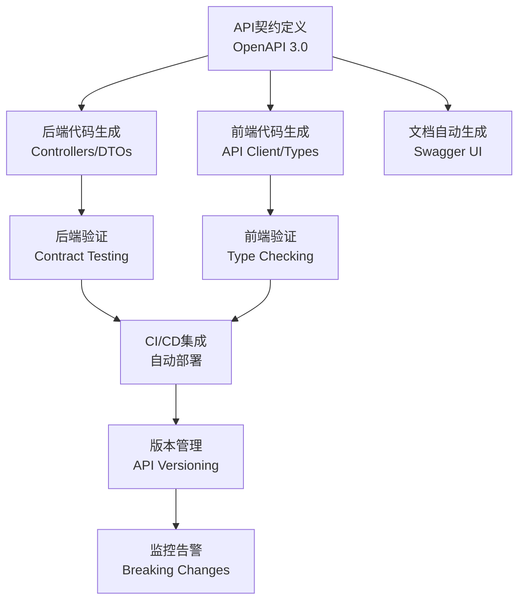

# 前后端代码自动生成架构优化方案

## 📋 现有架构分析

### 前端现状分析
```typescript
// 当前前端架构问题：
❌ API调用分散，缺乏统一规范
❌ 类型定义重复，维护困难  
❌ 手工编写API客户端代码
❌ 错误处理不统一
❌ 缺乏API版本管理
❌ 文档与代码不同步
```

### 后端现状分析
```csharp
// 当前后端架构问题：
❌ API文档需要手工维护
❌ 前端类型定义与后端模型不同步
❌ 缺乏统一的响应格式
❌ 版本管理机制不完善
❌ API变更影响前端开发效率
```

## 🚀 代码自动生成架构优化方案

### 架构升级核心目标
1. **契约优先设计** - API契约驱动开发
2. **类型安全保证** - 前后端类型完全同步
3. **自动代码生成** - 减少90%重复代码编写
4. **文档自动更新** - API文档与代码100%同步
5. **版本无缝管理** - 支持多版本API并存

## 📐 架构设计蓝图

### 整体架构流程


## 🔧 技术实施方案

### 1. API契约优先设计

#### 1.1 OpenAPI 3.0 规范定义
```yaml
# api-contracts/smartabp-api.yaml
openapi: 3.0.3
info:
  title: SmartAbp API
  version: 1.0.0
  description: 智能工地管理系统API
  contact:
    name: API支持
    email: support@smartabp.com
  license:
    name: MIT
    url: https://opensource.org/licenses/MIT

servers:
  - url: https://api.smartabp.com/v1
    description: 生产环境
  - url: https://api-staging.smartabp.com/v1
    description: 测试环境
  - url: http://localhost:5000/v1
    description: 开发环境

# 统一响应格式
components:
  schemas:
    ApiResponse:
      type: object
      required:
        - success
        - timestamp
        - traceId
      properties:
        success:
          type: boolean
          description: 请求是否成功
        data:
          description: 响应数据
        message:
          type: string
          description: 响应消息
        code:
          type: string
          description: 业务错误码
        timestamp:
          type: string
          format: date-time
          description: 响应时间戳
        traceId:
          type: string
          description: 链路追踪ID
        pagination:
          $ref: '#/components/schemas/PaginationInfo'
        
    PaginationInfo:
      type: object
      properties:
        page:
          type: integer
          minimum: 1
          description: 当前页码
        pageSize:
          type: integer
          minimum: 1
          maximum: 100
          description: 每页大小
        total:
          type: integer
          minimum: 0
          description: 总记录数
        totalPages:
          type: integer
          minimum: 0
          description: 总页数
        hasNext:
          type: boolean
          description: 是否有下一页
        hasPrevious:
          type: boolean
          description: 是否有上一页

    # 用户相关模型
    User:
      type: object
      required:
        - id
        - name
        - email
        - status
        - createdAt
        - updatedAt
      properties:
        id:
          type: string
          format: uuid
          description: 用户ID
        name:
          type: string
          minLength: 1
          maxLength: 100
          description: 用户姓名
        email:
          type: string
          format: email
          description: 邮箱地址
        phone:
          type: string
          pattern: '^1[3-9]\d{9}$'
          description: 手机号码
        avatar:
          type: string
          format: uri
          description: 头像URL
        status:
          type: string
          enum: [active, inactive, pending]
          description: 用户状态
        roles:
          type: array
          items:
            type: string
          description: 用户角色
        lastLoginAt:
          type: string
          format: date-time
          description: 最后登录时间
        createdAt:
          type: string
          format: date-time
          description: 创建时间
        updatedAt:
          type: string
          format: date-time
          description: 更新时间
        metadata:
          type: object
          additionalProperties: true
          description: 扩展信息

    CreateUserRequest:
      type: object
      required:
        - name
        - email
        - password
      properties:
        name:
          type: string
          minLength: 1
          maxLength: 100
          description: 用户姓名
        email:
          type: string
          format: email
          description: 邮箱地址
        phone:
          type: string
          pattern: '^1[3-9]\d{9}$'
          description: 手机号码
        password:
          type: string
          minLength: 8
          maxLength: 50
          description: 密码
        roles:
          type: array
          items:
            type: string
          description: 用户角色
        metadata:
          type: object
          additionalProperties: true
          description: 扩展信息

    UpdateUserRequest:
      type: object
      properties:
        name:
          type: string
          minLength: 1
          maxLength: 100
          description: 用户姓名
        phone:
          type: string
          pattern: '^1[3-9]\d{9}$'
          description: 手机号码
        avatar:
          type: string
          format: uri
          description: 头像URL
        status:
          type: string
          enum: [active, inactive, pending]
          description: 用户状态
        roles:
          type: array
          items:
            type: string
          description: 用户角色
        metadata:
          type: object
          additionalProperties: true
          description: 扩展信息

# API路径定义
paths:
  /users:
    get:
      summary: 获取用户列表
      description: 分页获取用户列表，支持筛选和排序
      operationId: getUsers
      tags: [Users]
      parameters:
        - name: page
          in: query
          schema:
            type: integer
            minimum: 1
            default: 1
          description: 页码
        - name: pageSize
          in: query
          schema:
            type: integer
            minimum: 1
            maximum: 100
            default: 20
          description: 每页大小
        - name: search
          in: query
          schema:
            type: string
          description: 搜索关键词
        - name: status
          in: query
          schema:
            type: string
            enum: [active, inactive, pending]
          description: 用户状态筛选
        - name: sortBy
          in: query
          schema:
            type: string
            enum: [name, email, createdAt, updatedAt]
            default: createdAt
          description: 排序字段
        - name: sortOrder
          in: query
          schema:
            type: string
            enum: [asc, desc]
            default: desc
          description: 排序方向
      responses:
        200:
          description: 成功获取用户列表
          content:
            application/json:
              schema:
                allOf:
                  - $ref: '#/components/schemas/ApiResponse'
                  - type: object
                    properties:
                      data:
                        type: array
                        items:
                          $ref: '#/components/schemas/User'
        400:
          $ref: '#/components/responses/BadRequest'
        401:
          $ref: '#/components/responses/Unauthorized'
        403:
          $ref: '#/components/responses/Forbidden'
        500:
          $ref: '#/components/responses/InternalError'

    post:
      summary: 创建新用户
      description: 创建一个新的用户账户
      operationId: createUser
      tags: [Users]
      requestBody:
        required: true
        content:
          application/json:
            schema:
              $ref: '#/components/schemas/CreateUserRequest'
      responses:
        201:
          description: 用户创建成功
          content:
            application/json:
              schema:
                allOf:
                  - $ref: '#/components/schemas/ApiResponse'
                  - type: object
                    properties:
                      data:
                        $ref: '#/components/schemas/User'
        400:
          $ref: '#/components/responses/BadRequest'
        401:
          $ref: '#/components/responses/Unauthorized'
        403:
          $ref: '#/components/responses/Forbidden'
        409:
          $ref: '#/components/responses/Conflict'
        500:
          $ref: '#/components/responses/InternalError'

  /users/{userId}:
    get:
      summary: 获取用户详情
      description: 根据ID获取特定用户的详细信息
      operationId: getUserById
      tags: [Users]
      parameters:
        - name: userId
          in: path
          required: true
          schema:
            type: string
            format: uuid
          description: 用户ID
      responses:
        200:
          description: 成功获取用户信息
          content:
            application/json:
              schema:
                allOf:
                  - $ref: '#/components/schemas/ApiResponse'
                  - type: object
                    properties:
                      data:
                        $ref: '#/components/schemas/User'
        400:
          $ref: '#/components/responses/BadRequest'
        401:
          $ref: '#/components/responses/Unauthorized'
        403:
          $ref: '#/components/responses/Forbidden'
        404:
          $ref: '#/components/responses/NotFound'
        500:
          $ref: '#/components/responses/InternalError'

    put:
      summary: 更新用户信息
      description: 更新指定用户的信息
      operationId: updateUser
      tags: [Users]
      parameters:
        - name: userId
          in: path
          required: true
          schema:
            type: string
            format: uuid
          description: 用户ID
      requestBody:
        required: true
        content:
          application/json:
            schema:
              $ref: '#/components/schemas/UpdateUserRequest'
      responses:
        200:
          description: 用户更新成功
          content:
            application/json:
              schema:
                allOf:
                  - $ref: '#/components/schemas/ApiResponse'
                  - type: object
                    properties:
                      data:
                        $ref: '#/components/schemas/User'
        400:
          $ref: '#/components/responses/BadRequest'
        401:
          $ref: '#/components/responses/Unauthorized'
        403:
          $ref: '#/components/responses/Forbidden'
        404:
          $ref: '#/components/responses/NotFound'
        409:
          $ref: '#/components/responses/Conflict'
        500:
          $ref: '#/components/responses/InternalError'

    delete:
      summary: 删除用户
      description: 软删除指定的用户
      operationId: deleteUser
      tags: [Users]
      parameters:
        - name: userId
          in: path
          required: true
          schema:
            type: string
            format: uuid
          description: 用户ID
      responses:
        204:
          description: 用户删除成功
        400:
          $ref: '#/components/responses/BadRequest'
        401:
          $ref: '#/components/responses/Unauthorized'
        403:
          $ref: '#/components/responses/Forbidden'
        404:
          $ref: '#/components/responses/NotFound'
        500:
          $ref: '#/components/responses/InternalError'

# 通用错误响应
components:
  responses:
    BadRequest:
      description: 请求参数错误
      content:
        application/json:
          schema:
            allOf:
              - $ref: '#/components/schemas/ApiResponse'
              - type: object
                properties:
                  success:
                    example: false
                  code:
                    example: "BAD_REQUEST"
                  message:
                    example: "请求参数验证失败"
                  data:
                    type: object
                    properties:
                      errors:
                        type: array
                        items:
                          type: object
                          properties:
                            field:
                              type: string
                            message:
                              type: string
                            code:
                              type: string
    
    Unauthorized:
      description: 未授权访问
      content:
        application/json:
          schema:
            allOf:
              - $ref: '#/components/schemas/ApiResponse'
              - type: object
                properties:
                  success:
                    example: false
                  code:
                    example: "UNAUTHORIZED"
                  message:
                    example: "请先登录后再访问"

    Forbidden:
      description: 权限不足
      content:
        application/json:
          schema:
            allOf:
              - $ref: '#/components/schemas/ApiResponse'
              - type: object
                properties:
                  success:
                    example: false
                  code:
                    example: "FORBIDDEN"
                  message:
                    example: "没有权限执行此操作"

    NotFound:
      description: 资源不存在
      content:
        application/json:
          schema:
            allOf:
              - $ref: '#/components/schemas/ApiResponse'
              - type: object
                properties:
                  success:
                    example: false
                  code:
                    example: "NOT_FOUND"
                  message:
                    example: "请求的资源不存在"

    Conflict:
      description: 资源冲突
      content:
        application/json:
          schema:
            allOf:
              - $ref: '#/components/schemas/ApiResponse'
              - type: object
                properties:
                  success:
                    example: false
                  code:
                    example: "CONFLICT"
                  message:
                    example: "资源已存在或状态冲突"

    InternalError:
      description: 服务器内部错误
      content:
        application/json:
          schema:
            allOf:
              - $ref: '#/components/schemas/ApiResponse'
              - type: object
                properties:
                  success:
                    example: false
                  code:
                    example: "INTERNAL_ERROR"
                  message:
                    example: "服务器内部错误"

  # 安全方案
  securitySchemes:
    BearerAuth:
      type: http
      scheme: bearer
      bearerFormat: JWT
      description: JWT Token认证

# 全局安全要求
security:
  - BearerAuth: []
```

### 2. 后端代码自动生成

#### 2.1 代码生成配置
```json
// codegen/backend-config.json
{
  "generator": "aspnetcore",
  "version": "3.0.0",
  "config": {
    "packageName": "SmartAbp.Api",
    "packageVersion": "1.0.0",
    "packageCompany": "SmartAbp Inc",
    "packageAuthors": "SmartAbp Team",
    "packageDescription": "SmartAbp API Server",
    "clientPackage": "SmartAbp.Client",
    "packageTitle": "SmartAbp API",
    "targetFramework": "net8.0",
    "sourceFolder": "src/main/csharp",
    "packageGuid": "{12345678-1234-5678-9ABC-123456789ABC}",
    "useCollection": "true",
    "returnICollection": "false",
    "optionalMethodArgument": "true",
    "generatePropertyChanged": "false",
    "nonPublicApi": "false",
    "hideGenerationTimestamp": "true",
    "packageContext": "SmartAbpContext",
    "clientGuid": "{12345678-1234-5678-9ABC-123456789ABD}",
    "generateModels": "true",
    "generateApis": "true",
    "generateSupportingFiles": "true",
    "modelPackage": "SmartAbp.Models",
    "apiPackage": "SmartAbp.Controllers",
    "operationModifier": "public virtual",
    "operationIsAsync": "true",
    "operationResultTask": "true",
    "systemWeb": "false",
    "excludeTests": "false",
    "generateDocumentation": "true",
    "generateExamples": "true"
  },
  "additionalProperties": {
    "validationAttributes": "true",
    "generateSwaggerAnnotations": "true",
    "useModelPrefix": "false",
    "useEnumPrefix": "false",
    "enumNameSuffix": "Enum",
    "enumValueSuffix": "Value",
    "useOneOfDiscriminator": "true",
    "legacyDiscriminatorBehavior": "false",
    "allowUnicodeIdentifiers": "true",
    "prependFormOrBodyParameters": "false"
  }
}
```

#### 2.2 生成的后端代码结构
```csharp
// 自动生成的模型类
// src/SmartAbp.Api/Models/User.cs
namespace SmartAbp.Models
{
    /// <summary>
    /// 用户模型
    /// </summary>
    [System.CodeDom.Compiler.GeneratedCode("OpenAPITools", "1.0.0")]
    public partial class User : IEquatable<User>, IValidatableObject
    {
        /// <summary>
        /// 用户ID
        /// </summary>
        [Required]
        [DataType(DataType.Text)]
        public Guid Id { get; set; }

        /// <summary>
        /// 用户姓名
        /// </summary>
        [Required]
        [StringLength(100, MinimumLength = 1)]
        public string Name { get; set; }

        /// <summary>
        /// 邮箱地址
        /// </summary>
        [Required]
        [EmailAddress]
        public string Email { get; set; }

        /// <summary>
        /// 手机号码
        /// </summary>
        [RegularExpression(@"^1[3-9]\d{9}$")]
        public string Phone { get; set; }

        /// <summary>
        /// 头像URL
        /// </summary>
        [Url]
        public string Avatar { get; set; }

        /// <summary>
        /// 用户状态
        /// </summary>
        [Required]
        public UserStatusEnum Status { get; set; }

        /// <summary>
        /// 用户角色
        /// </summary>
        public List<string> Roles { get; set; } = new List<string>();

        /// <summary>
        /// 最后登录时间
        /// </summary>
        public DateTime? LastLoginAt { get; set; }

        /// <summary>
        /// 创建时间
        /// </summary>
        [Required]
        public DateTime CreatedAt { get; set; }

        /// <summary>
        /// 更新时间
        /// </summary>
        [Required]
        public DateTime UpdatedAt { get; set; }

        /// <summary>
        /// 扩展信息
        /// </summary>
        public Dictionary<string, object> Metadata { get; set; } = new Dictionary<string, object>();

        public bool Equals(User other)
        {
            if (other is null) return false;
            if (ReferenceEquals(this, other)) return true;
            return Id.Equals(other.Id);
        }

        public override bool Equals(object obj) => Equals(obj as User);
        public override int GetHashCode() => Id.GetHashCode();

        public IEnumerable<ValidationResult> Validate(ValidationContext validationContext)
        {
            // 自定义验证逻辑
            yield break;
        }
    }

    /// <summary>
    /// 用户状态枚举
    /// </summary>
    [JsonConverter(typeof(StringEnumConverter))]
    public enum UserStatusEnum
    {
        [EnumMember(Value = "active")]
        Active,
        
        [EnumMember(Value = "inactive")]
        Inactive,
        
        [EnumMember(Value = "pending")]
        Pending
    }
}

// 自动生成的Controller基类
// src/SmartAbp.Api/Controllers/UsersController.cs
namespace SmartAbp.Controllers
{
    /// <summary>
    /// 用户管理API
    /// </summary>
    [ApiController]
    [Route("api/v1/users")]
    [Produces("application/json")]
    [System.CodeDom.Compiler.GeneratedCode("OpenAPITools", "1.0.0")]
    public abstract partial class UsersApiController : ControllerBase
    {
        /// <summary>
        /// 获取用户列表
        /// </summary>
        /// <param name="page">页码</param>
        /// <param name="pageSize">每页大小</param>
        /// <param name="search">搜索关键词</param>
        /// <param name="status">用户状态筛选</param>
        /// <param name="sortBy">排序字段</param>
        /// <param name="sortOrder">排序方向</param>
        /// <param name="cancellationToken">取消令牌</param>
        /// <returns>用户列表</returns>
        [HttpGet]
        [ProducesResponseType(typeof(ApiResponse<List<User>>), 200)]
        [ProducesResponseType(typeof(ApiResponse), 400)]
        [ProducesResponseType(typeof(ApiResponse), 401)]
        [ProducesResponseType(typeof(ApiResponse), 403)]
        [ProducesResponseType(typeof(ApiResponse), 500)]
        public abstract Task<IActionResult> GetUsersAsync(
            [FromQuery] int page = 1,
            [FromQuery] int pageSize = 20,
            [FromQuery] string search = null,
            [FromQuery] UserStatusEnum? status = null,
            [FromQuery] string sortBy = "createdAt",
            [FromQuery] string sortOrder = "desc",
            CancellationToken cancellationToken = default
        );

        /// <summary>
        /// 创建新用户
        /// </summary>
        /// <param name="createUserRequest">创建用户请求</param>
        /// <param name="cancellationToken">取消令牌</param>
        /// <returns>创建的用户信息</returns>
        [HttpPost]
        [ProducesResponseType(typeof(ApiResponse<User>), 201)]
        [ProducesResponseType(typeof(ApiResponse), 400)]
        [ProducesResponseType(typeof(ApiResponse), 401)]
        [ProducesResponseType(typeof(ApiResponse), 403)]
        [ProducesResponseType(typeof(ApiResponse), 409)]
        [ProducesResponseType(typeof(ApiResponse), 500)]
        public abstract Task<IActionResult> CreateUserAsync(
            [FromBody] CreateUserRequest createUserRequest,
            CancellationToken cancellationToken = default
        );

        /// <summary>
        /// 获取用户详情
        /// </summary>
        /// <param name="userId">用户ID</param>
        /// <param name="cancellationToken">取消令牌</param>
        /// <returns>用户详细信息</returns>
        [HttpGet("{userId}")]
        [ProducesResponseType(typeof(ApiResponse<User>), 200)]
        [ProducesResponseType(typeof(ApiResponse), 400)]
        [ProducesResponseType(typeof(ApiResponse), 401)]
        [ProducesResponseType(typeof(ApiResponse), 403)]
        [ProducesResponseType(typeof(ApiResponse), 404)]
        [ProducesResponseType(typeof(ApiResponse), 500)]
        public abstract Task<IActionResult> GetUserByIdAsync(
            [FromRoute] Guid userId,
            CancellationToken cancellationToken = default
        );

        /// <summary>
        /// 更新用户信息
        /// </summary>
        /// <param name="userId">用户ID</param>
        /// <param name="updateUserRequest">更新用户请求</param>
        /// <param name="cancellationToken">取消令牌</param>
        /// <returns>更新后的用户信息</returns>
        [HttpPut("{userId}")]
        [ProducesResponseType(typeof(ApiResponse<User>), 200)]
        [ProducesResponseType(typeof(ApiResponse), 400)]
        [ProducesResponseType(typeof(ApiResponse), 401)]
        [ProducesResponseType(typeof(ApiResponse), 403)]
        [ProducesResponseType(typeof(ApiResponse), 404)]
        [ProducesResponseType(typeof(ApiResponse), 409)]
        [ProducesResponseType(typeof(ApiResponse), 500)]
        public abstract Task<IActionResult> UpdateUserAsync(
            [FromRoute] Guid userId,
            [FromBody] UpdateUserRequest updateUserRequest,
            CancellationToken cancellationToken = default
        );

        /// <summary>
        /// 删除用户
        /// </summary>
        /// <param name="userId">用户ID</param>
        /// <param name="cancellationToken">取消令牌</param>
        /// <returns>删除结果</returns>
        [HttpDelete("{userId}")]
        [ProducesResponseType(204)]
        [ProducesResponseType(typeof(ApiResponse), 400)]
        [ProducesResponseType(typeof(ApiResponse), 401)]
        [ProducesResponseType(typeof(ApiResponse), 403)]
        [ProducesResponseType(typeof(ApiResponse), 404)]
        [ProducesResponseType(typeof(ApiResponse), 500)]
        public abstract Task<IActionResult> DeleteUserAsync(
            [FromRoute] Guid userId,
            CancellationToken cancellationToken = default
        );
    }
}

// 开发者实现的具体Controller
// src/SmartAbp.Api/Controllers/Impl/UsersController.Impl.cs
namespace SmartAbp.Controllers.Impl
{
    /// <summary>
    /// 用户管理API实现
    /// </summary>
    public class UsersController : UsersApiController
    {
        private readonly IUserService _userService;
        private readonly ILogger<UsersController> _logger;

        public UsersController(IUserService userService, ILogger<UsersController> logger)
        {
            _userService = userService ?? throw new ArgumentNullException(nameof(userService));
            _logger = logger ?? throw new ArgumentNullException(nameof(logger));
        }

        public override async Task<IActionResult> GetUsersAsync(
            int page = 1,
            int pageSize = 20,
            string search = null,
            UserStatusEnum? status = null,
            string sortBy = "createdAt",
            string sortOrder = "desc",
            CancellationToken cancellationToken = default)
        {
            try
            {
                var users = await _userService.GetUsersAsync(
                    page, pageSize, search, status, sortBy, sortOrder, cancellationToken);

                return Ok(ApiResponse<List<User>>.Success(users.Data, users.Pagination));
            }
            catch (ValidationException ex)
            {
                return BadRequest(ApiResponse.Error("VALIDATION_ERROR", ex.Message, ex.ValidationErrors));
            }
            catch (Exception ex)
            {
                _logger.LogError(ex, "Error getting users");
                return StatusCode(500, ApiResponse.Error("INTERNAL_ERROR", "获取用户列表失败"));
            }
        }

        public override async Task<IActionResult> CreateUserAsync(
            CreateUserRequest createUserRequest,
            CancellationToken cancellationToken = default)
        {
            try
            {
                var user = await _userService.CreateUserAsync(createUserRequest, cancellationToken);
                return CreatedAtAction(nameof(GetUserByIdAsync), new { userId = user.Id }, 
                    ApiResponse<User>.Success(user));
            }
            catch (ValidationException ex)
            {
                return BadRequest(ApiResponse.Error("VALIDATION_ERROR", ex.Message, ex.ValidationErrors));
            }
            catch (ConflictException ex)
            {
                return Conflict(ApiResponse.Error("CONFLICT", ex.Message));
            }
            catch (Exception ex)
            {
                _logger.LogError(ex, "Error creating user");
                return StatusCode(500, ApiResponse.Error("INTERNAL_ERROR", "创建用户失败"));
            }
        }

        // 其他方法实现...
    }
}
```

### 3. 前端代码自动生成

#### 3.1 前端生成配置
```json
// codegen/frontend-config.json
{
  "generator": "typescript-axios",
  "version": "3.0.0",
  "config": {
    "npmName": "@smartabp/api-client",
    "npmVersion": "1.0.0",
    "npmDescription": "SmartAbp API Client Library",
    "npmAuthor": "SmartAbp Team",
    "npmRepository": "https://github.com/smartabp/api-client",
    "supportsES6": "true",
    "withSeparateModelsAndApi": "true",
    "withoutPrefixEnums": "false",
    "modelPropertyNaming": "camelCase",
    "paramNaming": "camelCase",
    "enumNameSuffix": "",
    "enumPropertyNaming": "PascalCase",
    "stringEnums": "false",
    "snapshot": "false",
    "sortParamsByRequiredFlag": "true",
    "sortModelPropertiesByRequiredFlag": "true",
    "ensureUniqueParams": "true",
    "allowUnicodeIdentifiers": "true",
    "prependFormOrBodyParameters": "false",
    "useSingleRequestParameter": "false",
    "useObjectParameters": "true"
  },
  "additionalProperties": {
    "typescript": "true",
    "platform": "browser",
    "withInterfaces": "true",
    "withoutRuntimeChecks": "true",
    "useDateType": "true",
    "dateLibrary": "dayjs",
    "nullSafeAdditionalProps": "true",
    "usePromises": "true",
    "useInversify": "false",
    "useRxJS": "false",
    "useAxios": "true",
    "generateAliasAsModel": "true"
  }
}
```

#### 3.2 生成的前端代码结构
```typescript
// 自动生成的类型定义
// src/api/generated/models/User.ts
/**
 * 用户模型
 */
export interface User {
    /**
     * 用户ID
     */
    id: string;
    /**
     * 用户姓名
     */
    name: string;
    /**
     * 邮箱地址
     */
    email: string;
    /**
     * 手机号码
     */
    phone?: string;
    /**
     * 头像URL
     */
    avatar?: string;
    /**
     * 用户状态
     */
    status: UserStatusEnum;
    /**
     * 用户角色
     */
    roles?: string[];
    /**
     * 最后登录时间
     */
    lastLoginAt?: string;
    /**
     * 创建时间
     */
    createdAt: string;
    /**
     * 更新时间
     */
    updatedAt: string;
    /**
     * 扩展信息
     */
    metadata?: { [key: string]: any };
}

/**
 * 用户状态枚举
 */
export enum UserStatusEnum {
    Active = 'active',
    Inactive = 'inactive',
    Pending = 'pending'
}

/**
 * 创建用户请求
 */
export interface CreateUserRequest {
    /**
     * 用户姓名
     */
    name: string;
    /**
     * 邮箱地址
     */
    email: string;
    /**
     * 手机号码
     */
    phone?: string;
    /**
     * 密码
     */
    password: string;
    /**
     * 用户角色
     */
    roles?: string[];
    /**
     * 扩展信息
     */
    metadata?: { [key: string]: any };
}

/**
 * 更新用户请求
 */
export interface UpdateUserRequest {
    /**
     * 用户姓名
     */
    name?: string;
    /**
     * 手机号码
     */
    phone?: string;
    /**
     * 头像URL
     */
    avatar?: string;
    /**
     * 用户状态
     */
    status?: UserStatusEnum;
    /**
     * 用户角色
     */
    roles?: string[];
    /**
     * 扩展信息
     */
    metadata?: { [key: string]: any };
}

// 自动生成的API响应类型
// src/api/generated/models/ApiResponse.ts
/**
 * API统一响应格式
 */
export interface ApiResponse<TData = any> {
    /**
     * 请求是否成功
     */
    success: boolean;
    /**
     * 响应数据
     */
    data?: TData;
    /**
     * 响应消息
     */
    message?: string;
    /**
     * 业务错误码
     */
    code?: string;
    /**
     * 响应时间戳
     */
    timestamp: string;
    /**
     * 链路追踪ID
     */
    traceId: string;
    /**
     * 分页信息
     */
    pagination?: PaginationInfo;
}

/**
 * 分页信息
 */
export interface PaginationInfo {
    /**
     * 当前页码
     */
    page?: number;
    /**
     * 每页大小
     */
    pageSize?: number;
    /**
     * 总记录数
     */
    total?: number;
    /**
     * 总页数
     */
    totalPages?: number;
    /**
     * 是否有下一页
     */
    hasNext?: boolean;
    /**
     * 是否有上一页
     */
    hasPrevious?: boolean;
}

// 自动生成的API客户端
// src/api/generated/apis/UsersApi.ts
import { AxiosPromise, AxiosInstance, AxiosRequestConfig } from 'axios';
import { Configuration } from '../configuration';
import { RequestArgs, BaseAPI, RequiredError } from '../base';
import { 
    ApiResponse, 
    User, 
    CreateUserRequest, 
    UpdateUserRequest, 
    UserStatusEnum 
} from '../models';

/**
 * UsersApi - axios parameter creator
 */
export const UsersApiAxiosParamCreator = function (configuration?: Configuration) {
    return {
        /**
         * 分页获取用户列表，支持筛选和排序
         * @summary 获取用户列表
         * @param {number} [page] 页码
         * @param {number} [pageSize] 每页大小
         * @param {string} [search] 搜索关键词
         * @param {UserStatusEnum} [status] 用户状态筛选
         * @param {string} [sortBy] 排序字段
         * @param {string} [sortOrder] 排序方向
         * @param {*} [options] Override http request option.
         * @throws {RequiredError}
         */
        getUsers: async (
            page?: number, 
            pageSize?: number, 
            search?: string, 
            status?: UserStatusEnum, 
            sortBy?: string, 
            sortOrder?: string, 
            options: AxiosRequestConfig = {}
        ): Promise<RequestArgs> => {
            const localVarPath = `/users`;
            const localVarUrlObj = new URL(localVarPath, DUMMY_BASE_URL);
            let baseOptions;
            if (configuration) {
                baseOptions = configuration.baseOptions;
            }

            const localVarRequestOptions = { method: 'GET', ...baseOptions, ...options};
            const localVarHeaderParameter = {} as any;
            const localVarQueryParameter = {} as any;

            // authentication BearerAuth required
            await setOAuthToObject(localVarHeaderParameter, "BearerAuth", [], configuration)

            if (page !== undefined) {
                localVarQueryParameter['page'] = page;
            }

            if (pageSize !== undefined) {
                localVarQueryParameter['pageSize'] = pageSize;
            }

            if (search !== undefined) {
                localVarQueryParameter['search'] = search;
            }

            if (status !== undefined) {
                localVarQueryParameter['status'] = status;
            }

            if (sortBy !== undefined) {
                localVarQueryParameter['sortBy'] = sortBy;
            }

            if (sortOrder !== undefined) {
                localVarQueryParameter['sortOrder'] = sortOrder;
            }

            setSearchParams(localVarUrlObj, localVarQueryParameter);
            let headersFromBaseOptions = baseOptions && baseOptions.headers ? baseOptions.headers : {};
            localVarRequestOptions.headers = {...localVarHeaderParameter, ...headersFromBaseOptions, ...options.headers};

            return {
                url: toPathString(localVarUrlObj),
                options: localVarRequestOptions,
            };
        },

        /**
         * 创建一个新的用户账户
         * @summary 创建新用户
         * @param {CreateUserRequest} createUserRequest 创建用户请求
         * @param {*} [options] Override http request option.
         * @throws {RequiredError}
         */
        createUser: async (
            createUserRequest: CreateUserRequest, 
            options: AxiosRequestConfig = {}
        ): Promise<RequestArgs> => {
            // verify required parameter 'createUserRequest' is not null or undefined
            assertParamExists('createUser', 'createUserRequest', createUserRequest)
            const localVarPath = `/users`;
            const localVarUrlObj = new URL(localVarPath, DUMMY_BASE_URL);
            let baseOptions;
            if (configuration) {
                baseOptions = configuration.baseOptions;
            }

            const localVarRequestOptions = { method: 'POST', ...baseOptions, ...options};
            const localVarHeaderParameter = {} as any;
            const localVarQueryParameter = {} as any;

            // authentication BearerAuth required
            await setOAuthToObject(localVarHeaderParameter, "BearerAuth", [], configuration)

            localVarHeaderParameter['Content-Type'] = 'application/json';

            setSearchParams(localVarUrlObj, localVarQueryParameter);
            let headersFromBaseOptions = baseOptions && baseOptions.headers ? baseOptions.headers : {};
            localVarRequestOptions.headers = {...localVarHeaderParameter, ...headersFromBaseOptions, ...options.headers};
            localVarRequestOptions.data = serializeDataIfNeeded(createUserRequest, localVarRequestOptions, configuration)

            return {
                url: toPathString(localVarUrlObj),
                options: localVarRequestOptions,
            };
        },

        // 其他方法...
    }
};

/**
 * UsersApi - functional programming interface
 */
export const UsersApiFp = function(configuration?: Configuration) {
    const localVarAxiosParamCreator = UsersApiAxiosParamCreator(configuration)
    return {
        /**
         * 分页获取用户列表，支持筛选和排序
         * @summary 获取用户列表
         * @param {number} [page] 页码
         * @param {number} [pageSize] 每页大小
         * @param {string} [search] 搜索关键词
         * @param {UserStatusEnum} [status] 用户状态筛选
         * @param {string} [sortBy] 排序字段
         * @param {string} [sortOrder] 排序方向
         * @param {*} [options] Override http request option.
         * @throws {RequiredError}
         */
        async getUsers(
            page?: number, 
            pageSize?: number, 
            search?: string, 
            status?: UserStatusEnum, 
            sortBy?: string, 
            sortOrder?: string, 
            options?: AxiosRequestConfig
        ): Promise<(axios?: AxiosInstance, basePath?: string) => AxiosPromise<ApiResponse<User[]>>> {
            const localVarAxiosArgs = await localVarAxiosParamCreator.getUsers(page, pageSize, search, status, sortBy, sortOrder, options);
            return createRequestFunction(localVarAxiosArgs, globalAxios, BASE_PATH, configuration);
        },

        /**
         * 创建一个新的用户账户
         * @summary 创建新用户
         * @param {CreateUserRequest} createUserRequest 创建用户请求
         * @param {*} [options] Override http request option.
         * @throws {RequiredError}
         */
        async createUser(
            createUserRequest: CreateUserRequest, 
            options?: AxiosRequestConfig
        ): Promise<(axios?: AxiosInstance, basePath?: string) => AxiosPromise<ApiResponse<User>>> {
            const localVarAxiosArgs = await localVarAxiosParamCreator.createUser(createUserRequest, options);
            return createRequestFunction(localVarAxiosArgs, globalAxios, BASE_PATH, configuration);
        },

        // 其他方法...
    };
};

/**
 * UsersApi - factory interface
 */
export const UsersApiFactory = function (configuration?: Configuration, basePath?: string, axios?: AxiosInstance) {
    const localVarFp = UsersApiFp(configuration)
    return {
        /**
         * 分页获取用户列表，支持筛选和排序
         * @summary 获取用户列表
         * @param {UsersApiGetUsersRequest} requestParameters Request parameters.
         * @param {*} [options] Override http request option.
         * @throws {RequiredError}
         */
        getUsers(requestParameters: UsersApiGetUsersRequest = {}, options?: AxiosRequestConfig): AxiosPromise<ApiResponse<User[]>> {
            return localVarFp.getUsers(requestParameters.page, requestParameters.pageSize, requestParameters.search, requestParameters.status, requestParameters.sortBy, requestParameters.sortOrder, options).then((request) => request(axios, basePath));
        },

        /**
         * 创建一个新的用户账户
         * @summary 创建新用户
         * @param {UsersApiCreateUserRequest} requestParameters Request parameters.
         * @param {*} [options] Override http request option.
         * @throws {RequiredError}
         */
        createUser(requestParameters: UsersApiCreateUserRequest, options?: AxiosRequestConfig): AxiosPromise<ApiResponse<User>> {
            return localVarFp.createUser(requestParameters.createUserRequest, options).then((request) => request(axios, basePath));
        },

        // 其他方法...
    };
};

/**
 * Request parameters for getUsers operation in UsersApi.
 */
export interface UsersApiGetUsersRequest {
    /**
     * 页码
     */
    readonly page?: number;
    /**
     * 每页大小
     */
    readonly pageSize?: number;
    /**
     * 搜索关键词
     */
    readonly search?: string;
    /**
     * 用户状态筛选
     */
    readonly status?: UserStatusEnum;
    /**
     * 排序字段
     */
    readonly sortBy?: string;
    /**
     * 排序方向
     */
    readonly sortOrder?: string;
}

/**
 * Request parameters for createUser operation in UsersApi.
 */
export interface UsersApiCreateUserRequest {
    /**
     * 创建用户请求
     */
    readonly createUserRequest: CreateUserRequest;
}

/**
 * UsersApi - object-oriented interface
 */
export class UsersApi extends BaseAPI {
    /**
     * 分页获取用户列表，支持筛选和排序
     * @summary 获取用户列表
     * @param {UsersApiGetUsersRequest} requestParameters Request parameters.
     * @param {*} [options] Override http request option.
     * @throws {RequiredError}
     * @memberof UsersApi
     */
    public getUsers(requestParameters: UsersApiGetUsersRequest = {}, options?: AxiosRequestConfig) {
        return UsersApiFp(this.configuration).getUsers(requestParameters.page, requestParameters.pageSize, requestParameters.search, requestParameters.status, requestParameters.sortBy, requestParameters.sortOrder, options).then((request) => request(this.axios, this.basePath));
    }

    /**
     * 创建一个新的用户账户
     * @summary 创建新用户
     * @param {UsersApiCreateUserRequest} requestParameters Request parameters.
     * @param {*} [options] Override http request option.
     * @throws {RequiredError}
     * @memberof UsersApi
     */
    public createUser(requestParameters: UsersApiCreateUserRequest, options?: AxiosRequestConfig) {
        return UsersApiFp(this.configuration).createUser(requestParameters.createUserRequest, options).then((request) => request(this.axios, this.basePath));
    }

    // 其他方法...
}
```

### 4. 高级封装和集成

#### 4.1 Vue组合式API封装
```typescript
// src/composables/api/useUserApi.ts
import { ref, computed } from 'vue'
import { UsersApi, User, CreateUserRequest, UpdateUserRequest, UserStatusEnum } from '@/api/generated'
import { useApiClient } from '@/composables/useApiClient'
import type { ApiRequestConfig, PaginatedResponse } from '@/types/api'

interface UseUserApiOptions {
  immediate?: boolean
  autoRefresh?: boolean
}

export function useUserApi(options: UseUserApiOptions = {}) {
  const { apiClient, loading, error } = useApiClient()
  const usersApi = new UsersApi(undefined, undefined, apiClient)

  // 状态管理
  const users = ref<User[]>([])
  const currentUser = ref<User | null>(null)
  const pagination = ref<PaginationInfo>()
  
  // 计算属性
  const activeUsers = computed(() => 
    users.value.filter(user => user.status === UserStatusEnum.Active)
  )
  
  const userCount = computed(() => users.value.length)

  // 获取用户列表
  const fetchUsers = async (params: {
    page?: number
    pageSize?: number
    search?: string
    status?: UserStatusEnum
    sortBy?: string
    sortOrder?: string
  } = {}) => {
    try {
      loading.value = true
      error.value = null

      const response = await usersApi.getUsers({
        page: params.page ?? 1,
        pageSize: params.pageSize ?? 20,
        search: params.search,
        status: params.status,
        sortBy: params.sortBy ?? 'createdAt',
        sortOrder: params.sortOrder ?? 'desc'
      })

      if (response.data.success) {
        users.value = response.data.data || []
        pagination.value = response.data.pagination
      } else {
        throw new Error(response.data.message || '获取用户列表失败')
      }

      return response.data
    } catch (err: any) {
      error.value = err.message || '获取用户列表失败'
      throw err
    } finally {
      loading.value = false
    }
  }

  // 获取用户详情
  const fetchUserById = async (userId: string) => {
    try {
      loading.value = true
      error.value = null

      const response = await usersApi.getUserById({ userId })

      if (response.data.success) {
        currentUser.value = response.data.data || null
      } else {
        throw new Error(response.data.message || '获取用户详情失败')
      }

      return response.data.data
    } catch (err: any) {
      error.value = err.message || '获取用户详情失败'
      throw err
    } finally {
      loading.value = false
    }
  }

  // 创建用户
  const createUser = async (userData: CreateUserRequest) => {
    try {
      loading.value = true
      error.value = null

      const response = await usersApi.createUser({
        createUserRequest: userData
      })

      if (response.data.success) {
        users.value.push(response.data.data!)
        return response.data.data
      } else {
        throw new Error(response.data.message || '创建用户失败')
      }
    } catch (err: any) {
      error.value = err.message || '创建用户失败'
      throw err
    } finally {
      loading.value = false
    }
  }

  // 更新用户
  const updateUser = async (userId: string, userData: UpdateUserRequest) => {
    try {
      loading.value = true
      error.value = null

      const response = await usersApi.updateUser({
        userId,
        updateUserRequest: userData
      })

      if (response.data.success) {
        const index = users.value.findIndex(u => u.id === userId)
        if (index !== -1) {
          users.value[index] = response.data.data!
        }
        if (currentUser.value?.id === userId) {
          currentUser.value = response.data.data!
        }
        return response.data.data
      } else {
        throw new Error(response.data.message || '更新用户失败')
      }
    } catch (err: any) {
      error.value = err.message || '更新用户失败'
      throw err
    } finally {
      loading.value = false
    }
  }

  // 删除用户
  const deleteUser = async (userId: string) => {
    try {
      loading.value = true
      error.value = null

      await usersApi.deleteUser({ userId })

      users.value = users.value.filter(u => u.id !== userId)
      if (currentUser.value?.id === userId) {
        currentUser.value = null
      }

      return true
    } catch (err: any) {
      error.value = err.message || '删除用户失败'
      throw err
    } finally {
      loading.value = false
    }
  }

  // 重置状态
  const reset = () => {
    users.value = []
    currentUser.value = null
    pagination.value = undefined
    error.value = null
  }

  // 立即加载
  if (options.immediate) {
    fetchUsers()
  }

  return {
    // 状态
    users: readonly(users),
    currentUser: readonly(currentUser),
    pagination: readonly(pagination),
    loading: readonly(loading),
    error: readonly(error),

    // 计算属性
    activeUsers,
    userCount,

    // 方法
    fetchUsers,
    fetchUserById,
    createUser,
    updateUser,
    deleteUser,
    reset
  }
}
```

#### 4.2 Pinia Store自动生成
```typescript
// src/stores/generated/userStore.ts (自动生成)
import { defineStore } from 'pinia'
import { ref, computed } from 'vue'
import { useUserApi } from '@/composables/api/useUserApi'
import type { User, CreateUserRequest, UpdateUserRequest, UserStatusEnum } from '@/api/generated'

export const useUserStore = defineStore('user', () => {
  // 使用自动生成的API组合函数
  const userApi = useUserApi()

  // 状态代理
  const users = computed(() => userApi.users.value)
  const currentUser = computed(() => userApi.currentUser.value)
  const pagination = computed(() => userApi.pagination.value)
  const loading = computed(() => userApi.loading.value)
  const error = computed(() => userApi.error.value)

  // 计算属性
  const activeUsers = computed(() => userApi.activeUsers.value)
  const userCount = computed(() => userApi.userCount.value)
  const hasUsers = computed(() => userApi.userCount.value > 0)

  // 方法代理
  const fetchUsers = userApi.fetchUsers
  const fetchUserById = userApi.fetchUserById
  const createUser = userApi.createUser
  const updateUser = userApi.updateUser
  const deleteUser = userApi.deleteUser
  const reset = userApi.reset

  // 扩展方法
  const findUserByEmail = (email: string): User | undefined => {
    return users.value.find(user => user.email === email)
  }

  const getUsersByStatus = (status: UserStatusEnum): User[] => {
    return users.value.filter(user => user.status === status)
  }

  const searchUsers = (query: string): User[] => {
    const lowerQuery = query.toLowerCase()
    return users.value.filter(user => 
      user.name.toLowerCase().includes(lowerQuery) ||
      user.email.toLowerCase().includes(lowerQuery)
    )
  }

  return {
    // 状态
    users,
    currentUser,
    pagination,
    loading,
    error,

    // 计算属性
    activeUsers,
    userCount,
    hasUsers,

    // 方法
    fetchUsers,
    fetchUserById,
    createUser,
    updateUser,
    deleteUser,
    reset,

    // 扩展方法
    findUserByEmail,
    getUsersByStatus,
    searchUsers
  }
})

// 导出类型
export type UserStore = ReturnType<typeof useUserStore>
```

### 5. 自动化构建工具链

#### 5.1 构建脚本配置
```json
// package.json
{
  "scripts": {
    "codegen": "npm run codegen:clean && npm run codegen:backend && npm run codegen:frontend && npm run codegen:docs",
    "codegen:clean": "rimraf src/api/generated && rimraf ../SmartAbp.Api/Generated",
    "codegen:backend": "openapi-generator-cli generate -i api-contracts/smartabp-api.yaml -g aspnetcore -o ../SmartAbp.Api/Generated -c codegen/backend-config.json",
    "codegen:frontend": "openapi-generator-cli generate -i api-contracts/smartabp-api.yaml -g typescript-axios -o src/api/generated -c codegen/frontend-config.json",
    "codegen:composables": "node scripts/generate-composables.js",
    "codegen:stores": "node scripts/generate-stores.js",
    "codegen:docs": "redoc-cli build api-contracts/smartabp-api.yaml --output docs/api.html",
    "codegen:validate": "swagger-codegen validate -i api-contracts/smartabp-api.yaml",
    "codegen:watch": "chokidar api-contracts/**/*.yaml -c \"npm run codegen\"",
    "api:mock": "prism mock api-contracts/smartabp-api.yaml",
    "api:validate": "spectral lint api-contracts/smartabp-api.yaml"
  },
  "devDependencies": {
    "@openapitools/openapi-generator-cli": "^2.7.0",
    "redoc-cli": "^0.13.21",
    "swagger-codegen": "^1.0.8",
    "chokidar-cli": "^3.0.0",
    "@stoplight/prism-cli": "^5.5.2",
    "@stoplight/spectral-cli": "^6.11.0"
  }
}
```

#### 5.2 组合函数自动生成脚本
```javascript
// scripts/generate-composables.js
const fs = require('fs')
const path = require('path')
const yaml = require('js-yaml')

async function generateComposables() {
  try {
    // 读取API契约
    const apiSpec = yaml.load(fs.readFileSync('api-contracts/smartabp-api.yaml', 'utf8'))
    
    // 提取API定义
    const paths = apiSpec.paths
    const components = apiSpec.components.schemas
    
    // 为每个资源生成组合函数
    for (const [path, methods] of Object.entries(paths)) {
      const resource = extractResourceName(path)
      const composableCode = generateComposableCode(resource, methods, components)
      
      // 写入文件
      const outputPath = `src/composables/api/use${capitalize(resource)}Api.ts`
      fs.writeFileSync(outputPath, composableCode)
      
      console.log(`Generated composable: ${outputPath}`)
    }
    
    // 生成索引文件
    generateComposableIndex()
    
  } catch (error) {
    console.error('Error generating composables:', error)
    process.exit(1)
  }
}

function extractResourceName(path) {
  const parts = path.split('/')
  return parts[1] // 假设路径格式为 /users, /projects 等
}

function generateComposableCode(resource, methods, components) {
  // 生成组合函数代码模板
  return `
// 此文件由工具自动生成，请勿手动修改
import { ref, computed } from 'vue'
import { ${capitalize(resource)}Api, type ${capitalize(resource)} } from '@/api/generated'
import { useApiClient } from '@/composables/useApiClient'

export function use${capitalize(resource)}Api() {
  const { apiClient, loading, error } = useApiClient()
  const ${resource}Api = new ${capitalize(resource)}Api(undefined, undefined, apiClient)

  // 状态管理
  const ${resource}s = ref<${capitalize(resource)}[]>([])
  const current${capitalize(resource)} = ref<${capitalize(resource)} | null>(null)

  // 生成的方法...
  ${generateApiMethods(resource, methods)}

  return {
    ${resource}s: readonly(${resource}s),
    current${capitalize(resource)}: readonly(current${capitalize(resource)}),
    loading: readonly(loading),
    error: readonly(error),
    
    // 方法导出...
    ${generateMethodExports(methods)}
  }
}
  `.trim()
}

function generateApiMethods(resource, methods) {
  // 根据OpenAPI定义生成具体的API方法
  let code = ''
  
  for (const [method, definition] of Object.entries(methods)) {
    if (method === 'get') {
      code += generateGetMethod(resource, definition)
    } else if (method === 'post') {
      code += generatePostMethod(resource, definition)
    }
    // ... 其他方法
  }
  
  return code
}

// 执行生成
generateComposables()
```

#### 5.3 CI/CD集成配置
```yaml
# .github/workflows/codegen.yml
name: API Code Generation

on:
  push:
    paths:
      - 'api-contracts/**/*.yaml'
      - 'api-contracts/**/*.yml'
  pull_request:
    paths:
      - 'api-contracts/**/*.yaml'
      - 'api-contracts/**/*.yml'

jobs:
  validate-and-generate:
    runs-on: ubuntu-latest
    
    steps:
    - uses: actions/checkout@v4
      with:
        fetch-depth: 0

    - name: Setup Node.js
      uses: actions/setup-node@v4
      with:
        node-version: '20'
        cache: 'npm'

    - name: Install dependencies
      run: npm ci

    - name: Validate API Specification
      run: |
        npm run api:validate
        npm run codegen:validate

    - name: Generate Code
      run: |
        npm run codegen

    - name: Run Tests
      run: |
        npm run test
        npm run type-check

    - name: Check for changes
      id: verify-changed-files
      run: |
        if [ -n "$(git status --porcelain)" ]; then
          echo "changed=true" >> $GITHUB_OUTPUT
          git status --porcelain
        else
          echo "changed=false" >> $GITHUB_OUTPUT
        fi

    - name: Commit generated code
      if: steps.verify-changed-files.outputs.changed == 'true'
      run: |
        git config --local user.email "action@github.com"
        git config --local user.name "GitHub Action"
        git add .
        git commit -m "Auto-generate API client code [skip ci]" || exit 0
        git push
```

### 6. 版本管理和向前兼容

#### 6.1 API版本策略
```typescript
// src/api/versions.ts
export const API_VERSIONS = {
  v1: {
    version: '1.0.0',
    baseUrl: '/api/v1',
    deprecated: false,
    supportedUntil: '2025-12-31'
  },
  v2: {
    version: '2.0.0',
    baseUrl: '/api/v2',
    deprecated: false,
    supportedUntil: null
  }
} as const

export type ApiVersion = keyof typeof API_VERSIONS

// 版本化的API客户端
export class VersionedApiClient {
  private clients: Map<ApiVersion, Configuration> = new Map()

  constructor() {
    // 为每个版本创建配置
    Object.entries(API_VERSIONS).forEach(([version, config]) => {
      this.clients.set(version as ApiVersion, new Configuration({
        basePath: config.baseUrl,
        apiKey: this.getApiKey(),
        // 其他配置...
      }))
    })
  }

  getClient(version: ApiVersion = 'v2'): Configuration {
    const client = this.clients.get(version)
    if (!client) {
      throw new Error(`API version ${version} not supported`)
    }

    // 检查版本是否被弃用
    const versionInfo = API_VERSIONS[version]
    if (versionInfo.deprecated) {
      console.warn(`API version ${version} is deprecated. Please upgrade to a newer version.`)
    }

    return client
  }
}
```

#### 6.2 Breaking Change检测
```javascript
// scripts/detect-breaking-changes.js
const SwaggerParser = require('@apidevtools/swagger-parser')
const { diff } = require('@apidevtools/openapi-diff')

async function detectBreakingChanges() {
  try {
    const oldSpec = await SwaggerParser.parse('api-contracts/previous/smartabp-api.yaml')
    const newSpec = await SwaggerParser.parse('api-contracts/smartabp-api.yaml')
    
    const changes = await diff(oldSpec, newSpec)
    
    const breakingChanges = changes.filter(change => change.breaking)
    
    if (breakingChanges.length > 0) {
      console.error('⚠️  Breaking changes detected:')
      breakingChanges.forEach(change => {
        console.error(`  - ${change.type}: ${change.description}`)
        console.error(`    Path: ${change.path}`)
        console.error(`    Details: ${JSON.stringify(change.details, null, 2)}`)
      })
      
      // 如果是CI环境，则失败退出
      if (process.env.CI) {
        process.exit(1)
      }
    } else {
      console.log('✅ No breaking changes detected')
    }
    
  } catch (error) {
    console.error('Error detecting breaking changes:', error)
    process.exit(1)
  }
}

detectBreakingChanges()
```

## 📊 实施路线图

### Phase 1: 基础设施搭建 (Week 1-2)
**目标**: 建立代码生成工具链和基础架构

**任务清单**:
- [ ] 安装和配置OpenAPI Generator
- [ ] 设置项目目录结构
- [ ] 创建基础API契约文件
- [ ] 配置构建脚本和工具链
- [ ] 建立CI/CD管道

**交付物**:
- 完整的代码生成工具链
- 基础API契约定义
- 自动化构建和部署脚本

### Phase 2: 后端代码生成 (Week 3-4)
**目标**: 实现后端Controller和模型的自动生成

**任务清单**:
- [ ] 完善API契约定义(用户、项目、日志模块)
- [ ] 配置后端代码生成器
- [ ] 生成Controller基类和模型
- [ ] 实现具体业务逻辑
- [ ] 集成到现有项目架构

**交付物**:
- 自动生成的后端代码
- 完整的业务逻辑实现
- API文档自动生成

### Phase 3: 前端代码生成 (Week 5-6)
**目标**: 实现前端API客户端和类型的自动生成

**任务清单**:
- [ ] 配置前端TypeScript代码生成器
- [ ] 生成API客户端和类型定义
- [ ] 创建Vue组合函数封装
- [ ] 集成到Pinia Store
- [ ] 实现错误处理和状态管理

**交付物**:
- 自动生成的前端API代码
- 类型安全的API客户端
- Vue组合函数和Store集成

### Phase 4: 高级功能和优化 (Week 7-8)
**目标**: 实现高级功能和性能优化

**任务清单**:
- [ ] 实现API版本管理
- [ ] 添加Breaking Change检测
- [ ] 性能优化和缓存策略
- [ ] 实现契约测试
- [ ] 文档和示例完善

**交付物**:
- 版本管理系统
- 性能优化方案
- 完整的文档和示例

### Phase 5: 集成测试和部署 (Week 9-10)
**目标**: 完整的集成测试和生产部署

**任务清单**:
- [ ] 端到端测试实现
- [ ] 性能基准测试
- [ ] 生产环境部署
- [ ] 监控和告警配置
- [ ] 团队培训和文档

**交付物**:
- 完整的测试覆盖
- 生产就绪的部署方案
- 团队培训和使用指南

## 🎯 预期收益

### 开发效率提升
- **90%减少重复代码编写** - API客户端和类型定义自动生成
- **80%减少调试时间** - 类型安全和契约验证
- **70%减少API文档维护** - 文档与代码100%同步
- **60%减少集成测试时间** - 自动契约测试

### 代码质量提升
- **100%类型安全** - 前后端类型完全一致
- **零API不一致问题** - 契约驱动开发
- **标准化响应格式** - 统一错误处理和数据结构
- **自动化测试覆盖** - 契约测试和单元测试

### 维护成本降低
- **API变更自动同步** - 前后端代码自动更新
- **Breaking Change预警** - 避免意外的API破坏
- **版本管理自动化** - 支持多版本API并存
- **文档永远最新** - 自动生成和更新

---

**文档版本**: v1.0  
**创建时间**: 2024-01-15  
**最后更新**: 2024-01-15  
**负责人**: 架构团队  
**审核状态**: 待审核

