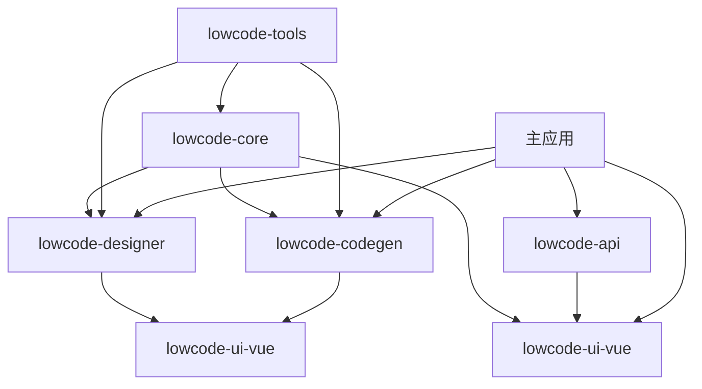

# SmartAbp 全栈低代码引擎独立发包架构 v2.0

## 🎯 **完整发现后的架构设计**

基于对所有低代码引擎文件的全面分析，重新设计包结构：

```
src/SmartAbp.Vue/
├── packages/                           # 📦 独立包目录
│   ├── lowcode-core/                   # 🔧 低代码引擎内核包
│   │   ├── src/
│   │   │   ├── kernel/                 # 引擎内核 (来自 src/lowcode/kernel/)
│   │   │   ├── plugins/                # 插件系统 (来自 src/lowcode/plugins/)
│   │   │   ├── runtime/                # 运行时系统 (来自 src/lowcode/runtime/)
│   │   │   ├── federation/             # 联邦化缓存 (来自 src/lowcode/federation/)
│   │   │   ├── adapters/              # 适配器 (来自 src/lowcode/adapters/)
│   │   │   ├── utils/                 # 工具函数 (来自 src/lowcode/utils/)
│   │   │   └── index.ts              # 统一导出
│   │   ├── package.json
│   │   └── README.md
│   │
│   ├── lowcode-designer/               # 🎨 可视化设计器包
│   │   ├── src/
│   │   │   ├── visual-designer/       # P2可视化设计器
│   │   │   │   ├── Canvas.vue         # (来自 src/views/codegen/designer/)
│   │   │   │   ├── Palette.vue
│   │   │   │   ├── Inspector.vue
│   │   │   │   └── VisualDesignerView.vue
│   │   │   ├── entity-designer/       # 后端实体设计器
│   │   │   │   └── EntityDesigner.vue # (来自 src/components/CodeGenerator/)
│   │   │   ├── components/            # 设计器核心组件
│   │   │   │   ├── DraggableComponent.vue
│   │   │   │   ├── PropertyInspector.vue
│   │   │   │   └── dragDropEngine.ts
│   │   │   ├── schema/               # Schema系统
│   │   │   │   ├── override.ts
│   │   │   │   ├── reader.ts
│   │   │   │   ├── merge.ts
│   │   │   │   └── exporter.ts
│   │   │   └── index.ts
│   │   ├── package.json
│   │   └── README.md
│   │
│   ├── lowcode-codegen/               # 🏗️ 代码生成引擎包
│   │   ├── src/
│   │   │   ├── generators/           # 代码生成器
│   │   │   │   ├── entity-generator.ts
│   │   │   │   ├── vue-generator.ts
│   │   │   │   └── abp-generator.ts
│   │   │   ├── templates/            # 代码模板 (来自 templates/)
│   │   │   │   ├── frontend/
│   │   │   │   ├── backend/
│   │   │   │   └── lowcode/
│   │   │   ├── exporters/            # 导出器
│   │   │   │   └── schemaExporter.ts
│   │   │   ├── tools/               # 工具函数 (来自 src/tools/)
│   │   │   │   ├── add-module.ts
│   │   │   │   ├── schema.ts
│   │   │   │   └── writers.ts
│   │   │   └── index.ts
│   │   ├── package.json
│   │   └── README.md
│   │
│   ├── lowcode-ui-vue/               # 🎭 Vue UI组件包
│   │   ├── src/
│   │   │   ├── views/               # 低代码视图组件
│   │   │   │   ├── LowCodeEngineView.vue
│   │   │   │   ├── ModuleWizardView.vue
│   │   │   │   └── Dashboard.vue    # (来自 src/views/CodeGenerator/)
│   │   │   ├── composables/         # Vue组合式函数
│   │   │   │   ├── useDragDrop.ts
│   │   │   │   └── useCodeGenerationProgress.ts
│   │   │   ├── stores/              # 状态管理
│   │   │   │   └── designer.ts
│   │   │   ├── types/               # 类型定义
│   │   │   │   ├── entity-designer.ts
│   │   │   │   └── manifest.ts
│   │   │   └── index.ts
│   │   ├── package.json
│   │   └── README.md
│   │
│   ├── lowcode-tools/                # 🛠️ 开发工具包
│   │   ├── src/
│   │   │   ├── incremental-generation/  # (来自 tools/incremental-generation/)
│   │   │   ├── plugins/                # 开发插件
│   │   │   │   └── moduleWizardDev.ts
│   │   │   ├── scripts/               # 构建脚本
│   │   │   └── cli/                   # 命令行工具
│   │   ├── package.json
│   │   └── README.md
│   │
│   └── lowcode-api/                  # 🌐 API客户端包
│       ├── src/
│       │   ├── clients/              # API客户端
│       │   │   └── code-generator.ts
│       │   ├── types/               # API类型定义
│       │   └── index.ts
│       ├── package.json
│       └── README.md
│
├── src/                              # 🏠 主应用（保留业务代码）
│   ├── views/                        # 业务视图（非低代码引擎）
│   ├── components/                   # 业务组件（非低代码引擎）
│   ├── router/                       # 路由配置
│   ├── stores/                       # 业务状态管理
│   └── main.ts                       # 应用入口
│
├── pnpm-workspace.yaml              # Monorepo配置
├── turbo.json                       # 构建编排配置
└── package.json                     # 根包配置
```

## 📊 **包依赖关系图**



## 🎯 **包功能职责**

| 包名 | 主要职责 | 核心文件来源 | 发布独立性 |
|------|----------|-------------|-----------|
| **lowcode-core** | 引擎内核、插件系统、运行时 | `src/lowcode/` | ⭐⭐⭐ 核心包 |
| **lowcode-designer** | 可视化设计器、实体设计器 | `src/components/designer/`, `src/views/codegen/designer/`, `src/components/CodeGenerator/` | ⭐⭐ 设计器包 |
| **lowcode-codegen** | 代码生成、模板系统 | `src/components/designer/schemaExporter.ts`, `templates/`, `src/tools/` | ⭐⭐ 生成器包 |
| **lowcode-ui-vue** | Vue UI组件、视图、状态管理 | `src/views/codegen/`, `src/stores/designer.ts`, `src/composables/` | ⭐ UI包 |
| **lowcode-tools** | 开发工具、CLI、插件 | `tools/`, `src/plugins/` | ⭐ 工具包 |
| **lowcode-api** | API客户端、类型定义 | `src/api/code-generator.ts`, `src/types/` | ⭐ API包 |

## 🚀 **分阶段迁移计划**

### 阶段1：核心包创建
- [x] 创建包目录结构
- [ ] 迁移 `lowcode-core` (最高优先级)
- [ ] 迁移 `lowcode-codegen` (第二优先级)

### 阶段2：UI包创建  
- [ ] 迁移 `lowcode-designer` (包含EntityDesigner)
- [ ] 迁移 `lowcode-ui-vue`

### 阶段3：工具包创建
- [ ] 迁移 `lowcode-tools`
- [ ] 迁移 `lowcode-api`

### 阶段4：集成测试
- [ ] 更新主应用导入
- [ ] 配置构建流程
- [ ] 端到端测试

## ✅ **答案：实体类拖拽开发组件已包含**

**是的！** `EntityDesigner.vue` (944行) 就是您询问的**后端实体类拖拽开发组件**，它将被迁移到 `packages/lowcode-designer/src/entity-designer/` 目录中。

这个组件提供了完整的拖拽式实体设计功能，是低代码引擎的重要组成部分。
