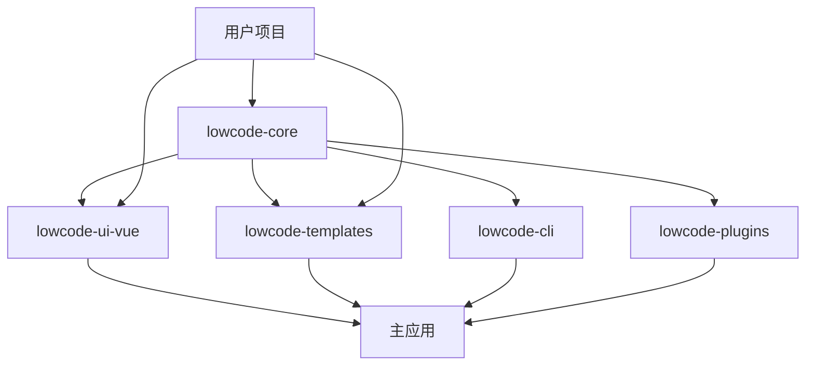

# 低代码引擎独立发包重构方案

## 🎯 目标架构

```
src/SmartAbp.Vue/
├── packages/                           # 📦 独立包目录
│   ├── lowcode-core/                   # 🔧 核心引擎包
│   │   ├── src/
│   │   │   ├── engine/                 # 拖拽引擎
│   │   │   ├── schema/                 # Schema系统
│   │   │   ├── codegen/               # 代码生成
│   │   │   ├── types/                 # 类型定义
│   │   │   └── index.ts              # 统一导出
│   │   ├── package.json
│   │   ├── tsconfig.json
│   │   └── README.md
│   │
│   ├── lowcode-ui-vue/                 # 🎨 Vue UI组件包
│   │   ├── src/
│   │   │   ├── components/            # 设计器组件
│   │   │   ├── views/                 # 设计器视图
│   │   │   ├── composables/           # Vue组合式函数
│   │   │   └── index.ts
│   │   ├── package.json
│   │   └── README.md
│   │
│   ├── lowcode-templates/              # 📋 模板包
│   │   ├── src/
│   │   │   ├── vue/                   # Vue模板
│   │   │   ├── react/                 # React模板
│   │   │   ├── angular/               # Angular模板
│   │   │   └── index.ts
│   │   ├── package.json
│   │   └── README.md
│   │
│   ├── lowcode-cli/                    # ⚡ CLI工具包
│   │   ├── src/
│   │   │   ├── commands/
│   │   │   ├── utils/
│   │   │   └── index.ts
│   │   ├── bin/
│   │   │   └── lowcode
│   │   ├── package.json
│   │   └── README.md
│   │
│   └── lowcode-plugins/                # 🔌 插件包
│       ├── src/
│       │   ├── abp/                   # ABP适配插件
│       │   ├── element-plus/          # Element Plus插件
│       │   ├── antd/                  # Ant Design插件
│       │   └── index.ts
│       ├── package.json
│       └── README.md
│
├── src/                                # 🏠 主应用代码
│   ├── views/
│   │   └── codegen/
│   │       └── VisualDesignerView.vue  # 使用@smartabp/lowcode-ui-vue
│   ├── stores/
│   └── ...
│
├── pnpm-workspace.yaml                 # workspace配置
├── package.json                        # 根package.json
└── README.md
```

## 📦 包依赖关系



## 🚀 发包策略

### 核心包 (@smartabp/lowcode-core)
- 拖拽引擎
- Schema系统
- 代码生成器
- 类型定义

### UI包 (@smartabp/lowcode-ui-vue)
- Vue组件
- 设计器界面
- 组合式函数

### 模板包 (@smartabp/lowcode-templates)
- 代码模板
- 框架适配

### CLI包 (@smartabp/lowcode-cli)
- 命令行工具
- 脚手架功能

### 插件包 (@smartabp/lowcode-plugins)
- 框架插件
- 第三方集成
