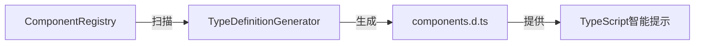

# TypeScript类型声明目录

## 📋 概述

此目录包含虚拟程序集的TypeScript类型声明文件，由`TypeDefinitionGenerator`自动生成。

## 📁 文件说明

### `components.d.ts`

**自动生成的组件类型声明文件**

- ⚠️ **警告**: 此文件自动生成，请勿手动修改！
- 🔄 **更新**: 开发时自动更新，构建时自动生成
- 🎯 **作用**: 为虚拟程序集提供完整的TypeScript类型支持

## 🔧 工作原理

### 1. 自动生成流程



### 2. Vite插件集成

在`vite.config.ts`中：

```typescript
import { viteTypeGenPlugin } from './vite/plugins/vite-plugin-type-gen'

export default defineConfig({
  plugins: [
    viteTypeGenPlugin({
      outputPath: 'types/components.d.ts',
      includeComments: true,
      watchInDev: true
    })
  ]
})
```

### 3. TypeScript配置

在`tsconfig.json`中：

```json
{
  "compilerOptions": {
    "types": ["./types/components.d.ts"]
  },
  "include": [
    "types/**/*.d.ts"
  ]
}
```

## 🎯 使用效果

### 智能提示

```typescript
import { Components } from '@smartabp/lowcode-shared'

// ✅ VSCode自动补全
const form = Components.SmartF...
//                      ↑
//                   自动提示: SmartForm

// ✅ 类型检查
const button: Component = Components.BaseButton  // ✅ 正确
const invalid = Components.NonExistent  // ❌ TypeScript错误
```

### Vue模板支持

```vue
<template>
  <!-- ✅ 直接使用组件名，有智能提示 -->
  <SmartForm />
  <DataTable />
  <BaseButton />
</template>
```

## 🔄 更新机制

### 开发环境

- **自动监听**: TypeDefinitionGenerator每5秒检查Registry变化
- **实时更新**: 组件注册/删除时自动更新类型声明
- **HMR支持**: 类型更新触发TypeScript服务器刷新

### 生产构建

- **构建时生成**: `npm run build`时自动生成最新类型
- **版本控制**: 类型文件应提交到Git（便于团队协作）

## 📊 类型声明结构

```typescript
// 1. 模块声明
declare module '@smartabp/lowcode-shared' {
  // 2. 全局组件接口
  export interface GlobalComponents {
    ComponentName: Component
  }
  
  // 3. 虚拟程序集导出
  export const Components: GlobalComponents
}

// 4. Vue运行时增强
declare module '@vue/runtime-core' {
  export interface GlobalComponents {
    ComponentName: typeof Components.ComponentName
  }
}
```

## 🛠️ 维护指南

### ✅ 推荐做法

1. **不要手动修改** `components.d.ts`
2. **提交到Git** 保持团队类型同步
3. **定期检查** 确保生成器正常工作

### ❌ 禁止操作

1. ❌ 手动编辑自动生成的文件
2. ❌ 添加到`.gitignore`（会导致团队成员缺少类型）
3. ❌ 删除类型声明文件

## 🔍 故障排查

### 问题1: 类型不更新

```bash
# 解决方案1：手动触发生成
npm run type-gen

# 解决方案2：重启TypeScript服务器
VSCode: Cmd+Shift+P → "TypeScript: Restart TS Server"

# 解决方案3：清除缓存重新构建
npm run clean && npm run build
```

### 问题2: 智能提示不工作

```typescript
// 检查tsconfig.json是否包含types配置
{
  "compilerOptions": {
    "types": ["./types/components.d.ts"]
  }
}
```

### 问题3: 组件不在类型声明中

```typescript
// 1. 确认组件已注册
globalComponentRegistry.has('ComponentName')  // 应为true

// 2. 触发类型重新生成
import { generateTypes, globalComponentRegistry } from '@smartabp/lowcode-shared'
await generateTypes(globalComponentRegistry, 'types/components.d.ts')
```

## 📚 参考资料

- [TypeScript Declaration Files](https://www.typescriptlang.org/docs/handbook/declaration-files/introduction.html)
- [Vite Plugin API](https://vitejs.dev/guide/api-plugin.html)
- [Vue3 Global Components Types](https://vuejs.org/guide/typescript/composition-api.html#typing-component-props)

---

**维护者**: SmartAbp团队  
**版本**: 2.0.0  
**最后更新**: 2025-10-09

