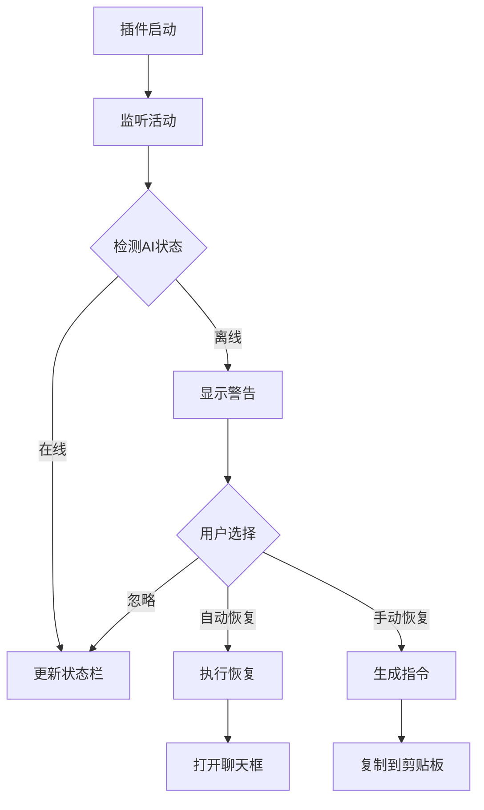

# 🛡️ AI Guardian - Cursor插件

专业的AI大模型断线检测与自动恢复插件

## ✨ 功能特性

- 🔍 **智能检测**: 实时监控AI活动状态
- 🚨 **断线预警**: 90秒无活动自动报警
- 🔄 **自动恢复**: 一键自动发送恢复指令
- 📊 **状态显示**: 状态栏实时显示AI在线状态
- 📝 **活动记录**: 详细记录AI交互历史

## 🚀 快速开始

### 安装方式

1. **开发模式安装**:
   ```bash
   cd tools/ai-guardian/cursor-extension
   npm install
   npm run compile
   ```

2. **在Cursor中加载**:
   - 按 `F1` 打开命令面板
   - 输入 `Extensions: Install from VSIX`
   - 选择编译后的插件文件

### 基本使用

1. **自动启动**: 插件会在Cursor启动时自动激活
2. **查看状态**: 右下角状态栏显示AI在线状态
3. **手动恢复**: 使用 `Ctrl+Shift+P` → `AI Guardian: 手动恢复AI`

## 🎯 核心功能

### 智能监控
- 监听文档编辑活动
- 检测AI命令执行
- 追踪窗口焦点变化

### 自动恢复
```typescript
// 检测到断线后自动执行
1. 打开Cursor聊天框
2. 复制恢复指令到剪贴板
3. 提示用户发送恢复消息
```

### 状态显示
- 🟢 `$(pulse) AI在线 (30s)` - AI正常工作
- 🟡 `$(warning) AI离线 (120s)` - AI可能断线

## ⚙️ 配置选项

```json
{
  "aiGuardian.enabled": true,           // 启用AI守护
  "aiGuardian.checkInterval": 30,       // 检测间隔（秒）
  "aiGuardian.offlineThreshold": 90,    // 离线阈值（秒）
  "aiGuardian.autoRecover": true        // 自动恢复
}
```

## 🔧 命令列表

| 命令 | 功能 |
|------|------|
| `AI Guardian: 启动AI守护` | 开始监控AI状态 |
| `AI Guardian: 停止AI守护` | 停止监控 |
| `AI Guardian: 查看AI状态` | 显示详细状态信息 |
| `AI Guardian: 手动恢复AI` | 生成恢复指令 |

## 📊 工作原理



## 🛠️ 开发指南

### 项目结构
```
cursor-extension/
├── package.json          # 插件配置
├── tsconfig.json         # TypeScript配置
├── src/
│   └── extension.ts      # 主要逻辑
└── out/                  # 编译输出
    └── extension.js
```

### 编译命令
```bash
npm run compile          # 编译TypeScript
npm run watch           # 监听模式编译
```

### 调试方法
1. 在Cursor中按 `F5` 启动调试
2. 在新窗口中测试插件功能
3. 查看调试控制台输出

## 📈 版本历史

- **v1.0.0**: 初始版本
  - 基础断线检测
  - 自动恢复功能
  - 状态栏显示

## 🤝 贡献指南

1. Fork 项目
2. 创建功能分支
3. 提交更改
4. 发起 Pull Request

## 📄 许可证

MIT License - 详见 LICENSE 文件

---

**🎯 让AI永不断线！**
